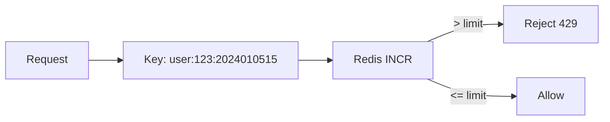
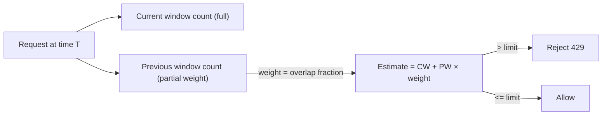
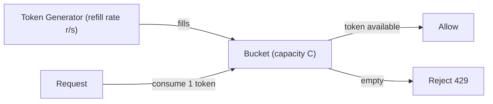
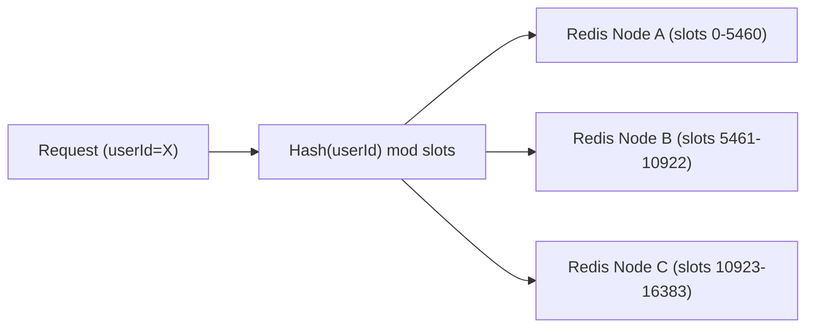
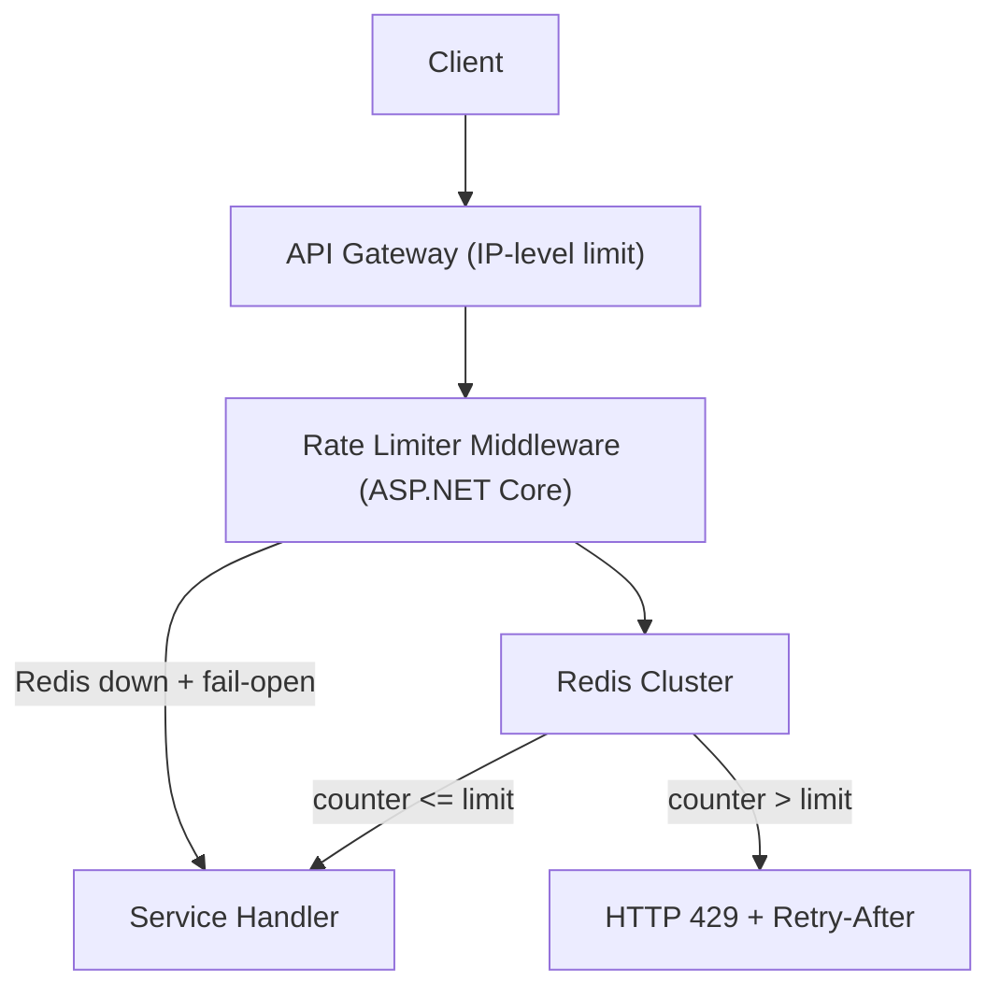

# 2. Design a Rate Limiter

> **TL;DR:** Intercept requests at gateway or service layer, track a per-identity counter using an atomic Redis operation, and reject excess traffic with HTTP 429 + `Retry-After` before it reaches downstream services.

**Interview weight:** P0 — tests distributed counters, algorithm trade-offs, atomicity, failure modes, and is a classic machine-coding-round target.

---

## 1. Requirements

### Functional
- Limit requests per identity (user ID / API key / IP) per time window.
- Support multiple tiers: per-user, per-IP, per-API-key, global endpoint limit.
- Return `HTTP 429` with `Retry-After` and `X-RateLimit-*` headers on violation.
- Soft limits (warn) and hard limits (block).

### Non-Functional
- Add < 5 ms overhead to every request.
- Work correctly across N service replicas (distributed counter).
- Survive Redis outage with a configurable fail-open / fail-closed policy.
- Hot-path safe: no distributed lock per request.

### Out of Scope
- Adaptive rate limiting (ML-based anomaly detection), billing metering, DDoS mitigation (network layer).

---

## 2. Scale Estimation

| Metric | Value |
|--------|-------|
| RPS handled | 50 K RPS |
| Unique identities per minute | ~1 M |
| Redis ops per request | 1–2 (INCR + optional EXPIRE) |
| Redis RPS needed | ~100 K/s (well within single Redis 200 K/s) |
| Memory per counter | ~50 bytes; 1 M counters ≈ 50 MB — trivial |

---

## 3. Where to Place the Rate Limiter

| Location | Pros | Cons |
|----------|------|------|
| **Client-side** | No network hop | Easily bypassed |
| **API Gateway** (Azure API Management, Nginx) | Single choke-point, off-the-shelf rules | Gateway becomes bottleneck; can't share app-level context |
| **Service-level middleware** (ASP.NET Core `RateLimiterMiddleware`) | App context available (auth'd user ID) | Duplicated logic across services |
| **Sidecar / service mesh** (Envoy, Dapr) | Language-agnostic; centrally configured | Ops complexity; extra hop |

**Best practice for senior design:** Put **coarse IP-based limiting at the Gateway** (block scanners/bots early) and **fine-grained per-user / per-API-key limiting at the service** (enforces business rules). Both layers run independently.

---

## 4. Algorithm Comparison

| Algorithm | Accuracy | Memory | Burst Handling | Complexity |
|-----------|----------|--------|----------------|------------|
| **Fixed Window Counter** | Low at window edge (2× burst possible) | O(1) per identity | Allows bursts at boundary | Trivial |
| **Sliding Window Log** | Exact | O(requests in window) — high | No bursts | Simple logic, expensive memory |
| **Sliding Window Counter** | Good (~0.003% error) | O(1) per identity | Smooth | Slightly more math |
| **Token Bucket** | Good | O(1) | Allows controlled bursts (bucket depth) | Moderate |
| **Leaky Bucket** | Good | O(queue depth) | Smooths bursts, queues excess | Moderate |

### Fixed Window Counter



Window key = `ratelimit:{id}:{window_start_epoch_truncated}`. Set `EXPIRE` = window size on first INCR.

**Boundary burst problem:** A user can send `limit` requests at 23:59:59 and `limit` more at 00:00:01 — 2× burst in 2 seconds. Fixed by sliding window.

### Sliding Window Counter (Hybrid — recommended)



`estimate = current_count + previous_count × (1 - elapsed_in_window / window_size)`

Uses only 2 Redis keys; error < 0.003% in practice. Best accuracy/memory balance.

### Token Bucket



- **Burst:** up to `C` requests immediately if bucket is full.
- **Steady state:** at most `r` requests/second.
- Implemented in Redis: store `{tokens, last_refill_ts}` — update on each request with a Lua script.

### Leaky Bucket

Queue requests at rate R; process at constant outflow rate. Excess requests that overflow the queue are dropped. Good for smoothing spiky upstream traffic into a stable downstream rate (payment processors, SMS gateways).

---

## 5. Distributed Rate Limiting with Redis

### Atomic INCR + EXPIRE (Fixed Window)

```lua
-- Lua script: atomic check-and-increment
local key = KEYS[1]
local limit = tonumber(ARGV[1])
local window = tonumber(ARGV[2])
local current = redis.call("INCR", key)
if current == 1 then
    redis.call("EXPIRE", key, window)
end
return current
```

Single round-trip; atomic — no race condition between INCR and EXPIRE.

### Sliding Window Counter in Redis

```lua
local curr_key = KEYS[1]  -- current window
local prev_key = KEYS[2]  -- previous window
local limit = tonumber(ARGV[1])
local window = tonumber(ARGV[2])
local elapsed = tonumber(ARGV[3])  -- seconds elapsed in current window

local prev = tonumber(redis.call("GET", prev_key) or 0)
local curr = tonumber(redis.call("GET", curr_key) or 0)
local estimate = curr + prev * (1 - elapsed / window)
if estimate >= limit then return 0 end  -- reject

redis.call("INCR", curr_key)
redis.call("EXPIRE", curr_key, window * 2)
return 1  -- allow
```

### Race Conditions and Clock Skew

- **Race condition:** Solved by Lua script (executed atomically on Redis).
- **Clock skew across pods:** All pods use Redis server time via `TIME` command — no local clock drift.
- **Async counter propagation (eventual):** Some systems sync counters across Redis shards asynchronously, accepting slight over-counting. Acceptable for approximate limits; not for billing.

### Cell-Based Routing (Counter Locality)

Route a user's requests to a consistent Redis node using a hash of the user ID (consistent hashing). Eliminates inter-shard sync: one user's counter lives on exactly one node. Redis Cluster handles this automatically with hash slots.



---

## 6. Tiers and Headers

| Tier | Identifier | Typical Limit | Window |
|------|------------|---------------|--------|
| Global endpoint | `endpoint:/api/pay` | 10 K/min | 1 min |
| Per API key | `apikey:{key}` | 1 000/min | 1 min |
| Per authenticated user | `user:{userId}` | 100/min | 1 min |
| Per IP (unauthenticated) | `ip:{ip}` | 20/min | 1 min |

**Response headers on every request:**

```
HTTP/1.1 200 OK
X-RateLimit-Limit: 100
X-RateLimit-Remaining: 73
X-RateLimit-Reset: 1715000060   (Unix epoch when window resets)
```

**On 429:**

```
HTTP/1.1 429 Too Many Requests
Retry-After: 47
X-RateLimit-Limit: 100
X-RateLimit-Remaining: 0
```

---

## 7. Soft vs Hard Limits

| Mode | Behaviour | Use Case |
|------|-----------|----------|
| **Hard limit** | Reject at threshold; return 429 | APIs requiring strict enforcement (billing, SMS) |
| **Soft limit** | Allow through; add `X-RateLimit-Warning` header; alert | Gradual degradation; notify client without breaking |
| **Throttle (leaky bucket)** | Queue request; respond slowly | Smooth load on downstream; better UX than hard 429 |

---

## 8. Failure Mode Analysis

| Redis state | Fail-open | Fail-closed |
|-------------|-----------|-------------|
| Redis unreachable | Allow all requests | Reject all requests (503) |
| Security implication | **Vulnerable to DoS/abuse** during outage | **Unavailable to legitimate users** during outage |
| **Recommended default** | Yes — availability > security for most APIs | Only for high-security endpoints (payment, auth) |

Implement via circuit breaker: on Redis connection failure, open circuit and either allow or deny based on policy configuration.

---

## 9. High-Level Architecture



---

## 10. C# In-Memory Rate Limiter (Machine-Coding Answer)

Compact, working, thread-safe sliding-window counter for a single process:

```csharp
public class SlidingWindowRateLimiter
{
    private readonly int _limit;
    private readonly TimeSpan _window;
    // key -> (windowStart, currentCount, previousCount)
    private readonly ConcurrentDictionary<string, Entry> _state = new();

    public SlidingWindowRateLimiter(int limit, TimeSpan window)
        => (_limit, _window) = (limit, window);

    public bool IsAllowed(string key)
    {
        var now = DateTimeOffset.UtcNow;
        var entry = _state.GetOrAdd(key, _ => new Entry(now, 0, 0));

        lock (entry)
        {
            var elapsed = now - entry.WindowStart;
            if (elapsed >= _window)
            {
                // Slide: previous = current, reset current
                entry.PreviousCount = elapsed < _window * 2 ? entry.CurrentCount : 0;
                entry.CurrentCount = 0;
                entry.WindowStart = now;
                elapsed = TimeSpan.Zero;
            }
            var weight = 1.0 - elapsed / _window;
            var estimate = entry.CurrentCount + entry.PreviousCount * weight;
            if (estimate >= _limit) return false;

            entry.CurrentCount++;
            return true;
        }
    }

    private class Entry(DateTimeOffset start, int curr, int prev)
    {
        public DateTimeOffset WindowStart = start;
        public int CurrentCount = curr;
        public int PreviousCount = prev;
    }
}
```

Usage in ASP.NET Core middleware:

```csharp
app.Use(async (ctx, next) =>
{
    var key = ctx.User.Identity?.Name ?? ctx.Connection.RemoteIpAddress?.ToString() ?? "anon";
    if (!limiter.IsAllowed(key))
    {
        ctx.Response.StatusCode = 429;
        ctx.Response.Headers["Retry-After"] = "60";
        await ctx.Response.WriteAsync("Rate limit exceeded");
        return;
    }
    await next(ctx);
});
```

For production distributed use, replace `ConcurrentDictionary` operations with the Redis Lua script from §5.

---

## 11. Bottlenecks, Failure Modes & Trade-offs

| Bottleneck | Symptom | Mitigation |
|------------|---------|------------|
| Redis single node | SPOF; ~200 K ops/s ceiling | Redis Cluster (hash slots); read replicas |
| Lua script serialization on hot key | High latency for viral user/IP | Sharded counter: split key into N sub-keys, sum on read |
| Clock skew across pods | Inaccurate window boundaries | Use Redis `TIME` command, not local clock |
| Large sliding window log memory | OOM for log-based algorithm | Switch to sliding window counter (O(1) memory) |
| Counter reset storm at window boundary | Thundering herd of unthrottled requests | Stagger window start times with jitter |

---

## 12. Follow-up Extensions

- **Dynamic limits:** Store limits in config per API key in Cosmos DB; cache in-process for 60 s.
- **Distributed tracing:** Emit span attributes for rate-limit decisions (allow/deny, tier, remaining).
- **Cost-based limiting:** Charge variable tokens per endpoint (e.g. `/ai/complete` costs 10 tokens vs `/health` costs 1).
- **Penalty box:** After 3× 429 violations in 5 min, block the identity for 1 hour (stored in Redis with TTL).

---

## Interview Questions

**Q1. What is the fixed window boundary problem?**
A: A user can send `limit` requests at 23:59:59 and another `limit` at 00:00:01, effectively sending 2× the limit in 2 seconds. Sliding window eliminates this by weighting the overlap of the previous window.

**Q2. Why use a Lua script for Redis operations?**
A: Lua scripts execute atomically on the Redis server — INCR and EXPIRE happen in one uninterruptible operation. Without Lua, a race condition exists between the two commands where another client could INCR between your INCR and EXPIRE, resulting in a key that never expires.

**Q3. What is the sliding window counter algorithm and why is it a good default?**
A: Combine two adjacent fixed-window counts: `estimate = current + previous × (1 - elapsed/window)`. Accuracy error < 0.003%; uses O(1) memory (two Redis integers per identity); no log of individual request timestamps. Best balance of accuracy, memory, and complexity.

**Q4. Fail-open vs fail-closed — which do you pick and why?**
A: Default to **fail-open** for general APIs (availability matters more than strict enforcement during outages). Use **fail-closed** for sensitive endpoints (payment, auth token issuance) where unthrottled access is a security risk. Implement via a circuit breaker flag on the Redis connection pool.

**Q5. How does token bucket handle bursts differently from fixed window?**
A: Token bucket allows a burst of up to `C` (bucket capacity) requests immediately when the bucket is full. The refill rate `r` determines the steady-state allowance. Fixed window allows exactly `limit` per window — no burst shaping. Token bucket is better for clients that batch work (e.g. SDK uploading many events at startup).

**Q6. How would you handle a user whose traffic is spread across multiple API Gateway nodes?**
A: Counters must be in **shared Redis** (not in-process per node). With Redis Cluster, consistent hashing routes a given user's key to exactly one node — no cross-node sync needed. Alternatively, sticky routing (Azure APIM policies) can pin a user to one gateway node, but this creates hotspots.

**Q7. How do you implement per-endpoint AND per-user limits simultaneously?**
A: Check both keys in a single Lua script that accepts an array of `(key, limit)` pairs. If **any** limit is exceeded, return 429. Order matters: check cheapest (in-memory) limits first. Return the tightest `Retry-After` across all violated limits.

**Q8. What is a sharded counter and when do you need it?**
A: Split a single Redis key into N shards: `ratelimit:{id}:shard:{rand(N)}`. On INCR, pick a random shard. On read, SUM all shards. Reduces write contention on a single key for extremely hot identities (viral API keys). The cost: reading the total requires N Redis GET commands.

**Q9. How do you test a rate limiter accurately?**
A: Unit test: mock time provider; inject synthetic timestamps to simulate window sliding. Integration test: use `StackExchange.Redis` against a real Redis (or Docker container); fire N+1 requests and assert the (N+1)th returns 429 with correct `Retry-After`. Load test: use k6 or NBomber to confirm no requests slip through under concurrency.

**Q10. What headers should a well-behaved rate-limiter return?**
A: `X-RateLimit-Limit` (tier limit), `X-RateLimit-Remaining` (remaining in window), `X-RateLimit-Reset` (epoch when window resets), and on 429: `Retry-After` (seconds until retry is safe). Follow RFC 6585 for 429 and the IETF draft `draft-ietf-httpapi-ratelimit-headers` for `RateLimit-*` headers.

**Q11. How does the leaky bucket differ from token bucket?**
A: Leaky bucket processes requests at a constant rate regardless of arrival pattern — excess is queued (up to queue depth) then dropped. Token bucket allows bursts (up to bucket capacity) while enforcing average rate. Leaky bucket is better for smoothing output to a rate-limited downstream; token bucket is better for client-facing APIs that should tolerate occasional bursts.

**Q12. At 5 M RPS, is a single Redis Cluster enough?**
A: Redis Cluster with 6 nodes (3 primary + 3 replica) handles ~1.2 M ops/s. At 5 M RPS with 2 Redis ops per request = 10 M ops/s — you'd need either (a) multiple Redis Clusters behind a proxy, (b) in-process pre-filtering (reject obviously banned IPs without hitting Redis), or (c) probabilistic counting (Count-Min Sketch) for approximate rate limiting with far lower Redis pressure.

---

## Quick Recap

- **Sliding window counter** (2 Redis integers + Lua) is the best default: O(1) memory, < 0.003% error, atomic.
- **Token bucket** when clients need burst tolerance; **leaky bucket** when smoothing output rate matters.
- **Redis Lua script** = atomic INCR + EXPIRE in one call; eliminates race conditions.
- **Consistent hashing** (Redis Cluster) ensures one user's counter lives on one node — no cross-shard sync.
- **Fail-open** by default; **fail-closed** only for payment/auth endpoints.
- Return `X-RateLimit-*` and `Retry-After` on every response — required for well-behaved clients.
- **Two layers:** coarse IP-limit at API Gateway + fine-grained user/key-level limit at service middleware.
- In C# use `IRateLimiter` (ASP.NET Core 7+ built-in) or the Redis Lua approach for distributed enforcement.
