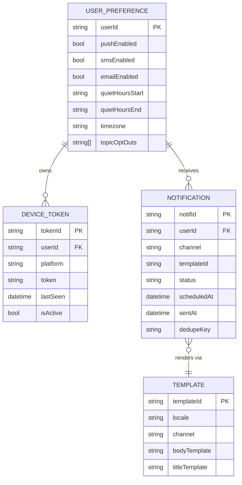
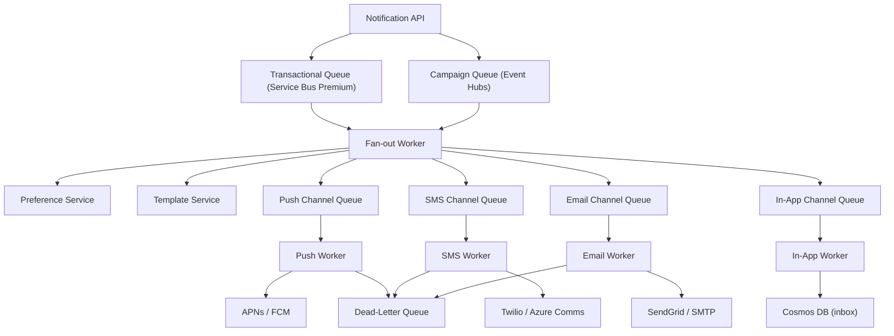
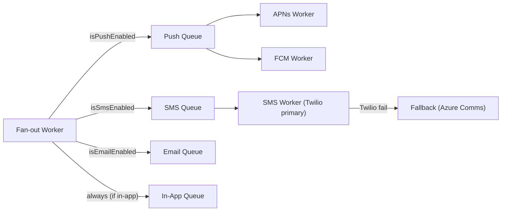
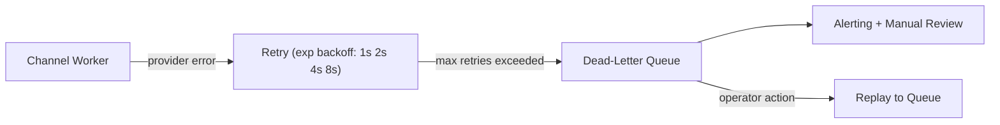

# 3. Design a Notification System

> **TL;DR:** Fan out transactional and campaign notifications across push (APNs/FCM), SMS, email, and in-app channels through a priority-queued, multi-worker pipeline with provider abstraction, idempotent delivery, and per-user preference enforcement.

**Interview weight:** P0 — tests fan-out at scale, queue design, multi-channel orchestration, idempotency, and failure handling.

---

## 1. Requirements

### Functional
- Send notifications via push (iOS APNs / Android FCM), SMS, email, in-app, and webhook.
- Per-user channel preferences and opt-outs (global and per-topic).
- Quiet hours (do-not-disturb) per user time zone.
- Transactional notifications (immediate) and bulk campaign notifications (scheduled).
- Template service with localization (i18n).
- Delivery tracking: sent, delivered, failed, opened.
- Deduplication: a user must never receive the same notification twice.

### Non-Functional
- Transactional: deliver within 5 s of trigger.
- Campaign: fan-out to 50 M users within 30 min (≈ 28 K sends/s sustained).
- At-least-once delivery per channel (idempotent retry safe).
- Provider failover: if APNs is down, retry via FCM or alternative push provider.

### Out of Scope
- In-app notification UI rendering, billing per SMS, A/B testing of message content.

---

## 2. Scale Estimation

| Metric | Calculation | Value |
|--------|-------------|-------|
| DAU receiving notifications | 10 M | 10 M/day |
| Transactional sends | 50 M/day | ~580 RPS avg |
| Campaign peak (50 M in 30 min) | 50 M ÷ 1 800 | ~28 K sends/s |
| Push tokens stored | 10 M users × 2 devices | ~20 M tokens |
| Token storage | 20 M × 200 B | ~4 GB |
| Preference records | 10 M × 500 B | ~5 GB |

---

## 3. API Design

| Method | Endpoint | Purpose |
|--------|----------|---------|
| `POST` | `/api/v1/notifications` | Trigger transactional notification |
| `POST` | `/api/v1/campaigns` | Schedule campaign notification |
| `GET` | `/api/v1/users/{id}/notifications` | Fetch in-app notification inbox |
| `PUT` | `/api/v1/users/{id}/preferences` | Update channel opt-in/out and quiet hours |
| `POST` | `/api/v1/notifications/{id}/events` | Ingest delivery receipt from provider callback |

---

## 4. Data Model

---

## 5. High-Level Architecture

**Request path (transactional):**
1. Caller POSTs notification with `dedupeKey` to Notification API.
2. API writes to Azure Service Bus Transactional Queue (ordered, low-latency).
3. Fan-out Worker reads message, calls Preference Service (cached in Redis) to check opt-ins + quiet hours.
4. Fan-out Worker calls Template Service to render localized content.
5. Fan-out Worker publishes one message per enabled channel to that channel's dedicated queue.
6. Per-channel workers pick up messages and call third-party providers.
7. Provider callbacks update delivery status in Cosmos DB.

**Campaign path:**
- Publisher POSTs campaign spec (audience filter, schedule, templateId) to Campaign API.
- Campaign Scheduler (Azure Function Timer) reads eligible users in batches from Cosmos DB at schedule time.
- Batches fan into Event Hubs (partitioned by userId); Fan-out Worker processes at 28 K/s.

---

## 6. Deep Dives

### 6.1 Multi-Channel Architecture

### 6.2 Idempotency and Deduplication

- Caller supplies `dedupeKey` (e.g. `orderId:userId:channel`).
- Fan-out Worker checks Redis `SET NX dedupeKey 1 EX 86400` before processing.
  - If key already exists → skip (notification already enqueued).
  - If SET succeeds → process and record.
- Channel workers also check `dedupeKey` before calling provider — handles retry-loop duplicates.
- Cosmos DB notification record has `dedupeKey` as unique index — last-resort guard.

### 6.3 Retry Strategy and Dead-Letter Queue

- Max 5 retries with exponential backoff (1 s, 2 s, 4 s, 8 s, 16 s) using Service Bus `DeliveryCount`.
- On final failure, message lands in DLQ with failure reason.
- DLQ processor sends alert to on-call; operator can replay or dismiss.

### 6.4 At-Least-Once vs At-Most-Once by Channel

| Channel | Delivery Guarantee | Why |
|---------|-------------------|-----|
| **Push (APNs/FCM)** | At-least-once | Provider may drop; retry until ack; deduplication on `apns-id` / FCM message ID prevents double-display |
| **SMS** | At-most-once | Duplicate SMS is visible to user and causes frustration/billing issues; check Twilio idempotency key |
| **Email** | At-least-once | Email clients dedup by `Message-ID` header |
| **In-app** | Exactly-once (app-side dedup) | Stored in DB; client fetches by ID; idempotent upsert |
| **Webhook** | At-least-once | Caller must be idempotent; we send until 2xx ack |

### 6.5 Rate Limiting Per User

- Even with campaign fan-out, a user should not receive > N notifications per hour per channel.
- Redis sliding window counter per `userId:channel:hour`.
- If over limit: delay message to next window (requeue with `ScheduledEnqueueTime`) rather than drop.

### 6.6 Bulk Campaign vs Transactional Comparison

| Aspect | Transactional | Campaign |
|--------|--------------|---------|
| Trigger | API call (real-time event) | Scheduled batch |
| SLA | < 5 s | < 30 min for 50 M |
| Queue | Service Bus (ordered, low-latency) | Event Hubs (high-throughput partitioned) |
| Audience | Single user | Millions (filter expression) |
| Priority | High | Low (preempted by transactional) |
| Rate limiting | Check per-user limit | Enforced during fan-out |
| Opt-out handling | Real-time preference lookup | Pre-filter audience at campaign scheduling time |

### 6.7 Device Token Management

- Push tokens expire when user uninstalls app or re-registers.
- On APNs feedback service "invalid token" response → mark token `isActive=false` in Cosmos DB.
- FCM returns `NotRegistered` → same cleanup.
- Background sweeper (nightly) removes tokens not seen in 90 days.
- Users with multiple devices: fan-out to all active tokens; count as one notification for quota.

### 6.8 Scheduled and Time-Zone-Aware Notifications

- Store `scheduledAt` as UTC; Fan-out Worker uses `User.timezone` from Preference Service to compute local time.
- Quiet hours check: convert `scheduledAt` to user's local time; if in quiet window, delay until quiet window ends.
- Azure Service Bus `ScheduledEnqueueTime` used to delay messages without polling.

---

## 7. Bottlenecks, Failure Modes & Trade-offs

| Bottleneck | Symptom | Mitigation |
|------------|---------|------------|
| Fan-out Worker at campaign scale | Queue consumer lag; late deliveries | Scale out workers; Event Hubs auto-partition; pre-filter audience |
| Preference Service cold read | High latency on first lookup | Redis cache (TTL = 1 h); warm on user login |
| Provider outage (APNs/FCM) | Push delivery failure spike | Provider abstraction with failover; exponential backoff + DLQ |
| Template rendering per message | CPU spike at campaign start | Pre-render templates per locale into cache before campaign fires |
| Invalid device tokens accumulating | Wasted provider API calls | Feedback-service loop + nightly cleanup job |
| SMS duplicate from retry | User sees double SMS | Twilio idempotency key = `dedupeKey`; at-most-once for SMS |

---

## 8. Scaling the Design

- **Horizontal scale:** Each channel worker is stateless; add instances via Azure Container Apps autoscale on Service Bus queue depth metric.
- **Event Hubs partitioning:** Partition campaign messages by `userId % partitionCount`; ensures one user's messages are processed in order by one worker.
- **Multi-region:** Deploy Fan-out + Channel Workers in primary + secondary regions. Service Bus Geo-Disaster Recovery handles failover.
- **Cost control:** Push > Email > SMS in cost per send. Prefer push; fall back to in-app for non-urgent. Suppress email if push delivered (delivery receipt tracking).

---

## 9. Follow-up Extensions

- **Read receipts / open tracking:** Email open pixel; push open callback via APNs `background` mode; in-app read timestamp.
- **A/B testing:** Campaign service routes audience into buckets; different templateId per bucket; compare open rates.
- **Preference centre UI:** React SPA calling `/users/{id}/preferences` — users manage per-topic opt-outs.
- **Analytics dashboard:** Click-through rates, delivery rates per channel, bounce/unsubscribe rates.

---

## Interview Questions

**Q1. How do you ensure a user never receives the same notification twice?**
A: Three layers: (1) `dedupeKey` Redis `SET NX` in Fan-out Worker before enqueuing; (2) `dedupeKey` check in Channel Worker before provider call; (3) Cosmos DB unique index on `dedupeKey` as final guard. The Redis check handles > 99% of duplicates without DB round-trip.

**Q2. How does the fan-out scale to 50 M users in 30 minutes?**
A: Campaign audience is streamed via Event Hubs (up to 20 MB/s per partition, 100+ partitions). Fan-out Workers scale horizontally; each partition is processed by one worker concurrently. Preference lookups are cached in Redis so each message costs one Redis GET, not a Cosmos DB read. Template rendering is pre-computed. At 28 K/s per channel × 5 channels = 140 K provider API calls/s — distribute across channel worker pools.

**Q3. How do you handle quiet hours across thousands of time zones?**
A: Preference Service stores `quietHoursStart`, `quietHoursEnd`, and IANA `timezone` per user. Fan-out Worker converts `scheduledAt` UTC to user local time. If in quiet window, reschedule using `Service Bus ScheduledEnqueueTime = quietHoursEnd (local) converted to UTC`. No polling loop needed.

**Q4. What happens if a push provider (APNs) is down for 30 minutes?**
A: Channel Worker retries with exponential backoff; after max retries, messages go to DLQ. Alert fires for on-call. On provider recovery, DLQ processor replays messages. Optionally: after 3 failed push attempts, fall back to in-app notification (always available since it's a DB write).

**Q5. How do you handle per-user rate limiting on transactional notifications?**
A: Redis sliding window counter keyed `ratelimit:notif:{userId}:{channel}:{windowStart}`. If limit exceeded, requeue message with `ScheduledEnqueueTime` set to the start of the next window — the message isn't dropped, just delayed.

**Q6. Why use separate queues per channel rather than one shared queue?**
A: Channel-specific queues allow independent scaling (SMS is slower and more expensive; push is fast), independent retry policies, independent DLQs, and prevent a slow SMS provider from backing up push messages. Isolation is the key design principle.

**Q7. How does the provider abstraction work?**
A: Define `INotificationProvider` interface with `SendAsync(Notification n): Task<ProviderResult>`. Concrete implementations: `ApnsProvider`, `FcmProvider`, `TwilioProvider`, `SendGridProvider`. A `ProviderFactory` selects primary based on channel + platform; has a fallback chain. Channel Worker only depends on the interface — swapping providers requires no worker change.

**Q8. What is the difference between transactional and campaign queues and why have both?**
A: Transactional uses Azure Service Bus (ordered, sessions, < 5 s SLA). Campaign uses Event Hubs (high-throughput, partitioned, sequential within partition). Service Bus has higher per-message overhead unsuitable for 28 K/s fan-out. Event Hubs handles millions of events/s with batch consumers. Mixing them on one queue would let campaign traffic starve transactional messages.

**Q9. How do you track delivery receipts?**
A: APNs provides a push feedback service and delivery receipts via HTTP/2. FCM provides delivery reports. Twilio sends webhooks to our `/notifications/{id}/events` endpoint. Email uses tracking pixels and unsubscribe webhooks. All receipts write to Cosmos DB updating `notification.status`. Analytics queries Cosmos (or a downstream pipeline) for aggregated delivery stats.

**Q10. How would you add a "send only if user hasn't already seen a newer version" feature?**
A: Add a `version` or `supersededBy` field to the notification record. Fan-out Worker checks if a newer notification with the same `dedupeScope` has been sent before processing. This is useful for order-status updates: if order is already "delivered", suppress the "shipped" notification.

**Q11. How do you prevent notification spam from a compromised API key?**
A: Global rate limit at API Gateway per API key. Per-user daily notification budget enforced in Fan-out Worker (Redis counter). Unusual spike detection via Azure Monitor alert on Event Hubs lag + Service Bus send rate anomalies. Circuit breaker on Fan-out Worker: if it detects > 10× normal volume, pause and alert.

---

## Quick Recap

- **Fan-out Worker** enforces preferences, quiet hours, deduplication, and template rendering before routing to per-channel queues.
- **Deduplication:** Redis `SET NX` (fast, primary) + Cosmos DB unique index (fallback) using caller-supplied `dedupeKey`.
- **SMS = at-most-once; Push = at-least-once** with provider-side dedup; in-app = idempotent DB upsert.
- **Transactional path:** Service Bus (< 5 s SLA); **Campaign path:** Event Hubs (28 K/s, partitioned by userId).
- **Retry:** exponential backoff × 5 → DLQ → alert; never silently drop.
- **Provider abstraction** (`INotificationProvider`) enables failover between APNs → FCM, Twilio → Azure Comms without worker changes.
- **Quiet hours:** requeue with `ScheduledEnqueueTime` to end of quiet window — no polling.
- **Scale-out:** all workers stateless; autoscale on queue depth; preference cache in Redis absorbs read load.
