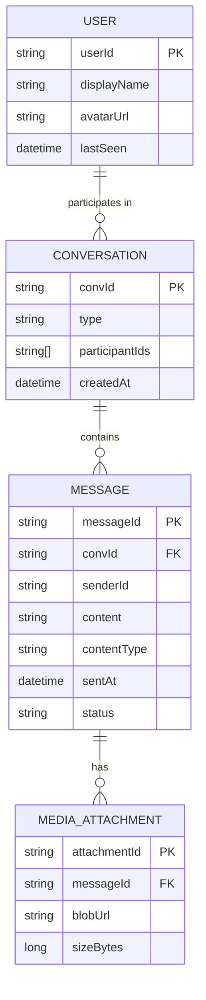
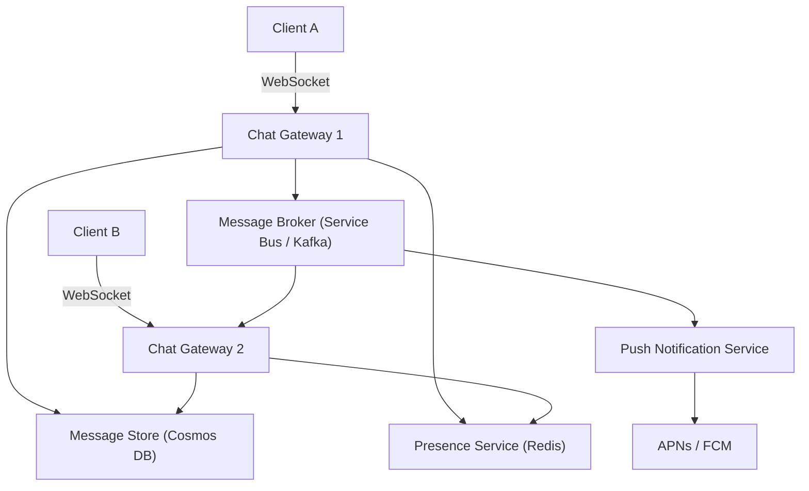
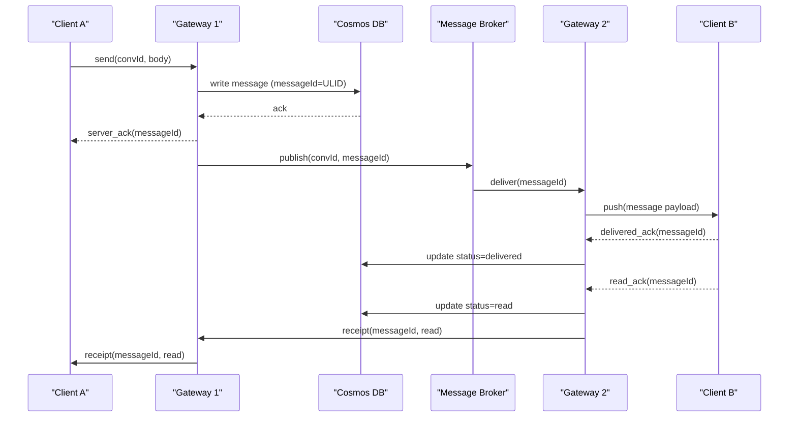
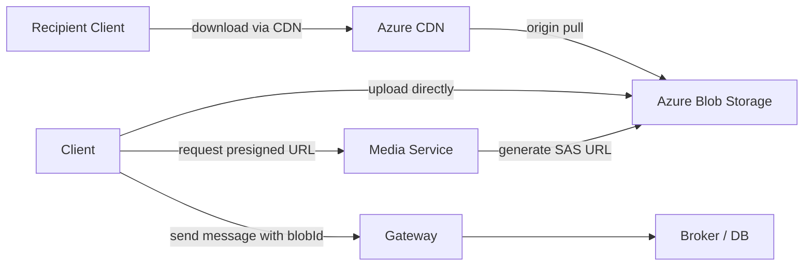

# 4. Design a Chat Application

> **TL;DR:** Maintain millions of persistent WebSocket connections on gateway servers; route messages through a broker to the target connection server; store messages in a wide-row NoSQL store ordered by conversation and time; handle offline delivery via an inbox pull model.

**Interview weight:** P0 — tests real-time connections at scale, presence/session registry, message ordering, fan-out, and storage modeling.

---

## 1. Requirements

### Functional
- 1:1 and group chat (up to 500 members).
- Real-time delivery with delivery and read receipts.
- Offline delivery: sync messages when user reconnects.
- Typing indicators and online presence.
- Media/attachment sharing (images, video, files).
- Message deletion and retention policies.

### Non-Functional
- 100 M DAU; 50 B messages/day.
- Message delivery < 100 ms (p99) for online users.
- Messages must be durable (no loss) and ordered within a conversation.
- 99.99% availability.

### Out of Scope
- End-to-end encryption (briefly mentioned in Deep Dives), full voice/video calling, bots/integrations.

---

## 2. Scale Estimation

| Metric | Calculation | Value |
|--------|-------------|-------|
| DAU | — | 100 M |
| Avg messages/user/day | 50 B ÷ 100 M | 500 |
| Write RPS | 50 B ÷ 86 400 | ~580 K/s |
| Peak write RPS | × 3 | ~1.7 M/s |
| Message size (avg) | 200 bytes | — |
| Storage/day | 580 K × 200 B × 86 400 | ~10 TB/day |
| Storage/year (with replication ×3) | 10 TB × 365 × 3 | ~11 PB/year |
| Concurrent WebSocket connections (30% online) | 100 M × 0.3 | 30 M connections |
| WebSocket servers (50 K conns/server) | 30 M ÷ 50 K | 600 servers |

---

## 3. Real-Time Protocol Comparison

| Protocol | Latency | Server State | Bidirectional | Mobile Friendly | Use Case |
|----------|---------|--------------|---------------|-----------------|----------|
| **WebSocket** | Very low | Persistent connection | Yes | Yes (with care) | Chat — best fit |
| **Long Polling** | Medium | Stateless per poll | Simulated | Yes | Fallback for restricted networks |
| **Server-Sent Events (SSE)** | Low | Persistent (server → client only) | No | Yes | Read-only feeds, notifications |
| **HTTP Polling** | High | Stateless | No | Yes | Simple dashboards |

**Decision:** WebSocket (primary); HTTP long polling fallback for corporate proxies that block WS upgrades.

---

## 4. Data Model

**Storage choice:**

| Data | Store | Why |
|------|-------|-----|
| Messages (ordered by conv + time) | **Azure Cosmos DB for Cassandra** or **Cassandra** wide-row: partition=`convId`, sort=`messageId (ULID)` | Efficient range scan per conversation; write-scalable |
| User profiles, conversation metadata | **Cosmos DB (document)** | Flexible schema, low-latency point reads |
| Presence / connection registry | **Redis** (`SET user:{id}:server serverAddr EX 30`) | Sub-ms; TTL-based expiry auto-clears stale presence |
| Media files | **Azure Blob Storage** | Cheap, durable, CDN-deliverable |

---

## 5. High-Level Architecture

**Numbered walkthrough:**
1. Client A sends `{"type":"message","to":"convId","body":"Hello"}` over WebSocket to Gateway 1.
2. Gateway 1 writes message to Cosmos DB (durable first).
3. Gateway 1 publishes `{messageId, convId, recipientId}` to Message Broker topic `chat.{convId}`.
4. Broker fans out to all online recipients' gateways.
5. Gateway 2 (holding Client B's connection) pushes the message over Client B's WebSocket.
6. If Client B is offline, Push Notification Service picks up the event and sends APNs/FCM push.

---

## 6. Deep Dives

### 6.1 Message Flow — Send, Ack, Deliver, Read Receipt

### 6.2 Presence and Session Registry

- On WebSocket connect: `SET user:{userId}:gateway {gatewayAddr} EX 30` (Redis).
- Gateway sends heartbeat every 20 s; each heartbeat resets TTL.
- On disconnect: explicit `DEL` or wait for TTL expiry (max 30 s stale window).
- Routing: when Gateway 1 publishes to Broker, broker consumer on each gateway checks if any of its local connections match the recipient. Alternative: route via Redis — publish to `gateway:{targetGatewayAddr}` pub/sub channel.

### 6.3 Message Ordering and Clock Skew

- **ULID** (Universally Unique Lexicographically Sortable Identifier) as `messageId`: 48-bit timestamp + 80-bit random. Lexicographic sort = chronological order. No central counter needed.
- Cosmos DB Cassandra partition key = `convId`; clustering key = `messageId` (ULID). Range scan `WHERE convId=X AND messageId > lastSeenId LIMIT 50` fetches next page efficiently.
- **Clock skew mitigation:** ULID millisecond timestamps are server-generated (gateway) at write time — client clock is not trusted.

### 6.4 Group Chat Fan-out

| Strategy | Description | Pros | Cons |
|----------|-------------|------|------|
| **Write fan-out** | On send, write a copy to each member's inbox | Fast reads (each user reads their own partition) | Expensive writes for large groups; 500-member group = 500 writes/message |
| **Read fan-out (conversation log)** | Store once in conversation; each reader fetches the log | Cheap writes; one copy | Read requires a scan + merge; harder to track per-user read position |
| **Hybrid** | Write fan-out for small groups (< 100); read fan-out for large groups | Balances both | More complexity |

**Decision:** Hybrid — write fan-out for < 100 members (1:1, small groups); read fan-out (conversation log model) for large groups. Store `user_inbox` entries for unread counts even in read fan-out model.

### 6.5 Offline Delivery and Sync

- Offline users: Gateway publishes to Broker → no gateway consumer for that user → Push Notification Service sends APNs/FCM push with `messageId`.
- On reconnect: Client sends `syncFrom={lastSeenMessageId}`. Gateway queries Cosmos DB: `SELECT * FROM messages WHERE convId=X AND messageId > lastSeenId ORDER BY messageId LIMIT 100`.
- **Inbox model:** Each user has an `inbox` table (userId, convId, lastMessageId, unreadCount). Updated by Fan-out Worker on every message. Fast unread badge retrieval without scanning conversation history.

### 6.6 Typing Indicators and Presence Cost

- Typing indicators are ephemeral — do not persist to DB.
- Gateway broadcasts `{type:"typing", userId, convId}` to other online members via Redis pub/sub or direct gateway-to-gateway WebSocket channel.
- Client stops showing typing indicator after 3 s silence (TTL).
- **Cost:** ~10 typing events/user/min for active chats. At 100 M DAU × 10% active × 10/min = 1.7 M events/s — keep off the message persistence path entirely.

### 6.7 Media and Attachments

- Client requests pre-signed SAS upload URL from Media Service.
- Client uploads directly to Blob Storage (bypasses chat servers — no bandwidth on them).
- Message payload contains `attachmentUrl` (CDN URL). No large payloads through gateways.
- CDN caches media; reduces Blob Storage egress cost.

### 6.8 End-to-End Encryption (Brief)

- **Key exchange:** Client generates asymmetric key pair; public key stored on server. Before first message, sender fetches recipient's public key and encrypts a symmetric session key.
- **Message encryption:** Sender encrypts message body with session key; sends ciphertext. Server stores and forwards ciphertext only — never sees plaintext.
- **Trade-off:** Server-side search (full-text search of message history) becomes impossible. Delivery receipt and notification must reference `messageId` only, not content.

---

## 7. Bottlenecks, Failure Modes & Trade-offs

| Bottleneck | Symptom | Mitigation |
|------------|---------|------------|
| Gateway SPOF | Lost connections on server restart | Graceful drain (30 s); client reconnects automatically with exponential backoff |
| Hot conversation partition (viral group) | Cosmos DB partition throttling | High-traffic convId partition → increase RU/s on that partition; client-side rate limit sends |
| Message Broker lag | Delayed delivery for online users | Scale Kafka/Service Bus partitions; monitor consumer lag |
| Presence registry Redis single node | Stale presence; routing failures | Redis Cluster; TTL is short (30 s) so stale entries self-heal |
| Fan-out to 500-member group | 500 writes/message × high frequency | Hybrid fan-out; cap write fan-out at 100 members |
| Media uploads through chat servers | Bandwidth and compute cost | Presigned URLs — client uploads directly to Blob Storage |

---

## 8. Scaling the Design

- **WebSocket connection count:** 30 M connections → 600 gateway servers (50 K each). Scale with Azure Container Apps or AKS node autoscaler.
- **Message throughput:** Cosmos DB auto-scale RU/s per partition; multiple Kafka partitions per conversation bucket.
- **Multi-region:** Active-active gateways per region; messages replicated via Cosmos DB geo-replication; presence is regional (users connect to nearest region).
- **Archival:** Messages > 1 year moved to Azure Blob Storage (cold tier) via Cosmos DB TTL + export pipeline.

---

## 9. Follow-up Extensions

- **Message search:** Index messages into Azure Cognitive Search; E2E encryption makes this opt-out.
- **Reactions / threads:** Reactions stored as a `reactions` map on message document; threads as child conversations.
- **Voice/video:** WebRTC signalling via existing WebSocket channel; media via TURN/STUN servers.
- **Bot integration:** Bot registers as a user; gateway routes messages to Bot Service endpoint.

---

## Interview Questions

**Q1. Why choose WebSocket over HTTP long polling?**
A: WebSocket maintains a persistent bidirectional connection with < 1 ms round-trip after setup, handles both send and receive over one connection, and has lower per-message overhead (no HTTP headers per message). Long polling has 100+ ms additional latency per message and double the server connections (one per user open + one per request). Use long polling only as a fallback for corporate proxies that block WS upgrades.

**Q2. How do you route a message from Client A on Gateway 1 to Client B on Gateway 2?**
A: Two approaches: (a) **Message Broker fan-out** — Gateway 1 publishes to Broker; each gateway subscribes to its users' topics; Gateway 2 sees the message and pushes to Client B. (b) **Redis pub/sub direct routing** — Gateway 1 looks up `user:B:gateway` in Redis, publishes directly to `gateway:{addr}` Redis channel; Gateway 2 forwards. The broker approach is more reliable and decoupled; direct Redis is lower latency.

**Q3. How do you guarantee message ordering in a group chat?**
A: Use ULID as `messageId` (server-generated at write time). ULID encodes millisecond timestamp in its first 48 bits and sorts lexicographically. Store messages with `(convId, messageId)` as partition+sort keys. Clients request messages with cursor `messageId > lastSeen` — pages are always in order. Within the same millisecond, the random component ensures uniqueness but order within that ms is arbitrary (acceptable).

**Q4. What is the write fan-out vs read fan-out trade-off for group chat?**
A: Write fan-out: copy message to each member's inbox on send — fast reads, expensive writes (500 copies for 500-member group). Read fan-out: store once in conversation log — cheap writes, reads require a log scan. Hybrid: write fan-out for small groups (< 100 members) where write cost is acceptable; read fan-out + per-user unread-count inbox for large groups.

**Q5. How do you handle the case where a user receives a message while offline?**
A: Gateway publishes message to Broker. Broker's consumer (Push Notification Service) detects no gateway connected for recipient and sends APNs/FCM push with preview text + `messageId`. On reconnect, client sends `syncFrom={lastSeenId}`; gateway queries Cosmos DB for messages after that cursor and streams them in order.

**Q6. How does the presence system work and what is its accuracy?**
A: Gateway writes `user:{id}:gateway {addr} EX 30` to Redis on connect; refreshes every 20 s (heartbeat). On disconnect it DELetes the key or allows TTL expiry. Accuracy: up to 30 s stale (TTL window). For typing indicators (sub-second ephemeral) use a separate Redis pub/sub channel, not a stored key.

**Q7. How do you prevent the Cosmos DB hot partition problem for a viral group chat?**
A: Partition key is `convId`. A viral group (e.g. a live-event chat with 100 K members) can saturate one partition. Mitigate: (a) increase RU/s for that partition (Cosmos auto-scale), (b) rate-limit message sends at the gateway (e.g. 1 msg/user/sec in large groups), (c) for extreme cases, sub-partition by `convId + bucketId` where `bucketId = messageId % N`.

**Q8. Walk me through media upload without burdening the chat servers.**
A: Client calls Media Service → gets a pre-signed Azure Blob SAS URL (write-only, 15 min TTL). Client uploads directly to Blob Storage at full bandwidth — never touches the chat gateway. Client sends a chat message with `{ type: "media", attachmentId }`. Recipient fetches via Azure CDN URL (which caches at edge). Gateways handle only small JSON control messages.

**Q9. How would you implement read receipts without excessive write load?**
A: Batch read receipts: instead of a DB write per message read, the client sends a batch `{ readUpTo: messageId }` every 5 s or on focus. Gateway does one Cosmos DB upsert: `UPDATE conversation SET lastReadBy[userId] = messageId`. Single field update per user per conversation per 5 s — manageable at scale.

**Q10. How does end-to-end encryption break server-side search?**
A: Server stores ciphertext only. Search requires plaintext. Solutions: (a) disable search for E2E encrypted chats (WhatsApp model), (b) client-side search (sync messages to device, search locally — limited to device history), (c) homomorphic encryption or trusted execution environment search (research-level, not production).

**Q11. How do you handle a gateway restart with 50 K active connections?**
A: Implement graceful drain: on SIGTERM, gateway stops accepting new connections, sends a `{type:"reconnect",hint:"gateway2.example.com"}` control message to all connected clients, waits 30 s for them to reconnect, then exits. Clients have exponential backoff reconnect logic with jitter. Redis presence entries expire after 30 s, so routing is self-healing.

**Q12. Design the unread count feature.**
A: `inbox` table in Cosmos DB: `(userId, convId, lastReadMessageId, unreadCount)`. On message send, Fan-out Worker increments `unreadCount` for each recipient. When recipient opens the conversation, client sends `markRead(convId, messageId)` → gateway sets `lastReadMessageId` and resets `unreadCount=0`. Badge count = `SUM(unreadCount) WHERE userId=X`.

---

## Quick Recap

- **WebSocket** over persistent gateway servers (600 nodes for 30 M connections at 50 K/server).
- **Presence registry in Redis:** `SET user:{id}:gateway {addr} EX 30`; 30 s max stale window.
- **Message flow:** write to Cosmos DB first (durable) → publish to Broker → fan out to gateway → push to connected client WebSocket.
- **ULID** as `messageId`: server-generated, monotonically sortable, no central counter.
- **Group fan-out hybrid:** write fan-out (< 100 members) + read fan-out + per-user inbox unread count (large groups).
- **Offline sync:** push notification via APNs/FCM + cursor-based pull on reconnect (`syncFrom=lastSeenId`).
- **Media:** presigned SAS URLs → direct Blob Storage upload → CDN delivery; gateways never touch binary payloads.
- **Read receipts batched** every 5 s to avoid per-message DB writes.
