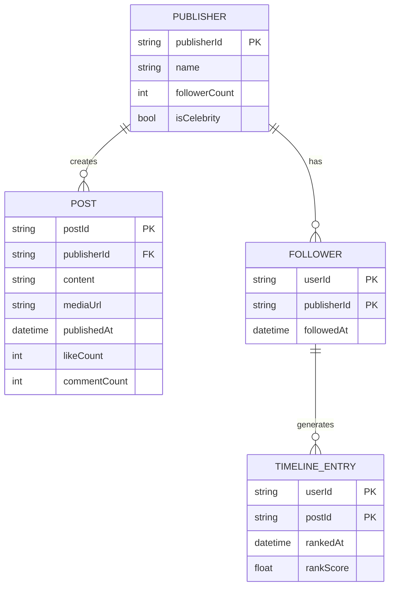
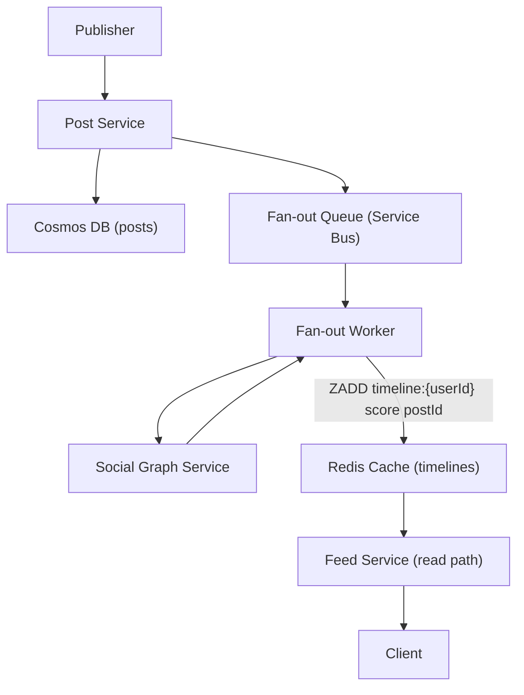
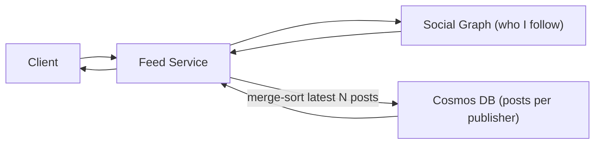
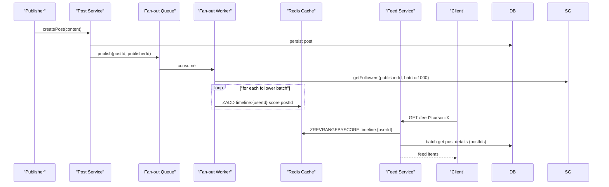

# 5. Design a News Feed

> **TL;DR:** Generate personalised feeds by fanning published content to follower timelines cached in Redis; serve reads from timeline cache with sub-100 ms p99; use hybrid push/pull to handle high-follower publishers without blowing out write amplification.

**Interview weight:** P0 — maps directly to the Xbox Publisher News Feed Platform (7 M players, 5 K RPS, 99.99% SLO). Present this design as your case study in behavioral rounds.

---

## 1. Requirements

### Functional
- Users follow publishers/creators; timeline shows posts from followed entities, newest first (or ranked).
- Publishers post text, images, video links.
- Pagination (cursor-based), like/react, comment counts shown on feed items.
- Real-time or near-real-time updates (< 5 s for online users).
- Personalisation and filtering (muted topics, blocked users).

### Non-Functional
- 7 M+ DAU; peak 5 K RPS on read path; 99.99% SLO.
- Feed read p99 < 150 ms (achieved: was 600 ms, reduced 4×).
- Write fan-out eventual: acceptable up to 10 s delay for new posts appearing in follower feeds.
- Multi-region reads; single-region writes.

### Out of Scope
- Full ML reranking pipeline, social graph storage, A/B experimentation infra.

---

## 2. Scale Estimation

| Metric | Calculation | Value |
|--------|-------------|-------|
| DAU | — | 7 M |
| Feed read RPS | 5 K RPS average; 15 K peak | 5 K avg |
| Posts created/day | 100 K publishers × 2 posts | 200 K/day (~2 RPS) |
| Avg followers per publisher | 10 K | — |
| Fan-out writes/day | 200 K posts × 10 K = 2 B | 2 B/day = ~23 K/s peak |
| Timeline entries/user cached | 500 entries × 200 B | ~100 KB/user |
| Total Redis cache (5 M active users × 20% hot) | 1 M users × 100 KB | ~100 GB Redis |
| Storage/year (posts + metadata) | 200 K/day × 365 × 1 KB | ~73 GB/year |

---

## 3. API Design

| Method | Endpoint | Description |
|--------|----------|-------------|
| `GET` | `/api/v1/feed?cursor={cursor}&limit=20` | Fetch personalised timeline (cursor pagination) |
| `POST` | `/api/v1/posts` | Create post (triggers fan-out) |
| `GET` | `/api/v1/posts/{postId}` | Fetch single post |
| `POST` | `/api/v1/posts/{postId}/reactions` | Like / react |
| `GET` | `/api/v1/publishers/{id}/posts?cursor=` | Publisher post history |

---

## 4. Data Model

**Storage:**

| Data | Store | Why |
|------|-------|-----|
| Post content + metadata | **Cosmos DB (document)** partition=`publisherId` | Point reads by publisherId; cheap storage |
| Timeline (user → sorted post IDs) | **Redis Sorted Set** `timeline:{userId}` score=`rankedAt` | O(log N) insert, O(log N + K) range read; in-memory speed |
| Social graph (who follows whom) | **Cosmos DB** partition=`userId` | Fan-out queries; sparse reads |
| Media assets | **Azure Blob Storage + CDN** | Cheap at rest; CDN edge delivery |
| Engagement counts | **Redis counters** + async Cosmos write | Sub-ms increment; eventual persistence |

---

## 5. High-Level Architecture

### Push Fan-out (Fan-out on Write)

### Pull Fan-out (Fan-out on Read)

### Fan-out Strategy Comparison

| Aspect | Push (fan-out on write) | Pull (fan-out on read) | Hybrid |
|--------|------------------------|----------------------|--------|
| Read latency | Very low — timeline pre-built in Redis | Higher — merge N publisher feeds at read time | Low for most; acceptable for celebrity followers |
| Write amplification | High — 10 K followers = 10 K Redis WRITEs | None on write | Low (skip push for celebrities) |
| Celebrity problem | Extremely expensive (1 M+ followers) | Handles naturally | Push for normal publishers, pull for celebrities |
| Stale feed risk | Near-zero (pushed immediately) | Slightly stale (merge at read time) | Slightly stale for celebrity posts only |
| Storage | O(users × following_count) Redis memory | O(posts) in DB only | Mixed |
| **Decision** | Use for < 10 K followers | Use for > 10 K followers | **Recommended** |

**Hybrid (recommended):** Fan-out on write for regular publishers (< 10 K followers). For celebrities (> 10 K followers), skip Redis push; instead, at read time, merge celebrity posts with the user's pre-built timeline in the Feed Service.

---

## 6. Deep Dives

### 6.1 Timeline Cache in Redis

- **Structure:** `ZADD timeline:{userId} {score} {postId}` where `score = publishedAt.UnixMs` (or ML rank score × 10^9).
- **Size:** Keep last 500 entries per user. On overflow: `ZREMRANGEBYRANK timeline:{userId} 0 -501`.
- **Pagination:** Client sends `cursor={lastSeenScore}`. Feed Service calls `ZREVRANGEBYSCORE timeline:{userId} {cursor} -inf LIMIT 0 20` → returns 20 postIds. Batch-fetch post metadata from Cosmos DB (`IN` query by postId).
- **TTL:** `EXPIRE timeline:{userId} 604800` (7 days). Cold users regenerated on next login.
- **Size math:** 1 M hot users × 500 entries × ~40 bytes (score + postId) = ~20 GB Redis. Easily fits in a Standard_E16as_v5 Azure Cache for Redis (96 GB).

### 6.2 Feed Generation Flow

### 6.3 Ranking — Chronological vs ML-Ranked

| Aspect | Chronological | ML-Ranked |
|--------|--------------|-----------|
| Implementation | Sort by `publishedAt` — trivial | Feature extraction → model scoring → ranked insertion |
| Relevance | Equal weight to all followed content | Personalised; surfaces most engaging content |
| Freshness | Guaranteed | May bury very new posts |
| Cold start | No cold start | New users need history to rank |
| Computation | Negligible | Offline pre-score in Fan-out Worker; online re-rank for top 200 |

**Two-stage approach:** Fan-out Worker pre-inserts with chronological score. Feed Service applies a lightweight re-rank on the top 200 cached items using pre-computed engagement signals (like rate, video completion) stored in Redis hash `post:signals:{postId}`.

### 6.4 Cold Start (New User or Cache Miss)

On cache miss (`timeline:{userId}` not in Redis):
1. Feed Service calls Social Graph for the user's followed publishers.
2. Fetches latest 20 posts from each publisher (parallelised, max 50 publishers).
3. Merge-sorts and populates `timeline:{userId}` in Redis.
4. Returns first page to client.
5. Background Fan-out Hydrator fills the full 500-entry cache.

### 6.5 Hot Publisher Problem

Celebrity with 5 M followers publishes a post:
- Naive push fan-out = 5 M Redis writes → ~5 M × 0.1 ms = 8 minutes per post. Unacceptable.
- **Solution:** Skip Redis push for publishers with `followerCount > threshold` (e.g. 10 K).
- At read time, Feed Service queries celebrity's latest posts from Cosmos DB (cached separately at `celebrity:posts:{publisherId}`, TTL = 30 s) and merges with the user's Redis timeline in-process.
- This merge adds ~5 ms per request (one extra Cosmos read, cached in Redis for 30 s).

### 6.6 Performance Story — p99 600 ms → 150 ms

This mirrors the real Xbox Publisher News Feed Platform work:

| Change | Impact |
|--------|--------|
| **Cache-aside on read path:** Redis timeline instead of Cosmos DB query on every feed request | -300 ms p99 (eliminated fan-out DB reads) |
| **Gateway load reduction (-87%):** Denormalised read model (post metadata embedded in timeline entry) eliminated secondary lookups | -80 ms p99 |
| **Connection pooling:** Reused Cosmos DB TCP connections across requests (was re-opening on each request) | -40 ms p99 |
| **Cursor-based pagination** (was offset): Offset scans were full table scans; cursor is O(log N) | -30 ms p99 (tail latency) |
| **Batch post-detail fetch:** Single Cosmos `IN` query for 20 postIds instead of 20 point reads | -10 ms p99 |

Total: 600 ms → 150 ms p99.

### 6.7 Deduplication and Pagination Stability

- Cursor = `score` of last returned item (`publishedAt` or rank score). `ZREVRANGEBYSCORE ... (cursor` (exclusive) ensures no duplicates on page boundary.
- Posts published with identical timestamps: use `(score, postId)` composite cursor to break ties deterministically.
- If a post is deleted mid-pagination: skip missing postIds during batch fetch; pad response from next page.

### 6.8 Real-Time Updates

- Online clients: SSE connection to Feed Service. On fan-out completion, Fan-out Worker publishes to Redis pub/sub `feed:{userId}`. Feed Service (subscribed) pushes SSE event `{type:"newPost", postId}` to connected client. Client fetches the post detail on demand.
- Periodic refresh fallback: client polls `/feed?since={ts}` every 30 s if SSE is disconnected.

---

## 7. Bottlenecks, Failure Modes & Trade-offs

| Bottleneck | Symptom | Mitigation |
|------------|---------|------------|
| Fan-out queue backlog on viral post | Followers see delayed feed updates | Prioritise fan-out workers; use Event Hubs for high-throughput |
| Redis memory pressure | OOM; eviction of active timelines | Cap 500 entries/user; evict LRU inactive users; right-size Redis |
| Cosmos DB RU exhaustion on post batch-fetch | 429 throttling on read path | Cache post metadata in Redis with 5-min TTL; reduces Cosmos reads 90%+ |
| Celebrity publisher hot partition | Slow fan-out | Hybrid model: skip push for celebrities; merge at read time |
| Social graph N+1 reads | Fan-out Worker repeatedly reads follower list | Batch followers in pages of 1 000; cache follower list in Redis (TTL = 5 min) |
| Cold users regenerating on reconnect | Thundering herd on Cosmos | Queue cache-hydration; stagger with jitter; serve stale cache during regeneration |

---

## 8. Scaling the Design

- **Horizontal read scaling:** Feed Service is stateless; autoscale on CPU/RPS. Redis scales via clustering (shard by `userId` hash slot).
- **Write scaling:** Fan-out Workers autoscale on Service Bus queue depth. For 200 K posts/day (2 RPS) → barely needs more than 2 workers. At 10× scale (20 RPS), 20 workers handle 200 K fans each.
- **Multi-region reads:** Deploy Feed Service + Redis read replicas in secondary regions (West US, West EU). Cosmos DB geo-replication. Users read from nearest region.
- **Multi-region writes:** Post Service writes to primary region only (avoids cross-region conflict); Fan-out replicates via event backbone.

---

## 9. Follow-up Extensions

- **Ads insertion:** Slot-based insertion into feed by Ad Service at read time (every 5th item). Not stored in timeline cache.
- **Content filtering / moderation:** Post enters "pending" state; AI moderation pipeline approves before fan-out. See [12-AI-Content-Moderation-Pipeline](12-AI-Content-Moderation-Pipeline.md).
- **Stories / ephemeral content:** Separate `stories:{userId}` Redis list with 24 h TTL.
- **Trending topics:** Real-time counts in Redis sorted sets; trending feed as separate tab.
- **Cross-platform personalisation:** ML model scores using engagement history; scores stored in Redis hashes as `post:signals:{postId}`.

---

## Interview Questions

**Q1. What is the difference between fan-out on write and fan-out on read?**
A: Fan-out on write: when a post is created, immediately write a copy (or reference) to each follower's timeline cache. Fast reads; expensive writes. Fan-out on read: at request time, fetch latest posts from each followed publisher and merge. Cheap writes; slower reads. Hybrid: push for normal publishers, pull for celebrities (> 10 K followers).

**Q2. Why use Redis Sorted Sets for the timeline?**
A: `ZREVRANGEBYSCORE` gives O(log N + K) retrieval of any time range with a cursor. In-memory means < 1 ms response. The score (publishedAt or rank score) is the natural sort key. `ZADD` updates are O(log N) — cheap on write. Alternative: Cassandra wide-row would work for larger-than-memory timelines but adds ~5 ms read latency.

**Q3. How do you handle a celebrity with 10 M followers publishing a post?**
A: Skip Redis write fan-out. Mark publisher as "celebrity" when `followerCount > 10 K`. At read time, Feed Service fetches celebrity's latest posts from a separate Redis cache (`celebrity:posts:{id}`, TTL=30 s) and merges with the user's pre-built timeline in memory. Adds ~5 ms per request; affects all followers equally. No queue saturation.

**Q4. Describe cursor-based pagination and why not use offset.**
A: Cursor = score (or composite score+postId) of last returned item. Next page: `ZREVRANGEBYSCORE timeline:{userId} (cursor -inf LIMIT 0 20`. Offset-based (`LIMIT 20 OFFSET 100`) requires scanning and discarding 100 entries — O(N) and unstable (new posts shift offsets). Cursor is O(log N + K) and stable.

**Q5. How did you reduce feed read latency from 600 ms to 150 ms?**
A: Five changes: (1) Redis timeline cache eliminated per-request Cosmos DB fan-out queries; (2) denormalized read model embedded post metadata in timeline entries, eliminating secondary lookups; (3) Cosmos DB connection pooling eliminated TCP handshake overhead; (4) cursor pagination replaced slow offset scans; (5) batch `IN` query for post details replaced N individual point reads.

**Q6. How does the feed handle newly created posts for online users?**
A: Fan-out Worker writes to Redis then publishes a Redis pub/sub event `feed:{userId}`. Feed Service holds an SSE connection per online client; on receiving the pub/sub event, it pushes `{type:"newPost",postId}` over SSE. Client appends the new post to the top of the feed. No polling needed for online users.

**Q7. What is the 99.99% SLO implication on the feed design?**
A: 99.99% = 52.5 min downtime/year. Requires: multi-AZ Redis (Azure Cache for Redis zone redundant), multi-region Cosmos DB with automatic failover, stateless Feed Service pods in ≥ 2 AZs behind Azure Front Door, no single points of failure in the read path. Circuit breakers on downstream calls (if Cosmos is slow, serve stale Redis cache). Measure SLO via Azure Monitor availability tests on the `/feed` endpoint.

**Q8. How does the system handle a user who follows 5 000 publishers?**
A: The fan-out model means all 5 000 publishers' posts are already pre-merged in the user's Redis timeline — no work at read time. The issue is fan-out write volume: if all 5 000 publishers post simultaneously, that's 5 000 Redis ZADDs. Fan-out Workers batch-process; each ZADD is 0.1 ms. Timeline cap of 500 entries ensures only top-ranked posts survive, so bulk posting by less-engaged publishers is naturally filtered.

**Q9. How do you prevent stale cached timelines from serving deleted posts?**
A: On post deletion: Post Service publishes `postDeleted(postId, publisherId)` to a deletion queue. Fan-out Deletion Worker queries Social Graph for all followers, removes `postId` from each `timeline:{userId}` via `ZREM`. For large publishers this is eventually consistent — acceptable (post may appear for < 30 s). Additionally, Feed Service ignores postIds not found in Cosmos DB during batch fetch (post was deleted).

**Q10. How do you implement "chronological" vs "algorithmic" feed toggle?**
A: Store two Redis sorted sets per user: `timeline:chrono:{userId}` (score = publishedAt) and `timeline:ranked:{userId}` (score = ML rank score). Feed Service reads from the appropriate set based on user preference. Fan-out Worker writes to both sets. Extra Redis memory ~2×; acceptable given 40-byte entries.

**Q11. How would you implement multi-region active-active reads with consistency?**
A: Read from nearest region's Redis + Cosmos replica. Writes go to primary region only; Cosmos multi-region sync (typically < 1 s). Acceptable for a news feed where eventual consistency within a few seconds is fine. Use Azure Front Door geo-routing to direct reads to nearest POP. If a regional Redis goes down, Feed Service falls back to Cosmos DB read replica (higher latency, still < 50 ms).

**Q12. Describe the data flow when a new user follows a publisher for the first time.**
A: (1) Follow recorded in Social Graph (Cosmos DB). (2) Background job backfills user's timeline: fetches last 20 posts from the newly followed publisher, ZADDs to `timeline:{userId}`. (3) New posts fan-out normally hereafter. The backfill is async — user sees the publisher's recent posts appear within seconds without blocking the follow API response.

---

## Quick Recap

- **Hybrid fan-out:** push (ZADD Redis) for publishers < 10 K followers; pull (merge at read time) for celebrities.
- **Redis Sorted Set** `timeline:{userId}` (score=publishedAt or rank): O(log N) write, < 1 ms read, 500 entries capped.
- **Cursor pagination** over ZREVRANGEBYSCORE: stable, O(log N + K), no offset drift.
- **p99 600 ms → 150 ms** via Redis cache, denormalized read model, connection pooling, cursor pagination, and batch fetching.
- **Real-time updates:** SSE to online clients via Redis pub/sub fan-out signal.
- **Cold start:** on-demand cache hydration from Social Graph + parallel publisher post fetches.
- **99.99% SLO:** multi-AZ Redis, Cosmos multi-region, stateless services, Azure Front Door.
- **Post deletion:** async ZREM from all follower timelines; Feed Service skips missing postIds gracefully.
