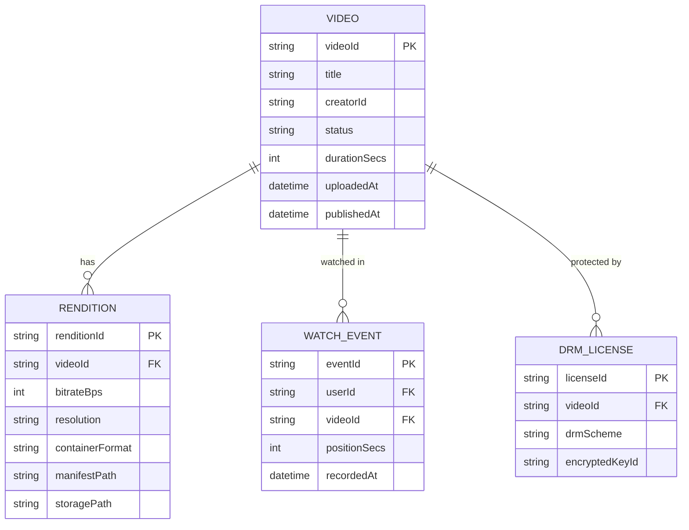
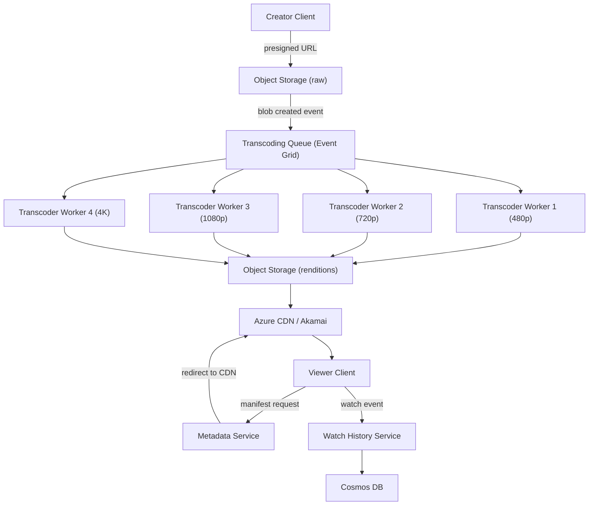
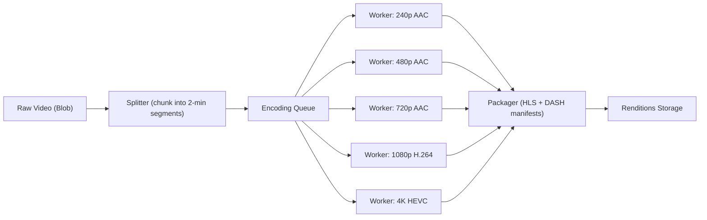
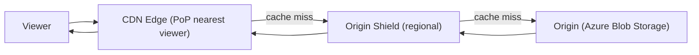

# 6. Design a Video Streaming Platform

> **TL;DR:** Upload raw video → parallel transcoding pipeline → multiple bitrate/resolution renditions stored in object storage → served via CDN with adaptive bitrate streaming (HLS/DASH); live streaming adds an ingest tier with sub-10 s latency using LL-HLS or chunked CMAF.

**Interview weight:** P0 — tests pipeline design, CDN strategy, ABR protocols, storage tiering, and cost optimisation at global scale.

---

## 1. Requirements

### Functional
- Upload, transcode, and stream VOD (video on demand) content.
- Adaptive bitrate streaming: auto-select quality based on bandwidth.
- Live streaming with < 10 s end-to-end latency.
- DRM and signed URL access control.
- Watch history, resume position, and recommendations (brief).
- Search by title/metadata.

### Non-Functional
- 1 B DAU; 1 B hours of video watched per day.
- Upload to playable: VOD within 5 min for SD/HD; 30 min for 4K.
- 99.99% playback availability.
- Egress cost minimisation (dominates OpEx).
- Startup time < 2 s; rebuffer ratio < 0.1%.

### Out of Scope
- Full ML recommendations engine, monetisation/ads serving, comment moderation, creator analytics deep-dive.

---

## 2. Scale Estimation

| Metric | Calculation | Value |
|--------|-------------|-------|
| DAU | — | 1 B |
| Hours watched/day | 1 B | ~11.6 M concurrent streams |
| Peak concurrent streams | × 2 | ~23 M |
| Avg bitrate | 3 Mbps (HD) | — |
| Peak egress bandwidth | 23 M × 3 Mbps | ~69 Tbps (CDN edge) |
| Uploads/day | 500 h video/min × 60 min | ~720 K uploads/day |
| Raw storage growth | 720 K × 4 GB avg raw | ~2.9 PB/day raw |
| Stored renditions (5 bitrates × 2 container) | × 10 | ~29 PB/day total; compress to ~4 PB after encoding |
| Cache hit ratio target | 90% CDN hit | Origin serves 10% of 69 Tbps = 6.9 Tbps |

---

## 3. API Design

| Method | Endpoint | Description |
|--------|----------|-------------|
| `POST` | `/api/v1/videos` | Initiate upload; returns presigned URL + videoId |
| `PUT` | `{presignedUrl}` | Upload raw video directly to object storage |
| `POST` | `/api/v1/videos/{id}/publish` | Trigger transcoding pipeline |
| `GET` | `/api/v1/videos/{id}/manifest` | Fetch HLS/DASH manifest (redirects to CDN) |
| `GET` | `/api/v1/videos/{id}/progress` | Transcoding job status |
| `POST` | `/api/v1/users/{id}/watchhistory` | Update resume position |
| `GET` | `/api/v1/search?q=` | Search videos by metadata |

---

## 4. Data Model



---

## 5. High-Level Architecture



**Numbered walkthrough (VOD):**
1. Creator requests presigned upload URL from Video Service.
2. Creator uploads raw file directly to Azure Blob Storage (raw bucket).
3. Blob creation triggers Event Grid event → Transcoding Queue.
4. Multiple Transcoder Workers pick up the job in parallel (one per resolution).
5. Each worker: segment → encode → package (HLS/DASH) → write to renditions Blob Storage.
6. On completion, Metadata Service marks video as `published`; DRM keys applied.
7. Viewer requests `/manifest` → Metadata Service returns CDN URL for master playlist.
8. Player fetches segments from CDN edge (cache hit > 90%).

---

## 6. Deep Dives

### 6.1 Transcoding Pipeline



- **Chunking:** Split raw video into 2-min segments; encode segments in parallel across workers. Parallelism = number of segments × resolutions. A 2-hour movie → 60 chunks × 5 resolutions = 300 parallel tasks.
- **Segment duration trade-off:** HLS segment = 2–10 s. Shorter = faster ABR adaptation + higher latency buffering; longer = fewer HTTP requests + higher startup latency.
- **Workers:** Azure Batch or AKS nodes with GPU (NVIDIA A10) for HEVC 4K. Auto-scale based on queue depth.
- **Thumbnail generation:** Parallel worker extracts frames at regular intervals; stores in Blob Storage for CDN serving.

### 6.2 Adaptive Bitrate Streaming (ABR)

| Aspect | HLS (Apple) | DASH (ISO Standard) |
|--------|-------------|---------------------|
| Full name | HTTP Live Streaming | Dynamic Adaptive Streaming over HTTP |
| Container | MPEG-TS, fMP4 | fMP4 |
| Manifest | `.m3u8` | `.mpd` |
| Native support | iOS, Safari, tvOS (required) | Android, Chrome, Edge, smart TVs |
| DRM | FairPlay (Apple) | Widevine (Google), PlayReady (MS) |
| Low-latency variant | LL-HLS (< 3 s) | LL-CMAF (< 3 s) |
| Segment size | 2–10 s (standard) | 2–10 s (standard) |
| **Use both?** | Yes — dual-package for maximum device reach | Yes — serve HLS to Apple, DASH to others |

**Master playlist (HLS example):**
```
#EXTM3U
#EXT-X-STREAM-INF:BANDWIDTH=400000,RESOLUTION=426x240
240p/playlist.m3u8
#EXT-X-STREAM-INF:BANDWIDTH=1500000,RESOLUTION=1280x720
720p/playlist.m3u8
#EXT-X-STREAM-INF:BANDWIDTH=4000000,RESOLUTION=1920x1080
1080p/playlist.m3u8
```

Player downloads master playlist; measures bandwidth; fetches appropriate rendition playlist; fetches segments. On rebuffer, player switches down automatically.

### 6.3 CDN Strategy



| Strategy | Description | Trade-off |
|----------|-------------|-----------|
| **CDN Pull (lazy)** | CDN fetches from origin on first miss | Simple; popular content auto-caches; cold start latency on first viewer |
| **CDN Push (pre-warm)** | Upload renditions directly to CDN nodes at publish time | Faster for predicted popular content; complex, wastes space for unpopular |
| **Origin Shield** | Regional aggregation node in front of origin | Collapses multiple edge misses into one origin request; reduces origin egress |
| **ISP-embedded cache (Open Connect / OCA)** | CDN nodes inside ISP networks | Netflix model; maximum hit ratio (> 95%); requires ISP partnerships |

**Cache hit ratio math:** If CDN hit = 90%, origin serves 10% × 69 Tbps = 6.9 Tbps. At $0.05/GB egress, 6.9 Tbps = 75 TB/hr = $3 750/hr just for origin egress. Raising hit ratio to 95% saves $1 875/hr. Origin Shield consolidates edge misses → typically raises hit ratio by 3–5%.

**Cache key:** `videoId/rendition/segmentIndex.ts` (no auth parameters in cache key; auth handled separately via signed cookies).

### 6.4 DRM and Signed URLs

- **DRM scheme:** PlayReady (Microsoft / Azure Media Services key delivery) for Windows/Xbox; Widevine for Android/Chrome; FairPlay for iOS.
- Each rendition segment encrypted with AES-128 key stored in Azure Key Vault. Key IDs referenced in manifest.
- **Access flow:** viewer app authenticates → Video Service issues short-lived signed token → player includes token in DRM license request → Azure Media Key Delivery validates → returns content key.
- **Signed URLs:** Manifest and segment URLs signed with HMAC (Azure CDN token auth) with 4-hour expiry. Prevents hotlinking and unpaid access.

### 6.5 Live Streaming vs VOD

| Aspect | VOD | Live Streaming |
|--------|-----|----------------|
| Ingest | Single upload | Continuous RTMP/SRT from encoder |
| Latency target | N/A (buffering fine) | < 10 s (LL-HLS/LL-CMAF) or < 1 s (WebRTC) |
| Segment availability | All segments pre-generated | Rolling window; segments generated in real-time |
| Manifest | Static | Dynamic (updated every segment) |
| DVR | Full scrubbing | Configurable rolling window (e.g. last 3 h) |
| Transcode workers | Batch (burst) | Always-on, real-time, low-latency |
| CDN behaviour | Pull with long cache TTL (hours) | Short TTL (2 s for live segments) |
| Failure impact | Retry from storage | Segment drop = rebuffer for all viewers |

**LL-HLS (Low-Latency HLS):** Uses HTTP/2 server push for partial segments (< 0.5 s chunks within a 2 s segment). Playlist uses `EXT-X-PRELOAD-HINT` tags. CDN must support HTTP/2 + server push. Achieves < 3 s glass-to-glass latency.

### 6.6 Watch History and Resume Position

- **Write pattern:** Player sends `PATCH /watchhistory/{videoId}` every 10 s with `{positionSecs}`.
- High write volume: 11 M concurrent streams × 0.1 writes/s = 1.1 M writes/s.
- **Optimisation:** Buffer in Redis (`SET watchpos:{userId}:{videoId} {pos} EX 86400`), flush to Cosmos DB every 30 s via a background writer. Player reads from Redis on startup for instant resume.
- Cosmos DB partition key = `userId`; record size ~ 100 bytes. 1 B users × 1 KB = 1 TB metadata — affordable.

### 6.7 Analytics and Quality of Experience (QoE)

| Metric | Target | How Measured |
|--------|--------|-------------|
| Startup time | < 2 s | Player SDK → Event Hubs |
| Rebuffer ratio | < 0.1% | (rebuffer duration / total watch time) |
| Bitrate switches | < 3/min | ABR algorithm telemetry |
| Error rate | < 0.01% | CDN 5xx + player error events |
| CDN hit ratio | > 90% | CDN access logs |

Player SDK emits QoE events to Event Hubs → Spark Streaming (Azure Databricks) → real-time dashboard in Azure Data Explorer.

### 6.8 Cost Optimisation

- **Egress dominates:** ~70% of cost. Maximise CDN cache hit ratio; use ISP partnerships; avoid re-serving from origin.
- **Storage tiering:** Hot tier for last 30 days; Cool tier for 30–180 days; Archive tier for > 180 days. Automated via Azure Blob lifecycle policies.
- **Encoding cost:** Transcode on GPU spot/interruptible instances (Azure Spot VMs in Batch). ~70% cost reduction. Retry on preemption via queue re-enqueue.
- **Rendition pruning:** Only transcode 4K if creator account tier supports it. Avoid generating unused renditions.

---

## 7. Bottlenecks, Failure Modes & Trade-offs

| Bottleneck | Symptom | Mitigation |
|------------|---------|------------|
| Transcoding queue backlog at peak upload time | Upload-to-playable SLA miss | Autoscale workers; prioritise by content popularity prediction |
| CDN origin hammering on popular content | Origin egress cost spike; throttling | Origin Shield; cache warm on publish; CDN-pull with long TTL |
| Single-region object storage | High latency for distant viewers | Multi-region Blob replication; CDN PoPs serve 99%+ of requests |
| Live ingest SPOF | Stream drops for all viewers if ingest node fails | Redundant ingest (RTMP primary + backup); auto-failover at 1 s |
| Watch history write storm | Cosmos DB RU exhaustion | Redis buffering + batched flush (reduces writes 20×) |
| Malformed segments in transcoded output | Playback errors for specific titles | Automated quality check (VMAF score) after each transcoding job; reject below threshold |

---

## 8. Scaling the Design

- **Transcode workers:** Azure Batch auto-scales 0 → thousands of GPU VMs. Queue depth drives autoscale.
- **CDN:** Azure CDN + Akamai multi-CDN for redundancy; traffic switching on CDN health signals.
- **Metadata Service:** Stateless microservices; autoscale on RPS. Cache hot manifest URLs in Redis (TTL = 5 min).
- **Live at scale:** Ingest → Azure Media Services live encoder → partitioned Event Hubs → packaging workers per partition → CDN. Partition by stream ID.

---

## 9. Follow-up Extensions

- **Content ID / copyright detection:** Extract perceptual hash (pHash) fingerprint during transcoding; compare against reference DB. Block or monetise matched content.
- **Subtitle/caption pipeline:** Extract audio → speech-to-text (Azure Cognitive Services) → generate `.vtt` caption tracks per language → include in manifest.
- **Offline download:** Pre-packaged encrypted renditions downloaded to device; DRM license tied to device + expiry.
- **Interactive / chapter markers:** Timeline metadata service stores chapter timestamps; manifest references chapter data.

---

## Interview Questions

**Q1. What is adaptive bitrate streaming and why is it important?**
A: ABR (HLS/DASH) splits video into small segments (2–10 s) at multiple bitrate levels. The player continuously measures available bandwidth and switches to the appropriate quality level per segment. This prevents rebuffering by degrading quality proactively instead of stalling. Without ABR, all users get a fixed bitrate — high-quality streams rebuffer on mobile; low-quality streams waste bandwidth for fibre users.

**Q2. Why use HLS and DASH together?**
A: iOS/Safari requires HLS (Apple policy) and supports FairPlay DRM. Android/Chrome prefer DASH and require Widevine. Smart TVs vary. Packaging the same content in both formats during transcoding maximises device reach. The segmented data (fMP4 containers) is actually shared; only the manifests differ — dual packaging adds < 10% overhead.

**Q3. Describe the transcoding pipeline and how parallelism works.**
A: Raw video is chunked into 2-min segments. Each segment × each target resolution is an independent job on the queue. Workers process jobs in parallel across an auto-scaling GPU cluster. A 2-hour movie at 5 resolutions = 60 × 5 = 300 parallel tasks → completes in ~2 min (with 300 workers). Packager merges encoded segments into HLS/DASH manifests once all segments complete.

**Q4. What is an origin shield and why does it save money?**
A: Origin shield is a regional CDN aggregation node between edge PoPs and origin storage. Multiple edge PoPs in the same region that all miss their cache will each request the same segment from origin — without a shield, that's N origin requests. With a shield, they all miss to the shield, and the shield makes one request to origin. This collapses redundant origin fetches, reducing origin egress cost and RU load. Typically improves origin hit ratio by 3–5%.

**Q5. How do you handle a live stream ingest failure?**
A: Encoder client sends to both a primary and a backup ingest endpoint (RTMP primary/backup). If primary ingest node fails, the backup is already receiving the stream with a 1–2 s lag. The packaging layer detects primary failure via health check and switches to the backup ingest. Viewers experience a brief rebuffer (< 1 s) but no stream loss.

**Q6. How do you prevent unauthorised access to paid content?**
A: Two layers: (1) signed manifest URL (CDN token auth, HMAC, 4 h expiry) — CDN rejects requests without valid token; (2) DRM — each segment is AES-128 encrypted; player must obtain a DRM license (PlayReady/Widevine/FairPlay) from the key server by presenting a valid auth token. Even if a URL leaks, without the DRM license the ciphertext is unusable.

**Q7. Walk me through the watch-resume feature at scale.**
A: Player sends `PATCH /watchhistory/{videoId} {positionSecs}` every 10 s. Write volume: 11 M streams × 0.1/s = 1.1 M/s — too high for direct DB writes. Buffered in Redis (`SET watchpos:{userId}:{videoId}`). Background flusher (Azure Function) writes to Cosmos DB every 30 s via batch. On startup, player hits Metadata Service which reads Redis first (< 1 ms), falling back to Cosmos on miss.

**Q8. What is the segment duration trade-off in HLS?**
A: Shorter segments (2 s): ABR adapts faster (switches quality every 2 s), lower startup latency, but more HTTP requests per hour (1 800/hr vs 360/hr for 10 s). Higher CDN request volume → more origin cache misses for unpopular content. Longer segments (10 s): fewer requests, higher CDN efficiency, but ABR reaction is slow — user may rebuffer during sudden bandwidth drop. Standard VOD uses 6–10 s; LL-HLS uses partial segments (< 0.5 s) for live.

**Q9. How do you achieve < 2 s startup time?**
A: (1) Manifest cached at CDN edge (TTL = 5 min for VOD, 2 s for live). (2) First segment pre-fetched: master playlist includes `#EXT-X-PRELOAD-HINT` for the first segment. (3) CDN PoP geographically close to viewer (< 30 ms RTT). (4) First segment is smallest rendition (240p/480p) until bandwidth measurement completes. (5) DNS prefetch and CDN warm connections.

**Q10. How does the cost optimisation change at 10× scale (10 B hours/day)?**
A: Egress grows to 690 Tbps; even at 95% CDN hit, origin sees 34.5 Tbps. The ISP-embedded cache model (Netflix Open Connect) becomes essential — place caches inside ISP networks, reaching 99%+ hit ratio and reducing even CDN egress costs. Storage tiering automation is critical: 90% of watched content was published in the last 30 days. Archive content > 180 days to $0.001/GB storage.

**Q11. What QoE metric matters most and how do you alert on it?**
A: Rebuffer ratio — (rebuffer duration / total watch time). Target < 0.1%. A spike indicates CDN issues, origin overload, or transcoding quality problems. Alert via Azure Monitor: if 5-min rolling rebuffer ratio > 0.5%, page on-call. Drill down by CDN PoP, videoId, ISP, and resolution to isolate cause. Startup time > 2 s p95 is the second most important — correlates with CDN cache warmth and origin latency.

**Q12. How would you handle a content creator uploading a 100 GB 8K raw video?**
A: Multipart upload: client splits into 100 MB chunks, uploads each part with a presigned multipart URL (Azure Blob multipart upload API). On completion, Blob triggers Event Grid. Transcoding: split into 4-min segments (larger for 8K to amortize encode startup); spin up NVIDIA A100 GPU workers on Azure Batch. Estimated time: 100 GB → ~2 h of 8K video → 120 chunks × 7 resolutions = 840 parallel tasks → with 840 workers, ~10 min total (within the 30 min SLA).

---

## Quick Recap

- **Transcoding pipeline:** chunk raw video → parallel GPU workers per resolution → HLS + DASH packager → renditions in Blob Storage → served via CDN.
- **ABR:** player auto-selects quality from master playlist segments; HLS for Apple, DASH for Android/Chrome/Edge.
- **CDN:** pull model + origin shield; target > 90% hit ratio; egress is the dominant cost.
- **DRM:** AES-128 segment encryption + PlayReady/Widevine/FairPlay license server; signed manifest URLs prevent hotlinking.
- **Live streaming:** RTMP ingest → real-time encoder → LL-HLS segments → CDN with 2 s TTL; < 10 s glass-to-glass latency.
- **Watch history:** Redis buffer (10 s player updates) → 30 s batch flush to Cosmos DB; < 1 ms resume read.
- **Cost levers:** CDN cache ratio, storage tiering (Hot → Cool → Archive), GPU spot instances for transcoding.
- **QoE:** rebuffer ratio < 0.1% and startup time < 2 s are primary SLOs; measured via player SDK → Event Hubs → real-time dashboard.
