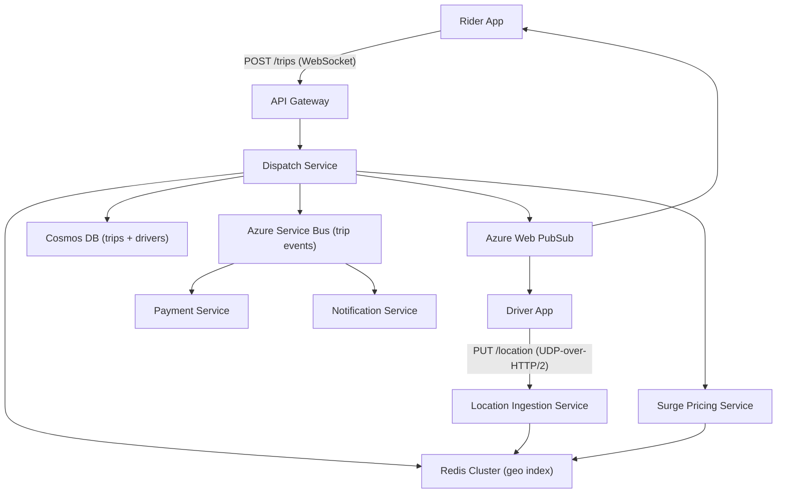
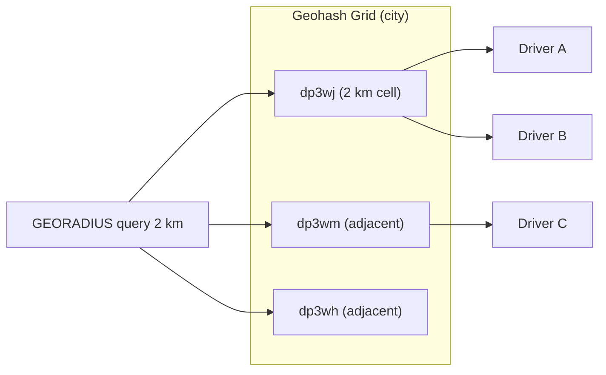
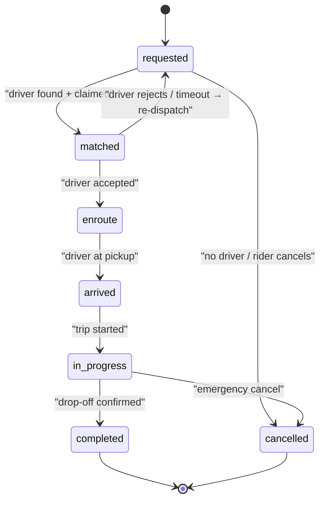

# 7. Design a Ride-Hailing Dispatch System (Uber-like)

> **TL;DR:** Match riders to nearby drivers in real time using a geospatial index, coordinate high-frequency driver location updates, and manage the full trip state machine with strong concurrency guarantees to prevent double-matching.

**Interview weight:** P0 — canonical geo + real-time system; tests geospatial indexing, write-amplification, concurrency (two riders claiming same driver), state machines, and surge pricing design.

---

## 1. Requirements

### Functional
- Rider requests a trip; system finds nearby available drivers and dispatches the best match.
- Driver app streams location updates continuously (~every 4 s while active).
- Real-time ETA shown to rider; updates as driver moves.
- Surge pricing applied per geofenced zone when demand > supply.
- Trip moves through a well-defined state machine; payments triggered on completion.
- Rider and driver receive live updates via persistent connections.

### Non-Functional
- Dispatch latency: < 2 s end-to-end (request → match confirmed).
- Driver location index freshness: < 5 s stale.
- Availability: 99.99% for dispatch; 99.9% for ancillary services.
- Throughput: 1 M active drivers globally; 50 K concurrent trips.
- Geo coverage: city-level isolation for independent scaling.

### Out of Scope
- Driver onboarding, KYC, vehicle inspection.
- In-app payments (delegated to payment service; see [09-Payment-and-Commerce-Platform.md](09-Payment-and-Commerce-Platform.md)).
- Maps and routing (consumed from 3rd-party: Azure Maps / Google Maps API).

---

## 2. Scale Estimation

| Metric | Calculation | Result |
|--------|-------------|--------|
| Active drivers (global) | 1 M | 1 M |
| Location update rate | 1 M drivers × 1 update/4 s | **250 K writes/s** |
| Location payload | driver_id + lat/lon + heading + timestamp ≈ 64 B | ~16 MB/s |
| Active trips | 50 K concurrent | 50 K |
| "Find nearby" queries | ~50 K riders/min polling or push | ~833 reads/s |
| Trip storage/day | 50 K × avg 15 min × 1 event/10 s = 4.5 M events | ~450 MB/day |
| Surge zone evaluations | every 30 s × 10 K zones | 333 evals/s |

Location writes dominate → **write amplification** is the core scaling challenge.

---

## 3. API Design

```
# Rider
POST /trips                          – request trip {pickup, destination, rider_id}
GET  /trips/{trip_id}                – poll status (fallback if WebSocket unavailable)
DELETE /trips/{trip_id}              – cancel (pre-match)

# Driver
PUT  /drivers/{driver_id}/location   – update position {lat, lon, heading, speed}
PUT  /drivers/{driver_id}/status     – AVAILABLE | OFFLINE | ON_TRIP
POST /trips/{trip_id}/accept         – driver accepts dispatch offer
POST /trips/{trip_id}/events         – lifecycle events (arrived, started, ended)

# Internal (Dispatch Service)
POST /dispatch/match                 – internal: find + atomically claim driver
```

All real-time updates flow over **WebSocket** (Azure Web PubSub) to both apps.

---

## 4. Data Model

### Driver Location (hot path — Redis)
```
Key:  driver:{city}:{driver_id}
Type: Redis Hash  { lat, lon, heading, updated_at, status }
TTL:  30 s  (stale-out if driver app silent)

Geospatial index:
GEOADD city:{city_id}:drivers  lon lat driver_id
```

### Trip (Cosmos DB — document store)
```json
{
  "id": "trip_abc",
  "riderId": "r_123",
  "driverId": "d_456",
  "status": "in_progress",
  "pickup": { "lat": 37.78, "lon": -122.41 },
  "destination": { "lat": 37.79, "lon": -122.40 },
  "events": [...],
  "fareEstimate": 12.50,
  "surgeMultiplier": 1.4,
  "createdAt": "2025-01-01T10:00:00Z",
  "updatedAt": "2025-01-01T10:05:00Z"
}
```
Partition key: `/riderId` (trips accessed by rider; hot driver queries use separate index).

### Driver State (Cosmos DB)
```
drivers collection — partition key: /cityId
fields: driverId, cityId, status, vehicleType, rating, onTripId
```

---

## 5. High-Level Architecture



**Request path (happy path):**
1. Rider app sends `POST /trips` → API Gateway → Dispatch Service.
2. Dispatch queries Redis `GEORADIUS city:{city} lon lat 2 km` → candidate driver list.
3. Dispatch scores candidates (distance, vehicle type, rating) → picks top driver.
4. Atomic claim via Redis `SET driver:{id}:lock trip_abc NX PX 10000` (10 s TTL).
5. Dispatch writes trip to Cosmos DB (status=`matched`), publishes event to Service Bus.
6. Web PubSub pushes offer to driver app; driver has 10 s to accept.
7. On accept, trip status → `enroute`; ETA streamed to rider via Web PubSub.
8. Driver arrives → `arrived`; rider boards → `in_progress`; drop-off → `completed`.
9. Service Bus event triggers Payment Service and Notification Service.

---

## 6. Deep Dives

### 6.1 Driver Location Updates — Write Amplification

| Problem | 250 K writes/s globally to a location index |
|---------|----------------------------------------------|
| **Sampling** | Accept updates only if driver moved > 50 m OR > 4 s elapsed (client-side filter). Reduces to ~80 K writes/s. |
| **Batching** | Driver app batches 3 updates, sends every 12 s. Latency trade-off: index up to 12 s stale. |
| **UDP-over-QUIC** | Drop-tolerant transport for location stream; no TCP head-of-line blocking. |
| **Per-city Redis** | City-scoped Redis clusters; no cross-region contention. |
| **Write fan-out** | Only update geospatial index; trip-progress writes go to separate path. |

### 6.2 Geospatial Index — Technology Choice

| Aspect | Geohash | Quadtree | S2 Geometry | H3 (Uber) |
|--------|---------|----------|-------------|-----------|
| **Shape** | Rectangular cells | Adaptive rectangles | Spherical caps (S2 cells) | Hexagons |
| **Hierarchy** | String prefix = parent | Pointer tree | 30 levels | 15 resolutions |
| **Neighbor query** | Prefix expansion + 8 adjacents (edge distortion) | Tree traversal | `GetNeighbors()` exact | Exact 6 neighbors always |
| **Uniform area** | No (stretches near poles) | No | No | Yes |
| **Range query ease** | Easy (LIKE prefix) | Easy (subtree) | Moderate | Moderate |
| **Redis native** | `GEOADD/GEORADIUS` (uses geohash internally) | Not native | Not native | Not native |
| **Best for** | Simple nearest-driver queries | Dynamic density maps | Accurate coverage polygons | Routing, surge zones |
| **Choice for dispatch** | ✅ Default (Redis built-in) | — | Side use for polygons | Surge zone polygons |



### 6.3 Matching / Dispatch Algorithm

| Approach | Latency | Optimality | Complexity | Use when |
|----------|---------|------------|------------|----------|
| **Greedy nearest** | < 50 ms | Local optimal | O(k log k) | Default; low supply |
| **Batched global (Hungarian/min-cost flow)** | 200–500 ms per batch | Global optimal | O(n³) | High density, surge |
| **ML-predicted ETA** | 100–200 ms (model inference) | Better than haversine | High | When maps API is slow |

Production choice: **greedy nearest** for P99 latency, upgrade to **batched optimization** in high-density geofences every 500 ms.

### 6.4 Trip State Machine



All state transitions are persisted as append-only events in the `trip.events` array (Cosmos DB).

### 6.5 Concurrency — Two Riders Claiming the Same Driver

Three strategies; each with trade-offs:

| Strategy | Mechanism | Pros | Cons |
|----------|-----------|------|------|
| **Pessimistic lock** | Redis `SET driver:{id}:lock NX PX 10000` | Simple; strong isolation | Lock lost if process crashes; 10 s TTL causes delay |
| **Optimistic concurrency** | Cosmos DB ETag; conditional update `IF etag = X` | No lock held; scales well | Retry on conflict; harder to reason about |
| **Atomic claim script** | Redis Lua script: check status + set in one atomic op | Best of both; truly atomic | Requires Lua script deployment |

**Chosen:** Redis Lua atomic claim (check `driver:status == AVAILABLE` and set to `CLAIMED:trip_abc` atomically). On failure (409), dispatch picks next candidate.

```csharp
// Redis Lua — atomic driver claim
const string ClaimScript = @"
  local status = redis.call('HGET', KEYS[1], 'status')
  if status == 'AVAILABLE' then
    redis.call('HSET', KEYS[1], 'status', 'CLAIMED', 'tripId', ARGV[1])
    return 1
  end
  return 0";

var claimed = (int)await _db.ScriptEvaluateAsync(
    ClaimScript,
    keys: new RedisKey[] { $"driver:{driverId}" },
    values: new RedisValue[] { tripId });
```

### 6.6 Surge Pricing

- H3 hexagonal grid zones computed every 30 s.
- `surgeMultiplier = max(1.0, demand_count / supply_count * baseMultiplier)` capped at 3×.
- Multipliers stored in Redis with 60 s TTL; Dispatch Service reads on trip creation.
- Rider sees surge acknowledgement modal; acceptance stored on trip document.

### 6.7 ETA Computation

- Primary: real-time routing API (Azure Maps) with live traffic.
- Fallback: haversine distance / average speed per road class.
- ETA refreshed every 20 s while `enroute`; pushed via Web PubSub.

---

## 7. Bottlenecks, Failure Modes & Trade-offs

| Bottleneck / Failure | Symptom | Mitigation |
|----------------------|---------|------------|
| Redis geo write storm | CPU spike, write latency > 10 ms | Per-city cluster + client-side sampling + batching |
| Dispatch service crash during match | Driver claimed, no trip written to Cosmos | Idempotency key on trip creation; saga: unlock driver on rollback |
| Driver goes offline mid-trip | No location updates; rider anxious | Rider shows "GPS weak" after 20 s silence; grace period before cancellation |
| Two dispatch pods claim same driver | Race condition | Redis Lua atomic script; only one writer wins |
| Surge pricing stale | Under-charging during demand spike | Short TTL (60 s) on surge keys; async recompute on demand |
| Web PubSub connection drop | Rider/driver miss state updates | Fallback polling `GET /trips/{id}` every 5 s |
| Payment service down | Trip completed, no charge | Service Bus message persisted; retry until consumed; saga compensate |

---

## 8. Scaling the Design

- **City-level sharding:** Each city gets independent Redis geo cluster, Dispatch Service deployment, and Cosmos DB logical partition. Cities don't share state.
- **Driver location write path:** Use Azure Event Hubs (partitioned by city) as a buffer; consumers write to Redis in micro-batches.
- **Read scaling:** Replica reads for `GEORADIUS`; Redis cluster with read replicas per city.
- **Dispatch Service:** Stateless; horizontally scale behind Azure Load Balancer. Sticky routing not needed — Redis is the shared state.
- **Global ≠ global deployment:** Each regional cluster is authoritative; cross-region trips (airport → abroad) handled by central coordinator (rare).

---

## 9. Follow-up Extensions

- **Scheduled rides:** Introduce `scheduled` state; pre-match driver 5 min before pickup.
- **Ride pooling:** Multi-rider matching; segment stops added to trip route.
- **Driver incentives and heat maps:** Read from aggregated trip data in Azure Synapse.
- **Driver app in low connectivity:** Offline-tolerant location buffer; flush on reconnect.
- **Fraud detection:** Anomalous GPS traces (GPS spoofing); ML model on trip events.

---

## Interview Questions

**Q1. How does the system find nearby available drivers?**
A: `GEORADIUS` on a Redis geo-set keyed by city. Drivers update their position via `GEOADD`. The command returns drivers within radius sorted by distance in O(N+log M).

**Q2. What is write amplification and how do you reduce it for driver locations?**
A: 1 M drivers × 15 updates/min = 15 M writes/min. Mitigate via: (a) client-side dead-reckoning filter (only send if moved > 50 m), (b) batch 3 updates, (c) UDP transport, (d) per-city Redis cluster.

**Q3. Why Redis for the geo index rather than Cosmos DB or PostgreSQL PostGIS?**
A: Redis geo operations are in-memory, sub-millisecond. Cosmos DB has no native geo-radius query with the same throughput. PostGIS scales well but adds operational complexity and is not Azure-native. Redis TTL also auto-expires stale drivers.

**Q4. Two riders simultaneously tap "request trip" and the system finds the same driver. What happens?**
A: A Redis Lua script atomically checks `driver.status == AVAILABLE` and sets it to `CLAIMED`. Only one caller gets return value `1`; the other retries with the next candidate. No lock TTL issue because the script is a single atomic operation.

**Q5. Walk me through the trip state machine transitions.**
A: `requested → matched` (atomic claim) → `enroute` (driver accepts) → `arrived` (at pickup) → `in_progress` (trip started) → `completed`. Side exits: `cancelled` from any non-terminal state; `matched → requested` on driver rejection/timeout triggers re-dispatch.

**Q6. How does surge pricing work at scale?**
A: A background job runs every 30 s per city. It counts active trip requests vs available drivers per H3 hex zone, computes `multiplier = demand/supply × base`, caps at 3×, and writes to Redis (60 s TTL). Dispatch Service reads multiplier on trip creation. Rider must explicitly acknowledge surge.

**Q7. Driver goes offline mid-trip. What do you do?**
A: Location service detects silence > 20 s → marks driver "GPS weak". After 60 s: attempt re-contact via push notification. If no response in 5 min: escalate to support, trip is suspended, rider notified. Do not auto-cancel — in-progress trip could be genuine tunnel.

**Q8. How do you handle the payment handoff at trip completion?**
A: On `completed` event, Dispatch Service publishes a `TripCompleted` message to Azure Service Bus. Payment Service consumes it idempotently (uses trip_id as dedup key), runs fare calculation (base + distance + duration + surge), charges the rider's stored payment method. See [09-Payment-and-Commerce-Platform.md](09-Payment-and-Commerce-Platform.md).

**Q9. How would you isolate a city's failure from the rest of the platform?**
A: Each city runs on a dedicated Redis cluster, Cosmos DB logical partition, and Dispatch Service deployment. Service Bus topics are per-city. A city crash (Redis OOM, Dispatch pod crash loop) does not affect other cities. Circuit breaker on cross-city calls.

**Q10. Greedy nearest vs batched global matching — when do you switch?**
A: Greedy nearest wins for P99 latency (< 50 ms) and is correct when supply is low (one-to-one obvious matches). Batched global optimization (Hungarian algorithm) runs every 500 ms in high-density zones during peak — 20% better average ETA at the cost of 200–500 ms dispatch delay.

**Q11. How do you prevent a driver from being shown to multiple dispatch pods simultaneously?**
A: The Redis geo-set gives a candidate list. Dispatch pods race to claim via the Lua atomic script. Only one wins. Losing pods retry with the next candidate. This is optimistic concurrency at the Redis level — no distributed lock across pods.

**Q12. How would you scale the WebSocket connections for real-time updates?**
A: Azure Web PubSub is a managed WebSocket service that handles millions of persistent connections with a publish/subscribe model. Dispatch Service publishes to a group (`trip:{trip_id}`); both rider and driver client join that group on trip creation. No state in the Dispatch Service itself.

**Q13. How would you design regional sharding for a global deployment?**
A: Assign each driver and rider a home city/region at account creation. Route requests to the regional cluster via geo-DNS or Azure Traffic Manager. Cross-region trips (e.g. airport pickups near a border) handled by a central coordinator with higher latency SLO.

---

## Quick Recap

- **Write amplification:** 1 M drivers × GPS updates → per-city Redis cluster + client sampling + batching.
- **Geo index:** Redis `GEORADIUS` (geohash internally); H3 hexagons for surge zones.
- **Concurrency:** Redis Lua atomic claim — only one dispatch pod wins a driver.
- **State machine:** `requested → matched → enroute → arrived → in_progress → completed/cancelled`.
- **Dispatch algorithm:** Greedy nearest (default) → batched global in high-density zones.
- **Surge:** H3 demand/supply ratio every 30 s → Redis TTL 60 s → rider acknowledgement required.
- **Failure modes:** driver offline mid-trip (grace period), payment down (Service Bus retry), dispatch crash (idempotent trip creation).
- **City-level isolation:** independent Redis + Cosmos partition + Dispatch deployment per city.
