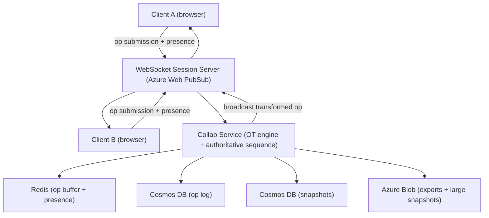
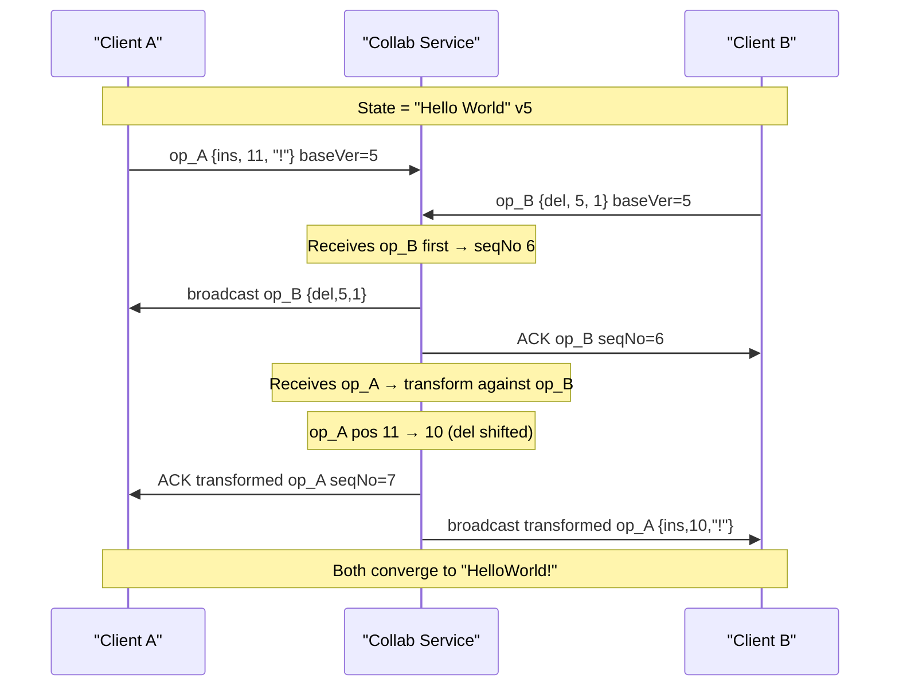

# 8. Design a Collaborative Document Editor (Google Docs-like)

> **TL;DR:** Enable multiple users to edit the same document simultaneously with real-time convergence using Operational Transformation or CRDTs, backed by an operation log for history, and WebSocket rooms for presence and change propagation.

**Interview weight:** P0 — tests distributed consistency, concurrency models, WebSocket at scale, and the classic OT vs CRDT trade-off. Frequent at Staff/Tech-Lead level.

---

## 1. Requirements

### Functional
- Multiple users edit the same document concurrently; all clients converge to identical content.
- Real-time cursors and presence (who is in the document, where their cursor is).
- Offline editing: changes sync when reconnected without data loss.
- Document permissions: owner, editor, commenter, viewer.
- Version history: view and restore any past revision.
- Comments and suggestions (tracked changes).
- Export: PDF, DOCX, plain text.

### Non-Functional
- Collaborative latency: local keystrokes render immediately (optimistic); convergence within 1 s.
- Document size: up to 2 MB text (~400 K words) per document.
- Concurrent editors: up to 50 per document; up to 10 M documents total.
- Availability: 99.9% (some brief degradation to read-only acceptable).
- Storage: hot documents in memory; cold in Azure Blob + Cosmos DB.

### Out of Scope
- Binary file collaboration (spreadsheets, drawings).
- Email and calendar integration.
- Rich media embedding (images/videos stored separately).

---

## 2. Scale Estimation

| Metric | Calculation | Result |
|--------|-------------|--------|
| Active documents (peak) | 1% of 10 M | 100 K |
| Ops per document per second | ~2 keystrokes/s × avg 5 editors | 10 ops/s/doc |
| Total ops/s (peak) | 100 K docs × 10 | **1 M ops/s** |
| Op payload | op type + position + content + version ≈ 100 B | 100 MB/s |
| Snapshot interval | every 100 ops or 60 s | — |
| Op log storage/day | 1 M ops/s × 100 B × 86 400 s | ~8.6 TB/day (compressed: ~1 TB) |
| WebSocket connections | 100 K docs × 5 editors | **500 K persistent connections** |

---

## 3. API Design

```
# Document management
POST   /docs                              – create document
GET    /docs/{doc_id}                     – load latest snapshot + pending ops
PATCH  /docs/{doc_id}/ops                – submit operation(s)
GET    /docs/{doc_id}/history            – list revisions
POST   /docs/{doc_id}/restore/{version} – restore version

# Permissions
PUT    /docs/{doc_id}/permissions        – share with user/group + role
DELETE /docs/{doc_id}/permissions/{uid}  – revoke

# Comments
POST   /docs/{doc_id}/comments           – add comment at range
PATCH  /docs/{doc_id}/comments/{cid}     – resolve/reply

# WebSocket
WS  wss://collab.service/docs/{doc_id}  – real-time ops + presence channel
```

---

## 4. Data Model

### Document Storage (Cosmos DB — `documents` container)

| Field | Type | Notes |
|-------|------|-------|
| `id` (partition key) | string | doc_id |
| `snapshotContent` | string | latest compacted snapshot text |
| `snapshotVersion` | int | op sequence number at snapshot |
| `title` | string | |
| `ownerId` | string | |
| `permissions` | object | `{uid: role}` map |
| `updatedAt` | timestamp | |

### Operation Log (Cosmos DB — `ops` container, partition key `/docId`)

| Field | Type | Notes |
|-------|------|-------|
| `id` | string | `{docId}:{seqNo}` |
| `docId` | string | |
| `seqNo` | int | monotone per-doc sequence number |
| `clientId` | string | editor session |
| `op` | object | `{type: insert/delete, pos, chars, len}` |
| `baseVersion` | int | version client saw when creating op |
| `timestamp` | timestamp | |

### Presence (Redis, TTL 30 s)
```
Key:  presence:{doc_id}:{user_id}
Val:  { cursorPos, selectionRange, userName, color, updatedAt }
```

---

## 5. High-Level Architecture



**Request path:**
1. User types → client creates op `{insert, pos=42, chars="hello", baseVersion=57}`.
2. Client applies op locally (optimistic) and sends to WebSocket Session Server.
3. Session Server routes to Collab Service for document (consistent hashing on `doc_id`).
4. Collab Service assigns next `seqNo`, transforms op against any concurrent ops (OT), appends to op log in Redis (hot) and Cosmos DB (durable).
5. Collab Service broadcasts transformed op to all other clients in the document's WebSocket group.
6. Receiving clients apply the op; content converges.
7. Every 100 ops (or 60 s), Snapshot Worker compacts op log → new snapshot in Cosmos DB.

---

## 6. Deep Dives

### 6.1 OT vs CRDTs — Core Trade-off

| Aspect | Operational Transformation (OT) | CRDTs (e.g. Yjs, Automerge) |
|--------|--------------------------------|------------------------------|
| **Convergence guarantee** | Yes — if all ops pass through central server in same order | Yes — by design; no central ordering needed |
| **Intention preservation** | Yes (transform preserves intent) | Mostly; depends on CRDT type |
| **Server requirement** | Requires authoritative server to assign sequence and transform | Peer-to-peer capable; server optional |
| **Memory overhead** | Low — just ops; no tombstones | High — tombstones never deleted (RGA/LSEQ) |
| **Complexity** | High — quadratic ops for concurrent edits; Jupiter/dOPT proofs | Moderate — merge is automatic; no transform logic |
| **Network round-trip** | Must ACK from server before remote apply | Can apply immediately; eventual convergence |
| **Offline support** | Hard — client needs to replay against server | Natural — merge on reconnect |
| **Document growth** | Compactable via snapshots | Doc grows with tombstones; GC is expensive |
| **Examples** | Google Docs, Wave | Yjs (Figma, Notion), Automerge, Apple Notes |
| **Best for** | Existing server infra, low memory budget | Offline-first, P2P, no strong server |

**Choice here:** OT with central Collab Service (Azure-native, existing server infra, snapshot compaction simple).

### 6.2 How OT Transforms Concurrent Ops (Worked Example)

Initial state: `"Hello World"` at version 5.

- **Client A** (offline from B): insert `"!"` at pos 11 → op_A = `{ins, 11, "!"}`, baseVersion=5.
- **Client B** (offline from A): delete char at pos 5 → op_B = `{del, 5, 1}`, baseVersion=5.

Server receives op_B first (seqNo 6), then op_A (seqNo 7).

Transform op_A against op_B: B deleted at pos 5 (before A's pos 11) → A's pos shifts left by 1 → transformed op_A = `{ins, 10, "!"}`.

Result on all clients: `"HelloWorld!"` — identical.



### 6.3 CRDT Types for Text (Brief)

| CRDT | Identifier scheme | Pros | Cons |
|------|------------------|------|------|
| **RGA (Replicated Growable Array)** | Unique timestamp per character | Simple, fast insert | Tombstones accumulate |
| **LSEQ** | Variable-length fractional IDs | Better ID distribution | Complex boundary strategy |
| **Yjs (Y-sequence)** | Relative positions (left/right anchor) | Small doc size, GC support | Complex implementation |

Yjs is the practical default for new CRDT-based editors (Figma uses it for multiplayer).

### 6.4 Document Model and Storage

- **Hot path (< 5 min old):** Op log in Redis (List, capped at 1 K ops). Collab Service reads from Redis.
- **Warm path:** Ops in Cosmos DB `ops` container partitioned by `docId`.
- **Snapshot:** Compact every 100 ops; store full text in Cosmos or Azure Blob (> 1 MB).
- **Version history:** Each snapshot is a version; ops between snapshots reconstruct intermediate states.
- **Cold/archive:** Documents inactive > 90 days: snapshot compressed to Blob, op log pruned. Restore on open.

### 6.5 Presence and Cursors

- On WebSocket connect: client sends `{userId, cursorPos, selectionRange, color}`.
- Collab Service writes to Redis with 30 s TTL; refreshed on each cursor move.
- Presence updates broadcast to document group (not persisted to op log).
- On disconnect: TTL expires naturally → Collab Service broadcasts `userLeft` after 30 s.
- Cursor positions must be **transformed** against incoming ops (same OT logic) — a cursor at pos 42 shifts right if an insert at pos 10 arrives.

### 6.6 Offline Editing and Sync

1. Client stores pending ops in IndexedDB (browser) while offline.
2. On reconnect: sends `{docId, clientVersion, pendingOps[]}` to server.
3. Server fetches all ops from `clientVersion` to current `seqNo`.
4. Applies OT: transforms each pending op against server ops received during offline period.
5. Returns transformed ops and current snapshot to client; client replays.
6. Conflict risk: high concurrent edits during long offline period — OT handles this correctly but may produce surprising merge results (user sees a rebase of their work).

### 6.7 WebSocket Session Servers and Routing

- **Azure Web PubSub** manages connection pool (500 K connections).
- Each document maps to a PubSub group (`doc:{doc_id}`).
- Multiple Collab Service pods; consistent hashing on `doc_id` → each document has one authoritative pod.
- Pod crash: re-hash to new pod; pod re-loads latest snapshot + Redis op buffer. Reconnect < 2 s.

---

## 7. Bottlenecks, Failure Modes & Trade-offs

| Bottleneck / Failure | Symptom | Mitigation |
|----------------------|---------|------------|
| Hot document (50 editors) | Collab Service pod CPU spike | Pin document to dedicated pod; rate-limit ops per client (100/s) |
| Op log unbounded growth | Cosmos RU/s cost, slow load | Snapshot every 100 ops; prune ops older than snapshot |
| Redis restart (op buffer lost) | Recent ops lost | Collab Service writes to Cosmos synchronously before ACK |
| OT transform bug | Documents diverge silently | Hash of document content compared across clients every 10 s; alert on mismatch |
| Presence storm (50 users move cursors) | Broadcast flood | Throttle cursor updates to 100 ms; batch presence messages |
| Large document load | 2 MB snapshot + 1 K ops = slow load | Stream snapshot in chunks; lazy-load old ops only if user scrolls to history |
| Collab Service pod crash mid-op | Op partially written | Idempotent op append using `seqNo` as Cosmos document id; at-least-once delivery |

---

## 8. Scaling the Design

- **Per-document Collab Service affinity:** Consistent hashing routes all ops for a document to one pod. Horizontal scale = more pods = more documents. One pod handles ~1 K active documents at 10 ops/s/doc.
- **Sharding op log:** Cosmos DB partitioned by `docId`; up to 10 GB / 10 K RU/s per logical partition — sufficient for most documents with periodic snapshot pruning.
- **Export workers:** Async; convert snapshot + op replay to DOCX/PDF in background worker pool. Azure Blob stores result; presigned URL returned to client.
- **Multi-region:** Azure Web PubSub and Cosmos DB multi-region write. OT remains single-authoritative-server per document to avoid cross-region transform complexity.

---

## 9. Follow-up Extensions

- **Spreadsheet collaboration:** CRDT for cells (less sequential position conflict) or OT per cell.
- **AI writing assistant (Copilot):** Insert AI-generated text as a regular insert op; clients see streamed tokens as a cursor-attributed insertion.
- **Tracked changes / suggestions mode:** Ops marked as `suggestion`; author must accept/reject before merging into canonical content.
- **Two-tier presence:** "viewing" (cursor only, no op cost) vs "editing" (full collaboration flow).
- **Delta sync:** Send only op diffs since client's known version on reconnect; avoids full snapshot transfer.

---

## Interview Questions

**Q1. What is the core problem in collaborative editing?**
A: Two clients submit operations based on the same document version simultaneously. Applying both naively produces diverged state. OT or CRDTs ensure all clients converge to the same final document.

**Q2. Explain Operational Transformation in one minute.**
A: When two ops are concurrent (same base version), the server transforms one against the other to adjust positions. A delete before your insert position shifts your insert position left. After transformation, both ops can be applied in any order and produce the same result.

**Q3. Why does OT require a central server?**
A: OT convergence proofs depend on all clients seeing ops in the same total order. A central server assigns a monotone sequence number (`seqNo`) and transforms incoming ops against all concurrent ops in that order. Without a central order, you need Jupiter/dOPT algorithms that are far more complex.

**Q4. What is a CRDT and how does it avoid needing a server?**
A: A Conflict-free Replicated Data Type is a data structure where concurrent updates can always be merged deterministically. Each character gets a unique, globally ordered identifier (e.g. by timestamp + client ID). Merging two states just takes the union of character sets; deleted chars become tombstones. No transform step needed.

**Q5. When would you choose CRDTs over OT?**
A: Offline-first apps (mobile), peer-to-peer collaboration without a server, or when the document model is not purely linear text (e.g. a canvas where OT position transforms don't apply). OT is simpler when a server exists and memory budgets are tight (no tombstone growth).

**Q6. How do you handle offline editing with OT?**
A: Client buffers ops in local storage. On reconnect, server fetches all ops since client's last known version and transforms the client's buffered ops against them. Client replays the transformed ops. Long offline periods can cause non-intuitive merges but never data loss.

**Q7. How do you implement version history without storing every op forever?**
A: Snapshot every 100 ops. Store snapshot + `snapshotVersion`. Prune ops older than the previous snapshot. To reconstruct any point in time: load the nearest preceding snapshot and replay ops up to the target version. Snapshots compress well (text-only documents).

**Q8. How do you prevent two clients' cursors from showing stale positions?**
A: Cursor positions are included in the presence payload. When a client receives a remote op that inserts/deletes chars before a cursor's position, it must transform the cursor position exactly like a zero-length insert op. OT infrastructure handles this transparently.

**Q9. How would you handle a 50-person document that's generating 500 ops/s?**
A: Pin it to a dedicated Collab Service pod. Rate-limit each client to 50 ops/s. Batch ops from the same client into a single network message. On the broadcast side, batch outgoing ops into 50 ms windows per client to avoid per-op fan-out.

**Q10. How does your snapshot strategy interact with version history?**
A: Every snapshot is a version checkpoint. Users can restore a version by loading the snapshot directly. For fine-grained history (e.g., "show me edits from 3:15 PM to 3:18 PM"), replay ops between the two nearest snapshots. Export old versions by re-running the snapshot compaction at an arbitrary `seqNo`.

**Q11. What breaks if the Collab Service pod crashes while processing an op?**
A: If crash before Cosmos write: client retries; op is idempotent (same `clientId + clientSeqNo` = same Cosmos doc ID, upsert is safe). If crash after Cosmos write but before broadcast: other clients will not have the op. On reconnect they fetch ops from Cosmos since last seen `seqNo` and replay — they converge. The crashed pod's Redis buffer may be lost, but Cosmos is the source of truth.

**Q12. How do you scale to 10 M documents while keeping costs low?**
A: Tiered storage: hot documents keep snapshot + 100-op buffer in Redis. Documents inactive > 1 hour evicted from Redis; Cosmos is the fallback. Documents inactive > 90 days: compress snapshot to Azure Blob, delete Cosmos ops. On next open: load from Blob. ~95% of documents are cold at any time.

---

## Quick Recap

- **Core problem:** Concurrent ops at same base version → must transform or use CRDT to converge.
- **OT:** Central server assigns `seqNo`, transforms concurrent ops, requires no tombstones, memory-efficient.
- **CRDTs (Yjs):** Offline-first, P2P, tombstones grow but GC helps; no transform logic needed.
- **Storage:** Op log (Cosmos, partitioned by docId) + snapshots every 100 ops; Redis hot buffer.
- **Presence:** Redis TTL 30 s; cursor positions OT-transformed on each incoming op.
- **WebSocket:** Azure Web PubSub groups per document; Collab Service pods via consistent hashing.
- **Offline sync:** Buffer ops locally; OT-transform against server ops on reconnect.
- **Failure:** Idempotent op append; clients re-fetch ops since last `seqNo` after pod crash.
