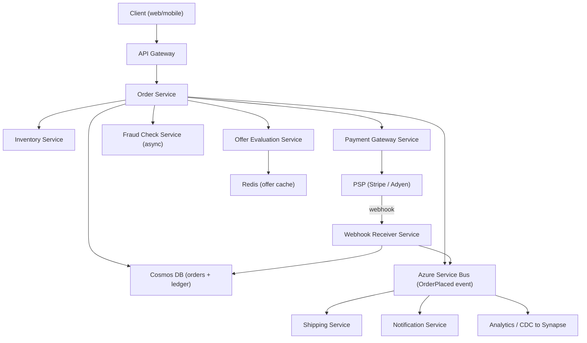
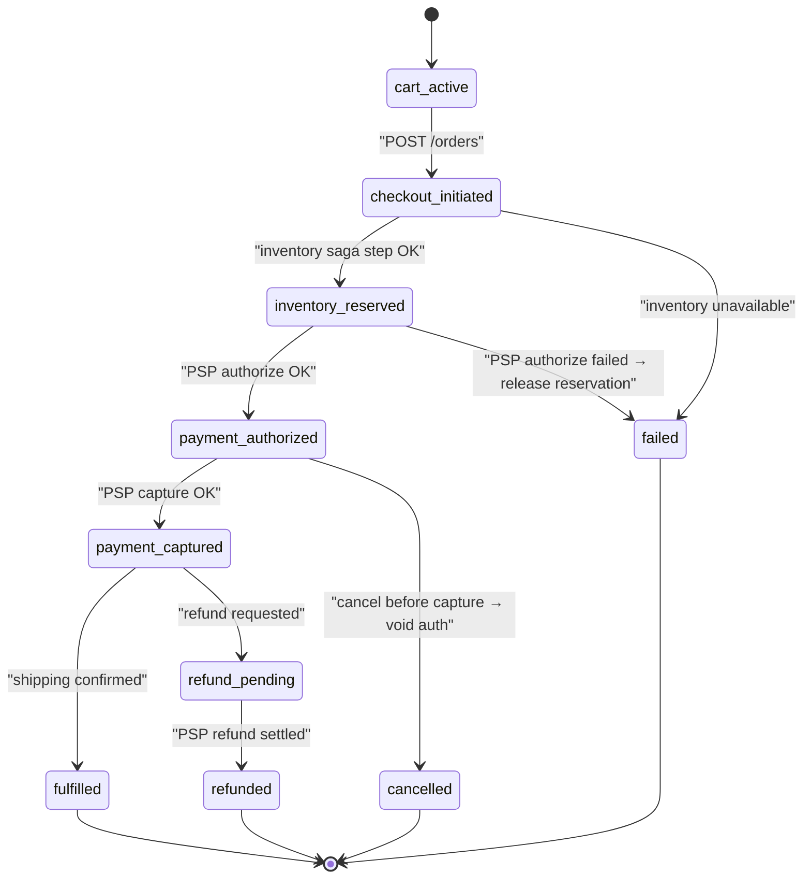
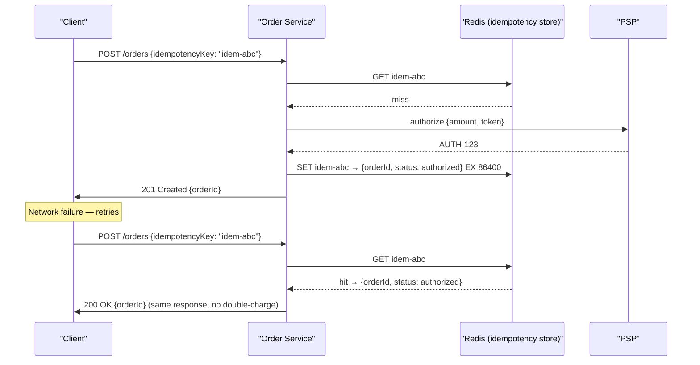
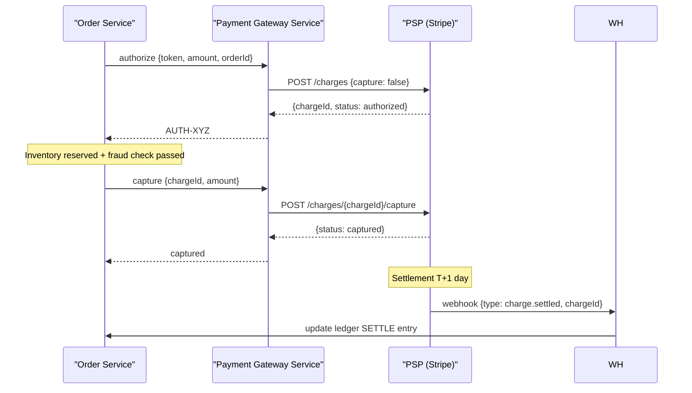
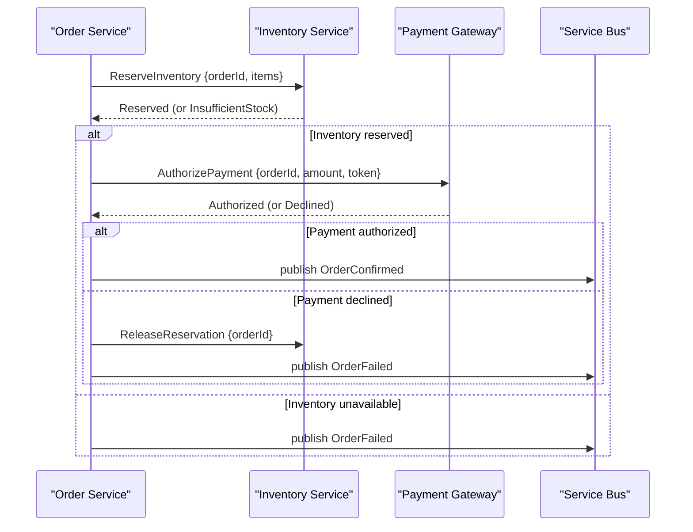

# 9. Design a Payment and Commerce Platform

> **TL;DR:** A transactionally safe, idempotent order-placement system with offer/discount modeling, saga-based distributed coordination, exactly-once payment charging, and an immutable ledger — directly maps to the Sales Campaign Authoring Platform you built ($5M quarterly revenue impact).

**Interview weight:** P0 — money never disappears; tests idempotency, sagas, exactly-once semantics, concurrency (oversell), distributed consistency, and your direct resume experience with offer/discount modeling.

---

## 1. Requirements

### Functional
- Catalog: browse products with pricing; apply offers, discounts, stacking rules.
- Cart: add/remove items; preview discounts and final price.
- Checkout: place order → reserve inventory → charge payment → confirm.
- Order lifecycle state machine tracked end-to-end.
- Payment gateway integration: authorize → capture → settle; refunds and chargebacks.
- Webhooks from PSP (payment service provider) acknowledged securely.
- Version history and audit trail for all monetary events.

### Non-Functional
- Idempotency: every payment API call must be safe to retry without double-charge.
- Consistency: inventory reservation and payment must be atomic or compensated.
- Latency: checkout P99 < 3 s.
- Auditability: every financial event immutable and queryable.
- PCI-DSS: no raw card data in application tier; tokenization via PSP.

### Out of Scope
- Shipping logistics beyond "shipping service notified".
- Fraud scoring ML model internals (consumed as a service).
- Tax authority integrations beyond capturing applicable rate.

---

## 2. Scale Estimation

| Metric | Calculation | Result |
|--------|-------------|--------|
| Orders/day | 1 M | 1 M/day |
| Peak QPS (10× daily avg in 2 h window) | 1 M / 86 400 × 10 | ~116 orders/s peak |
| Offer evaluations per checkout | ~10 offers × 1 M/day | 10 M evals/day |
| PSP webhook events/day | ~1.2 M (including settlements) | 14 events/s |
| Ledger entries/order | ~4 (reserve, charge, capture, settle) | 4 M entries/day |

---

## 3. API Design

```
# Catalog
GET  /products/{id}                   – product with pricing and available offers
GET  /offers?productIds=...            – eligible offers for a product set

# Cart
POST   /carts                          – create cart {customerId}
PUT    /carts/{cart_id}/items          – add/update item
DELETE /carts/{cart_id}/items/{sku}    – remove item
GET    /carts/{cart_id}/preview        – price preview with discounts applied

# Orders
POST   /orders                         – place order {cartId, paymentMethodToken, idempotencyKey}
GET    /orders/{order_id}              – order status
POST   /orders/{order_id}/cancel       – cancel (pre-capture only)
POST   /orders/{order_id}/refund       – full or partial refund {amount?, reason}

# Webhooks (PSP → Platform)
POST   /webhooks/psp                   – receive PSP events (HMAC-verified)
```

**Idempotency key:** Client generates a UUID per checkout attempt and passes it in `POST /orders`. Server stores `(idempotencyKey → orderId)` in Redis/Cosmos. Duplicate request returns existing result. See §6.2.

---

## 4. Data Model

### Offer and Discount Model

| Entity | Key Fields | Notes |
|--------|-----------|-------|
| **Offer** | `offerId, name, type (PCT_DISCOUNT/FIXED/BOGO), value, startAt, endAt` | Top-level promotion |
| **EligibilityRule** | `ruleId, offerId, ruleType (MIN_CART/PRODUCT_IN_CART/CUSTOMER_SEGMENT), parameters` | AND-combined per offer |
| **StackingGroup** | `groupId, maxOffersApplicable, exclusiveWith[]` | Controls offer layering |
| **OfferPrecedence** | `offerId, priority (int)` | Deterministic tie-break |
| **AppliedOffer** | `orderId, offerId, discountAmount, appliedAt` | Audit trail |

**Stacking rule:** Offers in same `StackingGroup` — only `maxOffersApplicable` apply; lowest-priority offers dropped. Offers in different groups stack. This mirrors the real-world Sales Campaign Authoring Platform design.

### Order State Machine — Cosmos DB `orders` container

```json
{
  "id": "ord_abc",
  "customerId": "cust_123",
  "status": "payment_authorized",
  "items": [{ "sku": "SKU-001", "qty": 2, "unitPrice": 2999, "currency": "USD" }],
  "appliedOffers": [{ "offerId": "off_summer", "discountAmount": 500 }],
  "totalAmount": 5498,
  "currency": "USD",
  "paymentAuthCode": "AUTH-XYZ",
  "idempotencyKey": "idem-uuid-here",
  "events": [...],
  "updatedAt": "2025-01-01T10:00:00Z"
}
```

Partition key: `/customerId`.

### Ledger — Cosmos DB `ledger` container (append-only)

| Field | Type | Notes |
|-------|------|-------|
| `entryId` | string | UUID |
| `orderId` | string | |
| `type` | enum | `RESERVE / CHARGE / CAPTURE / SETTLE / REFUND / CHARGEBACK` |
| `debitAccount` | string | e.g. `customer:123` |
| `creditAccount` | string | e.g. `merchant:456` |
| `amount` | long | Minor units (cents); **never float** |
| `currency` | string | ISO 4217 |
| `timestamp` | timestamp | Immutable once written |

Double-entry: every `CHARGE` has a debit (customer) and credit (platform escrow). Every `SETTLE` moves from escrow to merchant.

---

## 5. High-Level Architecture



---

## 6. Deep Dives

### 6.1 Order Lifecycle State Machine



### 6.2 Idempotency for Payments (Exactly-Once Charge)



**Rules:**
- `idempotencyKey` must be client-generated UUID per logical request.
- Redis TTL: 24 h (covers all reasonable retry windows).
- If in-flight (first request still processing): return `409 Conflict` with `Retry-After`.
- Idempotency applies to: order creation, refund, capture — any non-idempotent PSP call.

```csharp
public async Task<OrderResult> PlaceOrderAsync(PlaceOrderRequest req)
{
    var key = $"idem:{req.IdempotencyKey}";
    var cached = await _redis.StringGetAsync(key);
    if (cached.HasValue) return JsonSerializer.Deserialize<OrderResult>(cached!);

    // Optimistic lock: SET NX — only one concurrent call proceeds
    var acquired = await _redis.StringSetAsync(key, "in-flight",
        TimeSpan.FromSeconds(30), When.NotExists);
    if (!acquired) throw new ConflictException("Request in flight");

    var result = await ExecuteOrderSagaAsync(req);
    await _redis.StringSetAsync(key, JsonSerializer.Serialize(result), TimeSpan.FromHours(24));
    return result;
}
```

### 6.3 Payment Gateway Integration



**PSP abstraction:** `IPaymentProvider` interface with `Authorize / Capture / Refund / Void` methods. Concrete implementations: `StripePaymentProvider`, `AdyenPaymentProvider`. Failover: if PSP A returns 503, retry on PSP B after 3 attempts. Track which PSP charged per order for refund routing.

### 6.4 Saga Pattern — Order Placement Across Services

The saga executes as a **choreography-based saga** via Azure Service Bus events; each service listens and reacts.



**Compensating transactions (failure path):**

| Step failed | Compensation |
|-------------|-------------|
| Payment declined | `IS.ReleaseReservation(orderId)` |
| Shipping service error | `PGW.RefundCharge(chargeId)` + `IS.ReleaseReservation(orderId)` |
| Notification failure | No compensation needed (non-transactional) |

Each compensating call is idempotent (same `orderId`). Compensation retried up to 5× with backoff. If still failing → DLQ → manual resolution.

### 6.5 Inventory Reservation and Oversell Prevention

| Strategy | Mechanism | Pros | Cons |
|----------|-----------|------|------|
| **Optimistic concurrency** | Cosmos DB ETag; CAS update `qty -= n IF etag = X` | Scales, no lock held | Retry on conflict; bad for flash sales |
| **Reservation TTL** | Reserve slot for 10 min; if order not completed, release | Natural expiry | Capacity appears reduced during TTL |
| **Distributed lock (Redis)** | `SET sku:{sku}:lock NX PX 5000` per SKU | Strong isolation | Lock contention at high QPS |
| **Database-level check constraint** | `qty >= 0` constraint; DB rejects negative | Simple | Serialization bottleneck at DB layer |

**Chosen:** Optimistic concurrency (Cosmos ETag) + reservation TTL 10 min. At flash-sale scale: pre-allocate inventory tokens in Redis (counter `DECRBY`, reject if < 0); sync back to Cosmos asynchronously.

```csharp
// Optimistic reservation in Cosmos DB
var item = await _container.ReadItemAsync<InventoryItem>(sku, partitionKey);
if (item.Resource.AvailableQty < qty) throw new InsufficientStockException();
item.Resource.AvailableQty -= qty;
item.Resource.ReservedQty += qty;
await _container.ReplaceItemAsync(item.Resource, sku,
    requestOptions: new() { IfMatchEtag = item.ETag }); // throws if ETag mismatch
```

### 6.6 Double-Entry Ledger

Every monetary movement is two ledger entries: one debit, one credit. Balances must always net to zero.

| Transaction | Debit | Credit | Amount |
|-------------|-------|--------|--------|
| Customer charges card | `customer:123` (AR) | `escrow:platform` | $54.98 |
| Merchant payout | `escrow:platform` | `merchant:456` | $52.23 |
| Platform fee | `escrow:platform` | `revenue:fees` | $2.75 |
| Refund to customer | `escrow:platform` | `customer:123` | $54.98 |

Ledger entries are **immutable** (no UPDATE, only INSERT). Corrections via reversal entries. This enables full audit trail and reconciliation.

### 6.7 Webhooks from PSP

```
POST /webhooks/psp
Headers: Stripe-Signature: t=...,v1=...
```

**Verification:**
1. Compute HMAC-SHA256 of `${timestamp}.${raw_body}` using webhook signing secret.
2. Compare against signature in header. Reject if mismatch.
3. Reject if `|now - timestamp| > 300 s` (replay protection).

**Idempotency:** Store `(eventId → processedAt)` in Cosmos; skip duplicate events.

**Out-of-order delivery:** Webhooks can arrive out of sequence (e.g. `charge.settled` before `charge.captured`). Use event type + current order state to decide action; ignore events that don't match expected state (don't regress state machine).

### 6.8 Currency, Rounding, and Precision

- **Never use `float` or `double` for money.**
- Store all amounts as `long` in minor units (cents for USD, pence for GBP).
- Use `decimal` in C# for intermediate calculations; round at final step only.
- Rounding rule: HALF_UP (banker's rounding: HALF_EVEN is technically more correct for financial systems).
- Multi-currency: store `(amount, currency)` pairs; never auto-convert without explicit exchange rate snapshot.
- Exchange rate stored with `rateTimestamp`; reconciliation uses rate at time of transaction.

```csharp
// Safe money arithmetic — use decimal, store as long (cents)
decimal subtotal = items.Sum(i => (decimal)i.UnitPriceCents * i.Quantity);
decimal discountCents = Math.Round(subtotal * discountPct, 0, MidpointRounding.AwayFromZero);
long finalCents = (long)(subtotal - discountCents);
```

---

## 7. Bottlenecks, Failure Modes & Trade-offs

| Bottleneck / Failure | Symptom | Mitigation |
|----------------------|---------|------------|
| Double-charge on retry | Customer charged twice | Idempotency key + Redis NX lock; PSP-level dedup |
| Oversell on flash sale | Negative inventory | Redis DECRBY as fast gate; Cosmos ETag as persistence CAS |
| PSP timeout mid-authorize | Unknown charge state | Poll PSP `/charges/{id}` for status before retry |
| Saga partial failure (pay OK, shipping fails) | Money taken, no delivery | Compensating refund; Service Bus DLQ for manual review |
| Webhook out of order | State machine regressed | State machine ignores backwards transitions; log for audit |
| Ledger reconciliation gap | Off-by-one cent per order | Reconciliation job runs nightly; tolerance < 0.01% flags alert |
| Hot inventory partition (1 SKU millions of orders) | Cosmos 429 throttling | Redis inventory counter front-end; batch Cosmos sync |

---

## 8. Scaling the Design

- **Order Service:** Stateless behind Azure Load Balancer; scale on CPU/QPS.
- **Offer Evaluation Service:** Cache all active offers in Redis (TTL = offer expiry). Evaluation is pure computation — horizontally scalable.
- **Inventory:** Redis counter as fast path; Cosmos as durable store. Per-SKU Redis key → no hot partition.
- **Ledger:** Cosmos write-heavy; partition by `orderId` (not `customerId`) to distribute writes evenly.
- **Analytics:** CDC (Cosmos Change Feed) → Azure Event Hubs → Azure Synapse for reporting. No ad-hoc queries against OLTP Cosmos.

---

## 9. Follow-up Extensions

- **Subscription billing:** Recurring saga triggered by scheduler; uses same idempotency pattern with `subscriptionId:period` as key.
- **Multi-currency dynamic pricing:** FX rate service; amount stored in both original and settlement currency.
- **Tax service integration:** Tax calculated at checkout; stored on order immutably at purchase time.
- **Buy now, pay later:** Payment authorization split; second installment scheduled via durable task.
- **Loyalty points:** Separate ledger for points; redeemable as a discount offer type.

---

## Interview Questions

**Q1. What is an idempotency key and why is it critical for payments?**
A: A client-generated UUID sent with every payment request. Server caches `{key → result}`. Retries return the cached result without re-executing the payment. Without it, a network timeout causes double-charge — money debited twice for one order.

**Q2. What's the difference between authorize and capture?**
A: Authorize places a hold on the customer's funds (no money moves). Capture actually moves the money. This separation lets you authorize at checkout and capture only when the item ships, or void the auth if the order is cancelled without any charge.

**Q3. How does the saga pattern handle partial failures in order placement?**
A: Each saga step (inventory reserve → payment authorize → shipping notify) has a corresponding compensating transaction. If step N fails, steps 1..N-1 are rolled back via compensation. Compensations are idempotent and retried via Service Bus until successful or escalated to DLQ.

**Q4. How do you prevent overselling during a flash sale?**
A: Use a Redis counter (`DECRBY qty IF counter >= 0`) as a fast atomic gate before any DB write. Redis operations are single-threaded — no race condition. Cosmos DB ETag provides a second CAS layer for durable consistency. Reservation TTL auto-releases uncompleted orders.

**Q5. Walk me through the offer/discount stacking rules.**
A: Each offer belongs to a `StackingGroup`. Within a group, only `maxOffersApplicable` offers apply (sorted by priority, best for customer first). Offers in different groups stack freely. `EligibilityRule` gates whether an offer applies at all (e.g. cart > $50, specific product in cart). This is exactly the model you built in the Sales Campaign Authoring Platform.

**Q6. How do you handle PSP webhooks arriving out of order?**
A: Treat each webhook as a fact, not a command. Check current order state before applying. A `charge.settled` arriving before `charge.captured` is queued or ignored; when `charge.captured` arrives, settled is replayed from DLQ. Idempotency key on webhook `eventId` prevents double-processing.

**Q7. Why must money amounts never be stored as float?**
A: IEEE 754 floating-point cannot represent 0.1 exactly — `0.1 + 0.2 = 0.30000000000000004`. Compounding these errors across millions of transactions produces significant discrepancies. Use `long` (minor units: cents) for storage and `decimal` in C# for arithmetic.

**Q8. Explain double-entry bookkeeping in your ledger design.**
A: Every monetary event creates two entries: a debit on one account and a credit on another, equal in amount. The sum of all credits minus debits always equals zero. This is the invariant that makes financial auditing and reconciliation trustworthy. Errors show up as non-zero balances.

**Q9. How do you reduce PCI-DSS scope?**
A: Never handle raw card numbers in your application. The client-side PSP SDK tokenizes the card directly to the PSP (e.g. Stripe.js sends card to Stripe, returns a token). Your backend only ever sees the token. This keeps your application outside the cardholder data environment, drastically reducing PCI scope.

**Q10. What is your reconciliation strategy?**
A: Nightly job pulls all ledger entries and PSP settlement reports for the day. For each order, checks that `ledger.SETTLE.amount == PSP.settlement.amount`. Discrepancies flagged with severity (< 1 cent: log; > $1: alert on-call). Root causes: FX rounding, timing differences, missed webhooks. Cosmos Change Feed → Synapse for the analytics path.

**Q11. How would you handle a refund after a chargeback?**
A: Chargeback webhook from PSP creates a `CHARGEBACK` ledger entry reversing the `SETTLE`. Order status → `chargebacked`. If merchant disputes, dispute workflow opens. On dispute loss: chargeback is final, merchant account debited. Partial refunds before chargeback reduce exposure.

**Q12. How does your Sales Campaign Authoring Platform map to this design?**
A: The offer/discount model (offer types, eligibility rules, stacking groups, precedence) is directly the entity model above. The $5 M revenue impact came from correctly evaluating which offer combinations maximized conversion while preserving margin. The idempotency and saga patterns were implemented for the downstream order placement that consumed the campaign pricing.

---

## Quick Recap

- **Idempotency:** Client UUID idempotency key → Redis NX cache → prevents double-charge on retry.
- **Payment flow:** Authorize (hold) → Capture (charge) → Settle (payout); each step has compensation.
- **Saga:** Inventory reserve → payment authorize → shipping notify; rollback via compensating transactions.
- **Oversell:** Redis DECRBY atomic gate + Cosmos ETag CAS; reservation TTL auto-releases.
- **Offers/discounts:** Eligibility rules + stacking groups + precedence; pure computation cacheable in Redis.
- **Ledger:** Append-only, double-entry, amounts in minor units (`long`), never `float`.
- **Webhooks:** HMAC-SHA256 signature + timestamp replay guard + eventId idempotency.
- **Analytics:** Cosmos Change Feed → Event Hubs → Synapse; never OLAP on OLTP store.
