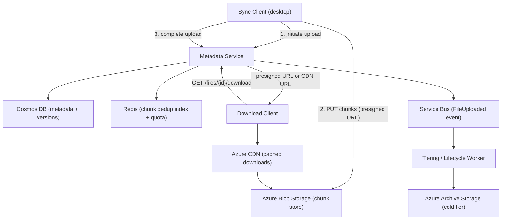
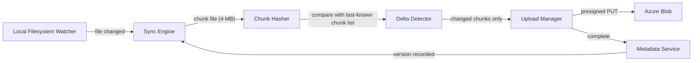

# 10. Design a Distributed File Storage System (Dropbox/Google Drive/S3-like)

> **TL;DR:** Split files into content-addressed chunks, store chunks redundantly across a distributed block store, and maintain a separate metadata service for namespace/permissions/versioning — allowing efficient delta sync, deduplication, and massive scale at commodity storage cost.

**Interview weight:** P0 — tests chunking/dedup, metadata vs data separation, consistency trade-offs, replication vs erasure coding, and the sync client engineering challenge.

---

## 1. Requirements

### Functional
- Upload, download, delete files up to 5 GB.
- Folder hierarchy, file renaming, move.
- File versioning and soft delete/trash (30-day recovery).
- Sharing: owner sets ACL per file/folder; shareable links.
- Sync client: desktop/mobile auto-syncs local folder.
- Delta sync: on re-upload, only changed chunks transferred.
- Quota per user/org.

### Non-Functional
- Durability: 11 nines (99.999999999%) for stored data.
- Availability: 99.9% for upload/download.
- Throughput: 10 M active users; peak 100 K concurrent uploads.
- Latency: metadata ops < 50 ms; first-byte download < 200 ms (with CDN).
- Consistency: metadata strongly consistent; chunk data eventually consistent (replication lag < 5 s).

### Out of Scope
- Real-time collaborative editing (see [08-Collaborative-Document-Editor.md](08-Collaborative-Document-Editor.md)).
- Video transcoding pipeline.
- Full-text search of file contents.

---

## 2. Scale Estimation

| Metric | Calculation | Result |
|--------|-------------|--------|
| Total stored data | 10 M users × 10 GB avg | 100 PB |
| Daily upload volume | 1% active × 500 MB avg | ~50 TB/day |
| Chunk size | 4 MB | 4 MB |
| Chunks uploaded/day | 50 TB / 4 MB | ~12.5 M chunks/day |
| Dedup ratio (documents) | ~30% unique | saves 35 TB/day |
| Metadata records | 10 M users × 10 K files avg | 100 B file records |
| Peak upload QPS | 100 K concurrent / 60 s per upload | ~1 667 uploads/s |

---

## 3. API Design

```
# Files
POST   /files/upload/initiate          – {fileName, size, mimeType, parentFolderId}
                                          → {uploadId, presignedUrls[]}
PUT    /files/upload/{uploadId}/parts  – multipart upload (one per chunk)
POST   /files/upload/{uploadId}/complete – finalize multipart; commit metadata
GET    /files/{file_id}/download       – → redirect to CDN/presigned URL
DELETE /files/{file_id}                – soft delete (moves to trash)
POST   /files/{file_id}/restore        – restore from trash
GET    /files/{file_id}/versions       – list versions
GET    /files/{file_id}/versions/{v}   – specific version

# Folders
POST   /folders                        – create folder {name, parentId}
GET    /folders/{folder_id}            – list children (paginated)
PATCH  /files/{file_id}                – rename or move {name?, parentFolderId?}

# Sharing
PUT    /files/{file_id}/acl            – {userId, role: viewer/editor/owner}
POST   /files/{file_id}/links          – create shareable link {expiresAt?, password?}
```

---

## 4. Data Model

### Metadata Service (Cosmos DB — `files` container, partition key `/ownerId`)

| Field | Type | Notes |
|-------|------|-------|
| `id` | string | file_id |
| `ownerId` | string | partition key |
| `name` | string | filename with extension |
| `parentFolderId` | string | null for root |
| `size` | long | bytes |
| `mimeType` | string | |
| `currentVersionId` | string | pointer to latest version |
| `trashed` | bool | soft delete flag |
| `trashedAt` | timestamp | TTL-based auto-purge |
| `acl` | object | `{userId: role}` |
| `createdAt` | timestamp | |

### File Versions (`versions` container, partition key `/fileId`)

| Field | Type | Notes |
|-------|------|-------|
| `id` | string | versionId |
| `fileId` | string | |
| `chunkIds` | string[] | ordered list of chunk content hashes |
| `size` | long | total bytes |
| `uploadedAt` | timestamp | |
| `uploadedBy` | string | userId |

### Chunk Store

- Key: `SHA-256(chunk_content)` — content-addressed.
- Value: binary blob in Azure Blob Storage, geo-replicated.
- Dedup: if chunk hash already exists → skip upload, just reference it in version.
- Chunk metadata: stored in Redis + Cosmos (`chunks` container: `{chunkId, storageUri, refCount, size}`).

### Block vs File Storage

| Aspect | Block/Chunk Store (Azure Blob) | File Store (NFS/Azure Files) | Object Store (S3-like) |
|--------|-------------------------------|------------------------------|------------------------|
| **Unit** | Fixed-size chunks (4 MB) | Files as-is | Objects (variable) |
| **Dedup** | Yes (content hash) | No | No |
| **Delta sync** | Yes (only changed chunks) | No | No |
| **Access pattern** | Random read (chunk_id) | Sequential | Key-value (object_id) |
| **Best for** | Sync clients | Shared filesystems | Media, backup |

---

## 5. High-Level Architecture



**Upload path (numbered):**
1. Sync client chunks file into 4 MB pieces; computes SHA-256 per chunk.
2. Client calls `POST /files/upload/initiate` with chunk hashes → Metadata Service deduplicates (which chunks are already stored?).
3. Metadata Service returns `uploadId` and presigned Azure Blob SAS URLs only for **new** chunks.
4. Client uploads only new chunks directly to Azure Blob (bypassing Metadata Service for performance).
5. Client calls `POST /files/upload/complete` → Metadata Service writes version record (ordered `chunkIds[]`).
6. Service Bus `FileUploaded` event triggers lifecycle worker (virus scan, thumbnail generation, tiering).

---

## 6. Deep Dives

### 6.1 Sync Client — Delta Sync and Conflict Resolution



- **Watcher:** OS file system events (inotify / FSEvents / ReadDirectoryChangesW). Debounce 500 ms.
- **Chunking:** Fixed 4 MB chunks. For near-duplicate detection: variable-length chunking (content-defined chunking using Rabin fingerprinting) produces better dedup ratios but higher CPU cost.
- **Delta sync:** Client stores local chunk manifest. On save: recompute hashes for changed regions; only upload chunks whose hash changed. A 100 MB file with 1 line changed → only one 4 MB chunk uploaded.
- **Conflict:** Both local and remote changed since last sync. Strategy: create a conflict copy (`file (User's conflicted copy YYYY-MM-DD).ext`) and upload both. No data loss; user resolves manually.

### 6.2 Replication vs Erasure Coding

| Aspect | 3× Replication | Erasure Coding (e.g. Reed-Solomon 9+3) |
|--------|---------------|----------------------------------------|
| **Storage overhead** | 3× (200% extra) | 1.33× (33% extra) |
| **Durability** | Lose any 2 of 3 nodes | Lose any 3 of 12 nodes |
| **Durability math (11 nines)** | Need very low per-node failure rate | Achievable with 12 nodes, 3 parity |
| **Read latency** | Low — read any replica | Higher — reconstruct on degraded read |
| **Write latency** | Low — 3 parallel writes | Higher — encode before write |
| **CPU cost** | Negligible | Encoding/decoding CPU |
| **Network cost on failure** | Full chunk re-replicate | Partial — only parity chunks needed |
| **Best for** | Hot/frequently accessed data | Cold/warm tier (cost optimization) |

**11 nines math (RS 9+3):** Each of 12 disks has annual failure probability p = 0.01 (1%). Need ≥ 4 simultaneous failures. P(≥4 fail) ≈ C(12,4) × p⁴ × (1-p)^8 ≈ 495 × 10⁻⁸ × 0.923 ≈ 4.6 × 10⁻⁶ per year → ~99.99954% per year per chunk. With geographic distribution, 11 nines achievable.

Azure Blob Storage uses RS internally — you get durability without managing it. Understanding the math signals expertise.

### 6.3 Metadata Sharding

- Cosmos DB partition key `/ownerId` — all of a user's files in one logical partition (good for listing, path traversal).
- **Hot user problem:** A user with 10 M files would exceed 10 GB partition limit. Mitigation: sub-partition by folder prefix; synthetic partition key `{ownerId}:{folderBucket}`.
- **Namespace traversal:** Path-to-node lookup requires traversal from root. Denormalize: store full path string + parent pointer. Prefix query on path for subtree listing.
- **Quota tracking:** Redis counter `quota:{userId}` (bytes used). Incremented atomically on upload complete; decremented on delete. Cosmos as durable source of truth, synced every 5 min.

### 6.4 Encryption

| Approach | Server-side (SSE) | Client-side (CSE) |
|----------|------------------|--------------------|
| **Encryption key holder** | Cloud provider / platform | Client only |
| **Platform can read data** | Yes | No |
| **Key management** | Azure Key Vault + CMK | Client manages keys |
| **Performance impact** | Transparent | Client CPU for encrypt/decrypt |
| **Compliance** | Good (most regs) | Best (data sovereignty) |
| **Lost key** | Recoverable (Key Vault) | Data permanently lost |

Default: SSE with Customer-Managed Keys (CMK) in Azure Key Vault. Opt-in: CSE for sensitive orgs.

### 6.5 Cold/Hot/Archive Tiering and Lifecycle

- **Hot tier (Azure Blob Hot):** Files accessed in last 30 days. Cost: higher storage, low access cost.
- **Cool tier:** Accessed 30–180 days ago. 50% storage cost savings; small access cost.
- **Archive tier (Azure Blob Archive):** Not accessed in 180 days. 90% storage savings; rehydrate takes 1–15 h.
- **Lifecycle policy:** Metadata Service tags chunks with last-access timestamp. Tiering Worker (runs nightly) downgrades chunks via Azure Blob lifecycle rules.
- **Trash:** Soft-delete sets `trashed = true`, `trashedAt = now`. Cosmos TTL auto-deletes document after 30 days. Chunk refCount decremented; chunks with `refCount == 0` scheduled for GC.

### 6.6 Garbage Collection of Orphaned Chunks

Problem: chunk uploaded, referenced in a version, but version was never committed (crash mid-upload).

**GC strategy:**
1. Every chunk write sets a `pendingGC = true` flag in Redis.
2. On version commit: mark all chunks `pendingGC = false`.
3. GC worker runs every 6 h: scans chunks where `pendingGC = true AND uploadedAt < (now - 24h)`.
4. For each: verify no version document references the chunk hash. If unreferenced → delete from Blob.
5. Chunk refCount = 0 (no version references it) → safe to delete.

---

## 7. Bottlenecks, Failure Modes & Trade-offs

| Bottleneck / Failure | Symptom | Mitigation |
|----------------------|---------|------------|
| Metadata hot partition | Cosmos 429 throttling for power user | Sub-partition by `folderBucket`; Redis cache for listing |
| Large file upload fails at 95% | Wasted bandwidth | Multipart upload + presigned URLs; resume from last committed chunk |
| Dedup index misses (two users same content) | Wasted storage | Global chunk hash index in Redis + Cosmos; cross-user dedup (careful: privacy isolation needed) |
| CDN stale after file update | Download returns old version | Versioned CDN URLs (`/files/{id}?v={versionId}`); purge CDN on version commit |
| Tiering archive rehydrate lag | User waits 15 h for archived file | Keep hot/cool for anything accessed in 180 days; only truly cold data in archive; alert user |
| Sync client conflict storm | N clients all online after offline period | Client detects conflict before overwrite; create conflict copies; user resolves |
| GC deletes a chunk still referenced | Data loss | GC requires refCount == 0 AND no live version reference; two-phase check |

---

## 8. Scaling the Design

- **Metadata Service:** Stateless; scale horizontally. Cosmos DB handles storage scale.
- **Chunk uploads:** Direct-to-Blob via presigned SAS URLs — Metadata Service is not in the data path for chunk bytes. Throughput limited only by Blob Storage (Azure Blob supports ~20 Gbps per storage account; use multiple accounts for multi-PB scale).
- **Download:** Azure CDN caches popular files. Cache-hit downloads never hit origin.
- **Multi-region:** Azure Blob GRS (geo-redundant storage) provides cross-region replication automatically. Metadata replicated via Cosmos DB multi-region writes.
- **Many-small-files problem:** 1 M files × 1 KB average → lots of metadata operations, tiny chunks. Mitigation: pack small files into larger Blob containers (packing); use a separate metadata schema optimized for high-cardinality listing.

---

## 9. Follow-up Extensions

- **Real-time collaboration:** Offload to [08-Collaborative-Document-Editor.md](08-Collaborative-Document-Editor.md) for supported formats.
- **Full-text search:** Azure AI Search indexing file contents (Office, PDF extraction).
- **Virus scanning:** Async worker triggered by `FileUploaded` event; quarantine on detection.
- **Admin audit log:** Every access (view, download, share) logged to append-only store for compliance.
- **Team drives / shared spaces:** Separate namespace (orgId as partition key), quota at org level.

---

## Interview Questions

**Q1. How does chunking enable delta sync?**
A: File is split into 4 MB chunks; each chunk is hashed (SHA-256). On re-upload, client computes hashes for all chunks. Only chunks whose hash differs from the previous version's chunk list need to be uploaded. A 1 GB file with a small edit → 1 chunk upload instead of 1 GB.

**Q2. How does content-addressed storage enable deduplication?**
A: Chunk identity is its content hash. Before uploading a chunk, the client sends the hash to the Metadata Service. If a chunk with that hash already exists in the store, no upload is needed — the new file version just references the existing chunk. Multiple users with identical files share one physical copy.

**Q3. Why separate the metadata service from the block store?**
A: Metadata (namespace, permissions, versions) requires strong consistency and frequent small reads/writes. Block data (chunk bytes) requires high throughput, large sequential writes, and eventual consistency is acceptable. Mixing them in one service creates conflicting optimization requirements. Separation also lets chunk uploads go directly to Blob Storage without traversing the Metadata Service.

**Q4. How do you achieve 11 nines of durability?**
A: Azure Blob Storage uses erasure coding (Reed-Solomon) internally across multiple data centers plus geo-replication. RS(9+3) means any 3 of 12 storage nodes can fail without data loss. With geographic distribution the per-chunk annual loss probability is negligible. 11 nines is the published Azure Blob RA-GRS SLA.

**Q5. Compare 3× replication vs erasure coding for cold storage.**
A: 3× replication uses 200% extra storage but has low read/write latency. Erasure coding (RS 9+3) uses only 33% extra storage at the cost of encoding CPU and slightly higher degraded-read latency. For cold storage (rarely read), erasure coding provides equivalent durability at 4× lower cost.

**Q6. How do you handle sync conflicts when two clients edit the same file offline?**
A: On sync, if the server version has changed since the client's base version AND the client has local changes, create a conflict copy: `file (UserA conflicted copy 2025-01-01).ext`. Upload both versions. User sees two files and resolves manually. This is the Dropbox approach — simple and never loses data.

**Q7. How do you prevent a power user (1 M files) from hotspotting a Cosmos partition?**
A: Standard Cosmos partition key `/ownerId` allows 10 GB per logical partition. For users exceeding this, use a synthetic partition key `{ownerId}:{folderHashBucket}`. Files are distributed across N partitions; folder listing queries fan out to N partitions and merge results (scatter-gather).

**Q8. How do you implement quota enforcement at high throughput?**
A: Redis atomic counter `INCRBY quota:{userId} {bytes}` before each upload commits. If counter exceeds quota limit, reject. Redis is single-threaded — no race condition. Counter is periodically reconciled against Cosmos DB actual usage. Quota overages allowed by < 1 chunk (4 MB) grace due to batching.

**Q9. Walk me through the multipart upload flow with presigned URLs.**
A: (1) Client calls initiate → server returns `uploadId` + one presigned SAS URL per new chunk. (2) Client PUTs each chunk directly to Azure Blob via SAS URL — no metadata service in the data path. (3) After all chunks uploaded, client calls complete → server reads chunk ETags, assembles version record in Cosmos. If client crashes mid-upload, GC cleans up orphaned chunks after 24 h.

**Q10. How does tiering reduce storage cost?**
A: Three tiers: hot (30 days), cool (30–180 days), archive (> 180 days). Archive is ~90% cheaper than hot but has 1–15 h rehydration delay. Lifecycle rules (based on last-access timestamp) automatically downgrade chunks. For a typical user: 80% of files are cold → 80% of storage at archive cost.

**Q11. How do you garbage-collect orphaned chunks?**
A: Two-phase: (1) all newly uploaded chunks are tagged `pendingGC = true`. (2) On version commit, mark all referenced chunks `pendingGC = false`. (3) GC worker every 6 h: delete chunks that are `pendingGC = true AND age > 24h AND refCount == 0`. The 24 h grace period handles in-flight uploads that haven't yet committed.

**Q12. How do you handle large files (5 GB) with many small files (millions of 1 KB files)?**
A: Large files: multipart upload + presigned URLs + resumable uploads. Small files: pack many files into a single large Blob object (file packing); metadata points to byte-range within the object. This reduces the per-file Blob API call overhead and CDN object count. File listing performance maintained by Cosmos partitioning.

---

## Quick Recap

- **Chunking + content hash:** Delta sync, dedup, and resumable uploads all derive from content-addressed 4 MB chunks.
- **Metadata ≠ data path:** Metadata Service handles namespace/ACL/versions; chunk bytes go directly to Azure Blob via presigned SAS URLs.
- **Durability:** Azure Blob RA-GRS + erasure coding → 11 nines; understand RS(9+3) math.
- **Replication vs erasure coding:** 3× = low latency, 200% overhead; RS = 33% overhead, ideal for cold tier.
- **Tiering:** Hot → Cool → Archive via lifecycle policies; 90% cost reduction for inactive data.
- **Sync conflict:** Create conflict copy; never overwrite silently.
- **GC:** Two-phase tag + verify + delete; 24 h grace for in-flight uploads.
- **Quota:** Redis atomic counter as fast gate; Cosmos as durable source of truth.
