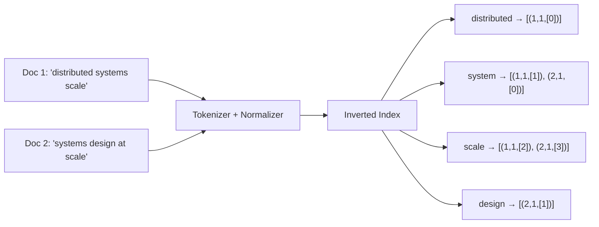
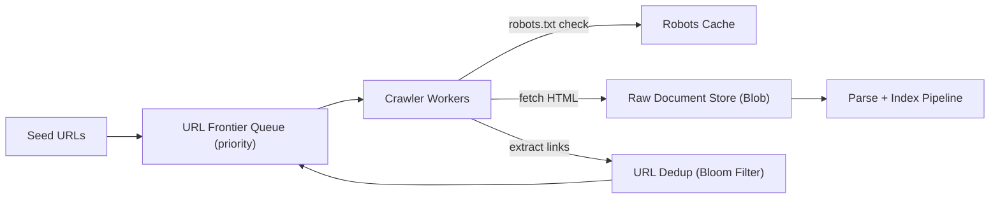
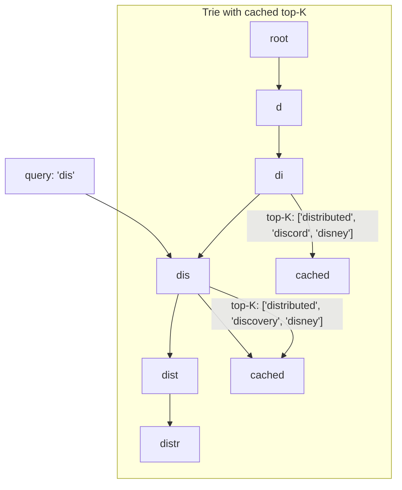
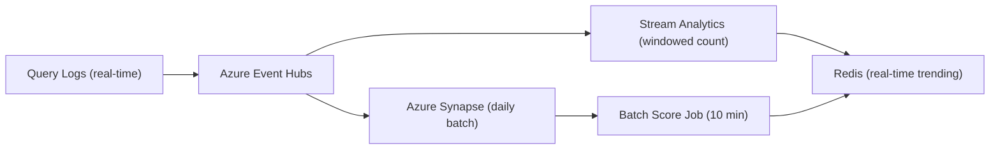
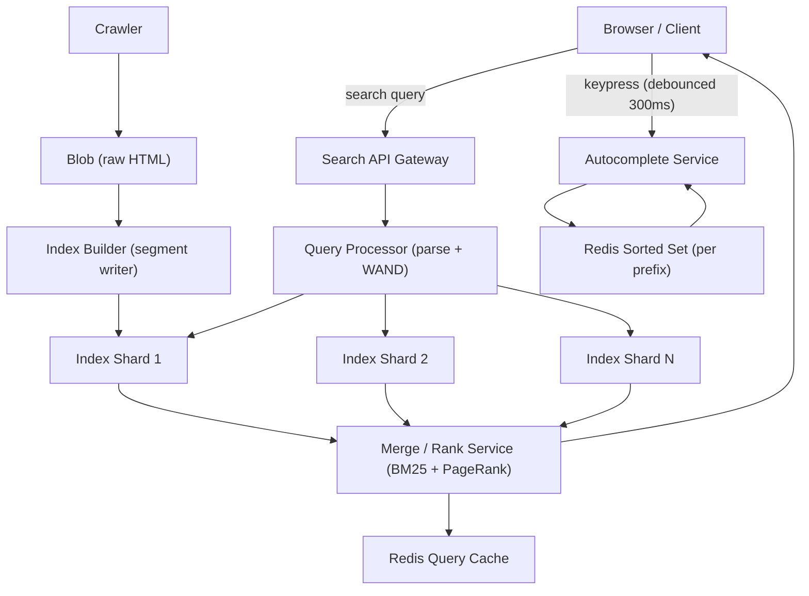

# 11. Design a Search Engine and Autocomplete System

> **TL;DR:** Two related systems — (a) a web search engine built on an inverted index with BM25 ranking and near-real-time segment merges; (b) a typeahead autocomplete service built on a distributed trie or prefix index with top-K precomputation and sub-100 ms response.

**Interview weight:** P0 — inverted index is foundational to every search-adjacent role; autocomplete is a near-certain HLD question at Staff level. Both test data structures at scale, sharding, and ranking trade-offs.

---

## 1. Requirements

### Functional — Search Engine
- Crawl the web (or a corpus), index pages, serve keyword queries.
- Ranking by relevance (TF-IDF / BM25) and authority (PageRank).
- Spell correction for mistyped queries.
- Near-real-time indexing of fresh content (< 5 min latency from publish to searchable).
- Pagination (and deep paging).

### Functional — Autocomplete
- Given a partial query prefix, return top-10 completions ranked by popularity.
- Latency < 100 ms globally.
- Near-real-time trending terms surface within minutes.
- Personalized suggestions (recent searches, profile affinity).
- Debounce on client (fire after 300 ms idle).

### Non-Functional (both)
- Index size: 50 B documents (web scale) / 100 M documents (enterprise scale).
- Query QPS: 100 K/s for search; 500 K/s for autocomplete (higher because per-keystroke).
- Availability: 99.9%; index updates must not take down query path.

### Out of Scope
- Ad ranking, knowledge panels, local search.
- Neural / dense vector search (though HNSW mentioned in §6 for context).

---

## 2. Scale Estimation

| Metric | Calculation | Result |
|--------|-------------|--------|
| Indexed documents | 50 B | 50 B |
| Avg doc size | 10 KB | — |
| Raw crawl storage | 50 B × 10 KB | 500 PB |
| Inverted index size | ~10% of raw (compressed posting lists) | ~50 PB |
| Query QPS | 100 K/s | — |
| Autocomplete QPS | 500 K/s | — |
| Prefix keys (top 10 B terms, 5-char avg prefix) | 50 B prefixes | ~500 GB trie nodes |
| Trending aggregation window | 1 M queries/min | — |

---

## 3. API Design

```
# Search
GET /search?q=distributed+systems&page=1&pageSize=10
GET /search?q=...&spellcheck=true

# Autocomplete
GET /suggest?q=distri&limit=10&personalized=true

# Indexing (internal)
POST /index/documents    – {url, content, lastModified}
POST /index/delete       – {url}
```

---

## Part A: Search Engine

## 4A. Inverted Index Construction

An inverted index maps each **term** → sorted list of `(docId, frequency, positions[])` called a **posting list**.



**Pipeline per document:**
1. **Tokenize:** split on whitespace and punctuation.
2. **Normalize:** lowercase, Unicode NFC.
3. **Stop-word removal:** drop "at", "the", "a" (language-specific list).
4. **Stemming:** "running" → "run" (Porter/Snowball stemmer); or **lemmatization** (more accurate, slower).
5. **Index:** for each term, append `(docId, tf, positions[])` to its posting list.
6. **Posting list compression:** delta-encode docIds, compress with VByte or PFOR.

### 4A.1 Index Sharding

| Aspect | Document-Partitioned | Term-Partitioned |
|--------|---------------------|-----------------|
| **Scheme** | Each shard holds a subset of documents; all terms for those docs | Each shard holds a subset of terms; all docs for those terms |
| **Query execution** | Broadcast query to all shards → merge top-K per shard (scatter-gather) | Route each term to its shard; join posting lists centrally |
| **Fan-out** | High (all shards per query) | Low (only shards containing query terms) |
| **Term freq stats** | Per-shard — must normalize or compute globally | Globally accurate on one shard |
| **Shard balance** | Easy (round-robin docs) | Hard (power-law: "the" is enormous) |
| **Used by** | Elasticsearch, Azure AI Search | Rare in practice |
| **Best for** | Most web-scale deployments | Specialty corpora |

**Choice:** Document-partitioned with 2-phase top-K merging (local top-K per shard → merge coordinator).

### 4A.2 Crawling



- **Politeness:** per-domain crawl delay from robots.txt; max 1 req/s per domain by default.
- **Frontier:** priority queue ordered by page rank estimate + freshness. Azure Service Bus works for moderate scale; custom priority queue for web scale.
- **Dedup:** Bloom filter (false-positive rate 1%) for URL dedup; SimHash for near-duplicate content detection.

### 4A.3 Ranking — TF-IDF vs BM25 vs Learning-to-Rank

| Aspect | TF-IDF | BM25 | Learning-to-Rank (LTR) |
|--------|--------|------|------------------------|
| **Formula** | `TF × log(N/DF)` | `TF × (k1+1)/(TF + k1×(1-b+b×dl/avgdl)) × IDF` | ML model trained on click/engagement signals |
| **Document length norm** | No | Yes (parameter b) | Implicit in features |
| **Term saturation** | No — long docs bias | Yes (k1 controls) | Implicit |
| **Training data needed** | No | No | Yes (human labels / click logs) |
| **Inference cost** | Very low | Very low | Moderate (model inference per doc) |
| **Quality** | Decent | Good (default for Elasticsearch/Lucene) | Best (Google, Bing) |
| **Interpretable** | Yes | Yes | No (black box) |
| **When to use** | Quick prototype | Production baseline | When click/engagement data available |

**BM25 defaults:** k1=1.2 (term saturation), b=0.75 (document length norm).

### 4A.4 Query Processing and Top-K

1. Parse query: `"distributed systems" -ads` → phrase match + term exclusion.
2. For each term: fetch posting list from index shard.
3. Intersect / union posting lists (AND for phrase, OR for broad).
4. **WAND (Weak AND):** prune posting list iteration using upper-bound scores. Avoids scoring all N documents; retrieves top-K in O(K log K) average.
5. Score each candidate with BM25.
6. Return top-K; merge from shards (2-phase reducer).

### 4A.5 Near-Real-Time Indexing

- Index stored as immutable **segments** (Lucene model).
- New documents written to an in-memory buffer (RAM segment); flushed to disk every 30 s.
- Background **merge** combines small segments into larger ones (log-structured merge).
- Queries fan out to all segments including the in-memory one — NRT latency ≈ 30 s.
- Segment merge is CPU-intensive — schedule during low-traffic windows; throttle I/O.

### 4A.6 Spell Correction

- Build a dictionary of indexed terms with frequency.
- For misspelled query: compute edit-distance candidates (BK-tree for fast nearest-neighbor).
- Rank corrections by (edit distance, term frequency).
- Show "Did you mean: {correction}" for top result.
- Noisy channel model: P(correction | query) ∝ P(query | correction) × P(correction).

### 4A.7 Deep Paging Problem

- `GET /search?q=...&page=1000` → skip 9 990 results on each shard → O(N) work.
- **Solution 1:** Cursor-based pagination (encode last-seen docId + score as opaque cursor).
- **Solution 2:** Cap at page 100 (most users never go deeper).
- **Solution 3:** Pre-rank and store top-1 000 for popular queries in a cache.

---

## Part B: Autocomplete / Typeahead

## 4B. Trie vs Prefix-Index vs FST

| Aspect | Trie (in-memory) | Prefix Hash Index (Redis sorted set) | FST (Finite State Transducer) |
|--------|-----------------|--------------------------------------|-------------------------------|
| **Memory** | High (node per char) | Moderate (sorted sets per prefix) | Very low (compressed) |
| **Query speed** | O(len(prefix)) | O(log N) + O(K) | O(len(prefix)) |
| **Top-K per prefix** | Cache at each node | Native `ZREVRANGEBYSCORE` | External — needs augmentation |
| **Update** | O(len) insert | O(log N) insert | Rebuild (immutable) |
| **Scalability** | Single process; shard by prefix | Distributed; shard by prefix | Read-only; reload on update |
| **Best for** | Prototype, small vocab | Production (Redis native ops) | Static dictionaries (spellcheck) |

**Production choice:** Redis sorted sets, one key per prefix (up to 5 chars), score = frequency.



### 4B.1 Top-K Per Prefix Precomputation

- Offline job (runs every 10 min): aggregate query logs, compute frequency per term.
- For each term, update all its prefix keys: `ZADD suggest:{prefix} {freq} {term}`.
- Max prefix length indexed: 10 chars (beyond 10 chars, exact term match is fast enough).
- Storage per prefix: top-20 terms × (term string + score) ≈ negligible; total for 1 B prefixes: ~100 GB in Redis.

### 4B.2 Data Collection and Frequency Aggregation



- Real-time: Count-Min Sketch in Redis for trending terms (last 1 h window). Heavy-hitter queries surface within 1–2 min.
- Batch: daily aggregation in Synapse produces stable long-term frequencies. Combined score: `0.7 × historical + 0.3 × trending`.

### 4B.3 Count-Min Sketch for Trending Terms

- Fixed 2D array of `d` hash functions × `w` counters (e.g., 5 × 2 000).
- Memory: 5 × 2 000 × 4 B = 40 KB. Tracks millions of distinct terms with < 1% error.
- On query: increment `sketch[h_i(term) % w]` for each hash function.
- To read count: `min(sketch[h_i(term) % w])` across all rows.
- Top-K extraction: pair with a min-heap of size K.

### 4B.4 Sharding by Prefix

- Prefix `a–m` → Shard 1; `n–z` → Shard 2. Or consistent hashing on 2-char prefix.
- Each shard: standalone Redis cluster.
- Client routes request directly to correct shard (prefix-based routing, no broadcast).
- Hot prefixes (e.g. "the", "how"): replicate to N read replicas; round-robin reads.

### 4B.5 Personalization

- Append user's recent searches (last 20) to the global top-K. Personal results rank higher if frequency > threshold.
- Stored per user in Redis: `ZADD user:{uid}:recent 1706780000 "distributed systems"`.
- Blend: `finalScore = 0.6 × globalScore + 0.4 × personalScore`.
- Privacy: personal data scoped to user; not used in global trending computation.

### 4B.6 Compact C# Trie Implementation

```csharp
public class TrieNode
{
    public Dictionary<char, TrieNode> Children { get; } = new();
    public bool IsEnd { get; set; }
    public int Frequency { get; set; }
    public List<string> TopK { get; set; } = new(); // cached at each node
}

public class AutocompleteTrie
{
    private readonly TrieNode _root = new();
    private const int K = 10;

    public void Insert(string word, int frequency)
    {
        var node = _root;
        foreach (var ch in word)
        {
            node.Children.TryAdd(ch, new TrieNode());
            node = node.Children[ch];
            UpdateTopK(node, word, frequency);
        }
        node.IsEnd = true;
        node.Frequency = frequency;
    }

    private static void UpdateTopK(TrieNode node, string word, int frequency)
    {
        node.TopK.Add(word);
        node.TopK = node.TopK
            .OrderByDescending(w => w == word ? frequency : 0)
            .Distinct().Take(K).ToList();
    }

    public List<string> Suggest(string prefix)
    {
        var node = _root;
        foreach (var ch in prefix)
            if (!node.Children.TryGetValue(ch, out node!)) return [];
        return node.TopK;
    }
}
```

---

## 5. High-Level Architecture (Combined)



---

## 6. Bottlenecks, Failure Modes & Trade-offs

| Bottleneck / Failure | Symptom | Mitigation |
|----------------------|---------|------------|
| Posting list for common term ("the") too large | Query slow; shard OOM | Cap posting list at 10 M docs; use WAND to prune early |
| Index shard down during query | Partial results returned | Return degraded results with `partial: true`; circuit breaker to fallback shard |
| Deep paging O(N) per shard | Timeout on page > 100 | Cursor-based pagination; hard cap at page 100 |
| Hot autocomplete prefix | Redis ZADD hot key | Replicate hot prefix keys to N read replicas; L1 in-process cache (10 s TTL) |
| Count-Min Sketch over-counting | Trending noise | Use conservative update (min across rows instead of simple increment) |
| Segment merge I/O spike | Query latency during merge | Throttle merge I/O; schedule for low-traffic windows; use tiered merge policy |
| Crawl politeness violation | Domain blocks crawler | Per-domain rate limiter; honor Retry-After headers |

---

## 7. Scaling the Design

- **Search:** Scale index shards horizontally (document-partitioned). Each shard is a self-contained Lucene-like index. Merge coordinator is stateless — scale horizontally.
- **Autocomplete:** Redis cluster per prefix shard. Stateless autocomplete service instances — horizontal scale. CDN edge caching for top-1 000 prefixes (serve from edge node without hitting Redis).
- **Indexing pipeline:** Event-Hubs-backed pipeline; scale consumers independently. New documents indexed in < 5 min via NRT segment flush.

---

## 8. Follow-up Extensions

- **Semantic / vector search:** Embed queries and documents; ANN index (HNSW) for similarity retrieval. Hybrid: BM25 + cosine similarity fusion.
- **Faceted search:** Filtering by category/date/price — maintain per-field inverted indexes; intersect posting lists.
- **Multi-language:** Language-specific tokenizers and stemmers per locale; language-detected at query time.
- **Knowledge graph:** Named entity extraction → structured answers above organic results.

---

## Interview Questions

**Q1. What is an inverted index and why is it the foundation of search?**
A: A map from term → sorted list of documents containing that term (posting list). Given a query, you look up each term's posting list and intersect/union them. Without inversion, finding documents containing "redis" means scanning every document — O(N). With an inverted index it's O(1) term lookup + O(k) list traversal where k = result count.

**Q2. What's the difference between TF-IDF and BM25?**
A: Both measure term importance. TF-IDF = term frequency × inverse document frequency. BM25 adds (a) term saturation: adding more occurrences of a term has diminishing returns; (b) document length normalization: a term in a 100-word doc is more significant than in a 10 000-word doc. BM25 is the industry default (Elasticsearch, Azure AI Search).

**Q3. What is WAND and why is it important?**
A: WAND (Weak AND) is a top-K retrieval algorithm that prunes the posting list scan using per-term upper-bound BM25 scores. Instead of scoring all N documents matching a query, it skips documents that cannot possibly rank in top-K. Reduces scoring work from O(N) to O(K log K) in practice.

**Q4. Document-partitioned vs term-partitioned index sharding — which do you choose and why?**
A: Document-partitioned: each shard holds all terms for a subset of documents. Query fans out to all shards (scatter-gather), each returns local top-K, central coordinator merges. This is the industry standard because shard balance is easy (round-robin docs) and per-shard indexes are self-contained. Term-partitioned avoids fan-out but creates massive hot shards for high-frequency terms.

**Q5. How does near-real-time indexing work?**
A: New documents go to an in-memory segment (like Lucene). The query engine fans out to all segments including in-memory. The in-memory buffer is flushed to a disk segment every 30 s (NRT latency ≈ 30 s). Background merge consolidates small segments; query path never blocks on merge.

**Q6. How do you handle the deep paging problem?**
A: Page 1 000 with page size 10 = skip 9 990 results per shard (O(N)). Solutions: (1) cursor pagination (encode last-seen `docId:score` as opaque cursor; shard seeks to that position); (2) hard cap at page 100; (3) pre-rank top-1 000 for popular queries in cache. Most users don't go past page 5.

**Q7. How does your autocomplete system achieve sub-100 ms latency?**
A: Redis sorted sets with one key per prefix (up to 5 chars). `ZREVRANGEBYSCORE suggest:{prefix} +inf -inf LIMIT 0 10` is O(log N + K) — sub-millisecond. Top-K precomputed offline every 10 min. Hot prefix keys cached in-process (10 s TTL). CDN edge cache for top-1 000 prefixes.

**Q8. What is Count-Min Sketch and how do you use it for trending?**
A: A probabilistic frequency data structure — 2D array of d hash functions × w counters. Memory: ~40 KB for millions of distinct terms. On each query, increment `sketch[h_i(term)]` for all i. Read: `min(sketch[h_i(term)])` — guaranteed overcount, never undercount. Use a min-heap of size K to extract top-K trending terms. This powers near-real-time trending terms without storing full query logs.

**Q9. Trie vs Redis sorted sets for autocomplete — when would you use a trie?**
A: In-memory trie is fine for ≤ 1 M terms (e.g., product catalog autocomplete within one service). For web-scale (billions of prefixes), it requires too much memory and is a single point of failure. Redis sorted sets are distributed, persistent, and natively support top-K via `ZREVRANGEBYSCORE`. Use trie for embedded/local use or as a supplemental in-process cache.

**Q10. How do you handle spell correction at scale?**
A: Pre-build a dictionary from indexed terms + frequency. For a query term not in the dictionary: generate candidates within edit distance 2 (BK-tree lookup is fast). Score by combined edit distance + term frequency. Surface top correction with "Did you mean?" link. Don't auto-redirect — give user control.

**Q11. How would you add personalization to autocomplete without breaking privacy?**
A: Store each user's recent searches in a per-user Redis sorted set (scoped to that user's data, not accessible to others). At query time: blend `0.6 × globalScore + 0.4 × personalScore`. Personal data never feeds global trending computation. TTL on personal history (90 days). User can clear history.

**Q12. How would you design an index update that doesn't take down the query path?**
A: Immutable segment model. New ops write to a new in-memory segment. Existing segments are read-only and serve queries. Segment merge runs in the background. Query fans out to all segments. A merge swap (atomic pointer update) is invisible to queries. Rolling deploy of index nodes with health checks ensures no query traffic to unhealthy shard.

---

## Quick Recap

- **Inverted index:** term → posting list (docId, tf, positions); tokenize + normalize + stem before indexing.
- **Sharding:** document-partitioned (industry standard) → scatter-gather; WAND for efficient top-K.
- **Ranking:** BM25 is the production baseline; LTR when click data available.
- **NRT indexing:** in-memory segment flush every 30 s; background segment merges; queries span all segments.
- **Autocomplete:** Redis sorted sets per prefix; top-K precomputed every 10 min; Count-Min Sketch for trending.
- **Latency budget:** Redis ZREVRANGE in < 1 ms; in-process L1 cache for hot prefixes; CDN for top-1 000.
- **Deep paging:** cursor-based or hard cap at page 100.
- **Personalization:** per-user Redis sorted set blended with global scores; never leaks to trending.
