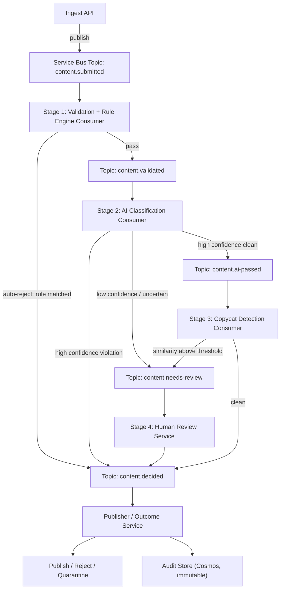
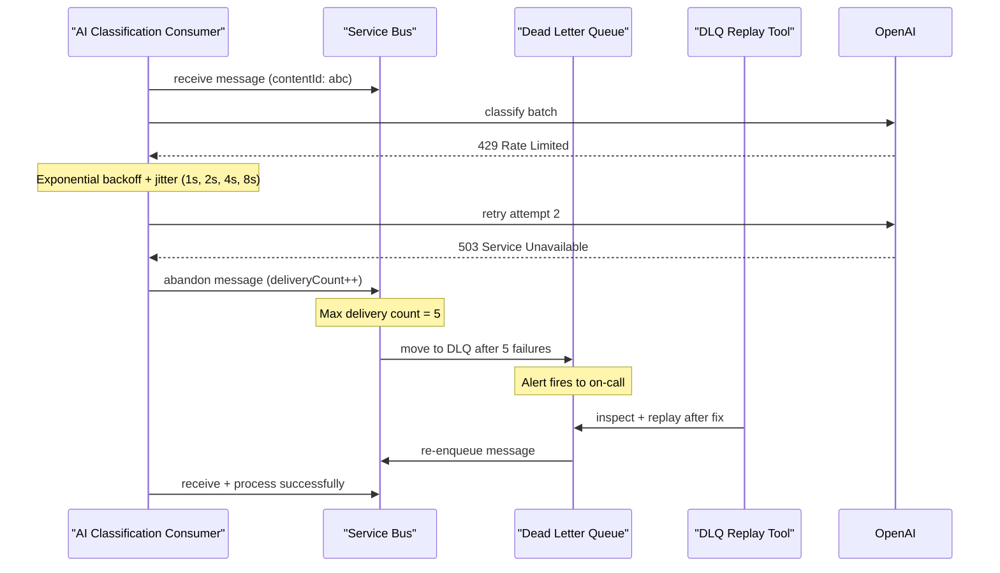
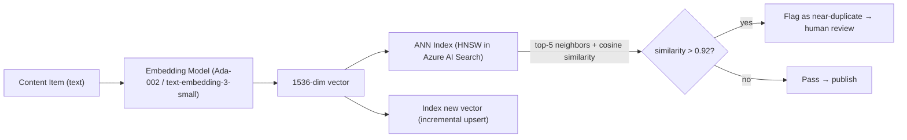
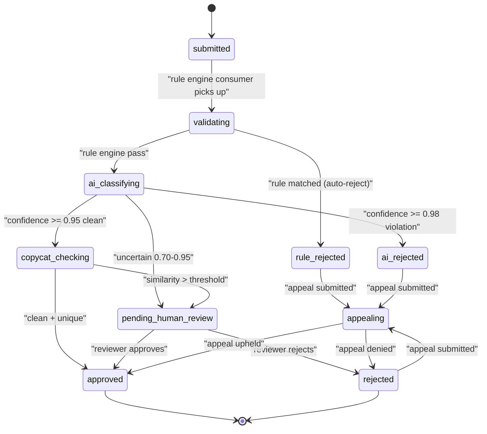

# 12. Design an AI Content Moderation Pipeline

> **TL;DR:** A staged, event-driven pipeline (ingest → validation/rule engine → AI classification → embeddings-based copycat detection → human review → publish) built on idempotent Azure Service Bus consumers with retry/backoff/DLQ — directly mirrors the AI Content Certification Platform you built (4-stage pipeline, 7M+ player scale, 99.99% SLO).

**Interview weight:** P0 — combines distributed systems (idempotency, sagas, queues) with AI/ML engineering (classification, embeddings, HNSW) and your direct resume case study. Expect deep dives on false-positive reduction, idempotent consumers, and the embedding-based copycat detection.

---

## 1. Requirements

### Functional
- Ingest content items (text, images, metadata) submitted by users.
- Apply a declarative rule engine (fast, deterministic pre-filter).
- Run ML/LLM classification for policy violations.
- Detect near-duplicate / copycat content via embedding similarity.
- Route uncertain items to human reviewers.
- Publish approved content; reject or quarantine violations.
- Support appeals; backfill re-moderation when policies change.
- Full audit trail of all decisions.

### Non-Functional
- Throughput: 10 K items/s ingested; peak 50 K/s.
- Latency SLO: 95% of items auto-resolved in < 30 s; P99 < 5 min (including human review queue).
- Precision/recall: target precision ≥ 98% (low false positives); recall ≥ 95% (catch 95% of violations).
- Auditability: every decision reproducible and explainable.
- Cost: AI provider calls batched; rate-limited to budget cap.
- Multi-tenant isolation: one tenant's flood does not delay others.

### Out of Scope
- Training the ML models (consumed as Azure OpenAI / Azure AI Content Safety endpoints).
- Image/video frame extraction (upstream preprocessor handles it).

---

## 2. Scale Estimation

| Metric | Calculation | Result |
|--------|-------------|--------|
| Ingest rate (peak) | 50 K items/s | 50 K/s |
| Rule engine (fast path) | 80% of items cleared in < 10 ms | 40 K/s auto-cleared |
| AI classification items/s | 20% passed through × 50 K/s | 10 K/s |
| AI API batch size | 50 items/batch | 200 batches/s |
| Human review queue | 2% of AI-processed items | 200 items/s → ~17 M/day reviewable |
| Embedding store | 1 B existing items × 1 536-dim float32 | ~6 TB (ANN index with compression) |
| ANN queries/s | 10 K/s (one per AI-processed item) | 10 K/s |

---

## 3. API Design

```
# Submission
POST /content                    – {contentId, tenantId, type, payload, metadata}
                                   → {submissionId, status: "pending"}
GET  /content/{contentId}/status – current moderation state

# Admin / Policy
POST /rules                      – create/update rule {ruleId, expression, action, priority}
POST /models/shadow              – enable shadow mode for model version {modelVersion}
POST /backfill                   – re-moderate items matching criteria {policyVersion, query}

# Human Review
GET  /review/queue               – next items for reviewer {tenantId?, type?}
POST /review/{contentId}/decision – {decision: approve|reject, reason, reviewerId}

# Appeals
POST /appeals                    – {contentId, reason}
GET  /appeals/{appealId}         – status
```

---

## 4. Data Model

### Content Item (Cosmos DB, partition key `/tenantId`)

| Field | Type | Notes |
|-------|------|-------|
| `contentId` | string | globally unique |
| `tenantId` | string | partition key |
| `status` | enum | see state machine |
| `type` | enum | text / image / mixed |
| `payload` | string | text content or Blob URI |
| `ruleEngineResult` | object | `{action, matchedRules[]}` |
| `aiResult` | object | `{label, confidence, modelVersion}` |
| `copycatResult` | object | `{nearestNeighborId, similarity, flagged}` |
| `humanDecision` | object | `{reviewerId, decision, reason, at}` |
| `finalDecision` | enum | approved / rejected / escalated |
| `auditLog` | array | append-only events |
| `policyVersion` | string | policy at time of decision |

### Decision Audit Log (append-only, Cosmos TTL = never)

Every state transition appended to `content.auditLog`:
```json
{ "stage": "rule_engine", "action": "pass", "matchedRules": [], "at": "...", "durationMs": 4 }
{ "stage": "ai_classify", "label": "clean", "confidence": 0.97, "model": "v3", "at": "..." }
```

---

## 5. High-Level Architecture

### 5.1 Pipeline Flowchart



### 5.2 Sequence Diagram — Failure and DLQ Path



---

## 6. Deep Dives

### 6.1 Idempotent Consumers (Core Pattern — Your Resume)

Every Service Bus consumer must be idempotent — receiving the same message twice must produce the same outcome.

**Mechanism:**
1. Each message carries `contentId` (globally unique).
2. Before processing: check `cosmos: content/{contentId}.stageXCompleted == true`. If yes: `CompleteMessage()` and return.
3. Process the item.
4. Write result to Cosmos with `ETag` conditional update (optimistic concurrency).
5. Complete the Service Bus message.

```csharp
public class AiClassificationConsumer : IMessageConsumer
{
    public async Task ProcessAsync(ServiceBusReceivedMessage msg, CancellationToken ct)
    {
        var contentId = msg.ApplicationProperties["contentId"].ToString()!;

        // Idempotency check
        var item = await _repo.GetAsync(contentId, ct);
        if (item.AiResult is not null)
        {
            _logger.LogInformation("Already classified {ContentId}, skipping", contentId);
            return; // Service Bus SDK completes the message
        }

        // Process
        var result = await _aiClient.ClassifyAsync(item.Payload, ct);

        // Conditional update (ETag-based optimistic concurrency)
        item.AiResult = result;
        item.Status = DetermineStatus(result);
        await _repo.UpdateAsync(item, ct); // throws on ETag mismatch → message abandoned → retry

        await _nextTopicSender.SendAsync(BuildNextMessage(item), ct);
    }
}
```

### 6.2 Retries with Exponential Backoff + Jitter

```csharp
// Polly resilience pipeline for AI provider calls
var pipeline = new ResiliencePipelineBuilder()
    .AddRetry(new RetryStrategyOptions
    {
        MaxRetryAttempts = 5,
        Delay = TimeSpan.FromSeconds(1),
        BackoffType = DelayBackoffType.Exponential,        // 1s, 2s, 4s, 8s, 16s
        UseJitter = true,                                   // ±25% jitter — avoids retry storms
        ShouldHandle = new PredicateBuilder()
            .Handle<HttpRequestException>()
            .HandleResult<HttpResponseMessage>(r => (int)r.StatusCode is 429 or 503 or 504)
    })
    .AddCircuitBreaker(new CircuitBreakerStrategyOptions
    {
        FailureRatio = 0.5,
        SamplingDuration = TimeSpan.FromSeconds(30),
        MinimumThroughput = 20,
        BreakDuration = TimeSpan.FromSeconds(60)           // Open circuit for 60s
    })
    .Build();
```

### 6.3 The Rule Engine

| Aspect | Detail |
|--------|--------|
| **Format** | Declarative JSON/YAML rules: `{ruleId, condition: "payload.text contains 'forbidden_word'", action: reject/flag/pass, priority: int}` |
| **Evaluation** | Rules sorted by priority; first matching rule fires (short-circuit) |
| **Versioning** | Rules stored in Cosmos with `version` field; each content item records `policyVersion` at decision time |
| **Hot reload** | Rule set loaded into memory on startup + refreshed on Service Bus `rules.updated` event; no restart required |
| **Short-circuit** | Auto-reject rules evaluated first; if matched, skip AI stage entirely (saves cost) |
| **Allowlist** | Trusted content sources bypass rule engine; skip to publish |

| Rule Type | Example | Stage |
|-----------|---------|-------|
| **Keyword blocklist** | Contains known harmful term | Pre-AI (fastest) |
| **Structural** | Payload > 50 KB | Validation |
| **Metadata** | Submitter account age < 7 days | Post-rule weighting |
| **Allowlist** | Verified partner domain | Bypass all stages |
| **Rate-based** | Same content submitted > 3× in 1 h | Duplicate detection |

### 6.4 AI Classification Stage

- **Model:** Azure AI Content Safety API (text + image), or Azure OpenAI with a system prompt for nuanced classification.
- **Batching:** Accumulate items for 500 ms or until batch size = 50; bulk API call. Reduces per-item overhead by ~40×.
- **Model versioning:** Each classification records `modelVersion`. Shadow mode: new model runs in parallel; results logged but not used for decisions. Flip via feature flag.
- **Confidence bands:**

| Band | Action |
|------|--------|
| Confidence ≥ 0.98 (violation) | Auto-reject |
| Confidence ≥ 0.95 (clean) | Auto-approve → copycat check |
| 0.70 – 0.95 (uncertain) | Route to human review |
| Confidence < 0.70 | Escalate to senior reviewer |

- **Human-in-the-loop:** Uncertain band (~2% of volume) queued to human review. Reviewers use a UI showing the content, AI rationale, and matching rules. Decision fed back as labeled data for retraining.
- **Cost control:** Rate limit AI calls per tenant per minute. Budget cap per day (alert at 80%). Cheapest model first; escalate to expensive model only if confidence is low.

### 6.5 False-Positive Reduction

A false positive = clean content incorrectly rejected. For a gaming platform (your resume context), this means good content blocked — directly hurts player experience.

| Technique | Description | Impact |
|-----------|-------------|--------|
| **Threshold tuning** | Raise rejection threshold from 0.90 → 0.95 | Fewer FP, slightly more FN |
| **Ensemble: rules + model** | Only reject if both rule engine AND model agree | High precision |
| **Allowlists** | Verified creators bypass AI; trust score decay over time | Reduces FP for trusted users |
| **Feedback loop** | Human reviewer corrections fed back to model retraining | Reduces systemic FP |
| **Category-specific thresholds** | News content at 0.97; user comments at 0.90 | Matches risk per content type |
| **Appeals data** | Overturned decisions flag FP; weight correction examples more | Continuous improvement |

Precision/Recall/F1 trade-off:
- **Precision** = TP / (TP + FP): fraction of rejected items that are true violations.
- **Recall** = TP / (TP + FN): fraction of actual violations caught.
- **F1** = harmonic mean. At gaming platform: prioritize precision (player-facing rejections are high-friction).

### 6.6 Embeddings-Based Copycat / Near-Duplicate Detection



**ANN Index Comparison:**

| Aspect | HNSW (Hierarchical Navigable Small World) | IVF (Inverted File Index) |
|--------|-------------------------------------------|---------------------------|
| **Query speed** | Fast (~1 ms for 1 M vectors) | Moderate (depends on nprobe) |
| **Index build time** | Slow (O(N log N)) | Fast (k-means clustering) |
| **Memory** | High (graph edges stored) | Moderate (centroids + lists) |
| **Recall at 10NN** | 99% at ef=200 | 95% at nprobe=32 |
| **Incremental add** | Yes (dynamic HNSW) | Difficult (re-cluster on add) |
| **Best for** | Real-time similarity search | Batch search, large static corpora |
| **Azure AI Search** | ✅ Native HNSW support | IVF via custom index |

**Choice:** HNSW via Azure AI Search — native, managed, incremental upsert, integrates with existing Azure stack.

**Cosine threshold selection:**
- 0.95+ = near-identical (possible plagiarism).
- 0.85–0.95 = highly similar (possible copycat, route to review).
- < 0.85 = distinct (pass through).
- Calibrate threshold using labeled dataset; plot precision-recall curve; pick operating point per content type.

**Chunking long content:** Documents > 512 tokens split into 256-token chunks with 32-token overlap. Vector = mean of chunk vectors. Match if any chunk pair exceeds threshold (catches embedded copies).

### 6.7 Content Item State Machine



### 6.8 Backfill / Re-Moderation

When a policy changes (new rule, new model version), previously approved content may now violate the policy.

**Backfill strategy:**
1. Admin creates a backfill job: `{policyVersion: "v2", query: "status=approved AND approvedAt > 2025-01-01", priority: low}`.
2. Backfill worker reads matching content IDs from Cosmos (Change Feed or query).
3. Publishes `content.submitted` messages with `{backfill: true, originalContentId: ...}` at low priority.
4. Pipeline processes at reduced rate (throttled Service Bus topic) to avoid crowding out live traffic.
5. Results: new decision recorded; original decision preserved in audit log.

### 6.9 Multi-Tenant Isolation

| Mechanism | Detail |
|-----------|--------|
| **Separate Service Bus subscriptions** | Each tenant has a dedicated subscription with its own lock/max-concurrency settings |
| **Priority queues** | Premium tenants get high-priority topic subscription; standard tenants share medium |
| **Cosmos partition key = tenantId** | Full data isolation at the storage layer |
| **Rate limits per tenant** | Token bucket per `tenantId` at ingest API; excess returns `429` |
| **Embedding namespace** | Each tenant's content indexed in a separate Azure AI Search index (prevents cross-tenant similarity leakage) |

### 6.10 Observability Metrics

| Metric | Alert threshold |
|--------|----------------|
| Rule engine latency P99 | > 20 ms |
| AI classification latency P99 | > 5 s |
| Human review queue depth | > 10 K items |
| DLQ depth | > 0 (any DLQ message) |
| False-positive rate (from appeals) | > 2% |
| AI provider error rate | > 1% over 5 min window |
| Embedding index freshness | > 5 min lag |
| Cost per item (AI tokens) | > $0.005 |

---

## 7. Bottlenecks, Failure Modes & Trade-offs

| Bottleneck / Failure | Symptom | Mitigation |
|----------------------|---------|------------|
| AI provider rate limit (429) | Items pile up; SLO breach | Circuit breaker; fallback to rule-only pass with `needs_review` flag; request quota increase |
| Non-idempotent consumer + retry | Double classification, double publish | Idempotency check on `contentId` at consumer entry (§6.1) |
| Embedding index stale | Copycat content passes until indexed | Sync upsert after AI-pass; accept < 5 min lag for incremental index |
| Human review queue overflow | P99 SLO breach | Auto-scale reviewer pool (crowdsource); temporarily raise AI confidence threshold to reduce queue |
| DLQ messages forgotten | Violations not actioned | DLQ depth alert → PagerDuty; weekly DLQ audit report |
| Policy change breaks rule engine | Hot-reload race with in-flight messages | Version stamp on each rule set; old in-flight messages use original version |
| One tenant flood (spam campaign) | Delays other tenants | Per-tenant rate limit at ingest; per-tenant Service Bus subscription max-concurrency |

---

## 8. Scaling the Design

- **Ingest:** Azure API Management handles rate limiting per tenant. Stateless ingest service scales horizontally.
- **Rule engine:** CPU-bound, pure compute — containerized on AKS, auto-scale on Service Bus message count.
- **AI classification:** Bottleneck is AI provider QPS. Scale by: (a) increasing Azure OpenAI quota; (b) using multiple Azure OpenAI deployments across regions; (c) batching to maximize throughput per API call.
- **Embedding index:** Azure AI Search autoscales replicas. HNSW queries at 10 K/s needs ~4 search units (Azure AI Search SU benchmark: ~2 500 QPS/SU).
- **Human review:** Reviewer pool scales with queue depth metric. Overflow: auto-route to gig-worker marketplace API.

---

## 9. Follow-up Extensions

- **Active learning:** Uncertain items routed to human review are also prioritized for model retraining (highest information gain).
- **Streaming re-ranking:** A/B test new model version using shadow mode; compare precision/recall against champion model on same corpus before promoting.
- **Content hashing (perceptual hash):** Fast near-duplicate image detection without embedding — pHash comparison O(1) lookup before ANN.
- **Graph-based copycat detection:** Link analysis on submitter accounts — a cluster of accounts submitting similar content flags coordinated inauthentic behavior.
- **Regulatory jurisdiction routing:** EU content routed to EU-hosted models and review queues (GDPR data residency).

---

## Interview Questions

**Q1. Why is idempotency critical for Service Bus consumers in this pipeline?**
A: Service Bus guarantees at-least-once delivery — a message may be delivered more than once on pod crash or lock expiry. Without idempotency, the same content item could be classified twice, published twice, or charged to the AI API twice. Idempotency check on `contentId` at consumer entry makes duplicate delivery harmless.

**Q2. How do you implement an idempotent consumer on Azure Service Bus?**
A: On message receive: read `content.{stage}Completed` from Cosmos. If already set, complete the message and return. Otherwise process, write result to Cosmos with ETag optimistic concurrency, complete message. If Cosmos write fails (ETag mismatch = concurrent duplicate): abandon the message — the winning writer's result is already persisted and the next delivery will find it already done.

**Q3. Explain the retry/backoff/DLQ flow when the AI provider is down.**
A: Consumer catches 503/429 → Polly retries with exponential backoff + jitter (1 s, 2 s, 4 s, 8 s, 16 s). After 5 Service Bus deliveries, the message moves to the DLQ automatically. An alert fires. On-call engineer investigates, fixes the issue, and runs the DLQ replay tool to re-enqueue messages. Circuit breaker opens after 50% failure rate, stopping calls to the broken endpoint for 60 s.

**Q4. How do you reduce false positives without significantly increasing false negatives?**
A: Ensemble approach — require both the rule engine AND the AI model to agree on a violation before auto-rejecting. Raise the auto-reject confidence threshold (0.95 → 0.98). Maintain an allowlist of trusted content sources. Use category-specific thresholds (strict for UGC, lenient for verified publishers). Feed appeals (overturned rejections) back to model retraining.

**Q5. How does embedding-based copycat detection work?**
A: Content text is embedded into a 1 536-dim vector using an embedding model (e.g. Azure OpenAI text-embedding-3-small). The vector is queried against an HNSW index of all previously published content. If any neighbor has cosine similarity > 0.92, the content is flagged as a near-duplicate and routed to human review. New content vectors are upserted into the index on approval.

**Q6. Why HNSW over IVF for the ANN index?**
A: HNSW supports dynamic incremental inserts (each approved item is immediately indexed); IVF requires re-clustering which is expensive. HNSW achieves 99% recall at 10NN with ef=200; IVF at ~95% with nprobe=32. For real-time content moderation where freshly published content should immediately be detectable as a source for copycats, incremental insert capability is critical.

**Q7. How do you handle a policy change that requires re-moderating already-approved content?**
A: Backfill job: query Cosmos for content matching the affected cohort, publish to a low-priority Service Bus topic at throttled rate. The pipeline processes backfill items at reduced concurrency to avoid crowding live traffic. Original decisions are preserved in the immutable audit log; new decisions are appended. Policymakers see before/after counts.

**Q8. How do you map this to your AI Content Certification Platform?**
A: Direct 1:1 mapping: 4-stage pipeline = validation/rule engine → AI classification → embeddings copycat detection → human review. Idempotent Service Bus consumers = the `stageCompleted` check on Cosmos. Retry/backoff = Polly pipeline. DLQ replay tooling = custom admin tool. Rule engine = declarative JSON rules with hot reload. The $5 M revenue impact came from the campaign platform; the 7 M+ player scale came from the Xbox News Feed using the same event-driven infrastructure patterns.

**Q9. What metrics do you use to measure pipeline health?**
A: Rule engine P99 latency (target < 20 ms), AI classification P99 (< 5 s), human review queue depth (alert > 10 K), DLQ depth (alert > 0), false-positive rate from appeals (alert > 2%), AI provider error rate (alert > 1% over 5 min), and cost-per-item (alert > $0.005). Each metric has a Service Bus metric or Application Insights custom event backing it.

**Q10. How do you prevent one tenant's spam campaign from delaying other tenants?**
A: Per-tenant rate limits at the ingest API (token bucket in Redis). Per-tenant Service Bus subscriptions with independent max-concurrency settings. Cosmos DB partition key = tenantId ensures storage-level isolation. Vector search uses separate Azure AI Search indexes per tenant (prevents cross-tenant similarity leakage).

**Q11. Explain the confidence band routing logic.**
A: ≥ 0.98 violation → auto-reject. ≥ 0.95 clean → copycat check. 0.70–0.95 → human review. < 0.70 → senior reviewer. These thresholds are configurable per content type. The uncertain band (0.70–0.95) is intentionally wide to capture edge cases — human reviewers handle 2–5% of total volume, which is operationally feasible at the platform's scale.

**Q12. How would you add shadow mode for a new model version?**
A: Shadow mode = new model runs concurrently with champion model; results logged to a separate field (`aiResultShadow`) but do not influence routing decisions. After 48 h with sufficient volume, compare shadow vs champion precision/recall against human-reviewed ground truth. If shadow wins: flip feature flag to promote shadow → champion. Zero-downtime model upgrade, no redeployment required.

**Q13. How do you ensure audit trail immutability?**
A: Cosmos DB append-only pattern: `auditLog` is an array that only ever has items appended (never deleted or updated). Cosmos TTL = never for audit container. Azure immutable blob storage (WORM — Write Once Read Many) for exported audit snapshots. `policyVersion` recorded at decision time ensures historical decisions remain reproducible even after policy changes.

---

## Quick Recap

- **Architecture:** 6-stage event-driven pipeline (ingest → rules → AI → copycat → human review → publish) over Azure Service Bus topics.
- **Idempotency:** Check `stageCompleted` on Cosmos at consumer entry; ETag CAS for concurrent write safety.
- **Retries:** Polly exponential backoff + jitter; Service Bus built-in max-delivery → DLQ; alert + replay tooling.
- **Rule engine:** Declarative rules, priority-sorted, short-circuit, hot-reload on policy change.
- **AI classification:** Batching (50 items/500 ms), confidence bands, shadow mode for model updates, circuit breaker.
- **False positives:** Ensemble (rules + model), raised thresholds, allowlists, appeals feedback loop.
- **Copycat detection:** Embedding + HNSW (Azure AI Search); cosine > 0.92 → human review; incremental upsert on approve.
- **Multi-tenant:** Per-tenant rate limits, subscriptions, Cosmos partitions, and vector indexes.
