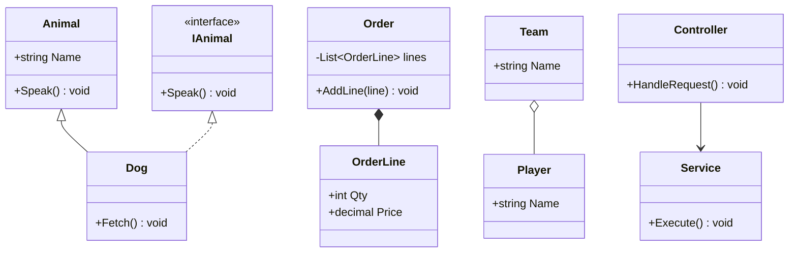
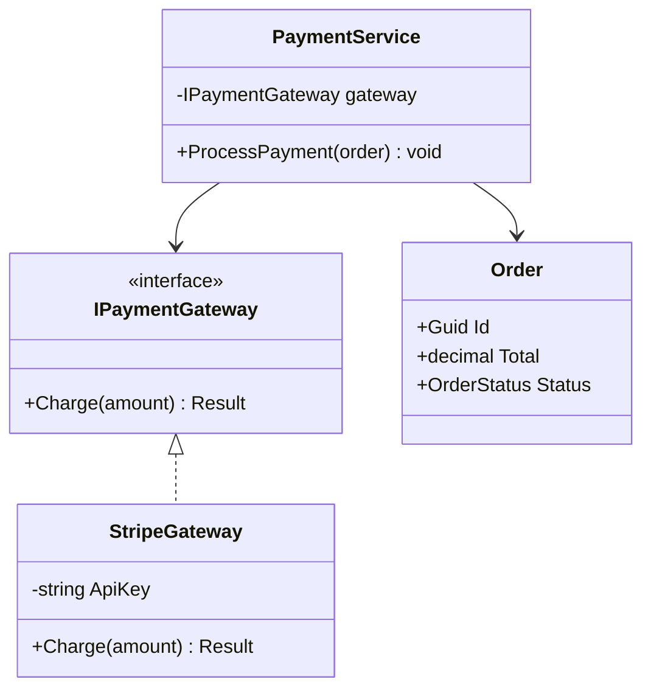
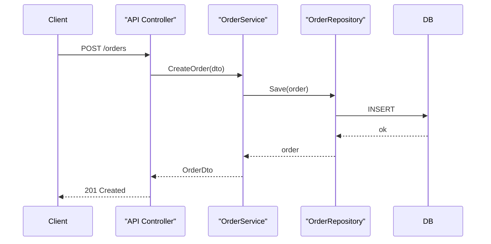

# 1. LLD Interview Framework & UML

> **TL;DR:** A repeatable 45–60 min process: clarify → model → design → validate. Nail the process and interviewers score you as staff-level even if your design isn't perfect.

**Interview weight:** P0 — LLD rounds directly test architectural thinking, OOP fluency, and the ability to communicate design under time pressure.

---

## Core Concepts

- **LLD round** — 45–60 min; produce a class diagram + key code + walk-through of a use case.
- **Machine-coding round** — 60–90 min; working code (not just diagram). Same process, but you also type.
- **CRC card** — Class / Responsibility / Collaborator; 3-column card to quickly brainstorm classes.
- **UML** — Unified Modeling Language; diagrams that communicate structure (class) and behaviour (sequence, state, activity).

---

## The Repeatable LLD Process (45–60 min)

### Step 1 — Clarify requirements & scope (5 min)
- What actors/users exist?
- What are the happy-path flows (top 2–3)?
- What is explicitly **out of scope** today?
- Scale: single process / distributed? Persistent storage needed?
- NFRs: concurrency, throughput, latency?

### Step 2 — Identify actors & use cases (2 min)
- List actors (human or system) and their primary use cases.
- Example: Parking Lot → `Driver`, `GateOperator`, `Admin`; use cases → enter lot, exit lot, query availability.

### Step 3 — Nouns → entities, verbs → behaviours (3 min)
- Highlight nouns in the problem statement → candidate classes.
- Highlight verbs → candidate methods / responsibilities.
- Discard trivial nouns (UI screens, error messages unless modelling exceptions).

### Step 4 — Class identification & responsibilities (CRC) (5 min)
- For each class, write: what it **knows** (fields) and what it **does** (methods).
- Apply SRP: if two unrelated responsibilities appear, split the class.

### Step 5 — Relationships (3 min)
- Is-a (inheritance) vs has-a (composition/aggregation).
- Prefer composition. Mark multiplicities.

### Step 6 — Interfaces & extension points (3 min)
- Where will requirements change? (pricing, scheduling, notification channel) → extract an interface.
- Name interfaces with behaviour: `IPricingStrategy`, `INotifier`, `IScheduler`.

### Step 7 — Core APIs (5 min)
- Write method signatures for the 3–5 most important operations.
- Think about return types: exceptions vs `Result<T>`, async vs sync.

### Step 8 — Concurrency & persistence (3 min)
- Identify shared mutable state → add locking strategy or immutability note.
- Where does data live? In-memory for LLD round; mention DB/cache if asked.

### Step 9 — Walk through a use case end-to-end (5 min)
- Trace one happy-path flow through your classes (like a sequence diagram in words).
- Spot gaps: missing methods, wrong ownership of data.

### Step 10 — Discuss extensibility (2 min)
- "If we wanted to add X, I'd add a new `IStrategy` implementation — no existing code changes."
- Mention what would break at scale and how you'd address it.

---

## UML Essentials

### Relationship Types — Comparison

| Relationship | Symbol | Meaning | C# equivalent |
|---|---|---|---|
| **Inheritance** | `<\|--` (hollow triangle) | Is-a; child IS a parent | `class Dog : Animal` |
| **Realization** | `<\|..` (dashed) | Class implements interface | `class Dog : IAnimal` |
| **Composition** | `*--` (filled diamond) | Has-a; child CANNOT exist without owner | `Order` owns `OrderLines` |
| **Aggregation** | `o--` (hollow diamond) | Has-a; child CAN exist independently | `Team` has `Players` |
| **Association** | `-->` (arrow) | Uses / knows about | `Controller` uses `Service` |
| **Dependency** | `..>` (dashed arrow) | Uses temporarily (parameter, local) | Method takes `ILogger` param |



### Multiplicity

| Notation | Meaning |
|---|---|
| `1` | exactly one |
| `0..1` | zero or one |
| `*` | zero or many |
| `1..*` | one or many |
| `2..5` | two to five |

---

## When to Use Which Diagram

| Diagram | Best for | Avoid when |
|---|---|---|
| **Class diagram** | Static structure, relationships, LLD skeleton | Showing time/flow — use sequence instead |
| **Sequence diagram** | One specific flow over time; API call chain; LLD walkthrough | Static structure or many parallel flows |
| **State diagram** | Object lifecycle with explicit states (Order, Elevator, Ticket) | Objects that don't have meaningful state transitions |
| **Activity diagram** | Complex business process / workflow steps | Simple method logic — use pseudocode |

---

## Class Diagram Example



## Sequence Diagram Example



---

## Code / Namespace Structure

```
src/
  Domain/            # Entities, value objects, domain events, interfaces
  Application/       # Use cases, commands, queries, DTOs, service interfaces
  Infrastructure/    # Repos, EF, external APIs, messaging
  API/               # Controllers, middleware, DI wiring
tests/
  Unit/
  Integration/
```

- Namespaces match folder: `MyApp.Domain`, `MyApp.Application.Orders`, etc.
- One class per file. File name = class name.
- Interfaces in the same namespace as the abstraction they define (Domain or Application), not Infrastructure.

---

## What Interviewers Score

| Criterion | Junior answer | Senior answer | Staff answer |
|---|---|---|---|
| **Requirements** | Dives in immediately | Asks 3–4 clarifying questions | Scopes explicitly, identifies constraints, asks about scale |
| **Class design** | God class or flat list | Reasonable SRP split | Clean abstractions, interfaces at extension points, CRC thinking |
| **Relationships** | Everything inherits | Mix of inheritance and composition | Composition-first; inheritance only for true is-a |
| **Extensibility** | Hard-coded | Mentions open/close principle | Extracts strategy/factory at variation points; explains why |
| **Concurrency** | Ignores it | Notes it exists | Identifies shared state, proposes lock granularity or immutability |
| **Code quality** | Working but messy | Clean, named well | Clean, guard clauses, value objects, result types, async-aware |
| **Communication** | Codes silently | Explains as they go | Drives dialogue, asks for feedback, explicitly calls trade-offs |

---

## Common LLD Mistakes

- **God class** — one class does everything. SRP immediately.
- **Anemic domain model** — classes are pure data bags; logic lives in a service. Move invariants into the entity.
- **Inheritance everywhere** — prefer composition; inheritance creates tight coupling.
- **Forgetting interfaces** — concrete dependencies make the design rigid and untestable.
- **No concurrency thought** — forgetting that `Dictionary` is not thread-safe, for example.
- **Over-engineering** — adding patterns for patterns' sake before requirements justify them.
- **Jumping to code before diagram** — wastes time on wrong direction; sketch first.
- **Skipping edge cases** — what if the parking lot is full? What if the elevator request queue is empty?

---

## Interview Questions

**Q1. What is the difference between association, aggregation, and composition?**
A: All three are "has-a". Composition means the owned object's lifecycle is tied to the owner (an `Order` containing `OrderLines` — lines are deleted with the order). Aggregation means the owned object can exist independently (`Team` has `Players`; players exist without that team). Association is just "uses" with no ownership implied.

**Q2. When do you draw a sequence diagram vs a class diagram?**
A: Class diagram for static structure — what classes exist and how they relate. Sequence diagram to show one specific interaction over time — who calls whom in what order. In an LLD round, do the class diagram first, then walk through a use case with a sequence-style narrative or diagram.

**Q3. What does an interviewer look for in the first 5 minutes of an LLD round?**
A: Whether you ask clarifying questions vs dive in blindly. Asking about actors, scale, and out-of-scope signals senior thinking. A candidate who starts drawing immediately is modelling the wrong thing 30% of the time.

**Q4. How do you decide when to extract an interface?**
A: When the implementation is likely to vary (pricing, notification, storage), when you need to test in isolation (mock boundary), or when the caller should not know about the concrete type. Don't extract interfaces for every class — only at variation points.

**Q5. What is a CRC card and when do you use it?**
A: Class / Responsibility / Collaborator. A 3-column index card (or mental model) listing what a class knows, what it does, and which other classes it talks to. Useful in the first 10 minutes of a design to quickly identify responsibilities without getting lost in method signatures.

**Q6. How do you handle concurrency in an LLD round when the interviewer hasn't mentioned it?**
A: Proactively raise it: "I'll note that if multiple threads can call this method, the `Dictionary` here is not thread-safe — I'd use `ConcurrentDictionary` or a `ReaderWriterLockSlim` depending on read/write ratio." Raising it signals you think beyond happy-path.

**Q7. What is the "screaming architecture" principle and how does it apply to folder/namespace structure?**
A: The architecture should scream the domain, not the framework. Instead of `Controllers/`, `Services/`, `Repositories/` at the top level, organise by feature: `Orders/`, `Payments/`, `Inventory/`. Framework folders are an implementation detail. This leads to more cohesive vertical slices.

**Q8. In a 60-minute machine coding round, how do you time-box to finish?**
A: 5 min clarify → 5 min sketch classes → 35 min core implementation (happy path + 1–2 edge cases) → 10 min review, add comments, handle error paths → 5 min self-review/questions. Never gold-plate before the core works.

**Q9. How would you explain the difference between a sequence diagram and an activity diagram to a non-technical stakeholder?**
A: Sequence diagram: "who does what in a specific conversation." Activity diagram: "the business process steps and decisions." For technical LLD, sequence diagrams are almost always more useful.

**Q10. What's the risk of too many interfaces in a design?**
A: Interface explosion — every class has an interface even when there's only one implementation. This creates indirection without benefit, makes navigation harder, and signals over-engineering. Add interfaces at true variation points or test-seam boundaries only.

**Q11. (Senior) You're 40 minutes into a machine-coding round and your design works for the happy path but has a bug in concurrency. How do you proceed?**
A: Be transparent: "I've hit a concurrency issue with shared state here. I'll fix the core logic, then address thread safety." Fix the critical path first, then add locking/`ConcurrentDictionary`/`Interlocked`. An incomplete but honest solution outscores a confident but broken one.

**Q12. (Staff) A junior dev says "I'll just add another method to the existing class." When is that correct vs when should they extract a new class?**
A: Correct when the behaviour is cohesive with the class's existing responsibility and doesn't add a second "axis of change." Extract a new class when: the class would grow beyond ~200 lines, a second reason to change appears, or you need to vary the new behaviour independently (via interface + strategy).

**Q13. (Staff) How does the LLD process change when designing for a distributed system vs a monolith?**
A: In a distributed system, you add: explicit service boundary identification (bounded context), network failure handling at each interaction (retry, circuit breaker), eventual consistency modelling (where does the saga start), and idempotency on write operations. The UML extends to include service components and async message flows, not just class relationships.

---

## Quick Recap

- **10-step process:** clarify → actors → nouns/verbs → CRC → relationships → interfaces → APIs → concurrency → walkthrough → extensibility.
- **Class diagram** = structure; **sequence diagram** = one flow over time; **state diagram** = lifecycle.
- Prefer composition over inheritance; extract interfaces at variation/test-seam points only.
- Interviewers score: requirements scoping, SRP, extensibility, concurrency awareness, communication.
- Screaming architecture: top-level folders = domain, not framework.
- In machine coding: sketch first, happy path first, then edge cases, then polish.
- Staff answer = explicit trade-offs, named patterns, asks for feedback, raises concurrency unprompted.
