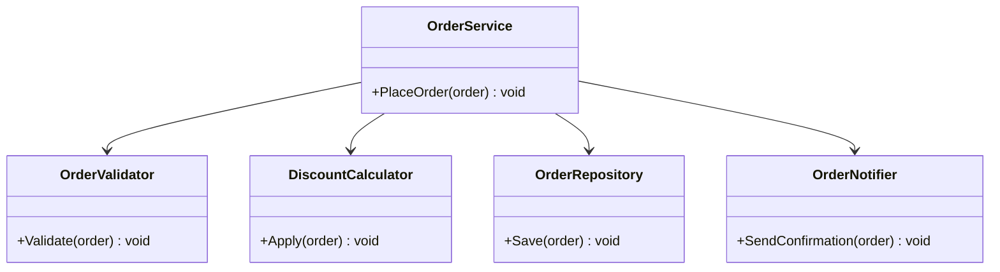
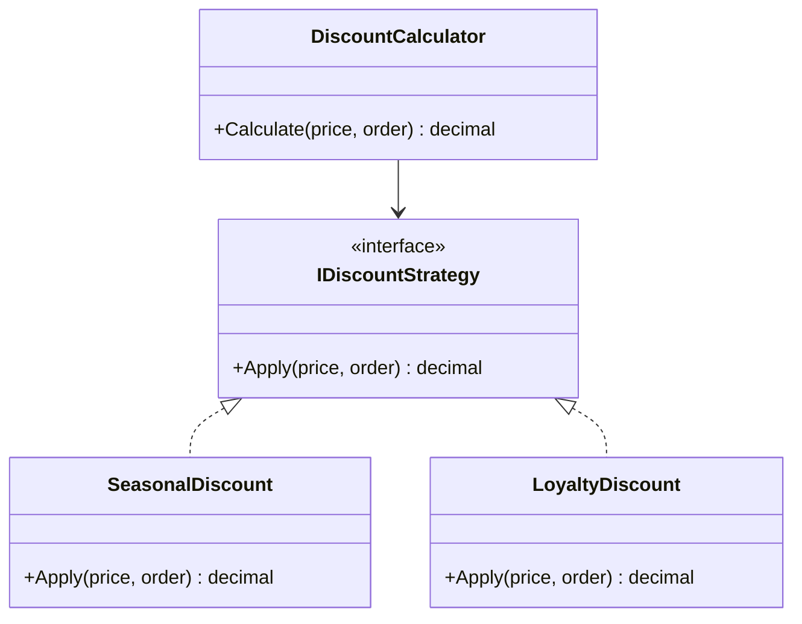

# 2. SOLID Applied & Clean Code

> **TL;DR:** SOLID is not academic — each principle maps to a concrete refactoring. Clean code is the ongoing tax you pay to keep a codebase maintainable.

**Interview weight:** P0 — asked directly ("show me OCP"), tested implicitly in every LLD round, and visible in every code review.

---

## S — Single Responsibility Principle

> A class should have one reason to change.

**Before (fat service):**
```csharp
public class OrderService
{
    public void PlaceOrder(Order order)
    {
        // 1. validate
        // 2. calculate discount
        // 3. save to DB
        // 4. send confirmation email
        // 5. push analytics event
    }
}
```
Five reasons to change. A pricing change, an email template change, and a DB migration all touch the same class.

**After (SRP):**
```csharp
public class OrderService
{
    public void PlaceOrder(Order order)
    {
        _validator.Validate(order);
        _discountCalculator.Apply(order);
        _orderRepository.Save(order);
        _notifier.SendConfirmation(order);
        _analytics.Track(order);
    }
}
```
Each collaborator has one reason to change.



---

## O — Open/Closed Principle

> Open for extension, closed for modification.

**Before:** `if/switch` on `DiscountType` — every new type modifies existing code.

**After (strategy for discount rules):**
```csharp
public interface IDiscountStrategy
{
    decimal Apply(decimal price, Order order);
}

public class SeasonalDiscount : IDiscountStrategy
{
    public decimal Apply(decimal price, Order order) => price * 0.9m;
}

public class LoyaltyDiscount : IDiscountStrategy
{
    public decimal Apply(decimal price, Order order) =>
        order.Customer.IsPremium ? price * 0.85m : price;
}

public class DiscountCalculator
{
    private readonly IEnumerable<IDiscountStrategy> _strategies;
    public decimal Calculate(decimal price, Order order) =>
        _strategies.Aggregate(price, (p, s) => s.Apply(p, order));
}
```



---

## L — Liskov Substitution Principle

> Subtypes must be substitutable for their base type without breaking the program.

**The classic violation — Square/Rectangle:**
```csharp
public class Rectangle
{
    public virtual int Width { get; set; }
    public virtual int Height { get; set; }
    public int Area() => Width * Height;
}

public class Square : Rectangle
{
    public override int Width { set { base.Width = base.Height = value; } }
    public override int Height { set { base.Width = base.Height = value; } }
}
// Caller that sets Width and Height independently breaks with Square.
```

**The `NotSupportedException` smell:**
```csharp
// BAD: IReadOnlyCollection throws on Add — LSP violated
public class ReadOnlyList<T> : List<T>
{
    public new void Add(T item) => throw new NotSupportedException();
}
```
Fix: don't inherit `List<T>`; implement only `IReadOnlyList<T>`.

**Rule:** If a subclass overrides a method only to throw, the hierarchy is wrong. Use composition or a narrower interface.

---

## I — Interface Segregation Principle

> Clients should not be forced to depend on methods they don't use.

**Before (fat repository interface):**
```csharp
public interface IOrderRepository
{
    Order GetById(Guid id);
    IEnumerable<Order> GetAll();
    void Save(Order order);
    void Delete(Guid id);
    IEnumerable<Order> GetByCustomer(Guid customerId);
    void BulkInsert(IEnumerable<Order> orders);
    void Archive(Guid id);
}
```
A query handler only needs `GetById`/`GetByCustomer` but depends on all 7.

**After:**
```csharp
public interface IOrderReader
{
    Order GetById(Guid id);
    IEnumerable<Order> GetByCustomer(Guid customerId);
}
public interface IOrderWriter
{
    void Save(Order order);
    void Delete(Guid id);
}
```
Concrete `OrderRepository` implements both. Handlers depend only on what they need.

---

## D — Dependency Inversion Principle

> High-level modules should not depend on low-level modules. Both should depend on abstractions.

```csharp
// BAD: high-level service imports low-level smtp detail
public class OrderService
{
    private readonly SmtpEmailSender _emailSender = new SmtpEmailSender();
}

// GOOD: depend on abstraction; infrastructure provides the concrete
public class OrderService
{
    private readonly IEmailSender _emailSender;
    public OrderService(IEmailSender emailSender) => _emailSender = emailSender;
}
```

**Where interfaces should live:** In `Domain` or `Application` — NOT in `Infrastructure`. The infrastructure layer implements the interface; it does not define it. The dependency arrow points inward.

---

## Composition Over Inheritance

| Aspect | Inheritance | Composition |
|---|---|---|
| Coupling | Tight — child tied to parent impl | Loose — swap implementations |
| Reuse unit | Whole class hierarchy | Single behaviour object |
| Testing | Hard to mock base behaviour | Easy — inject a fake |
| Extensibility | Fragile base class problem | Open by design |

**Rule:** Use inheritance only for a true, stable is-a relationship. Prefer composition for behaviour reuse.

---

## Dependency Injection vs Service Locator

| Aspect | Dependency Injection | Service Locator |
|---|---|---|
| Dependencies declared | At constructor (explicit) | Hidden inside class (implicit) |
| Testability | Easy — pass a mock | Hard — must configure global container |
| Discoverability | High — visible in constructor | Low — magic inside method |
| .NET support | `IServiceCollection` / `IServiceProvider` | Anti-pattern; avoid |

**Rule:** Always prefer constructor injection. Service locator is the "new" keyword in disguise.

---

## Tell-Don't-Ask & Law of Demeter

- **Tell-Don't-Ask:** Tell an object to do something rather than query its state and decide for it. `order.MarkShipped()` not `if (order.Status == Status.Paid) order.Status = Status.Shipped;`
- **Law of Demeter:** A method should only call methods on: itself, its parameters, objects it creates, its direct fields. `order.Customer.Address.City` violates it — that's a train wreck.

---

## Guard Clauses & Immutability

```csharp
// Guard clauses — fail fast at top; no nesting
public void Ship(Order order)
{
    if (order is null) throw new ArgumentNullException(nameof(order));
    if (order.Status != OrderStatus.Paid) throw new InvalidOperationException("Only paid orders can be shipped.");
    // ... actual logic
}
```

**Immutability:** Use `record`, `readonly` structs, `init`-only properties. Immutable objects are trivially thread-safe and easier to reason about.

---

## Primitive Obsession & Value Objects

```csharp
// BAD: primitive obsession
public void Ship(string address, decimal amount, string currency) { }

// GOOD: value objects
public record Money(decimal Amount, string Currency);
public record Address(string Street, string City, string PostalCode);
public void Ship(Address address, Money cost) { }
```

Value objects: equality by value, no identity, immutable. Common: `Money`, `Email`, `Url`, `DateRange`.

---

## Exceptions vs Result Types

| Aspect | Exception | `Result<T>` / `OneOf<T>` |
|---|---|---|
| Intended for | Truly exceptional, unrecoverable situations | Expected failure cases (validation, not-found) |
| Performance | Stack unwind — expensive | Heap allocation only |
| Caller UX | try/catch syntax | Pattern match / `.IsSuccess` |
| .NET precedent | `HttpClient` throws on network error | `TryGetValue` returns bool |
| Discoverability | Invisible in signature | Encoded in return type |

**Rule:** Domain validation failures → `Result<T>`. Infrastructure errors → exceptions or `ProblemDetails`.

---

## Naming

- Classes: nouns — `OrderProcessor`, `CustomerRepository`.
- Methods: verb phrases — `CalculateDiscount`, `FindByEmail`.
- Booleans: `is`, `has`, `can` prefix — `isExpired`, `hasPermission`.
- Avoid: `Manager`, `Handler`, `Util`, `Helper` — too generic; they attract unrelated code.
- One word per concept: don't use both `fetch` and `retrieve` for the same operation across the codebase.

---

## Function & Class Size

- **Function:** do one thing, ≤ 20 lines, ≤ 3 parameters (use a parameter object otherwise).
- **Class:** ≤ 200 lines is a soft guide; more important is cohesion — all methods use most fields.
- **Cyclomatic complexity ≤ 10** per method; above that, extract or use polymorphism.

---

## Comments That Earn Their Place

- **Good:** *Why* a decision was made, known limitation, algorithm citation.
- **Bad:** Restating what the code obviously does (`// loop over orders`).
- **Prefer** expressive names + guard clauses over defensive comments.

---

## Code Smells Catalogue

| Smell | Symptom | Refactoring |
|---|---|---|
| **Long Method** | > 30 lines, many comments | Extract Method |
| **God Class** | 500+ lines, 20+ methods | Extract Class, SRP split |
| **Feature Envy** | Method uses another class's data heavily | Move Method |
| **Data Clumps** | Same 3+ params always together | Introduce Parameter Object |
| **Primitive Obsession** | string/int for domain concepts | Value Object |
| **Switch Statements** | Repeated type-switching | Polymorphism / Strategy |
| **Parallel Inheritance Hierarchies** | Adding a subclass in A forces one in B | Collapse with composition |
| **Lazy Class** | Class does almost nothing | Inline Class |
| **Speculative Generality** | "We might need this" abstraction | YAGNI — delete it |
| **Temporary Field** | Field only set in one code path | Extract Class or Null Object |
| **Message Chains** | `a.B().C().D()` | Introduce Delegate / Law of Demeter |
| **Middle Man** | Class just delegates everything | Remove Middle Man |
| **Inappropriate Intimacy** | Class accesses another's privates | Move Method/Field |
| **Comments** | Comment explains confusing code | Rename + Extract Method |
| **Divergent Change** | One class changes for unrelated reasons | SRP split |
| **Shotgun Surgery** | One change touches 10 classes | Move related code together |

---

## DRY vs WET vs AHA

| Principle | Meaning | Risk of over-applying |
|---|---|---|
| **DRY** — Don't Repeat Yourself | Every piece of knowledge has one authoritative place | Premature abstraction — coupling unrelated things |
| **WET** — Write Everything Twice | Allow one repetition before abstracting | Two copies diverge; inconsistency bugs |
| **AHA** — Avoid Hasty Abstractions | Abstract only when the pattern is stable | N/A — this is the balanced approach |

**Rule:** Duplication is far cheaper than the wrong abstraction. Wait for the third case before abstracting.

---

## YAGNI / KISS / Cyclomatic Complexity

- **YAGNI** — don't build features "just in case". Build only what the current requirement needs.
- **KISS** — the simplest design that works is correct. Complexity is a bug.
- **Cyclomatic complexity** = number of linearly independent paths. `if`, `else`, `case`, `while`, `for`, `&&`, `||` each add 1. Target ≤ 10; refactor at > 15.

---

## Practical "Reviewable Clean Code" Checklist

- [ ] No method exceeds 20 lines; each does one thing.
- [ ] No class exceeds 200 lines of non-trivial code.
- [ ] All constructor parameters are used (no dead fields).
- [ ] No magic numbers — named constants or value objects.
- [ ] No public mutable state on domain objects.
- [ ] Guard clauses at top of each public method.
- [ ] Exception types match severity (domain vs infrastructure).
- [ ] No commented-out code — use git.
- [ ] Cyclomatic complexity ≤ 10.
- [ ] Dependencies injected (no `new` for services in services).
- [ ] All `IDisposable` wrapped in `using`.
- [ ] Async all the way — no `.Result` or `.Wait()`.

---

## Interview Questions

**Q1. Explain SRP in one sentence.**
A: A class should have exactly one reason to change — meaning it should own one cohesive responsibility and delegate everything else.

**Q2. What's the difference between OCP and the Strategy pattern?**
A: OCP is the principle ("closed for modification, open for extension"). Strategy is the mechanism that achieves OCP for algorithmic variation — you inject a new strategy instead of modifying existing code.

**Q3. Give a real example of an LSP violation you'd catch in code review.**
A: A subclass overriding a method only to throw `NotSupportedException` (e.g., `ReadOnlyCollection` inheriting `Collection` and throwing on `Add`). LSP is violated because callers can't use the subtype where the base type is expected.

**Q4. When should you NOT extract an interface?**
A: When there's only one implementation and no realistic need to vary or test in isolation. Premature interfaces add noise without benefit (interface explosion). Extract when there's a test seam or a variation point.

**Q5. What is primitive obsession and why is it a problem?**
A: Using basic types (`string`, `int`) for domain concepts like `Email`, `Money`, `PostalCode`. Problem: no validation at construction, no domain logic on the type, easy to mix up parameters of the same primitive type, and logic scattered across the codebase.

**Q6. When do you use a `Result<T>` return type instead of throwing an exception?**
A: For expected, domain-level failures — validation errors, not-found, business rule violations. These are not "exceptional"; they are normal outcomes the caller should handle. Exceptions should be reserved for truly unrecoverable conditions (DB connection failure, unhandled nulls).

**Q7. What is the Law of Demeter and why is `order.Customer.Address.City` bad?**
A: LoD says a method should only talk to its immediate collaborators. The chain means `OrderService` knows `Order` has a `Customer`, `Customer` has an `Address`, and `Address` has a `City`. If any link in that chain changes, `OrderService` breaks. Fix: `order.GetDeliveryCity()` — let `Order` navigate its own internals.

**Q8. What's the difference between DRY and AHA?**
A: DRY says eliminate duplication. AHA (Avoid Hasty Abstractions) says wait until the pattern is stable before abstracting. The risk of pure DRY is coupling two things that happen to look the same but will diverge. AHA is the pragmatic balance: allow one copy, abstract on the third.

**Q9. (Senior) A code review shows a 400-line class. How do you approach refactoring it without breaking things?**
A: (1) Identify the distinct responsibilities — each cluster of related fields + methods is a candidate class. (2) Extract classes one at a time with tests covering the extracted behaviour. (3) Inject the new class as a dependency. (4) Delete the extracted code from the original. Each step is independently mergeable and testable.

**Q10. (Senior) How does DIP relate to Clean Architecture's dependency rule?**
A: DIP says high-level modules own the interface; low-level modules implement it. Clean Architecture encodes this structurally: interfaces live in Domain/Application, implementations live in Infrastructure. The dependency arrows always point inward (toward the domain), never outward. This is the physical enforcement of DIP at the project level.

**Q11. (Senior) What's the difference between composition over inheritance and DIP?**
A: Composition over inheritance is about how you assemble behaviour (prefer "has-a" with injected collaborators over "is-a" inheritance). DIP is about which layer owns the abstraction. They complement each other: DIP tells you to depend on an interface; composition tells you to inject the concrete implementation rather than inherit it.

**Q12. (Staff) How would you convince a team that's heavy on `NotSupportedException` overrides to refactor?**
A: Frame it as a maintenance risk, not a purity argument. Demonstrate a specific case where caller code broke silently. Show that the fix (implement the right narrow interface) is smaller than the class being modified. Propose extracting role interfaces (ISP) alongside LSP fixes — the team gets cleaner callers as immediate benefit.

---

## Quick Recap

- **SRP:** one reason to change; fat service → split by responsibility.
- **OCP:** new behaviour via new class (strategy/decorator), not modification.
- **LSP:** subtypes fully substitute base; `NotSupportedException` in override = LSP violation.
- **ISP:** fat interfaces → split by client need; query handlers get `IOrderReader` only.
- **DIP:** interfaces live in Domain/Application, implementations in Infrastructure.
- Composition over inheritance — prefer "has-a" with injected strategies over "is-a".
- Value objects eliminate primitive obsession and enforce invariants at construction.
- `Result<T>` for domain failures; exceptions for truly exceptional conditions.
- Code smell → refactoring: Long Method → Extract Method; Switch → Strategy; Data Clumps → Parameter Object.
