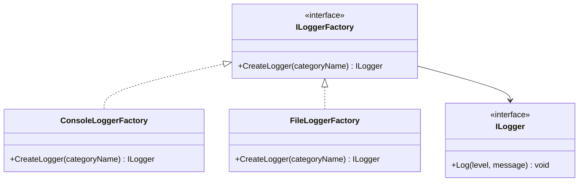
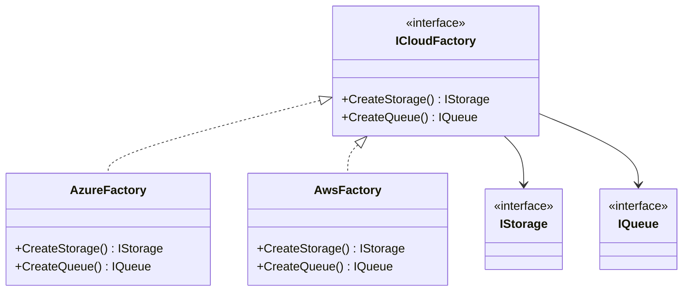
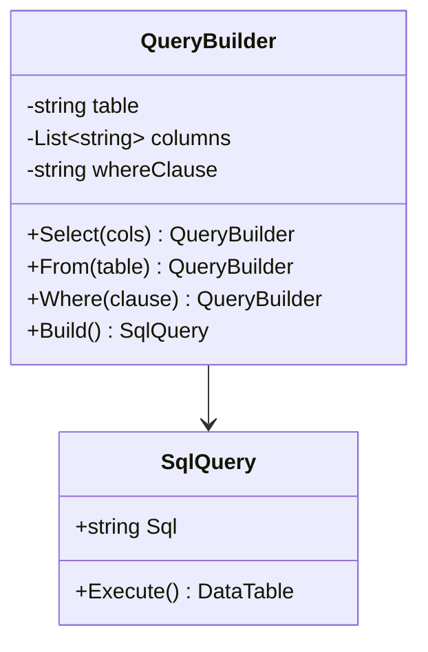

# 3. Creational Patterns

> **TL;DR:** Creational patterns control *how* objects are created, decoupling callers from concrete types. Modern .NET DI replaces many of them, but understanding the patterns is required at interview.

**Interview weight:** P0 — Singleton, Factory, and Builder appear in almost every LLD round; `HttpClientFactory` and `IServiceCollection` are the .NET incarnations.

---

## Pattern Comparison

| Pattern | Intent | Creation control | Complexity | When to pick |
|---|---|---|---|---|
| **Factory Method** | Subclass decides which concrete type | Per-subclass | Low | Decouple creation; extensible product families |
| **Abstract Factory** | Create families of related objects | Per-factory object | Medium | Multiple product families (UI themes, cloud providers) |
| **Builder** | Step-by-step construction of complex object | Single builder | Medium | Telescoping constructors; immutable complex objects |
| **Prototype** | Clone existing instance | Via copy | Low | Expensive construction; configurator/template objects |
| **Singleton** | One instance, global access | Class itself | Low | Shared resource with no config — but usually replace with DI |
| **Object Pool** | Reuse expensive objects | Pool manager | High | DB connections, threads, `ArrayPool<T>` |

---

## Factory Method

**Intent:** Define an interface for creating an object, but let subclasses decide which class to instantiate.



```csharp
public interface INotificationFactory
{
    INotification Create(string channel);
}

public class EmailNotificationFactory : INotificationFactory
{
    public INotification Create(string channel) => new EmailNotification(channel);
}

public class SmsNotificationFactory : INotificationFactory
{
    public INotification Create(string channel) => new SmsNotification(channel);
}
```

- **.NET example:** `ILoggerFactory.CreateLogger()`, `DbProviderFactory.CreateConnection()`.
- **When to use:** The caller knows *what* it needs but should not know the concrete type.
- **When NOT:** When there's only one concrete type and no variation planned.
- **Pitfall:** Factory proliferation — one factory per type. Use a registry or DI instead.

---

## Abstract Factory

**Intent:** Produce families of related objects without specifying their concrete classes.



```csharp
public interface ICloudFactory
{
    IStorage CreateStorage();
    IQueue CreateQueue();
}

public class AzureFactory : ICloudFactory
{
    public IStorage CreateStorage() => new AzureBlobStorage();
    public IQueue CreateQueue() => new ServiceBusQueue();
}
```

- **.NET example:** `IDbProviderFactory` (creates `IDbConnection`, `IDbCommand`, `IDbDataAdapter`).
- **When to use:** Multiple product families; consistency within a family is important.
- **When NOT:** When you only have one family — overkill; Factory Method suffices.
- **Pitfall:** Adding a new product type requires updating every factory class.

---

## Builder

**Intent:** Separate construction of a complex object from its representation.



```csharp
public class OrderBuilder
{
    private readonly Order _order = new();

    public OrderBuilder ForCustomer(Guid customerId)
    { _order.CustomerId = customerId; return this; }

    public OrderBuilder WithItem(Guid productId, int qty)
    { _order.Lines.Add(new OrderLine(productId, qty)); return this; }

    public OrderBuilder ApplyDiscount(decimal percent)
    { _order.DiscountPercent = percent; return this; }

    public Order Build()
    {
        if (_order.CustomerId == Guid.Empty) throw new InvalidOperationException("Customer required.");
        return _order;
    }
}

// Usage
var order = new OrderBuilder()
    .ForCustomer(customerId)
    .WithItem(productId, 2)
    .ApplyDiscount(10)
    .Build();
```

- **.NET example:** `StringBuilder`, `UriBuilder`, `WebApplication.CreateBuilder()`, `IHostBuilder`.
- **When to use:** > 4 constructor parameters; optional params; need validation at build time.
- **When NOT:** Simple objects with 1–2 params; just use a constructor.
- **Pitfall:** Mutable builder state — callers might reuse builder and get contaminated state.

---

## Prototype

**Intent:** Create new objects by copying an existing instance.

```csharp
public abstract class ReportTemplate
{
    public string Header { get; set; } = "";
    public string Footer { get; set; } = "";
    public abstract ReportTemplate Clone();
}

public class MonthlyReport : ReportTemplate
{
    public int Month { get; set; }
    public override ReportTemplate Clone() => (ReportTemplate)MemberwiseClone();
}

// Usage
var template = new MonthlyReport { Header = "ACME Corp", Footer = "Confidential", Month = 8 };
var august = (MonthlyReport)template.Clone();
var september = (MonthlyReport)template.Clone();
september.Month = 9;
```

- **.NET example:** `ICloneable`, `record` with `with` expression (`order with { Status = Shipped }`).
- **When to use:** Object construction is expensive; templates with minor variations.
- **When NOT:** Simple construction; deep copy semantics are complex and error-prone.
- **Pitfall:** Shallow copy copies references — a deep clone must be explicit.

---

## Singleton

**Intent:** Ensure a class has exactly one instance; provide a global access point.

### Thread-Safe Implementations

```csharp
// 1. Lazy<T> — preferred
public class AppConfig
{
    private static readonly Lazy<AppConfig> _instance =
        new(() => new AppConfig(), LazyThreadSafetyMode.ExecutionAndPublication);
    private AppConfig() { Load(); }
    public static AppConfig Instance => _instance.Value;
}

// 2. Static initializer (type initializer lock — also safe)
public class ConnectionPool
{
    private static readonly ConnectionPool _instance = new();
    static ConnectionPool() { }
    private ConnectionPool() { }
    public static ConnectionPool Instance => _instance;
}

// 3. Double-checked locking (verbose; Lazy<T> is cleaner)
private static volatile AppConfig? _instance;
private static readonly object _lock = new();
public static AppConfig Instance
{
    get
    {
        if (_instance is null)
            lock (_lock)
                _instance ??= new AppConfig();
        return _instance;
    }
}
```

### Singleton vs Static Class vs DI Singleton

| Aspect | Singleton pattern | Static class | DI Singleton (`ServiceLifetime.Singleton`) |
|---|---|---|---|
| Testability | Hard — global state | Impossible to mock | Easy — inject a fake |
| Interface | Can implement interface | Cannot | Registered against interface |
| Lazy init | Possible | No (static ctor) | Lazy by default |
| Lifetime control | Manual | Forever | Container managed |
| Recommendation | Legacy code | Utilities with no state | **Prefer this** |

### Why Singleton is often an anti-pattern
- **Global state** — makes unit tests order-dependent.
- **Hidden dependencies** — callers don't declare they need it.
- **Concurrency** — all callers share one instance; mutable state = race conditions.
- **Extension** — you can't swap implementation without changing source.

**Rule:** Register services as `AddSingleton<IService, Impl>()` in DI container. Never use static singleton instances for services.

---

## Object Pool

**Intent:** Reuse a set of expensive-to-create objects rather than creating and discarding.

```csharp
// ArrayPool<T> — built-in .NET object pool
byte[] buffer = ArrayPool<byte>.Shared.Rent(4096);
try
{
    // use buffer
}
finally
{
    ArrayPool<byte>.Shared.Return(buffer, clearArray: true);
}

// Custom pool with ObjectPool<T> from Microsoft.Extensions.ObjectPool
public class ExpensiveObjectPolicy : PooledObjectPolicy<ExpensiveObject>
{
    public override ExpensiveObject Create() => new ExpensiveObject();
    public override bool Return(ExpensiveObject obj) { obj.Reset(); return true; }
}
```

- **.NET examples:** `ArrayPool<T>`, `ObjectPool<T>`, `IDbConnection` pool in ADO.NET, `HttpClientFactory` manages `HttpMessageHandler` lifetimes.
- **When to use:** Object creation is expensive (DB connections, threads, large buffers); high allocation rate.
- **Pitfall:** Forgetting to return objects — pool exhaustion. Use `try/finally`.

---

## Dependency Injection as Modern Creational Pattern

DI containers (`IServiceCollection`) are a runtime Abstract Factory + Registry:

```csharp
builder.Services.AddSingleton<ICache, RedisCache>();
builder.Services.AddScoped<IOrderRepository, OrderRepository>();
builder.Services.AddTransient<IDiscountStrategy, LoyaltyDiscount>();
builder.Services.AddHttpClient<IGitHubClient, GitHubClient>();
```

- Replaces Factory Method and Singleton for application services.
- Lifetimes: `Singleton` (one instance), `Scoped` (one per HTTP request), `Transient` (new per injection).
- **Captive dependency bug:** Singleton depending on Scoped → Scoped lives as long as Singleton = memory leak + incorrect state.

---

## Interview Questions

**Q1. What's the difference between Factory Method and Abstract Factory?**
A: Factory Method uses inheritance — a subclass overrides a method to create a product. Abstract Factory uses composition — a factory object has methods to create a *family* of related products. Abstract Factory is for multiple product families; Factory Method is for single product variation.

**Q2. Why does .NET have `ILoggerFactory` instead of just `new Logger()`?**
A: `ILoggerFactory` decouples the caller from the concrete logger (Console, File, Application Insights). It enables testing (inject `NullLoggerFactory`), runtime configuration of providers, and multiple sink support — all without callers knowing which implementations exist.

**Q3. When would you use Builder over a constructor with optional parameters?**
A: When there are > 4 parameters (especially optional ones), when the construction involves validation, or when the object needs to be assembled in a specific order. Builders are self-documenting via method names and prevent invalid partial construction.

**Q4. What's the difference between `MemberwiseClone` and a deep clone?**
A: `MemberwiseClone` is a shallow copy — reference-type fields point to the same objects. A deep clone recursively copies all referenced objects. Use `MemberwiseClone` only when all fields are value types or immutable.

**Q5. What is the "captive dependency" problem in DI?**
A: A Singleton service holding a reference to a Scoped service. The Scoped service should be released after the request, but the Singleton holds it alive for the application lifetime — leading to stale state and potential memory leaks. ASP.NET Core's built-in container throws a validation exception for this.

**Q6. Why is the static Singleton pattern a problem for testing?**
A: Static state is global and shared across all tests. Tests run in arbitrary order can see state left by a previous test. You can't inject a mock. Even if you reset the singleton between tests, it's fragile and complex. DI singleton solves all of this.

**Q7. How does `HttpClientFactory` use the Object Pool pattern?**
A: `HttpClientFactory` manages the lifetime of `HttpMessageHandler` instances (the expensive part). It pools and reuses handlers while creating new `HttpClient` wrappers (cheap) per request, solving both the socket exhaustion (from new `HttpClient` each time) and DNS staleness (from long-lived `HttpClient`) problems.

**Q8. (Senior) When would you use ObjectPool<T> vs ArrayPool<T>?**
A: `ArrayPool<T>` is for raw arrays (no object initialisation needed — just buffer memory). `ObjectPool<T>` is for objects with initialisation cost and a `Reset()` concept. Use `ArrayPool<T>` for large byte/char buffers in I/O paths; use `ObjectPool<T>` for expensive serialiser contexts, parsers, or domain objects in hot paths.

**Q9. (Senior) How does the Builder pattern interact with immutability?**
A: The builder accumulates mutable state during construction; `Build()` produces an immutable object (with `init`-only properties or a `readonly struct`). This pattern is exactly what C# `record with` expression does under the hood — a builder that produces a new immutable record.

**Q10. (Staff) In a large .NET microservice, where do you register your factories and why?**
A: In the composition root — the DI container setup in `Program.cs` / startup. This is the only place that should know concrete types. Factory registrations are: `AddSingleton<ILoggerFactory>()` (built-in), `AddHttpClient<TClient>()` for typed clients, custom `IFactory<T>` registered with a lambda factory delegate. The rule is: nothing outside `Program.cs` should call `new` for a service.

**Q11. (Staff) How would you design a plugin/extension system using the Abstract Factory pattern?**
A: Define an `IPluginFactory` interface in the core assembly. Each plugin assembly provides an `IPluginFactory` implementation. At startup, use reflection or `AssemblyLoadContext` to discover plugin assemblies, resolve their factory via a naming convention or attribute, and register products with the DI container. The core never knows concrete plugin types.

---

## Quick Recap

- **Factory Method:** subclass-controlled creation; decouple caller from concrete type.
- **Abstract Factory:** families of related products; swap entire family at once.
- **Builder:** step-by-step complex object construction; validate at `Build()`.
- **Prototype:** clone existing instance; watch for shallow-copy pitfalls.
- **Singleton:** one instance — use `Lazy<T>` if you must; prefer DI singleton.
- **Object Pool:** `ArrayPool<T>`, `ObjectPool<T>`, always return in `finally`.
- **DI container** is a runtime Abstract Factory + Registry — the modern replacement for most creational patterns.
- Captive dependency: Singleton → Scoped = bug; container validates this.
