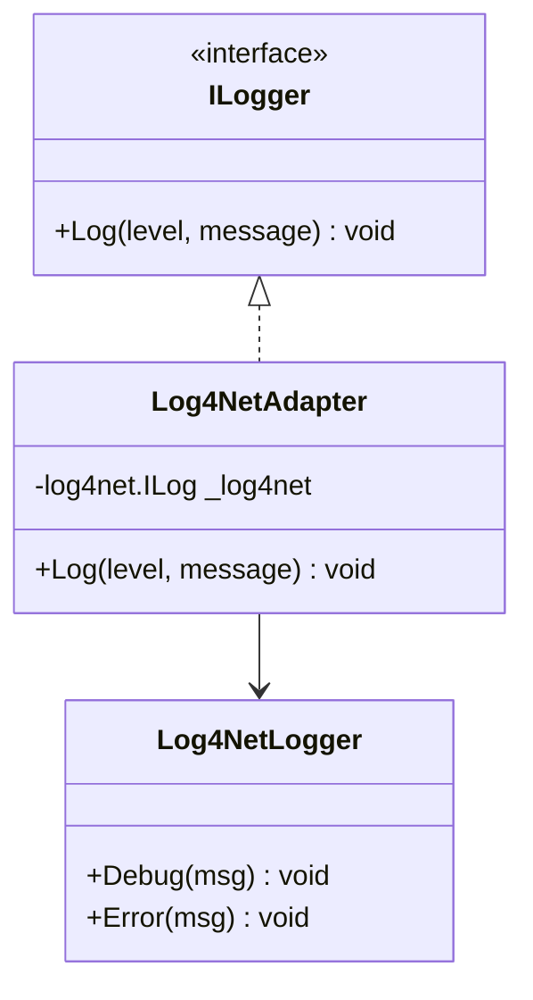
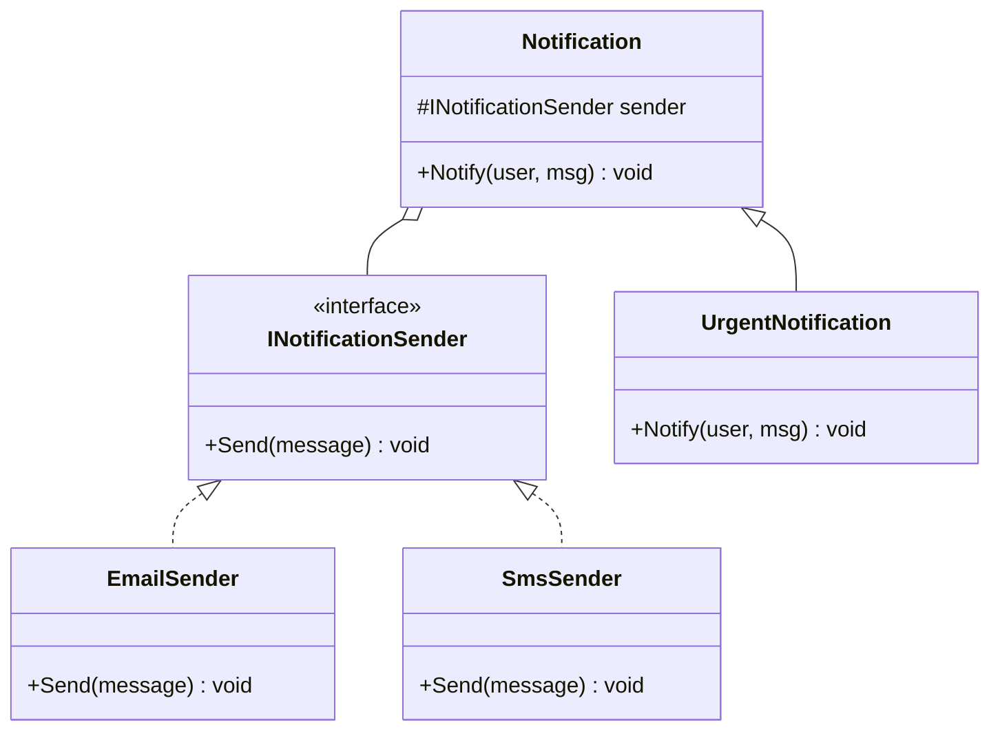
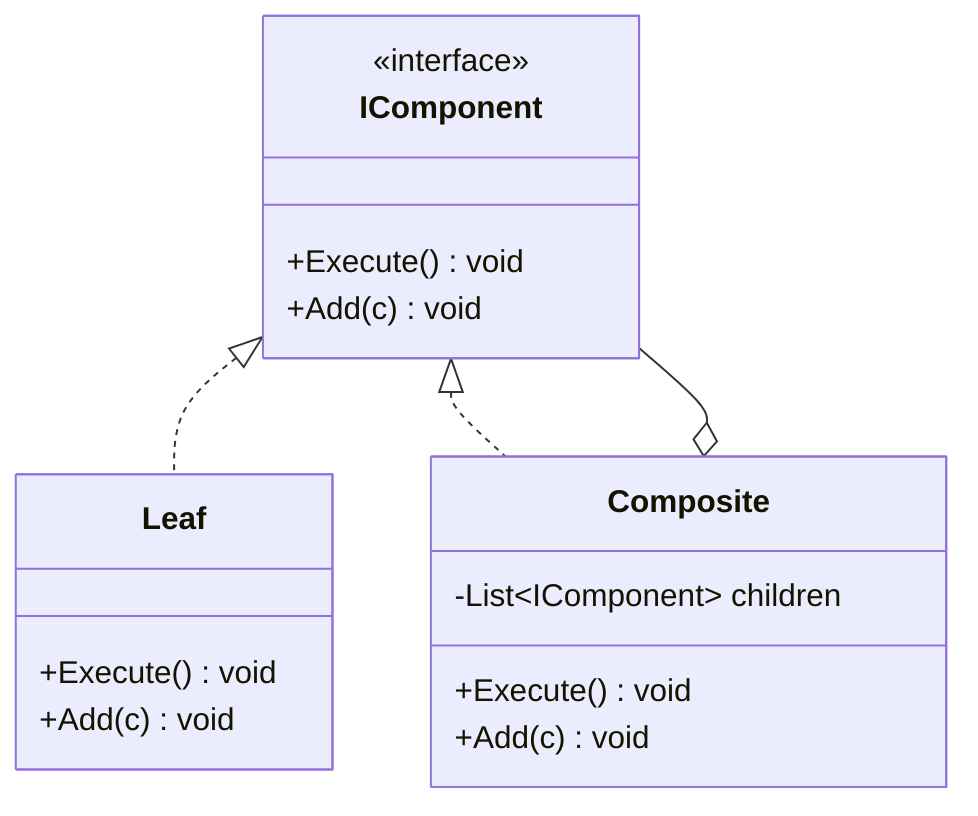
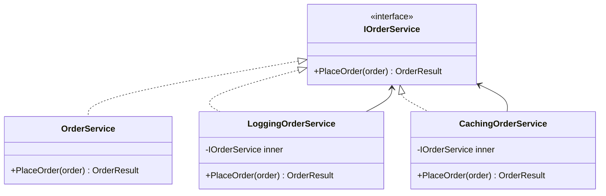

# 4. Structural Patterns

> **TL;DR:** Structural patterns compose classes and objects into larger structures while keeping those structures flexible. They're the backbone of cross-cutting concerns (Decorator), integration layers (Adapter), and subsystem hiding (Facade).

**Interview weight:** P0 — Decorator and Proxy are used daily in .NET middleware and EF Core; Adapter is the go-to integration pattern; Facade appears in every SDK design.

---

## The Big-4 Confusion Table — Decorator vs Proxy vs Adapter vs Facade

| Aspect | Decorator | Proxy | Adapter | Facade |
|---|---|---|---|---|
| **Intent** | Add behaviour at runtime | Control access to an object | Bridge incompatible interfaces | Simplify a complex subsystem |
| **Interface** | Same as wrapped object | Same as wrapped object | Converts one to another | New simplified interface |
| **Wrapping** | Wraps same-interface object | Wraps same-interface object | Wraps a different interface | Wraps multiple objects/subsystems |
| **Transparency** | Caller is unaware of decoration | Caller is unaware of proxy | Caller uses adapter's interface | Caller uses simplified interface |
| **Example** | Logging, retry, caching on `IOrderService` | EF Core lazy-loading proxy, caching proxy | `ILogger` adapter over `log4net` | `PaymentFacade` over Stripe + PayPal + Auth |
| **New behaviour** | Yes — adds new logic | Minimal — mostly control | No — translates only | No — delegates only |

---

## Adapter

**Intent:** Convert the interface of a class into another interface clients expect. Lets classes work together that otherwise couldn't.



```csharp
public interface IEmailSender
{
    Task SendAsync(string to, string subject, string body);
}

// Third-party SDK has a completely different API
public class SendGridAdapter : IEmailSender
{
    private readonly SendGridClient _client;
    public SendGridAdapter(SendGridClient client) => _client = client;

    public async Task SendAsync(string to, string subject, string body)
    {
        var msg = MailHelper.CreateSingleEmail(
            new EmailAddress("noreply@app.com"), new EmailAddress(to), subject, body, body);
        await _client.SendEmailAsync(msg);
    }
}
```

- **.NET example:** `Stream`-to-`TextReader` adapter, `ILogger` over `log4net`, `HttpMessageHandler` adaptors.
- **When to use:** Integrating a third-party library without modifying it; legacy code migration.
- **Pitfall:** Adapter that does too much — it should translate, not add business logic.

---

## Bridge

**Intent:** Decouple an abstraction from its implementation so the two can vary independently.



```csharp
// Two orthogonal axes: notification urgency vs delivery channel
// Without Bridge: UrgentEmail, UrgentSms, NormalEmail, NormalSms = N*M classes
// With Bridge: N urgency types + M channel types = N+M classes
public abstract class Notification
{
    protected readonly INotificationSender _sender;
    protected Notification(INotificationSender sender) => _sender = sender;
    public abstract void Notify(string user, string message);
}

public class UrgentNotification : Notification
{
    public UrgentNotification(INotificationSender sender) : base(sender) { }
    public override void Notify(string user, string message) =>
        _sender.Send($"URGENT [{user}]: {message}");
}
```

- **When to use:** Two independent dimensions of variation; avoid M×N class explosion.
- **Pitfall:** Over-engineering when only one dimension exists.

---

## Composite

**Intent:** Compose objects into tree structures; treat individual objects and composites uniformly.



```csharp
public interface IValidationRule
{
    ValidationResult Validate(Order order);
}

public class CompositeValidationRule : IValidationRule
{
    private readonly List<IValidationRule> _rules = new();
    public void Add(IValidationRule rule) => _rules.Add(rule);
    public ValidationResult Validate(Order order)
    {
        var errors = _rules.SelectMany(r => r.Validate(order).Errors).ToList();
        return new ValidationResult(errors);
    }
}
```

- **.NET example:** `IValidationRule` trees, `Microsoft.Extensions.FileProviders.CompositeFileProvider`, UI component hierarchies.
- **When to use:** Tree structures where leaf and branch nodes are treated identically.
- **Pitfall:** Methods like `Add`/`Remove` make no sense on leaf nodes — expose only on `Composite`.

---

## Decorator

**Intent:** Attach additional responsibilities to an object at runtime. An alternative to subclassing for extending functionality.



```csharp
public class LoggingOrderService : IOrderService
{
    private readonly IOrderService _inner;
    private readonly ILogger<LoggingOrderService> _logger;

    public LoggingOrderService(IOrderService inner, ILogger<LoggingOrderService> logger)
    { _inner = inner; _logger = logger; }

    public async Task<OrderResult> PlaceOrder(Order order)
    {
        _logger.LogInformation("Placing order {OrderId}", order.Id);
        var result = await _inner.PlaceOrder(order);
        _logger.LogInformation("Order placed: {Status}", result.Status);
        return result;
    }
}

// Registration (Scrutor library or manual)
services.AddScoped<OrderService>();
services.Decorate<IOrderService, LoggingOrderService>();
services.Decorate<IOrderService, CachingOrderService>();
```

- **.NET examples:** `Stream` decorators (`BufferedStream`, `GZipStream`, `CryptoStream`), `DelegatingHandler` in `HttpClient`, ASP.NET Core middleware.
- **When to use:** Cross-cutting concerns (logging, retry, caching, auth) without modifying original class.
- **Pitfall:** Deep decoration chains are hard to debug; prefer middleware pipeline for HTTP concerns.

---

## Decorator vs Middleware vs AOP

| Aspect | Decorator | ASP.NET Core Middleware | AOP (PostSharp / Fody) |
|---|---|---|---|
| Scope | Any interface/class | HTTP pipeline only | Any method (compile/runtime weaving) |
| Wiring | DI / manual | `app.Use()` order | Attribute on class/method |
| Testability | High — inject fake inner | Medium — TestServer | Low — compile-time magic |
| Performance | Minimal overhead | Minimal | Variable — depends on IL weaving |
| Discoverability | Visible in DI registration | Visible in `Program.cs` order | Hidden — attribute on method |
| Best for | Domain/application services | HTTP concerns (auth, rate-limit, error) | Cross-cutting at scale (logging, tracing) |

---

## Facade

**Intent:** Provide a simplified interface to a complex subsystem.

```csharp
// Subsystems: InventoryService, PaymentGateway, ShippingService, NotificationService
public class OrderFacade
{
    public async Task<OrderResult> PlaceOrder(PlaceOrderRequest request)
    {
        await _inventory.ReserveItems(request.Items);
        var payment = await _payment.Charge(request.PaymentInfo, request.Total);
        var shipment = await _shipping.CreateShipment(request.Address, request.Items);
        await _notifications.SendConfirmation(request.CustomerId, shipment.TrackingId);
        return new OrderResult(payment.TransactionId, shipment.TrackingId);
    }
}
```

- **.NET examples:** `HttpClient` (facade over TCP, DNS, TLS, HTTP), `IMediator` (facade over command/query dispatch), SDK client libraries.
- **When to use:** Simplify a complex subsystem for the majority of callers; reduce dependencies.
- **Pitfall:** Facade that grows too large becomes a God class; keep it thin (orchestration only, no business logic).

---

## Flyweight

**Intent:** Use sharing to support a large number of fine-grained objects efficiently.

```csharp
// Character rendering — shared glyph data (intrinsic) vs per-char position (extrinsic)
public class GlyphFlyweight
{
    public char Character { get; }
    public byte[] FontData { get; }  // shared (intrinsic)
    private GlyphFlyweight(char c, byte[] data) { Character = c; FontData = data; }

    private static readonly Dictionary<char, GlyphFlyweight> _cache = new();
    public static GlyphFlyweight Get(char c) =>
        _cache.GetOrAdd(c, ch => new GlyphFlyweight(ch, LoadFont(ch)));

    private static byte[] LoadFont(char c) => new byte[4096]; // simulate
}

// Memory math example: 100,000 chars * 4 KB font data WITHOUT flyweight = 400 MB
// WITH flyweight: 95 unique glyphs * 4 KB = 380 KB + 100,000 * (2 bytes char + pointer) ≈ 1.5 MB
```

- **.NET examples:** `string.Intern()`, compiled regex instances, `MemoryCache` of expensive computed values.
- **When to use:** Millions of objects where most state is shared. Measure before applying.
- **Pitfall:** Intrinsic/extrinsic state split is subtle; shared state must be immutable.

---

## Proxy

**Intent:** Provide a surrogate or placeholder for another object to control access.

**Proxy types:**

| Type | Purpose | .NET Example |
|---|---|---|
| **Virtual (lazy)** | Delay expensive creation until needed | EF Core navigation property lazy loading |
| **Caching** | Return cached result instead of calling real service | `IMemoryCache`-wrapping service decorator |
| **Remote** | Represent remote object locally | gRPC client stub, WCF proxy |
| **Protection** | Check access rights before forwarding | Authorization middleware, policy-based service proxy |
| **Logging/Monitoring** | Intercept calls to add observability | `DispatchProxy`, Castle DynamicProxy |

```csharp
// Caching proxy
public class CachingOrderRepository : IOrderRepository
{
    private readonly IOrderRepository _inner;
    private readonly IMemoryCache _cache;

    public async Task<Order?> GetByIdAsync(Guid id)
    {
        return await _cache.GetOrCreateAsync($"order:{id}", async entry =>
        {
            entry.AbsoluteExpirationRelativeToNow = TimeSpan.FromMinutes(5);
            return await _inner.GetByIdAsync(id);
        });
    }
}

// EF Core lazy-loading proxy (auto-generated)
// var customer = db.Customers.Find(id);
// customer.Orders  <-- EF generates a proxy that executes SELECT on first access
```

- **When to use:** Add access control, caching, or lazy init transparently without changing the real object.
- **Pitfall:** Proxy and real object must stay in sync; if the interface changes, the proxy must change.

---

## Interview Questions

**Q1. What's the difference between Decorator and Proxy?**
A: Both wrap an object with the same interface. The difference is intent: Decorator *adds new behaviour* (logging, retry). Proxy *controls access* (lazy init, cache, auth check) without adding functional behaviour. In practice the boundary blurs — a "caching proxy" could also be called a "caching decorator."

**Q2. When would you use Adapter vs Facade?**
A: Adapter: you have an existing interface your system expects, and a third-party library with a different interface — wrap it. Facade: you have a complex subsystem (multiple classes/methods) and want to expose a simpler API to callers. Adapter translates; Facade simplifies.

**Q3. How is Composite different from Decorator?**
A: Composite is for tree structures where branch and leaf are treated identically. Decorator wraps a single object to add behaviour. Composite is structural (hierarchy); Decorator is behavioural (extension). A Composite node can hold multiple children; a Decorator wraps exactly one.

**Q4. How does `GZipStream` use the Decorator pattern?**
A: `GZipStream` wraps any `Stream` and adds gzip compression/decompression. The caller works with it exactly as a `Stream` (same interface). You can chain: `new GZipStream(new BufferedStream(new FileStream(...)))` — each decorator adds one concern.

**Q5. What is the Flyweight pattern and when should you use it?**
A: Share intrinsic (immutable) state across many instances; pass extrinsic (context-specific) state at runtime. Use when you have millions of objects where most state is identical — e.g., characters in a text editor, enemy sprites in a game. Always measure before applying — it adds complexity.

**Q6. What is a virtual proxy and how does EF Core use it?**
A: A virtual proxy delays expensive creation until first access. EF Core generates proxy subclasses for entities with virtual navigation properties. `customer.Orders` is initially null; the proxy intercepts the property getter and executes a SQL query on first access.

**Q7. (Senior) Why is Facade different from a God class?**
A: A Facade is a thin orchestrator — it delegates all logic to the subsystems it wraps. A God class contains the logic itself. A Facade is open (subsystems are independently testable). A God class is closed (logic is trapped inside). If your Facade grows decision-making code, it's becoming a God class.

**Q8. (Senior) How would you implement retry logic using the Decorator pattern in .NET?**
A: Create a `RetryOrderService : IOrderService` that wraps `IOrderService`. In `PlaceOrder`, call `_inner.PlaceOrder()` in a retry loop with exponential backoff (`Polly` handles this). Register via `services.Decorate<IOrderService, RetryOrderService>()`. Polly's `AddPolicyHandler` on `HttpClient` is the same pattern built in.

**Q9. (Senior) Compare Decorator for cross-cutting concerns vs ASP.NET Core middleware.**
A: Middleware is an HTTP-pipeline concept — great for auth, rate limiting, exception handling on HTTP requests. Decorator works at the service/domain level — great for logging, caching, retry on business operations. Use middleware for HTTP concerns; use Decorator (or Scrutor) for domain/application service concerns. AOP (PostSharp) is a third option but has build-time cost and hidden behaviour.

**Q10. (Staff) In a microservice that has 20 service interfaces, how would you apply Decorator for logging without writing 20 decorators?**
A: Use `DispatchProxy` (`System.Reflection.DispatchProxy`) to create a generic logging proxy that intercepts all method calls via reflection. Or use Castle DynamicProxy with an interceptor. Register via a DI convention scan. This is essentially AOP at runtime. Trade-off: reflection overhead (~0.5–2 µs per call) vs developer productivity. For high-throughput hot paths, prefer explicit decorators; for low-frequency management operations, generic proxy is fine.

---

## Quick Recap

- **Adapter:** translate an incompatible interface; never add business logic.
- **Bridge:** separate abstraction from implementation to avoid N×M class explosion.
- **Composite:** tree structures; leaf and branch implement the same interface.
- **Decorator:** same interface, wraps inner, adds behaviour — `GZipStream`, retry, logging, caching.
- **Facade:** simplify a complex subsystem; thin orchestrator, no logic.
- **Flyweight:** share intrinsic (immutable) state; pass extrinsic state at runtime — measure memory savings first.
- **Proxy:** control access (lazy, cache, auth, remote) — same interface, same shape as Decorator but different intent.
- Decorator vs Proxy: Decorator adds behaviour; Proxy controls access.
- Decorator vs Middleware: Decorator = domain services; Middleware = HTTP pipeline.
