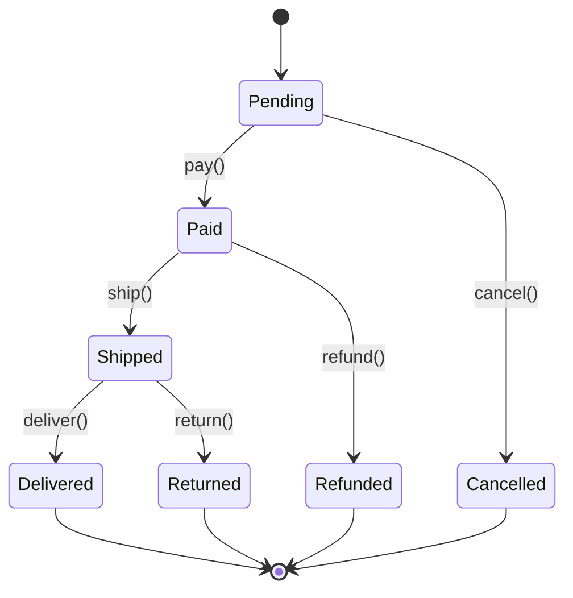

# 5. Behavioral Patterns

> **TL;DR:** Behavioral patterns are about how objects communicate and responsibilities are distributed. Strategy, Observer, and Command are the daily workhorses; State eliminates conditional tangles; Chain of Responsibility is ASP.NET Core middleware.

**Interview weight:** P0 — Strategy and Observer appear in almost every design question; MediatR (Command/Mediator) is a .NET staple; State drives machine-coding rounds for elevator/vending machine.

---

## Strategy vs State vs Template Method

| Aspect | Strategy | State | Template Method |
|---|---|---|---|
| **Varies** | Algorithm/behaviour | Object behaviour per state | Steps of an algorithm |
| **Switching** | Caller injects strategy | Object switches itself | Subclass overrides steps |
| **Context knows** | Nothing about concrete strategy | Which state it's in | Framework calls subclass hooks |
| **Use when** | Multiple interchangeable algorithms | Object has lifecycle with explicit states | Algorithm skeleton is fixed, steps vary |
| **.NET example** | `IComparer<T>`, sorting | Order state machine, Elevator | `Stream`, `DbDataReader` |

---

## Observer vs Mediator vs Pub-Sub Message Bus

| Aspect | Observer | Mediator | Pub-Sub Message Bus |
|---|---|---|---|
| **Coupling** | Subject knows `IObserver` type | Colleagues know only `IMediator` | Publishers know nothing about subscribers |
| **Delivery** | Synchronous, in-process | Synchronous, in-process | Async, potentially cross-process |
| **Coordination** | Subject drives updates | Mediator orchestrates | Broker routes messages |
| **Scale** | Tight — all in one process | Tight — all in one process | Loose — services, queues |
| **.NET example** | `IObservable<T>` / Rx | MediatR | Azure Service Bus, Kafka |

---

## Chain of Responsibility vs Middleware Pipeline vs Decorator

| Aspect | Chain of Responsibility | ASP.NET Core Middleware | Decorator |
|---|---|---|---|
| **Handler calls next?** | Optionally — can short-circuit | Yes — `await next(context)` | Always (wraps inner) |
| **Target** | Request object routed to handler | HTTP context enriched | Single interface method call |
| **Order matters** | Yes — first match wins or all run | Yes — order in `Program.cs` | Yes — outer-to-inner |
| **Built-in .NET** | No standard base | `IMiddleware` / `RequestDelegate` | `DelegatingHandler` in HttpClient |

---

## Strategy

**Intent:** Define a family of algorithms; make them interchangeable; let the algorithm vary independently from clients.

```csharp
public interface ISortStrategy<T>
{
    void Sort(List<T> items);
}

public class QuickSort<T> : ISortStrategy<T> where T : IComparable<T>
{
    public void Sort(List<T> items) { /* quicksort */ }
}

public class MergeSort<T> : ISortStrategy<T> where T : IComparable<T>
{
    public void Sort(List<T> items) { /* mergesort */ }
}

public class DataProcessor<T> where T : IComparable<T>
{
    private ISortStrategy<T> _strategy;
    public DataProcessor(ISortStrategy<T> strategy) => _strategy = strategy;
    public void SetStrategy(ISortStrategy<T> s) => _strategy = s;
    public void Process(List<T> data) { _strategy.Sort(data); }
}
```

- **.NET examples:** `IComparer<T>`, `IEqualityComparer<T>`, `IDiscountStrategy` in discount engines, Polly retry policies.
- **When to use:** Multiple algorithms for the same task that should be swappable at runtime or test time.
- **Pitfall:** If strategies share no common behaviour, an interface is sufficient — don't force a class hierarchy.

---

## Observer

**Intent:** Define a one-to-many dependency so that when one object changes state, all dependents are notified automatically.

```csharp
public interface IOrderObserver
{
    Task OnOrderPlaced(Order order);
}

public class OrderService
{
    private readonly List<IOrderObserver> _observers = new();
    public void Subscribe(IOrderObserver obs) => _observers.Add(obs);

    public async Task PlaceOrder(Order order)
    {
        // ... place order logic
        foreach (var obs in _observers)
            await obs.OnOrderPlaced(order);
    }
}

// .NET idiomatic: events / IObservable<T>
public class OrderService
{
    public event EventHandler<Order>? OrderPlaced;
    protected virtual void OnOrderPlaced(Order order) => OrderPlaced?.Invoke(this, order);
}
```

- **.NET examples:** `IObservable<T>` / `IObserver<T>` (Rx.NET), `IChangeToken`, `EventHandler<T>`, `IHostedService` with event bus, domain events in DDD.
- **When to use:** Decouple event producers from consumers; multiple consumers for one event.
- **Pitfall:** Memory leaks — if observers aren't unsubscribed, the subject holds references forever.

---

## Command

**Intent:** Encapsulate a request as an object, allowing parameterisation, queuing, logging, and undo.

```csharp
public interface ICommand
{
    Task ExecuteAsync(CancellationToken ct = default);
    Task UndoAsync(CancellationToken ct = default);
}

public class PlaceOrderCommand : ICommand
{
    private readonly IOrderRepository _repo;
    private readonly Order _order;
    private Order? _previousState;

    public PlaceOrderCommand(Order order, IOrderRepository repo)
    { _order = order; _repo = repo; }

    public async Task ExecuteAsync(CancellationToken ct)
    {
        _previousState = await _repo.GetByIdAsync(_order.Id, ct);
        await _repo.SaveAsync(_order, ct);
    }

    public async Task UndoAsync(CancellationToken ct)
    {
        if (_previousState != null)
            await _repo.SaveAsync(_previousState, ct);
    }
}
```

- **.NET examples:** MediatR `IRequest<T>` / `IRequestHandler<T>` (Command pattern at application layer), `IDbCommand`, transaction scripts, audit log via command history.
- **When to use:** Undo/redo, operation queuing, transactional scripts, CQRS.
- **Pitfall:** Command objects capturing too much context — keep them as lightweight DTOs; handler does the work.

---

## Chain of Responsibility

**Intent:** Pass a request along a chain of handlers; each handler decides to process or pass on.

```csharp
public abstract class ApprovalHandler
{
    protected ApprovalHandler? _next;
    public ApprovalHandler SetNext(ApprovalHandler next) { _next = next; return next; }

    public abstract void Handle(ExpenseRequest request);
}

public class ManagerApproval : ApprovalHandler
{
    public override void Handle(ExpenseRequest request)
    {
        if (request.Amount <= 1000)
            Console.WriteLine($"Manager approved ${request.Amount}");
        else
            _next?.Handle(request);
    }
}

public class DirectorApproval : ApprovalHandler
{
    public override void Handle(ExpenseRequest request)
    {
        if (request.Amount <= 10000) Console.WriteLine($"Director approved ${request.Amount}");
        else _next?.Handle(request);
    }
}
```

- **.NET examples:** ASP.NET Core middleware pipeline (`RequestDelegate` chain), `DelegatingHandler` in `HttpClient`, validation pipelines, MediatR pipeline behaviours.
- **When to use:** Multiple handlers may process a request; handler set is dynamic.
- **Pitfall:** If no handler processes the request and there's no fallback, requests silently disappear.

---

## Mediator

**Intent:** Define an object that encapsulates how a set of objects interact, promoting loose coupling.

```csharp
// MediatR pattern — widely used in .NET
public record PlaceOrderCommand(Guid CustomerId, List<OrderItem> Items)
    : IRequest<OrderResult>;

public class PlaceOrderHandler : IRequestHandler<PlaceOrderCommand, OrderResult>
{
    private readonly IOrderRepository _repo;
    private readonly IPublisher _publisher;

    public PlaceOrderHandler(IOrderRepository repo, IPublisher publisher)
    { _repo = repo; _publisher = publisher; }

    public async Task<OrderResult> Handle(PlaceOrderCommand cmd, CancellationToken ct)
    {
        var order = Order.Create(cmd.CustomerId, cmd.Items);
        await _repo.SaveAsync(order, ct);
        await _publisher.Publish(new OrderPlacedEvent(order.Id), ct);
        return new OrderResult(order.Id);
    }
}
```

- **.NET examples:** MediatR, `IMediator` interface, CQRS dispatchers.
- **When to use:** Many objects interact in complex ways; reducing coupling between components.
- **Pitfall:** Mediator itself becomes a God object if all logic lives in the mediator rather than handlers.

---

## State

**Intent:** Allow an object to alter its behaviour when its internal state changes; the object will appear to change its class.



```csharp
public interface IOrderState
{
    void Pay(Order order);
    void Ship(Order order);
    void Cancel(Order order);
}

public class PendingState : IOrderState
{
    public void Pay(Order order) => order.TransitionTo(new PaidState());
    public void Ship(Order order) => throw new InvalidOperationException("Pay first.");
    public void Cancel(Order order) => order.TransitionTo(new CancelledState());
}

public class PaidState : IOrderState
{
    public void Pay(Order order) => throw new InvalidOperationException("Already paid.");
    public void Ship(Order order) => order.TransitionTo(new ShippedState());
    public void Cancel(Order order) => order.TransitionTo(new RefundedState());
}

public class Order
{
    private IOrderState _state = new PendingState();
    public void TransitionTo(IOrderState state) => _state = state;
    public void Pay() => _state.Pay(this);
    public void Ship() => _state.Ship(this);
}
```

- **.NET examples:** Workflow engines, order lifecycle, elevator state machine, TCP connection states.
- **When to use:** Object behaviour changes dramatically based on internal state; many `if/switch` on status enum.
- **Pitfall:** State explosion — too many state classes. Consider `Stateless` NuGet library for complex machines.

---

## Template Method

**Intent:** Define the skeleton of an algorithm in a base class; let subclasses fill in specific steps.

```csharp
public abstract class ReportGenerator
{
    // Template method — skeleton
    public void GenerateReport()
    {
        var data = FetchData();
        var processed = ProcessData(data);
        FormatOutput(processed);
        Send();
    }

    protected abstract IEnumerable<object> FetchData();
    protected abstract IEnumerable<object> ProcessData(IEnumerable<object> raw);
    protected virtual void FormatOutput(IEnumerable<object> data) => Console.WriteLine(data);
    protected virtual void Send() { /* default: no-op */ }
}

public class SalesReport : ReportGenerator
{
    protected override IEnumerable<object> FetchData() => _db.GetSalesData();
    protected override IEnumerable<object> ProcessData(IEnumerable<object> raw) =>
        raw.Cast<SaleRecord>().Where(s => s.Amount > 0);
}
```

- **.NET examples:** `Stream` (abstract `Read`/`Write`), `DbDataReader`, `BackgroundService` (`ExecuteAsync` hook), `ControllerBase`.
- **When to use:** Algorithm skeleton is fixed; variation is in specific steps; avoid code duplication in subclasses.
- **Pitfall:** Deep inheritance hierarchies — Template Method relies on inheritance. Prefer Strategy if steps need runtime swapping.

---

## Iterator

**Intent:** Provide a way to access elements of an aggregate sequentially without exposing its structure.

```csharp
// C# IEnumerator<T> / IEnumerable<T> IS the Iterator pattern
public class OrderCollection : IEnumerable<Order>
{
    private readonly List<Order> _orders = new();
    public IEnumerator<Order> GetEnumerator() => _orders.GetEnumerator();
    IEnumerator IEnumerable.GetEnumerator() => GetEnumerator();
}

// IAsyncEnumerable<T> — for async streams
public async IAsyncEnumerable<Order> StreamOrdersAsync()
{
    await foreach (var page in _repo.GetPagedAsync())
        foreach (var order in page)
            yield return order;
}
```

- **.NET examples:** `IEnumerable<T>`, `IEnumerator<T>`, `yield return`, `IAsyncEnumerable<T>`, LINQ.
- **When to use:** Every time you need to traverse a collection — it's built into C#.

---

## Visitor

**Intent:** Define a new operation on elements of an object structure without changing the classes of those elements.

```csharp
public interface IShapeVisitor
{
    void Visit(Circle circle);
    void Visit(Rectangle rect);
}

public abstract class Shape
{
    public abstract void Accept(IShapeVisitor visitor);
}

public class Circle : Shape
{
    public double Radius { get; set; }
    public override void Accept(IShapeVisitor v) => v.Visit(this);
}

public class AreaCalculator : IShapeVisitor
{
    public double TotalArea { get; private set; }
    public void Visit(Circle c) => TotalArea += Math.PI * c.Radius * c.Radius;
    public void Visit(Rectangle r) => TotalArea += r.Width * r.Height;
}
```

- **When to use:** Add operations to a class hierarchy without modifying each class; many operations on a stable hierarchy.
- **Pitfall:** Adding a new element type requires updating every visitor — tight coupling on the element axis.

---

## Memento

**Intent:** Capture and externalise an object's internal state so it can be restored later, without violating encapsulation.

```csharp
public class TextEditor
{
    private string _content = "";
    public void Type(string text) => _content += text;
    public EditorMemento Save() => new(_content);
    public void Restore(EditorMemento m) => _content = m.Content;
}

public record EditorMemento(string Content);

public class History
{
    private readonly Stack<EditorMemento> _stack = new();
    public void Push(EditorMemento m) => _stack.Push(m);
    public EditorMemento? Pop() => _stack.Count > 0 ? _stack.Pop() : null;
}

// Usage
var editor = new TextEditor();
var history = new History();
editor.Type("Hello");
history.Push(editor.Save());
editor.Type(" World");
editor.Restore(history.Pop()!); // back to "Hello"
```

- **When to use:** Undo/redo, checkpoints in workflows, game save states.
- **Pitfall:** Storing full state copies is expensive for large objects — use delta/diff mementos.

---

## Interpreter (brief)

**Intent:** Define a grammar for a language and provide an interpreter to deal with that grammar.
- Rare in application code. Appears in rule engines, expression evaluators, query DSLs.
- **.NET examples:** LINQ expression trees (`Expression<Func<T,bool>>`), Roslyn `SyntaxTree`.
- **Prefer:** Existing parser libraries or Roslyn over hand-rolled interpreters.

---

## Null Object

**Intent:** Provide a default object with do-nothing behaviour instead of null checks everywhere.

```csharp
public interface ILogger
{
    void Log(string message);
}

public class ConsoleLogger : ILogger
{
    public void Log(string message) => Console.WriteLine(message);
}

public class NullLogger : ILogger
{
    public void Log(string message) { /* intentional no-op */ }
}

// Usage: inject NullLogger in tests or when logging is optional
// No null checks needed: _logger.Log("msg") always safe
```

- **.NET examples:** `NullLogger<T>` in `Microsoft.Extensions.Logging`, `Stream.Null`, `TextWriter.Null`.
- **When to use:** Replace null checks; optional services; test doubles without mocking frameworks.

---

## Interview Questions

**Q1. What's the difference between Strategy and State?**
A: Strategy delegates an algorithm that the *caller* chooses and injects. State changes behaviour automatically when the *object's internal state* changes. In Strategy the object doesn't know which strategy is active. In State the object manages its own state transitions.

**Q2. When would you use Observer over events/delegates in C#?**
A: C# `event` is the language-level Observer. Use `IObservable<T>` / Rx when you need operators (filter, throttle, merge) on the event stream. Use MediatR notifications when you want decoupled in-process pub-sub with DI. Raw `event` is fine for UI or tight in-class notification.

**Q3. How does MediatR implement the Mediator pattern?**
A: `IMediator.Send()` dispatches a command/query to its handler — callers don't know the handler exists. `IMediator.Publish()` dispatches a notification to all registered `INotificationHandler<T>` — same principle as Observer but wired through DI.

**Q4. What is a pipeline behaviour in MediatR and which pattern is it?**
A: `IPipelineBehavior<TRequest, TResponse>` wraps handlers — it is the Chain of Responsibility (or Decorator) pattern applied to MediatR. Each behaviour calls `next()`, identical to ASP.NET Core middleware. Used for logging, validation (FluentValidation), retry, and distributed tracing.

**Q5. When should you use the Command pattern for undo/redo?**
A: When operations are reversible and you need history. Each command stores enough state to undo itself (previous value, affected entity). The invoker holds a stack of executed commands. Cost: memory for history; complexity of defining undo for every command.

**Q6. Why is the Template Method pattern considered less flexible than Strategy?**
A: Template Method relies on inheritance — you must subclass to vary behaviour. Strategy relies on composition — you inject the variant at runtime. Composition is easier to test, swap, and combine. However, Template Method is simpler when the variation is one step and inheritance is stable.

**Q7. What's the Null Object pattern and why is it better than null checks?**
A: A Null Object implements the interface with do-nothing or sensible-default behaviour. Callers never check `if (_logger != null)`. Reduces cyclomatic complexity, eliminates NREs, and makes optional services explicit in the type system. .NET provides `NullLogger<T>` exactly for this.

**Q8. (Senior) How would you use the Memento pattern to implement undo in a document editor while keeping memory usage reasonable?**
A: Store delta mementos (diffs) rather than full snapshots. On `Save()`, record only the change (characters added/deleted + position). On `Undo()`, reverse the delta. For bounded history (last 50 operations), use a circular buffer. For large documents, store compressed diffs. Full-snapshot mementos are O(n*history_depth) memory; delta mementos are O(changes).

**Q9. (Senior) Chain of Responsibility vs middleware pipeline — when would you prefer CoR in application code?**
A: ASP.NET Core middleware is the HTTP pipeline — use it for HTTP concerns. CoR at the application layer is useful for: validation pipelines where rules are dynamically configured, approval workflows where the chain changes per request type, or plugin-based request routing. MediatR pipeline behaviours give you CoR at the command layer without building the plumbing yourself.

**Q10. (Senior) How does the Observer pattern create memory leaks and how do you prevent them?**
A: If an observer subscribes to a long-lived subject but is never unsubscribed, the subject holds a strong reference to the observer, preventing GC. Prevention: (1) implement `IDisposable` on the subscription token and unsubscribe in `Dispose`; (2) use `WeakReference<IObserver>` in the subject's list; (3) with Rx, always dispose the `IDisposable` returned by `Subscribe()`. `IObservable<T>` makes this explicit — the subscription token IS the disposal mechanism.

**Q11. (Staff) In a large codebase, how do you decide between Observer (events), MediatR notifications, and a message bus for domain events?**
A: In-process, same transaction: Observer or MediatR notifications — synchronous, cheap, no serialisation. In-process, different transaction or async: MediatR `INotificationHandler` with transactional outbox. Cross-service or cross-process: message bus (Azure Service Bus, Kafka) — async, at-least-once, serialised. Rule: don't reach for a message bus for in-process events; don't use in-process events for cross-service communication.

---

## Quick Recap

- **Strategy:** inject algorithm variant; no state transitions — caller controls.
- **State:** object manages its own transitions; eliminates `if/switch` on status enum.
- **Template Method:** base class skeleton + subclass hooks; simple but inheritance-coupled.
- **Observer:** one-to-many notification; always unsubscribe to prevent memory leaks.
- **Mediator (MediatR):** decouple command/query dispatch; pipeline behaviours = CoR on commands.
- **Command:** encapsulate request as object; enables undo, queue, audit.
- **Chain of Responsibility:** pass along handler chain; ASP.NET Core middleware is this pattern.
- **Null Object:** do-nothing implementation; eliminates null checks; `NullLogger<T>` is built in.
- **Memento:** snapshot for undo; use delta mementos for large objects.
- **Visitor:** add operations to a stable hierarchy without modifying classes.
