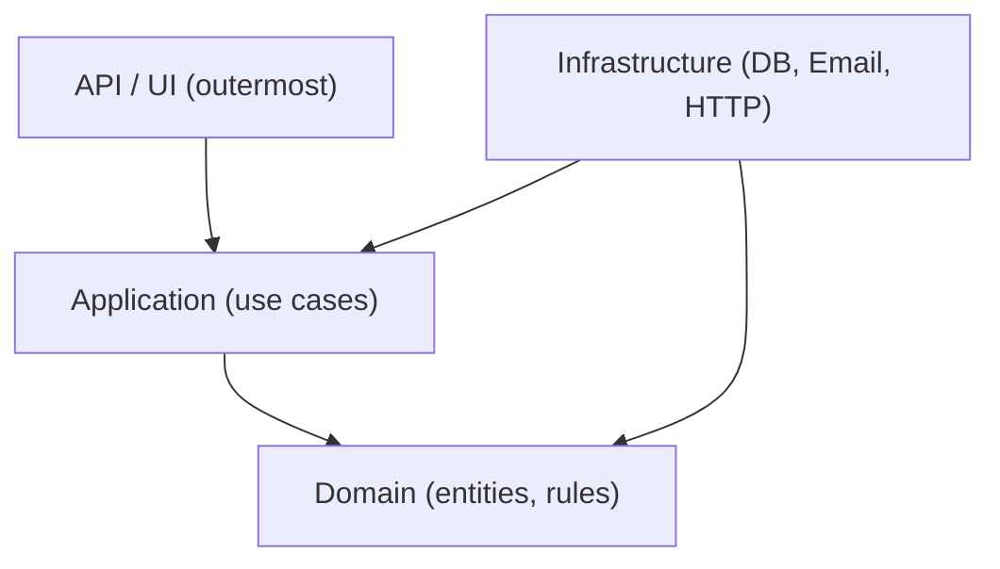
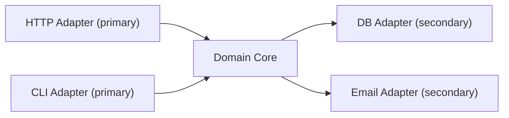

# 6. Architecture — Clean, Onion, Hexagonal & DDD

> **TL;DR:** All three modern architectures enforce the same dependency rule — domain code must not depend on infrastructure. DDD gives you the vocabulary to model complex domains precisely.

**Interview weight:** P0 — architecture round questions; every system design and LLD answer is stronger when framed with these models. DDD vocab (aggregate, bounded context, domain event) is expected at staff level.

---

## Architecture Styles — Comparison

| Aspect | Layered / N-Tier | Clean Architecture | Onion | Hexagonal (Ports & Adapters) |
|---|---|---|---|---|
| **Core metaphor** | Stack of layers | Concentric rings | Concentric rings | Hexagon with pluggable ports |
| **Dependency direction** | Top-down, UI→DB | Always inward | Always inward | Always toward domain core |
| **Domain depends on** | Business layer above DB layer | Nothing | Nothing | Nothing |
| **Infrastructure** | Inner layer (DB is central) | Outermost ring | Outermost ring | Adapters plug into ports |
| **Testability** | Low — DB is core | High — domain is pure | High | High — swap adapters |
| **Entry points** | HTTP Controller only | Multiple (HTTP, CLI, tests) | Multiple | Multiple — each port is an entry |
| **Term for DB/ext** | Data Access Layer | Infrastructure | Infrastructure | Secondary adapters |
| **Term for HTTP/CLI** | Presentation | API layer | API layer | Primary adapters |

### The Dependency Rule

> Source code dependencies must always point **inward** — toward higher-level policy.

- Outer layers know about inner layers; inner layers know *nothing* about outer layers.
- This is enforced physically by project references: `Infrastructure` references `Application`; `Application` references `Domain`; `Domain` references nothing.

---

## Architecture Diagrams

### Clean Architecture



### Hexagonal (Ports & Adapters)



---

## .NET Solution Structure

```
MyApp.sln
├── src/
│   ├── MyApp.Domain/             # Entities, value objects, domain events, interfaces owned by domain
│   ├── MyApp.Application/        # Use cases, commands, queries, DTOs, IRepository (interface)
│   ├── MyApp.Infrastructure/     # EF Core DbContext, repositories impl, email, HTTP clients
│   └── MyApp.API/                # Controllers, middleware, DI wiring, Program.cs
└── tests/
    ├── MyApp.Domain.Tests/
    ├── MyApp.Application.Tests/
    └── MyApp.Integration.Tests/
```

Project references:
- `Domain` → nothing
- `Application` → `Domain`
- `Infrastructure` → `Application`, `Domain`
- `API` → `Application`, `Infrastructure` (only for DI wiring)

---

## Where DTOs / Entities / Mappers Live

| Object | Layer | Notes |
|---|---|---|
| **Domain entity** | Domain | Has identity, invariants, methods. Never leaves Domain without mapping. |
| **Value object** | Domain | No identity, equality by value, immutable. `Money`, `Address`. |
| **DTO (request)** | Application | Input contract for use case. Flat, validated. |
| **DTO (response)** | Application | Output contract. Serialisation-friendly. |
| **EF entity (persistence model)** | Infrastructure | Can differ from domain entity. Mapped to/from domain in repo. |
| **Mapper** | Application (interface) / Infrastructure (impl) | AutoMapper profile or manual mapping method. |

---

## DDD Core Vocabulary

- **Ubiquitous language** — shared vocabulary between domain experts and developers; code uses the same terms as business conversations.
- **Bounded context** — explicit boundary within which a model is consistent; `Order` in Shipping context ≠ `Order` in Billing context.
- **Context mapping** — how bounded contexts relate: Shared Kernel, Customer/Supplier, Anti-Corruption Layer, Open Host Service, Conformist.

---

## Entities vs Value Objects

| Aspect | Entity | Value Object |
|---|---|---|
| **Identity** | Has a unique ID | No ID — equality by value |
| **Mutability** | Can change state | Immutable — return new instance |
| **Equality** | By ID | By all fields |
| **Example** | `Order`, `Customer`, `Product` | `Money`, `Address`, `Email`, `DateRange` |
| **C# type** | `class` with `Id` property | `record` or immutable `class` |

```csharp
public record Money(decimal Amount, string Currency)
{
    public Money Add(Money other)
    {
        if (Currency != other.Currency) throw new InvalidOperationException("Currency mismatch.");
        return new Money(Amount + other.Amount, Currency);
    }
}
```

---

## Aggregates & Aggregate Roots

- **Aggregate** — a cluster of domain objects treated as a single unit for data changes.
- **Aggregate root** — the entry point; the only object external code holds a reference to.
- **Invariant** — a business rule that must always be true within the aggregate.

**Rules:**
1. Only the aggregate root has a repository.
2. External objects hold only a reference to the aggregate root (by ID for other aggregates).
3. Changes to the aggregate are made through the root's methods — never directly to children.

```csharp
public class Order  // Aggregate Root
{
    public Guid Id { get; private set; }
    private readonly List<OrderLine> _lines = new();
    public IReadOnlyList<OrderLine> Lines => _lines.AsReadOnly();
    public OrderStatus Status { get; private set; } = OrderStatus.Pending;

    private readonly List<IDomainEvent> _events = new();
    public IReadOnlyList<IDomainEvent> DomainEvents => _events.AsReadOnly();

    public void AddLine(Guid productId, int qty, Money price)
    {
        if (Status != OrderStatus.Pending)
            throw new InvalidOperationException("Cannot modify a non-pending order.");
        if (qty <= 0) throw new ArgumentException("Quantity must be positive.");
        _lines.Add(new OrderLine(productId, qty, price));
    }

    public void Confirm()
    {
        if (!_lines.Any()) throw new InvalidOperationException("Cannot confirm an empty order.");
        Status = OrderStatus.Confirmed;
        _events.Add(new OrderConfirmedEvent(Id, DateTime.UtcNow));
    }

    public void ClearEvents() => _events.Clear();
}
```

---

## Domain Events

- Represent something significant that happened in the domain (past tense: `OrderConfirmedEvent`).
- Raised by aggregate; dispatched after save by the infrastructure/application layer.
- Decouple side effects (send email, update inventory) from the core operation.

```csharp
public record OrderConfirmedEvent(Guid OrderId, DateTime OccurredAt) : IDomainEvent;

// Dispatch after saving: Application layer
await _repository.SaveAsync(order, ct);
foreach (var evt in order.DomainEvents)
    await _publisher.Publish(evt, ct);
order.ClearEvents();
```

---

## Domain Services vs Application Services

| Aspect | Domain Service | Application Service |
|---|---|---|
| **Layer** | Domain | Application |
| **Contains** | Business logic that doesn't belong to a single entity | Use case orchestration |
| **Depends on** | Domain objects, other domain services | Domain, Repositories (via interface), external services |
| **Example** | `TransferService.Transfer(from, to, amount)` | `PlaceOrderUseCase.Execute(command)` |
| **Stateless?** | Yes | Yes |

---

## Repositories in DDD

- Repository abstracts persistence; lives as an **interface in Application layer**, implementation in Infrastructure.
- One repository per aggregate root.
- Returns fully constructed aggregates (not partial data).
- Does not expose IQueryable to Application — that leaks EF Core concern.

---

## Anemic vs Rich Domain Model

| Aspect | Anemic Domain Model | Rich Domain Model |
|---|---|---|
| **Domain classes** | Data bags (public getters/setters) | Behaviour + invariants encapsulated |
| **Business logic** | In service classes | In entities / value objects |
| **Invariant enforcement** | Scattered across services | Enforced at aggregate boundary |
| **Testability** | Service tests need full DI setup | Domain tests are pure unit tests |
| **Complexity** | Simple CRUD — fine | Complex domains — much safer |

---

## Tactical vs Strategic DDD

| | Tactical DDD | Strategic DDD |
|---|---|---|
| **Focus** | Building blocks (entities, aggregates, repos, services, events) | Bounded contexts, context maps, team topology |
| **Scale** | Single bounded context | Across multiple teams/services |
| **Output** | Clean domain model in code | Context map + anti-corruption layers |

---

## When DDD is Overkill

- Simple CRUD applications — just use a Repository + DTO + Controller.
- Data-processing pipelines with no business rules.
- Small microservices with 2–3 entities and no complex invariants.

**Rule:** Apply tactical DDD when you have complex business rules, multiple invariants, or rich domain expert involvement. Don't add aggregate roots and domain events to a user-registration CRUD service.

---

## Modular Monolith as Middle Ground

- One deployment, multiple logical modules (each with own `Domain`, `Application`, `Infrastructure` folders).
- Modules communicate only via well-defined public interfaces (not direct class references across modules).
- Easier to operate than microservices; maintains clean boundaries for future extraction.
- Use when team size doesn't justify microservices overhead; extract a module to a service only when you have a clear scaling or team-ownership reason.

---

## Screaming Architecture

> The architecture should scream the domain, not the framework.

- Top-level folders/namespaces: `Orders/`, `Payments/`, `Inventory/` — not `Controllers/`, `Services/`, `Repositories/`.
- A new developer opening the project immediately understands what the system does.

---

## Vertical Slice vs Clean Architecture

| Aspect | Vertical Slice | Clean Architecture |
|---|---|---|
| **Organise by** | Feature (each slice owns all layers) | Layer (Domain, Application, Infra, API) |
| **Coupling** | High within slice, low across slices | Low — dependency rule enforces it |
| **Finding code** | Open one folder for one feature | Layers spread across multiple projects |
| **Test isolation** | Slice tests are self-contained | Domain tests are pure; need integration for infra |
| **Best for** | Many independent features, few shared entities | Complex domain with many cross-cutting rules |
| **Scalability of codebase** | Grows horizontally (new slices) | Grows vertically (features touch all layers) |

---

## Interview Questions

**Q1. What is the dependency rule in Clean Architecture?**
A: Source code dependencies always point inward — toward higher-level policy. Outer circles (Infrastructure, API) depend on inner circles (Application, Domain). Domain depends on nothing. This means you can test the domain in total isolation.

**Q2. What is a bounded context and why does it matter?**
A: A bounded context is an explicit boundary within which a domain model is consistently defined. `Customer` in the CRM context (with marketing preferences) is a different model from `Customer` in the billing context (with payment methods). Trying to share one model leads to bloated, compromised objects. Contexts communicate via well-defined contracts (ACL, open host service).

**Q3. What is an aggregate root and what rules govern it?**
A: The aggregate root is the single entry point to a cluster of related objects. Rules: only the root has a repository; external code holds root references (by ID for others); all invariants are enforced through root methods; the root is the unit of consistency for a single transaction.

**Q4. Why should `IRepository` live in Application, not Infrastructure?**
A: The dependency rule: Application (high-level) defines what it needs (the interface); Infrastructure (low-level) provides it (the implementation). If the interface lives in Infrastructure, Application depends on Infrastructure — violating the dependency rule and making domain tests require an EF Core dependency.

**Q5. What is an anemic domain model and why is it considered a problem?**
A: An anemic model has data-bag classes with public setters; all logic is in services. Problem: invariants are not enforced — any service can put the entity in an invalid state. Logic gets duplicated across services. The domain is not self-documenting. A rich model enforces rules at the boundary, making invalid states unrepresentable.

**Q6. What is the difference between a domain event and an integration event?**
A: A domain event happens within a bounded context, in-process, often in the same transaction (`OrderConfirmedEvent`). An integration event crosses bounded contexts or services, published asynchronously on a message bus after the transaction commits (`OrderShippedIntegrationEvent`). Domain events are internal facts; integration events are public contracts.

**Q7. When is a domain service appropriate?**
A: When business logic requires multiple aggregates but doesn't naturally belong to any one of them. `TransferFundsService.Transfer(sourceAccount, targetAccount, amount)` — the logic involves two aggregates and there's no obvious "owner." It's also stateless, which distinguishes it from an application service (which orchestrates use cases and may coordinate repos and events).

**Q8. (Senior) How do you handle cross-aggregate business rules in DDD?**
A: Options: (1) Domain service that takes both aggregates as parameters — enforces rule synchronously. (2) Eventual consistency via domain events — aggregate A emits an event; aggregate B's handler enforces the rule asynchronously. Choose option 1 when the rule must be atomically consistent; option 2 when eventual consistency is acceptable (often it is).

**Q9. (Senior) How would you migrate from a layered architecture to Clean Architecture without big-bang rewrite?**
A: Strangler Fig approach: (1) Introduce interfaces for infrastructure dependencies in the existing service layer. (2) Move business logic into a new `Domain` project — no dependencies on anything. (3) Create `Application` layer — move orchestration logic, introduce commands/queries. (4) Redirect existing controllers to use the new application layer. (5) Replace infrastructure implementations one at a time. Each step is independently releasable.

**Q10. (Staff) What are the risks of applying DDD to a microservice that is simple CRUD?**
A: Over-engineering: aggregates, domain events, repositories, and value objects add code volume and cognitive overhead. For a 5-entity CRUD service, a simple anemic model with a DTO→Entity mapper and EF Core is more maintainable. Apply DDD only where the domain is complex enough that the model clarifies rather than complicates. The cost is: time to build, learning curve for team, and verbosity.

**Q11. (Staff) Vertical slice vs Clean Architecture — when do you pick which?**
A: Vertical slice: many independent features, small team, feature flags, each feature can evolve independently (e.g., content management, settings). Clean Architecture: complex domain with shared rules across features, many cross-cutting concerns, large team needing boundaries between layers. In practice, you can combine: vertical slices for the feature boundary + Clean Architecture within each slice.

---

## Quick Recap

- **Dependency rule:** domain depends on nothing; infra depends on application/domain — never reverse this.
- **Clean / Onion / Hexagonal** all enforce the same rule; differ only in terminology.
- **Bounded context:** explicit model boundary — `Order` means something different in each context.
- **Aggregate root:** unit of consistency; enforces invariants; only entry point for changes.
- **Domain events:** past-tense facts raised by aggregates; decouple side effects from the core operation.
- **Domain service:** stateless logic crossing multiple aggregates.
- **Anemic vs rich:** rich model enforces invariants; anemic scatters them across services.
- **Modular monolith:** one deploy, clean module boundaries — middle ground before microservices.
- **Screaming architecture:** top-level folders = domain, not framework.
