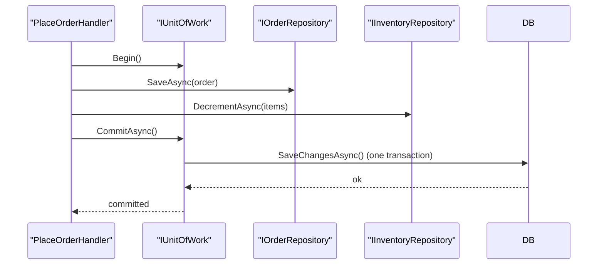

# 7. Repository, Unit of Work, CQRS & API Design

> **TL;DR:** Repository and UoW abstract persistence. CQRS with MediatR separates read and write concerns. Good API design is about contracts, not just endpoints.

**Interview weight:** P0 — appears in every LLD round involving persistence; CQRS / MediatR is a near-universal .NET application pattern; API design is assessed in system design rounds.

---

## Repository Pattern

**Intent:** Abstract persistence behind a collection-like interface; domain code never references a data store directly.

```csharp
// Interface lives in Application layer
public interface IOrderRepository
{
    Task<Order?> GetByIdAsync(Guid id, CancellationToken ct = default);
    Task<IReadOnlyList<Order>> GetByCustomerAsync(Guid customerId, CancellationToken ct = default);
    Task SaveAsync(Order order, CancellationToken ct = default);
    Task DeleteAsync(Guid id, CancellationToken ct = default);
}

// Implementation in Infrastructure
public class EfOrderRepository : IOrderRepository
{
    private readonly AppDbContext _db;
    public EfOrderRepository(AppDbContext db) => _db = db;

    public async Task<Order?> GetByIdAsync(Guid id, CancellationToken ct) =>
        await _db.Orders.Include(o => o.Lines).FirstOrDefaultAsync(o => o.Id == id, ct);

    public async Task SaveAsync(Order order, CancellationToken ct)
    {
        _db.Orders.Update(order);
        await _db.SaveChangesAsync(ct);
    }
}
```

### Generic vs Specific Repositories

| Aspect | Generic `IRepository<T>` | Specific `IOrderRepository` |
|---|---|---|
| **Code volume** | Low — one interface | Higher — one per aggregate |
| **Domain expressiveness** | Low — CRUD verbs only | High — `FindByCustomer`, `GetPendingOrders` |
| **ISP compliance** | Breaks ISP — exposes all CRUD to all callers | Compliant — only what's needed |
| **Query flexibility** | Caller builds all queries | Repository owns query logic |
| **Recommendation** | Only for very simple CRUD scaffolding | **Prefer** for domain-rich systems |

### The "EF Core DbContext is already a Repository + UoW" Argument

- `DbContext` IS a UoW — it tracks changes and commits them in one `SaveChangesAsync()`.
- `DbSet<T>` IS a repository — it provides collection-like access to entities.
- **Counter-argument:** Using `DbContext` directly in application/domain code couples the layer to EF Core. Repository adds a test seam (you can fake it without EF). The abstraction cost is low; the test benefit is high.
- **Pragmatic rule:** For small CRUD services, lean on DbContext directly. For domain-rich services with complex rules, add Repository + UoW interfaces.

---

## Unit of Work

**Intent:** Maintain a list of objects affected by a business transaction; coordinate writing out changes and resolving concurrency problems.



```csharp
public interface IUnitOfWork
{
    Task<int> CommitAsync(CancellationToken ct = default);
}

// EF Core DbContext implements IUnitOfWork
public class AppDbContext : DbContext, IUnitOfWork
{
    public Task<int> CommitAsync(CancellationToken ct) => SaveChangesAsync(ct);
}

// Handler
public class PlaceOrderHandler : IRequestHandler<PlaceOrderCommand, OrderResult>
{
    private readonly IOrderRepository _orders;
    private readonly IInventoryRepository _inventory;
    private readonly IUnitOfWork _uow;

    public async Task<OrderResult> Handle(PlaceOrderCommand cmd, CancellationToken ct)
    {
        var order = Order.Create(cmd.CustomerId, cmd.Items);
        await _orders.SaveAsync(order, ct);
        await _inventory.DecrementAsync(cmd.Items, ct);
        await _uow.CommitAsync(ct);    // one DB round trip
        return new OrderResult(order.Id);
    }
}
```

---

## Specification Pattern

```csharp
public abstract class Specification<T>
{
    public abstract Expression<Func<T, bool>> ToExpression();
    public bool IsSatisfiedBy(T entity) => ToExpression().Compile()(entity);

    public Specification<T> And(Specification<T> other) => new AndSpec<T>(this, other);
}

public class PendingOrdersSpec : Specification<Order>
{
    public override Expression<Func<Order, bool>> ToExpression() =>
        o => o.Status == OrderStatus.Pending;
}

// Usage in repository
var spec = new PendingOrdersSpec().And(new OrdersForCustomerSpec(customerId));
var orders = await _repo.FindAsync(spec, ct);
```

---

## CQRS with MediatR

**Command side (write):**
```csharp
public record PlaceOrderCommand(Guid CustomerId, List<OrderItemDto> Items)
    : IRequest<Result<OrderDto>>;

public class PlaceOrderValidator : AbstractValidator<PlaceOrderCommand>
{
    public PlaceOrderValidator()
    {
        RuleFor(c => c.CustomerId).NotEmpty();
        RuleFor(c => c.Items).NotEmpty();
    }
}

public class PlaceOrderHandler : IRequestHandler<PlaceOrderCommand, Result<OrderDto>>
{
    public async Task<Result<OrderDto>> Handle(PlaceOrderCommand cmd, CancellationToken ct)
    {
        var order = Order.Create(cmd.CustomerId, cmd.Items.Select(i => new OrderLine(i.ProductId, i.Qty)));
        await _repo.SaveAsync(order, ct);
        await _uow.CommitAsync(ct);
        return Result.Ok(OrderDto.From(order));
    }
}
```

**Query side (read):**
```csharp
public record GetOrderByIdQuery(Guid OrderId) : IRequest<OrderDto?>;

public class GetOrderByIdHandler : IRequestHandler<GetOrderByIdQuery, OrderDto?>
{
    private readonly IOrderReadModel _readModel;  // direct DB read, bypasses domain
    public async Task<OrderDto?> Handle(GetOrderByIdQuery q, CancellationToken ct) =>
        await _readModel.GetByIdAsync(q.OrderId, ct);
}
```

### MediatR Pipeline Behaviours

```csharp
// Validation behaviour (runs for all commands/queries with a validator)
public class ValidationBehaviour<TRequest, TResponse>
    : IPipelineBehavior<TRequest, TResponse>
    where TRequest : IRequest<TResponse>
{
    private readonly IEnumerable<IValidator<TRequest>> _validators;

    public async Task<TResponse> Handle(
        TRequest request, RequestHandlerDelegate<TResponse> next, CancellationToken ct)
    {
        var context = new ValidationContext<TRequest>(request);
        var failures = _validators
            .SelectMany(v => v.Validate(context).Errors)
            .Where(f => f != null).ToList();

        if (failures.Count != 0)
            throw new ValidationException(failures);

        return await next();
    }
}

// Registration
services.AddMediatR(cfg => cfg.RegisterServicesFromAssembly(typeof(Program).Assembly));
services.AddTransient(typeof(IPipelineBehavior<,>), typeof(ValidationBehaviour<,>));
services.AddTransient(typeof(IPipelineBehavior<,>), typeof(LoggingBehaviour<,>));
```

---

## Mapping — AutoMapper vs Manual vs Source Generators

| Aspect | AutoMapper | Manual mapping | Source generators (Mapperly) |
|---|---|---|---|
| **Setup** | Profile configuration | Write mapping methods | Attribute + generator |
| **Performance** | Reflection-based — slower on first use | Fastest | Near-manual (compile-time) |
| **Compile-time safety** | No | Yes | Yes |
| **Debuggability** | Hard — magic | Easy | Easy — generated code visible |
| **Complexity mapping** | Simple with conventions, hard with custom | Explicit | Attribute-driven but limited |
| **Recommendation** | Legacy projects / prototypes | **Prefer for domain mappings** | High-perf, greenfield |

---

## API Design at the LLD Level

### REST Resource Design vs RPC-Style

| Aspect | REST | gRPC / RPC-style |
|---|---|---|
| **URL** | Noun-based (`/orders/{id}`) | Action-based (`PlaceOrder`, `GetOrderById`) |
| **Verbs** | HTTP methods encode intent | Method name encodes intent |
| **Payload** | JSON / hypermedia | Protobuf (binary, compact) |
| **Discoverability** | OpenAPI / Swagger | `.proto` schema |
| **Browser-friendly** | Yes | No (requires grpc-web) |
| **Performance** | ~1–5 KB per request; HTTP/1.1 overhead | ~0.1–0.5 KB; HTTP/2 multiplexed |
| **Use when** | Public APIs, mobile clients, browser | Internal service-to-service, high-throughput |

### gRPC Contract Design

```protobuf
// orders.proto
service OrderService {
  rpc PlaceOrder (PlaceOrderRequest) returns (PlaceOrderResponse);
  rpc GetOrder (GetOrderRequest) returns (OrderResponse);
  rpc ListOrders (ListOrdersRequest) returns (stream OrderResponse);
}

message PlaceOrderRequest {
  string customer_id = 1;
  repeated OrderItem items = 2;
}
```

### DTO Versioning & Backward Compatibility

- **Never remove or rename fields** — use `[Obsolete]` and add new fields alongside.
- **URI versioning:** `/api/v2/orders` — simple, visible, duplicates routes.
- **Header versioning:** `API-Version: 2` — cleaner URLs, harder to test in browser.
- **Query param:** `?api-version=2` — Microsoft default for Azure APIs.
- Always version contracts, not implementations — a `V2OrderDto` can map to the same handler.

### Error Contracts

```csharp
// RFC 7807 Problem Details
{
  "type": "https://api.app.com/errors/order-not-found",
  "title": "Order not found",
  "status": 404,
  "detail": "Order 3fa85f64 was not found.",
  "traceId": "00-abc123..."
}
```

### Pagination Contracts

```json
// Cursor-based (preferred for large datasets)
{
  "data": [...],
  "nextCursor": "base64-encoded-cursor",
  "hasMore": true
}

// Offset-based (simpler, but inconsistent under inserts)
{
  "data": [...],
  "page": 2,
  "pageSize": 20,
  "totalCount": 1234
}
```

### Idempotent Endpoint Design

- `PUT` / `DELETE` are naturally idempotent — same result if called multiple times.
- `POST` must use an **idempotency key**: client sends `Idempotency-Key: uuid` header; server caches response for that key for 24 h.
- Idempotency key table: store `(key, response, expiry)` in Redis or DB; check before processing.

---

## Designing an SDK / Client Library

```csharp
// Fluent builder + options object pattern
var client = new OrdersClient.Builder()
    .WithBaseUrl("https://api.app.com")
    .WithApiKey(apiKey)
    .WithRetry(maxAttempts: 3, backoff: ExponentialBackoff.Default)
    .Build();

// Cancellation token on every method
var order = await client.GetOrderAsync(orderId, cancellationToken);

// Result type — no surprise exceptions for expected failures
Result<Order> result = await client.PlaceOrderAsync(request, ct);
if (result.IsSuccess) { ... }
else { HandleError(result.Error); }
```

- Every async method takes `CancellationToken`.
- Use `HttpClientFactory` internally — never `new HttpClient()`.
- Surface typed exceptions or `Result<T>` — never surface `HttpRequestException` directly.
- Provide a `Fake` / `InMemory` implementation for testing consumers.

---

## Designing for Testability

| Seam type | How to introduce | C# example |
|---|---|---|
| **Interface seam** | Extract interface; inject via constructor | `IOrderRepository` → `FakeOrderRepository` in tests |
| **Delegate seam** | Pass `Func<>` or `Action<>` | `Func<DateTime> clock = () => DateTime.UtcNow` |
| **Configuration seam** | `IOptions<T>` with test overrides | Inject `Options.Create(new MyOptions{...})` |
| **Abstract class seam** | Override virtual method in test subclass | Override `SendEmail` in `TestableOrderService` |

**Fakes vs Mocks:**
- **Fake** — working, in-memory implementation (e.g., `InMemoryOrderRepository`). Suitable for integration-style unit tests; more realistic.
- **Mock** — auto-generated test double that records calls (Moq, NSubstitute). Best for verifying interactions, not behaviour.
- Prefer fakes for repositories; mocks for notification/email/external API.

---

## Multithreading Design Considerations in LLD

### Identifying Shared Mutable State
- Any field read and written by more than one thread.
- Static fields, singleton services, in-memory caches, counters.

### Lock Granularity

| Approach | Use case | Trade-off |
|---|---|---|
| `lock (obj)` | Simple shared state | Simple; can cause contention |
| `ReaderWriterLockSlim` | Reads >> writes (cache) | More complex; better read throughput |
| `ConcurrentDictionary` | Thread-safe key-value | Built-in, low contention |
| `Interlocked` | Counters, flags | Lock-free, minimal overhead |
| `SemaphoreSlim` | Async concurrency limits | Async-aware throttle |
| `Channel<T>` | Producer-consumer pipeline | Non-blocking, backpressure |
| Immutability | Read-heavy objects | Zero contention; GC overhead |

### Thread-Safe Singleton / Cache

```csharp
private static readonly Lazy<ExpensiveResource> _resource =
    new(() => new ExpensiveResource(), LazyThreadSafetyMode.ExecutionAndPublication);
```

### Producer-Consumer with `Channel<T>`

```csharp
var channel = Channel.CreateBounded<WorkItem>(new BoundedChannelOptions(100)
{
    FullMode = BoundedChannelFullMode.Wait
});

// Producer
await channel.Writer.WriteAsync(item, ct);
channel.Writer.Complete();

// Consumer
await foreach (var item in channel.Reader.ReadAllAsync(ct))
    await ProcessAsync(item, ct);
```

### Thread-Safe Class Design Checklist

- [ ] Identify every mutable field — justify it or make it `readonly`.
- [ ] All public methods that mutate state: is there a lock or `Interlocked` call?
- [ ] No public mutable fields or auto-properties on shared objects.
- [ ] No `async void` methods — always `async Task`.
- [ ] `CancellationToken` accepted on all async operations.
- [ ] `IDisposable` properly implemented if holding lock resources.
- [ ] `ConfigureAwait(false)` on library code; `true` on UI / ASP.NET synchronisation context.
- [ ] All `ConcurrentDictionary.GetOrAdd` factories are idempotent (may run multiple times).

---

## Interview Questions

**Q1. What is the difference between Repository and Unit of Work?**
A: Repository abstracts a collection of aggregates (CRUD per type). Unit of Work groups multiple repository operations into one atomic transaction — it tracks all changes and flushes them together in one `CommitAsync()`. EF Core `DbContext` is both: `DbSet<T>` is the repository; `SaveChangesAsync` is the UoW commit.

**Q2. Why add a Repository interface if EF Core is already an abstraction over SQL?**
A: Test seam: you can replace `EfOrderRepository` with `InMemoryOrderRepository` in unit tests without spinning up a DB. Dependency rule: Application layer should not reference EF Core packages. Clean contract: repository hides query complexity (LINQ, Includes) from handlers.

**Q3. What is a CQRS pipeline behaviour?**
A: `IPipelineBehavior<TRequest, TResponse>` wraps a handler — each behaviour calls `next()`. It's the Chain of Responsibility pattern. Common uses: validation (reject before handler runs), logging (log request/response), retry (call next up to N times), distributed tracing.

**Q4. When should you separate the read model from the write model in CQRS?**
A: When read queries are complex (multiple joins, aggregated data) and wrapping them in domain objects adds overhead. Read models can be flat DTOs read directly from optimised views or a separate read store (Redis, Elasticsearch). Don't separate by default — add complexity only when queries become a bottleneck or when read and write scaling needs differ.

**Q5. What's the idempotency key pattern and when do you need it?**
A: Client sends a unique `Idempotency-Key` header with each request. Server stores `(key → response)` in a cache/DB. If the same key arrives again (network retry), server returns the cached response without reprocessing. Required for any non-idempotent POST (payment, order placement). TTL: typically 24 h.

**Q6. When would you use cursor-based pagination over offset pagination?**
A: Cursor-based is stable under inserts/deletes during pagination — the cursor encodes the last seen position (e.g., a timestamp or ID). Offset-based (`SKIP n TAKE m`) shifts under concurrent inserts — rows appear twice or get skipped. Use cursor pagination for any API with frequent writes to the paginated collection.

**Q7. What is the Specification pattern and when is it useful?**
A: A Specification encapsulates a query predicate as an object. Combine multiple specs with `And/Or/Not` without coupling callers to query syntax. Useful when the same predicates are reused in multiple queries. With EF Core, specs compose as `Expression<Func<T,bool>>` which translates to SQL.

**Q8. (Senior) How do you design an SDK for a rate-limited API?**
A: (1) Wrap `HttpClient` with a `Polly` retry policy with exponential backoff + jitter. (2) Respect `Retry-After` header in 429 responses. (3) Add a client-side rate limiter (`SemaphoreSlim`) to avoid hammering the endpoint. (4) Expose `CancellationToken` on every method. (5) Provide an `IOrdersClient` interface so consumers can inject a fake in tests. (6) Surface `RateLimitExceededException` typed exception, not raw `HttpRequestException`.

**Q9. (Senior) How would you handle backward-compatible changes to a REST API consumed by a mobile app that cannot be force-updated?**
A: (1) Never remove or rename existing fields — add new fields only. (2) If a breaking change is unavoidable, introduce `/v2/` route. (3) Support at least two versions simultaneously; deprecate v1 with a sunset header (`Sunset: 2026-01-01`). (4) Use feature flags to roll out breaking changes server-side before deprecating. (5) Validate all response shapes in contract tests (Pact or snapshot tests) so a breaking change fails CI.

**Q10. (Senior) What are the trade-offs of Generic Repository vs Specific Repository?**
A: Generic: less code, but leaks domain queries into callers (who must build predicates outside the repo) and breaks ISP (every caller gets all CRUD methods). Specific: more code, but hides query complexity, enforces ISP, and provides a domain-expressive API. At scale: generic repos lead to query logic scattered across handlers; specific repos centralise it.

**Q11. (Staff) You have a high-read, low-write aggregate. How would you design the read and write paths in CQRS?**
A: Write path: command → handler → rich domain aggregate → save via `IOrderRepository` → dispatch domain events. Read path: query → handler → `IOrderReadModel` → direct SQL/view/Redis cache read → return DTO. Separate `IOrderReadModel` from `IOrderRepository` allows the read model to be: a DB view, a Redis cache, a denormalised Cosmos document, or an Elasticsearch index — independently scaled, independently invalidated.

---

## Quick Recap

- **Repository:** collection-like interface in Application; EF implementation in Infrastructure; one per aggregate.
- **Unit of Work:** groups multiple repo operations into one atomic commit; EF `DbContext` is one.
- **Generic repo** — less code but leaks query logic; **specific repo** — preferred for domain-rich systems.
- **CQRS:** commands mutate state; queries return data; separated so each can be optimised independently.
- **Pipeline behaviour:** `IPipelineBehavior<TRequest, TResponse>` = CoR on MediatR handlers (validation, logging, retry).
- **Idempotency key:** store `(key → response)` for 24 h; required for all non-idempotent POSTs.
- **Cursor pagination** is stable under concurrent writes; offset pagination is not.
- **Thread-safe design:** identify shared mutable state → `ReaderWriterLockSlim`, `ConcurrentDictionary`, `Interlocked`, or `Channel<T>` as appropriate.
- Always accept `CancellationToken`; never `.Result` or `.Wait()` in async code.
