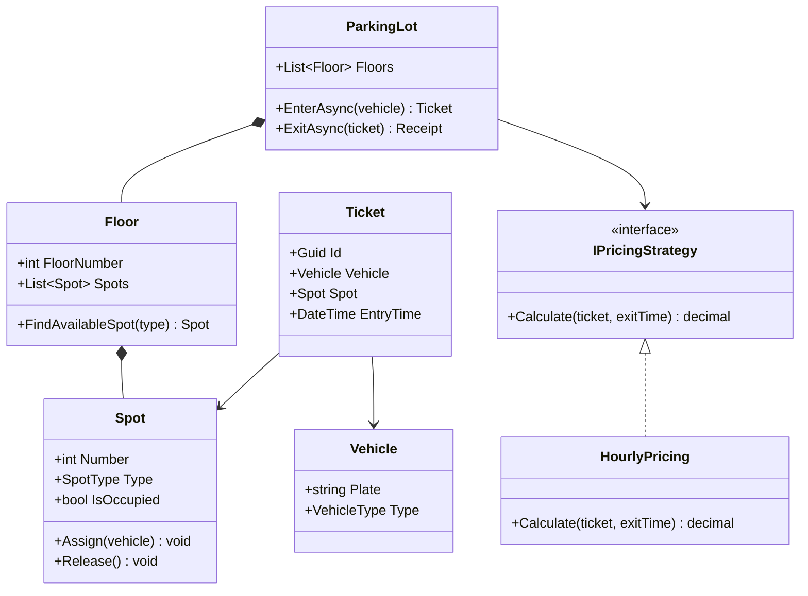
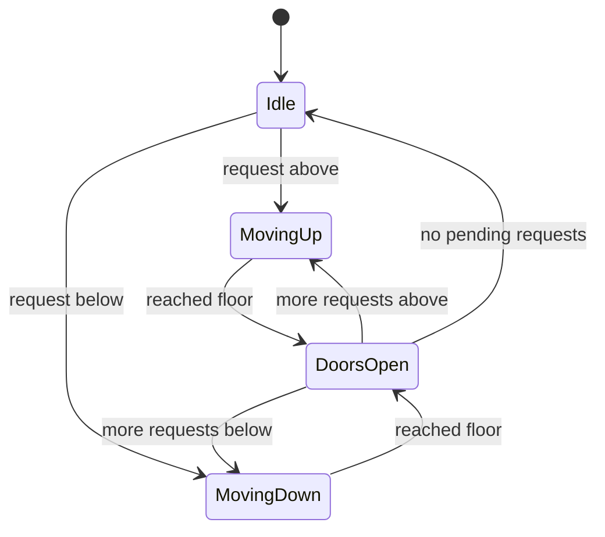
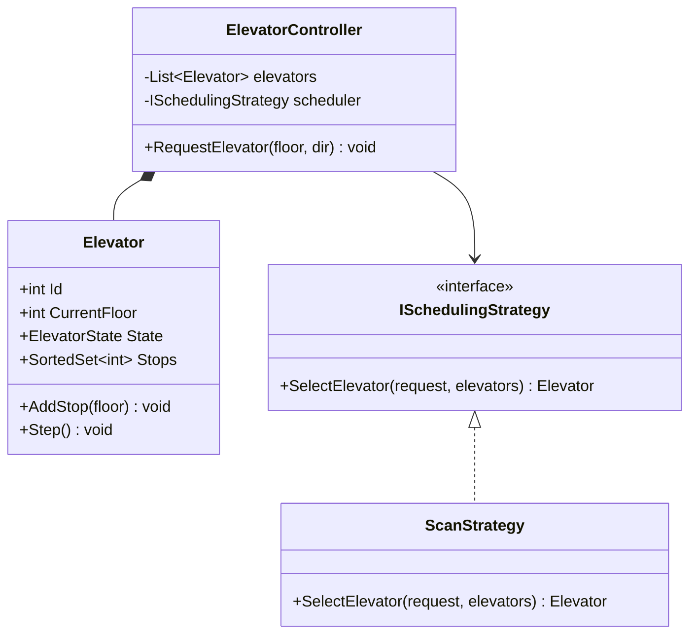
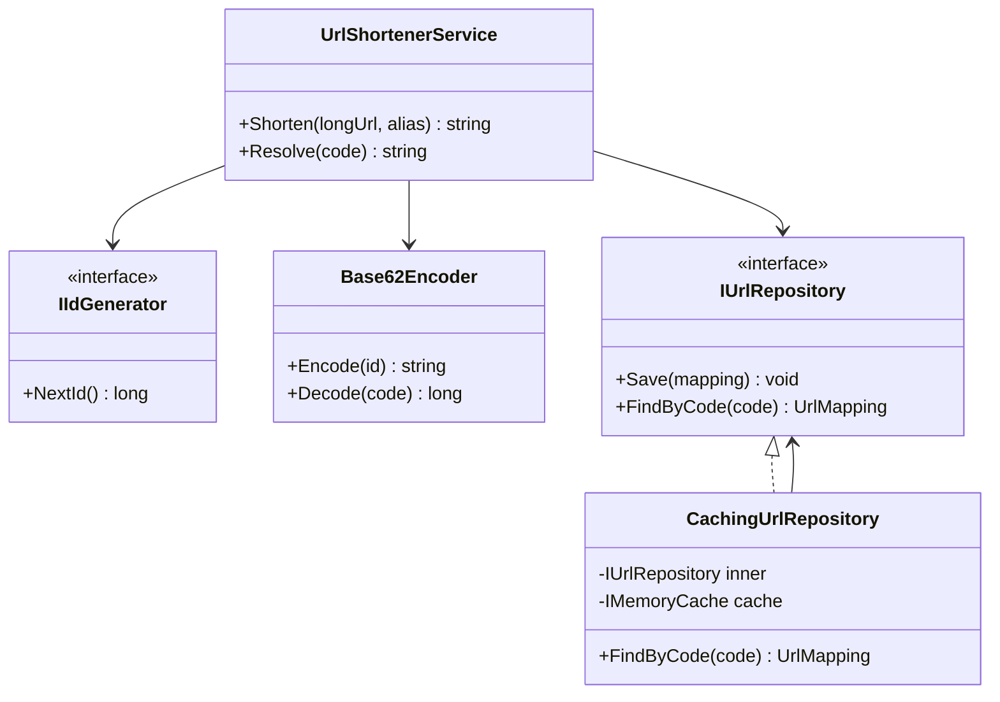
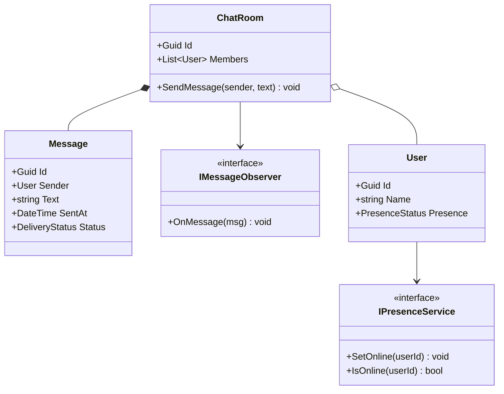
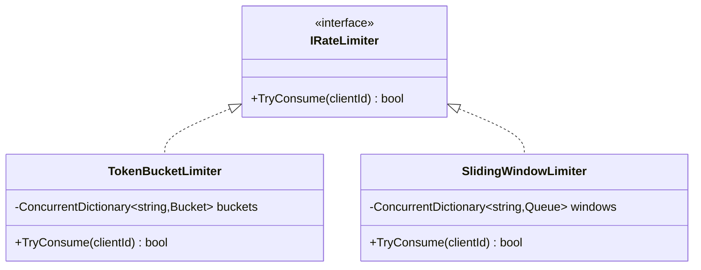
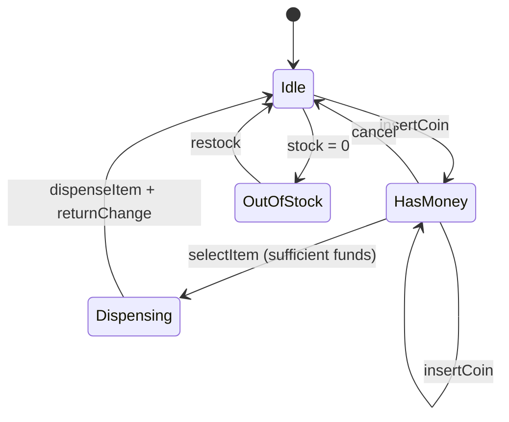

# 8. LLD Case Studies

> **TL;DR:** Eight full designs covering the most common machine-coding and LLD interview problems. Each is a template you can reproduce in 45 minutes under pressure.

**Interview weight:** P0 — machine coding rounds (Parking Lot, KV Store, Rate Limiter) are direct assignments; Elevator and Vending Machine are classic LLD state-machine questions.

---

## (a) Parking Lot

### Requirements
- Multiple floors, multiple spot types (Compact, Large, Handicapped, Motorcycle).
- Vehicle enters at entry gate, gets a ticket, parks. Vehicle exits at exit gate, pays, barrier lifts.
- Pricing: per-hour, per-type.
- Concurrent entries/exits.

### Core Classes



### Key C# Code

```csharp
public class ParkingLot
{
    private readonly List<Floor> _floors;
    private readonly IPricingStrategy _pricing;
    private readonly SemaphoreSlim _lock = new(1, 1);

    public async Task<Ticket> EnterAsync(Vehicle vehicle, CancellationToken ct = default)
    {
        await _lock.WaitAsync(ct);
        try
        {
            var spotType = SpotTypeFor(vehicle.Type);
            var spot = _floors.SelectMany(f => f.Spots)
                              .FirstOrDefault(s => s.Type == spotType && !s.IsOccupied)
                   ?? throw new NoSpotAvailableException(vehicle.Type);
            spot.Assign(vehicle);
            return new Ticket(Guid.NewGuid(), vehicle, spot, DateTime.UtcNow);
        }
        finally { _lock.Release(); }
    }

    public Receipt Exit(Ticket ticket)
    {
        var fee = _pricing.Calculate(ticket, DateTime.UtcNow);
        ticket.Spot.Release();
        return new Receipt(ticket, fee, DateTime.UtcNow);
    }

    private static SpotType SpotTypeFor(VehicleType t) => t switch
    {
        VehicleType.Motorcycle => SpotType.Motorcycle,
        VehicleType.Car => SpotType.Compact,
        VehicleType.Truck => SpotType.Large,
        _ => throw new ArgumentOutOfRangeException()
    };
}
```

### Extension Points
- New `IPricingStrategy` (weekend pricing, monthly pass) — no core change.
- New `VehicleType` — extend `SpotTypeFor` and add `Spot` type enum value.
- Multi-gate parallel entry — `SemaphoreSlim` already handles it; scale to `ConcurrentDictionary` per floor for finer granularity.

### Concurrency
- `SemaphoreSlim(1,1)` ensures only one spot-assignment decision at a time. Alternative: lock per floor for higher throughput.
- `Spot.IsOccupied` is set under the lock — no double-assignment.

### Interview Follow-ups
- Upgrade to reserved spots? → Add `Reserve(Guid vehicleId)` method on `Spot`; filter in `FindAvailableSpot`.
- Support multiple lots across a city? → Add `ParkingLotRegistry` aggregate; promote to a distributed system HLD.
- Count available spots per type without iterating all? → Maintain `ConcurrentDictionary<SpotType, int>` counters.

---

## (b) Elevator System

### Requirements
- N elevators, M floors. Requests: press hall button (floor, direction) or cabin button (target floor).
- Elevator scheduling strategy (SCAN / LOOK).
- State machine per elevator: `Idle`, `MovingUp`, `MovingDown`, `DoorsOpen`.

### State Machine



### Core Classes



### Key C# Code

```csharp
public class Elevator
{
    public int Id { get; }
    public int CurrentFloor { get; private set; }
    public ElevatorState State { get; private set; } = ElevatorState.Idle;
    private readonly SortedSet<int> _stops = new();

    public void AddStop(int floor) => _stops.Add(floor);

    public void Step()  // called on a timer tick
    {
        if (!_stops.Any()) { State = ElevatorState.Idle; return; }

        int next = State == ElevatorState.MovingDown
            ? _stops.Max(s => s < CurrentFloor ? s : int.MinValue)
            : _stops.Min(s => s > CurrentFloor ? s : int.MaxValue);

        if (next == CurrentFloor || next == int.MinValue || next == int.MaxValue)
        { State = ElevatorState.DoorsOpen; _stops.Remove(CurrentFloor); return; }

        State = next > CurrentFloor ? ElevatorState.MovingUp : ElevatorState.MovingDown;
        CurrentFloor += State == ElevatorState.MovingUp ? 1 : -1;
    }
}

public class ScanStrategy : ISchedulingStrategy
{
    public Elevator SelectElevator(HallRequest req, IReadOnlyList<Elevator> elevators)
    {
        return elevators
            .OrderBy(e => Math.Abs(e.CurrentFloor - req.Floor))
            .ThenBy(e => e.State == ElevatorState.Idle ? 0 : 1)
            .First();
    }
}
```

### Interview Follow-ups
- VIP floors? → Priority queue per elevator; VIP requests jump the queue.
- Emergency mode? → All elevators return to ground; new state `EmergencyReturn`.
- Energy savings? → Park elevators at highest-demand floors during off-peak (strategy variation).

---

## (c) URL Shortener LLD

### Requirements
- Encode a long URL → short code (6–8 chars). Decode short code → redirect to long URL. Custom aliases. Analytics (click count).

### Core Classes



### Key C# Code

```csharp
public class Base62Encoder
{
    private const string Chars = "0123456789ABCDEFGHIJKLMNOPQRSTUVWXYZabcdefghijklmnopqrstuvwxyz";

    public string Encode(long id)
    {
        var sb = new StringBuilder();
        while (id > 0) { sb.Insert(0, Chars[(int)(id % 62)]); id /= 62; }
        return sb.ToString().PadLeft(6, '0');
    }
}

public class UrlShortenerService
{
    public string Shorten(string longUrl, string? alias = null)
    {
        var code = alias ?? _encoder.Encode(_idGen.NextId());
        if (_repo.FindByCode(code) != null) throw new ConflictException($"Code '{code}' already taken.");
        _repo.Save(new UrlMapping(code, longUrl, DateTime.UtcNow));
        return code;
    }

    public string Resolve(string code)
    {
        var mapping = _repo.FindByCode(code) ?? throw new NotFoundException(code);
        _analytics.RecordClick(code);
        return mapping.LongUrl;
    }
}
```

### Extension Points
- Custom expiry → add `ExpiresAt` to `UrlMapping`; check in `Resolve`.
- Analytics → Decorator on `IUrlRepository` or domain event `UrlClickedEvent`.
- Distributed ID generation → snowflake algorithm in `SnowflakeIdGenerator : IIdGenerator`.

---

## (d) Chat System LLD

### Requirements
- Users, rooms (group + direct). Send message. Receive messages. Online presence. Message history.

### Core Classes



### Key C# Code

```csharp
public class ChatRoom
{
    private readonly List<IMessageObserver> _observers = new();
    private readonly List<Message> _history = new();

    public void Subscribe(IMessageObserver obs) => _observers.Add(obs);

    public void SendMessage(User sender, string text)
    {
        if (!_members.Contains(sender)) throw new InvalidOperationException("Not a member.");
        var msg = new Message(Guid.NewGuid(), sender, text, DateTime.UtcNow);
        _history.Add(msg);
        foreach (var obs in _observers) obs.OnMessage(msg);
    }

    public IReadOnlyList<Message> GetHistory(int last = 50) =>
        _history.TakeLast(last).ToList().AsReadOnly();
}
```

### Extension Points
- Delivery receipts → message state machine (Sent → Delivered → Read).
- Push notifications → `PushNotificationObserver : IMessageObserver`.
- Persistence → `PersistingObserver` saves to `IMessageRepository`.

---

## (e) In-Memory Key-Value Store with TTL (Full Code — Common Machine-Coding Task)

### Requirements
- `Set(key, value, ttl)`, `Get(key) → value or null`, `Delete(key)`. TTL-based expiry. LRU eviction when capacity exceeded. Thread-safe.

```csharp
public class TtlCache<TKey, TValue> where TKey : notnull
{
    private readonly int _capacity;
    private readonly Dictionary<TKey, LinkedListNode<CacheEntry>> _map;
    private readonly LinkedList<CacheEntry> _lruList;
    private readonly Timer _sweepTimer;
    private readonly object _lock = new();

    public TtlCache(int capacity, TimeSpan? sweepInterval = null)
    {
        _capacity = capacity;
        _map = new Dictionary<TKey, LinkedListNode<CacheEntry>>(capacity);
        _lruList = new LinkedList<CacheEntry>();
        _sweepTimer = new Timer(_ => Sweep(), null,
            sweepInterval ?? TimeSpan.FromSeconds(30),
            sweepInterval ?? TimeSpan.FromSeconds(30));
    }

    public void Set(TKey key, TValue value, TimeSpan ttl)
    {
        lock (_lock)
        {
            if (_map.TryGetValue(key, out var existing))
            {
                _lruList.Remove(existing);
                _map.Remove(key);
            }
            else if (_map.Count >= _capacity)
            {
                var lru = _lruList.Last!;
                _map.Remove(lru.Value.Key);
                _lruList.RemoveLast();
            }

            var entry = new CacheEntry(key, value, DateTime.UtcNow + ttl);
            var node = _lruList.AddFirst(entry);
            _map[key] = node;
        }
    }

    public TValue? Get(TKey key)
    {
        lock (_lock)
        {
            if (!_map.TryGetValue(key, out var node)) return default;
            if (node.Value.ExpiresAt <= DateTime.UtcNow)
            {
                _lruList.Remove(node);
                _map.Remove(key);
                return default;
            }
            _lruList.Remove(node);
            _lruList.AddFirst(node);
            return node.Value.Value;
        }
    }

    public bool Delete(TKey key)
    {
        lock (_lock)
        {
            if (!_map.TryGetValue(key, out var node)) return false;
            _lruList.Remove(node);
            _map.Remove(key);
            return true;
        }
    }

    private void Sweep()
    {
        lock (_lock)
        {
            var now = DateTime.UtcNow;
            var toRemove = _map.Where(kvp => kvp.Value.Value.ExpiresAt <= now)
                               .Select(kvp => kvp.Key).ToList();
            foreach (var key in toRemove)
            {
                _lruList.Remove(_map[key]);
                _map.Remove(key);
            }
        }
    }

    private record CacheEntry(TKey Key, TValue Value, DateTime ExpiresAt);
}
```

### Complexity
- `Get`: O(1) average; O(1) LRU move (doubly-linked list).
- `Set`: O(1).
- `Sweep`: O(n) per sweep — amortised OK with infrequent sweeps.

### Extension Points
- Async API → replace `lock` with `SemaphoreSlim` and expose `GetAsync`/`SetAsync`.
- LFU eviction → replace `LinkedList` with a frequency-bucketed structure.
- Distributed → replace in-memory with Redis; same interface.

---

## (f) Rate Limiter LLD

### Requirements
- Allow N requests per window per client. Two algorithms: Token Bucket (burst-friendly), Sliding Window (precise).



```csharp
public class TokenBucketLimiter : IRateLimiter
{
    private readonly int _capacity;
    private readonly double _refillPerSecond;
    private readonly ConcurrentDictionary<string, Bucket> _buckets = new();

    public bool TryConsume(string clientId)
    {
        var bucket = _buckets.GetOrAdd(clientId, _ => new Bucket(_capacity));
        lock (bucket)
        {
            bucket.Refill(_refillPerSecond);
            if (bucket.Tokens < 1) return false;
            bucket.Tokens--;
            return true;
        }
    }

    private class Bucket
    {
        public double Tokens;
        private DateTime _lastRefill = DateTime.UtcNow;

        public Bucket(int capacity) => Tokens = capacity;

        public void Refill(double rate)
        {
            var elapsed = (DateTime.UtcNow - _lastRefill).TotalSeconds;
            Tokens = Math.Min(Tokens + elapsed * rate, /* capacity */ 100);
            _lastRefill = DateTime.UtcNow;
        }
    }
}

public class SlidingWindowLimiter : IRateLimiter
{
    private readonly int _limit;
    private readonly TimeSpan _window;
    private readonly ConcurrentDictionary<string, Queue<DateTime>> _requests = new();

    public bool TryConsume(string clientId)
    {
        var queue = _requests.GetOrAdd(clientId, _ => new Queue<DateTime>());
        lock (queue)
        {
            var cutoff = DateTime.UtcNow - _window;
            while (queue.Count > 0 && queue.Peek() < cutoff) queue.Dequeue();
            if (queue.Count >= _limit) return false;
            queue.Enqueue(DateTime.UtcNow);
            return true;
        }
    }
}
```

### Extension Points
- `FixedWindowLimiter` → same interface, simpler counter.
- Distributed rate limiting → replace `ConcurrentDictionary` with Redis `INCR` + `EXPIRE`.
- Per-endpoint limits → pass `(clientId, endpoint)` tuple as key.

---

## (g) Splitwise / Expense Sharing

### Requirements
- Users, groups, expenses. Split expense equally or by custom percentage. Calculate who owes whom. Simplify settlements.

```csharp
public class ExpenseGroup
{
    private readonly Dictionary<Guid, User> _members = new();
    private readonly List<Expense> _expenses = new();

    public void AddExpense(User paidBy, decimal amount, IEnumerable<User> splitAmong,
                           SplitStrategy strategy = SplitStrategy.Equal)
    {
        var splits = strategy == SplitStrategy.Equal
            ? splitAmong.ToDictionary(u => u.Id, _ => amount / splitAmong.Count())
            : throw new NotImplementedException("Custom splits not shown for brevity");
        _expenses.Add(new Expense(paidBy, amount, splits));
    }

    public Dictionary<Guid, decimal> CalculateBalances()
    {
        var balances = _members.Keys.ToDictionary(id => id, _ => 0m);
        foreach (var e in _expenses)
        {
            balances[e.PaidBy.Id] += e.Amount;
            foreach (var (userId, share) in e.Splits)
                balances[userId] -= share;
        }
        return balances;
    }

    // Simplify: greedy min-transactions settlement
    public List<Settlement> Simplify()
    {
        var balances = CalculateBalances();
        var creditors = new PriorityQueue<(Guid Id, decimal Amt), decimal>();
        var debtors   = new PriorityQueue<(Guid Id, decimal Amt), decimal>();

        foreach (var (id, bal) in balances)
        {
            if (bal > 0) creditors.Enqueue((id, bal), -bal);   // max-heap trick
            else if (bal < 0) debtors.Enqueue((id, -bal), -(-bal));
        }

        var settlements = new List<Settlement>();
        while (creditors.Count > 0 && debtors.Count > 0)
        {
            var (cId, cAmt) = creditors.Dequeue();
            var (dId, dAmt) = debtors.Dequeue();
            var transfer = Math.Min(cAmt, dAmt);
            settlements.Add(new Settlement(dId, cId, transfer));
            if (cAmt - transfer > 0.01m) creditors.Enqueue((cId, cAmt - transfer), -(cAmt - transfer));
            if (dAmt - transfer > 0.01m) debtors.Enqueue((dId, dAmt - transfer), -(dAmt - transfer));
        }
        return settlements;
    }
}
```

### Extension Points
- Multiple currencies → `Money` value object with conversion.
- Recurring expenses → `RecurringExpense` with `IScheduler`.
- Multi-group → user can be in multiple groups; balances summed across groups.

---

## (h) Vending Machine / ATM (State Pattern)

### Requirements
- Vending Machine: states — Idle, HasMoney, Dispensing, OutOfStock. Transitions on: insertCoin, selectItem, dispense, returnChange.



```csharp
public interface IVendingState
{
    void InsertCoin(VendingMachine vm, decimal amount);
    void SelectItem(VendingMachine vm, string itemId);
    void Cancel(VendingMachine vm);
    void Dispense(VendingMachine vm);
}

public class IdleState : IVendingState
{
    public void InsertCoin(VendingMachine vm, decimal amount)
    {
        vm.Balance += amount;
        vm.TransitionTo(new HasMoneyState());
    }
    public void SelectItem(VendingMachine vm, string itemId) =>
        Console.WriteLine("Insert coin first.");
    public void Cancel(VendingMachine vm) { }
    public void Dispense(VendingMachine vm) { }
}

public class HasMoneyState : IVendingState
{
    public void InsertCoin(VendingMachine vm, decimal amount) => vm.Balance += amount;

    public void SelectItem(VendingMachine vm, string itemId)
    {
        var item = vm.Inventory.Get(itemId) ?? throw new ItemNotFoundException(itemId);
        if (vm.Balance < item.Price) { Console.WriteLine("Insufficient funds."); return; }
        vm.SelectedItem = item;
        vm.TransitionTo(new DispensingState());
        vm.Dispense();
    }

    public void Cancel(VendingMachine vm)
    {
        Console.WriteLine($"Returning ${vm.Balance}");
        vm.Balance = 0;
        vm.TransitionTo(new IdleState());
    }

    public void Dispense(VendingMachine vm) { }
}

public class DispensingState : IVendingState
{
    public void InsertCoin(VendingMachine vm, decimal amount) =>
        Console.WriteLine("Dispensing in progress.");
    public void SelectItem(VendingMachine vm, string itemId) { }
    public void Cancel(VendingMachine vm) { }
    public void Dispense(VendingMachine vm)
    {
        vm.Inventory.Decrement(vm.SelectedItem!.Id);
        var change = vm.Balance - vm.SelectedItem.Price;
        Console.WriteLine($"Dispensed {vm.SelectedItem.Name}. Change: ${change}");
        vm.Balance = 0;
        vm.TransitionTo(vm.Inventory.IsEmpty ? new OutOfStockState() : new IdleState());
    }
}
```

---

## Pattern Map — Case Study Cross-Reference

| Case Study | Patterns Exercised |
|---|---|
| **Parking Lot** | Strategy (pricing), Factory (spot creation), Template Method (gate process), Singleton (lot instance) |
| **Elevator System** | State (elevator lifecycle), Strategy (scheduling), Observer (arrival notification), Command (request) |
| **URL Shortener** | Strategy (encoding), Decorator (caching repo), Factory (ID generator), Proxy (caching) |
| **Chat System** | Observer (message delivery), Repository (message history), Facade (ChatService) |
| **KV Store with TTL** | Null Object (miss), Iterator (sweep), Proxy (TTL check in Get) |
| **Rate Limiter** | Strategy (token bucket vs sliding window), Decorator (rate-limit middleware) |
| **Splitwise** | Strategy (split calculation), Template Method (expense flow) |
| **Vending Machine / ATM** | State (state machine), Strategy (pricing), Command (transaction) |

---

## Interview Questions

**Q1. In the Parking Lot, how do you prevent two vehicles being assigned the same spot?**
A: Use a `SemaphoreSlim(1,1)` around the find-and-assign operation. This serialises spot assignment. For higher throughput, lock per floor rather than the whole lot. Alternatively, use `Interlocked.CompareExchange` on a spot's occupied flag for lock-free assignment.

**Q2. How does the Elevator state machine prevent invalid transitions?**
A: Each state implements `IElevatorState` and throws `InvalidOperationException` for disallowed transitions (e.g., `OpenDoors` when already `Idle` with no stop). The `Elevator` class delegates to the current state — no switch statements.

**Q3. In the KV Store, why use a `LinkedList` + `Dictionary` for LRU instead of `OrderedDictionary`?**
A: `LinkedList` gives O(1) move-to-front and O(1) remove-tail. `Dictionary` gives O(1) lookup of the node pointer. `OrderedDictionary` has O(n) reorder. This combination is the canonical O(1) LRU design.

**Q4. How would you make the Rate Limiter distributed (work across multiple instances)?**
A: Replace the in-memory `ConcurrentDictionary<clientId, Bucket>` with Redis. For Token Bucket: use a Lua script to atomically read tokens, compute refill, and decrement. For Sliding Window: use a Redis sorted set with `ZADD` + `ZREMRANGEBYSCORE` + `ZCARD` — all in one atomic Lua script. Redis `INCR` + `EXPIRE` is sufficient for Fixed Window.

**Q5. In the URL Shortener, what happens on ID generator collision?**
A: A `SnowflakeIdGenerator` (worker ID + timestamp + sequence) guarantees uniqueness within a single process. For distributed generators: Zookeeper-assigned worker IDs or a pre-allocated ID range per instance. Custom aliases can still collide — check on save, return `409 Conflict`.

**Q6. How does the Vending Machine handle a dispense failure mid-transition?**
A: `DispensingState.Dispense()` should be wrapped in try/catch. On failure, transition back to `HasMoneyState` (item still in inventory, money retained). Log the error. If it's a hardware failure, transition to a new `MaintenanceState`. This is a common follow-up — have a `MaintenanceState` ready.

**Q7. In the Chat System, how do you prevent the Observer from blocking the sender on a slow receiver?**
A: Decouple via a `Channel<Message>` per user. `SendMessage` writes to the channel (non-blocking). Each user's `ConnectionHandler` reads from the channel and pushes to the WebSocket. This is the producer-consumer pattern — sender never waits for delivery.

**Q8. (Senior) How would you scale the Parking Lot design to a distributed multi-building lot system?**
A: Add a `LotService` aggregate (per building). Central `ParkingHub` federates availability queries. Spot reservation via optimistic concurrency (version field on `Spot` row + `WHERE version = ?` UPDATE). Cache available-count per spot-type per building in Redis with TTL. Entry barrier checks Redis before DB for speed.

**Q9. (Senior) In the Splitwise simplification algorithm, what is the time complexity?**
A: O(n log n) — balance calculation is O(n·m) where m = expenses; simplification is priority queue operations O(n log n). The greedy approach minimises the number of transactions but is not guaranteed to be optimal in all cases (NP-hard in general). The greedy approximation is acceptable at interview.

**Q10. (Senior) How would you add undo to the Vending Machine?**
A: Command pattern: each transition (`InsertCoin`, `SelectItem`) is a `Command` with `Execute` and `Undo`. A `History` stack holds executed commands. `Cancel` triggers `Undo` on all commands in the current session — this restores balance and state. For production, also persist the command log for audit.

**Q11. (Staff) In the KV Store, what's the trade-off between eager TTL expiry (check on every Get) vs lazy sweeping?**
A: Eager (check on Get): keys are expired exactly on access — no stale reads; expired keys accumulate in memory until accessed. Lazy sweep: periodic timer frees memory proactively but adds sweep cost and a small window of stale data. Hybrid (what Redis uses): eager on access + periodic sweep. For an interview: implement eager in `Get` + a timer-based sweep, and call out the trade-off.

---

## Quick Recap

- **Parking Lot:** Strategy for pricing; `SemaphoreSlim` for concurrent spot allocation.
- **Elevator:** State machine per elevator; Strategy for scheduling (SCAN); `SortedSet<int>` for stop queue.
- **URL Shortener:** Base62 encoder; `IIdGenerator` abstraction; caching Proxy/Decorator over repository.
- **Chat:** Observer for delivery; `Channel<T>` to decouple sender from slow receivers.
- **KV Store:** `LinkedList` + `Dictionary` = O(1) LRU; timer sweep for TTL; `lock` for thread safety.
- **Rate Limiter:** Token Bucket = burst-friendly; Sliding Window = precise; Redis Lua for distributed.
- **Splitwise:** Greedy min-transactions settlement with two max-heaps; O(n log n).
- **Vending Machine:** State pattern eliminates switch chains; each state handles its own valid transitions.
- All case studies share the pattern: identify states/strategies → extract interfaces → compose via DI → add thread safety last.
