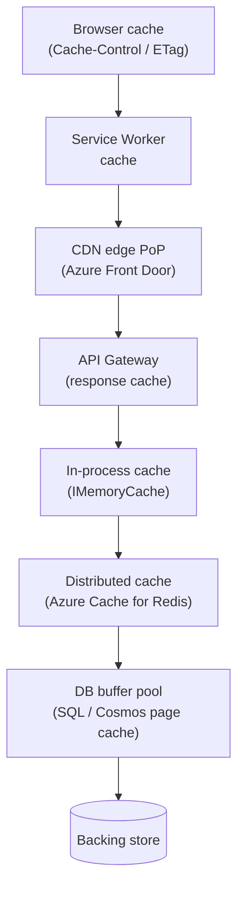
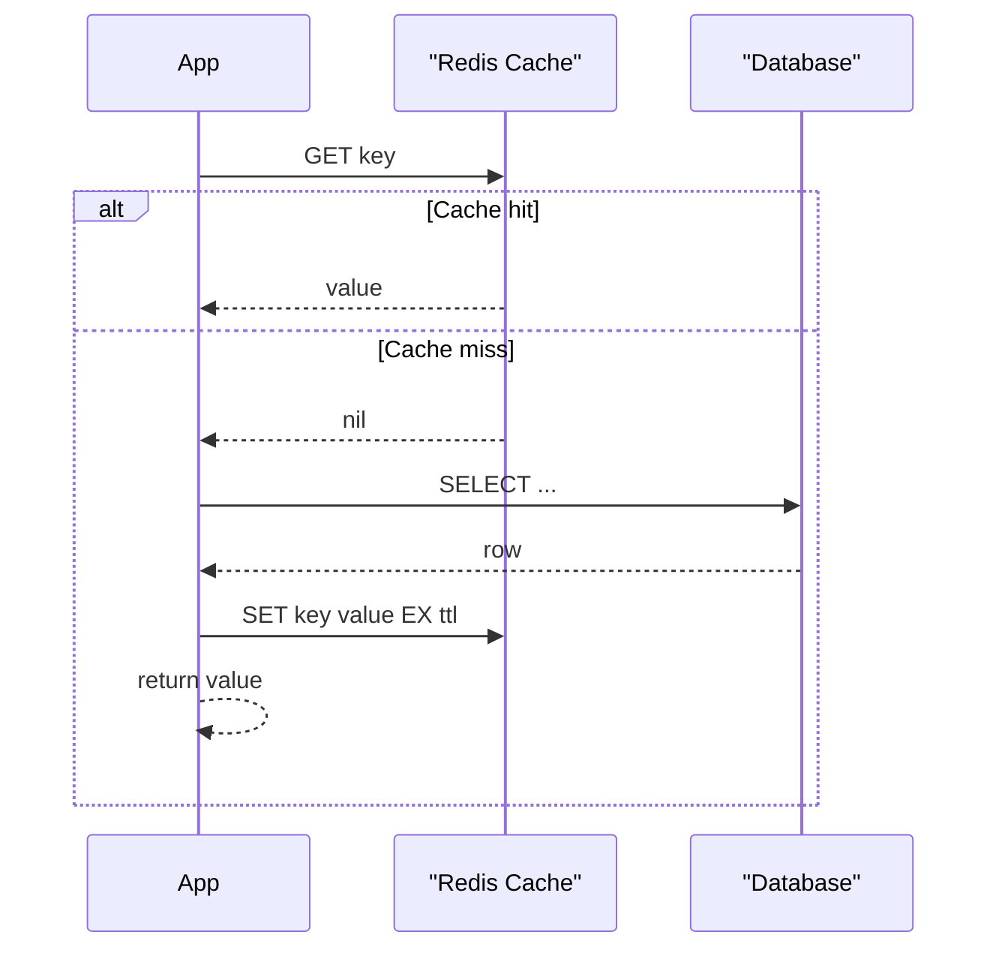
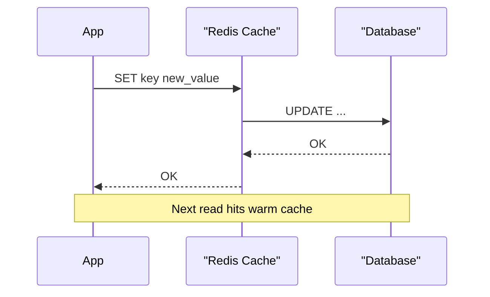

# 1. Caching Strategies and Patterns

> **TL;DR:** A cache trades memory for latency. The choice of strategy (when to populate, when to write, when to invalidate) determines consistency, durability, and complexity. Get the strategy wrong and you get stale data, stampedes, or avalanche failures.

**Interview weight:** P0 — Interviewers probe latency numbers, eviction maths, stampede mitigations, and invalidation trade-offs. Redis background makes deep questions very likely.

---

## Core Concepts

- **Cache** — faster, finite storage layer absorbing reads (and sometimes writes) that would otherwise hit a slower backing store.
- **Cache hit** — requested key found; backing store not consulted.
- **Cache miss** — key absent; backing store queried; entry usually populated.
- **TTL (Time-To-Live)** — duration after which a key expires. Primary freshness knob.
- **Eviction** — removing entries to free memory when the cache is full.
- **Invalidation** — explicitly expiring or deleting an entry because the underlying data changed.
- **Cache hit ratio** — `hits / (hits + misses)`. The core health metric.

---

## Why Cache — Latency Numbers

| Store | Typical read latency |
| ----- | -------------------- |
| L1/L2 CPU cache | < 10 ns |
| RAM / in-process (`IMemoryCache`) | 100 ns – 1 µs |
| Redis (same region, local network) | 0.5 – 2 ms |
| NVMe SSD (local) | 100 – 500 µs |
| Azure SQL / Postgres (indexed query) | 5 – 50 ms |
| Cosmos DB (single-region read) | 5 – 15 ms |
| Cross-region DB replica | 50 – 300 ms |

**Production anchor:** Publisher News Feed reduced p99 from 600 ms → 150 ms by adding Redis in front of Cosmos DB reads — a 4× improvement from a single cache layer.

---

## Where to Cache — Cache Hierarchy



| Layer | Scope | Latency | Notes |
| ----- | ----- | ------- | ----- |
| Browser / Service Worker | Single user | < 1 ms | HTTP headers control; zero server cost on hit |
| CDN edge | All users, geo-local | 5–30 ms | Best for static/semi-static public content |
| API Gateway | Cluster-wide | 1–5 ms | Useful for identical requests; invalidation is hard |
| In-process (`IMemoryCache`) | Single pod | < 1 µs | Ultra-fast; not shared across pods; memory pressure |
| Distributed (Redis) | All pods | 0.5–2 ms | Shared; supports atomic ops; network hop cost |
| DB buffer pool | DB server | 0.1–1 ms | Transparent; only helps repeated identical queries |

---

## Cache Strategies — Big Comparison

| Strategy | Who populates? | Consistency | Write latency | Read latency | Data-loss risk | Complexity | When to use |
| -------- | -------------- | ----------- | ------------- | ------------ | -------------- | ---------- | ----------- |
| **Cache-aside** (lazy) | App on miss | Weak (stale TTL window) | No change | Miss = DB latency | None | Low | Default; read-heavy, tolerate brief staleness |
| **Read-through** | Cache provider on miss | Weak | No change | Same as cache-aside but transparent | None | Medium | ORM-like abstraction; cache handles fetch logic |
| **Write-through** | App writes to cache first, cache writes DB synchronously | Strong | +Cache write latency | Hits always warm | None | Medium | Read-heavy after writes; consistency matters |
| **Write-behind** (write-back) | App writes cache; cache writes DB async/batched | Eventual | Very low | Always warm | **High** (crash before flush) | High | Write-heavy, bursty; durable queue needed |
| **Write-around** | App writes DB; cache NOT updated | Eventually consistent (TTL expiry) | No change | First read post-write = miss | None | Low | Infrequently-read write-heavy data (logs, archives) |
| **Refresh-ahead** | Cache prefetches before TTL expires | Strong-ish | No change | Always warm (ideal) | None | High | Predictable access patterns; reduces miss spikes |

### Cache-Aside Sequence



### Write-Through Sequence



---

## Cache Hit Ratio Math

```
hit_ratio = hits / (hits + misses)
backend_rps = total_rps × (1 - hit_ratio)
```

| Hit ratio | Backend RPS (at 1000 total) | Effect |
| --------- | --------------------------- | ------ |
| 0.50 | 500 | Little gain |
| 0.80 | 200 | 5× reduction |
| **0.87** | **130** | **Resume result: gateway load −87%** |
| 0.95 | 50 | 20× reduction |
| 0.99 | 10 | 100× reduction |

**p99 impact:** Each miss must wait for the backing-store latency (e.g. 20 ms). With 0.99 hit ratio only 1 in 100 requests pays that cost; p99 tracks the cache hit path (≈ 1 ms Redis), not the miss path.

---

## TTL Selection and Jitter

- **Too short** — high miss rate, DB hammered.
- **Too long** — stale data, large invalidation surface.
- **Jitter** — add random offset (±10-20 %) to TTL so entries don't all expire simultaneously.

```csharp
// Jittered TTL — prevents synchronized mass expiry
static TimeSpan Jitter(TimeSpan baseTtl, double fraction = 0.15)
{
    var jitter = baseTtl.TotalSeconds * fraction * (Random.Shared.NextDouble() * 2 - 1);
    return TimeSpan.FromSeconds(baseTtl.TotalSeconds + jitter);
}
```

---

## Eviction Policies

| Policy | Evicts | O(?) | When it wins |
| ------ | ------- | ---- | ------------ |
| **LRU** (Least Recently Used) | Least recently accessed entry | O(1) with doubly-linked list + hashmap | General purpose; temporal locality |
| **LFU** (Least Frequently Used) | Lowest access count | O(1) with frequency buckets | Skewed hot/cold access patterns |
| **FIFO** | Oldest inserted | O(1) | Simple queues; uniform access |
| **Random** | Random key | O(1) | Approximate LRU under severe memory pressure |
| **TTL** (volatile-ttl in Redis) | Nearest-to-expiry entry | O(log n) | Expiry-aware workloads |
| **ARC** (Adaptive Replacement Cache) | Blends LRU + LFU adaptively | O(1) | Variable workload mix; ZFS, Solaris |

### O(1) LRU Implementation

Uses a `Dictionary<K, LinkedListNode<(K,V)>>` + `LinkedList<(K,V)>`:
- **Get** — move node to head.
- **Put** — insert at head; if over capacity, remove tail.

See [Linked Lists](../01-DSA/04-Linked-Lists.md) for full implementation.

**Redis eviction** — controlled by `maxmemory-policy`; `allkeys-lru` is the most common production choice. Redis's LRU is approximate (samples `maxmemory-samples` keys).

---

## Cache Invalidation Strategies

| Strategy | Mechanism | Consistency | Complexity | Risk |
| -------- | --------- | ----------- | ---------- | ---- |
| **TTL expiry** | Key auto-deletes at expiry | Eventual | None | Stale data during TTL window |
| **Explicit delete on write** | App deletes/updates cache on DB write | Strong-ish | Low | Delete-before-write race; DB failure leaves stale |
| **Versioned keys** | Key includes version/etag: `user:42:v7` | Strong | Medium | Key proliferation; old keys need GC |
| **Tag-based** | Keys tagged; tag invalidation deletes all | Strong group invalidation | High | Not natively in Redis; needs secondary index |
| **Pub/Sub broadcast** | DB write publishes event; all pods delete local in-proc cache | Strong for in-proc | Medium | Delivery not guaranteed; handler must be idempotent |
| **Write-through** | Cache always updated on write path | Strong | Medium | Cache write failure = rollback or inconsistency |

**Golden rule:** invalidation is hard because of write ordering. "Delete after DB write" is safer than "update cache" — a delete forces a fresh re-population.

---

## Thundering Herd / Cache Stampede

When a hot key expires, hundreds of concurrent requests all miss and simultaneously hit the DB.

### Mitigations

| Mitigation | How | Trade-off |
| ---------- | --- | --------- |
| **Request coalescing (single-flight)** | First miss takes DB lock; others wait for that result | Extra latency for waiters; worth it |
| **Probabilistic early expiration** | Before TTL, each request has increasing probability of recomputing | Stochastic; no guaranteed prevention |
| **Lock + double-check** | `SET NX` distributed lock; loser re-reads cache after lock release | Redis round-trip on every miss under load |
| **Stale-while-revalidate** | Serve stale value while background refresh runs | Brief staleness; great UX |
| **Pre-warming / cron refresh** | Job refreshes key before expiry | Operational overhead; misses first deployment |

```csharp
// Single-flight / lock + double-check with StackExchange.Redis
public async Task<string?> GetWithLockAsync(IDatabase db, string key)
{
    var value = await db.StringGetAsync(key);
    if (!value.IsNullOrEmpty) return value;

    var lockKey = $"lock:{key}";
    var lockToken = Guid.NewGuid().ToString();
    bool acquired = await db.StringSetAsync(lockKey, lockToken,
        TimeSpan.FromSeconds(5), When.NotExists);

    if (!acquired)
    {
        // Wait briefly and re-read — loser path
        await Task.Delay(50);
        return await db.StringGetAsync(key);
    }

    try
    {
        var freshValue = await FetchFromDbAsync(key);
        await db.StringSetAsync(key, freshValue, Jitter(TimeSpan.FromMinutes(5)));
        return freshValue;
    }
    finally
    {
        // Release lock only if still ours (Lua for atomicity)
        var script = @"if redis.call('get',KEYS[1])==ARGV[1] then
                           return redis.call('del',KEYS[1]) else return 0 end";
        await db.ScriptEvaluateAsync(script, [lockKey], [lockToken]);
    }
}
```

---

## Hot Key and Big Key Problems

**Hot key** — single key receives disproportionate traffic (e.g. leaderboard top-10). One Redis shard becomes the bottleneck.
- Mitigations: local in-proc replica (`IMemoryCache` with short TTL), key sharding (`leaderboard:top10:shard:{0-9}`), read replicas.

**Big key** — value is very large (e.g. serialized list of 100K IDs). Causes latency spikes during read/del/expiry.
- Mitigations: split into smaller keys, use Redis Hashes (`HGET`/`HSCAN`), stream instead of loading all at once.

---

## Cache Penetration and Cache Avalanche

**Cache penetration** — requests for keys that will never exist (e.g. attacker probing IDs) bypass cache every time.
- **Null caching** — cache a `null`/sentinel with short TTL on miss. Simple.
- **Bloom filter** — probabilistic membership test before DB query. Zero false negatives. See [Bloom Filters](../01-DSA/04-Linked-Lists.md).

**Cache avalanche** — mass simultaneous expiry of many keys → DB overwhelmed.
- **TTL jitter** (see above) — primary defence.
- **Tiered TTL** — L1 in-proc (short TTL) + L2 Redis (longer TTL). Miss on L1 hits L2, not DB.
- **Circuit breaker** — shed DB load when miss rate spikes.

**Negative caching** — caching a `null` result to prevent repeated DB hits for non-existent data. Set a shorter TTL (30 s) than positive entries.

---

## Key Naming / Namespacing Conventions

```
{service}:{entity}:{id}[:{field}]
# Examples
news-feed:article:42
news-feed:article:42:comments
user-profile:user:1001
rate-limit:ip:203.0.113.5
```
- Lowercase, colons as separators, no spaces.
- Include version if schema changes: `user:42:v2`.
- Keep keys short but readable; avoid GUIDs in hot paths.

---

## Serialization Choices

| Format | Size | Speed | Human-readable | .NET support | When to use |
| ------ | ---- | ----- | -------------- | ------------ | ----------- |
| **JSON** (System.Text.Json) | Large | Medium | Yes | Native | Default; debuggable |
| **MessagePack** | ~50% of JSON | Fast | No | `MessagePack-CSharp` | High-throughput; bandwidth-sensitive |
| **Protobuf** | Smallest | Fastest | No | `Google.Protobuf` / `protobuf-net` | Cross-service schemas; versioning needed |

Avoid `BinaryFormatter` — insecure, removed in .NET 9.

---

## What NOT to Cache

- Highly personalized real-time data (shopping cart, live balance) — consistency risk outweighs benefit.
- Cryptographic nonces, CSRF tokens — must be unique per use.
- Data that changes on every request.
- Sensitive PII/PHI that must not persist beyond the request boundary.
- Very large objects that would evict many smaller hot keys.

---

## Measuring Cache Effectiveness

| Metric | Target | Tool |
| ------ | ------ | ---- |
| Hit ratio | > 80 % (> 95 % for hot paths) | Redis `INFO stats`, Application Insights |
| Eviction rate | Near 0 for non-expired evictions | `evicted_keys` in Redis `INFO` |
| Miss latency (p99) | < backing-store p99 × miss ratio | Distributed tracing |
| Memory usage % | < 75 % of `maxmemory` | Azure Monitor |
| Keyspace size | Track for unexpected growth | `DBSIZE`, keyspace notifications |

---

## Interview Questions

**Q1. What is cache-aside and why is it the default choice?**
A: App checks cache on read; on miss, reads DB and populates cache. It's default because it's simple, the app controls the data fetched, and the cache only holds what's actually requested (no pre-loading cold data).

**Q2. What's the difference between write-through and write-behind?**
A: Write-through updates cache and DB synchronously on every write — no data loss, higher write latency. Write-behind (write-back) updates cache immediately and DB asynchronously — lower write latency but data can be lost if the cache crashes before flush. Write-behind needs a durable queue to be safe.

**Q3. How do you calculate the effect of hit ratio on backend load?**
A: `backend_rps = total_rps × (1 - hit_ratio)`. At 0.87 hit ratio and 1000 RPS, only 130 requests reach the DB — 87% reduction. That's the resume number.

**Q4. What is a thundering herd and how do you mitigate it?**
A: When a hot key expires, all concurrent misses hit the DB simultaneously. Primary mitigations: (1) single-flight / distributed lock so only one request populates the key, (2) stale-while-revalidate to serve the old value during refresh, (3) probabilistic early expiration, (4) pre-warming via a background job.

**Q5. LRU vs LFU — when do you prefer each?**
A: LRU evicts the least recently accessed key — works well with temporal locality (recently used items likely needed again). LFU evicts the least frequently accessed — better for skewed workloads with stable hot keys (like a celebrity user's profile). Redis supports both via `maxmemory-policy`. LFU needs counter decay to avoid stale-hot keys dominating forever.

**Q6. Explain cache invalidation strategies and their consistency trade-offs.**
A: TTL is eventual — simplest but stale until expiry. Explicit delete-on-write is stronger but has a race window (delete before or after DB write?). Versioned keys avoid races (old version naturally expires) but require key-scheme discipline. Pub/sub broadcast invalidates in-process caches across pods but at-most-once delivery means pods can miss events.

**Q7. How does cache penetration differ from cache avalanche? How do you fix each?**
A: Penetration = requests for non-existent keys always miss (e.g. attack with fake IDs). Fix: null caching (cache `null` with short TTL) or Bloom filter. Avalanche = mass simultaneous expiry of many keys overloads DB. Fix: TTL jitter, tiered L1+L2 caching, circuit breaker.

**Q8. You cut p99 latency 600 ms → 150 ms. Walk me through the caching decisions you made.**
A: Redis in front of Cosmos DB with cache-aside pattern. Key design followed `{service}:{entity}:{id}`. TTL based on how fresh the news-feed articles needed to be (5-minute articles, 30-second leaderboard). Added TTL jitter to prevent avalanche. In-proc `IMemoryCache` layer for the hottest keys (article metadata, 10-second TTL) to reduce Redis round-trips. Hit ratio reached ~87%, reducing Cosmos RU spend and gateway load proportionally.

**Q9. How do you handle hot-key problem in Redis?**
A: Options: (1) local in-proc cache with very short TTL as L1 — reduces Redis hits for same key, (2) key sharding — replicate the hot key across N shards `key:0` .. `key:N-1` and pick randomly on read, (3) use Redis read replicas and route reads there, (4) restructure the data model to avoid single-key concentration.

**Q10. Why is "delete after write" safer than "update cache after write" for invalidation?**
A: Update-after-write has a TOCTOU race: thread A updates DB, thread B reads stale cache, thread A then updates cache with now-stale data (if reordered). Delete-after-write means next read always fetches fresh from DB; worst case is one extra miss, not stale data. The miss is cheaper than a consistency bug.

**Q11. What serialization format do you use for cached objects and why? Trade-offs?**
A: JSON for debuggability and cross-service compatibility (default). Switch to MessagePack when bandwidth or serialisation CPU is a bottleneck — ~50% smaller, ~3× faster than System.Text.Json. Protobuf for tightly-coupled services with schema evolution needs. Avoid BinaryFormatter — it's insecure and removed in .NET 9.

**Q12. At Staff level: how would you design a two-tier cache with cross-pod invalidation?**
A: L1 = `IMemoryCache` per pod (microsecond reads). L2 = Redis cluster (millisecond reads). On write: update DB, then publish invalidation message to a Redis pub/sub channel (or Azure Service Bus for guaranteed delivery). Each pod subscribes; on message receipt, evicts the L1 entry. L2 is invalidated by explicit delete. Gaps in delivery (pod restart, network hiccup) healed by L1 TTL (set short, e.g. 30 s). Trade-off: sub-second staleness window vs ultra-low read latency.

**Q13. Senior: How do you size a Redis cache for a workload?**
A: Estimate: `working_set_size = active_key_count × avg_value_bytes × overhead_factor (≈1.3 for Redis overhead)`. Target working set fits in 60-70% of `maxmemory` to leave headroom before eviction kicks in. Monitor `used_memory_rss` vs `used_memory`; large gap indicates fragmentation. Right-size the Azure Cache for Redis SKU (C-series vs P-series); P-series has persistence and is cluster-capable. Revisit if eviction rate > 0 for non-expired keys.

---

## Quick Recap

- **Cache-aside** = default; lazy population; stale during TTL window.
- **Write-through** = strong consistency; adds write latency; prefer for read-after-write workloads.
- **Write-behind** = low write latency; **data loss risk**; needs durable queue.
- **Hit ratio math**: `backend_rps = total × (1 - hit_ratio)`; 0.87 hit ratio → 87% backend reduction.
- **Thundering herd**: use single-flight lock or stale-while-revalidate; add TTL jitter.
- **LRU** = temporal locality; **LFU** = frequency skew; Redis uses approximate LRU by default.
- **Invalidation hierarchy**: TTL (simplest) → explicit delete → versioned keys → pub/sub broadcast.
- **Penetration** → null cache / Bloom filter; **Avalanche** → TTL jitter + tiered cache.
