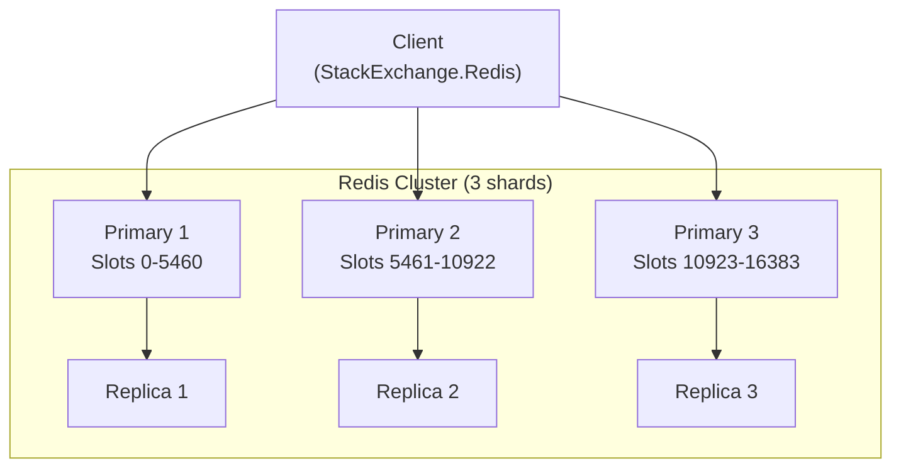
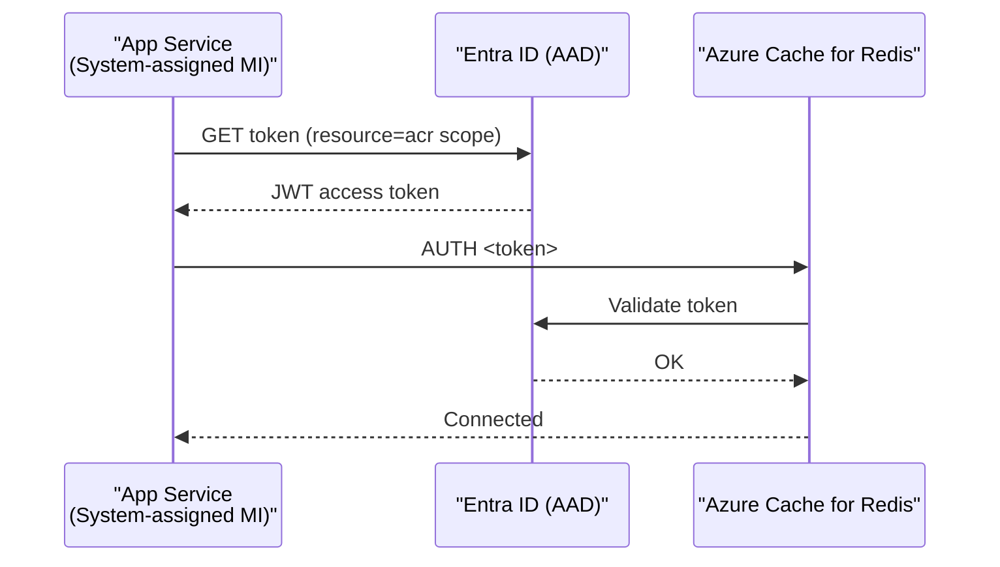
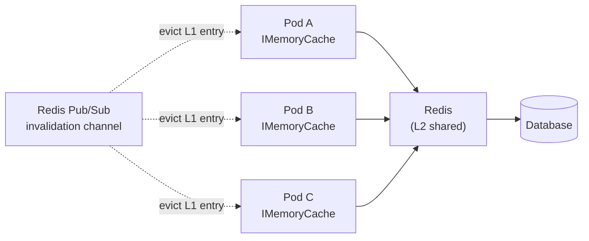

# 2. Redis and Distributed Caching

> **TL;DR:** Redis is a single-threaded, in-memory data structure server. Understanding its threading model, data types, Cluster topology, and .NET client patterns separates candidates who used Redis from those who understand it.

**Interview weight:** P0 — Resume shows Redis expertise (p99 improvement, Managed Identity migration, Terraform module). Expect deep questions on Cluster, persistence trade-offs, Lua vs transactions, and StackExchange.Redis pitfalls.

---

## Core Concepts

- **Single-threaded event loop** — one thread processes commands sequentially; no locking needed internally. I/O multiplexing (`epoll`/`kqueue`) handles thousands of connections. Implication: one slow O(n) command (`KEYS *`, `SMEMBERS` on a huge set, `LRANGE 0 -1`) blocks all other clients.
- **In-memory** — all data in RAM. Persistence is optional and orthogonal.
- **Multiplexer** — `StackExchange.Redis` connection multiplexer pipelines many concurrent .NET operations over a few TCP connections to Redis.
- **Hash slot** — Redis Cluster's unit of key distribution; 16 384 total.

---

## Redis Data Types

| Type | Key commands | Memory | Real scenario |
| ---- | ------------ | ------ | ------------- |
| **String** | `GET`, `SET`, `INCR`, `GETEX` | ~90 bytes + value | Cache any blob; counters; distributed locks |
| **Hash** | `HGET`, `HSET`, `HMGET`, `HGETALL` | Compact for small hashes | User profile fields; partial updates without re-serializing whole object |
| **List** | `LPUSH`, `RPOP`, `LRANGE` | O(n) memory | Message queues (simple); recent activity feed |
| **Set** | `SADD`, `SISMEMBER`, `SUNION` | Hash table | Tags; unique visitors per day |
| **Sorted Set** | `ZADD`, `ZRANGE`, `ZRANGEBYSCORE` | Skip list + dict | Leaderboards; rate-limit sliding window; delayed jobs by score=timestamp |
| **Bitmap** | `SETBIT`, `BITCOUNT` | 1 bit per position | Daily active users (position=user_id); feature flags |
| **HyperLogLog** | `PFADD`, `PFCOUNT` | ≤ 12 KB fixed | Unique visitor count; approximate (0.81% error) |
| **Stream** | `XADD`, `XREAD`, `XACK` | Log-like | Durable message log; consumer groups; audit trail |
| **Geo** | `GEOADD`, `GEODIST`, `GEORADIUS` | Sorted set internally | Nearby locations; store finder |

**Never use `KEYS *` in production.** Use `SCAN` with a cursor — it iterates in O(1) per call and doesn't block.

---

## Expiry Mechanics

- **Lazy expiry** — key is checked and deleted when accessed after TTL. Zero overhead until accessed.
- **Active sampling** — Redis periodically samples `maxmemory-samples` (default 20) keys with TTL and deletes expired ones. Cycle runs every 100 ms. Ensures expired keys are eventually reclaimed even if never accessed again.

---

## Memory Management and maxmemory-policy

| Policy | What gets evicted | Use case |
| ------ | ----------------- | -------- |
| `noeviction` | Error on write when full | Do NOT use for pure cache |
| `allkeys-lru` | LRU across all keys | **Recommended for pure cache** |
| `volatile-lru` | LRU among keys with TTL set | Mixed cache + session store |
| `allkeys-lfu` | LFU across all keys | Skewed hot-key workloads (Redis 4+) |
| `volatile-lfu` | LFU among keys with TTL | Mixed store with frequency skew |
| `allkeys-random` | Random key | Very uniform access only |
| `volatile-ttl` | Key nearest expiry | When you want expiry-driven eviction |
| `volatile-random` | Random among TTL keys | Rare |

Set `maxmemory` to 70-75% of instance RAM; leave headroom for replication buffer and fork overhead.

---

## Persistence: RDB vs AOF vs None

| Aspect | RDB (snapshot) | AOF (append-only file) | None |
| ------ | --------------- | ---------------------- | ---- |
| Mechanism | Point-in-time snapshot via `fork` | Log every write command | RAM only |
| Durability | Up to last snapshot (minutes of loss) | Up to last fsync (1 s or each write) | Zero — full loss on restart |
| Restart speed | Fast (load one file) | Slow (replay log) | Instant |
| Disk I/O | Low (periodic) | High (continuous) | None |
| File size | Small | Can grow large (compaction via rewrite) |N/A |
| Pure cache use | Disable both — faster, smaller memory overhead | — | **Best for pure cache**; warm on restart via cache-aside |

**For pure cache (e.g., Azure Cache for Redis used only for response caching):** disable persistence. Restart is a cold cache, not a data loss event — the backing DB is authoritative.

---

## Replication, Sentinel, and Redis Cluster



| Mode | Description | Failover | Multi-key ops | When |
| ---- | ----------- | -------- | ------------- | ---- |
| **Standalone** | Single node | Manual | Yes | Dev / small cache |
| **Replication** | 1 primary + N replicas | Manual | Yes | Read scaling; no HA |
| **Sentinel** | Replication + automatic failover | Automatic (~30 s) | Yes | HA without sharding |
| **Cluster** | Auto-sharded 16 384 hash slots | Automatic (~10 s) | **Hash tags required** | Scale-out; > 26 GB or > 1M ops/s |

**Hash slots:** `HASH_SLOT = CRC16(key) % 16384`. All primary nodes own a slice of slots. Resharding migrates slots live via `MIGRATE`.

**Hash tags:** Force multiple keys to the same slot: `{user:42}:profile` and `{user:42}:settings` both hash on `user:42`. Required for multi-key commands (`MGET`, `SUNION`) and transactions in Cluster mode.

---

## Transactions: MULTI/EXEC vs Lua vs WATCH

| Mechanism | Atomicity | Rollback on error? | Conditional logic | Performance | Notes |
| --------- | --------- | ------------------ | ----------------- | ----------- | ----- |
| `MULTI/EXEC` | Atomic execution block | No (partial exec on runtime error) | No | 1 round-trip for exec | Commands queued; all or nothing at queue-level |
| **Lua script** | Atomic | Aborts entirely | **Yes** | 1 round-trip | Server-side execution; no network back-and-forth; preferred for complex conditional ops |
| `WATCH` + `MULTI/EXEC` | Optimistic locking | Whole EXEC fails if watched key changed | Yes (retry on failure) | Extra round-trip for WATCH | CAS pattern; high contention → many retries |

```csharp
// Lua atomic rate-limit counter (sliding window via Sorted Set)
const string RateLimitScript = @"
local key   = KEYS[1]
local now   = tonumber(ARGV[1])
local window = tonumber(ARGV[2])
local limit = tonumber(ARGV[3])
redis.call('ZREMRANGEBYSCORE', key, '-inf', now - window)
local count = redis.call('ZCARD', key)
if count < limit then
    redis.call('ZADD', key, now, now)
    redis.call('EXPIRE', key, window)
    return 1
end
return 0";
```

---

## Pipelining vs Batching

- **Pipelining** — send multiple commands without waiting for each reply; responses collected in order. Reduces round-trip cost from N RTTs to 1. StackExchange.Redis does this transparently.
- **Batching** (`IBatch`) — explicit batch API in StackExchange.Redis; forces commands to be sent as a group.
- **Round-trip cost** — Redis command overhead is ~0.1 ms locally. 100 individual GETs = ~10 ms. 100 pipelined GETs ≈ 0.5 ms.

---

## Pub/Sub vs Streams

| Aspect | Pub/Sub | Streams (`XADD/XREAD`) |
| ------ | ------- | ---------------------- |
| Durability | **None** — fire and forget | Persisted in-memory log |
| Replay | No | Yes (consumer groups, `XREADGROUP`) |
| Consumer groups | No | Yes — competing consumers |
| Backpressure | No | Via consumer group ACK |
| Message ordering | Per channel, FIFO | Strict (entry IDs) |
| Use case | Real-time broadcast (e.g. in-proc cache invalidation) | Durable event log, audit, task queue |

---

## Distributed Locks: SET NX PX and Redlock

```csharp
// Acquire lock — atomic SET if Not eXists with expiry
bool acquired = await db.StringSetAsync(
    "lock:resource:42",
    clientToken,                     // unique token per acquire attempt
    TimeSpan.FromSeconds(10),
    When.NotExists);

// Release — Lua ensures we only delete our own lock
const string ReleaseLua = @"
if redis.call('get',KEYS[1])==ARGV[1] then
    return redis.call('del',KEYS[1])
else return 0 end";
await db.ScriptEvaluateAsync(ReleaseLua, ["lock:resource:42"], [clientToken]);
```

**Redlock** — multi-node distributed lock algorithm (acquire lock on majority of N independent Redis nodes). Criticised by Martin Kleppmann: clock drift and GC pauses can cause two clients to both believe they hold the lock.

| Lock type | Use case | Safety guarantee |
| --------- | -------- | ---------------- |
| Single-node `SET NX` | Efficiency (avoid duplicate work) | Sufficient for most cases |
| Redlock | Correctness across node failure | Controversial; use fencing tokens for true correctness |

---

## Rate Limiting with Redis

```csharp
// Fixed window: INCR + EXPIRE
var count = await db.StringIncrementAsync($"rl:{userId}:{DateTime.UtcNow:yyyyMMddHHmm}");
if (count == 1) await db.KeyExpireAsync($"rl:{userId}:{...}", TimeSpan.FromMinutes(1));
if (count > limit) throw new RateLimitExceededException();
```

Sliding window via sorted set (Lua script above) is more accurate but more expensive.

---

## Azure Cache for Redis — Tiers

| Tier | Cluster | Persistence | Geo-replication | Zone redundancy | Use |
| ---- | ------- | ----------- | --------------- | --------------- | --- |
| **Basic** | No | No | No | No | Dev/test only |
| **Standard** | No | No | No | No | Small prod |
| **Premium** | Yes | RDB + AOF | Active geo-replication | Yes | Production |
| **Enterprise** | Redis Enterprise | RDB + AOF | Active-Active | Yes | Highest throughput |
| **Enterprise Flash** | Redis on Flash (NVMe) | Yes | Yes | Yes | Large datasets, cost-efficient |

---

## Managed Identity / Entra ID Authentication

**Why shared access keys are a risk:**
- Keys are long-lived secrets stored in config/environment — easy to leak in logs, repos, or deployment pipelines.
- Key rotation requires coordinated redeployment.
- No per-identity audit trail.

**Managed Identity approach (your Terraform module):**


- Enable `ACCESS CONTROL` / Entra ID auth on the cache resource.
- Grant the managed identity the **Redis Data Contributor** or **Redis Data Reader** role via RBAC.
- In `StackExchange.Redis`, supply a `TokenCredential` (e.g. `DefaultAzureCredential`) — the client handles token refresh automatically.
- No secrets in config, Key Vault, or environment variables.

```csharp
var tokenCredential = new DefaultAzureCredential();
var configOptions = new ConfigurationOptions
{
    EndPoints = { "my-cache.redis.cache.windows.net:6380" },
    Ssl = true,
    AbortConnect = false
};
await configOptions.ConfigureForAzureWithTokenCredentialAsync(tokenCredential);
var mux = await ConnectionMultiplexer.ConnectAsync(configOptions);
```

---

## StackExchange.Redis in .NET

**Connection setup:**
```csharp
// ConnectionMultiplexer is THREAD-SAFE and expensive to create — use as a singleton
services.AddSingleton<IConnectionMultiplexer>(sp =>
    ConnectionMultiplexer.Connect("my-cache.redis.cache.windows.net:6380,ssl=true,abortConnect=false"));
```

**Common pitfalls:**

| Pitfall | Problem | Fix |
| ------- | ------- | --- |
| Creating `ConnectionMultiplexer` per request | ~50 ms connection overhead; exhausts ports | Singleton or pool |
| `sync-over-async` (`GetAwaiter().GetResult()`) | Thread-pool starvation under load | Always `await` |
| Tight `connectTimeout` | `RedisTimeoutException` spikes under GC pause | Set 5–15 s; use `ReconnectRetryPolicy` |
| `abortConnect=true` (default) | App fails to start if Redis unavailable | Set `abortConnect=false` |
| `KEYS *` from app code | Blocks Redis server | Use `SCAN` cursor |

**`RedisTimeoutException` causes:** thread-pool exhaustion (sync-over-async), network blip, Redis server GC (rare), very large serialized value.

---

## IMemoryCache vs IDistributedCache vs HybridCache

| | `IMemoryCache` | `IDistributedCache` | `HybridCache` (.NET 9) |
| - | -------------- | ------------------- | ---------------------- |
| Scope | Single process | Distributed (Redis, SQL) | Both (L1 in-proc + L2 Redis) |
| Latency | < 1 µs | 0.5–2 ms | < 1 µs (hit L1) |
| Shared across pods | No | Yes | Yes (L2) |
| Stampede protection | Manual | Manual | **Built-in** (single-flight) |
| .NET version | All | All | .NET 9+ |
| `byte[]` only? | No (any object) | Yes | No (generic) |
| Config | `MemoryCacheEntryOptions` | `DistributedCacheEntryOptions` | `HybridCacheEntryOptions` |

```csharp
// HybridCache (.NET 9) — built-in stampede protection and two-tier
var result = await hybridCache.GetOrCreateAsync(
    $"article:{id}",
    async ct => await repo.GetArticleAsync(id, ct),
    new HybridCacheEntryOptions
    {
        LocalCacheExpiration = TimeSpan.FromSeconds(30),
        Expiration = TimeSpan.FromMinutes(5)
    });
```

---

## Two-Tier / Near-Cache Design



On write: DB update → Redis delete → publish invalidation event → all pods evict L1. Brief < 1 s staleness window acceptable on most OLTP workloads.

---

## Redis vs Competitors

| | Redis | Memcached | In-process | CDN |
| - | ----- | --------- | ---------- | --- |
| Data types | Rich (10+) | String only | Any | String/HTTP |
| Persistence | Optional | None | None | None |
| Replication | Yes | No | No | Yes |
| Cluster | Yes (16 384 slots) | Client-side | N/A | Yes |
| Pub/Sub | Yes | No | No | No |
| Scripting (Lua) | Yes | No | No | Edge workers |
| Use case | General distributed cache | Simple KV, horizontal scale | Ultra-low latency, single pod | Static / semi-static HTTP |

---

## Monitoring

| Metric | Command / Source | Alert threshold |
| ------ | ---------------- | --------------- |
| Hit ratio | `INFO stats` → `keyspace_hits / (keyspace_hits + keyspace_misses)` | < 80% |
| Evictions | `INFO stats` → `evicted_keys` rate | > 0 non-expired |
| Memory usage | `INFO memory` → `used_memory_rss` | > 75% of maxmemory |
| Connected clients | `INFO clients` | > 80% of `maxclients` |
| Latency (p99) | `LATENCY HISTORY` or Azure Monitor | > 2 ms for GET |
| Memory fragmentation ratio | `mem_fragmentation_ratio` | > 1.5 (consider restart/defrag) |

---

## Interview Questions

**Q1. Why is Redis single-threaded and what does that mean for production?**
A: Redis's command-processing loop is single-threaded to avoid lock overhead; I/O multiplexing handles concurrency. Implication: one slow O(n) command (`KEYS *`, large `LRANGE`) blocks every other client. Always prefer `SCAN`, paginate `LRANGE`, and avoid operations proportional to key/set size in hot paths.

**Q2. Which Redis data type would you use for a leaderboard? Why?**
A: Sorted Set (`ZADD`/`ZRANGE`). Score = numeric metric; member = player ID. `ZRANGEBYSCORE` and `ZRANK` are O(log N). Naturally handles ties and range queries. Update is O(log N) vs O(N) for a sorted list.

**Q3. What is the difference between RDB and AOF persistence?**
A: RDB takes periodic snapshots (low I/O, fast restart, up to minutes of data loss). AOF logs every write command (high I/O, slow replay, up to 1-second loss with `appendfsync everysec`). For a pure cache, disable both — restart = cold cache, not data loss.

**Q4. How does Redis Cluster distribute keys and what breaks multi-key commands?**
A: CRC16(key) % 16384 determines the hash slot; each primary owns a range of slots. `MGET key1 key2` fails if the keys land on different shards. Solution: hash tags `{prefix}` force co-location. Be deliberate — all `{user:42}:*` keys land on the same shard, potentially creating a hot shard if user 42 is extremely active.

**Q5. Why is Lua scripting preferred over MULTI/EXEC for conditional operations?**
A: `MULTI/EXEC` queues commands but cannot branch on intermediate results — no `if value > threshold then`. Lua runs atomically on the server with full access to intermediate values, no extra round-trips. It's ideal for atomic check-and-set patterns like rate limiting and distributed locks.

**Q6. Walk me through the Managed Identity migration you did for Redis authentication.**
A: Previously, connection strings with access keys were in App Service config / Key Vault. Risk: key leakage, rotation burden, no per-service audit. Migration: enabled Entra ID auth on the cache; wrote Terraform to assign Redis Data Contributor role to each service's managed identity; updated `StackExchange.Redis` config to use `DefaultAzureCredential`-based `TokenCredential`. No secrets in code or config. Token refresh handled by SDK. This is the gold standard for Azure service authentication.

**Q7. What causes `RedisTimeoutException` in StackExchange.Redis and how do you fix it?**
A: (1) Thread-pool starvation from sync-over-async — fix by always awaiting. (2) Large value serialization blocking the connection. (3) Network blip or Redis server latency spike. (4) `connectTimeout` too tight. Fix: singleton `ConnectionMultiplexer`, always async, increase `syncTimeout`/`connectTimeout`, set `abortConnect=false`, add circuit breaker pattern.

**Q8. Compare IMemoryCache, IDistributedCache, and HybridCache. When do you use each?**
A: `IMemoryCache` — single-pod, microsecond latency, any object type. Not shared. `IDistributedCache` — shared across pods via Redis or SQL, `byte[]` only, 0.5–2 ms. `HybridCache` (.NET 9) — two-tier with built-in stampede protection; L1 in-process + L2 Redis; the right choice for new greenfield services needing both performance and sharing. Previous projects used manual two-tier with pub/sub invalidation — HybridCache automates that pattern.

**Q9. How does the WATCH + MULTI/EXEC pattern work and what's its weakness?**
A: `WATCH key` marks it for optimistic locking. If the key changes before `EXEC`, the whole transaction aborts (returns nil). The client must retry. Under high contention, many retries — performance degrades. For high-contention counters, Lua or atomic commands (`INCR`) are better.

**Q10. Explain the thundering-herd fix you'd build at scale with StackExchange.Redis.**
A: Use `HybridCache` in .NET 9 (built-in single-flight) or implement a `SemaphoreSlim`-per-key pattern for older code. On miss, only one caller fetches from DB; others await the same `Task`. Key must be per-logical-entity, not global, to avoid a single semaphore becoming a bottleneck. Combine with stale-while-revalidate: serve expired value while background refresh runs.

**Q11. What are the trade-offs between Redis Cluster and Sentinel?**
A: Sentinel provides HA for a single primary-replica pair — no sharding, supports all multi-key commands, simpler setup. Cluster shards data across N primaries — horizontal scale, but multi-key ops need hash tags and client awareness. Choose Sentinel unless dataset > 25 GB or write throughput > single-node capacity.

**Q12. Senior: Design a distributed rate limiter using Redis for 10 000 RPS.**
A: Use a sorted set per `{user_id}:{resource}` where score = request timestamp (ms). Lua script: remove entries older than window, check count vs limit, add new entry if under limit — atomically. Lua ensures no race. At 10 K RPS across 1000 users = 10 req/s average per user. Redis handles this easily (single-threaded but ~100K ops/s). Shard by user ID prefix if > 1M users to avoid single-node hotspot. Add Redis Cluster hash tags so all rate-limit keys for a user land on same shard.

---

## Quick Recap

- Redis is **single-threaded** — never run O(n) commands on large collections in production; use `SCAN`.
- **Sorted Set** = leaderboards, sliding-window rate limits; **HyperLogLog** = unique counts; **Stream** = durable log.
- **AOF** = lower data loss; **RDB** = fast restart; **None** = best for pure cache.
- **Cluster** = 16 384 hash slots; hash tags `{}` force key co-location for multi-key ops.
- **Lua scripts** > `MULTI/EXEC` for conditional atomic operations.
- **Managed Identity** over access keys — no secrets, automatic rotation, per-identity audit.
- `ConnectionMultiplexer` must be a **singleton**; always `await` async methods.
- **HybridCache** (.NET 9) = two-tier + stampede protection built in.
