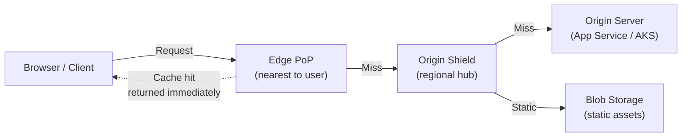
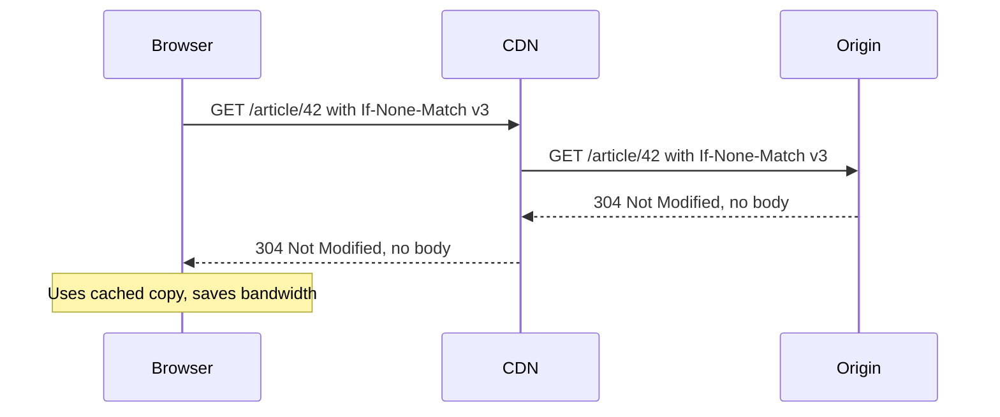

# 3. CDN and Client-Side Caching

> **TL;DR:** CDNs push content to the network edge; HTTP caching headers tell every intermediary (browser, CDN, proxy) whether and how long to cache a response. Master `Cache-Control`, ETags, and Azure Front Door to design zero-origin-load static delivery and correct API caching.

**Interview weight:** P1 — Interviewers probe HTTP caching semantics, cache busting, `Vary` header misconfigurations, and the trade-offs between CDN and API gateway caching.

---

## Core Concepts

- **CDN (Content Delivery Network)** — globally distributed edge PoPs that cache origin responses closer to end users.
- **PoP (Point of Presence)** — edge node in a geographic region.
- **Origin shield** — a single canonical cache tier between PoPs and origin to reduce origin fan-out.
- **Cache-Control** — HTTP response header directing all caches (browser, CDN, proxy).
- **ETag** — opaque validator token; client re-sends via `If-None-Match` to check freshness.
- **Cache busting** — force clients to fetch new content by changing the URL (content hash in filename).

---

## CDN Architecture



- **Anycast** routing sends user to the nearest PoP automatically via BGP.
- **Origin shield** collapses N simultaneous PoP misses into one origin request — critical for thundering-herd on origin.

---

## Push vs Pull CDN

| | Push CDN | Pull CDN |
| - | -------- | -------- |
| Mechanism | Publisher explicitly uploads content to edge | Edge fetches from origin on first miss |
| Control | Full (you decide what, when, where) | Automatic |
| Cold-start | No miss latency | First request = origin latency |
| Storage cost | Stored at edge even if uncached | Only hot content stays |
| Best for | Known assets, large files, predictable content | Dynamic apps, long-tail content |
| Azure example | Azure Blob + CDN pre-load | Azure Front Door (pull by default) |

---

## Cache Key and the `Vary` Header

**Cache key** = what the CDN uses to decide if a stored response can be served.
Default: `scheme + host + path + query string`.

**`Vary` header** — adds request headers to the cache key:
```
Vary: Accept-Encoding, Accept-Language
```
- Every unique combination creates a separate cache entry.
- `Vary: *` — uncacheable (each request is unique). Avoid.
- `Vary: Authorization` — effectively private; CDN should not cache.

**Misconfiguration risk:** forgetting `Vary: Accept-Encoding` → gzip and non-gzip responses share one cache entry → corrupt responses for some clients.

---

## HTTP `Cache-Control` Directives

| Directive | Who it targets | Meaning |
| --------- | -------------- | ------- |
| `max-age=N` | Browser + CDN | Cache for N seconds |
| `s-maxage=N` | CDN / shared cache only | Overrides `max-age` for shared caches |
| `no-cache` | All | **Must revalidate** before serving; does NOT mean don't cache |
| `no-store` | All | Do not cache at all (sensitive data) |
| `private` | CDN | Only browser may cache; CDN must not store |
| `public` | CDN | Shared caches allowed to store even if normally private |
| `must-revalidate` | All | After stale, must revalidate; don't serve stale on error |
| `stale-while-revalidate=N` | Browser / CDN | Serve stale for N seconds while fetching fresh in background |
| `immutable` | Browser | Content will never change; skip revalidation until max-age |

**Common patterns:**
```http
# Versioned static assets (forever cache, instant bust via URL change)
Cache-Control: public, max-age=31536000, immutable

# HTML entry point (always revalidate)
Cache-Control: no-cache

# API response (private, short TTL)
Cache-Control: private, max-age=30

# Public API response (CDN cacheable)
Cache-Control: public, s-maxage=300, stale-while-revalidate=60
```

---

## ETag, If-None-Match, Last-Modified, If-Modified-Since

| Mechanism | Header sent by origin | Header sent by client | Match response |
| --------- | --------------------- | --------------------- | -------------- |
| **ETag** | `ETag: "abc123"` | `If-None-Match: "abc123"` | `304 Not Modified` |
| **Last-Modified** | `Last-Modified: Thu, 01 Jan 2026 00:00:00 GMT` | `If-Modified-Since: <date>` | `304 Not Modified` |

**Strong ETag** — exact byte-for-byte match required (`"abc123"`).
**Weak ETag** — semantically equivalent (`W/"abc123"`); allows minor differences (e.g., gzip encoding).

### 304 Sequence



---

## Cache Busting

- **Content-hashed filenames** — `app.a1b2c3d4.js`; `max-age=31536000, immutable`.
- **Query-string version** — `app.js?v=42`; less reliable (some proxies ignore query strings).
- **CDN purge API** — Azure Front Door `purge` endpoint; propagates in < 10 s but has API rate limits.
- **Surrogate keys / cache tags** — tag responses; purge by tag (Azure Front Door Premium supports this).

---

## CDN for APIs

| Scenario | Works? | Notes |
| -------- | ------- | ----- |
| Public, read-heavy, low-update | Yes | Product catalog, reference data |
| Personalized responses | No | `Vary: Authorization` → uncacheable |
| Write endpoints (POST/PUT/DELETE) | No | Never cache writes |
| Dynamic with aggressive TTL (30–60 s) | Acceptable | Accept brief staleness |
| Idempotent with `s-maxage` | Yes | Search results, leaderboards |

**Consistency warning:** CDN-cached API responses can be up to `s-maxage` seconds stale. Fine for read-heavy reference data; wrong for banking balances.

---

## Purge / Invalidation Strategies

| Strategy | Latency | Cost | Notes |
| -------- | ------- | ---- | ----- |
| TTL expiry | `s-maxage` seconds | Zero | Simplest; eventual |
| CDN purge by URL | < 10 s | API call | Good for targeted bust |
| Purge by cache tag | < 10 s | API call | Bulk invalidation (e.g. all articles by author) |
| Content hash URL change | Instant (new URL) | Deploy required | Best for versioned assets |
| Surrogate-key/soft purge | < 10 s | Requires Premium tier | Azure Front Door Premium |

---

## Signed URLs and Private Content

- Generate time-limited URL with HMAC signature (Azure SAS token).
- CDN validates signature before serving.
- Use `Cache-Control: private` or `no-store` for truly per-user content.
- Azure Front Door supports **rules engine** to strip auth headers before caching, or to forward them to origin.

---

## Edge Compute (Brief)

- **Azure Front Door Rules Engine** — rewrite URLs, add headers, redirect before origin hit.
- **Cloudflare Workers / Vercel Edge** — full V8 JS at edge; personalized responses with cache API.
- Useful for: A/B testing, geo-routing, auth token validation at edge.

---

## Azure Front Door vs Azure CDN vs CloudFront

| | Azure Front Door | Azure CDN (classic) | AWS CloudFront |
| - | ---------------- | ------------------- | -------------- |
| Layer | 7 (HTTP) | 7 | 7 |
| Global load balancing | Yes | No | Yes |
| WAF | Yes (native) | Yes (add-on) | Yes (WAF add-on) |
| Origin groups/failover | Yes | No | Yes |
| Cache purge | Yes | Yes | Yes |
| Cache tags / surrogate | Premium tier | No | Via Lambda@Edge |
| WebSocket | Yes | No | Yes |
| Pricing model | Per request + data | Per data | Per request + data |
| Best for | Azure-first, HA + caching + WAF combo | Simple static CDN on Azure | AWS workloads |

---

## Browser Cache vs Service Worker vs Local/Session Storage

| | Browser cache | Service Worker cache | localStorage | sessionStorage |
| - | ------------- | -------------------- | ------------ | -------------- |
| Controlled by | HTTP headers (`Cache-Control`) | JS `CacheStorage` API | JS | JS |
| Persists across tabs? | Yes | Yes | Yes | No (tab-scoped) |
| Persists across restart? | Yes | Yes | Yes | No |
| Storage limit | ~100 MB+ (browser-managed) | ~50 MB (origin quota) | ~5–10 MB | ~5–10 MB |
| Offline support | Partial (stale) | **Yes** (explicit) | Yes | No |
| Eviction | Browser-managed | Controlled by SW | Never (manual) | Tab close |
| Best for | HTTP resource caching | Offline-first PWA | User preferences | Temp session data |

---

## ASP.NET Core: ResponseCaching vs OutputCaching

| | `ResponseCaching` middleware | `OutputCaching` (.NET 7+) |
| - | ---------------------------- | -------------------------- |
| Approach | Honours/sets HTTP `Cache-Control` headers | Server-side in-memory store |
| Shared with CDN? | Yes (respects `public, s-maxage`) | No (server local) |
| Vary support | Via `VaryByHeader`, `VaryByQueryKeys` | Via `VaryByQuery`, `VaryByHeader` |
| Invalidation | TTL only | **Tag-based eviction** |
| Auth'd responses | Skipped automatically | Configurable; care needed |
| .NET version | All | .NET 7+ |
| When to use | Setting correct headers for CDN | Server-side response dedup; tag invalidation |

```csharp
// OutputCaching with tag-based invalidation (.NET 7+)
app.UseOutputCache();

app.MapGet("/articles/{id}", async (int id, IArticleRepo repo) =>
    await repo.GetAsync(id))
   .CacheOutput(p => p
       .Expire(TimeSpan.FromMinutes(5))
       .Tag($"article:{id}")
       .VaryByRouteValue("id"));

// Invalidate all article:42 responses on update
app.MapPut("/articles/{id}", async (int id, Article body,
    IOutputCacheStore cache, IArticleRepo repo) =>
{
    await repo.UpdateAsync(id, body);
    await cache.EvictByTagAsync($"article:{id}", CancellationToken.None);
    return Results.NoContent();
});
```

---

## Interview Questions

**Q1. What is the difference between `no-cache` and `no-store`?**
A: `no-cache` means "you may cache it, but revalidate with the origin before serving" — it just disables serving from cache without a freshness check. `no-store` means "do not store this at all" — no copy is kept on disk or in memory. Use `no-store` for sensitive data (auth tokens, banking responses); `no-cache` for HTML that changes often but you still want conditional request savings.

**Q2. What does `s-maxage` do that `max-age` doesn't?**
A: `s-maxage` applies only to shared caches (CDNs, reverse proxies); it overrides `max-age` for those intermediaries. Browser ignores `s-maxage` and still uses `max-age`. Pattern: `Cache-Control: public, max-age=60, s-maxage=300` — browsers cache for 1 minute, CDN for 5 minutes.

**Q3. How does ETag-based caching reduce bandwidth?**
A: Origin sends `ETag: "v42"` with the response. Client caches it. Next request includes `If-None-Match: "v42"`. If content unchanged, origin responds `304 Not Modified` with no body — saves the full payload transfer. Especially valuable for large JSON responses that change infrequently.

**Q4. How do you cache-bust versioned static assets?**
A: Embed a content hash in the filename: `app.a1b2c3d4.js`. Serve with `Cache-Control: public, max-age=31536000, immutable`. When JS changes, the hash changes → new URL → old URL still cached forever, new URL fetched fresh. HTML entry point uses `Cache-Control: no-cache` so browsers always recheck which hashed files to load.

**Q5. Why can't you cache a response with `Vary: Authorization`?**
A: The cache key would include the `Authorization` header value, making every user's response a unique cache entry — CDN would need to store and serve N copies (one per user). This effectively disables CDN caching. For personalized API responses, use `Cache-Control: private` and cache at the application layer (Redis) instead.

**Q6. When would you use `stale-while-revalidate`?**
A: When serving slightly stale content is acceptable but you don't want to wait for revalidation on the critical path. Example: `Cache-Control: public, max-age=60, stale-while-revalidate=30` — after 60 s the CDN serves the stale response instantly while fetching a fresh one in the background. The next user gets the fresh version. Eliminates user-visible latency spikes at cache expiry.

**Q7. What is an origin shield and why does it matter?**
A: An intermediate caching tier between edge PoPs and origin. Without it, if 100 PoPs all miss simultaneously (e.g. after purge), 100 requests hit origin at once — thundering herd at origin level. Origin shield collapses those into 1 origin request. Critical for high-traffic sites after deployments or purges.

**Q8. ResponseCaching vs OutputCaching — which do you use for an authenticated API?**
A: Neither directly. `ResponseCaching` automatically skips responses with `Authorization` header or `Cache-Control: private` — so it won't help authenticated endpoints. `OutputCaching` can cache authenticated responses but you must vary by user identity and be very careful about data isolation. For authenticated API caching, prefer Redis (`IDistributedCache` or `IMemoryCache`) with a per-user cache key, not HTTP layer caching.

**Q9. How do you invalidate CDN cache for a group of related URLs?**
A: Azure Front Door Premium supports **cache tags** (surrogate keys). Origin sets `Cache-Tag: article:42` header. When article 42 is updated, call the Front Door Purge API with `tag=article:42` — all cached responses tagged with it are evicted in < 10 s. Without tags, you must enumerate and purge individual URLs, which is fragile. See OutputCaching `EvictByTagAsync` for the server-side equivalent.

**Q10. How would you design zero-origin-load delivery for a high-traffic static site?**
A: (1) Build step outputs content-hashed filenames. (2) Upload to Azure Blob Storage (public). (3) Azure Front Door as CDN with `Cache-Control: public, max-age=31536000, immutable` for assets. (4) HTML served with `no-cache` so index always revalidates (304 is fast). (5) Origin shield enabled. (6) Deploy = new hashes → new URLs; no purge needed. (7) Monitor cache hit ratio in Front Door diagnostics — target > 99% for assets.

**Q11. Senior: How does CDN caching interact with personalisation at scale?**
A: Segment: cache the public/shared fragment at CDN (`s-maxage=300`) and serve personalisation via a small authenticated API call from the browser. Edge-side includes (ESI) let CDN assemble a shared shell + personalised fragment. Alternatively, cache at CDN with `Vary: Cookie` on a session-tier segment key (A/B bucket, locale), keeping variant count bounded. Full per-user CDN caching defeats the purpose — use Redis for that.

**Q12. How does `immutable` save bandwidth for repeat visitors?**
A: `immutable` tells the browser: "during the `max-age` window, do not send a conditional revalidation request — the content cannot have changed." Without it, browsers still send `If-None-Match` requests on page reload even within `max-age`. With `immutable`, zero network requests for cached assets on revisit — ideal for hashed filenames.

---

## Quick Recap

- **`no-cache`** = revalidate first; **`no-store`** = don't cache at all.
- **`s-maxage`** overrides `max-age` for CDNs only; use for CDN-specific TTL.
- **ETags + 304** save bandwidth; **content-hash filenames + `immutable`** eliminate revalidation entirely.
- **`Vary: Authorization`** = uncacheable at CDN; use `private` and cache in Redis instead.
- **Origin shield** collapses PoP misses into one origin hit — prevents thundering herd.
- **`stale-while-revalidate`** = serve stale instantly, refresh in background.
- **OutputCaching** (.NET 7+) adds tag-based server-side invalidation over `ResponseCaching`.
- Azure Front Door = CDN + WAF + global LB + origin shield in one.
