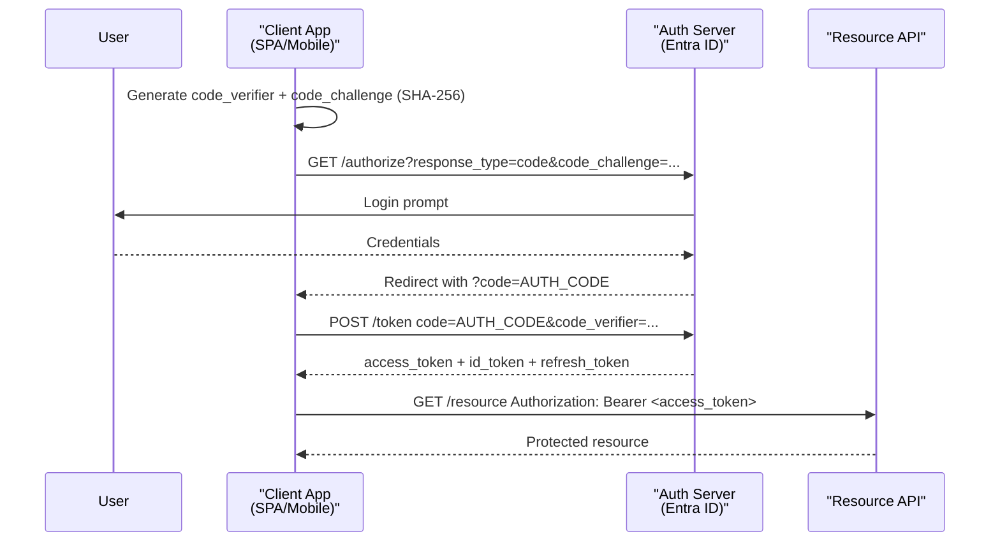
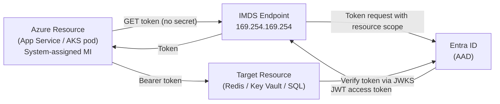

# 1. OAuth 2.0, OIDC, JWT and Session Security

> **TL;DR:** OAuth 2.0 delegates authorization; OIDC adds identity on top. JWTs are the bearer of claims — validate every field or you're exposed. Managed Identity removes secrets entirely for service-to-service.

**Interview weight:** P0 — Resume shows Managed Identity migration, RBAC/JIT platform, service-to-service auth. Expect deep questions on grant types, JWT pitfalls, and Managed Identity mechanics.

---

## Core Concepts

- **AuthN (Authentication)** — who are you? Verifying identity.
- **AuthZ (Authorization)** — what can you do? Checking permissions.
- **OAuth 2.0** — authorization delegation framework (not an authentication protocol).
- **OIDC (OpenID Connect)** — identity layer on top of OAuth 2.0; adds `id_token` and `/userinfo`.
- **JWT (JSON Web Token)** — compact, self-contained signed token format.
- **Managed Identity** — Azure-managed identity for a compute resource; token acquired from IMDS without any secrets.

---

## Session/Cookie Auth vs Token Auth

| Aspect | Session + Cookie | Token (JWT) |
| ------ | ---------------- | ----------- |
| State | Server-side session store | Stateless (claims in token) |
| Scalability | Sticky sessions or distributed store needed | Any node can validate |
| Revocation | Instant (delete session) | Hard (short expiry + denylist) |
| CSRF risk | **Yes** — cookies sent automatically | No (if stored in memory, not cookie) |
| XSS risk | Lower (`HttpOnly` cookie) | **Higher** if token in localStorage |
| Mobile support | Awkward | Natural (Authorization header) |
| Microservices | Requires session propagation | Self-contained bearer token |
| Use case | Traditional web app | SPA, mobile, microservices, APIs |

---

## Cookie Security Attributes

| Attribute | What it does | When to use |
| --------- | ------------ | ----------- |
| `HttpOnly` | JS cannot read the cookie | Always for session/auth cookies |
| `Secure` | Only sent over HTTPS | Always in production |
| `SameSite=Strict` | Never sent on cross-site requests | Highest CSRF protection; breaks OAuth redirects |
| `SameSite=Lax` | Sent on top-level navigation (GET), not sub-resource | Good default; allows OAuth redirect |
| `SameSite=None; Secure` | Sent always (cross-site) | Third-party iframes, embeds — requires `Secure` |
| `Domain` | Scope to domain + subdomains | Avoid unless subdomains need same session |
| `Path` | Scope to URL path prefix | Narrow exposure |
| `Max-Age` / `Expires` | Session vs persistent cookie | Prefer `Max-Age` |

---

## OAuth 2.0 Grant Types

| Grant | Actors | Access Token | Refresh Token | When to use |
| ----- | ------ | ------------ | ------------- | ----------- |
| **Authorization Code + PKCE** | User, browser/SPA/mobile, auth server | Yes | Yes | **Default for user-facing apps** |
| **Client Credentials** | Server, auth server (no user) | Yes | No | **Service-to-service** |
| **Device Code** | Headless device, auth server | Yes | Yes | CLI tools, IoT, TV apps |
| **Refresh Token** | Client, auth server | Yes (new) | Yes (rotated) | Renewing access without re-auth |
| ~~Implicit~~ | (deprecated) | — | — | **Never use** — token in URL fragment, no refresh |
| ~~ROPC~~ | (deprecated) | — | — | **Never use** — password passed to client |

### Authorization Code + PKCE Sequence



**PKCE** — Proof Key for Code Exchange. Prevents auth-code interception: client generates a random `code_verifier`, hashes it to `code_challenge`, sends hash with auth request. Token endpoint verifies original verifier — no stolen code can be exchanged without the verifier.

---

## OIDC on Top of OAuth 2.0

| Token | Purpose | Audience | Contents |
| ----- | ------- | -------- | -------- |
| **access_token** | API authorization | Resource API | scopes, roles, sub |
| **id_token** | User identity assertion | Client app only | sub, name, email, iat, exp |
| **refresh_token** | Renew access/id tokens | Auth server only | Opaque reference |

- **Scopes** — `openid profile email address` are standard OIDC scopes. `openid` scope triggers OIDC flow and `id_token` issuance.
- **UserInfo endpoint** — `GET /userinfo` with access token returns claims beyond what's in `id_token`.
- **Discovery document** — `/.well-known/openid-configuration` — lists all endpoints, supported algorithms, JWKS URI.

---

## JWT Anatomy

```
eyJhbGciOiJSUzI1NiIsInR5cCI6IkpXVCIsImtpZCI6ImFiYzEyMyJ9   ← Header (base64url)
.eyJzdWIiOiIxMjM0NTY3ODkwIiwibmFtZSI6IkFiaGlzaGVrIiwiYXVkIjoiYXBpOi8vbXlhcGkiLCJpc3MiOiJodHRwczovL2xvZ2luLm1pY3Jvc29mdG9ubGluZS5jb20vdGVuYW50aWQvdjIuMCIsImV4cCI6MTc1MDAwMDAwMCwiaWF0IjoxNzQ5OTk2NDAwLCJuYmYiOjE3NDk5OTY0MDB9   ← Payload (base64url)
.SIGNATURE   ← Signature
```

Decoded header: `{ "alg": "RS256", "typ": "JWT", "kid": "abc123" }`
Decoded payload: `{ "sub": "user-id", "iss": "https://login.microsoftonline.com/{tid}/v2.0", "aud": "api://myapi", "exp": 1750000000, "iat": 1749996400, "nbf": 1749996400, "name": "Abhishek", "roles": ["Reader"] }`

---

## Signing Algorithms

| Algorithm | Type | Key pair | Verification | Use case |
| --------- | ---- | -------- | ------------ | -------- |
| **HS256** | Symmetric HMAC | Shared secret | Any party with secret | Simple internal services; secret must be shared |
| **RS256** | Asymmetric RSA | Private (sign) / Public (verify) | Anyone with public key | **Standard for OIDC/OAuth** — public key downloadable from JWKS URI |
| **ES256** | Asymmetric ECDSA | Private (sign) / Public (verify) | Anyone with public key | Smaller tokens, higher perf than RSA; growing adoption |

**RS256/ES256 preferred** — private key stays secret on auth server; any API can verify with public JWKS without sharing secrets.

---

## JWT Validation Checklist

```csharp
// ASP.NET Core validates all of these via AddJwtBearer
services.AddAuthentication(JwtBearerDefaults.AuthenticationScheme)
    .AddJwtBearer(options =>
    {
        options.Authority = "https://login.microsoftonline.com/{tenantId}/v2.0";
        options.Audience  = "api://my-api-client-id";   // aud claim check
        options.TokenValidationParameters = new TokenValidationParameters
        {
            ValidateIssuer           = true,
            ValidateAudience         = true,
            ValidateLifetime         = true,   // exp + nbf
            ValidateIssuerSigningKey = true,   // signature via JWKS
            ClockSkew                = TimeSpan.FromSeconds(30)
        };
    });
```

| Check | What to verify | Failure means |
| ----- | -------------- | ------------- |
| **Signature** | HMAC/RSA/EC with correct key (via `kid` → JWKS lookup) | Tampered or forged token |
| **`iss`** | Matches expected issuer URL | Token from wrong auth server |
| **`aud`** | Contains your API's identifier | Token meant for a different service |
| **`exp`** | Current time < expiry | Expired token |
| **`nbf`** | Current time ≥ not-before | Token used too early |
| **`kid`** + JWKS rotation | Check signing key by `kid`; refresh JWKS on unknown `kid` | Key rollover support |
| **Clock skew** | Allow ≤ 60 s tolerance | Network/clock drift |

---

## Classic JWT Vulnerabilities

| Vulnerability | Description | Fix |
| ------------- | ----------- | --- |
| **`alg: none`** | Attacker strips signature, sets `"alg":"none"` | Never allow `none`; whitelist expected algorithms |
| **Algorithm confusion** | Attacker downgrades RS256 → HS256; API uses public key as HMAC secret | Explicitly pin algorithm; never use algorithm from header to select verification logic |
| **Missing `aud` check** | Token for API-B accepted by API-A | Always validate `aud` |
| **Weak HS256 secret** | Brute-forceable short secret | Use ≥ 256-bit cryptographically random secret |
| **No revocation** | Stolen token usable until expiry | Short expiry (5–15 min) + refresh token rotation; denylist for high-value ops |
| **localStorage storage** | XSS reads token → full account takeover | Store in memory or `HttpOnly` cookie |

---

## Token Lifetime Strategy

| Token | Recommended lifetime | Notes |
| ----- | -------------------- | ----- |
| Access token | 5 – 15 minutes | Short; limits stolen-token window |
| ID token | Same as access token | Not used for API calls; shorter is fine |
| Refresh token | Hours to days | Long-lived; must be rotated on use |

---

## Refresh Token Rotation and Reuse Detection

- On each refresh, issue new refresh token; invalidate old one.
- If old refresh token is presented again → **reuse detected** → revoke entire token family (detect theft).
- Store refresh token family in DB with a `family_id`; revoke family on reuse.

---

## Token Storage: Browser vs Mobile

| Storage | XSS risk | CSRF risk | Notes |
| ------- | -------- | --------- | ----- |
| `localStorage` | **High** — JS-readable | Low | Never for access tokens |
| `sessionStorage` | **High** | Low | Slightly better (tab-scoped) but still XSS risk |
| `HttpOnly` cookie | Low | **Yes** | Use `SameSite=Strict/Lax` + antiforgery for APIs |
| In-memory (JS variable) | Low | Low | Lost on page refresh; best for SPAs with refresh token in `HttpOnly` cookie |
| Native secure storage (mobile) | Very low | N/A | iOS Keychain / Android Keystore — best for mobile |

---

## mTLS and Service-to-Service Auth

- **mTLS** — both client and server present certificates; mutual authentication.
- Used in service mesh (Istio/Linkerd) for zero-trust pod-to-pod auth.
- Azure App Service supports mTLS; client cert forwarded via `X-ARR-ClientCert`.
- More complex to provision and rotate than Managed Identity; prefer MI where available.

---

## Managed Identity



| | System-assigned MI | User-assigned MI |
| - | ----------------- | ---------------- |
| Lifecycle | Tied to the Azure resource | Independent; reusable |
| Assignment | Auto on resource creation | Assign to multiple resources |
| Identity | 1 per resource | Can share across resources |
| Use case | Single service, simple | Multiple services needing same identity |

**Why it removes secrets:** Token acquired from IMDS (Azure metadata service, local IP, no network egress needed). No credentials in config, Key Vault, or environment variables. Token is short-lived; SDK refreshes automatically. Per-identity RBAC audit in Entra ID.

---

## SAML vs OIDC

| | SAML 2.0 | OIDC |
| - | -------- | ---- |
| Format | XML assertions | JSON / JWT |
| Transport | Browser POST redirect (form) | OAuth 2.0 redirect (HTTP) |
| Mobile support | Poor | Excellent |
| Age | 2005 | 2014 |
| Use case | Enterprise SSO, legacy IdPs | Modern apps, APIs, microservices |
| Azure | Supported (App registrations) | Preferred |

---

## Interview Questions

**Q1. What is the difference between OAuth 2.0 and OIDC?**
A: OAuth 2.0 is an authorization delegation framework — it issues access tokens that grant access to resources. It says nothing about who the user is. OIDC adds an authentication layer: it issues an `id_token` (JWT with user identity claims) and defines a `/userinfo` endpoint and discovery document. Use OAuth for access delegation; OIDC when you need to know who the user is.

**Q2. Why was the implicit grant deprecated?**
A: Tokens were returned in the URL fragment (hash), visible in browser history, server logs, and `Referer` headers. No refresh tokens. PKCE (which works with auth code) solves the same problem (public client safety) without token leakage. PKCE-enhanced auth code is strictly better.

**Q3. What is PKCE and why is it needed for SPAs/mobile?**
A: Public clients (SPA, mobile) can't securely store a client secret. PKCE proves the client that initiated the auth flow is the same one exchanging the code, using a one-time `code_verifier` that never travels over the network. An attacker who intercepts the auth code cannot exchange it — they don't have the verifier.

**Q4. Walk through JWT validation. What happens if you skip the `aud` check?**
A: Validation: verify signature with JWKS public key, check `iss`, check `aud`, check `exp`/`nbf` with clock skew, check `kid` for key rotation. If `aud` is skipped, a token issued for `api://service-a` will be accepted by `api://service-b` — horizontal privilege escalation. Service A can impersonate any user against Service B with its own valid token.

**Q5. What is the `alg:none` attack and how is it exploited?**
A: Some early JWT libraries honoured the `"alg":"none"` header value and skipped signature verification. An attacker modifies claims (e.g. `"roles":["admin"]`), sets `"alg":"none"`, removes the signature. Library accepts it. Fix: never allow `none` algorithm; whitelist only `RS256` or `ES256`; never derive verification logic from the token header alone.

**Q6. How do you revoke a JWT without a denylist?**
A: You can't fully revoke a stateless JWT before expiry. Mitigations: (1) very short access token lifetime (5–15 min) limits window; (2) refresh token rotation + reuse detection invalidates token family on theft detection; (3) token versioning — include a `version` claim, bump user's version in DB on logout/revoke, validate version on each request (adds a DB lookup). For truly instant revocation, maintain a Redis denylist keyed by `jti`.

**Q7. How does Managed Identity remove secrets from your Redis connection?**
A: App Service's system-assigned MI requests a token from IMDS (local to Azure fabric, no credentials needed). Token is scoped to `https://redis.azure.com`. StackExchange.Redis is configured with `DefaultAzureCredential`-based `TokenCredential`. Token refresh is automatic. Result: zero secrets in config or Key Vault for the cache connection.

**Q8. When would you use Client Credentials grant vs Managed Identity?**
A: Client Credentials = standard OAuth; client has a client_id + client_secret (or certificate). Works for non-Azure or cross-cloud. Managed Identity = Azure-specific; no credential at all — identity is the compute resource's Azure identity. Prefer Managed Identity for any Azure service-to-service communication; fall back to Client Credentials + certificate (not secret) for external identity providers.

**Q9. Where should SPAs store access tokens and why?**
A: Best practice: in-memory JS variable for the access token; refresh token in an `HttpOnly, Secure, SameSite=Strict` cookie. This way: XSS cannot steal the access token (not in DOM storage); CSRF is mitigated by `SameSite` cookie and short token lifetime. The page-refresh problem (in-memory token lost) is solved by the silent refresh using the `HttpOnly` refresh token cookie via a hidden iframe or background fetch.

**Q10. Senior: Design token revocation for a JIT access platform at scale.**
A: Short access token (5 min TTL). On JIT approval, issue token with elevated `roles` claim. On JIT expiry or manual revoke: (1) bump the user's `token_version` in a distributed cache (Redis); (2) middleware validates `token_version` claim against Redis on each request — adds ~1 ms per call; (3) revoke refresh token in the auth server. Trade-off: small per-request cache hit vs fully stateless. At very high scale, use a bloom filter for the denylist — fast negative check (not revoked), rare false positive prompts full DB check.

**Q11. What is refresh token rotation and how does reuse detection work?**
A: Each time a refresh token is used, a new refresh token is issued and the old one is invalidated. If the old (already-used) refresh token is presented again, it means either the client has a bug or the refresh token was stolen and used by an attacker. The server invalidates the entire token family (all refresh tokens for that session), forcing re-login. This is the RFC 6819 theft detection mechanism.

---

## Quick Recap

- **OAuth 2.0** = authorization delegation; **OIDC** = adds user identity on top.
- **Authorization Code + PKCE** = default for all public clients. Never use implicit or ROPC.
- **Client Credentials** = service-to-service; **Managed Identity** = Azure service-to-service (no secrets).
- **JWT validation**: signature → `iss` → `aud` → `exp`/`nbf` → clock skew. Skip any = vulnerability.
- **`alg:none`** and **missing `aud`** are the two most commonly missed JWT vulnerabilities.
- Short access tokens (5–15 min) + refresh rotation + reuse detection = revocation strategy.
- **`HttpOnly` cookie** = XSS-safe; **in-memory** = XSS-safe + CSRF-safe. Never localStorage for tokens.
