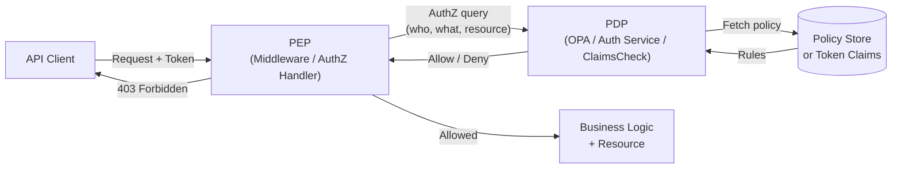

# 2. Authorization, RBAC, ABAC and Least Privilege

> **TL;DR:** Authorization is what you can do. Model it wrong and you get IDOR, privilege escalation, and tenant cross-contamination. The rule: tenant ID from the token, never from the request body.

**Interview weight:** P0 — Resume shows RBAC/JIT platform for 130+ devs across 10+ services. Deep questions on multi-tenancy, IDOR, and authorization architecture are expected.

---

## Core Concepts

- **RBAC (Role-Based Access Control)** — permissions tied to roles; users assigned roles.
- **ABAC (Attribute-Based Access Control)** — permissions derived from attributes of user, resource, environment.
- **ReBAC (Relationship-Based AC)** — permissions derived from graph relationships (Google Zanzibar style).
- **PBAC (Policy-Based AC)** — declarative policies evaluated at runtime (OPA/Cedar).
- **PEP (Policy Enforcement Point)** — where the authorization check happens (middleware, API handler).
- **PDP (Policy Decision Point)** — where the decision is made (OPA, authorization service, claims check).
- **IDOR (Insecure Direct Object Reference)** — user accesses resource by guessing its ID without ownership check.

---

## Authorization Model Comparison

| Model | How permissions work | Pros | Cons | Example |
| ----- | -------------------- | ---- | ---- | ------- |
| **RBAC** | Role → set of permissions | Simple, auditable, well-understood | Role explosion; coarse-grained | `Admin`, `Editor`, `Viewer` |
| **ABAC** | Policy evaluates user + resource attributes | Fine-grained, dynamic | Complex policy management; hard to audit | `if user.department == resource.department AND time.hour < 18` |
| **ReBAC** | Permissions from graph edges (owns, parent, member-of) | Natural for hierarchical resources | Expensive graph traversal; complex | Google Drive: share folder → children inherit |
| **PBAC** | Declarative policies (OPA Rego, Cedar) | Version-controlled, testable, centralized | Latency on eval; ops overhead | OPA policy for K8s admission |

---

## Roles vs Scopes vs Permissions vs Claims

| Concept | Defined by | Stored in | Example |
| ------- | ---------- | --------- | ------- |
| **Role** | App / Entra ID | Token `roles` claim or DB | `Publisher.Admin` |
| **Scope** | Auth server | Token `scp` claim | `articles.read`, `articles.write` |
| **Permission** | App authorization layer | DB role-permission mapping | `article:create`, `article:delete:own` |
| **Claim** | Auth server or app | JWT payload | `sub`, `email`, `tenant_id`, `roles` |

**Scopes** are what the client (OAuth app) is allowed to do on behalf of the user. **Roles** are what the user is allowed to do. Both land in the token; the API checks both.

---

## Role Explosion Problem

When roles proliferate to encode every permission combination: `Publisher.Admin.Region.NA.ContentType.Video`. Signs:
- New feature requires a new role.
- Hundreds of roles in the directory.
- Developers can't remember which role allows what.

**Solutions:**
- Decompose into fine-grained permissions; roles are just named bundles.
- Use ABAC or policy attributes to reduce role count.
- Add resource-level context (scope to a specific resource instance via resource-based authorization).

---

## Permission Modeling and Sample Schema

```sql
-- Simplified RBAC schema
Users       (id, tenant_id, email)
Roles       (id, tenant_id, name)
Permissions (id, resource_type, action)        -- e.g. 'Article', 'Create'
RolePermissions (role_id, permission_id)
UserRoles   (user_id, role_id, granted_by, expires_at)  -- expires_at supports JIT
```

Resource-based: add `resource_id` column to `UserRoles` for per-instance grants.

---

## Resource-Based Authorization in ASP.NET Core

```csharp
// Handler checks ownership before allowing edit
public class ArticleEditRequirement : IAuthorizationRequirement { }

public class ArticleAuthorizationHandler
    : AuthorizationHandler<ArticleEditRequirement, Article>
{
    protected override Task HandleRequirementAsync(
        AuthorizationHandlerContext ctx,
        ArticleEditRequirement requirement,
        Article article)
    {
        var userId = ctx.User.FindFirstValue(ClaimTypes.NameIdentifier);
        if (article.AuthorId == userId ||
            ctx.User.IsInRole("Publisher.Admin"))
            ctx.Succeed(requirement);
        return Task.CompletedTask;
    }
}
```

---

## Multi-Tenant Isolation Strategies

| Strategy | Description | Pros | Cons | When |
| -------- | ----------- | ---- | ---- | ---- |
| **Separate databases** | One DB per tenant | Strongest isolation | High infra cost, operational overhead | Regulated tenants (HIPAA, financial) |
| **Separate schemas** | One schema per tenant in shared DB | Good isolation, moderate cost | Schema migration complexity | Mid-size SaaS |
| **Row-level security (RLS)** | `tenant_id` column + DB RLS policy | Single DB, low cost | RLS bug = total exposure | High-scale multi-tenant, Cosmos DB partition key |
| **Application-level filtering** | Every query includes `WHERE tenant_id = @tid` | Flexible | Easy to forget one query | Small teams with discipline |

### The Golden Rule

> **Always derive `tenant_id` from the validated token claims, never from the request body, URL, or headers that the caller controls.**

```csharp
// CORRECT — tenant_id from token
var tenantId = User.FindFirstValue("tenant_id");
var articles = await repo.GetArticlesAsync(tenantId, articleId);

// WRONG — attacker can supply any tenant_id
var tenantId = Request.Query["tenantId"];  // Never do this
```

---

## IDOR / Broken Object-Level Authorization

**Pattern:** `GET /articles/9999` — server returns article 9999 even if it belongs to another tenant/user.

**Systematic prevention:**
1. Always join on `tenant_id` (from token) in every data query.
2. Use resource-based authorization handlers (see above) — check ownership after fetch.
3. Integration tests: create resource as user A; attempt access as user B; assert 403.
4. Never trust integer IDs in URLs for access control alone — use UUIDs + ownership check.

---

## Policy Enforcement Point vs Policy Decision Point



- **PEP** in ASP.NET Core = `[Authorize]` attribute + `IAuthorizationService`.
- **PDP** can be inline (claims check) or external (OPA sidecar, Azure PIM, dedicated auth service).
- Separating PEP and PDP enables centralized, versioned, testable policy.

---

## Centralized Authorization Services

| Service | Language | Model | Strength |
| ------- | -------- | ----- | -------- |
| **OPA (Open Policy Agent)** | Rego DSL | PBAC | K8s admission, API gateways; version-controlled policies |
| **Cedar (AWS)** | Cedar DSL | PBAC / ABAC | Human-readable; formally verified; Amazon Verified Permissions |
| **Google Zanzibar** | Tuple-based ReBAC | ReBAC | Google-scale hierarchical permissions; SpiceDB/Authzed OSS clone |
| **Azure PIM** | Azure portal / API | RBAC + JIT | Built-in for Azure resources; UI-driven approval workflows |

---

## Principle of Least Privilege

- Grant only the minimum permissions needed for a task.
- Time-bound: elevated permissions expire.
- Scope-bound: grant to a specific resource, not all resources of that type.
- Review and prune regularly.
- Applies to: users, service accounts, managed identities, CI/CD pipelines, DB connections.

---

## JIT (Just-In-Time) Elevated Access

| Aspect | Description |
| ------ | ----------- |
| **Problem it solves** | Standing admin access is a constant attack surface |
| **Mechanism** | Request elevated role → approval workflow → time-bounded grant → auto-expire |
| **Azure tool** | Azure PIM (Privileged Identity Management) |
| **Token integration** | Elevated role included in token only during JIT window; expires with session |
| **Audit** | Every JIT activation logged with requester, approver, duration, justification |
| **Break-glass** | Emergency account bypasses JIT approval; extremely restricted; fully audited |

```
JIT Flow:
Dev → Request role "Publisher.Admin" for 2 hours (reason: incident)
   → Manager approval (Slack/Teams notification)
   → Azure PIM activates role
   → Token contains "Publisher.Admin" for 2h
   → Auto-revoke at expiry
   → Audit log: who, when, why, what they did
```

**Resume talking point:** Built the Internal Developer Productivity Platform with JIT access. 130+ devs. Approval workflow integrated into Teams. Roles auto-expired; no standing admin. Audit trail fed into SIEM.

---

## Separation of Duties

- No single person can complete a high-risk action alone (e.g. approve a payment AND release funds).
- In code: same user cannot both create and approve a resource operation.
- In deployment: separate roles for "push code" and "deploy to production".

---

## Service-to-Service Authorization

| Method | Mechanism | Secret? | Notes |
| ------ | --------- | ------- | ----- |
| **Managed Identity** | Azure IMDS token | No | Best for Azure services |
| **Client Credentials (certificate)** | Cert-bound token | Private key (cert) | Cross-cloud / non-Azure |
| **mTLS** | Mutual TLS cert | Cert | Service mesh (Istio) |
| **API Key** | Static shared key in header | Yes | Avoid; hard to rotate; no identity |

---

## On-Behalf-Of (OBO) Flow

When Service A needs to call Service B with the original user's identity:
```
User → Service A (with user token) → Service A exchanges token for OBO token → Service B
```
OBO token contains the user's identity + Service A's assertion. Service B can enforce user-level permissions even through service-to-service calls.

---

## Audit Logging of Authorization Decisions

Every authorization decision (allow or deny) should log:
- `who` — `sub` from token, service identity.
- `what` — resource type + ID + action.
- `why allowed/denied` — which policy/role matched.
- `when` — timestamp.
- `where` — service name, pod, region.

Use structured logging (Serilog/Application Insights). Feed into SIEM for anomaly detection.

---

## Interview Questions

**Q1. RBAC vs ABAC — when do you choose each?**
A: RBAC when permission model is stable and coarse-grained (roles like Admin/Viewer work). ABAC when you need fine-grained contextual control (time-of-day, resource attributes, user department). ABAC is more flexible but harder to audit and reason about. Hybrid is common: RBAC for coarse roles, ABAC attributes for fine-grained policies within a role.

**Q2. What is IDOR and how do you prevent it systematically?**
A: IDOR = Insecure Direct Object Reference. User changes an ID in the URL and accesses another user's resource. Prevent: (1) always join tenant/owner ID (from token) in every query, (2) resource-based authorization handlers check ownership after fetch, (3) integration tests that assert cross-user/cross-tenant access returns 403, (4) never trust IDs from the request for access control.

**Q3. Why is `tenant_id` from the request body dangerous?**
A: The caller controls the request body. An attacker can set `tenant_id` to any value and access other tenants' data. The token is signed and trusted — `tenant_id` from the token claim cannot be forged. This is the foundation of multi-tenant data isolation.

**Q4. What is role explosion and how do you fix it?**
A: Role explosion is when you create a new role for every permission combination, making the role catalog unmaintainable. Fix: decompose roles into fine-grained permissions; roles are named bundles of permissions. Use resource-scoped grants (e.g. Editor on Article 42 specifically) instead of a new `Editor.Article42` role. Add ABAC attributes for contextual constraints.

**Q5. Explain the OPA PEP/PDP separation and its benefits.**
A: PEP enforces the decision (middleware calls `IsAuthorized(user, action, resource)`). PDP makes the decision (OPA evaluates policy). Separation means: policy is version-controlled in Git, testable independently, can be updated without redeploying services, and auditable. Multiple services share one PDP — consistent policy enforcement across the platform.

**Q6. How do you design JIT access for an internal developer platform?**
A: Standing access only to non-sensitive dev environments. Elevated access (production deployments, admin ops) requires JIT: request with justification → automated or human approval (≤ 5 min via Teams approval card) → time-bounded role activation (Azure PIM or custom) → token contains elevated role only for that window → auto-revoke. Full audit log. Break-glass accounts for P0 incidents, dual-approval required. This is exactly what I built for 130+ devs.

**Q7. How does mTLS provide service-to-service authorization?**
A: Both services present certificates. The receiving service validates the client certificate against its trust store. The certificate's CN or SAN identifies the calling service. This provides mutual authentication — Service A knows it's talking to Service B and vice versa. In a service mesh (Istio), mTLS is handled transparently at the sidecar layer. Certificates rotate automatically.

**Q8. What is the On-Behalf-Of flow and when do you need it?**
A: When a middle-tier service needs to call a downstream API with the original user's identity (not the service's identity). Service A holds the user's access token, exchanges it via OBO grant for a new token scoped to the downstream API. The downstream API can enforce user-level permissions. Required when authorization semantics must propagate through service chains.

**Q9. Senior: How would you implement RBAC + JIT for a 500-service platform?**
A: Centralize authorization: (1) roles/permissions in a shared authorization service backed by a DB with `UserRoles(user_id, role_id, resource_id, expires_at)`. (2) JIT requests through a workflow engine (Azure Logic Apps or custom). (3) On JIT approval, insert a row with `expires_at = now + requested_duration`. (4) Token includes active roles from the service (short-lived token = self-healing). (5) PEP in each service calls authorization service via sidecar or SDK. (6) Audit log every call. (7) Background job prunes expired rows. (8) OPA for complex policy evaluation; simple role checks inline.

**Q10. How do you prevent privilege escalation in resource-based authorization?**
A: (1) Users cannot grant themselves permissions — grants must come from a higher-privileged user or automated approval. (2) Permission to grant a role cannot exceed the grantor's own permissions (no "granting admin without being admin"). (3) Separation of duties: the user who requests a role cannot self-approve it. (4) Audit every grant operation. (5) Regular access reviews (quarterly) to prune stale permissions.

**Q11. What is ReBAC and when does it win over RBAC?**
A: Relationship-Based AC models permissions as graph relationships (user → owns → document; user → member-of → group → has-access → folder). It naturally handles hierarchical resources (share a folder → all children inherit). Wins when: permission inheritance through hierarchies, sharing models (Google Drive-style), cross-tenant delegation. RBAC gets unwieldy for these cases. Google Zanzibar and SpiceDB implement this.

---

## Quick Recap

- **RBAC** = role bundles; **ABAC** = attribute policies; **ReBAC** = graph edges; **PBAC** = declarative rules.
- **`tenant_id` always from token**, never request body — this is the multi-tenant isolation foundation.
- **IDOR prevention**: ownership check on every data fetch, not just auth check at the endpoint.
- **JIT access** = no standing admin; time-bounded elevation; approval workflow; full audit.
- **PEP** enforces, **PDP** decides — separate them for testable, version-controlled authorization.
- **Least privilege** + **separation of duties** = access surface minimization.
- Resource-based authorization in ASP.NET Core: `IAuthorizationService` + custom `AuthorizationHandler<R,T>`.
