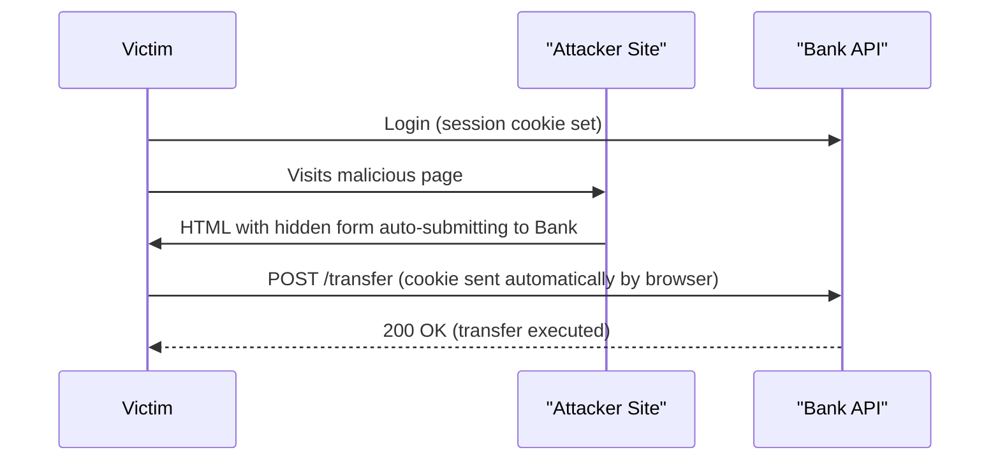
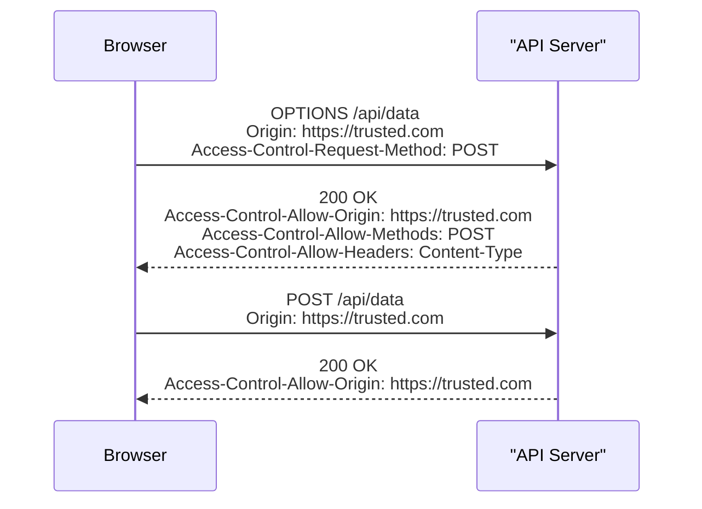

# 3. OWASP Top 10 and Application Security

> **TL;DR:** The OWASP Top 10 is the minimal threat model for every production web app. SQL injection, XSS, CSRF, CORS, and SSRF are the ones interviewers go deep on. Know the attack, the .NET-specific mitigation, and the residual risks.

**Interview weight:** P0 — Expected to know every item at conceptual level; go deep on injection, XSS, CSRF, CORS.

---

## Core Concepts

- **OWASP (Open Web Application Security Project)** — non-profit producing the industry-standard threat catalog.
- **Input validation** — allowlist (accept only known-good) beats denylist (block known-bad).
- **Output encoding** — escape data before inserting into an output context (HTML, SQL, URL, JSON).
- **Defence in depth** — multiple independent controls; no single point of failure.

---

## OWASP Top 10 (2021)

| # | Risk | What it is | Concrete example | .NET-specific mitigation |
| - | ---- | ---------- | ---------------- | ------------------------- |
| A01 | **Broken Access Control** | IDOR, missing authz checks | `GET /users/42` returns user 99's data | Resource-based authorization; tenant_id from token |
| A02 | **Cryptographic Failures** | Weak algorithms, plaintext secrets | MD5 passwords, HTTP, secrets in config | Use AES-GCM, TLS 1.2+, Azure Key Vault |
| A03 | **Injection** | SQL/NoSQL/OS/LDAP/HTML injection | `'; DROP TABLE users--` | Parameterized queries, EF Core, input validation |
| A04 | **Insecure Design** | Architecture lacks security controls | No rate limiting, no anti-fraud | Threat modeling (STRIDE), security requirements, design review |
| A05 | **Security Misconfiguration** | Default credentials, verbose errors, CORS `*` | Stack traces in prod responses | `UseDeveloperExceptionPage()` only in dev; `app.UseExceptionHandler("/error")` |
| A06 | **Vulnerable & Outdated Components** | Known CVEs in dependencies | `log4j` RCE, NuGet packages with CVEs | `dotnet list package --vulnerable`; CVE triage process |
| A07 | **Auth & Session Failures** | Weak passwords, no MFA, session fixation | Brute-force login, stolen session cookie | Strong JWT validation, MFA, `HttpOnly Secure SameSite` cookies |
| A08 | **Software & Data Integrity Failures** | Unsigned packages, insecure deserialization | Auto-update without signature verification | Verify package checksums; avoid `BinaryFormatter`; use safe deserializers |
| A09 | **Security Logging Failures** | No logs, no alerting, logs contain PII | Failed logins not alerted; passwords logged | Structured logging (Serilog), alert on anomalies, scrub PII |
| A10 | **SSRF** | Server fetches attacker-controlled URL | Fetch `http://169.254.169.254/metadata` | Allowlist outbound destinations; block metadata IP |

---

## SQL Injection

### Vulnerable vs Parameterized

```csharp
// VULNERABLE — string interpolation builds SQL
var sql = $"SELECT * FROM Users WHERE Username = '{username}'";
// Attacker input: admin' OR '1'='1
// Resulting query: SELECT * FROM Users WHERE Username = 'admin' OR '1'='1'

// SAFE — parameterized query
var user = await context.Users
    .Where(u => u.Username == username)   // EF Core generates parameterized SQL
    .FirstOrDefaultAsync();

// SAFE — raw SQL with parameters
var user = await context.Users
    .FromSqlRaw("SELECT * FROM Users WHERE Username = {0}", username)
    .FirstOrDefaultAsync();
```

**Second-order injection** — user input stored in DB (safely), later retrieved and concatenated into a query. Example: user sets username to `admin'--`; later an admin page searches `WHERE Username = '{stored_username}'`. Fix: parameterize everywhere, not just at input time.

**ORM false sense of safety** — EF Core is safe for LINQ queries but `FromSqlRaw` + string interpolation is vulnerable. Use `FromSqlInterpolated` (safe) or `@{0}` placeholders in `FromSqlRaw`.

**Stored-proc myth** — stored procedures don't prevent injection if they build dynamic SQL internally (`EXEC('SELECT ... WHERE id = ' + @id)`). Parameterized stored procs are safe; dynamic SQL inside them is not.

---

## XSS (Cross-Site Scripting)

| Type | Mechanism | Example | Impact |
| ---- | --------- | ------- | ------ |
| **Stored** | Malicious script persisted in DB, rendered for all users | Comment field contains `<script>document.cookie='...'</script>` | Account takeover at scale |
| **Reflected** | Input echoed in response without encoding | `GET /search?q=<script>alert(1)</script>` | Phishing link executes script |
| **DOM-based** | JS reads from DOM/URL and writes to DOM unsafely | `document.getElementById('x').innerHTML = location.hash` | Client-side only; no server involvement |

**Mitigations:**
- **Razor auto-encodes** all `@variable` output — safe by default.
- `@Html.Raw(value)` bypasses encoding — **only** for trusted, sanitized content.
- `HtmlEncoder.Default.Encode(input)` for manual encoding.
- **Content Security Policy (CSP)** header prevents inline script execution.

```csharp
// Safe — Razor auto-encodes
<p>@Model.UserInput</p>

// DANGEROUS
<p>@Html.Raw(Model.UserInput)</p>
```

---

## CSRF (Cross-Site Request Forgery)

### How It Works

An attacker tricks a victim's browser into sending a forged request to a site where the victim is authenticated. The browser automatically sends the session cookie.



**Why token-based APIs are usually immune:** `Authorization: Bearer <token>` is not sent automatically by the browser; it must be explicitly set by JS. No JS on attacker's page can read the victim's token (SameSite + CORS prevent cross-origin reads).

**Mitigations:**
- **Antiforgery tokens** — synchronizer token pattern. ASP.NET Core `[ValidateAntiForgeryToken]`.
- **SameSite=Strict** cookie — browser never sends cookie on cross-site requests.
- **Double-submit cookie** — CSRF token in both cookie and request body.

```csharp
// ASP.NET Core — MVC auto-includes antiforgery on forms; validate on controller
[HttpPost]
[ValidateAntiForgeryToken]
public async Task<IActionResult> Transfer(TransferModel model) { ... }

// Minimal API equivalent
builder.Services.AddAntiforgery();
app.UseAntiforgery();
```

---

## CORS (Cross-Origin Resource Sharing)

**Why it exists:** browsers block cross-origin JS requests by default (Same-Origin Policy). CORS lets a server whitelist trusted origins.

### Preflight Sequence



**Simple requests** (GET/POST with simple content types) skip preflight but still include `Origin`; server must respond with correct `Access-Control-Allow-Origin`.

| Header | Purpose |
| ------ | ------- |
| `Access-Control-Allow-Origin` | Allowed origin(s); never `*` with credentials |
| `Access-Control-Allow-Methods` | Allowed methods |
| `Access-Control-Allow-Headers` | Allowed request headers |
| `Access-Control-Allow-Credentials: true` | Allow cookies/auth headers |
| `Access-Control-Expose-Headers` | Headers JS can read in response |
| `Access-Control-Max-Age` | Preflight cache TTL (seconds) |

**Critical rule:** `AllowAnyOrigin()` + `AllowCredentials()` is **invalid** — ASP.NET Core throws an exception. Browsers also reject it. You cannot allow all origins AND send cookies.

**Common misconfigurations:**
```csharp
// WRONG — allows all origins + credentials (throws exception)
policy.AllowAnyOrigin().AllowCredentials();

// WRONG — reflects Origin header without validation
var allowedOrigin = Request.Headers["Origin"]; // never do this
Response.Headers["Access-Control-Allow-Origin"] = allowedOrigin;

// CORRECT — explicit allowlist
policy.WithOrigins("https://app.contoso.com", "https://staging.contoso.com")
      .AllowAnyMethod()
      .AllowAnyHeader()
      .AllowCredentials();
```

---

## SSRF (Server-Side Request Forgery)

**Attack:** user supplies a URL; server fetches it → attacker points to `http://169.254.169.254/metadata/identity/...` (Azure IMDS) or internal services.

**Mitigations:**
- Allowlist of permitted outbound domains/IPs.
- Block link-local ranges: `169.254.0.0/16` (IMDS), `10.0.0.0/8`, `172.16.0.0/12`, `192.168.0.0/16`.
- Disable redirects or validate redirect destinations.
- Network-level: egress firewall rules on AKS/VNET.

```csharp
// URL validation before fetching
private static readonly HashSet<string> AllowedHosts = ["api.partner.com", "cdn.trusted.com"];

bool IsSafeUrl(string url)
{
    if (!Uri.TryCreate(url, UriKind.Absolute, out var uri)) return false;
    if (uri.Scheme is not "https") return false;
    return AllowedHosts.Contains(uri.Host);
}
```

---

## Insecure Deserialization

- **`BinaryFormatter`** — arbitrary code execution via crafted payloads. **Removed in .NET 9; never use.**
- **`JavaScriptSerializer` / `Newtonsoft.Json` TypeNameHandling** — enables polymorphic deserialization → gadget chains.
- **Safe alternatives:** `System.Text.Json` (no type handling by default), explicit `JsonSerializerOptions`.

```csharp
// DANGEROUS — allows arbitrary type instantiation
var options = new JsonSerializerOptions { ... };
// Newtonsoft: TypeNameHandling.All = dangerous

// SAFE — explicit known type
var model = JsonSerializer.Deserialize<MyModel>(json);
```

---

## Mass Assignment / Over-Posting

User submits extra fields that get bound to a model with sensitive properties.

```csharp
// DANGEROUS — binds all request fields including IsAdmin
public async Task<IActionResult> Update([FromBody] User user) { ... }

// SAFE — use a dedicated DTO without sensitive properties
public async Task<IActionResult> Update([FromBody] UpdateUserDto dto) { ... }

// Or allowlist bound properties
[BindProperties(SupportsGet = false)]
public class UpdateUserDto { public string Name { get; set; } }
```

---

## Security Headers

| Header | Value | Purpose |
| ------ | ----- | ------- |
| `Content-Security-Policy` | `default-src 'self'; script-src 'self' 'nonce-{n}'` | Prevent XSS by restricting script sources |
| `Strict-Transport-Security` | `max-age=31536000; includeSubDomains` | Force HTTPS for 1 year |
| `X-Content-Type-Options` | `nosniff` | Prevent MIME-type sniffing |
| `X-Frame-Options` | `DENY` or `SAMEORIGIN` | Prevent clickjacking (legacy; CSP `frame-ancestors` preferred) |
| `Referrer-Policy` | `strict-origin-when-cross-origin` | Limit URL exposure in Referer |
| `Permissions-Policy` | `geolocation=(), camera=()` | Disable unused browser features |

```csharp
// ASP.NET Core — add security headers in middleware
app.Use(async (context, next) =>
{
    context.Response.Headers.Append("X-Content-Type-Options", "nosniff");
    context.Response.Headers.Append("X-Frame-Options", "DENY");
    context.Response.Headers.Append("Referrer-Policy", "strict-origin-when-cross-origin");
    context.Response.Headers.Append("Permissions-Policy", "geolocation=(), camera=()");
    await next();
});
// Use NWebSec or OWASP Headers NuGet for complete CSP management
```

---

## Rate Limiting as a Security Control

- Prevents brute-force (login, password reset, OTP).
- Prevents credential stuffing.
- Reduces impact of scraping and enumeration attacks.

```csharp
// ASP.NET Core .NET 7+ built-in rate limiter
builder.Services.AddRateLimiter(options =>
    options.AddFixedWindowLimiter("login", cfg =>
    {
        cfg.Window = TimeSpan.FromMinutes(5);
        cfg.PermitLimit = 10;
        cfg.QueueLimit = 0;
    }));

app.MapPost("/auth/login", LoginHandler)
   .RequireRateLimiting("login");
```

---

## Secure Error Handling

- Never expose stack traces, inner exceptions, SQL errors, or file paths in production responses.
- Return generic `500 Internal Server Error` or `400 Bad Request`; log the details internally.
- Use `app.UseExceptionHandler("/error")` in production; `app.UseDeveloperExceptionPage()` in dev only.

---

## Secure Code Review Checklist

| Category | Check |
| -------- | ----- |
| Injection | All DB queries parameterized; no string concatenation into SQL |
| Auth | All endpoints have `[Authorize]`; public endpoints explicitly marked `[AllowAnonymous]` |
| AuthZ | Resource-based checks in handlers; tenant_id from token |
| Input validation | Model validation (`[Required]`, `[MaxLength]`); allowlist input patterns |
| Output encoding | No `@Html.Raw` without sanitization; explicit encoding elsewhere |
| CSRF | Antiforgery tokens on state-changing forms; `SameSite` cookies |
| CORS | Explicit origin allowlist; no `AllowAnyOrigin + AllowCredentials` |
| Secrets | No secrets in source code, config files, or logs |
| Headers | Security headers applied; `X-Content-Type-Options`, HSTS, CSP |
| Logging | No PII in logs; sensitive operations logged; errors don't leak internals |
| Dependencies | No packages with known high/critical CVEs |
| Deserialization | No `BinaryFormatter`; no `TypeNameHandling.All` |
| Error handling | Generic errors in prod; details only in structured logs |
| TLS | HTTPS enforced; TLS 1.2+; HSTS enabled |
| Mass assignment | DTOs used; not binding domain entities directly |

---

## Interview Questions

**Q1. What is the most common OWASP Top 10 issue in enterprise .NET apps?**
A: Broken Access Control (A01). Missing authorization checks on endpoints, IDOR via guessable IDs, missing tenant isolation in multi-tenant APIs. It's often missed because auth**N** is configured correctly but auth**Z** (resource-level ownership) is not enforced.

**Q2. Explain second-order SQL injection.**
A: Input is stored safely (parameterized) but later retrieved and concatenated into a SQL query. Example: username `admin'--` is stored safely; an admin search feature later runs `"SELECT ... WHERE name = '" + username + "'"`. The injection fires at read time, not write time. Fix: parameterize everywhere in the codebase, not just at the entry point.

**Q3. What does Razor's `@Html.Raw` do and why is it dangerous?**
A: `@Html.Raw` bypasses Razor's automatic HTML encoding and outputs the value verbatim. If the value contains user-controlled content, it enables stored/reflected XSS. Should only be used for pre-sanitized HTML (e.g. Markdown rendered server-side with a sanitizer like HtmlSanitizer NuGet).

**Q4. How does CSRF work and why don't bearer-token APIs need antiforgery tokens?**
A: CSRF exploits the browser automatically sending cookies on cross-site requests. Antiforgery token = a secret embedded in the form that the attacker's page cannot read (same-origin policy blocks cross-origin reads). APIs using `Authorization: Bearer <token>` are immune because the browser never auto-sends the `Authorization` header — JS must explicitly set it, and cross-origin JS is blocked by CORS.

**Q5. What is the difference between CORS and CSP?**
A: CORS = server tells the browser which origins can read the response to cross-origin requests. CSP = server tells the browser which sources are allowed for scripts, styles, images, etc. CORS protects APIs from cross-origin reads; CSP prevents XSS by restricting script execution sources. Both are response headers; both work in the browser only.

**Q6. Why is `AllowAnyOrigin().AllowCredentials()` invalid?**
A: The CORS spec forbids `Access-Control-Allow-Origin: *` with `Access-Control-Allow-Credentials: true` — browsers reject it. ASP.NET Core throws an exception if you configure this combination. You must specify explicit origins when credentials (cookies, auth headers) are involved.

**Q7. How would you prevent SSRF in a service that fetches user-supplied URLs?**
A: (1) Allowlist of permitted domains — reject anything not on the list. (2) Resolve DNS and validate resolved IP doesn't fall in private/link-local ranges. (3) Follow redirects with caution — validate each hop. (4) Network-level egress rules (VNET NSG) to block metadata IPs. (5) Disable redirects entirely if not needed. Key insight: block `169.254.169.254` to prevent Azure IMDS token theft.

**Q8. What is mass assignment and how do you prevent it in ASP.NET Core?**
A: Model binding maps all incoming request fields to a model. If the model has an `IsAdmin` property, an attacker adds `"isAdmin": true` to the JSON body. Prevention: use separate DTOs for input that contain only the fields the user is allowed to set; never bind domain entities directly. Alternatively, use `[BindNever]` on sensitive properties.

**Q9. Senior: How do you implement a Content Security Policy for an SPA?**
A: Start with `default-src 'self'`. Add specific sources for CDN, fonts, analytics. Use `script-src 'nonce-{random}'` — each request gets a fresh nonce; inline scripts must include the nonce attribute. Avoid `unsafe-inline` and `unsafe-eval`. Set `report-uri` to collect CSP violations before enforcing (`Content-Security-Policy-Report-Only` during rollout). Test thoroughly — CSP breaks third-party widgets that inject scripts.

**Q10. What is clickjacking and how do you prevent it?**
A: Attacker embeds your site in a transparent iframe on their page; user thinks they're clicking their page but actually clicks your UI (e.g. "Like" or "Transfer"). Prevention: `X-Frame-Options: DENY` (legacy) or CSP `frame-ancestors 'none'` (modern, more expressive). `frame-ancestors` takes precedence when both are present.

**Q11. Walk me through a full secure-code review of a new API endpoint.**
A: Check the checklist: (1) Is it `[Authorize]` or intentionally `[AllowAnonymous]`? (2) Are all DB queries parameterized? (3) Is the resource ownership checked (not just authentication)? (4) Does input have validation attributes? (5) Are there any string-interpolated SQL or HTML outputs? (6) Does it accept file uploads — size limit, extension allowlist, no path traversal? (7) Does it log PII? (8) Does error response leak internals? (9) Is rate limiting applied if it's auth or sensitive? (10) Any new packages — any known CVEs?

**Q12. Senior: You discover a Stored XSS in a high-traffic page. What's your incident response?**
A: (1) Immediately disable or WAF-block the affected endpoint. (2) Assess blast radius: how many users saw the malicious content? What could the script do (cookie theft, keylogging, crypto mining)? (3) Purge all cached versions (CDN, in-proc). (4) Rotate any potentially stolen session tokens. (5) Fix: sanitize the stored content; fix the output encoding bug in code. (6) Deploy fix through expedited pipeline. (7) Post-mortem: how did it pass code review and SAST? Add test case. Enable WAF XSS rules.

---

## Quick Recap

- **SQL injection**: parameterized queries everywhere; `EF Core LINQ` = safe; `FromSqlRaw` + interpolation = dangerous.
- **XSS**: Razor auto-encodes `@variable`; `@Html.Raw` = danger; add CSP header.
- **CSRF**: antiforgery token on state-changing forms; `SameSite=Lax` cookies; Bearer APIs don't need it.
- **CORS**: explicit origin allowlist; `AllowAnyOrigin + AllowCredentials` = invalid.
- **SSRF**: allowlist outbound URLs; block IMDS IP `169.254.169.254`.
- **Mass assignment**: input DTOs only; never bind domain entities directly.
- **Secure headers**: HSTS, CSP, `X-Content-Type-Options: nosniff`, `X-Frame-Options: DENY`.
- **Rate limiting** on auth endpoints to prevent brute-force and credential stuffing.
