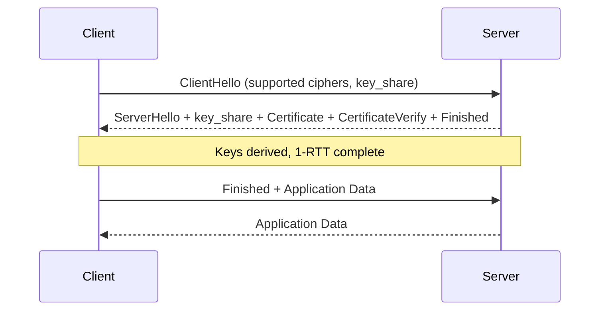

# 4. Cryptography, Secrets and Supply Chain

> **TL;DR:** Encryption protects data; hashing verifies integrity; secrets must never be in source control. Azure Key Vault + Managed Identity eliminates secrets. CVE remediation at 600+ microservice scale requires a triage process, not heroics.

**Interview weight:** P0 — Resume shows Managed Identity (Terraform), CVE remediation across 600+ services. Expect questions on key management, password hashing, TLS, and your remediation process.

---

## Core Concepts

- **Symmetric encryption** — same key encrypts and decrypts. Fast. Key distribution is the problem.
- **Asymmetric encryption** — public key encrypts; private key decrypts. Solves key distribution; slow.
- **Hashing** — one-way transformation; no key; no decryption. Used for integrity, fingerprinting, password storage.
- **HMAC** — keyed hash; combines a secret key with the message; proves both integrity and authenticity.
- **Encoding** — reversible representation change (Base64, URL encoding); no security; not encryption.
- **Envelope encryption** — encrypt data with a data key (DEK); encrypt DEK with a key-encryption key (KEK) stored in HSM.

---

## Hashing vs Encryption vs Encoding

| | Hashing | Encryption | Encoding |
| - | ------- | ---------- | -------- |
| Reversible? | No | Yes (with key) | Yes (always) |
| Key required? | No (keyed: HMAC yes) | Yes | No |
| Purpose | Integrity, fingerprint, password storage | Confidentiality | Transport/representation |
| Examples | SHA-256, bcrypt, Argon2 | AES-GCM, RSA | Base64, URL encoding |
| "Decryptable"? | No | Yes | Yes |
| Interview trap | "We hash passwords with MD5" = insecure hashing, not encryption | "We encrypt passwords" = wrong model (can't verify without decrypt) | "We base64 encode tokens" = not secure |

---

## Symmetric vs Asymmetric Encryption

| | Symmetric (AES) | Asymmetric (RSA/ECDH) |
| - | --------------- | --------------------- |
| Keys | Same key both sides | Public + private key pair |
| Speed | **Fast** (hardware AES-NI) | 100–1000× slower |
| Key distribution | Hard (shared secret problem) | Easy (public key is public) |
| Key size | 128 or 256 bits (AES) | RSA 2048–4096 bits; EC 256 bits |
| Use for | Bulk data encryption | Key exchange, digital signatures, TLS handshake |
| .NET | `AesGcm`, `Aes.Create()` | `RSA.Create()`, `ECDsa.Create()` |

**AES modes:**
| Mode | Authenticated? | IV/Nonce | Parallelizable | Notes |
| ---- | ------------- | --------- | -------------- | ----- |
| ECB | No | No | Yes | **Never use** — identical plaintext → identical ciphertext |
| CBC | No | Yes (random) | Decrypt only | Padding oracle attacks; avoid for new code |
| **GCM** | **Yes** | Yes (nonce) | Yes | **Standard choice** — provides AEAD; detects tampering |
| CTR | No | Yes | Yes | Add HMAC separately |

**Use AES-256-GCM** — authenticated encryption; any ciphertext tampering is detected; no padding oracle.

---

## Key Sizes (Recommended Minimums)

| Algorithm | Minimum | Recommended |
| --------- | ------- | ----------- |
| AES | 128-bit | **256-bit** |
| RSA | 2048-bit | 3072-bit |
| EC | 256-bit (P-256) | 384-bit (P-384) |
| HMAC-SHA256 | 256-bit key | 256-bit key |

---

## Encryption At Rest vs In Transit vs In Use

| | At Rest | In Transit | In Use |
| - | ------- | ---------- | ------ |
| What it protects | Data on disk, in DB, in storage | Data over network | Data in memory during processing |
| Mechanism | AES-256, Azure Storage Service Encryption, TDE | TLS 1.2/1.3 | Confidential Computing, SGX enclaves, Homomorphic encryption |
| Azure | Storage encryption, SQL TDE, CMK (Customer Managed Key) | TLS enforced; HTTPS-only App Service | Azure Confidential Computing (preview) |

---

## Envelope Encryption and Key Hierarchies

```
Data → encrypted with DEK (AES-256, ephemeral per record) → ciphertext stored in DB
DEK → encrypted with KEK (stored in Azure Key Vault HSM) → wrapped key stored with ciphertext
KEK → rotated periodically; rotating KEK re-wraps DEKs without re-encrypting all data
```

**Why:** Limits blast radius — compromise of one DEK exposes one record. KEK lives in HSM, never extractable. Key Vault audit logs every KEK use.

---

## Key Rotation

- **Symmetric**: generate new key; re-encrypt new data; gradually re-encrypt old data; retire old key.
- **Asymmetric / TLS certs**: issue new cert; deploy; verify; revoke old.
- **Azure Key Vault** supports automatic rotation policies with event notifications.
- **DEK rotation**: re-wrap DEKs (encrypted under old KEK) with new KEK; no data re-encryption needed.

---

## TLS 1.2 vs 1.3

| Aspect | TLS 1.2 | TLS 1.3 |
| ------ | ------- | ------- |
| Handshake round-trips | 2-RTT | **1-RTT** (0-RTT for resumption) |
| Cipher suites | Many (some weak) | **Pruned to 5 strong ones only** |
| Forward secrecy | Optional (DHE/ECDHE only) | **Mandatory** |
| Deprecations | RC4, MD5, SHA-1 removed | Also removes RSA key exchange |
| Performance | Baseline | ~30% faster handshake |

### TLS 1.3 Handshake (Simplified)



---

## Certificate Chain and PKI

- **Root CA** → **Intermediate CA** → **Leaf cert** (your domain).
- Client validates chain: leaf cert signature by intermediate, intermediate by root, root in trust store.
- **Certificate pinning** — client pinned to a specific cert or public key hash. Prevents MITM even with compromised CA. High maintenance (breaks on rotation).
- Azure App Service / Front Door manages cert renewal automatically.

---

## Password Storage

| Algorithm | Type | Work factor | Salt | Notes |
| --------- | ---- | ----------- | ---- | ----- |
| **Argon2id** | Memory-hard | Configurable (time + memory) | Built-in | **Current best practice** (OWASP recommended) |
| **bcrypt** | CPU-hard | Cost 10–14 | Built-in | Wide support; memory not hardened; good default |
| **scrypt** | Memory-hard | N, r, p params | Built-in | Good; harder to configure correctly than Argon2 |
| **PBKDF2** | Iterative hash | Iterations (600 000+ for SHA-256) | Built-in | FIPS-compliant; used by ASP.NET Core Identity |
| MD5 / SHA-1 | Not a KDF | None | None | **Never for passwords** — rainbow table in seconds |

- **Salt** — random value added before hashing; prevents rainbow tables; unique per password.
- **Pepper** — application-wide secret added before hashing; stored separately from DB; adds server-side secret. Compromise of DB alone is not sufficient.

```csharp
// ASP.NET Core Identity uses PBKDF2 by default
// For Argon2id: Konscious.Security.Cryptography NuGet
var hasher = new Argon2id(Encoding.UTF8.GetBytes(password))
{
    Salt = RandomNumberGenerator.GetBytes(16),
    DegreeOfParallelism = 1,
    Iterations = 2,
    MemorySize = 65536   // 64 MB
};
var hash = hasher.GetBytes(32);
```

---

## HMAC and Message Signing

```csharp
// Webhook signature verification
var key = Convert.FromHexString(Environment.GetEnvironmentVariable("WEBHOOK_SECRET")!);
var payload = await Request.Body.ReadAllBytesAsync();
var timestamp = Request.Headers["X-Timestamp"];

// Replay protection: reject if timestamp > 5 minutes old
if (Math.Abs((DateTimeOffset.UtcNow - DateTimeOffset.Parse(timestamp)).TotalMinutes) > 5)
    return Results.Unauthorized();

var expected = HMACSHA256.HashData(key, Encoding.UTF8.GetBytes($"{timestamp}.{payload}"));
var provided  = Convert.FromHexString(Request.Headers["X-Signature"]);

if (!CryptographicOperations.FixedTimeEquals(expected, provided))
    return Results.Unauthorized();
```

**`CryptographicOperations.FixedTimeEquals`** — constant-time comparison; prevents timing oracle attacks.

---

## Secure Random

```csharp
// CORRECT — cryptographically secure
var token = Convert.ToBase64String(RandomNumberGenerator.GetBytes(32));

// WRONG — predictable sequence, not cryptographically secure
var token = new Random().Next().ToString();
```

---

## Secrets Management

### Never in Source Control
- Secrets in git = permanently compromised (history is forever, even after deletion).
- Use **secret scanning**: GitHub Advanced Security, `git-secrets`, `truffleHog` in CI.
- `.gitignore` `appsettings.secrets.json`; use `dotnet user-secrets` for local dev.

### Azure Key Vault
```csharp
// Load Key Vault secrets into IConfiguration via Managed Identity
builder.Configuration.AddAzureKeyVault(
    new Uri($"https://{vaultName}.vault.azure.net/"),
    new DefaultAzureCredential());   // Managed Identity in Azure; devs use CLI auth
```

| Feature | Azure Key Vault | AWS Secrets Manager | HashiCorp Vault |
| ------- | --------------- | ------------------- | --------------- |
| Secrets | Yes | Yes | Yes |
| Keys (HSM) | Yes (Premium) | No (KMS separate) | Yes |
| Certs | Yes | Yes (ACM separate) | Yes |
| Auto-rotation | Yes (with Function trigger) | Yes (built-in for RDS) | Yes (plugins) |
| Azure integration | Native | Manual | Manual |
| Access model | Azure RBAC + Managed Identity | IAM roles | Policies + AppRole |

### Connection Strings in .NET
- Dev: `dotnet user-secrets`; never in `appsettings.json` committed to repo.
- Staging/Prod: Azure Key Vault; loaded into `IConfiguration` at startup.
- CI/CD: Azure DevOps Library secrets or OIDC federation with Key Vault (no static secrets in pipeline).

---

## Supply Chain Security

### Dependency and CVE Management

```
dotnet list package --vulnerable --include-transitive
```

| Stage | Control |
| ----- | ------- |
| **Package selection** | Evaluate downloads, maintenance, security track record |
| **Lock files** | `packages.lock.json` — pin exact versions; prevents version drift |
| **SCA (Software Composition Analysis)** | OWASP Dependency-Check, Snyk, GitHub Dependabot |
| **SBOM (Software Bill of Materials)** | List all components + versions; required for SLSA/FedRAMP |
| **CVE triage** | CVSS score + exploitability + reachability analysis |
| **CI gate** | Fail build on HIGH/CRITICAL CVEs without approved exception |
| **Container scanning** | Trivy, Defender for Containers — scan base images |
| **Registry** | Azure Artifacts with upstream policy; block unapproved packages |

### CVE Prioritization Framework

| CVSS | Exploitability | Reachability | Action | SLA |
| ---- | -------------- | ------------ | ------ | --- |
| 9.0–10 (Critical) | Exploit in wild | Yes | Emergency patch | 24–48 h |
| 7.0–8.9 (High) | PoC available | Yes | Expedited patch | 1 week |
| 7.0–8.9 (High) | No exploit | No | Scheduled | 30 days |
| 4.0–6.9 (Medium) | Any | Any | Scheduled | 90 days |
| < 4.0 (Low) | Any | Any | Backlog | Next release |

### CVE Remediation at Scale — Resume Talking Point

**Context:** 600+ microservices, blocking CI/CD pipelines due to HIGH/CRITICAL CVE gates.

| Phase | Action |
| ----- | ------ |
| **Triage** | Automated scan results → deduplicate CVEs by package+version → filter false positives (not reachable) |
| **Batch by package** | Group services sharing the same vulnerable package; one fix = N services |
| **Prioritize** | CVSS × exploitability × blast radius (public-facing vs internal) |
| **Fix** | Bump package version in central `Directory.Build.props`; PR template with CVE ID |
| **Verify** | Re-run scan in CI; gate passes; merge |
| **Track** | Spreadsheet/Jira board per CVE; % services remediated; daily stand-up |
| **Unblock CI** | Add time-bounded exception for P2/low CVEs during batch remediation; remove exception post-fix |
| **Post-mortem** | Why was the package not upgraded sooner? Add Dependabot auto-PR for minor/patch updates |

---

## Threat Modeling with STRIDE

| Threat | What it is | Example | Mitigation |
| ------ | ---------- | ------- | ---------- |
| **S**poofing | Impersonating another identity | Stolen JWT, forged `X-Forwarded-For` | Strong authn (Managed Identity, MFA, signed tokens) |
| **T**ampering | Modifying data in transit or at rest | MITM request body modification, DB record edit | TLS, HMAC/signatures, database audit trail |
| **R**epudiation | Denying an action occurred | "I never transferred that money" | Audit logs with tamper-evident storage |
| **I**nformation Disclosure | Exposing data to unauthorized parties | Stack trace in 500 response, IDOR | Secure error handling, authorization checks |
| **D**enial of Service | Disrupting availability | DDoS, resource exhaustion via large payloads | Rate limiting, input size limits, auto-scaling |
| **E**levation of Privilege | Gaining higher access than allowed | CSRF admin action, JWT algorithm confusion | Least privilege, RBAC, antiforgery, token validation |

### STRIDE Worked Example: News Feed API

| Component | Threat | Control |
| --------- | ------ | ------- |
| `POST /articles` | Spoofing (forged author claim) | Validate `sub` claim from signed JWT; never trust client-supplied author_id |
| Redis cache | Tampering (cache poisoning) | Validate data shape on cache read; use signed cache values for high-sensitivity data |
| Article text | Information Disclosure (IDOR) | Join tenant_id in every query; resource-based authorization check |
| CDN layer | Repudiation (who published?) | Audit log on publish with user sub + timestamp in append-only store |
| Public API | DoS (scraping / flooding) | Rate limiter per IP + per user; CDN WAF rules |
| Admin endpoint | Elevation of Privilege | RBAC `Publisher.Admin` role required; JIT elevation for destructive ops |

---

## Interview Questions

**Q1. What's the difference between hashing, encryption, and encoding? Why does it matter for passwords?**
A: Hashing is one-way (no key, not reversible). Encryption requires a key and is reversible. Encoding (Base64) is just a representation change — trivially reversible, zero security. Passwords must be hashed (not encrypted): you never need to recover the plaintext, only verify; an encrypted DB means a key compromise exposes all passwords.

**Q2. Why is AES-GCM preferred over AES-CBC?**
A: GCM is authenticated encryption (AEAD) — it produces an authentication tag that detects any ciphertext modification. CBC has no authentication; padding oracle attacks (POODLE, BEAST) exploit unauthenticated CBC. GCM is also parallelizable. Use AES-256-GCM for new code; never ECB.

**Q3. What is TLS forward secrecy and why does TLS 1.3 mandate it?**
A: Forward secrecy means that compromise of the server's long-term private key does not compromise past sessions. Achieved by using ephemeral key exchange (ECDHE) — session keys are derived fresh per session and never stored. TLS 1.2 made it optional; TLS 1.3 removes RSA key exchange entirely, mandating ECDHE. This prevents an attacker who records encrypted traffic today from decrypting it later if they eventually steal the private key.

**Q4. What is envelope encryption and why does Azure Key Vault use it?**
A: Each piece of data is encrypted with a unique DEK (data encryption key, AES-256). The DEK is itself encrypted with a KEK (key-encryption key) stored in Key Vault's HSM. To rotate keys: issue new KEK, re-wrap DEKs — no need to re-encrypt all data. Blast radius of a DEK compromise = one record. KEK never leaves the HSM.

**Q5. Why is bcrypt preferred over SHA-256 for password hashing?**
A: SHA-256 is fast (billions of hashes per second on a GPU) — great for data integrity, terrible for passwords (brute-forceable). bcrypt is intentionally slow with a configurable cost factor, runs on CPU (GPU-resistant), and includes a built-in salt. Argon2id is better still — memory-hard (GPU and ASIC resistant). Never use raw SHA-*/MD5 for passwords.

**Q6. How do you verify a webhook signature safely in C#?**
A: Parse timestamp and signature from headers. Reject if timestamp is older than 5 minutes (replay protection). Recompute HMAC-SHA256 over `"{timestamp}.{body}"` using the shared webhook secret. Use `CryptographicOperations.FixedTimeEquals` to compare — prevents timing oracle attacks where an attacker times response differences to guess the correct signature byte by byte.

**Q7. Walk me through your CVE remediation process across 600+ microservices.**
A: (1) Automated scan with `dotnet list package --vulnerable` and Dependabot in every repo. (2) Deduplicate by package+version — 600 services often share 10-20 vulnerable packages. (3) Prioritize by CVSS × exploitability × public-facing exposure. (4) Batch fix: update `Directory.Build.props` centrally for shared packages; raise PRs per service for others. (5) CI gate re-scan verifies clean. (6) Time-bounded exceptions for P2/low CVEs during migration to avoid blocking all deploys. (7) Dependabot auto-PR for minor/patch updates going forward to prevent recurrence.

**Q8. What's the risk of storing secrets in environment variables vs Azure Key Vault?**
A: Environment variables are slightly better than source code but still risky: they're visible in process dumps, crash logs, container inspection (`kubectl describe pod`), and CI/CD logs if printed. Key Vault references in App Service (`@Microsoft.KeyVault(...)`) mean the secret value is only resolved at runtime inside Azure and never appears in config files, CI logs, or `kubectl describe`. Combined with Managed Identity, there's no static secret anywhere.

**Q9. Senior: How do you rotate a symmetric encryption key without downtime?**
A: (1) Generate new KEK version in Key Vault. (2) New writes use new KEK (DEK wrapped with new KEK). (3) Old data: background job reads, re-wraps DEK with new KEK, writes back. (4) Once all data is re-wrapped, retire old KEK version. (5) No data re-encryption needed — only DEK re-wrapping (cheap). Reads during migration: try new KEK first; if wrapped key fails, fall back to old KEK. Zero downtime.

**Q10. What is an SBOM and when is it required?**
A: Software Bill of Materials — a machine-readable inventory of all components (name, version, license, hash) in a software artifact. Required for: US executive order EO-14028 (federal software procurement), FedRAMP, some enterprise contracts. Generated by CycloneDX or SPDX tooling. Helps with CVE impact analysis ("does our platform use log4j?") — scan SBOM against a CVE database instead of building all affected repos.

**Q11. How does STRIDE differ from the OWASP Top 10?**
A: STRIDE is a threat modeling framework for analyzing a system design before building it — applied to data-flow diagrams to identify where each threat category applies. OWASP Top 10 is an empirical risk catalog based on actual vulnerability data in deployed applications. STRIDE is proactive (design phase); OWASP Top 10 is reactive (what to mitigate in existing apps). Use both: STRIDE during design review, OWASP checklist during code review and pentesting.

**Q12. Senior: Design a secrets rotation system for 600+ microservices.**
A: (1) All services load secrets from Key Vault at startup via `AddAzureKeyVault` with Managed Identity — no static credentials. (2) Key Vault rotation policy auto-rotates secrets on schedule; fires `SecretNearExpiry` Event Grid event. (3) Event Grid triggers an Azure Function that tags the new secret version and notifies services via Service Bus. (4) Services on notification reload `IConfiguration` (via `IConfigurationRoot.Reload()` or rolling restart via AKS rolling update). (5) For DB passwords: leverage Azure SQL Managed Identity — no password at all; MI IS the identity. (6) For third-party API keys: Key Vault + Event Grid + manual rotation of external key first, then Key Vault update.

---

## Quick Recap

- **Hashing** = one-way; **Encryption** = reversible with key; **Encoding** = representation only, not secure.
- **AES-256-GCM** = authenticated encryption; detects tampering; parallelizable. Never ECB.
- **TLS 1.3** = 1-RTT, mandatory forward secrecy (ECDHE), pruned cipher suites.
- **Argon2id > bcrypt > scrypt > PBKDF2** for password hashing. Never MD5/SHA for passwords.
- **Envelope encryption**: DEK encrypts data; KEK (in HSM) encrypts DEK. Key rotation re-wraps DEK only.
- **Key Vault + Managed Identity** = zero secrets in source control, config, or environment variables.
- **CVE triage**: CVSS × exploitability × reachability = priority; batch by package to scale fixes.
- **STRIDE**: Spoofing, Tampering, Repudiation, Info Disclosure, DoS, Elevation of Privilege.
