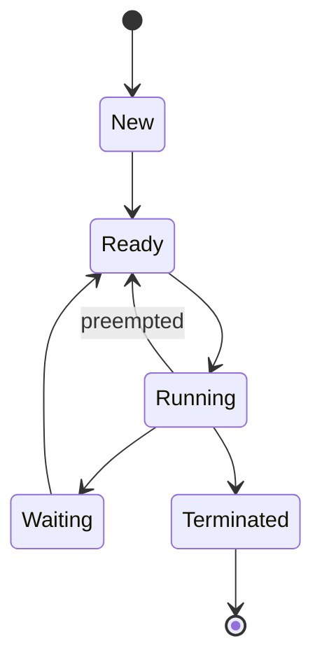
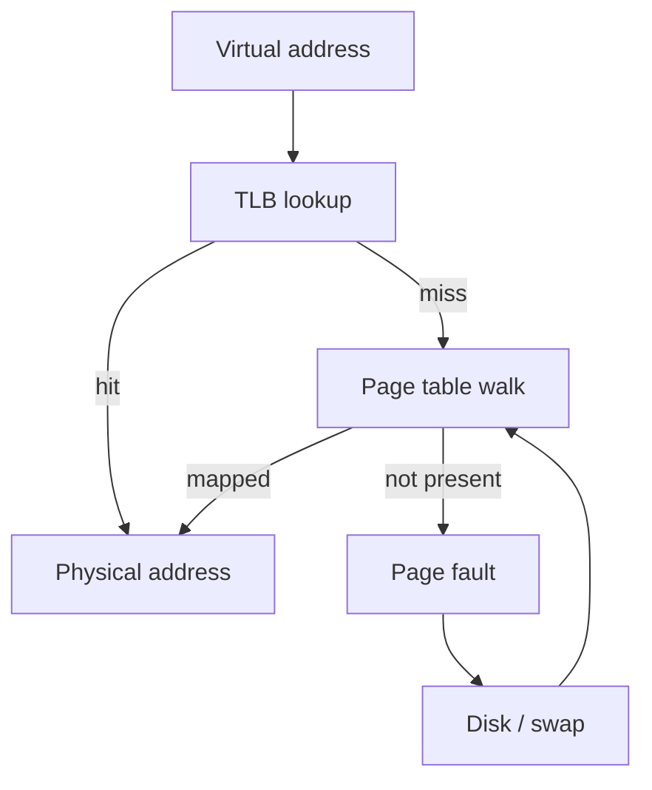

# 1. Operating Systems Essentials

> **TL;DR:** OS fundamentals explain why latency spikes become `blocked threads`, `page faults`, `socket exhaustion`, `scheduler contention`, or `cgroup` throttling. For .NET interviews, know how runtime abstractions map to kernel behavior.

**Interview weight:** P2 overall, P1 for applied parts — pure OS theory is usually not the main loop, but production debugging, async I/O, container tuning, and incident response all depend on scheduling, memory, files, and kernel limits.

---

## Core Concepts

- **Process** — isolated address space plus OS-managed resources such as handles, sockets, and security context.
- **Thread** — OS-scheduled execution unit inside a process; threads share the process heap and open resources.
- **Coroutine / `Task`** — user-space abstraction for async work; may resume on a thread pool thread, but is not itself an OS thread.
- **Context switch** — CPU saves one execution context and restores another.
- **System call** — controlled transition from user mode to kernel mode.
- **Virtual memory** — each process sees its own address space; the kernel maps virtual pages to physical memory.
- **Working set** — pages actively needed during a time window.
- **Page fault** — access to a virtual page that is not currently mapped.
- **TLB** — small CPU cache for virtual-to-physical translations.
- **File descriptor** — integer handle for an open file, socket, pipe, or device on Unix-like systems.
- **`cgroup`** — kernel resource controller that limits and accounts for CPU, memory, and I/O for a process group.

---

## Process vs Thread vs Coroutine/Task

- **Key distinction** — the OS schedules **processes and threads**; language runtimes schedule **coroutines / tasks** cooperatively on top.
- **Senior interview line** — `Task` is a completion abstraction, not “a lightweight thread.” It may represent CPU work, socket I/O, timer completion, or an already-completed result.

| Aspect | Process | Thread | Coroutine/Task |
| ------ | ------- | ------ | -------------- |
| Isolation | Strong; separate address space | Weak; same process | None at OS level; same process/thread context |
| Memory sharing | IPC required | Shared heap by default | Shared heap; state machine / closure captured in process memory |
| Creation cost | High | Medium | Low |
| Context-switch cost | Highest | Lower | Lowest; user-space yield/resume |
| Scheduling | Kernel | Kernel | Runtime / framework |
| Failure isolation | High; crash usually contained to process | Low; bad write can corrupt whole process | Low; exception affects logical flow unless isolated by caller |
| Typical use | Service boundary, sandbox, worker process | Parallel CPU work, request handling, blocking legacy APIs | Async I/O, structured concurrency, high fan-out workflows |

---

## Process Lifecycle



- **New** — process is created; resources allocated.
- **Ready** — runnable, waiting in a run queue for CPU time.
- **Running** — currently executing on a core.
- **Waiting** — blocked on I/O, timer, page fault, lock, or event.
- **Terminated** — execution finished; Unix may keep a zombie entry until parent reaps it.

---

## Context Switching Cost

- **Thread context switch** — commonly ~`1-10 µs`.
- **Process context switch** — effective cost commonly ~`50-100 µs` once address-space changes plus colder caches and TLB disruption are included.
- **Why too many threads hurt:**
  - **Scheduler overhead** — more runnable threads means more bookkeeping and more frequent preemption.
  - **Cache thrashing** — each switch evicts hot instruction/data cache lines.
  - **Memory pressure** — each thread reserves stack space; on .NET/Windows the default reserve is commonly ~`1 MB` per thread, platform-dependent elsewhere.
  - **Latency amplification** — blocked worker threads delay thread pool continuations and request completion.
- **Production heuristic** — if CPU is high but useful work is low, inspect runnable thread count and context-switch rate before scaling out blindly.

---

## CPU Scheduling Algorithms

- **Preemptive scheduling** — the OS can interrupt a running thread when its time slice expires or a higher-priority thread arrives.
- **Cooperative scheduling** — code must yield voluntarily. Coroutines and `await` are cooperative at the application level even though the underlying threads are preemptively scheduled by the OS.

| Algorithm | Type | Starvation? | Preemptive? | Overhead | Use case |
| --------- | ---- | ----------- | ----------- | -------- | -------- |
| FCFS | Arrival-order queue | No | No | Low | Simple batch systems; poor interactive latency |
| SJF | Shortest job first | Yes; long jobs can wait | No | Medium | Best average wait time when burst length is known |
| Round Robin | Time-sliced queue | No | Yes | Medium | Interactive systems needing fairness |
| Priority | Priority-based | Yes; low priority can starve | Usually yes | Low-Medium | Real-time-ish or importance-based workloads |
| MLFQ | Multi-level feedback queue | Possible, but mitigated | Yes | High | General-purpose schedulers balancing response time and throughput |
| CFS (Linux) | Fair scheduling via virtual runtime | Low in practice | Yes | Medium | Default Linux server scheduling |

- **`CFS` intuition** — each runnable thread accumulates virtual runtime; the scheduler favors the one that has received the least fair share.
- **Interview bridge to .NET** — the OS decides which worker thread runs; the CLR does not bypass the kernel scheduler.

---

## Kernel vs User Mode

- **User mode** — restricted execution; no direct hardware access; invalid memory access usually faults only the process.
- **Kernel mode** — privileged execution; can access devices, page tables, schedulers, and global memory mappings.
- **System calls** — `read`, `write`, `send`, `recv`, `open`, `mmap`, `epoll_wait`, and similar APIs trap into the kernel.
- **Boundary cost** — the empty user-to-kernel crossing is roughly `~100 ns` on modern hardware, but real syscall cost is higher once validation, copying, locking, and scheduling are included.
- **Why async I/O helps:**
  - **Does not remove all syscalls** — you still submit work and receive completion.
  - **Does remove blocked threads** — far fewer park/unpark operations and context switches.
  - **Can batch notifications** — readiness/completion APIs wake a small number of workers for many sockets.

---

## Memory: Stack vs Heap, Virtual Memory, Paging

### Stack vs Heap

| Aspect | Stack | Heap |
| ------ | ----- | ---- |
| Allocation pattern | LIFO | Arbitrary |
| Typical size | Limited; commonly ~`1-8 MB` per thread | Much larger; process-wide |
| Speed | Very fast pointer bump | Slower; allocation + GC or manual free |
| Cleanup | Automatic on frame unwind | GC-managed or manual, depending on runtime |
| Best for | Short-lived locals, call frames | Objects with dynamic lifetime or variable size |
| Risks | Stack overflow | Fragmentation, GC pressure, leaks in unmanaged code |

- **Stack** — fast, contiguous, per-thread, ideal for locals and call frames.
- **Heap** — flexible, shared across threads in the process, required for objects whose lifetime outlives a stack frame.

### Virtual Memory and Paging



- **Virtual memory** — every process gets a private address space; page tables map virtual pages to physical frames.
- **TLB hit** — translation found in `~1-10 ns`.
- **TLB miss** — hardware walks page tables; effective latency is often around `~100 ns` or more depending on cache state.
- **Minor page fault** — page already exists in memory but is not mapped into the process page table yet.
- **Major page fault** — page must be fetched from disk or swap; now latency jumps from nanoseconds to microseconds or milliseconds.
- **Working set** — the subset of pages actively touched. If working set exceeds RAM, the kernel constantly evicts and reloads pages.
- **Swapping / thrashing** — page-fault I/O dominates CPU work; throughput collapses even when CPU looks busy.

### Memory-Mapped Files and COW

- **`mmap` / memory-mapped files** — map file contents into virtual memory instead of explicitly copying bytes through `read` loops.
- **Uses**
  - **CLR / OS loader** — executables and assemblies are commonly mapped by the OS loader.
  - **Shared memory IPC** — multiple processes can map the same file-backed or anonymous region.
  - **Large file access** — random reads can become page-driven rather than explicit buffered I/O.
- **Copy-on-write (COW)** — after `fork`, parent and child initially share the same physical pages; the kernel duplicates only on first write.
- **Trade-off** — `mmap` is great for random access and sharing, but page-fault behavior becomes part of your latency story.

---

## I/O Models

| Aspect | Blocking | Non-blocking | I/O Multiplexing | Async (AIO) |
| ------ | -------- | ------------ | ---------------- | ----------- |
| Description | `read()` waits until data or EOF | `read()` returns immediately with `EAGAIN` if not ready | One thread waits on many FDs via `select`, `poll`, `epoll`, or `kqueue` | App submits operation; OS/runtime notifies on completion |
| Who waits | Caller thread | Caller retries / spins / polls | Event loop thread | Kernel + completion mechanism |
| Scalability | Poor for many idle sockets | Better than blocking, but manual polling is awkward | High for large socket sets | Highest for large async workloads |
| .NET mapping | Legacy sync `Stream.Read` / blocking `Socket.Receive` | Rarely used directly in app code | Linux networking uses `epoll`-style readiness under the runtime/Kestrel transport | Windows socket/file async uses `IOCP`; `await` surfaces completion without blocking a worker |

### `select`, `epoll`, `kqueue`, `IOCP`

- **`select`** — caller passes FD sets each time; kernel scans them; complexity is effectively `O(n)` and there is usually a small FD-set limit.
- **`epoll`** — caller registers interest once, then waits for ready events; avoids rescanning the whole FD set on every wait and scales far better for many mostly-idle connections.
- **`kqueue`** — BSD/macOS event queue; conceptually similar to `epoll`.
- **`IOCP`** — Windows completion model; app posts overlapped I/O, and the kernel queues completion packets to a port consumed by worker threads.

### How `.NET` Async I/O Maps to the OS

- **Windows** — socket and overlapped handle async operations map to `IOCP`.
- **Linux** — socket async operations ultimately use readiness-based mechanisms such as `epoll` in the runtime / Kestrel transport.
- **Historical nuance** — older ASP.NET Core versions used `libuv`; modern .NET uses native socket transports, but the interview answer is still “Windows = `IOCP`, Linux = `epoll`-style eventing.”
- **Key insight** — `await stream.ReadAsync()` on an async-capable network stream does **not** block a thread; the OS signals readiness/completion and the runtime schedules the continuation on the thread pool.
- **Senior nuance** — Unix regular file “async” is not identical to socket async; networking is the cleanest example for explaining `await` without blocked threads.

---

## File Systems Basics

- **Inode** — metadata record containing ownership, permissions, timestamps, link count, and pointers/extents to data blocks. The inode number is the file’s “true name”; directory entries map human-readable names to inode numbers.
- **NTFS parallel** — NTFS uses MFT records rather than Unix inodes, but the interview idea is the same: metadata record + block/extents.
- **Journaling** — file systems such as `ext4` and `NTFS` write metadata intent to a journal first, then apply the real update. This is effectively WAL for file-system metadata and improves crash recovery.
- **Write buffering / page cache** — `write()` often lands in memory first and returns before data is durable on disk.
- **`fsync`** — forces dirty data and metadata to stable storage; expensive because it defeats batching and may force rotational or SSD flushes. A hard sync can be `~10 ms` on HDDs.
- **When you need `fsync`** — DB WALs, commit logs, anything where “ACK means durable” is a business requirement.
- **Zero-copy** — `sendfile()` lets the kernel move bytes from file cache to socket without copying through user-space buffers.
- **Why zero-copy matters** — fewer CPU cycles, fewer memory copies, lower cache pollution, better throughput at high RPS.
- **Real systems** — `Kafka` and `Nginx` use `sendfile()`-style paths heavily.
- **.NET nuance** — `Stream.CopyToAsync` is not automatically zero-copy; zero-copy requires OS-specific paths such as `sendfile()` / `TransmitFile`, used by lower-level APIs and web servers where available.

---

## File Descriptors and `ulimit`

- **Everything is a file** on Unix-like systems — regular files, sockets, pipes, terminals, and devices all consume descriptors.
- **`ulimit -n`** — per-process open-file limit. Default is often `1024`; high-throughput services commonly need `65535+`.
- **`EMFILE`** — this process hit its FD limit.
- **`ENFILE`** — the whole system hit its global open-file limit.
- **.NET mapping**
  - **`FileStream`** — consumes an OS handle / FD.
  - **Sockets** — each TCP connection consumes a socket FD.
  - **`HttpClient`** — requests ride pooled sockets from `SocketsHttpHandler`; the underlying connections consume FDs.
- **Incident pattern** — leaking streams or creating excessive outbound connections produces `too many open files`, handshake failures, and random downstream timeouts.

---

## Signals

| Signal | Meaning | Common backend use |
| ------ | ------- | ------------------ |
| `SIGTERM` | Graceful termination request | Kubernetes / orchestrator shutdown path |
| `SIGKILL` | Immediate kill; cannot be trapped | Last resort after grace period expires |
| `SIGINT` | Interactive interrupt, usually `Ctrl+C` | Local dev stop or manual operator interrupt |
| `SIGHUP` | Historically terminal hangup; often “reload config” | Reopen logs or trigger config reload |

- **.NET hooks**
  - **`Console.CancelKeyPress`** — handle `SIGINT` / `Ctrl+C` in console apps.
  - **`IHostApplicationLifetime.ApplicationStopping`** — preferred graceful-shutdown hook in hosted services.
- **Production rule** — on `SIGTERM`, stop accepting new work, cancel background loops, drain requests, flush telemetry, then exit before the orchestrator sends `SIGKILL`.

---

## Zombie and Orphan Processes

- **Zombie** — process has exited, but parent has not called `wait()` / reaped its exit status. It consumes a process-table entry, not CPU.
- **Orphan** — parent died before child; child gets adopted by `init` / `PID 1`.
- **Container gotcha** — if the container entrypoint is `PID 1` and never reaps children, zombies accumulate.
- **Mitigation** — use `tini`, proper init handling, or ensure the parent process reaps subprocesses correctly.

---

## Containers: Namespaces and `cgroups`

### Namespaces

| Namespace | Isolates |
| --------- | -------- |
| `PID` | Process tree / visible PIDs |
| `network` | Interfaces, routes, ports |
| `mount` | File-system mount view |
| `UTS` | Hostname / domain name |
| `IPC` | Shared-memory and IPC resources |
| `user` | UID / GID mapping and privileges |

### `cgroups`

| Resource | Typical controls | Why it matters |
| -------- | ---------------- | -------------- |
| CPU | shares, quota, period | Too little quota causes throttling and tail-latency spikes |
| Memory | hard limit, swap limit | Exceed limit and the kernel may `OOMKill` the process |
| Block I/O | weights / throttles | Write-heavy workloads can stall on storage contention |

- **CPU limit and thread pool interaction**
  - **Concept** — if the container effectively gets `1` core, adding more runnable worker threads does not create more CPU; it creates more contention.
  - **Modern .NET** — `.NET Core 3.0+` is container-aware by default on mainstream Linux container setups.
  - **Gotcha** — older runtimes, unusual hosts, or explicit overrides can still make `Environment.ProcessorCount` misleading relative to real quota.
  - **Mitigation** — set `DOTNET_PROCESSOR_COUNT` when you need predictable concurrency; pair platform-aware startup checks with `RuntimeInformation` / `OperatingSystem` guards if you apply container-specific tuning.
- **Memory limit and GC interaction**
  - **GC sees managed heap, not your whole RSS story** — native buffers, thread stacks, JIT code, memory-mapped files, and page cache still count against the container limit.
  - **Inspect** — `GC.GetGCMemoryInfo()` shows the runtime’s view of available memory and high-memory load thresholds.
  - **Control** — `DOTNET_GCHeapHardLimit` can cap the managed heap more aggressively.
  - **Failure mode** — without enough headroom, the kernel may kill the process before GC can recover because the cgroup hard limit is absolute.
- **Production summary** — container memory and CPU limits are not “advice”; they are enforced resource ceilings with direct scheduler and GC consequences.

---

## NUMA

- **NUMA** — Non-Uniform Memory Access; on multi-socket machines, each socket has memory that is faster for its local cores than remote memory.
- **Why it matters** — cross-socket memory access increases latency and reduces cache locality.
- **Practical guidance**
  - **High-throughput general services** — often fine with OS defaults.
  - **Ultra-low-latency services** — pin threads/processes and memory locality with tools such as `numactl`.
  - **.NET angle** — relevant for very large heaps, low-latency trading, or CPU-pinned services where remote memory traffic becomes measurable.

---

## Comparison

| Production symptom | Likely OS-level cause | What to inspect | Typical first fix |
| ------------------ | --------------------- | --------------- | ----------------- |
| High CPU, low throughput | Too many runnable threads, context switching, lock contention | Thread count, run queue, context-switch rate | Remove blocking, reduce thread count, use async I/O |
| Sharp latency spikes under memory pressure | Major page faults or thrashing | RSS, working set, page-fault rate, swap activity | Reduce working set, add RAM, fix leaks, scale out |
| Random outbound failures under load | File descriptor exhaustion | `ulimit -n`, open sockets, leaked streams | Raise limits and fix connection / stream lifecycle |
| Good average latency, terrible p99 in container | CPU throttling or memory reclaim | cgroup quota, throttled time, GC memory info | Right-size CPU quota, tune concurrency, add headroom |
| Slow durable writes | `fsync` cost and storage flush latency | Disk latency, WAL flush frequency | Batch writes where allowed or use faster storage |
| Static file serving burns CPU | User-space copies instead of zero-copy path | Copy profile, send path, NIC throughput | Use `sendfile()`-style path where supported |

---

## Code Example

```csharp
using System.Net.Sockets;

using var cts = new CancellationTokenSource();
Console.CancelKeyPress += (_, e) =>
{
    e.Cancel = true;
    cts.Cancel();
};

Console.WriteLine($"CPUs: {Environment.ProcessorCount}");
Console.WriteLine(
    $"GC cap: {GC.GetGCMemoryInfo().TotalAvailableMemoryBytes / 1024 / 1024} MB");

using var client = new TcpClient();
await client.ConnectAsync("127.0.0.1", 5000, cts.Token);

using NetworkStream stream = client.GetStream();
byte[] buffer = new byte[4096];

while (!cts.Token.IsCancellationRequested)
{
    int read = await stream.ReadAsync(buffer, cts.Token); // OS signals completion; no blocked worker
    if (read == 0) break;
    Console.WriteLine($"Read {read} bytes");
}
```

---

## Trade-offs

| Choice | Upside | Downside | When to prefer |
| ------ | ------ | -------- | -------------- |
| More threads | Easy mental model; works for legacy blocking APIs | Scheduler overhead, stack memory, thread pool starvation risk | Small thread counts or unavoidable blocking libraries |
| Async I/O | High socket scalability; fewer blocked workers | More state machines, cancellation complexity, backpressure design needed | High-concurrency network services |
| `mmap` | Great random-read locality; shared mapping; zero explicit copy | Page faults become latency source; tricky write semantics | Large read-mostly files or shared-memory IPC |
| `fsync` every write | Strong durability semantics | Throughput and latency cost | WAL / commit log / money movement |
| Batched durability | Higher throughput via coalesced flushes | Small durability window on crash | Analytics, telemetry, or bounded-loss pipelines |
| Tight GC heap limit in containers | Reduces surprise `OOMKill` from managed growth | More frequent GC, lower throughput if too tight | Memory-constrained multi-tenant pods |
| NUMA pinning | Better locality, lower tail latency | Operational complexity, uneven utilization risk | Ultra-low-latency or socket-local workloads |

---

## Common Pitfalls

- **Treating `Task` as a thread** — causes bad reasoning about parallelism and capacity.
- **Using too many threads for I/O-bound work** — increases context switching without increasing throughput.
- **Ignoring major page faults** — CPU may look fine while disk-backed faults destroy latency.
- **Assuming `await` always means “true async file I/O”** — networking is the clean example; regular file semantics differ by OS.
- **Forgetting `ulimit -n`** — services pass load tests in dev and fail instantly in prod at a few thousand sockets.
- **Assuming container limit equals GC heap limit** — RSS includes far more than the managed heap.
- **Running subprocesses as `PID 1` without reaping** — zombie buildup in containers.
- **Calling `fsync` casually** — durability guarantees are expensive; know when you truly need them.
- **Ignoring CPU quota** — a pod with `1` vCPU cannot benefit from “just add 200 worker threads.”

---

## Interview Questions

**Q1. What is the difference between a process and a thread?**  
**A:** A **process** has its own address space and strong isolation. A **thread** is an execution unit inside a process, sharing heap and resources with sibling threads. Process creation and switching are costlier; thread communication is easier but less isolated.

**Q2. What is a context switch?**  
**A:** A **context switch** is when the CPU saves registers, stack pointer, and scheduling state for one thread and restores another. It is necessary for multitasking but adds overhead, cache disruption, and latency.

**Q3. What is virtual memory, and why does it matter?**  
**A:** **Virtual memory** gives each process the illusion of a large private address space. It improves isolation, allows memory overcommit, enables paging, and lets the OS map files or shared regions without copying everything into dedicated RAM.

**Q4. What is a page fault?**  
**A:** A **page fault** happens when a process touches a virtual page that is not currently mapped. A **minor** fault only fixes mappings; a **major** fault requires disk I/O and is far more expensive.

**Q5. What is the TLB?**  
**A:** The **TLB** is a CPU cache of recent virtual-to-physical translations. A hit is extremely fast; a miss forces a page-table walk and increases memory-access latency.

**Q6. How is `epoll` better than `select`?**  
**A:** `select` requires the caller to rebuild and rescan FD sets each wait, so cost grows with the number of descriptors. `epoll` registers interest once and reports only ready descriptors, which scales much better for large mostly-idle socket sets.

**Q7. How does `.NET` async map to OS I/O?**  
**A:** For networking, `.NET` async submits socket work to the OS and resumes the continuation when the OS reports completion or readiness. On Windows that maps to `IOCP`; on Linux it maps to readiness-based mechanisms such as `epoll` under the runtime transport.

**Q8. What is `IOCP`?**  
**A:** **I/O Completion Ports** are a Windows kernel mechanism for scalable asynchronous I/O. You post overlapped operations, and completions are queued to a port consumed by a small pool of worker threads.

**Q9. What are zombie processes, and why do they matter in containers?**  
**A:** A **zombie** has exited but still occupies a process-table slot because its parent has not reaped it. In containers, `PID 1` must reap children; otherwise zombie entries accumulate and eventually exhaust process-table capacity.

**Q10. Senior: How do cgroup memory limits interact with `.NET` GC?**  
**A:** The cgroup limit applies to total process memory, not just the managed heap. `.NET` is container-aware in modern runtimes, but native buffers, thread stacks, `mmap`, and JIT memory still count. Use `GC.GetGCMemoryInfo()` to inspect headroom and `DOTNET_GCHeapHardLimit` when you need a stricter managed cap.

**Q11. Senior: How can OS scheduling contribute to `.NET` thread pool starvation?**  
**A:** If worker threads block on I/O, locks, or sync-over-async, the runtime may inject more threads, but the OS still has to schedule them. Now runnable threads exceed useful parallelism, context switches rise, caches thrash, and continuations wait longer for CPU. Fix the blocking source instead of only increasing pool size.

**Q12. Senior: What is zero-copy, and why does it matter for high-throughput services?**  
**A:** **Zero-copy** avoids shuttling bytes through user-space buffers when moving data between kernel-managed resources such as file cache and sockets. That cuts memory copies, CPU usage, and cache pollution, which matters at high RPS or large payload sizes.

**Q13. Senior: What is the container CPU limit and `Environment.ProcessorCount` gotcha?**  
**A:** On modern `.NET`, `Environment.ProcessorCount` is usually container-aware, but older runtimes or explicit overrides can make it reflect host capacity rather than real quota. If your pod gets `1` CPU but your app thinks it has many, concurrency defaults become too aggressive. Pin behavior with `DOTNET_PROCESSOR_COUNT` when necessary and validate under real cgroup limits.

---

## Quick Recap

- **Process** = isolation boundary; **thread** = kernel-scheduled execution unit; **`Task`** = user-space async abstraction.
- **Context switches** are not free; excessive threads burn CPU on scheduling, stacks, and cache churn.
- **Virtual memory** and the **TLB** make address translation fast until misses and page faults show up.
- **Major page faults** and **thrashing** are classic hidden latency killers.
- **`await stream.ReadAsync()`** on network I/O does not block a worker; `IOCP` / `epoll`-style mechanisms wake continuations.
- **File systems** buffer writes; `fsync` buys durability at real latency cost.
- **FD limits** and **zombie reaping** are common Linux/container operational gotchas.
- **Namespaces** isolate containers; **`cgroups`** enforce CPU and memory limits that directly affect thread pool sizing and GC behavior.
