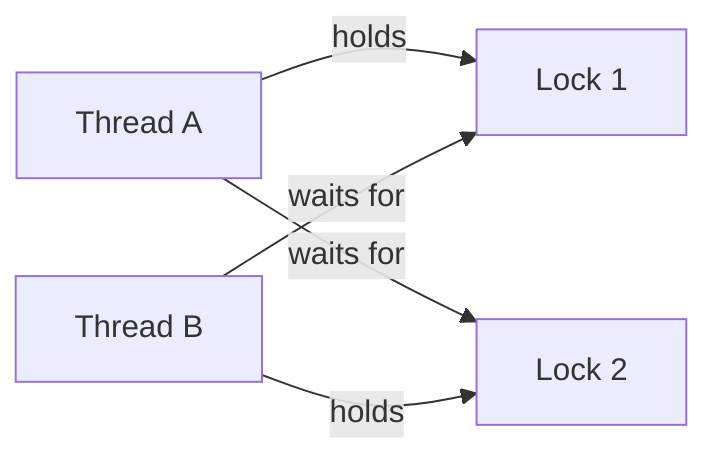

# 2. Concurrency Primitives and Deadlocks

> **TL;DR:** **Concurrency** is about coordinating access to shared state; **parallelism** is about doing work at the same time. In .NET interviews, know `lock`/`Monitor`, `SemaphoreSlim`, `ReaderWriterLockSlim`, `Interlocked`, deadlock prevention, thread pool starvation, and when immutability beats locking.

**Interview weight:** P1 — core backend production work depends on choosing the right primitive, avoiding deadlocks, and diagnosing starvation or contention under load.

## Core Concepts

- **Concurrency** — multiple tasks make progress during overlapping time windows; actual execution may be interleaved on one or many cores.
- **Parallelism** — multiple tasks execute at the same instant on different cores or hardware threads.
- **Critical section** — code that must not be executed by more than one thread simultaneously.
- **Atomicity** — an operation happens fully or not at all; `x++` is **not** atomic because it is read-modify-write.
- **Visibility** — one thread's write may not become observable to another thread without synchronization or a memory barrier.
- **Instruction reordering** — compiler, JIT, and CPU may reorder operations for performance unless ordering constraints exist.
- **.NET memory model** — `volatile` reads/writes add ordering guarantees, `Thread.MemoryBarrier()` creates a full fence, and `Interlocked` combines atomic update + memory ordering.
- For broader .NET primitives and concurrent collections, see [Threading in C#](../02-CSharp-DotNet/06-Threading-Synchronization-and-Concurrent-Collections.md).

## Concurrency vs Parallelism

| Aspect | Concurrency | Parallelism |
| --- | --- | --- |
| Definition | Coordinating multiple in-flight tasks | Executing multiple tasks at the same time |
| Requires multiple CPUs | No | Yes, for true simultaneous execution |
| .NET mechanism | `async`/`await`, `Task`, locks, schedulers | `Parallel.ForEach`, PLINQ, multiple worker threads |
| Goal | Correctness, responsiveness, overlap | Throughput, lower wall-clock time |

## Memory Model Essentials

- **Critical section**
- Protect with `lock`, `Monitor`, `Mutex`, `SemaphoreSlim`, or a lock-free design.
- Keep the protected region short; never do blocking I/O while holding a lock.
- **Atomicity**
- Safe examples: aligned reference writes, `Interlocked.Increment(ref x)`.
- Unsafe example: `x++` => read `x`, compute `x + 1`, write result.
- **Visibility**
- Without synchronization, thread B can read stale cached data after thread A writes.
- Use `volatile`, `Interlocked`, `lock`, or signaling primitives to publish state safely.
- **Instruction reordering**
- Reordering is legal if single-threaded semantics remain intact.
- Broken publication patterns often fail only under load or on different hardware.
- **Key APIs**
- `volatile` field access — acquire on read, release on write.
- `Thread.MemoryBarrier()` — full fence; rarely needed directly in application code.
- `Interlocked` — `Increment`, `Decrement`, `Add`, `Exchange`, `CompareExchange`.

## Deadlock, Livelock, Starvation, and Priority Inversion

- **Deadlock** — threads wait forever on each other.
- **Livelock** — threads keep reacting and retrying but make no useful progress.
- **Starvation** — a thread is perpetually denied CPU time or a needed resource.
- **Priority inversion** — a low-priority thread holds a lock needed by a high-priority thread.

### Coffman conditions

- **Mutual exclusion** — resource has one holder.
- **Hold and wait** — a thread holds one resource while waiting for another.
- **No preemption** — resource cannot be forcibly taken.
- **Circular wait** — wait chain forms a cycle.



- **Detection**
- Use `dotnet-dump` to capture a dump from the hung process.
- In SOS, inspect `!threads` and `!clrstack` to find blocked managed threads and contested locks.
- Think of it like a SQL Server deadlock graph: who holds what, who waits on what, and whether there is a cycle.
- **Prevention**
- Break one Coffman condition.
- Most practical technique: **global lock ordering**.
- Use timeouts for best-effort work: `Monitor.TryEnter`, `SemaphoreSlim.WaitAsync(timeout)`.
- **Avoidance**
- **Banker's algorithm** proves safe allocation sequences, but it is mostly theoretical in business systems.
- **Lock ordering discipline**
- Assign every lock a rank.
- Always acquire lower rank before higher rank.
- **Livelock in production**
- Common case: retry storms with immediate retries and no jitter.
- **Priority inversion**
- Fix with **priority inheritance** at the scheduler/runtime level when available.
- Canonical example: **Mars Pathfinder** reset loops caused by a low-priority holder blocking a high-priority task.
- See [Threading in C#](../02-CSharp-DotNet/06-Threading-Synchronization-and-Concurrent-Collections.md) for adjacent deadlock patterns in `lock`/`Monitor` code.

## Lock-Free and Wait-Free Basics

- **CAS** — compare current value to expected value, then swap if equal.
- `Interlocked.CompareExchange(ref location, value, comparand)` is the core CAS primitive in .NET.
- **ABA problem**
- Value changes `A -> B -> A`.
- CAS sees `A` again and succeeds even though state changed in between.
- Fix with a version/tag alongside the value: tagged pointer or `StampedReference`-style design.
- **`Interlocked` class**
- `Increment`, `Decrement`, `Add`, `Exchange`, `CompareExchange`.
- **Lock-free != wait-free**
- CAS loops can still spin forever under heavy contention.
- One thread can repeatedly lose the race and starve.
- **When to use**
- Hot counters, state flags, one-time publication, very small invariants.
- Avoid for multi-field invariants, complex business rules, or code the team cannot reason about quickly.

## False Sharing and Cache-Line Padding

- **Cache line** — typically `64` bytes on modern x64 servers.
- **False sharing** — two threads update different fields that reside on the same cache line, causing cache invalidations and throughput collapse.
- **Symptoms**
- CPU high, lock contention low, performance improves when workload becomes single-threaded.
- **Fixes**
- Separate hot-write fields into different objects.
- Use `[StructLayout(LayoutKind.Explicit)]` with `FieldOffset` to force spacing.
- Use `[CacheLineSize]`-style padding wrappers or explicit padding fields where your codebase/runtime supports them.
- In .NET, manual layout via `System.Runtime.InteropServices` is the pragmatic approach.

## Thread Pool Starvation in .NET

- **Symptoms**
- `await Task.Delay(...)` resumes much later than expected.
- Request latency spikes while CPU is not fully saturated.
- `threadpool-queue-length` rises and work items sit queued.
- Under load, the system can look deadlocked even though the root cause is blocking.
- **Root cause**
- Blocking calls such as `.Result`, `.Wait()`, `Thread.Sleep`, synchronous I/O, or long sync locks consume thread pool threads.
- The pool adds workers conservatively; historically, it can grow roughly one worker every `~500ms` under starvation conditions.
- **Diagnosis**
- Run `dotnet-counters monitor --counters System.Runtime`.
- Watch `threadpool-queue-length` and `threadpool-thread-count`.
- Correlate with blocked stacks from dumps or traces.
- **Fixes**
- Use `async`/`await` all the way down.
- Prefer `SemaphoreSlim` over `Semaphore` for async throttling.
- Remove sync-over-async wrappers in ASP.NET Core request paths.
- **Anti-pattern**
- `task.GetAwaiter().GetResult()` in ASP.NET Core can pin worker threads and create instant starvation/deadlock risk under load.

## Immutability and Confinement

- **Immutability**
- `record`, `readonly struct`, `ImmutableDictionary<TKey,TValue>`.
- No lock is needed because state never changes after publication.
- **Thread confinement**
- Data is only touched by one thread or one logical request.
- Example: per-request state inside ASP.NET Core middleware or controllers.
- **Why superior when applicable**
- Fewer race conditions.
- Easier reasoning during incidents.
- Better scaling than coarse-grained locking.

## Is This Class Thread-Safe? Review Checklist

- **Mutable shared state** — does more than one thread touch the same field or object graph?
- **Atomic reads/writes** — are shared updates atomic, or is there read-modify-write risk?
- **Initialization safety** — is publication safe, or is there double-checked locking trouble?
- **Event handlers** — are subscribe/unsubscribe and invocation patterns thread-safe?
- **Lock consistency** — does the code always `lock` the same guard object?
- **Lock ordering** — are multiple locks always acquired in the same order?
- **Documentation** — is the class explicitly documented as thread-safe, conditionally safe, or not safe?

## Comparison

| Primitive | OS kernel? | Re-entrant? | Cross-process? | Cost | Max holders | Best use case |
| --- | --- | --- | --- | --- | --- | --- |
| `Monitor` / `lock` | Usually user-mode fast path; kernel only when contended | Yes, per thread | No | Low | 1 | Default mutual exclusion for short in-process critical sections |
| `Mutex` | Yes | Yes | Yes | High | 1 | Named cross-process ownership with abandonment semantics |
| `Semaphore` | Yes | No | Yes | Medium-High | N | Limit concurrent access across threads/processes |
| `SemaphoreSlim` | No kernel object unless waiting path escalates | No | No | Low-Medium | N | Async-aware throttling and lightweight in-process gating |
| `SpinLock` | No | No | No | Very low if hold time is tiny; terrible if not | 1 | Ultra-short hot paths where context-switch cost dominates |
| `ReaderWriterLockSlim` | No | Configurable recursion policy | No | Medium | Many readers / 1 writer | Read-heavy shared state |
| `Barrier` | No | No | No | Medium | Participant count | Phase-based parallel algorithms |
| `ManualResetEventSlim` | User-mode spin then event wait | No | No | Low-Medium | Many waiters | One-to-many signaling inside a process |
| `AutoResetEvent` | Yes | No | No | Medium | Releases 1 waiter per signal | Hand-off signaling between threads |
| `CountdownEvent` | No | No | No | Low-Medium | N signals to zero | Wait until a group of operations completes |

## Code Example

### Producer-Consumer with `Channel<T>`

```csharp
using System.Threading.Channels;

var channel = Channel.CreateBounded<int>(100);

var producer = Task.Run(async () =>
{
    for (var i = 0; i < 10; i++)
        await channel.Writer.WriteAsync(i);
    channel.Writer.Complete();
});

var consumer = Task.Run(async () =>
{
    await foreach (var item in channel.Reader.ReadAllAsync())
        Console.WriteLine($"Processed {item}");
});

await Task.WhenAll(producer, consumer);
```

- Prefer `Channel<T>` for modern async pipelines.
- `BlockingCollection<T>` remains useful for older blocking producer-consumer code.

### Readers-Writers with `ReaderWriterLockSlim`

```csharp
private readonly ReaderWriterLockSlim _rw = new();
private readonly Dictionary<string, string> _cache = new();

string? Read(string key)
{
    _rw.EnterReadLock();
    try { return _cache.TryGetValue(key, out var v) ? v : null; }
    finally { _rw.ExitReadLock(); }
}

void Write(string key, string value)
{
    _rw.EnterWriteLock();
    try { _cache[key] = value; }
    finally { _rw.ExitWriteLock(); }
}
```

### Dining Philosophers with lock ordering

- Assign each fork a stable numeric ID.
- Each philosopher always locks the lower-ID fork first, then the higher-ID fork.
- This breaks **circular wait**, so deadlock cannot form.

### Async mutex with `SemaphoreSlim`

```csharp
private readonly SemaphoreSlim _mutex = new(1, 1);

async Task UpdateAsync()
{
    await _mutex.WaitAsync();
    try
    {
        await SaveAsync();
    }
    finally
    {
        _mutex.Release();
    }
}
```

- `lock` is not awaitable.
- `await` inside a `lock` body is a compile-time error (`CS1996`).
- Use `SemaphoreSlim(1, 1)` when the critical section must span `await`.

## Trade-offs

| Decision | Prefer | Trade-off |
| --- | --- | --- |
| Short synchronous critical section | `lock` / `Monitor` | Simplest and fastest general-purpose choice, but unusable with `await` |
| Async mutual exclusion | `SemaphoreSlim` | Works with `await`, but not re-entrant and easier to leak with missing `Release()` |
| Read-heavy shared state | `ReaderWriterLockSlim` | Better read concurrency, but more complex and can underperform under write pressure |
| Very hot single-field state | `Interlocked` | Excellent throughput, but poor fit for complex invariants |
| Cross-process coordination | `Mutex` / `Semaphore` | Correct across processes, but kernel objects are costlier |
| No shared mutability | Immutability / confinement | Best correctness story, but may increase copies or redesign effort |
| Busy-wait optimization | `SpinLock` | Avoids context switches, but can waste CPU and hurt tail latency |

## Common Pitfalls

- Using `x++` or `count += 1` on shared state and assuming it is atomic.
- Publishing an object reference without safe visibility guarantees.
- Locking on `this`, `typeof(T)`, or a publicly reachable object.
- Acquiring multiple locks in inconsistent order.
- Holding a lock during network I/O, disk I/O, or logging.
- Using `lock` in async code instead of `SemaphoreSlim`.
- Mixing `.Result` / `.Wait()` with `async` request paths.
- Assuming lock-free code is always faster.
- Ignoring false sharing when sharding counters by CPU/thread.
- Forgetting to document whether a class is thread-safe.

## Interview Questions

**Q1. What is the difference between concurrency and parallelism?**
A: **Concurrency** is about coordinating overlapping work; **parallelism** is about simultaneous execution on multiple cores. A single-core system can be concurrent but not truly parallel.

**Q2. What is a deadlock vs a livelock?**
A: In a **deadlock**, threads stop because each waits forever on another resource. In a **livelock**, threads stay active and keep reacting, but no useful progress is made.

**Q3. What are the four Coffman conditions?**
A: **Mutual exclusion**, **hold and wait**, **no preemption**, and **circular wait**. All four must exist for deadlock to happen.

**Q4. What is the difference between a mutex and a semaphore?**
A: A **mutex** has one owner and allows a single holder. A **semaphore** is a counter that allows up to `N` concurrent holders; it models a pool of permits, not ownership.

**Q5. Why is `x++` not atomic?**
A: It is a read-modify-write sequence: load current value, compute new value, write it back. Another thread can interleave between those steps and lose updates.

**Q6. Why can't you use `lock` with `async`/`await`?**
A: `lock` blocks a thread and requires the same lexical critical section to exit synchronously. `await` suspends and resumes later, so C# forbids `await` inside `lock`; use `SemaphoreSlim.WaitAsync()` instead.

**Q7. What is the ABA problem?**
A: CAS sees the value as unchanged because it went from `A` to `B` and back to `A`. The fix is to pair the value with a version/tag so CAS can detect intermediate changes.

**Q8. When would you use `SpinLock` over `Monitor`?**
A: Only for extremely short critical sections on hot paths where a context switch costs more than spinning. If the hold time is not tiny, `SpinLock` burns CPU and usually makes latency worse.

**Q9. What is lock ordering discipline?**
A: Give every lock a global rank and always acquire them in that order. This breaks **circular wait**, which is the most practical deadlock prevention technique.

**Q10. Senior: What thread pool starvation symptoms do you look for in .NET, and how do you diagnose them?**
A: Look for rising latency, delayed `Task.Delay` resumptions, growing request queues, and increasing `threadpool-queue-length`. Confirm with `dotnet-counters monitor --counters System.Runtime`, then inspect dumps/traces for blocked thread pool workers on `.Result`, `.Wait()`, sync I/O, or long lock waits.

**Q11. Senior: How do you diagnose a production deadlock in a .NET service?**
A: Capture a dump with `dotnet-dump`, inspect `!threads` to find blocked workers, and use `!clrstack` to identify the lock acquisition path for each thread. Reconstruct the wait-for graph, verify a cycle, and map the locks back to code so you can enforce ordering or remove blocking work from the critical section.

**Q12. Senior: What is priority inversion, and how would you detect it?**
A: A low-priority thread holds a lock needed by a high-priority thread, while medium-priority work prevents the low-priority thread from running and releasing it. Detect it through scheduler-aware traces, long waits on a lock with low CPU ownership, and disproportionate latency on high-priority work; mitigate with priority inheritance, shorter critical sections, or redesign.

**Q13. Senior: `Channel<T>` vs `BlockingCollection<T>` for producer-consumer?**
A: Prefer `Channel<T>` for async-first pipelines, backpressure, and `await foreach`. Prefer `BlockingCollection<T>` for older synchronous worker loops or when integrating with blocking code. In modern ASP.NET Core or services, `Channel<T>` is usually the better production default.

## Quick Recap

- **Concurrency** overlaps work; **parallelism** runs work simultaneously.
- `lock`/`Monitor` is the default in-process mutex for short synchronous critical sections.
- `SemaphoreSlim` is the right async mutex; never block thread pool threads with sync-over-async.
- Deadlock needs all four Coffman conditions; consistent lock ordering is the best real-world prevention.
- `Interlocked` gives atomic operations, but lock-free code can still starve.
- False sharing can destroy throughput even without obvious lock contention.
- Immutability and thread confinement are often better than adding more locks.
