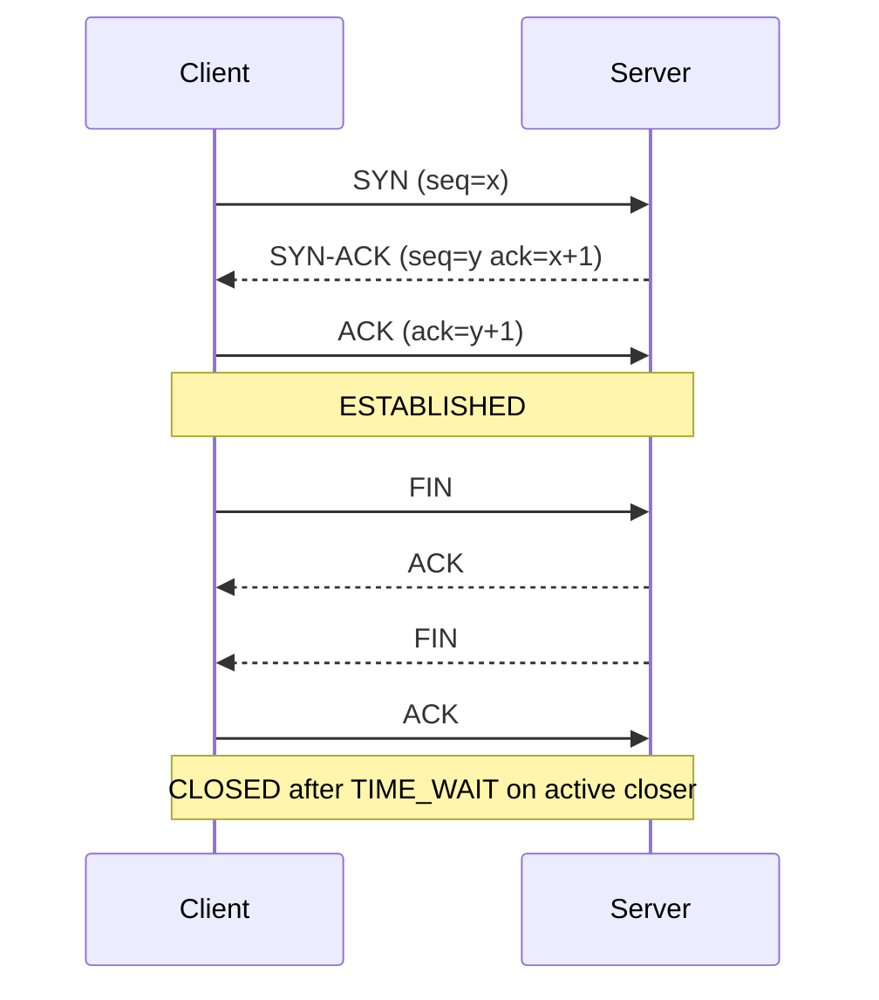
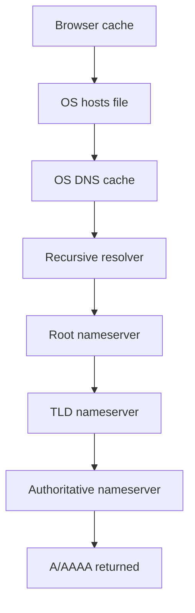

# 3. Networking Essentials

> **TL;DR:** Focus on where production networking bugs actually happen: **L3** routing, **L4** TCP/UDP and ports, **L7** HTTP/DNS/TLS, connection reuse, and Azure network boundaries.

**Interview weight:** P1 for applied parts, P2 conceptual — **P1** because senior interviews test troubleshooting, latency, DNS, load balancing, and Azure network decisions under real traffic. **P2** because memorizing every layer matters less than explaining what breaks at **L3**, **L4**, and **L7**.

---

## Core Concepts

- **L3** — **IP and routing**; packets move between networks.
- **L4** — **TCP/UDP, ports, sockets**; processes communicate with delivery guarantees or without them.
- **L7** — **HTTP, DNS, TLS**; application-visible protocols and most user-facing failures.
- **RTT** — round-trip time; directly affects handshake cost, retries, and tail latency.
- **MTU/MSS** — max packet size on the link vs max TCP payload size.
- **Flow control** — receiver-side protection with `rwnd`.
- **Congestion control** — sender-side adaptation with `cwnd`.
- **Connection pooling** — reuse sockets to avoid repeated handshakes and ephemeral port exhaustion.

---

## OSI vs TCP/IP Model

- **Interview focus:** spend most time on **L3** (`IP`, routing), **L4** (`TCP`, `UDP`, ports, sockets), and **L7** (`HTTP`, `DNS`, `TLS`).
- **Why:** those layers explain most backend incidents: timeouts, resets, packet loss, stale DNS, TLS handshake latency, and misrouted traffic.

| Layer # | OSI Layer | TCP/IP Layer | Protocols | Where issues occur |
| ------- | --------- | ------------ | --------- | ------------------ |
| 7 | Application | Application | `HTTP`, `DNS`, `gRPC` | Bad headers, wrong hostnames, retries, protocol mismatch |
| 6 | Presentation | Application | `TLS`, `gzip`, `JSON` | Cert errors, cipher mismatch, serialization/compression bugs |
| 5 | Session | Application | `TLS` session resumption, `HTTP/2` streams | Session reuse, renegotiation, sticky-session assumptions |
| 4 | Transport | Transport | `TCP`, `UDP`, `QUIC`, ports, sockets | `connection refused`, retransmits, resets, timeouts |
| 3 | Network | Internet | `IP`, `ICMP`, routing | Blackholes, NAT, asymmetric paths, TTL, subnet mistakes |
| 2 | Data Link | Network Access | Ethernet, ARP, VLAN | MTU mismatch, ARP issues, L2 drops |
| 1 | Physical | Network Access | Fiber, copper, Wi-Fi | Cabling, duplex mismatch, radio interference |

---

## TCP vs UDP Deep Comparison

| Aspect | TCP | UDP |
| ------ | --- | --- |
| Connection | Connection-oriented; handshake required | Connectionless; no handshake |
| Reliability | Reliable; ACKs + retransmission | Best-effort; app handles loss if needed |
| Ordering | In-order delivery | No ordering guarantee |
| Flow control | Yes; receiver advertises `rwnd` | No built-in flow control |
| Congestion control | Yes; sender adjusts `cwnd` | No built-in congestion control |
| Header size | `20B` minimum | `8B` |
| Latency | Higher setup cost; better for correctness | Lower setup cost; better for low-latency fire-and-forget |
| Use cases | `HTTP/1.1`, `HTTP/2`, databases, reliable RPC | DNS queries, video streaming, gaming, telemetry, QUIC |
| .NET class | `TcpClient`, `Socket`, `NetworkStream` | `UdpClient`, `Socket` |

- **When UDP wins:**
  - **DNS queries** — tiny request/response; retry is cheap.
  - **Video streaming** — late packets are often useless.
  - **Gaming** — position updates prefer freshness over perfect ordering.
  - **QUIC / `HTTP/3`** — runs on UDP so user space can implement multiplexing and better loss recovery without TCP head-of-line blocking.

---

## TCP Three-Way Handshake and Four-Way Close



- **Three-way handshake** — proves both sides can send and receive and synchronizes sequence numbers.
- **Four-way close** — each direction shuts down independently because TCP is full duplex.
- **Cost model:**
  - **TCP setup** — `1 RTT` before a new connection is ready.
  - **`TLS 1.2`** — usually adds `1-2 RTTs`.
  - **`TLS 1.3`** — usually `1 RTT`; resumed `0-RTT` can make perceived added setup cost close to `0.5 RTT`.
  - **Production implication** — connection pooling and keep-alive materially reduce tail latency.

---

## TCP States

| State | Meaning | Interview note |
| ----- | ------- | -------------- |
| `LISTEN` | Server socket waiting for new connections | Healthy server-side accept state |
| `SYN_SENT` | Client sent `SYN` | Client waiting for `SYN-ACK` |
| `SYN_RECEIVED` | Server received `SYN`, sent `SYN-ACK` | Half-open until final `ACK` arrives |
| `ESTABLISHED` | Data can flow both ways | Normal steady state |
| `FIN_WAIT_1` | Active closer sent `FIN` | Waiting for peer `ACK` or `FIN` |
| `FIN_WAIT_2` | `FIN` acknowledged | Waiting for peer `FIN` |
| `TIME_WAIT` | Active closer waiting `2 x MSL` | Prevents delayed packets from corrupting a new connection |
| `CLOSE_WAIT` | Peer sent `FIN`; local app has not closed | Usually app bug or leaked socket |
| `LAST_ACK` | Local side sent final `FIN` after peer close | Waiting for last `ACK` |
| `CLOSED` | No connection state | Terminal state |

- **`TIME_WAIT`** — typically lasts `60-120s` (`2 x MSL`). Purpose: let old delayed packets expire and allow retransmission of the last `ACK` if needed.
- **Port exhaustion** — high-throughput clients talking to one backend can exhaust ephemeral ports because closed outbound connections sit in `TIME_WAIT`.
- **Linux example ephemeral range:** `32768-60999` = `28232` ports.
- **Why it hurts:** `500` new connections/sec to one backend with `120s` `TIME_WAIT` needs `60000` ports; the client runs out first.
- **Fixes:**
  - **Best first fix** — connection pooling / reuse (`HttpClientFactory`, `SocketsHttpHandler`).
  - **OS tuning** — increase ephemeral port range such as `net.ipv4.ip_local_port_range`.
  - **Socket reuse knobs** — `SO_REUSEADDR` / `SO_REUSEPORT` help specific bind/restart patterns; not a substitute for pooling.

---

## Flow Control vs Congestion Control

| Aspect | Flow Control | Congestion Control |
| ------ | ------------ | ------------------ |
| Goal | Protect the receiver | Protect the network |
| Owner | Receiver advertises limit | Sender estimates safe send rate |
| Main signal | `rwnd` | `cwnd`, loss, RTT, ACK pacing |
| Failure mode | Receiver buffer overflow / overwhelm | Queue buildup, drops, latency spikes |

- **Slow start** — `cwnd` grows quickly, roughly doubling each `RTT` until `ssthresh` or a congestion signal.
- **Congestion avoidance** — after `ssthresh`, growth becomes roughly linear.
- **Fast retransmit** — `3` duplicate `ACKs` trigger retransmission before timeout.
- **`CUBIC`** — loss-based; backs off on packet drop and is the common Linux default.
- **`BBR`** — model-based; estimates bandwidth-delay product instead of treating loss as the main signal.
- **When `BBR` wins:**
  - High-bandwidth, high-latency paths.
  - Shallow-buffer networks where loss-based algorithms underfill the pipe after minor drops.
  - Faster recovery where packet loss does not actually mean persistent congestion.

---

## Nagle's Algorithm and Delayed ACK

- **Nagle's algorithm** — coalesces small writes when unacknowledged data is already in flight; sends when an `ACK` arrives or enough data fills an `MSS`.
- **Delayed ACK** — receiver may wait up to about `200ms` to piggyback an `ACK` on outbound data.
- **Bad interaction:**
  - Sender writes a tiny request.
  - Receiver delays the `ACK` waiting for more data.
  - Sender waits because Nagle sees unacked data.
  - Result: unexpected latency spikes for interactive protocols.
- **Fix:** set `TcpClient.NoDelay = true` or `TCP_NODELAY` for low-latency request/response or chatty protocols.
- **Do not disable blindly:** bulk transfer can benefit from batching small packets.

---

## MTU, MSS and Fragmentation

- **`MTU`** — max frame size on a link; Ethernet is typically `1500B`; jumbo frames are often `9000B`.
- **`MSS`** — max TCP payload per segment.
  - Typical IPv4 TCP over Ethernet: `1500 - 20 - 20 = 1460B`.
  - Typical IPv6 TCP over Ethernet: `1500 - 40 - 20 = 1440B`.
- **Fragmentation** — IP splits oversized packets; any lost fragment forces retransmission of the entire original TCP segment.
- **Path MTU Discovery** — sender learns the smallest `MTU` on the path and avoids fragmentation.
- **Interview point:** blocked `ICMP Fragmentation Needed` can cause PMTU blackholes and mysterious stalls on larger payloads.

---

## Keep-alive and Socket Options

| Option | Purpose | Practical note |
| ------ | ------- | -------------- |
| `SO_KEEPALIVE` | Enable kernel keep-alive probes on idle TCP connections | Detects half-open peers eventually; not fast failure detection |
| `TCP_KEEPIDLE` | Idle time before first probe | OS-specific tuning |
| `TCP_KEEPINTVL` | Interval between probes | OS-specific tuning |
| `TCP_KEEPCNT` | Probe count before declaring dead | OS-specific tuning |
| `SO_LINGER` | Control close behavior and flush on close | Can block `close()`; `linger=0` causes `RST` |

- **.NET keep-alive enable:** `TcpClient.Client.SetSocketOption(SocketOptionLevel.Socket, SocketOptionName.KeepAlive, true)`
- **`SO_LINGER` caution:** useful when you must control close semantics, but it can increase close latency or send abrupt resets.
- **`HttpClient` relevance:** `SocketsHttpHandler.KeepAlivePingPolicy` helps keep pooled connections alive through intermediaries and detect dead idle links earlier.
- **Keep-alive vs heartbeat:** TCP keep-alive is coarse and kernel-level; application heartbeats are faster and semantics-aware.

---

## Head-of-Line Blocking

| Protocol | Behavior | Limitation |
| -------- | -------- | ---------- |
| `HTTP/1.1` | One request in flight per connection by default | App-level head-of-line blocking; workaround is multiple connections, often ~6 per origin |
| `HTTP/2` | Multiplexes streams over one TCP connection | Packet loss still blocks all streams because TCP delivers bytes in order |
| `HTTP/3` | Multiplexes streams over QUIC on UDP | Removes TCP head-of-line blocking between streams |

- **Key distinction:** `HTTP/2` fixes application-layer serialization but not TCP packet-loss coupling.
- **Why `HTTP/3` helps:** loss on one QUIC stream does not stall unrelated streams.

---

## DNS Resolution Flow



| Type | Purpose | Example |
| ---- | ------- | ------- |
| `A` | Map hostname to IPv4 | `api.example.com -> 203.0.113.10` |
| `AAAA` | Map hostname to IPv6 | `api.example.com -> 2001:db8::10` |
| `CNAME` | Alias one name to another | `www.example.com -> app.azurefd.net` |
| `MX` | Mail routing | `example.com -> 10 mail.example.com` |
| `TXT` | Verification, SPF, DKIM, metadata | `example.com -> "v=spf1 include:spf.protection.outlook.com -all"` |
| `NS` | Delegates a zone to nameservers | `example.com -> ns1-01.azure-dns.com` |
| `SOA` | Zone authority metadata | Primary NS, serial, refresh |
| `PTR` | Reverse lookup IP to name | `10.113.0.203.in-addr.arpa -> api.example.com` |
| `SRV` | Service discovery with host + port | `_sip._tcp.example.com -> 10 5 5060 sip01.example.com` |

- **TTL and caching:** lower `TTL` means faster failover but more resolver load and more cache churn. `300s` is a common value for dynamic services.
- **DNS-based load balancing:** multiple `A` records enable round-robin style distribution, but it has limits:
  - Clients and resolvers may ignore low `TTL` values.
  - No built-in health awareness.
  - Sticky clients can stay on a bad IP until cache expiry.
- **Failover planning:** reduce `TTL` days before planned cutover, not during the incident, because old caches are already populated.
- **.NET DNS staleness problem:**
  - `HttpClientFactory` rotates handlers, but existing pooled TCP connections keep using the old resolved IP.
  - DNS changes do not affect an already-open socket.
  - Fix with `SocketsHttpHandler.PooledConnectionLifetime = TimeSpan.FromMinutes(2)` so connections recycle and re-resolve periodically.

---

## IP, Subnetting, CIDR and NAT

| CIDR | Total addresses | Typical meaning |
| ---- | --------------- | --------------- |
| `/16` | `65536` | Large VNet or broad internal allocation |
| `/24` | `256` | Common subnet size |
| `/32` | `1` | Single host route |

- **Private IPv4 ranges:**
  - `10.x.x.x`
  - `172.16.x.x` to `172.31.x.x`
  - `192.168.x.x`
- **`CIDR`** — `10.0.0.0/16` has `65536` addresses; `10.0.1.0/24` has `256`.
- **`NAT`** — translates private IPs to public IPs; conserves public space but breaks pure end-to-end connectivity and adds state.
- **Azure note:** VNets use private address space; subnets carve out smaller ranges inside the VNet.
- **Applied Azure nuance:** Azure reserves `5` IPs in each subnet, so usable IP count is slightly lower than the raw CIDR size.

---

## Azure Networking Applied

- **`VNet`** — isolated virtual network boundary in Azure.
- **`VNet Peering`** — low-latency private connectivity between VNets without full gateway traversal.
- **`Private Endpoint`** — assigns a private IP in your VNet to an Azure PaaS resource such as Storage, Cosmos DB, or Service Bus.
- **`Service Endpoint`** — keeps traffic on the Azure backbone to a public service endpoint; easier, but weaker isolation than a private endpoint.
- **`NSG`** — stateful **L4** firewall; allow/deny by source, destination, port, and protocol.
- **`Azure Load Balancer`** — **L4**; great for TCP/UDP distribution.
- **`Azure Application Gateway`** — **L7**; path routing, TLS termination, WAF.
- **Cross-link:** [Load Balancing](../05-System-Design-HLD/05-Load-Balancing-API-Gateway-and-Service-Discovery.md)

| Choice | Best when | Main trade-off |
| ------ | --------- | -------------- |
| `Private Endpoint` | You need private IP access, strongest isolation, and no public exposure | More DNS plumbing, more operational complexity, per-endpoint cost |
| `Service Endpoint` | You want simple VNet-restricted access to Azure services over the Azure backbone | Resource still has a public endpoint; weaker isolation story |

---

## Proxies

| Type | Who configures | Who sees real IP | Use case |
| ---- | -------------- | ---------------- | -------- |
| Forward proxy | Client side / enterprise network | Destination usually sees proxy IP, not client IP | Corporate filtering, egress control, anonymity layer |
| Reverse proxy | Server side | Proxy can see client IP; backend often sees proxy unless forwarded headers are trusted | Load balancing, TLS termination, caching, WAF |
| Transparent proxy | Network operator | Client may be unaware; origin often sees proxy path | Interception, filtering, captive networks |

- **Forward proxy** — hides the client.
- **Reverse proxy** — hides the server and centralizes TLS, auth, caching, and routing.
- **Transparent proxy** — traffic is intercepted without explicit client configuration.
- **Senior note:** trust `X-Forwarded-For` only from known proxies.

---

## Network Troubleshooting Toolkit

| Tool | What it proves | Key flags |
| ---- | -------------- | --------- |
| `ping` | Basic reachability and `RTT` to a host that answers `ICMP` | `-c 4` on Linux/macOS, `-n 4` on Windows |
| `traceroute` / `tracert` | Path and per-hop latency | Finds where latency or routing changes appear |
| `nslookup` / `dig` | DNS resolution and authoritative answers | `dig @8.8.8.8 example.com A` |
| `netstat` / `ss` | Active sockets, listeners, `TIME_WAIT` volume | `ss -tan state time-wait | wc -l` |
| `tcpdump` / Wireshark | Packet-level truth | `tcpdump -i eth0 port 443 -w out.pcap` |
| `curl -v` | HTTP headers, redirects, TLS and timing clues | `-w "%{time_connect} %{time_starttransfer}"` |
| `Test-NetConnection` | TCP reachability from Windows / PowerShell | `Test-NetConnection host -Port 443` |
| `netsh` / `ip route` | Routing table and interface config | Use when traffic leaves the wrong interface or route |
| `lsof -i` | Which process owns which socket | Useful on Linux/macOS when a port is already in use |

- **`connection refused`** usually means the destination responded with `RST`: service not listening, wrong port, or active reject.
- **`connection timeout`** usually means no reply: firewall, NSG, route, security appliance, dead host, or packet drop on path.

---

## Comparison

| Problem | Layer | Primary signal | First tool | Typical fix |
| ------- | ----- | -------------- | ---------- | ----------- |
| `connection refused` | `L4` | Immediate failure / `RST` | `Test-NetConnection`, `netstat` | Start listener, fix port, fix reverse-proxy upstream |
| `connection timeout` | `L3-L4` | No reply before timeout | `traceroute` / `tracert`, NSG checks | Fix route, firewall, NSG, peering, host health |
| DNS failover not taking effect | `L7` | Clients still hit old IP | `nslookup`, app metrics | Lower `TTL` ahead of time; recycle pooled connections |
| Port exhaustion | `L4` | Many outbound sockets in `TIME_WAIT` | `netstat` / `ss` | Pool connections, widen ephemeral range |
| High p99 after tiny writes | `L4-L7` | ~`200ms` spikes | Packet capture, app logs | Disable Nagle with `TCP_NODELAY` where appropriate |
| HTTP/2 slowdown under packet loss | `L4-L7` | All streams stall together | Packet capture, browser / client timings | Prefer `HTTP/3` or reduce loss/retransmits |

---

## Code Example

```csharp
using System.Net.Http;
using System.Net.Sockets;

var handler = new SocketsHttpHandler
{
    PooledConnectionLifetime = TimeSpan.FromMinutes(2),
    KeepAlivePingPolicy = HttpKeepAlivePingPolicy.Always,
    KeepAlivePingDelay = TimeSpan.FromSeconds(30),
    KeepAlivePingTimeout = TimeSpan.FromSeconds(10)
};

using var http = new HttpClient(handler);
using var tcp = new TcpClient { NoDelay = true };

await tcp.ConnectAsync("api.internal.contoso", 443);
tcp.Client.SetSocketOption(
    SocketOptionLevel.Socket,
    SocketOptionName.KeepAlive,
    true);

using var response = await http.GetAsync("https://api.internal.contoso/health");
Console.WriteLine((int)response.StatusCode);
```

---

## Trade-offs

| Decision | Upside | Cost | Good default |
| -------- | ------ | ---- | ------------ |
| `TCP` vs `UDP` | Reliability and ordering vs lower latency and less overhead | TCP adds handshake and head-of-line behavior; UDP pushes correctness upward | Use `TCP` unless freshness matters more than perfect delivery |
| Low DNS `TTL` | Faster failover and faster cutovers | Higher resolver load; more cache churn | `300s` for dynamic services, lower only for planned events |
| Long-lived pooled connections | Fewer handshakes, lower CPU, lower latency | DNS staleness, uneven load if never recycled | Set `PooledConnectionLifetime` explicitly |
| Disable Nagle | Lower latency for tiny writes | More packets, more syscall/network overhead | Enable `NoDelay` only for interactive protocols |
| `Private Endpoint` vs `Service Endpoint` | Strongest isolation vs simpler setup | Private endpoints need DNS design and cost more | Prefer private endpoints for sensitive PaaS data paths |
| `BBR` vs `CUBIC` | Better high-BDP utilization and recovery | Different fairness behavior; requires operational confidence | Keep platform default unless measurement shows clear benefit |

---

## Common Pitfalls

- **Creating `HttpClient` per request** — causes repeated handshakes, `TIME_WAIT`, and port exhaustion.
- **Assuming DNS change instantly moves traffic** — pooled connections and resolver caches delay it.
- **Confusing `CLOSE_WAIT` with `TIME_WAIT`** — `CLOSE_WAIT` usually means your app did not close after peer shutdown.
- **Lowering `TTL` during the incident** — existing caches already hold the old value.
- **Ignoring MTU issues** — PMTU blackholes look like random hangs on larger payloads.
- **Trusting forwarded IP headers from the public internet** — only trust headers from known reverse proxies.
- **Using TCP keep-alive as your only liveness signal** — it is too slow for many production failover needs.

---

## Interview Questions

**Q1. When would you choose `TCP` over `UDP`?**  
**A:** Use **`TCP`** when correctness matters: ordered delivery, retransmission, backpressure, and connection semantics. Use **`UDP`** when freshness and low overhead matter more, such as DNS, gaming, media, or QUIC.

**Q2. What happens in the TCP three-way handshake?**  
**A:** Client sends `SYN`, server replies `SYN-ACK`, client sends `ACK`. This confirms bidirectional reachability and syncs initial sequence numbers before data transfer.

**Q3. Why is TCP connection close usually four-way, not three-way?**  
**A:** TCP is full duplex. Each side closes its send direction independently with `FIN` / `ACK`, so shutdown is typically `FIN`, `ACK`, `FIN`, `ACK`.

**Q4. What is `TIME_WAIT` and why does it matter?**  
**A:** It is the state held by the active closer for about `2 x MSL`. It prevents old delayed packets from being mistaken for a new connection and enables retransmission of the final `ACK`.

**Q5. What is the difference between flow control and congestion control?**  
**A:** **Flow control** protects the receiver with `rwnd`. **Congestion control** protects the network with `cwnd`, slow start, congestion avoidance, and retransmission behavior.

**Q6. What is head-of-line blocking, and how do `HTTP/2` and `HTTP/3` differ?**  
**A:** `HTTP/1.1` serializes per connection. `HTTP/2` multiplexes streams, but packet loss in TCP still stalls all streams. `HTTP/3` uses QUIC on UDP, so loss on one stream does not block the others.

**Q7. How would you troubleshoot `connection refused` vs `connection timeout`?**  
**A:** **Refused** means the remote side answered, usually with `RST`; check listener, port, container binding, reverse proxy, and local firewall. **Timeout** means no answer; check DNS, route, NSG/firewall, peering, load balancer, and host health.

**Q8. SENIOR: What is the DNS staleness problem in .NET?**  
**A:** `HttpClient` connection pools keep existing sockets open, and an open socket does not re-resolve DNS. After a backend IP changes, traffic can keep flowing to the old IP until pooled connections expire. Set `SocketsHttpHandler.PooledConnectionLifetime` so the pool periodically reconnects and picks up fresh DNS.

**Q9. SENIOR: How does port exhaustion happen, and how do you fix it?**  
**A:** A client opens too many short-lived outbound TCP connections, especially to the same destination, and closed sockets accumulate in `TIME_WAIT`. Fix it by reusing connections, batching requests, widening the ephemeral range if needed, and avoiding per-request `HttpClient` creation.

**Q10. SENIOR: Why can Nagle plus delayed `ACK` hurt latency?**  
**A:** Nagle waits to coalesce tiny writes while the peer may delay the `ACK` for up to ~`200ms`. That feedback loop creates tail-latency spikes for interactive request/response traffic. Disable it with `TCP_NODELAY` when low-latency small writes matter.

**Q11. SENIOR: `BBR` vs `CUBIC` — when does `BBR` usually win?**  
**A:** `CUBIC` infers congestion mainly from loss. `BBR` models bandwidth and round-trip propagation delay, so it often wins on high-bandwidth, high-latency links and shallow-buffer paths where random loss should not slash throughput.

**Q12. SENIOR: How should you plan DNS `TTL` for failover?**  
**A:** Pick a normal `TTL` such as `300s` for dynamic services, then lower it days before a planned migration or failover test. During an unplanned incident, remember that many clients already cached the old answer, so `TTL` changes are not immediate.

**Q13. SENIOR: `Private Endpoint` vs `Service Endpoint` in Azure?**  
**A:** **Private endpoint** gives the PaaS resource a private IP in your VNet and removes public internet exposure from the data path. **Service endpoint** keeps traffic on Azure backbone but still targets the public service endpoint; simpler, but weaker isolation.

**Q14. SENIOR: TCP keep-alive vs application-level heartbeat?**  
**A:** TCP keep-alive is kernel-driven and usually slow; it detects dead idle peers eventually. Application heartbeats are explicit, faster, and can encode semantic health such as leader status, session freshness, or replica lag.

---

## Quick Recap

- **Focus interviews on `L3`, `L4`, and `L7`**, not memorizing every layer equally.
- **`TCP`** gives reliability and ordering; **`UDP`** wins when freshness and low overhead matter.
- **Handshake cost is real**; pooling and keep-alive reduce repeated `RTT` and `TLS` setup.
- **`TIME_WAIT` is normal**, but too many short-lived connections cause port exhaustion.
- **Flow control uses `rwnd`; congestion control uses `cwnd`**.
- **`HTTP/2` multiplexes but still inherits TCP head-of-line blocking; `HTTP/3` does not**.
- **DNS failover is bounded by `TTL` and connection reuse**, especially in `.NET` pools.
- **In Azure, choose `Private Endpoint` for stronger isolation and `Service Endpoint` for simpler backbone access**.
