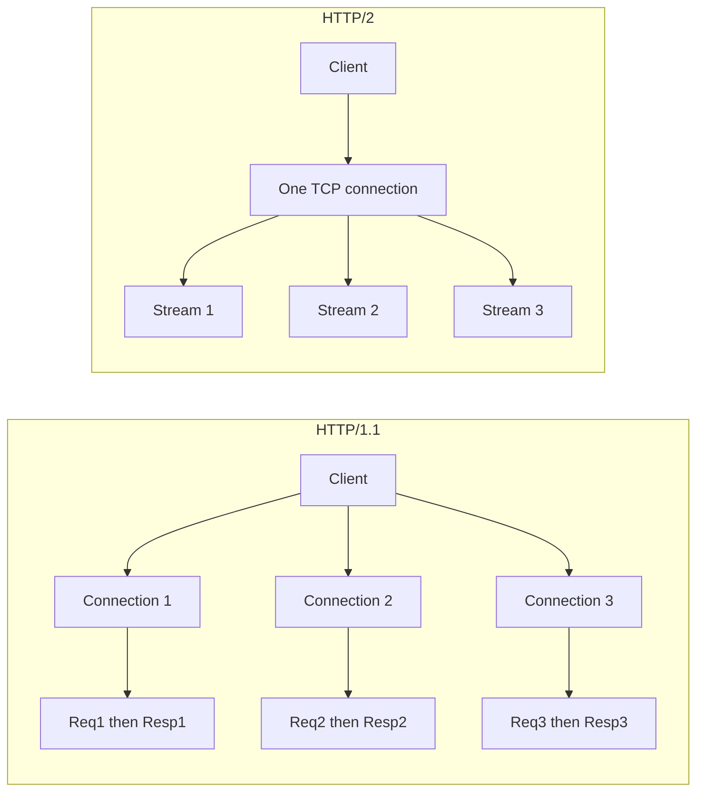
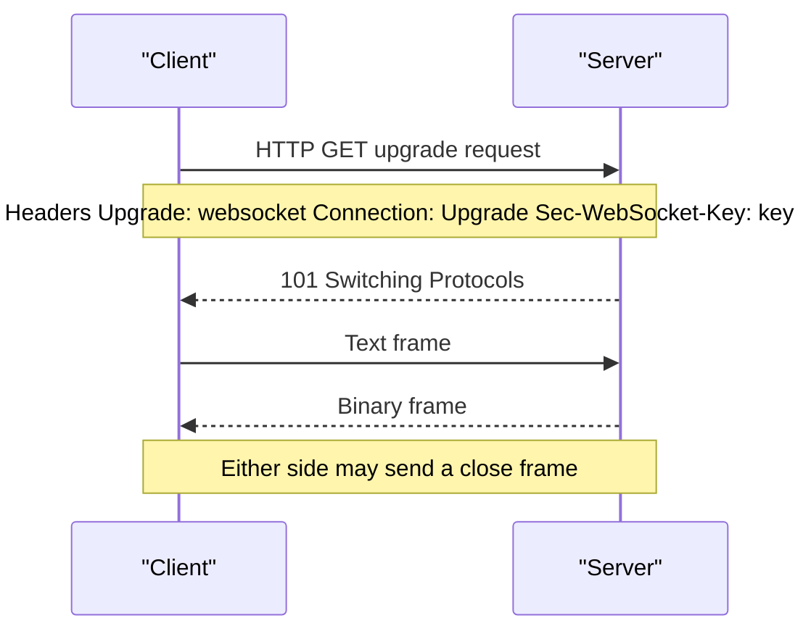

# 4. HTTP, REST, gRPC and WebSockets

> **TL;DR:** Know raw **HTTP** semantics first, then when to choose **REST**, **gRPC**, **WebSocket**, **SSE**, **long polling**, or **webhooks**. Senior interviews focus on idempotency, retries, `HttpClientFactory`, HTTP version trade-offs, TLS termination, gRPC browser/load-balancing limits, and WebSocket scaling.

**Interview weight:** P1 — heavily probed for backend roles.

## Core Concepts

- **HTTP** — stateless request/response protocol used by browsers, APIs, proxies, and service-to-service calls.
- **REST** — resource-oriented API style over `HTTP`; standard verbs, status codes, cache semantics.
- **gRPC** — contract-first RPC over `HTTP/2`, usually with `protobuf` payloads and typed stubs.
- **WebSocket** — long-lived full-duplex connection created via an HTTP upgrade handshake.
- **SSE** — server-to-client event stream over plain HTTP.
- **Long polling** — client issues repeated HTTP requests that stay open until data is available.
- **Webhooks** — server-to-server callbacks triggered by events.
- **Idempotency** — repeating the same operation yields the same end state.

## HTTP Request/Response Anatomy

- **Request**
- **Request line** — method, path, version.
- **Headers** — metadata such as auth, content type, cache hints, correlation IDs.
- **Blank line** — terminates headers.
- **Body** — optional payload.
- **Response**
- **Status line** — version, status code, reason phrase.
- **Headers** — metadata about payload, caching, retries, cookies.
- **Body** — optional payload.

```http
POST /orders HTTP/1.1
Host: api.example.com
Authorization: Bearer <token>
Content-Type: application/json
Content-Length: 18
X-Request-Id: 2fd1c8

{"sku":"A1","qty":2}

HTTP/1.1 201 Created
Content-Type: application/json
ETag: "v3"
Cache-Control: no-store
X-Request-Id: 2fd1c8

{"id":"ord_42"}
```

| Header | Direction | Why it matters |
| --- | --- | --- |
| `Content-Type` | Request/Response | Declares payload format such as `application/json` or `application/grpc`. |
| `Content-Length` | Request/Response | Exact body size when known up front. |
| `Transfer-Encoding` | Response | `chunked` enables streaming without a precomputed length. |
| `Authorization` | Request | Carries bearer token, basic auth, or signed credential. |
| `Cache-Control` | Response | Controls caching behavior such as `no-store`, `max-age`, `public`. |
| `ETag` | Response | Version identifier for cache revalidation or optimistic concurrency. |
| `If-None-Match` | Request | Lets client ask for `304 Not Modified` when `ETag` matches. |
| `X-Request-Id` | Request/Response | Correlates logs across hops. |
| `Retry-After` | Response | Tells client when to retry after `429` or `503`. |

## HTTP Methods

- **Safe** — should not mutate server state.
- **Idempotent** — repeating the same call yields the same effect.

| Method | Safe? | Idempotent? | Cacheable? | Has body? | Use case |
| --- | --- | --- | --- | --- | --- |
| `GET` | Yes | Yes | Yes | Rare | Read a resource or collection. |
| `POST` | No | No | Usually no | Yes | Create resource, trigger command, non-idempotent submit. |
| `PUT` | No | Yes | Usually no | Yes | Replace full resource at known URI. |
| `PATCH` | No | Usually no | Usually no | Yes | Partial update. |
| `DELETE` | No | Yes | Usually no | Rare | Delete resource. |
| `HEAD` | Yes | Yes | Yes | No | Fetch headers only; health checks, metadata, cache validation. |
| `OPTIONS` | Yes | Yes | Rare | No | Discover allowed methods, CORS preflight. |

## Status Codes That Get Probed

| Code | Meaning | When client should retry | Notes |
| --- | --- | --- | --- |
| `200 OK` | Successful read or action | No | Default success with response body. |
| `201 Created` | New resource created | No | Return `Location` when useful. |
| `202 Accepted` | Accepted for async processing | Poll later, not immediate blind retry | Use for queued work. |
| `204 No Content` | Success with no body | No | Common for delete/update where body adds no value. |
| `301 Moved Permanently` | Permanent redirect | Follow redirect | Some clients may rewrite `POST` to `GET`; risky for commands. |
| `302 Found` | Temporary redirect | Follow redirect | Historically may rewrite method to `GET`. |
| `307 Temporary Redirect` | Temporary redirect preserving method/body | Follow redirect | Safe for non-`GET` because method is preserved. |
| `308 Permanent Redirect` | Permanent redirect preserving method/body | Follow redirect | Permanent + method preserving. |
| `400 Bad Request` | Malformed request | No until request is fixed | Syntax, missing fields, bad query params. |
| `401 Unauthorized` | Authentication required/invalid | After refreshing credentials | Means unauthenticated, despite the name. |
| `403 Forbidden` | Authenticated but not allowed | No unless permissions change | AuthN succeeded; AuthZ failed. |
| `404 Not Found` | Resource missing | Usually no | Can also intentionally hide existence. |
| `409 Conflict` | State conflict | After conflict resolution | Common for version mismatch or duplicate create. |
| `422 Unprocessable Entity` | Semantically invalid payload | No until payload is fixed | Syntax valid, business rule failed. |
| `429 Too Many Requests` | Rate limited | Yes, honor `Retry-After` | Back off with jitter. |
| `500 Internal Server Error` | Generic server failure | Maybe, only with bounded retries | Last-resort bucket; log and alert. |
| `502 Bad Gateway` | Upstream returned invalid response | Yes | Proxy/load balancer could not get valid upstream response. |
| `503 Service Unavailable` | Service overloaded/down for maintenance | Yes, honor `Retry-After` | Usually transient capacity or maintenance issue. |
| `504 Gateway Timeout` | Upstream timed out | Yes | Proxy timed out waiting on dependency. |

## Content Negotiation and Cookies

- **Content negotiation**
- Client sends `Accept` to express preferred response format.
- Client sends `Content-Type` to declare request body format.
- Server may return `406 Not Acceptable` or `415 Unsupported Media Type`.
- **Cookies**
- Server sets cookie with `Set-Cookie`.
- Client sends stored cookies in `Cookie`.

| Cookie attribute | Why it matters |
| --- | --- |
| `Secure` | Send only over HTTPS. |
| `HttpOnly` | JavaScript cannot read it; reduces XSS impact. |
| `SameSite=Lax` | Good default for many app cookies; blocks many CSRF cases. |
| `SameSite=Strict` | Strongest CSRF protection; can break cross-site flows. |
| `SameSite=None; Secure` | Required for cross-site cookies; must be HTTPS. |

## HTTP Versions and Multiplexing

| Feature | HTTP/1.1 | HTTP/2 | HTTP/3 |
| --- | --- | --- | --- |
| Transport | `TCP` | `TCP` | `QUIC` over `UDP` |
| Multiplexing | No true multiplexing; usually one in-flight request per connection | Many streams per connection | Many streams per connection |
| Header compression | None | `HPACK` | `QPACK` |
| Server push | No | Yes in protocol, rarely used/deprecated in practice | Effectively no practical dependency in browsers |
| HoL blocking | App-level per connection | TCP packet loss can stall all streams on that connection | Per-stream; avoids TCP HoL across streams |
| Connection model | Many keep-alive connections per origin | Usually one connection per origin with many streams | Usually one QUIC connection per origin |
| TLS required | No | Protocol allows cleartext `h2c`, browsers effectively require TLS | Yes |
| .NET support class | `HttpClient` + `SocketsHttpHandler` | `HttpClient` + `SocketsHttpHandler` | `HttpClient` + `SocketsHttpHandler` with HTTP/3 enabled |



- **Interview point:** `HTTP/2` removes request serialization at the application layer, but packet loss on the single `TCP` connection can still delay every stream.

## HTTPS and TLS

- **TLS 1.2 handshake** — typically `2 RTT`: `ClientHello`, `ServerHello + Certificate`, key exchange, `Finished`.
- **TLS 1.3 handshake** — typically `1 RTT`; resumed sessions can use `0-RTT`.
- **0-RTT caveat** — replayable; do not use for non-idempotent operations unless carefully designed.
- **TLS termination choices**

| Termination point | Benefit | Cost | Good fit |
| --- | --- | --- | --- |
| Load balancer / gateway | Simpler ops, offloads certs, easier inspection/WAF | Traffic is decrypted before app tier unless re-encrypted | Most edge-facing web APIs |
| End-to-end to app | Better security boundary, reduces trust in intermediaries | Harder debugging, cert management is more complex | Regulated/internal zero-trust paths |

- **Certificate pinning**
- Client pins expected certificate or public key.
- Protects against rogue or compromised CAs.
- Brittle during rotation or emergency reissue.
- Usually reserved for tightly controlled mobile/desktop clients, not general browser apps.

## Connection Reuse and Pooling

- **HTTP/1.1**
- `Connection: keep-alive` reuses sockets.
- Browsers commonly cap at about `6` connections per origin.
- Too many short-lived connections cause handshakes and ephemeral port pressure.
- **HTTP/2**
- Single connection per origin can multiplex many requests.
- **.NET guidance**
- **Always** prefer `IHttpClientFactory` over `new HttpClient()` in DI-based apps.
- `HttpClient` pooling is implemented by `SocketsHttpHandler` per endpoint.

| Setting | Why tune it | Senior default |
| --- | --- | --- |
| `MaxConnectionsPerServer` | Prevent queueing and pool starvation on hot dependencies | Size from concurrency and dependency latency, not guesswork |
| `PooledConnectionLifetime` | Recycle connections for DNS refresh and stale connection cleanup | Around `2` minutes for dynamic backends |
| `PooledConnectionIdleTimeout` | Trim idle sockets and reduce waste | Keep short enough for bursty traffic, not so short that handshakes spike |
| `ConnectTimeout` | Bound connection establishment time | Set explicitly on modern `SocketsHttpHandler` |

- **DNS staleness interview answer**
- `IHttpClientFactory` rotates handlers.
- `PooledConnectionLifetime` forces pooled connections to expire and re-resolve DNS.
- Existing open sockets do **not** magically move to a new IP.

## Chunked Transfer and Streaming

- **`Transfer-Encoding: chunked`**
- Server can stream data before full response size is known.
- Client reads incrementally instead of buffering the full body.
- **ASP.NET Core patterns**
- Stream bytes with `Response.Body`.
- Stream records with `IAsyncEnumerable<T>` from minimal APIs.
- **When useful**
- Large exports.
- AI/chat streaming.
- Event feeds.
- Reducing time-to-first-byte.

## gRPC Deep Dive

- **Protobuf contract**
- Define schema in `.proto`.
- Compile to strongly typed client/server stubs.
- Backward compatibility depends on stable **field numbers**.
- **RPC types**

| RPC type | Shape | Typical use |
| --- | --- | --- |
| Unary | One request, one response | CRUD-like service-to-service calls |
| Server streaming | One request, many responses | Feed, export, progress stream |
| Client streaming | Many requests, one response | Batched ingest, telemetry upload |
| Bidirectional streaming | Many requests, many responses | Real-time duplex pipelines |

- **Deadlines**
- **Always set them.**
- Use absolute deadline such as `new CallOptions(deadline: DateTime.UtcNow.AddSeconds(5))`.
- **Deadline != timeout** — deadline is an absolute budget that can propagate downstream.
- **Common status codes**
- `OK`, `CANCELLED`, `UNKNOWN`, `INVALID_ARGUMENT`, `DEADLINE_EXCEEDED`, `NOT_FOUND`, `ALREADY_EXISTS`, `PERMISSION_DENIED`, `UNAVAILABLE`, `INTERNAL`.
- **Interceptors**
- Similar to middleware.
- Use for logging, auth, retries, tracing, correlation.
- **`grpc-web` limitation**
- Browsers cannot speak native `HTTP/2` gRPC directly.
- Use a proxy such as Envoy or `grpc-web` gateway for browser clients.
- **Load balancing gotcha**
- Long-lived `HTTP/2` connections can stick a client to one backend.
- Fix with client-side load balancing, service mesh, or headless service in Kubernetes.

## WebSocket Handshake and Lifecycle



- **Lifecycle**
- Starts as HTTP.
- Upgrades with `Upgrade: websocket` and `Connection: Upgrade`.
- After `101`, both sides exchange text or binary frames.
- Either side can send a close frame.
- **Scaling concerns**
- Each connection holds memory and an async state machine; thread-per-connection is the wrong model.
- Sticky routing is commonly required so the same client lands on the same server.
- Azure Application Gateway supports cookie-based affinity.
- Per-server limits are often memory, CPU, NIC, and ephemeral ports; `100K+` async connections are possible with careful tuning.
- Multi-instance fanout needs a backplane such as SignalR with Redis pub/sub.

## SSE vs WebSocket

| Aspect | SSE | WebSocket |
| --- | --- | --- |
| Direction | Server to client | Bidirectional |
| Transport | Plain HTTP | HTTP upgrade to WebSocket protocol |
| Protocol | Text event stream | Text or binary frames |
| Reconnect built-in | Yes in browser `EventSource` | No, app must handle reconnect |
| Browser support | Very good | Very good |
| Proxy/firewall friendly | Better | Sometimes blocked or inspected differently |
| Use case | Notifications, feed updates, server push only | Chat, collaboration, gaming, duplex control plane |

## Idempotency and Retries over HTTP

- **Idempotency key**
- Client sends unique ID such as `Idempotency-Key`.
- Server stores result keyed by client + operation + key.
- Retries return the original result instead of duplicating work.
- **Safe retry guidance**
- `GET`, `PUT`, `DELETE` are idempotent.
- `POST` is not; add idempotency key for creates/payments/orders.
- **`Retry-After`**
- Honor for `429` and `503`.
- Can be seconds or an absolute timestamp.
- **Backoff formula**
- `delay = min(cap, base * 2^attempt) + random(0, jitter)`.

## API Timeouts and Keep-alive Tuning for 5K RPS

- **Timeouts**
- `HttpClient.Timeout` is the total request budget.
- Connection timeout is not configured on `HttpClient` itself; in modern .NET use `SocketsHttpHandler.ConnectTimeout`.
- Keep request deadlines lower than upstream/load-balancer idle timeouts.
- **Practical tuning**
- Set `PooledConnectionLifetime = 2min` for DNS refresh.
- Keep idle timeout short enough to drop dead sockets, but not so short that handshakes dominate.
- Tune `MaxConnectionsPerServer` from concurrency, p99 latency, and dependency saturation behavior.
- Prefer `HTTP/2` for high parallelism to reduce connection count.
- **Measure before and after**
- p99 connection time.
- p99 request time.
- Pool exhaustion / queued requests.
- `dotnet-counters` for handler, sockets, and runtime signals.

## Comparison

| Aspect | REST | gRPC | GraphQL | WebSocket | SSE | Long Polling | Webhooks |
| --- | --- | --- | --- | --- | --- | --- | --- |
| Direction | Request/response | Unary or streaming | Request/response | Bidirectional | Server to client | Client pull | Server to server push |
| Transport | `HTTP/1.1`, `HTTP/2`, `HTTP/3` | Mostly `HTTP/2` | `HTTP` | WebSocket over upgraded HTTP | `HTTP` | `HTTP` | `HTTP` |
| Payload format | Usually JSON | Usually `protobuf` | JSON | Text or binary frames | Text events | Usually JSON | Usually JSON |
| Streaming support | Limited, manual | First-class | Subscriptions are extra complexity | Native | Native server push only | Simulated via repeated held requests | No live stream; one event per callback |
| Browser native support | Excellent | No direct native gRPC; use `grpc-web` | Excellent | Excellent | Excellent | Excellent | Not browser-oriented |
| Tooling/ecosystem | Ubiquitous | Strong internal microservice tooling | Strong frontend tooling | Good real-time libraries | Very simple | Simple but inefficient | Great for integrations |
| Schema/contract | Optional `OpenAPI` | Strong `.proto` contract | Strong typed schema | App-defined | Weak/lightweight | Weak/lightweight | Contract by documentation/signature |
| Latency overhead | Moderate | Low and compact | Can overfetch less but parsing/resolution can cost more | Low after connection setup | Low after setup | High due to repeated reconnect | Eventual/asynchronous |
| When to use | Public APIs, broad compatibility | Internal service-to-service, high throughput, strict contracts | Client-driven aggregation | Real-time duplex communication | One-way live updates | Legacy near-real-time updates | External event notifications |

## Code Example

```csharp
using Grpc.Core;
using Grpc.Core.Interceptors;
using Grpc.Net.Client;
using Orders;

public sealed class ClientLoggingInterceptor : Interceptor
{
    public override AsyncUnaryCall<TResponse> AsyncUnaryCall<TRequest, TResponse>(
        TRequest request,
        ClientInterceptorContext<TRequest, TResponse> context,
        AsyncUnaryCallContinuation<TRequest, TResponse> continuation)
    {
        Console.WriteLine($"{context.Method.FullName} deadline={context.Options.Deadline:O}");
        return continuation(request, context);
    }
}

var channel = GrpcChannel.ForAddress("https://orders.internal");
var invoker = channel.Intercept(new ClientLoggingInterceptor());
var client = new Orders.OrdersClient(invoker);

var reply = await client.GetOrderAsync(
    new GetOrderRequest { Id = "42" },
    new CallOptions(deadline: DateTime.UtcNow.AddSeconds(5)));

Console.WriteLine(reply.Status);
```

- **What this shows**
- Typed gRPC client.
- Interceptor for cross-cutting concerns.
- Explicit deadline on every call.

## Trade-offs

| Decision | Benefit | Cost | Production note |
| --- | --- | --- | --- |
| REST vs gRPC | REST is universal; gRPC is compact and strongly typed | REST is verbose; gRPC is browser-hostile without proxy | Common pattern: REST externally, gRPC internally |
| TLS termination at edge vs end-to-end | Edge simplifies ops; end-to-end strengthens trust boundary | Edge exposes plaintext inside network; end-to-end is harder to inspect | Re-encrypt internally for sensitive paths |
| WebSocket vs SSE | WebSocket supports duplex; SSE is simpler | WebSocket needs connection/state management; SSE is one-way only | Pick SSE unless client-to-server realtime is required |
| HTTP/2 vs HTTP/3 | HTTP/3 improves loss recovery and tail latency on bad networks | QUIC adds operational and debugging complexity | Measure client mix and network conditions before forcing it |
| Certificate pinning | Strong CA-compromise defense | Brittle rotation and outage risk | Use only where client fleet is tightly controlled |

## Common Pitfalls

- Treating `POST` as safely retryable without an idempotency key.
- Confusing `401` with `403`.
- Using `302` for non-`GET` redirects when `307` or `308` is required.
- Creating many `new HttpClient()` instances and exhausting sockets.
- Assuming `HTTP/2` eliminates all head-of-line blocking; TCP loss still hurts every stream.
- Forgetting gRPC deadlines, then discovering hung calls during incidents.
- Sending browser traffic directly to native gRPC instead of `grpc-web`.
- Scaling WebSockets without sticky routing or a pub/sub backplane.
- Enabling certificate pinning without a safe rotation plan.
- Setting aggressive idle timeouts that destroy connection reuse and inflate TLS handshake cost.

## Interview Questions

**Q1. What does idempotent mean?**
A: Repeating the same request has the same effect on server state. `GET`, `PUT`, and `DELETE` are idempotent; `POST` usually is not.

**Q2. What is the difference between `401` and `403`?**
A: `401` means the client is unauthenticated or has invalid credentials. `403` means authentication succeeded but the caller is not authorized.

**Q3. When do you use `200`, `201`, `202`, and `204`?**
A: `200` for normal success with body, `201` for creation, `202` for accepted async work, `204` for success with no body.

**Q4. What is the difference between `502`, `503`, and `504`?**
A: `502` means bad upstream response, `503` means service unavailable/overloaded, `504` means upstream timed out.

**Q5. What is the difference between `Accept` and `Content-Type`?**
A: `Accept` tells the server what response formats the client wants. `Content-Type` tells the server what the request body format is.

**Q6. How is `HTTP/2` better than `HTTP/1.1`?**
A: `HTTP/2` multiplexes many streams over one connection, compresses headers, and reduces connection count. It still inherits TCP packet-loss coupling.

**Q7. What improved from `TLS 1.2` to `TLS 1.3`?**
A: Fewer round trips, simpler cipher negotiation, better security defaults, and optional `0-RTT` resumption.

**Q8. When do you choose SSE over WebSocket?**
A: Choose SSE for one-way server push such as notifications or progress feeds. Choose WebSocket when the client must also send realtime messages.

**Q9. How does `IHttpClientFactory` help with DNS staleness?**
A: It manages handler lifetimes, and with `PooledConnectionLifetime` it forces connections to recycle so new DNS resolutions are picked up.

**Q10. What is `grpc-web`, and why is it needed?**
A: It adapts gRPC for browsers because browsers do not expose raw native gRPC over `HTTP/2`. A proxy translates between browser-friendly requests and backend gRPC.

**Q11. Why can browsers not natively use normal gRPC?**
A: Browsers do not give JavaScript the required low-level control over `HTTP/2` framing and trailers that native gRPC expects. That is why browser clients use `grpc-web` via a proxy.

**Q12. What gRPC load-balancing issue appears in production?**
A: One long-lived `HTTP/2` connection can pin a client to one backend, creating uneven load and hot spots. Fix with client-side LB, service mesh, or Kubernetes headless-service patterns.

**Q13. How do you scale WebSocket connections across multiple instances?**
A: Use async I/O, sticky routing, per-node connection limits, and a backplane such as SignalR with Redis for cross-instance fanout.

**Q14. What happens to `HTTP/2` under packet loss?**
A: All streams on that TCP connection can stall until lost packets are retransmitted. `HTTP/3` reduces this by moving multiplexing to QUIC over UDP.

**Q15. How would you design retries for a create-order API at `5K` RPS?**
A: Use `POST` with an idempotency key, bounded exponential backoff with jitter, respect `Retry-After`, set a client deadline, and emit request IDs so duplicates and retry storms are diagnosable.

## Quick Recap

- **HTTP basics first** — methods, headers, status codes, caching, retries.
- **Use `307`/`308`** when redirecting non-`GET` methods because they preserve method and body.
- **`HTTP/2` multiplexes**, but TCP loss still creates shared pain; **`HTTP/3`** improves that with QUIC.
- **Prefer `IHttpClientFactory`** and tune `PooledConnectionLifetime`, `PooledConnectionIdleTimeout`, and `MaxConnectionsPerServer`.
- **Set gRPC deadlines** on every call and use interceptors for logging/auth/tracing.
- **Browsers need `grpc-web`**; native gRPC is mainly for service-to-service traffic.
- **WebSocket scaling** needs sticky routing, async connection handling, and a backplane for fanout.

