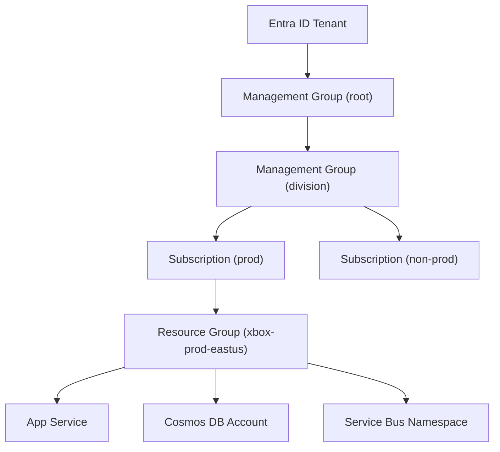
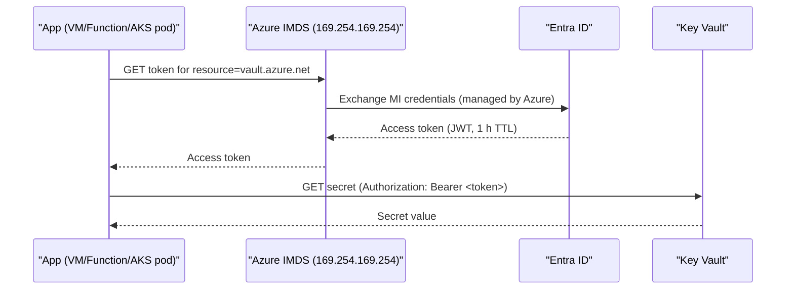

# 1. Azure Core Services

> **TL;DR:** Azure organises resources in a hierarchy of tenant → subscription → resource group → resource. Compute spans serverless Functions to managed K8s (AKS). Identity hinges on Managed Identity, eliminating secret sprawl.

**Interview weight:** P1 — interviewers probe service selection rationale, Managed Identity, and networking boundaries at senior level.

---

## Core Concepts

- **Tenant** — Azure Active Directory (Entra ID) boundary; represents an organisation.
- **Management Group** — groups subscriptions for policy and RBAC inheritance.
- **Subscription** — billing unit and trust boundary; quota limits apply per subscription.
- **Resource Group** — logical container; lifecycle unit (delete RG = delete all resources).
- **Resource** — individual service instance (e.g. a single App Service).

---

## Service Models

| Model | You manage | Azure manages | Azure examples | AWS equivalent |
| ----- | ---------- | ------------- | -------------- | -------------- |
| **IaaS** | OS, runtime, app, data | Hardware, network fabric | VMs, Managed Disks | EC2, EBS |
| **PaaS** | App code, config | OS, runtime, scaling | App Service, Azure SQL | Elastic Beanstalk, RDS |
| **CaaS** | Containers, manifests | Control plane, nodes (optional) | AKS (managed), Container Apps | EKS, ECS Fargate |
| **FaaS** | Function code, triggers | Runtime, scaling, infra | Azure Functions | AWS Lambda |
| **SaaS** | Config, data | Everything | Microsoft 365, GitHub | Salesforce |

Ops burden decreases IaaS→SaaS; control decreases correspondingly.

---

## Azure Resource Hierarchy



---

## Compute — Comparison

| Service | Scaling model | Cold start | Cost model | Ops burden | Best fit |
| ------- | ------------- | ---------- | ---------- | ---------- | -------- |
| **App Service** | Manual / auto-scale rules; min 1 instance | None | Per-hour per plan | Low | Long-running HTTP APIs, easy lift-and-shift |
| **Container Apps** | KEDA-based, scale-to-zero | ~1–3 s | Per vCPU-s + memory-s | Low | Containerised microservices, event-driven workers |
| **AKS** | HPA/KEDA/Cluster Autoscaler | None (pods pre-warm) | Node VM cost | High | Large workloads needing fine-grained control, stateful services |
| **Functions (Consumption)** | Auto, scale-to-zero | ~1–3 s (.NET) | Per execution + GB-s | Very low | Event triggers, glue code, infrequent jobs |
| **Functions (Premium)** | Pre-warmed, VNet | None | Per-hour pre-warmed | Low | Functions needing VNet, no cold start |
| **VMs** | VMSS with scale-sets | N/A | Per-hour | Very high | Legacy apps, custom OS, GPU |
| **Batch** | Pool autoscale | Minutes | Per-node | Medium | HPC, large embarrassingly parallel jobs |

---

## Azure Functions — Deep Dive

**Triggers:** HTTP, Timer, Service Bus, Event Grid, Event Hub, Blob, Queue, Cosmos DB change feed, Durable, SignalR, Kafka.

**Plans:**
- **Consumption** — true pay-per-exec; cold starts; max 10 min timeout; no VNet.
- **Premium (Elastic)** — pre-warmed workers; VNet integration; max 60 min timeout; higher cost floor.
- **Dedicated (App Service Plan)** — always-on; predictable cost; no auto-scale-to-zero by default.

**Durable Functions orchestration patterns:**

| Pattern | When to use | Key API |
| ------- | ----------- | ------- |
| **Function chaining** | Sequential steps, pass output forward | `context.CallActivityAsync` |
| **Fan-out / fan-in** | Parallel work, aggregate results | `Task.WhenAll` of activity tasks |
| **Human interaction** | Wait for approval/input with timeout | `WaitForExternalEvent` + `CreateTimer` |
| **Eternal orchestration** | Continuous background polling | `ContinueAsNew` to avoid history bloat |
| **Aggregator (stateful entity)** | Accumulate events, durable state | `DurableEntityClient` |

---

## Data Services — Comparison

| Service | Model | Partition/Scale | Consistency | Best fit | Cross-link |
| ------- | ----- | --------------- | ----------- | -------- | ---------- |
| **Cosmos DB** | Multi-model (document, KV, graph, columnar) | Horizontal; partition key; 10 GB / 10 K RU/s per logical partition | 5 levels: Strong→Eventual | Global, high-throughput, flexible schema | [07-Cosmos-DB-Deep-Dive](../04-Databases/07-Cosmos-DB-Deep-Dive.md) |
| **Azure SQL** | Relational (T-SQL) | Vertical + read replicas; Hyperscale for petabyte | Serializable default | Relational workloads, ACID transactions | — |
| **PostgreSQL Flexible** | Relational | Vertical + read replicas; Citus for sharding | Serializable | OSS stack, JSON + JSONB, PostGIS | — |
| **Table Storage** | Key-value (partition+row key) | Horizontal, auto | Eventual | Cheap high-volume structured data, audit logs | — |
| **Blob Storage** | Object store | Auto, tiered (Hot/Cool/Archive) | Eventual | Unstructured data, media, backups, static sites | — |
| **Data Lake Gen2** | Hierarchical object store | Auto | Eventual | Analytics, Spark/Databricks, raw data landing zone | — |

---

## Messaging — Comparison

| Service | Model | Ordering | Max retention | Throughput | Best fit | Cross-link |
| ------- | ----- | -------- | ------------- | ---------- | -------- | ---------- |
| **Service Bus** | Queue / Topic-Subscription (broker) | FIFO per session; sessions for strict order | 14 days | Up to 1 MB msg; ~10 K/s per queue | Command/workflow, exactly-once (peek-lock), ordering | [06-Message-Queues](../05-System-Design-HLD/06-Message-Queues-and-Pub-Sub.md) |
| **Event Grid** | Pub/Sub (push, HTTP/WebHook) | Best-effort | 24 h retry | ~10 M events/s | Reactive integrations, Azure resource events, webhooks | same |
| **Event Hubs** | Streaming (partitioned log) | Per partition | 1–7 days (up to 90 with Premium) | ~1 M events/s | Telemetry ingest, log streaming, Kafka-compatible | same |
| **Storage Queues** | Simple queue (pull) | Best-effort | 7 days | ~2 K msg/s | Simple decoupling, lowest cost, no sessions needed | same |

---

## Identity & Security

### Entra ID (Azure AD)

- **Service Principal** — identity for an app/service; requires client secret or certificate rotation.
- **Managed Identity** — Azure-managed service principal; no credential storage ever required.

### Managed Identity — How It Works



- **System-assigned** — tied to resource lifecycle; auto-deleted when resource is deleted; one-to-one.
- **User-assigned** — standalone resource; many-to-many; survives resource recreation; preferred for shared identity across multiple resources (e.g. a single MI for all Functions in a namespace).
- Why it eliminates secrets: Azure rotates credentials internally; no app code touches a password/key.

### RBAC

- Scopes (widest→narrowest): Management Group → Subscription → Resource Group → Resource.
- Role assignment at a wider scope inherits down.
- Principle of least privilege: assign roles at resource level when possible.
- Common roles: `Owner`, `Contributor`, `Reader`, `Storage Blob Data Reader`, `Key Vault Secrets User`.

### Key Vault

- Secrets, keys (HSM-backed), certificates in one place.
- Access via Managed Identity + RBAC (`Key Vault Secrets User` role).
- Soft-delete + purge protection prevents accidental permanent deletion.
- Reference secrets in App Service / Functions config without ever copying the value: `@Microsoft.KeyVault(SecretUri=https://...)`.

---

## Networking

### Core Primitives

- **VNet** — isolated Layer-3 network; spans one region; subnets within.
- **NSG** — stateful L4 firewall; rules on subnet or NIC; deny by default with priority ordering.
- **Private Endpoint** — NIC inside your VNet with a private IP for a PaaS service; traffic stays on the Azure backbone, not public internet.
- **Service Endpoint** — routes VNet traffic to PaaS service over Azure backbone but source IP remains VNet; less isolation than private endpoint.

| Feature | Private Endpoint | Service Endpoint |
| ------- | ---------------- | ---------------- |
| Private IP in VNet | Yes | No |
| DNS resolution | Custom private DNS | Public DNS |
| Data exfiltration prevention | Yes (resource tied to VNet) | Partial |
| Cost | Per-endpoint + data | Free |
| Use when | Production, compliance, Cosmos/SQL/KeyVault | Dev/test, cost-sensitive, quick setup |

### Traffic Management

| Service | Layer | Use case | Global? |
| ------- | ----- | -------- | ------- |
| **Azure Load Balancer** | L4 (TCP/UDP) | Internal/external VM load balancing | Regional |
| **Application Gateway** | L7 (HTTP/S) | URL routing, WAF, SSL offload | Regional |
| **Front Door** | L7 + CDN | Global HTTPS routing, WAF, static content, DDoS | Global |
| **Traffic Manager** | DNS (L7 policy) | DNS-based failover/weighted routing across regions | Global |

---

## Observability

### Application Insights

- SDK auto-instruments HTTP requests, dependencies (SQL, HTTP, Service Bus), exceptions.
- Sends telemetry to a **Log Analytics workspace** (unified storage).
- Sampling: adaptive (default) or fixed-rate; always capture exceptions.
- Correlation via `Operation-Id` header → distributed trace across services.

### KQL Examples

```kql
// Top 5 slowest dependencies in the last hour
dependencies
| where timestamp > ago(1h)
| summarize p99=percentile(duration, 99) by name
| top 5 by p99 desc

// Exception trend by type, last 24 h
exceptions
| where timestamp > ago(24h)
| summarize count() by type, bin(timestamp, 1h)
| render timechart

// p99 request latency per operation, last 1 h
requests
| where timestamp > ago(1h)
| summarize p99=percentile(duration, 99) by operation_Name
| order by p99 desc
```

### Alerts

- **Metric alerts** — fast (1-min granularity), low cost; ideal for CPU, RPS, error rate.
- **Log alerts** — KQL-based; richer signal; min 1-min evaluation; higher cost.
- **Smart detection** — App Insights anomaly detection for failure rate/latency spikes.

---

## Azure-to-AWS Service Mapping

| Azure | AWS |
| ----- | --- |
| App Service | Elastic Beanstalk / App Runner |
| Azure Functions | Lambda |
| AKS | EKS |
| Container Apps | ECS Fargate |
| Cosmos DB | DynamoDB |
| Azure SQL | RDS SQL Server / Aurora |
| Blob Storage | S3 |
| Service Bus | SQS (queue) / SNS (fan-out) |
| Event Hubs | Kinesis Data Streams |
| Event Grid | EventBridge |
| Key Vault | Secrets Manager / Parameter Store |
| Managed Identity | IAM Instance Profile / IRSA |
| Front Door | CloudFront + Route 53 |
| Application Gateway | ALB |
| VNet / NSG | VPC / Security Groups |
| Azure DevOps Pipelines | CodePipeline / GitHub Actions |
| App Insights | CloudWatch + X-Ray |
| Log Analytics | CloudWatch Logs Insights |

---

## Trade-offs & When to Use

- **App Service vs AKS** — App Service for simpler HTTP APIs where team can't staff platform engineers; AKS when you need fine-grained resource isolation, multi-tenant pod security, or KEDA-on-custom-metrics.
- **Functions Consumption vs Premium** — Consumption for low-traffic triggers; Premium when VNet integration or consistent sub-second response is required.
- **Service Bus vs Event Hubs** — Service Bus for commands (processing order matters, need DLQ, at-most-once); Event Hubs for high-volume event streams (telemetry, log pipelines, Kafka compat).
- **Private Endpoint vs Service Endpoint** — Private Endpoint for production (full network isolation, compliance); Service Endpoint for dev/test or if DNS complexity is a concern.

---

## Common Pitfalls

- Using `latest` tag in production deployments → breaks immutable infra, hard to roll back.
- Forgetting to scope Managed Identity RBAC at resource level → over-privileged service.
- Not setting `Always On` on App Service for background workers → IIS idle timeout kills them.
- Storage Queues instead of Service Bus when ordering or DLQ matters.
- Missing NSG egress rules — NSGs allow all outbound by default; add explicit deny-all-outbound + allow-needed for defense in depth.

---

## Interview Questions

**Q1. What is the difference between a Service Principal and a Managed Identity?**
A: Both are Entra ID identities for apps. A service principal requires manual credential management (secret or certificate with rotation). A Managed Identity is fully managed by Azure — no credential is ever stored in app config; Azure issues short-lived tokens via IMDS. Use Managed Identity whenever the workload runs on Azure.

**Q2. What are the five Cosmos DB consistency levels?**
A: Strong, Bounded staleness, Session (default), Consistent prefix, Eventual. Strong guarantees linearizability but adds latency; Session is the sweet spot for most read-your-own-writes patterns; Eventual is cheapest and fastest.

**Q3. When would you choose Service Bus over Event Hubs?**
A: Service Bus when you need message ordering (sessions), dead-letter queue, duplicate detection, or long retention with acknowledgment. Event Hubs when throughput > millions/s, you want a replayable log, or you need Kafka compatibility for telemetry pipelines.

**Q4. Explain how a user-assigned Managed Identity differs from system-assigned, and why you'd prefer one over the other.**
A: System-assigned is tied to the resource lifecycle and auto-deleted with it; 1:1 relationship. User-assigned is a standalone resource that survives the compute resource and can be shared across multiple services. Prefer user-assigned when the same identity needs to be reused (e.g. after a slot swap, or shared across multiple Functions), or when you want a consistent role-assignment target across deployments.

**Q5. What is the difference between a Private Endpoint and a Service Endpoint?**
A: Private Endpoint injects a NIC with a private IP into your VNet; the PaaS service is resolved to that private IP and traffic never leaves the VNet. Service Endpoint routes traffic over Azure backbone but source IP is still the VNet address; the PaaS resource still has a public endpoint. Private Endpoint is preferred for production compliance and data-exfiltration prevention.

**Q6. You have a .NET API on App Service consuming from a Service Bus queue. Traffic is spiky — zero for hours, then 10,000 messages in 5 minutes. How would you redesign this?**
A: Move the consumer to Azure Functions (Consumption or Premium) with a Service Bus trigger. Functions scale per-partition automatically. If ordering matters (sessions), map each session to a Functions instance. Use Premium plan if VNet access or consistent warm instances are needed. KEDA on AKS is another option with more control.

**Q7. How does RBAC inheritance work in Azure, and what are the risks of assigning roles at a wide scope?**
A: Assignments at a wide scope (subscription or management group) inherit to all child resources. Risk: over-privilege — a bug or compromised identity can affect all resources. Always assign at the narrowest scope that satisfies the use case. Use `deny assignments` via Azure Policy to create explicit exclusions.

**Q8. Walk me through how Application Insights correlates a distributed trace across two microservices connected by Service Bus.**
A: The producer stamps the outgoing Service Bus message with `traceparent` (W3C format) in user properties. The App Insights SDK on the consumer reads that header, starts a child span linked to the same Operation-Id. Log Analytics joins requests/dependencies by `operation_Id`, giving end-to-end visibility in Transaction Search and Application Map.

**Q9. Your team is migrating secrets from app-config strings to Key Vault references. What's the migration path and what can go wrong?**
A: 1) Grant the App Service system-assigned Managed Identity the `Key Vault Secrets User` role. 2) Store secrets in Key Vault. 3) Replace app settings with `@Microsoft.KeyVault(SecretUri=...)` references. 4) Restart the app. Common pitfalls: DNS resolution delay for private-endpoint Key Vault; missing RBAC (app sees "403 Forbidden" at startup); forgetting to enable soft-delete and purge-protection; staging slots needing their own MI or a user-assigned one shared across slots.

**Q10. Compare Front Door and Application Gateway — when would you use both simultaneously?**
A: Front Door operates globally (anycast PoPs, DDoS L7 WAF, CDN, failover across regions). Application Gateway operates regionally (SSL offload, path-based routing, WAF per VNet). Use both: Front Door at the edge for global routing and CDN, Application Gateway inside each region as the ingress for AKS/App Service with WAF tuned to that region's traffic.

**Q11. Explain the trade-offs between Cosmos DB's five consistency models in a multi-region read/write scenario relevant to a 99.99% SLO gaming platform.**
A: Strong: lowest availability (blocks if any region is down), highest latency. Session: best for user-scoped workloads (player profile reads follow their own writes). Bounded staleness: bounded lag, good for leaderboards where slight delay is acceptable. Eventual: highest availability, lowest latency, fine for game telemetry. For 99.99% SLO with global active-active, use Session for player state (read-your-writes guarantee per session) and Eventual for telemetry/analytics writes.

**Q12. How would you design autoscaling for a Service Bus-backed processor to handle a 50x spike within 90 seconds?**
A: Use KEDA (on Container Apps or AKS) with the `azure-servicebus` scaler, scaling on `messageCount` + `activeMessageCount`. Set `scaleTargetRef` to the consumer Deployment, `minReplicaCount: 1` (avoid cold start lag), `maxReplicaCount` sized for peak. Set `pollingInterval: 10s`. Pre-warm with a `scaleUpStabilizationWindowSeconds: 0`. For Functions on Consumption, scale is automatic but max instances limit per subscription may need increasing. Pair with cooldown tuning to avoid flapping during gradual drain.

**Q13. (Leadership) Your team owns 600+ microservices. A critical CVE is published in a base image you use across all services. How do you remediate at scale without blocking each team?**
A: 1) Central platform team patches the base image and publishes a new tag (e.g. `mcr.microsoft.com/dotnet/aspnet:8.0.x-bookworm`). 2) CI pipeline enforces the updated base image via a shared pipeline template; containers that fail the scan cannot deploy. 3) Auto-PR bot (Renovate/Dependabot) opens a PR per repo to bump the base image tag. 4) Teams with green CI merge; services auto-deploy via CD. 5) A compliance dashboard (Azure Policy or custom KQL) tracks which services still run the vulnerable image — SLA to close is defined (e.g. P0 CVE = 7 days). Never manually touching 600 repos; the leverage is in the pipeline enforcement layer.

---

## Quick Recap

- Hierarchy: Tenant → Management Group → Subscription → Resource Group → Resource; RBAC inherits downward.
- IaaS→SaaS: more managed, less control; match to team ops maturity.
- Managed Identity = no secrets; system-assigned is 1:1 with resource; user-assigned is reusable.
- Service Bus = commands + ordering + DLQ; Event Hubs = streaming + replay; Event Grid = reactive events.
- Private Endpoint puts PaaS on your VNet with a private IP; Service Endpoint just routes traffic over Azure backbone.
- Front Door = global L7 + CDN; App Gateway = regional L7 WAF; Traffic Manager = DNS-only failover.
- App Insights + Log Analytics + KQL = full observability; correlate across services via `operation_Id`.
- Cosmos DB partition = 10 GB / 10 K RU/s max; pick partition key to avoid hot partitions.
