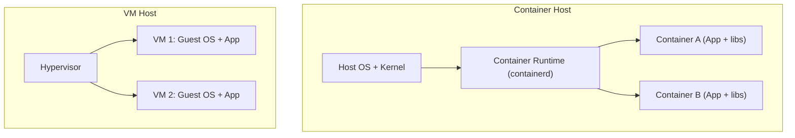
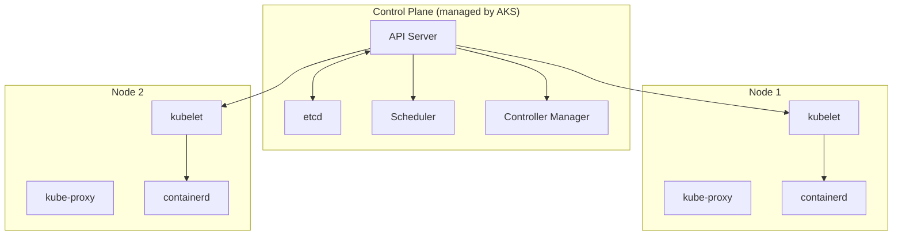

# 2. Containers, Docker & Kubernetes

> **TL;DR:** Containers package code + runtime into a portable, layered image. Kubernetes orchestrates containers at scale — declarative, self-healing, with rich scheduling primitives. AKS manages the control plane so you focus on workloads.

**Interview weight:** P1 — AKS is on the resume; interviewers probe K8s object model, KEDA, resource limits, and real troubleshooting scenarios.

---

## Containers vs VMs

| Aspect | Container | VM |
| ------ | --------- | -- |
| Isolation | Process-level (namespaces + cgroups) | Hardware-level (hypervisor) |
| OS overhead | Shared host kernel | Full guest OS per VM |
| Image size | MBs (layers shared) | GBs |
| Start time | Milliseconds to seconds | 30–60+ seconds |
| Density | 10–100s per host | 5–20 per host |
| Security boundary | Weaker (shared kernel) | Stronger |
| Best fit | Microservices, CI, scale-out | Legacy apps, GPU, custom kernel |



---

## Docker Image Layers

- Each `RUN`, `COPY`, `ADD` instruction creates a new read-only layer.
- Layers are cached by content hash; changing a layer invalidates all layers above it.
- Final image = ordered stack of layers + a thin read-write container layer at runtime.
- Shared base layers across images save disk space and pull time on the node.

---

## Dockerfile Best Practices for .NET

```dockerfile
# syntax=docker/dockerfile:1
# ── Build stage ──────────────────────────────────────────────────────────────
FROM mcr.microsoft.com/dotnet/sdk:8.0 AS build
WORKDIR /src

# Restore separately — cached unless .csproj changes
COPY ["MyApi/MyApi.csproj", "MyApi/"]
RUN dotnet restore "MyApi/MyApi.csproj"

COPY . .
WORKDIR "/src/MyApi"
RUN dotnet publish "MyApi.csproj" \
    -c Release \
    -o /app/publish \
    --no-restore \
    /p:PublishTrimmed=true \
    /p:TieredCompilation=false

# ── Runtime stage ─────────────────────────────────────────────────────────────
FROM mcr.microsoft.com/dotnet/aspnet:8.0-jammy-chiseled AS final
# chiseled = distroless Ubuntu; no shell, no package manager; minimal attack surface
WORKDIR /app
EXPOSE 8080

# Non-root user (chiseled images use UID 1654 by default)
USER $APP_UID

COPY --from=build /app/publish .
ENTRYPOINT ["dotnet", "MyApi.dll"]
```

**Key practices:**
- **Multi-stage build** — SDK image (~700 MB) stays in build stage; runtime image (~120 MB chiseled) ships.
- **Copy `.csproj` first, then source** — `dotnet restore` layer cached until project file changes.
- **Non-root user** — `chiseled` images enforce this; explicitly set `USER` otherwise.
- **`.dockerignore`** — exclude `bin/`, `obj/`, `.git/`, `*.md`, test projects to shrink build context.
- **Chiseled / distroless base** — removes shell, reduces CVE surface by ~50% vs full Debian.
- **Publish trimmed** — reduces IL output; test thoroughly with AOT for startup-time-critical functions.
- **Never `latest` in production** — pin to `8.0.x` digest (`@sha256:...`) for immutability.

---

## Registry and Tagging Strategy

- Tag = `<registry>/<repo>:<semver>-<build-id>` e.g. `myacr.azurecr.io/myapi:1.4.2-20240301.5`.
- `latest` is for local dev only; never deploy `latest` to staging or prod.
- Promote the **same image digest** from dev → staging → prod; never rebuild per environment.
- Scan images in CI (Trivy, Azure Defender for containers) before push to ACR.

---

## Kubernetes Architecture



- **API Server** — single entry point for all cluster operations; validates and persists to etcd.
- **etcd** — distributed KV store; source of truth for all cluster state.
- **Scheduler** — assigns pending Pods to Nodes based on resources, affinity, taints.
- **Controller Manager** — runs reconciliation loops (ReplicaSet, Deployment, Node controllers).
- **kubelet** — runs on each node; ensures containers in Pods are running and healthy.
- **kube-proxy** — maintains iptables/IPVS rules for Service VIPs.

---

## Core K8s Objects

| Object | Purpose | When to use |
| ------ | ------- | ----------- |
| **Pod** | Smallest deployable unit; 1+ containers sharing network/storage | Never directly; managed by controller |
| **ReplicaSet** | Maintains N identical Pod replicas | Rarely directly; managed by Deployment |
| **Deployment** | Declarative Pod update strategy; rolling/recreate | Stateless apps (APIs, workers) |
| **StatefulSet** | Ordered, stable Pod identity + persistent storage | Databases, Kafka, distributed caches |
| **DaemonSet** | One Pod per node | Log collectors, node monitoring agents |
| **Job** | Run-to-completion task | One-off batch, database migrations |
| **CronJob** | Scheduled Job | Scheduled reports, cleanup tasks |
| **Service** | Stable DNS + load-balancing for a Pod set | Every workload that needs discovery |
| **Ingress** | L7 HTTP routing rules; TLS termination | Public-facing HTTP endpoints |
| **ConfigMap** | Non-sensitive config key/value | App config, feature flags |
| **Secret** | Base64-encoded sensitive data (not encrypted by default) | Credentials — prefer CSI driver |
| **PVC** | Claim against a StorageClass for persistent volume | StatefulSets, data persistence |
| **HPA** | Auto-scale Deployment replicas on CPU/memory/custom metrics | CPU-bound or queue-driven workloads |
| **PDB** | Minimum available replicas during voluntary disruption | Critical services needing HA during upgrades |
| **Namespace** | Virtual cluster isolation | Environment, team, or tenant separation |

---

## Service Types

| Type | Exposure | Use case |
| ---- | -------- | -------- |
| **ClusterIP** | Internal only (stable VIP) | Service-to-service within cluster |
| **NodePort** | NodeIP:Port from outside cluster | Dev/test, on-prem without LB |
| **LoadBalancer** | Cloud provider external IP (Azure LB) | Public-facing services, managed ingress |
| **ExternalName** | CNAME alias to external DNS | Access external service by internal name |

---

## Realistic .NET API Deployment YAML

```yaml
apiVersion: apps/v1
kind: Deployment
metadata:
  name: myapi
  namespace: production
spec:
  replicas: 3
  selector:
    matchLabels:
      app: myapi
  strategy:
    type: RollingUpdate
    rollingUpdate:
      maxSurge: 1
      maxUnavailable: 0          # zero-downtime rolling update
  template:
    metadata:
      labels:
        app: myapi
    spec:
      terminationGracePeriodSeconds: 30
      containers:
        - name: myapi
          image: myacr.azurecr.io/myapi:1.4.2-20240301.5
          ports:
            - containerPort: 8080
          resources:
            requests:
              cpu: "250m"
              memory: "256Mi"
            limits:
              cpu: "500m"
              memory: "512Mi"
          livenessProbe:
            httpGet:
              path: /healthz/live
              port: 8080
            initialDelaySeconds: 10
            periodSeconds: 15
            failureThreshold: 3
          readinessProbe:
            httpGet:
              path: /healthz/ready
              port: 8080
            initialDelaySeconds: 5
            periodSeconds: 10
            failureThreshold: 3
          startupProbe:
            httpGet:
              path: /healthz/live
              port: 8080
            failureThreshold: 30
            periodSeconds: 2    # up to 60 s for slow startup
          lifecycle:
            preStop:
              exec:
                command: ["/bin/sh", "-c", "sleep 5"]  # drain in-flight requests
```

**Graceful shutdown in .NET:**
```csharp
// Program.cs — handle SIGTERM via IHostApplicationLifetime
app.Lifetime.ApplicationStopping.Register(() =>
{
    // Stop accepting new work; drain in-flight requests
    Thread.Sleep(5000); // give kube-proxy time to remove endpoint
});
```

K8s sends `SIGTERM` → `preStop` hook runs → `terminationGracePeriodSeconds` countdown → `SIGKILL` if still running.

---

## Update Strategies

| Strategy | Downtime | Rollback speed | Cost | Complexity | Notes |
| -------- | -------- | -------------- | ---- | ---------- | ----- |
| **Recreate** | Yes | Fast | Low | Low | Stop all, then start new; good for dev |
| **Rolling** | No | Moderate (re-roll) | Low | Low | Default; `maxUnavailable: 0` for zero downtime |
| **Blue-Green** | No | Instant (DNS/LB swap) | 2x cost during switch | Medium | Keep old env alive until smoke tests pass |
| **Canary** | No | Fast | ~1.x cost | High | Route % traffic to new version; real-traffic testing |

---

## Autoscaling

| Mechanism | Scales on | Notes |
| --------- | --------- | ----- |
| **HPA** | CPU, memory, custom metrics | Pod-level; responds in ~30–60 s |
| **VPA** | CPU/memory requests | Adjusts pod resource requests; may restart pods |
| **KEDA** | Any external metric (SB queue, RPS, custom) | Best for event-driven; scale-to-zero capable |
| **Cluster Autoscaler** | Pending pods (no schedulable node) | Adds/removes nodes; ~3–5 min lag |

**KEDA Service Bus scaler example:**
```yaml
apiVersion: keda.sh/v1alpha1
kind: ScaledObject
metadata:
  name: myworker-scaler
spec:
  scaleTargetRef:
    name: myworker
  minReplicaCount: 1
  maxReplicaCount: 50
  triggers:
    - type: azure-service-bus
      metadata:
        queueName: my-commands
        namespace: mynamespace
        messageCount: "20"     # target messages per replica
```

---

## Requests/Limits and .NET GC/Thread Pool

- **Request** — what the scheduler uses to place the pod; GC sees this as available memory.
- **Limit** — hard ceiling; CPU throttling kicks in at limit (not kill); memory limit = OOMKill.
- CPU throttling on .NET: thread pool starvation, increased latency, slower GC; set limits at ~2x requests minimum.
- Set `DOTNET_GCConserveMemory` or `DOTNET_GCHeapHardLimit` to keep GC within container memory limits.
- Never set CPU limit = CPU request on GC-heavy .NET apps — leave headroom for GC spikes.

---

## Node Affinity, Taints & Tolerations

- **Node affinity** — schedule pods on nodes with certain labels (e.g. GPU nodes, spot nodes).
- **Taint** — node repels pods unless pod has matching toleration; used for dedicated node pools.
- **Toleration** — allows a pod to be scheduled on a tainted node.
- AKS use case: taint spot node pool; only batch/worker pods with toleration land there.

---

## Secrets Management

- K8s Secret = base64-encoded, **not encrypted at rest by default**; stored in etcd in plaintext unless etcd encryption is enabled.
- **CSI driver + Key Vault** (Secrets Store CSI Driver) — mounts Key Vault secrets as files or env vars; no secret value in etcd; integrates with AKS Workload Identity.
- **Workload Identity (AKS)** — pod gets a federated token exchanged for a Managed Identity token; no secret injection needed.

---

## Helm vs Kustomize

| Aspect | Helm | Kustomize |
| ------ | ---- | --------- |
| Approach | Templating (Go templates) | Patching/overlaying base YAML |
| Learning curve | Higher (template syntax) | Lower (pure YAML patches) |
| Release management | Built-in (helm install/upgrade/rollback) | External (ArgoCD, Flux) |
| Best fit | Third-party chart distribution, complex parameterised apps | Internal overlays per environment |
| Pitfall | Templates become unreadable; `helm template` to debug | Limited logic; no conditionals |

---

## AKS Specifics

- **Managed control plane** — Microsoft runs API server, etcd, controller manager.
- **Node pools** — mix OS (Linux/Windows), VM sizes, spot vs on-demand.
- **Workload Identity** — federated credential on a user-assigned MI; pods get short-lived tokens; no `imagePullSecret` or `clientSecret`.
- **Azure CNI / Overlay** — Azure CNI assigns VNet IPs to pods (flat networking, easier NSG, higher IP usage); Overlay reduces IP consumption.
- **Cluster Autoscaler** built-in, per node pool.
- **KEDA add-on** available as a managed AKS extension.

---

## Troubleshooting Commands

| Situation | Command |
| --------- | ------- |
| Pod not starting | `kubectl describe pod <name> -n <ns>` — check Events section |
| Container logs | `kubectl logs <pod> -c <container> --previous` |
| CrashLoopBackOff | Check `kubectl logs --previous`; usually app crash or missing env |
| ImagePullBackOff | Check image name/tag/registry credentials (`imagePullSecret`) |
| OOMKilled | `kubectl describe pod` → `Last State: OOMKilled`; increase memory limit |
| Pending pod | `kubectl describe pod` → "Insufficient cpu/memory" or "No nodes available" |
| Exec into pod | `kubectl exec -it <pod> -- /bin/sh` |
| Resource usage | `kubectl top pod` / `kubectl top node` |
| Recent events | `kubectl get events --sort-by='.lastTimestamp' -n <ns>` |
| HPA status | `kubectl describe hpa <name>` — check current/desired replicas and metrics |

---

## Common Pitfalls

- No `readinessProbe` → pod receives traffic before app is ready; especially bad on slow .NET cold start.
- Identical `requests` and `limits` on CPU → heavy throttling; .NET GC spike causes latency spike.
- `latest` tag → can't tell which code is running; breaks rollback.
- No `PodDisruptionBudget` → rolling node upgrade kills all replicas simultaneously.
- Secrets in ConfigMap or plain env vars → visible in `kubectl describe`; use CSI driver.
- Forgetting `preStop` sleep → kube-proxy still routes traffic to terminating pod for a few seconds.

---

## Interview Questions

**Q1. What is the difference between a Deployment and a StatefulSet?**
A: Deployment manages identical, interchangeable pods; pods are created/deleted in any order; storage is typically ephemeral. StatefulSet gives each pod a stable, ordered identity (`pod-0`, `pod-1`) and persistent volumes that follow the pod on reschedule; pods start and stop in order. Use StatefulSet for databases, Kafka, anything needing stable network identity or persistent per-pod storage.

**Q2. What does `maxUnavailable: 0` and `maxSurge: 1` mean in a rolling update?**
A: During the rollout, at most 0 existing pods are taken down at once (zero downtime) and at most 1 extra pod is created beyond `replicas`. Effect: new pod comes up, passes readiness, then one old pod terminates. Slower rollout but guaranteed availability.

**Q3. Explain why base64 in a Kubernetes Secret is not encryption.**
A: `kubectl create secret` base64-encodes values for transport in YAML; it is just encoding, not encryption. By default etcd stores secrets in plaintext. Anyone with `kubectl get secret` access can decode immediately (`base64 -d`). Solutions: enable etcd-at-rest encryption, use Sealed Secrets, or use CSI Secrets Store driver with Key Vault so the actual secret never enters etcd.

**Q4. What happens to in-flight requests during a pod termination?**
A: K8s sends `SIGTERM` to the container, runs `preStop` hook, and starts the grace period timer. kube-proxy stops routing new requests to the pod endpoint, but there is a propagation delay of a few seconds. A `preStop: exec sleep 5` covers this gap. The app should stop accepting new connections on `SIGTERM` and finish serving active requests within `terminationGracePeriodSeconds`. After the period, K8s sends `SIGKILL`.

**Q5. How does KEDA scale on Service Bus queue depth and why is that better than scaling on CPU for a queue worker?**
A: CPU reflects current processing effort, which lags queue growth — if messages arrive 10x normal, CPU won't spike until workers are already overwhelmed. Queue depth is the actual backlog signal: KEDA reads `messageCount` via Azure Service Bus management API every `pollingInterval` seconds and adjusts replicas to keep messages-per-replica at the configured target. This is reactive to demand, not to a proxy metric. Also supports scale-to-zero when the queue is empty, saving cost.

**Q6. What are resource requests vs limits, and how does CPU throttling affect .NET specifically?**
A: Requests are the scheduler hint and what GC uses for sizing. Limits are hard ceilings. CPU throttling (cgroups CFS quota) doesn't kill the process; it suspends it when it has used its allotted CPU slice. For .NET: the thread pool uses `Environment.ProcessorCount` as a baseline; on a node with 32 cores but a 500m CPU limit, the thread pool may start too many threads, spend more time context-switching, and GC pauses extend. Set `DOTNET_PROCESSOR_COUNT` or use `DOTNET_GCHeapHardLimit` to match container limits, and leave headroom between request and limit.

**Q7. Describe the AKS Workload Identity flow — how does a pod authenticate to Key Vault without any stored secret?**
A: 1) A user-assigned Managed Identity is created and its client ID is set on the AKS service account annotation. 2) The OIDC issuer on the AKS cluster signs a projected service account token for the pod. 3) The Azure SDK/MSI library sends this token to Entra ID token endpoint; Entra ID validates it against the federated credential configuration. 4) Entra ID returns an Azure access token for the Managed Identity. 5) The app uses this token to call Key Vault. No secret, no rotation, no `imagePullSecret`.

**Q8. A pod is in `CrashLoopBackOff`. Walk me through diagnosis.**
A: 1) `kubectl describe pod <name>` — check `Last State` for exit code (e.g. 1 = app error, 137 = OOMKilled, 139 = SIGSEGV). 2) `kubectl logs <pod> --previous` — read last container's stdout/stderr before crash. 3) Check liveness probe — if probe is too aggressive on slow startup (no `startupProbe`), kubelet kills the container before it's ready. 4) Check env vars and secrets — missing configuration causes startup exception. 5) Check resource limits — OOMKilled with `256Mi` limit on a .NET app that needs 512 Mi.

**Q9. What is a PodDisruptionBudget and why is it critical for zero-downtime node upgrades?**
A: PDB specifies `minAvailable` or `maxUnavailable` replicas during **voluntary** disruptions (drain, upgrade). Without PDB, the cluster autoscaler or `kubectl drain` can evict all replicas of a Deployment simultaneously. With `minAvailable: 2` on a 3-replica Deployment, at most 1 replica is evicted at a time. Note: PDB does not protect against node failures (involuntary) — that's handled by replica count.

**Q10. Compare Helm and Kustomize for managing environment-specific AKS configurations.**
A: Helm uses Go templates; parameterise everything in `values.yaml`; `values-prod.yaml` overrides. Good for third-party charts. Kustomize uses pure YAML overlays (`patchesStrategicMerge`, `patches`); no templating, easier to review diffs. For internal apps: Kustomize keeps YAML readable and diffs clean; for distributing to external users: Helm is the standard. Many teams use Kustomize for app manifests and Helm for infrastructure charts (cert-manager, ingress-nginx).

**Q11. (Senior) You deploy a new version of your .NET API to AKS. p99 latency spikes 3x for 60 seconds then normalises. What happened and how would you prevent it?**
A: Likely cause: new pods received traffic before JIT compilation and GC warmup. The .NET runtime JIT-compiles methods on first call; first few hundred requests are slow. Also possible: missing readiness probe delay or RPS hitting new pods while GC is doing gen2/LOH collection on startup. Prevention: 1) Add `startupProbe` to delay readiness until app is warm. 2) Pre-warm with a `/warmup` endpoint that calls hot code paths. 3) Use ReadinessProbe with sufficient `initialDelaySeconds`. 4) Consider publishing with ReadyToRun (R2R) images to pre-compile. 5) Set `maxUnavailable: 0` so new pods pass readiness before old ones terminate.

**Q12. (Leadership) Your team wants to migrate from a VM-based deployment to AKS. What would you evaluate before committing?**
A: 1) **Ops maturity** — does the team know K8s? Managed AKS reduces burden but still needs expertise for YAML, RBAC, networking, upgrades. 2) **Workload fit** — stateless HTTP APIs are ideal; stateful services need more care. 3) **Networking** — VNet integration, private cluster, DNS, ingress design. 4) **Cost** — AKS node VMs + load balancers may cost more than App Service for low-traffic services. 5) **Security** — workload identity, network policies, pod security standards. 6) **Migration path** — dual-run period, blue-green cut-over, rollback plan. I'd start with 1–2 non-critical services to build expertise before migrating revenue-critical paths.

---

## Quick Recap

- Container = shared kernel + namespaces/cgroups; faster and lighter than VMs; weaker security boundary.
- Multi-stage Dockerfile: SDK image to build, chiseled/distroless image to ship; non-root user mandatory.
- Never tag production images as `latest`; pin to digest for immutability.
- K8s control plane: API Server → etcd (state), Scheduler (placement), Controller Manager (reconciliation).
- Use `readinessProbe` + `startupProbe` + `preStop sleep` + `terminationGracePeriodSeconds` for zero-downtime rolling deploys.
- KEDA scales on queue depth — better signal than CPU for event-driven workers; supports scale-to-zero.
- K8s Secret = base64, not encrypted; use CSI driver + Key Vault for real secrets management.
- PDB prevents voluntary disruptions from taking down all replicas during node upgrades.
- CPU limit throttles .NET GC and thread pool; leave 2x headroom between request and limit.
