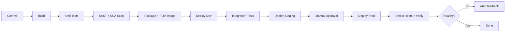
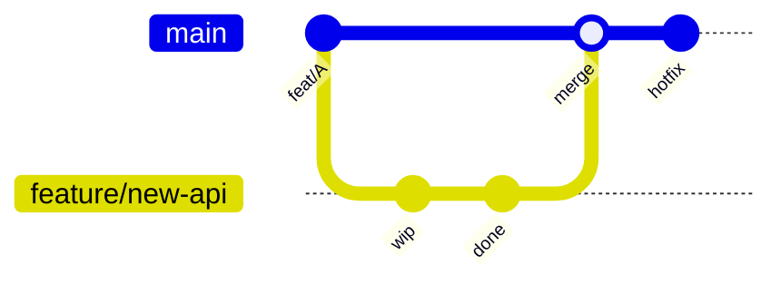
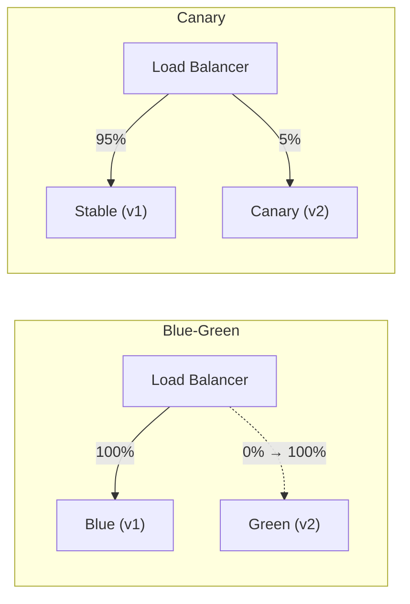
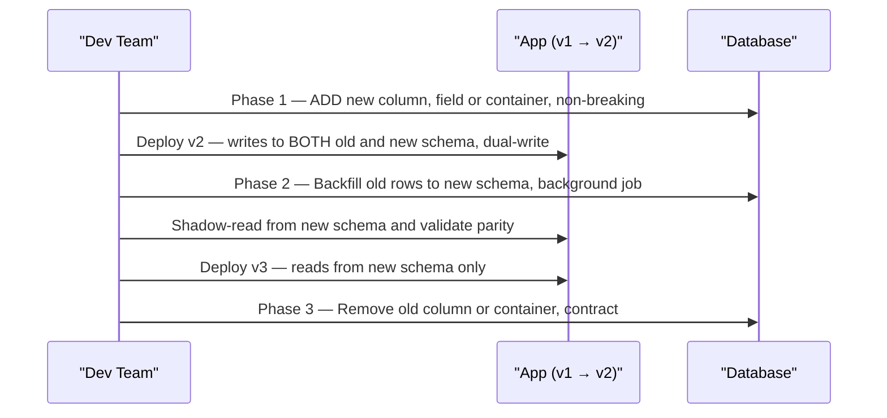

# 3. CI/CD & Release Strategies

> **TL;DR:** CI builds and validates every commit; CD automates delivery to environments; deployment strategy (blue-green, canary, etc.) determines how changes reach users. Zero-downtime DB migrations require the expand-contract pattern.

**Interview weight:** P1 — release strategies, zero-downtime migrations, and DORA metrics are senior-level talking points; directly on the candidate's resume.

---

## CI vs CD vs Continuous Deployment

| Term | What it means | Gate |
| ---- | ------------- | ---- |
| **Continuous Integration (CI)** | Every commit triggers build + unit tests + scan | Automated; blocks merge on failure |
| **Continuous Delivery (CD)** | Artifact ready to deploy to production at any time | Human approval before prod |
| **Continuous Deployment** | Every green build auto-deploys to production | Fully automated; needs high test confidence |

Most enterprise teams practice CD with a manual prod approval gate, not continuous deployment.

---

## Pipeline Stages



---

## Azure DevOps YAML Pipeline Example

```yaml
# azure-pipelines.yml — multi-stage with Key Vault variable group and environment approval
trigger:
  branches:
    include: ["main"]

variables:
  - group: myapp-keyvault-vg   # variable group linked to Key Vault; secrets injected as pipeline vars
  - name: imageTag
    value: "$(Build.BuildNumber)"

stages:
  - stage: Build
    jobs:
      - job: BuildAndTest
        pool:
          vmImage: ubuntu-latest
        steps:
          - task: DotNetCoreCLI@2
            displayName: "Restore & Build"
            inputs:
              command: build
              projects: "**/*.csproj"
          - task: DotNetCoreCLI@2
            displayName: "Unit Tests"
            inputs:
              command: test
              arguments: "--collect:'XPlat Code Coverage'"
          - task: Docker@2
            displayName: "Build & Push Image"
            inputs:
              containerRegistry: myacr-sc
              repository: myapi
              command: buildAndPush
              tags: $(imageTag)
          - task: PublishBuildArtifacts@1
            inputs:
              artifactName: manifests

  - stage: DeployDev
    dependsOn: Build
    jobs:
      - deployment: DeployDev
        environment: "dev"    # environment = AzDO resource with optional approval/check
        strategy:
          runOnce:
            deploy:
              steps:
                - script: |
                    kubectl set image deployment/myapi myapi=myacr.azurecr.io/myapi:$(imageTag) -n dev

  - stage: DeployProd
    dependsOn: DeployDev
    jobs:
      - deployment: DeployProd
        environment: "prod"   # prod environment has a required reviewer approval gate
        strategy:
          runOnce:
            deploy:
              steps:
                - script: |
                    kubectl set image deployment/myapi myapi=myacr.azurecr.io/myapi:$(imageTag) -n prod
```

---

## Azure DevOps vs GitHub Actions

| Aspect | Azure DevOps Pipelines | GitHub Actions |
| ------ | ---------------------- | -------------- |
| Config format | YAML (`azure-pipelines.yml`) | YAML (`.github/workflows/`) |
| Reuse | Templates (`template:`) + Task marketplace | Reusable workflows + Actions marketplace |
| Environments + approvals | Built-in, first-class | Environments with `protection rules` |
| Self-hosted runners | Agent pools (private) | Self-hosted runners |
| Secret management | Variable groups + Key Vault link | GitHub Secrets / OIDC to Azure |
| Azure integration | Native (service connections, ARM) | Via OIDC or service principal |
| Pricing | Free 1,800 min/month (public) | Free 2,000 min/month (public) |
| Best fit | Enterprise with existing Azure investment | OSS, GitHub-native, cross-cloud |

---

## Artifact Versioning Strategy

- **Semantic versioning:** `MAJOR.MINOR.PATCH[-pre]+build` — `1.4.2+20240301.5`.
- **Immutable artifacts** — build once; the same image digest is promoted from dev → staging → prod.
- Never rebuild per environment; rebuild introduces undeclared change.
- Tag image with `<semver>-<build-id>` in CI; update `values.yaml` / K8s manifest with that exact tag.
- Container registry stores all versions; purge old tags via retention policy (keep last N + all tagged releases).

---

## Branching Strategies



| Strategy | Cadence | Merge pain | Hotfix path | Team size fit |
| -------- | ------- | ---------- | ----------- | ------------- |
| **Trunk-based** | Continuous; short-lived feature branches (<1 day) | Minimal | Commit direct to trunk + tag | 2–50+; needs feature flags |
| **GitHub Flow** | PR per feature; merge to `main`; deploy from `main` | Low | Hotfix PR to `main`; re-deploy | 5–30 |
| **GitFlow** | `develop` + `release/x.y` + `hotfix/` + `feature/` | High; long-lived branches | `hotfix/` → `main` + `develop` | 20+; infrequent releases |
| **Release branches** | Release cut from `main`; cherry-pick fixes | Moderate | Cherry-pick to release branch | Enterprise, mobile, compliance |

Trunk-based + feature flags is the modern default for high-cadence teams; GitFlow adds process overhead that slows delivery.

---

## Feature Flags

- Replace long-lived branches; code ships to prod but is off by default.
- Flag types: release flags (on/off), experiment flags (A/B), ops flags (circuit breakers), permission flags (per user/role).
- **Flag debt** — stale flags never cleaned up; code becomes unreadable; set a removal ticket when creating any flag.
- Azure App Configuration + Feature Manager SDK for .NET.

---

## Deployment Strategies



| Strategy | Downtime | Rollback speed | Cost overhead | Risk | Complexity |
| -------- | -------- | -------------- | ------------- | ---- | ---------- |
| **Recreate** | Full | Instant | 0 | High | Trivial |
| **Rolling** | None | Moderate (re-roll) | ~0 | Low | Low |
| **Blue-Green** | None | Instant (LB swap) | 2x during switch | Low | Medium |
| **Canary** | None | Fast (reroute 0%) | ~1.05x | Very low | High |
| **Shadow / Dark launch** | None | N/A (no user impact) | 2x | None | High |
| **A/B** | None | Fast | ~1.05x | Low | High (needs routing logic) |

---

## Zero-Downtime Database Migrations (Expand-Contract)

This pattern was used for the Cosmos DB partition key redesign.



**Steps:**
1. **Expand** — add new field/column/partition; old app version still works.
2. **Dual-write** — deploy app that writes to both old and new; reads from old.
3. **Backfill** — background job migrates existing data to new schema.
4. **Shadow-read** — compare new schema reads vs old for correctness.
5. **Cutover** — deploy app that reads from new schema; stop writing to old.
6. **Contract** — remove old field/column after stability period.

**Rollback plan at each step:** every phase is independently reversible. Never drop old schema until new schema is confirmed stable in production with real traffic.

**Cosmos DB specifics:** can't change a partition key in place; create a new container with new partition key, dual-write, backfill with a background processor reading the change feed from the old container, cutover reads, delete old container.

---

## Health Checks and Readiness Gates

- Pipeline should call `/healthz/ready` before marking a deploy successful.
- Azure DevOps: use a `RunOnce` deployment with a `validate` step that polls readiness.
- K8s: readinessProbe gates traffic; Deployment rollout waits for minReady before proceeding.
- Add automated rollback trigger: if error rate > threshold for 5 min after deploy, pipeline triggers rollback (`kubectl rollout undo` or re-deploy previous image tag).

---

## DORA Metrics

| Metric | Definition | Elite threshold | How to measure |
| ------ | ---------- | --------------- | -------------- |
| **Deployment Frequency** | How often code deploys to prod | Multiple times/day | Count prod deploys in Azure DevOps/GitHub |
| **Lead Time for Changes** | Commit to prod | < 1 hour | Timestamp commit → prod deploy complete |
| **Change Failure Rate** | % deploys causing incident | < 5% | Incidents tagged with deploy change |
| **MTTR** | Mean time to restore after incident | < 1 hour | Incident start → service restored |

High performers: deploy daily+, lead time < 1 hour, CFR < 5%, MTTR < 1 hour.

---

## Security in the Pipeline

| Gate | Tool | What it catches |
| ---- | ---- | --------------- |
| **SAST** | SonarQube, Roslyn Analyzers, Semgrep | Code injection, SQL injection, hardcoded secrets |
| **SCA / Dependency scanning** | OWASP Dependency-Check, Snyk, Dependabot | Vulnerable NuGet/npm packages (CVEs) |
| **Secret scanning** | GitHub Advanced Security, truffleHog | Committed secrets, API keys |
| **Container scanning** | Trivy, Azure Defender | CVEs in base image and installed packages |
| **Signed artifacts** | Cosign / Notary | Ensures image hasn't been tampered with |
| **SBOM** | `syft`, `dotnet sbom` | Software bill of materials for compliance |

**At 600+ microservices:** enforce scanning in a shared pipeline template; any service that bypasses the template cannot deploy to production environments. Renovate/Dependabot auto-PRs handle dependency bumps at scale; teams review and merge; a compliance dashboard tracks outstanding CVEs by severity.

---

## Pipeline Performance

- **Caching** — NuGet packages (`$(Pipeline.Workspace)/.nuget`), npm `node_modules`; can save 2–4 minutes per build.
- **Parallel jobs** — split unit tests by project; run security scans in parallel with build.
- **Test sharding** — distribute xUnit tests across agents by namespace; `--filter` by trait.
- **Incremental builds** — build only changed projects in a monorepo (use `--affected` in Nx or `.csproj` change detection).
- Build a faster inner loop: fail fast on lint/compile before running slow integration tests.

---

## Trade-offs & When to Use

- **Trunk-based vs GitFlow** — trunk-based is faster and safer with good feature-flag discipline; GitFlow is appropriate when release cadence is monthly+ with strict QA gates.
- **Blue-green vs canary** — blue-green is simpler and has instant rollback; canary exposes real traffic to catch issues missed by staging. Use canary when you can't replicate prod load in staging.
- **Continuous Deployment vs CD with approval** — continuous deployment requires very high test confidence and good monitoring; most enterprise teams use CD with a prod gate.

---

## Common Pitfalls

- Building a different image per environment (rebuild) instead of promoting the same artifact.
- Long-lived feature branches → integration hell → big-bang merges.
- Dropping old DB columns before all services have migrated → runtime errors.
- Missing `minAvailable` checks in pipeline → deploy appears successful but pods are crashing.
- Pipeline secrets in plain YAML environment variables instead of Key Vault-linked variable groups.

---

## Interview Questions

**Q1. What is the difference between continuous delivery and continuous deployment?**
A: Continuous delivery means every build is ready to release; a human presses the button. Continuous deployment means every green build automatically deploys to production. CD with a prod gate is the common enterprise choice; continuous deployment requires very high test coverage and mature observability.

**Q2. What is the expand-contract pattern for database migrations?**
A: Add new schema first (expand) without removing old; deploy dual-write app; backfill historical data; validate correctness; switch reads to new schema; remove old schema (contract). Each phase is independently deployable and reversible, enabling zero-downtime migration.

**Q3. You need to roll back a bad deployment in under 2 minutes. Which strategy enables this?**
A: Blue-green — the old environment is still running; switch the load balancer back to blue. Rolling or canary rollback requires re-deploying the previous image, which takes a full rolling update cycle (~5–10 min for 20 pods). Blue-green rollback is a config change on the LB/Front Door, measurable in seconds.

**Q4. What are DORA metrics and which one is hardest to improve?**
A: Deployment Frequency, Lead Time, Change Failure Rate, MTTR. Change Failure Rate is often hardest because it requires both test quality and deployment practice improvements; it also has a survivor bias problem (teams that deploy rarely report lower CFR simply because they batch fixes. MTTR depends on observability maturity and on-call culture, which are social as much as technical.

**Q5. How do you keep 600+ microservices patched against a critical CVE without blocking individual teams?**
A: Centralise the baseline: a shared build template that enforces the approved base image. Pair it with a bot (Renovate/Dependabot) that auto-opens PRs to bump the image tag when a new secure version is published. CI blocks deploy if the scan fails; teams just need to merge the PR. A compliance dashboard shows remaining exposure; P0 CVEs get a 7-day SLA. This way the platform team does the heavy lifting; individual teams only review a 1-line diff.

**Q6. What is a feature flag and how does it replace a long-lived feature branch?**
A: A feature flag is a runtime switch (config, service, or code) that enables/disables functionality without a deployment. Code ships behind a flag set to off; it integrates into main constantly (no branch divergence). The flag is turned on progressively (internal users → canary → all). Risk: flag debt — stale flags accumulate; every flag should have a removal ticket with a target date.

**Q7. How would you implement automated rollback in an Azure DevOps pipeline?**
A: After deploying to prod, add a `PostDeploy` script that queries Application Insights or a health endpoint for error rate. If error rate > threshold (e.g. 5%) over a 5-minute window, the pipeline triggers `kubectl rollout undo deployment/myapi` or re-runs the previous image tag deploy. Pair with a PagerDuty/Teams alert. For reliability, the check should use a metric that is independent of the deploy pipeline (e.g. App Insights metric alert triggering a Logic App / Azure Function that calls the rollback pipeline via REST API).

**Q8. Compare trunk-based development and GitFlow for a team shipping weekly vs daily.**
A: Daily shipping: trunk-based with feature flags; no long-lived branches; every commit to main is deployable; fast feedback loop. Weekly shipping: GitHub Flow (one branch per feature, PR to main) is sufficient; GitFlow adds release branches and hotfix branches appropriate for scheduled release trains but creates overhead: double merges, integration delays, harder diffs. GitFlow's main value is when you support multiple release versions simultaneously (e.g. mobile apps with slow user upgrades).

**Q9. How does your CI/CD pipeline enforce that only scanned images reach production?**
A: Pipeline structure: 1) Build stage produces image, 2) Scan stage runs Trivy against the image digest and fails on HIGH/CRITICAL CVEs, 3) Only if scan passes does the image get pushed to the production registry namespace. Prod K8s clusters only pull from the scanned ACR namespace (enforced by OPA/Gatekeeper policy). Any attempt to deploy an unscanned image is rejected at the admission controller level. This prevents bypassing CI.

**Q10. Describe a Cosmos DB zero-downtime migration you'd do for a partition key change.**
A: 1) Create new container with correct partition key (parallel container). 2) Deploy app v2 that dual-writes to old and new container; reads from old. 3) Run a backfill job reading old container's change feed and writing to new container; track progress. 4) Once backfill complete, shadow-read new container and compare results to old. 5) Deploy app v3 reading from new container; stop writes to old after rollback window. 6) Monitor for 24–48 hours, then delete old container. At every step, rollback is the previous app version + reading from old container.

**Q11. (Senior) A team member says "just add a column to the DB and deploy both services simultaneously." Why is this risky and what's the correct approach?**
A: Simultaneous deploy is not truly simultaneous; there is a window where old code runs against a new schema or new code runs against old schema. If the new column is NOT NULL without a default, old code fails to insert. If the new code tries to read the new column before the DB migration runs, it crashes. Correct approach: expand-contract. Deploy DB change as nullable/with default first; old code works. Then deploy new code. Then (optionally) add NOT NULL constraint once all data is populated. Database and application deployments must be independently safe.

**Q12. (Leadership) How would you introduce DORA metrics to a team that has never measured them?**
A: Start with deployment frequency and lead time — both are mechanical and provoke no defensiveness (they measure process, not people). Instrument via a simple dashboard: count prod deploys from Azure DevOps release events; lead time = timestamp of latest commit in the release → deploy complete. Share the baseline with the team; frame it as "understanding our system," not "measuring productivity." Once the baseline is clear, identify the biggest bottleneck (usually: long-lived branches, slow manual tests, or manual approvals). Fix one thing, remeasure. Avoid using DORA as a performance review metric.

**Q13. (Leadership) Your Cosmos DB migration went live at midnight. At 2 AM an on-call alert fires — 15% of requests are 503. What's your incident response?**
A: 1) Immediately check if the issue is new-schema reads (error messages will confirm). 2) If so, execute rollback: redeploy v1 (reads from old container). 3) Mark incident SEV-1, notify stakeholders. 4) Dual-write ensures no data loss regardless of rollback timing. 5) Root-cause: likely a query fan-out on the new partition key or a missing index. 6) Fix root cause in a test environment, re-run shadow-read parity check, re-attempt cutover during low-traffic window with explicit monitoring for 30 min before declaring success.

---

## Quick Recap

- CI = build + test on every commit; CD = artifact ready for prod; continuous deployment = fully automated.
- Build once, promote the same image digest across environments — never rebuild per environment.
- Expand-contract = add new schema → dual-write → backfill → shadow-read → cutover → drop old; each phase is independently reversible.
- Blue-green = instant rollback (LB swap); canary = real-traffic validation with minimal blast radius.
- DORA: Deployment Frequency, Lead Time, Change Failure Rate, MTTR — improve in that order.
- Trunk-based + feature flags = modern default; GitFlow = scheduled releases with multiple live versions.
- Pipeline security: SAST, SCA, secret scan, container scan, signed artifacts, SBOM.
- At scale: shared pipeline template + bot auto-PRs + compliance dashboard = CVE hygiene without toil.
