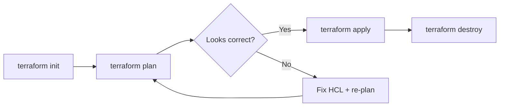
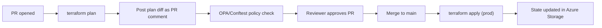

# 4. Infrastructure as Code & Terraform

> **TL;DR:** IaC treats infrastructure as versioned, testable, reviewable code. Terraform is the dominant declarative tool; state is the source of truth and must be stored remotely with locking. Modules encapsulate reusable patterns.

**Interview weight:** P2 — Terraform module experience is on the resume; interviewers probe state management, secrets, and policy-as-code at senior level.

---

## Core Concepts

- **IaC** — infrastructure defined in code files (version-controlled, reviewed, tested, automated).
- **Declarative** — describe desired end state; tool figures out the diff and applies it (Terraform, Bicep).
- **Imperative** — describe the steps to get there; you control order (scripts, Pulumi in imperative style).
- **Idempotent** — running `apply` multiple times with no change produces no change.
- **Drift** — real-world state diverges from what Terraform knows; detected by `plan`.

---

## IaC Tool Comparison

| Tool | Type | Language | Azure-native? | Multi-cloud? | State | Best fit |
| ---- | ---- | -------- | ------------- | ------------ | ----- | -------- |
| **Terraform** | Declarative | HCL | Via provider | Yes | Remote (Azure Storage) | Multi-cloud, large teams, rich module ecosystem |
| **Bicep** | Declarative | Bicep DSL | Yes (ARM under the hood) | No | ARM (no separate state) | Azure-only, simpler state model, Microsoft-supported |
| **ARM Templates** | Declarative | JSON | Yes | No | ARM | Legacy Azure; Bicep supersedes |
| **Pulumi** | Declarative/Imperative | TypeScript/Python/Go/C# | Via provider | Yes | Pulumi service or self-hosted | Devs who prefer real languages; logic-heavy infra |
| **CloudFormation** | Declarative | YAML/JSON | AWS only | No | CloudFormation stacks | AWS teams |

---

## Terraform Core Workflow



- `init` — downloads providers + modules; initialises backend.
- `plan` — computes diff between desired state (HCL) and current state (state file); **shows what will change** — review carefully.
- `apply` — executes the plan; updates state file.
- `destroy` — tears down all managed resources; use with `prevent_destroy` lifecycle to block accidental deletion.

---

## HCL Basics

```hcl
# providers.tf
terraform {
  required_providers {
    azurerm = { source = "hashicorp/azurerm", version = "~> 3.100" }
  }
  backend "azurerm" {
    resource_group_name  = "rg-tfstate"
    storage_account_name = "tfstate12345"
    container_name       = "tfstate"
    key                  = "myapp/prod.tfstate"
  }
}

provider "azurerm" { features {} }

# variables.tf
variable "location" {
  type    = string
  default = "eastus"
}

# locals.tf
locals {
  tags = { env = "prod", team = "platform" }
}

# main.tf
resource "azurerm_resource_group" "rg" {
  name     = "rg-myapp-prod"
  location = var.location
  tags     = local.tags
}

# data source — read existing resource
data "azurerm_key_vault" "kv" {
  name                = "kv-myapp-prod"
  resource_group_name = azurerm_resource_group.rg.name
}

# output
output "rg_id" {
  value = azurerm_resource_group.rg.id
}
```

---

## State

- **What it is** — a JSON file mapping HCL resources to real Azure resource IDs and properties.
- **Why remote** — local state is not shared; team members plan/apply against different state → conflicts.
- **Azure Storage backend** — blob in a container; built-in blob lease = state locking (prevents concurrent `apply`).
- **Drift** — someone changes a resource manually in Azure Portal; next `plan` shows unexpected change; fix by updating HCL or running `terraform import`.
- **`terraform import`** — bring existing resource under Terraform management without recreating it.
- **`terraform taint` / `-replace`** — mark a resource for forced recreation on next apply (use `terraform apply -replace=resource.addr` in TF ≥0.15.2).
- **Never edit state by hand** — use `terraform state mv`, `terraform state rm`; corrupt state = lost track of infrastructure.
- **State file contains secrets** — Cosmos DB connection strings, Redis keys — encrypt state at rest (Azure Storage SSE) and restrict access via RBAC.

---

## Modules

```hcl
# modules/mi-redis/main.tf — Managed Identity for Azure Cache for Redis
variable "resource_group_name" { type = string }
variable "location"            { type = string }
variable "app_name"            { type = string }

resource "azurerm_user_assigned_identity" "mi" {
  name                = "mi-${var.app_name}-redis"
  resource_group_name = var.resource_group_name
  location            = var.location
}

resource "azurerm_redis_cache" "cache" {
  name                = "redis-${var.app_name}"
  resource_group_name = var.resource_group_name
  location            = var.location
  sku_name            = "Standard"
  family              = "C"
  capacity            = 1
  enable_non_ssl_port = false
  minimum_tls_version = "1.2"
  identity {
    type         = "UserAssigned"
    identity_ids = [azurerm_user_assigned_identity.mi.id]
  }
}

# Grant the MI the Redis Contributor role so it can authenticate
resource "azurerm_role_assignment" "redis_contrib" {
  scope                = azurerm_redis_cache.cache.id
  role_definition_name = "Redis Cache Contributor"
  principal_id         = azurerm_user_assigned_identity.mi.principal_id
}

output "managed_identity_client_id" { value = azurerm_user_assigned_identity.mi.client_id }
output "redis_hostname"             { value = azurerm_redis_cache.cache.hostname }
```

```hcl
# root/main.tf — consuming the module
module "cache" {
  source              = "./modules/mi-redis"
  version             = "1.2.0"      # pin version for stability
  resource_group_name = azurerm_resource_group.rg.name
  location            = var.location
  app_name            = "myapi"
}
```

**Module best practices:**
- Version-pin modules; breaking changes can destroy infrastructure.
- Keep modules single-purpose; compose at the root level.
- Expose only the outputs callers need; hide internals.
- Store in a private registry (Azure Container Registry OCI artifacts or Terraform Cloud) for multi-team reuse.

---

## Workspaces vs Directory-per-Environment

| Approach | How | Pros | Cons |
| -------- | --- | ---- | ---- |
| **Workspaces** | `terraform workspace new prod`; single HCL, separate state per workspace | Simple, DRY | Same code for all envs; risky `apply` if wrong workspace selected |
| **Directory-per-environment** | `environments/dev/`, `environments/prod/`; each has its own `backend` + `tfvars` | Explicit isolation; different configs | More files; modules shared via relative/registry path |

Recommendation: directory-per-environment for anything beyond dev/prod parity. Reduces blast radius — a plan error in dev cannot touch prod state.

---

## `for_each` vs `count`

```hcl
# count — positional; if you remove index 1 of 3, resource [2] becomes [1] — Terraform destroys and recreates it
resource "azurerm_resource_group" "rg" {
  count    = length(var.regions)
  name     = "rg-${var.regions[count.index]}"
  location = var.regions[count.index]
}

# for_each — keyed; removing a key only removes that specific resource — preferred
resource "azurerm_resource_group" "rg" {
  for_each = toset(var.regions)
  name     = "rg-${each.key}"
  location = each.key
}
```

**Gotcha:** switching from `count` to `for_each` on an existing resource forces recreation of all instances — plan carefully.

---

## Lifecycle Blocks

```hcl
resource "azurerm_cosmosdb_account" "cosmos" {
  # ...
  lifecycle {
    prevent_destroy       = true          # blocks `terraform destroy` — use on stateful resources
    ignore_changes        = [tags]        # don't fight Azure auto-tagging
    create_before_destroy = true          # new resource created before old is destroyed (for zero-downtime)
  }
}
```

---

## Secrets in IaC

- **Never commit secrets to tfvars** — use `.gitignore` to exclude `*.auto.tfvars` files with credentials.
- **Key Vault data source** — read secrets at plan/apply time:

```hcl
data "azurerm_key_vault_secret" "db_password" {
  name         = "db-password"
  key_vault_id = data.azurerm_key_vault.kv.id
}

resource "azurerm_app_service" "app" {
  # ...
  app_settings = {
    DB_PASSWORD = data.azurerm_key_vault_secret.db_password.value
  }
}
```

- **State still contains the secret value** — encrypt state at rest; restrict state storage access.
- For managed resources (App Service, AKS), prefer Managed Identity + Key Vault references instead of injecting secret values into app settings.

---

## Policy as Code

| Tool | Scope | Language | What it does |
| ---- | ----- | -------- | ------------ |
| **Azure Policy** | Azure resource level | JSON policy rules | Enforce/deny/audit resource properties at deploy time |
| **OPA / Conftest** | Terraform plan JSON | Rego | Validate Terraform plan before `apply` in CI |
| **tfsec** | Terraform HCL | Built-in rules | Static analysis of HCL for security misconfigs |
| **Checkov** | Terraform/Bicep/K8s YAML | Python + rules | SAST for IaC across multiple file types |

```yaml
# CI step: run tfsec before apply
- name: tfsec
  run: tfsec . --minimum-severity HIGH --format sarif --out tfsec.sarif
```

---

## CI/CD for Terraform



- `plan` on PR — reviewers see exact changes before merge.
- `apply` on merge to `main` (not on PR) — prevents unapplied plans from going stale.
- Separate service principal (or federated OIDC) for pipeline with minimal RBAC.
- **Blast-radius control** — segment state by workload/environment; a bad apply in `infra/networking` can't affect `infra/apps`.

---

## Immutable Infrastructure

- **Cattle vs pets** — pets: named, hand-crafted servers you ssh into; cattle: identical, replaceable, re-provisioned from IaC.
- Immutable: never `ssh` into a running VM to patch it; update the Terraform module or VM image and re-provision.
- In AKS context: never `kubectl exec` to install packages; rebuild the container image and redeploy.
- Reduces configuration drift; all state is in code.

---

## Trade-offs & When to Use

- **Terraform vs Bicep** — Terraform for multi-cloud or when you want a large community module ecosystem; Bicep for Azure-only teams who want Microsoft support and simpler state model (no state file management).
- **Workspaces vs directories** — workspaces for dev/test short-lived copies; directories for long-lived environments with different configs.
- **`prevent_destroy`** — use on stateful resources (Cosmos DB, SQL); avoid on ephemeral resources where teardown is expected.

---

## Common Pitfalls

- Not pinning provider version (`~> 3.100`) → breaking provider change silently upgrades.
- `count` instead of `for_each` on a list → resource reordering causes cascading destroy/recreate.
- Editing state by hand → corrupt state, resources orphaned or double-managed.
- Storing secrets in `terraform.tfvars` and committing to git.
- Not restricting access to the state storage account → anyone with Storage Reader can read all secrets.
- Running `apply` without reading `plan` output → deleting production resources accidentally.

---

## Interview Questions

**Q1. What is Terraform state and why does it need to be stored remotely?**
A: State is a JSON file mapping HCL resources to real resource IDs and properties. Without it, Terraform can't know what it manages or compute the diff. Remote state (Azure Blob Storage) enables team sharing and state locking (blob lease prevents two concurrent `apply` runs from corrupting state). Without remote state, two engineers applying simultaneously could create duplicate resources or overwrite each other's changes.

**Q2. What is the difference between `terraform import` and creating a resource from scratch?**
A: `import` brings an existing Azure resource under Terraform management without creating it. The resource already exists in Azure; Terraform writes its current state to the state file. You must also write the matching HCL config. The resource is not modified on import. Useful when adopting IaC for existing infrastructure.

**Q3. Explain `for_each` vs `count` and when `count` causes problems.**
A: `count` creates resources indexed by position; removing element at index 1 shifts all higher indices, causing Terraform to destroy and recreate them — dangerous for stateful resources. `for_each` keys resources by a string; removing one key only removes that specific resource. Always use `for_each` for resources where stable identity matters.

**Q4. How do you handle secrets in Terraform without hardcoding them in `.tfvars`?**
A: Use a Key Vault data source to read secrets at apply time. The Terraform service principal has Key Vault Secrets User RBAC. Secrets are never in HCL or tfvars. Note: they still appear in state — encrypt state at rest and restrict state storage RBAC. For app config, prefer Managed Identity + Key Vault references at the application layer instead of passing secrets through Terraform app settings.

**Q5. What is `prevent_destroy` and when would you use it?**
A: A lifecycle block argument that makes `terraform destroy` fail if it would destroy that resource. Use on stateful production resources (Cosmos DB, Azure SQL, Key Vault) where accidental deletion has catastrophic consequences. Pair with Azure's soft-delete / purge protection for defence in depth.

**Q6. How do you detect and fix drift between Terraform state and actual Azure resources?**
A: Run `terraform plan` — it will show resources that differ from state as changes to apply. For manual changes you want to keep: update HCL to match and run `apply`. For manual changes that shouldn't have happened: run `apply` to revert to desired state. For resources added outside Terraform that you now want to manage: `terraform import`. Continuous compliance: run `terraform plan` on a schedule in CI and alert on non-empty plans.

**Q7. How does your Terraform CI/CD pipeline prevent a bad `apply` from reaching production?**
A: PR triggers `plan`; plan diff is posted as a PR comment; OPA/Conftest policy check validates the plan (e.g. no `prevent_destroy` bypasses, no public IPs on prod resources); reviewer approves; merge triggers `apply` in a pipeline with prod credentials. State is segmented so a bad plan in one stack can't affect another. Blast-radius is further limited by directory-per-environment isolation.

**Q8. Compare Terraform and Bicep for an Azure-focused platform team.**
A: Bicep is simpler: no state file management, native ARM, first-class Azure Portal/IDE integration, Microsoft-supported. Terraform has a richer ecosystem (community modules), works multi-cloud, has better state management tooling, and is more widely known (larger hiring pool). For a team 100% Azure with strong Microsoft support needs: Bicep. For a team that also manages AWS/GCP resources or wants to leverage community modules: Terraform.

**Q9. Walk me through your Managed Identity for Redis Terraform module.**
A: The module creates a user-assigned managed identity, an Azure Cache for Redis instance with that identity attached, and an RBAC assignment giving the identity the Redis Cache Contributor role. The caller passes `app_name`, `resource_group_name`, and `location`. Outputs are `managed_identity_client_id` (used in app config to tell the Azure SDK which MI to use) and `redis_hostname`. This eliminates shared keys entirely — the app uses DefaultAzureCredential which picks up the MI token.

**Q10. (Senior) A colleague says "let's just use `terraform apply -auto-approve` in CI to avoid the plan review step — it's slowing us down." What's your response?**
A: Hard no for production. `plan` is the main safety gate — it shows exactly what will be destroyed, created, or modified. Skipping it means a drift between code and state could silently delete a Cosmos DB or recreate an AKS cluster. The correct fix for slowness is: run `plan` faster (cache providers, use partial backends), or invest in policy-as-code to automate approval for "safe" changes (e.g. changes only to tags or app settings), while keeping human review for changes to compute/database/networking resources. Automation accelerates safe paths; it must not eliminate review for high-risk operations.

---

## Quick Recap

- Terraform = declarative HCL; `plan` shows the diff; `apply` executes it; state tracks what's managed.
- Always use remote state (Azure Blob) with locking; never edit state by hand.
- `for_each` over `count` for stable resource identity; avoids cascade destroy on list reorder.
- Module = reusable, versioned infrastructure unit; pin versions; expose only needed outputs.
- Secrets: Key Vault data source at apply time; never in tfvars; state still holds values — restrict access.
- `prevent_destroy` on stateful production resources; `ignore_changes` for Azure auto-managed fields.
- CI: `plan` on PR + OPA/Conftest; `apply` on merge; separate credentials per environment.
- Directory-per-environment for blast-radius isolation; workspaces for ephemeral short-lived copies.
