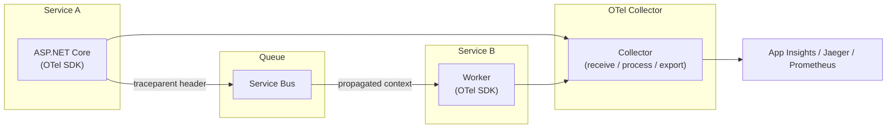

# 5. Observability, Autoscaling & Cost Optimization

> **TL;DR:** Observability answers "what is the system doing right now and why." Three pillars: logs, metrics, traces. SLOs and burn-rate alerts are the senior-level signal that matters. Autoscaling on queue depth (KEDA) beats CPU. Cost optimization is FinOps: right-size, right-tier, right-scope.

**Interview weight:** P1 — observability, SLO/SLI, KEDA, and FinOps are recurring senior topics; directly tied to the 99.99% SLO resume story.

---

## Monitoring vs Observability

| Aspect | Monitoring | Observability |
| ------ | ---------- | ------------- |
| Question answered | "Is the system up?" | "Why is the system behaving this way?" |
| Approach | Pre-defined dashboards and alerts | Query any property of the system post-hoc |
| Data | Metrics, known error patterns | Logs, metrics, traces, profiles |
| Limitations | Can't diagnose unknown failures | Requires structured, correlated telemetry |

Observability requires **structured telemetry emitted at the source** — you can't query what you never emitted.

---

## The Three Pillars + Profiles

| Pillar | Cardinality | Cost driver | Best at answering |
| ------ | ----------- | ----------- | ----------------- |
| **Logs** | High (free-form text) | Volume (GB/day) | "What exactly happened?" — events, errors, audit |
| **Metrics** | Low (numeric aggregates) | Series count | "How is it performing?" — latency, RPS, error rate |
| **Traces** | Medium (sampled spans) | Sample rate × span size | "Where is time spent?" — latency breakdown across services |
| **Profiles** | Very high (code-level) | CPU time | "Which lines are slow?" — CPU, memory, allocations |

---

## Structured Logging and Correlation IDs

```csharp
// .NET — structured log with correlation ID propagation
using var activity = Activity.Current; // OpenTelemetry / W3C traceparent
_logger.LogInformation("Order processed {OrderId} in {ElapsedMs}ms",
    orderId, sw.ElapsedMilliseconds);

// Middleware: set correlation ID from incoming header
app.Use(async (ctx, next) =>
{
    var correlationId = ctx.Request.Headers["X-Correlation-Id"]
        .FirstOrDefault() ?? Activity.Current?.TraceId.ToString() ?? Guid.NewGuid().ToString("N");
    ctx.Response.Headers["X-Correlation-Id"] = correlationId;
    using var _ = _logger.BeginScope(new { CorrelationId = correlationId });
    await next();
});
```

- Use `{StructuredProperty}` not string interpolation — Log Analytics/Application Insights can query individual fields.
- Emit `correlationId`, `operationName`, `userId` on every log line.

---

## OpenTelemetry



- **SDK** — instruments HTTP, SQL, gRPC, Service Bus automatically via `AddAzureMonitorTraceExporter`.
- **Collector** — receives OTLP; batches, samples, redacts PII, routes to multiple backends.
- **Semantic conventions** — standard attribute names (`http.method`, `db.system`, `messaging.destination`); enable cross-vendor querying.
- **W3C traceparent** — `00-<traceId>-<spanId>-<flags>` propagated via HTTP header and Service Bus `Diagnostic-Id` user property.

**Sampling strategies:**

| Strategy | How | Best for |
| -------- | --- | -------- |
| **Head-based (ratio)** | Sample decision at trace start; fixed % | Consistent cost; may miss rare errors |
| **Tail-based** | Collect all spans; sample after trace completes | Captures all errors/slow traces; higher infra cost |
| **Adaptive** | App Insights default; adjusts rate to hit volume target | Auto-tunes; good default |

---

## Metrics Types

| Type | What it counts | Example |
| ---- | -------------- | ------- |
| **Counter** | Monotonically increasing total | Total requests served |
| **Gauge** | Current value, can go up/down | Active connections, queue depth |
| **Histogram** | Distribution of values (buckets) | Request duration → p50/p95/p99 |
| **Summary** | Pre-computed quantiles (client-side) | Obsolete in Prometheus; prefer histogram |

---

## RED / USE / Four Golden Signals

| Framework | Metrics | Best for |
| --------- | ------- | -------- |
| **RED** | Rate, Errors, Duration | Request-driven services (APIs) |
| **USE** | Utilisation, Saturation, Errors | Resource-constrained systems (CPU, disk, queues) |
| **Four Golden Signals** | Latency, Traffic, Errors, Saturation | Google SRE; covers both above; good default |

---

## SLI / SLO / Error Budgets

- **SLI** — measured indicator: `availability = successful_requests / total_requests`
- **SLO** — target: `availability ≥ 99.9% over 30 days`
- **Error budget** — `1 - SLO` = 0.1% of requests can fail = 43.2 min/month allowed downtime at 99.9%.

**Burn-rate alerting:**

| Burn rate | Alert window | Error budget consumed | Action |
| --------- | ------------ | --------------------- | ------ |
| 14.4x | 1 h | 2% in 1 h | Page immediately |
| 6x | 6 h | 5% in 6 h | Page immediately |
| 3x | 3 days | 10% in 3 days | Ticket priority |
| 1x | 30 days | 100% at this rate | Low-priority review |

**Formula:** burn rate = (error rate) / (1 - SLO). At 14.4x burn rate, the entire 30-day error budget is consumed in 2 days.

---

## Application Insights + KQL

```kql
-- Top slow dependencies (outbound calls), p99, last 1 h
dependencies
| where timestamp > ago(1h)
| summarize p99=percentile(duration, 99), count=count() by name, type
| order by p99 desc
| take 10

-- Exception trend by type, last 24 h (render as timechart)
exceptions
| where timestamp > ago(24h)
| summarize count() by type, bin(timestamp, 1h)
| render timechart

-- p99 request latency per operation, last 1 h
requests
| where timestamp > ago(1h)
| summarize p99=percentile(duration, 99), rps=count()/3600.0 by operation_Name
| order by p99 desc
```

---

## Alerting Design

- **Symptom-based** — alert on user-visible impact (error rate, latency, SLO burn) not on internal causes (CPU, disk).
- **Actionable** — every alert fires a runbook; if no action is defined, it's noise.
- **Avoid alert fatigue** — too many alerts → on-call ignores them. Monthly: review fired alerts; suppress or eliminate noise.
- **Multi-window, multi-burn-rate** — fast burn (short window) for fast-moving incidents; slow burn (long window) for gradual degradation.

---

## Autoscaling

### Reactive vs Scheduled vs Predictive

| Type | How | Best for | Risk |
| ---- | --- | -------- | ---- |
| **Reactive** | Scale when metric exceeds threshold | Variable, unpredictable load | Scale-out lag during spikes |
| **Scheduled** | Pre-scale at known times | Predictable daily patterns (business hours) | Wastes capacity outside scheduled windows |
| **Predictive** | ML-based forecast (Azure Monitor) | Gradual recurring patterns | Expensive; overkill for most |

### Scaling Signals

| Signal | Lag | Use case |
| ------ | --- | -------- |
| **CPU** | Medium (10–30 s) | Compute-bound APIs |
| **RPS** | Low | HTTP load-driven apps |
| **Queue depth** | Low | Event-driven workers (best for Service Bus consumers) |
| **Latency (p99)** | Low | Latency-sensitive services |

Queue depth is the clearest leading indicator for consumer scale: it measures backlog directly, not a proxy.

### KEDA

- Kubernetes Event-Driven Autoscaler; scales Deployments on external metrics (Service Bus, Event Hubs, Redis, custom).
- `minReplicaCount: 0` = scale-to-zero when queue is empty.
- `pollingInterval: 15` (seconds) — how often KEDA checks the scaler.
- `cooldownPeriod: 300` (seconds) — wait before scaling down after last message (prevents flapping).

### Cooldown / Flapping

- Without cooldown: scale-out → last message processed → scale to 0 → message arrives → scale back out → latency spike.
- Fix: `cooldownPeriod` keeps replicas alive after queue drains; value = expected inter-burst interval.

---

## Cost Optimization

### Main Cost Drivers (Azure)

| Driver | Typical share | Optimization lever |
| ------ | ------------- | ------------------ |
| **Compute (VMs, AKS nodes)** | 40–60% | Rightsizing, Reserved Instances, spot nodes |
| **Egress (outbound data)** | 10–30% | CDN, co-locate services in same region, compress |
| **Storage tiers** | 5–20% | Move cold data to Cool/Archive; lifecycle policies |
| **Log ingestion** | 5–15% | Sampling, filter noisy telemetry, data caps |
| **Cosmos DB RU/s** | 10–30% | Autoscale RU, optimise queries, add caching layer |
| **Provisioned throughput** | Variable | Scale down in off-hours, use serverless tier for low traffic |

### Compute Options

| Option | When | Typical savings vs on-demand |
| ------ | ---- | ---------------------------- |
| **Reserved Instances (1yr/3yr)** | Stable baseline load | 30–60% |
| **Savings Plans** | Variable workload, predictable spend | 15–30% |
| **Spot / Low-priority nodes** | Fault-tolerant batch, CI agents, stateless workers | 60–80% |
| **Autoscale to zero** | Dev/test, event-driven (Functions, Container Apps) | Eliminates idle cost |

### Cosmos DB Cost Tuning

- **Autoscale RU** — set max RU; scales down to 10% of max during idle; avoid over-provisioned manual throughput.
- **Query optimisation** — cross-partition queries fan out; well-chosen partition key keeps queries single-partition (10x cheaper).
- **Caching** — Redis Cache for read-heavy data; reduces Cosmos reads by 80–90% for hot paths.
- **Serverless tier** — pay per operation; cost-effective under ~5M ops/month; no guaranteed throughput.

### FinOps Practices

- **Tagging** — `env`, `team`, `service`, `cost-center` on every resource; enforce with Azure Policy.
- **Showback / Chargeback** — per-team cost reports from Azure Cost Management; team accountability.
- **Budgets + anomaly alerts** — Azure Cost Management budget with 80%/100% alerts; anomaly detection for sudden spikes.
- **Cost review cadence** — monthly review with engineering leads; top-5 cost drivers; one action per driver.

### Cost Review Checklist

| Item | Check |
| ---- | ----- |
| Idle VMs / App Service plans | `Advisor` recommendations; `dt > 30 days with cpu < 5%` |
| Orphaned disks/NICs/IPs | Resources with no attached compute |
| Log ingestion volume | Daily GB ingested; filter noisy SDK telemetry |
| Dev/test environments | Are they left running 24/7? Add auto-shutdown |
| Reserved vs pay-as-you-go ratio | > 70% baseline should be reserved |
| Cosmos DB RU provisioned vs actual | Azure Monitor `NormalizedRUConsumption` |
| Egress costs | Cross-region or internet egress; check CDN coverage |
| Unused ACR images | Old image tags driving storage cost |

---

## Trade-offs & When to Use

- **Reactive vs scheduled autoscaling** — reactive alone suffers from scale-out lag during sudden spikes; combine scheduled (pre-scale before known peak) with reactive (handle unexpected load).
- **Tail-based vs head-based sampling** — tail-based captures all errors/slow traces but requires a buffer to hold spans until the trace completes (more memory/infra); head-based is cheaper but misses rare slow traces at low sample rates.
- **Reserved Instances vs Savings Plans** — RI locks you to a specific VM size/region; Savings Plans apply to any compute in a region; Savings Plans are more flexible at slightly lower discount.

---

## Common Pitfalls

- Alerting on CPU for a queue worker (wrong signal) instead of queue depth.
- No `cooldownPeriod` on KEDA → scale-to-zero flapping.
- SLO set at 100% → zero error budget → no room for safe deployment.
- Log everything at `Information` level → log ingestion cost explodes; only `Warning`/`Error` in prod for noisy paths.
- Not sampling distributed traces → App Insights bill 10x expected.
- Manual Cosmos RU provisioned at peak × 3 headroom × 24/7 → massive waste; switch to autoscale.

---

## Interview Questions

**Q1. What is the difference between monitoring and observability?**
A: Monitoring checks pre-defined conditions ("is error rate < 1%?"); alerts you when known things break. Observability lets you ask arbitrary questions about system behaviour using structured telemetry — logs, metrics, traces. Observability requires you to instrument your system upfront so any future question can be answered from emitted data. Monitoring is a subset.

**Q2. Why is queue depth a better autoscaling signal than CPU for a Service Bus consumer?**
A: CPU reflects current work being done, which lags the arrival of messages. Queue depth measures the actual backlog — the demand waiting to be served. When 10,000 messages arrive, queue depth spikes immediately; CPU only rises once workers start processing. KEDA on queue depth scales proactively with demand. Additionally, a consumer idling between batches shows near-zero CPU but non-zero queue depth accurately reflects pending work.

**Q3. Explain SLI, SLO, and error budget with a concrete example.**
A: SLI = measured indicator, e.g. `(successful requests) / (total requests)`. SLO = target, e.g. `≥ 99.9%` over 30 days. Error budget = `0.1%` of requests = ~43 minutes of full outage per month. When the error budget is healthy, teams can take risk (deploy, experiment). When it's burning fast, reliability work takes priority over features. This is the SRE model for balancing speed and stability.

**Q4. What is burn-rate alerting and why is it better than a simple error-rate threshold?**
A: A static threshold (e.g. "alert if error rate > 1%") can miss slow burns that exhaust the budget over days, and can over-alert on transient spikes. Burn-rate alerting fires when the error budget is being consumed faster than sustainable. 14.4x burn rate over 1 hour = 2% of monthly budget gone in 1 hour → page. 1x burn rate = budget will be exactly exhausted at month end → low-priority. Multi-window (1h + 6h) catches both fast incidents and slow degradation.

**Q5. What is the W3C `traceparent` header and how does it propagate across a Service Bus message?**
A: `traceparent` = `00-{16-byte traceId}-{8-byte spanId}-{flags}`. On an outbound Service Bus send, the OTel SDK serialises the current span context into the message's `Diagnostic-Id` user property. The consumer's OTel SDK reads this property and starts a child span linked to the same trace. Log Analytics joins all spans by `operation_Id`, giving a single distributed trace across producer → queue → consumer even without a shared network hop.

**Q6. How do you avoid alert fatigue on a large microservices platform?**
A: 1) Alert on symptoms (user-visible) not causes (internal resource metrics). 2) Every alert must have a linked runbook with clear action. 3) Monthly alert review: any alert that fired > 10x without a team action is noise — suppress or fix. 4) Use multi-burn-rate alerting: only high-urgency situations page on-call; slow burns create tickets. 5) Auto-resolve alerts when the condition clears; stale open alerts hide real issues. 6) Separate alerting channels by severity: P1 pages, P2 Slack, P3 email.

**Q7. What are the four golden signals and how do you instrument them in a .NET API?**
A: Latency (request duration → histogram), Traffic (requests/second → counter), Errors (5xx rate → counter/ratio), Saturation (thread pool queue, memory %). In .NET: App Insights SDK auto-captures the first three via `AddApplicationInsightsTelemetry`. Custom saturation metrics: `ThreadPool.GetAvailableThreads(out var wt, out _)` → emit as a gauge. KEDA monitors saturation externally via queue depth.

**Q8. You notice Cosmos DB costs doubled this month. Walk through your investigation.**
A: 1) Azure Cost Management: which Cosmos DB account/database/container drove the increase. 2) Azure Monitor: `NormalizedRUConsumption` — was RU utilisation high (queries got expensive) or low (wasteful provisioning)? 3) App Insights `dependencies` table: which operations call Cosmos, and what's the average RU charge per operation (`customDimensions.requestCharge`). 4) Common causes: a new cross-partition query fan-out, a cache layer removed, manual RU raised for a load test not reverted, data volume growth hitting autoscale ceiling. 5) Fix: add/fix partition key usage in queries, restore cache, switch to autoscale, add lifecycle/TTL policies on old documents.

**Q9. Explain OpenTelemetry's role versus Application Insights SDK directly.**
A: App Insights SDK is proprietary; it locks telemetry to Azure Monitor. OTel is vendor-neutral; same SDK emits to App Insights, Jaeger, Prometheus, Datadog by changing exporters. This reduces lock-in and enables correlation across services using different backends. The `Azure.Monitor.OpenTelemetry.AspNetCore` package bridges OTel to App Insights without proprietary instrumentation. For a mature platform: adopt OTel SDK + App Insights exporter; swap exporter in future if needed.

**Q10. (Senior) How would you set the SLO for a new service, and what happens when the error budget runs out?**
A: Start with user expectations and existing system performance (look at p99 error rate over last 30 days). A reasonable initial SLO is slightly above actual recent performance (don't make it too tight). When error budget is exhausted: no new feature deployments; all hands on reliability work until budget is recovered. Communicate to product: error budget is a shared currency — feature velocity is funded by reliability. Review SLOs quarterly and tighten as the system matures.

**Q11. (Senior) Design the observability strategy for a new event-driven system: .NET API → Service Bus → Worker → Cosmos DB.**
A: 1) Instrument all services with OTel SDK; enable auto-instrumentation for ASP.NET Core, HTTP client, Azure SDK (Service Bus, Cosmos). 2) Propagate `traceparent` through Service Bus message `Diagnostic-Id` property. 3) Export to App Insights via `Azure.Monitor.OpenTelemetry.AspNetCore`. 4) Use adaptive sampling with exceptions always sampled. 5) Define RED metrics per service: requests/errors/duration for the API; queue lag + processing duration for the worker. 6) Set SLOs: API availability ≥ 99.9%, worker queue lag < 60 s p99. 7) Burn-rate alerts: 14.4x/1h for critical, 6x/6h for urgent. 8) Dashboard: four golden signals per service, queue depth trend, Cosmos p99 latency.

**Q12. (Leadership) Your team is 30% over the Azure cost budget. You have 2 weeks to reduce costs without impacting SLOs. What do you do?**
A: 1) Pull Azure Advisor recommendations — low-hanging fruit (right-size, idle resources). 2) Cost Management by service: identify top 3 cost drivers. 3) Dev/test environments: enable auto-shutdown on VMs, scale AKS node pools to 0 outside business hours. 4) Log Analytics: find the noisiest sources (usually SDK telemetry or verbose health-check traces); increase sampling rate or filter. 5) Cosmos DB: check autoscale vs manual RU; switch to autoscale if over-provisioned. 6) Storage: lifecycle policy to move blobs older than 30 days to Cool tier. 7) Communicate each saving to the team: ownership and visibility drive behaviour. Likely 20–40% reduction in 2 weeks from these levers without touching prod compute.

---

## Quick Recap

- Observability = ask any question post-hoc; requires structured, correlated telemetry upfront.
- Pillars: logs (what happened) + metrics (how fast/how many) + traces (where is time spent).
- OTel = vendor-neutral instrumentation; `traceparent` correlates spans across services and queues.
- SLO burn-rate alerting: 14.4x/1h pages; 6x/6h pages; 3x/3d ticket — more actionable than static thresholds.
- Scale on queue depth (KEDA), not CPU, for event-driven workers; KEDA supports scale-to-zero.
- `cooldownPeriod` prevents KEDA flapping when queue drains between bursts.
- Top cost levers: rightsize compute, autoscale to zero dev/test, Cosmos autoscale RU, reduce log ingestion, move cold storage to Cool/Archive.
- FinOps: tag everything → showback by team → budget alerts → monthly review of top-5 drivers.
