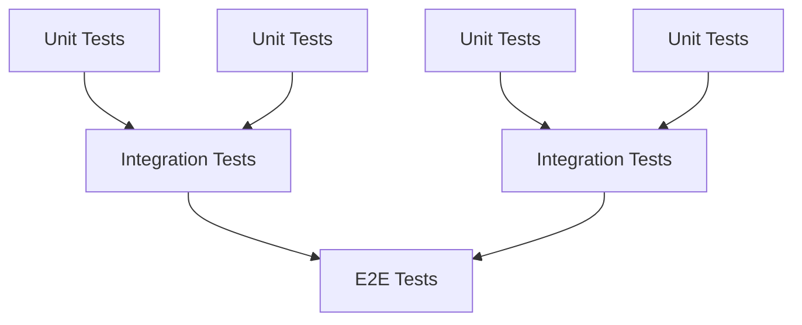
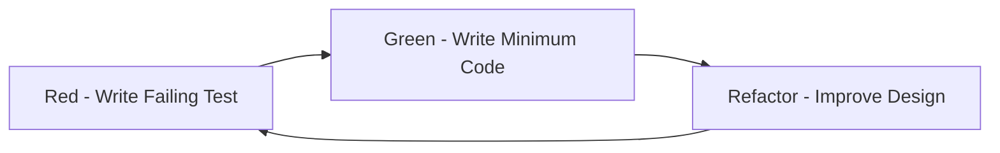

# 1. Testing Strategy and Test Pyramid

> **TL;DR:** Optimize for confidence per minute: many fast unit tests, enough integration tests to validate real boundaries, and a tiny E2E slice for critical journeys. Prefer behavior-focused tests over coverage vanity metrics.

**Interview weight:** P1 - senior backend interviews expect clear trade-offs across unit, integration, contract, performance, and production testing because test strategy directly affects lead time, deploy safety, and on-call load.

## Core Concepts

- **Goal of testing** - reduce change risk, catch regressions early, and make refactoring safe.
- **Confidence per minute** - the best suite maximizes signal while keeping local and CI feedback fast.
- **Test portfolio** - different test types catch different failure modes; no single layer is sufficient.
- **Boundary focus** - production bugs cluster around DB, network, time, auth, serialization, config, and concurrency boundaries.
- **Determinism** - reliable tests control time, randomness, environment, and external dependencies.

## Test Pyramid vs Testing Trophy vs Ice-Cream Cone Anti-Pattern



| Aspect | Test Pyramid | Testing Trophy | Ice-Cream Cone |
| ------ | ------------ | -------------- | --------------- |
| **Origin** | **Kent Beck / Martin Fowler** | **Kent C. Dodds** | Community anti-pattern |
| **Emphasis** | Heavy `unit`, moderate `integration`, tiny `E2E` | Heavy `integration`, plus strong static analysis | Heavy `E2E`, weak lower layers |
| **Ratio** | Many `unit` -> fewer `integration` -> few `E2E` | Static analysis at base, then `unit`, most `integration`, few `E2E` | Inverted pyramid with most effort at the top |
| **Problem it solves** | Fast feedback with broad logic coverage | Better confidence in behavior across real boundaries | Usually grows accidentally, not intentionally |
| **Risk** | Can miss wiring issues if `integration` slice is too thin | Can slow CI if integration scope becomes too broad | Slow, expensive, flaky, and hard to debug |

- **Test Pyramid** - many `unit` tests, fewer `integration` tests, very few `E2E` tests.
- **Testing Trophy** - emphasizes `integration` tests and static analysis because user-visible behavior often emerges from collaboration between units.
- **Ice-cream cone** - too many `E2E` tests and too few lower-level tests; this creates slow pipelines and brittle releases.

## Test Types - Big Table

| Type | Scope | Speed | Cost | Flakiness | What it proves | When to run |
| ---- | ----- | ----- | ---- | --------- | -------------- | ----------- |
| **Unit** | Single function, class, or domain rule | Very fast | Low | Low | Business logic and edge cases behave correctly | Every save, every PR, every commit |
| **Integration** | Real boundary with DB, cache, queue, filesystem, auth, or HTTP dependency | Medium | Medium | Medium | Wiring, serialization, queries, config, and infra behavior are correct | PR and CI |
| **Component** | A service slice inside one process, often via HTTP with real DI | Medium | Medium | Medium | Controller -> app -> persistence path works inside one service | PR and CI |
| **Contract (Pact)** | Consumer/provider API agreement | Fast-Medium | Low-Medium | Low | Request/response shape and compatibility across services | PR plus provider deploy validation |
| **E2E** | Full user journey across multiple services or UI + backend | Slow | High | High | Critical workflows work end to end | Main branch, nightly, pre-release |
| **Smoke** | Minimal deployment verification | Fast | Low | Low | Service starts, health checks pass, one happy path works | Post-deploy and CI |
| **Regression** | Test added for a past bug | Varies | Varies | Varies | A known failure mode stays fixed | Always in the relevant suite |
| **Load/Performance** | Throughput, latency, saturation, scalability | Slow | High | Medium | Capacity and SLO risk under expected and peak load | Sprint gates, pre-release, perf env |
| **Chaos** | Fault injection under controlled blast radius | Slow | High | Medium-High | Resilience, retries, failover, and graceful degradation | Scheduled in staging or guarded prod |

## What Makes a Good Test - FIRST Principles

- **Fast** - milliseconds, not seconds; slow tests do not get run.
- **Isolated** - no dependencies between tests; no shared mutable state.
- **Repeatable** - same result on every run, on any machine or CI agent.
- **Self-validating** - clear pass/fail without manual inspection.
- **Timely** - written close to the code change; TDD pushes this even earlier.
- **AAA structure** - use `Arrange`, `Act`, `Assert` so failure location is obvious.
- **One reason to fail** - a test should verify one behavior, not a grab bag of assertions.

## Test Naming Conventions

- **Pattern** - `MethodName_StateUnderTest_ExpectedBehavior`
- **Example** - `ProcessPayment_WhenCardDeclined_ThrowsPaymentException`
- **BDD alternative** - `Given_When_Then`
- **Rule** - names should explain behavior, not implementation details.

## Test Doubles - Comparison Table

| Type | What it does | State? | Behavior verification? | C# example |
| ---- | ------------ | ------ | ---------------------- | ---------- |
| **Dummy** | Passed only to satisfy a parameter; never used | No | No | `new Customer("", "")` |
| **Stub** | Returns canned data | Usually fixed | No | `clock.GetUtcNow() => fixedTime` |
| **Spy** | Records calls for later inspection | Yes | After-the-fact | `emailSpy.Sent.Count == 1` |
| **Mock** | Pre-programmed expectations on collaborator calls | Optional | Yes | `mockBus.Verify(x => x.PublishAsync(...))` |
| **Fake** | Simplified working implementation | Yes | Usually via state | `new InMemoryOrderRepository()` |

- **Dummy** - passed but never used.
- **Stub** - supplies canned answers; it does not fail the test based on call expectations.
- **Spy** - captures interactions, then the test inspects them.
- **Mock** - encodes interaction expectations and fails if they are not met.
- **Fake** - real behavior with shortcuts, such as in-memory storage or an in-memory message bus.

## Over-Mocking as a Design Smell

- **Symptom** - a simple test needs 8-10 mocks to construct the SUT.
- **Why it is bad** - the test verifies mocking setup more than observable behavior.
- **Design signal** - too many mocks often means too many dependencies or mixed responsibilities.
- **Practical rule** - prefer fakes for infrastructure where realistic behavior matters; avoid mocking repositories if you can validate queries against a real test DB.

## London vs Chicago Schools

| Aspect | London (Mockist) | Chicago (Classicist) |
| ------ | ---------------- | -------------------- |
| **Isolation** | One class in isolation | Small cluster of real collaborators |
| **Test doubles** | Mock most collaborators | Use real objects where cheap |
| **What is verified** | Interactions between objects | Observable state and behavior |
| **Coupling to implementation** | Higher | Lower |
| **Unit definition** | A class | A behavior-focused unit of work |

- **London** - useful when collaborators are expensive, asynchronous, or side-effect heavy.
- **Chicago** - useful when domain objects are cheap to construct and you want refactor-friendly tests.

## TDD Red-Green-Refactor



- **Red** - write a failing test that describes the next behavior.
- **Green** - write the minimum code that makes the test pass.
- **Refactor** - improve structure while keeping tests green.
- **Benefits** - better API design, instant regression detection, and executable documentation.
- **BDD/Gherkin** - `Given-When-Then` scenarios in feature files; `SpecFlow` is the common .NET tool.

## Code Coverage

- **Line coverage** - lines executed; easy to measure, easy to game.
- **Branch coverage** - whether each conditional path was taken; stronger than line coverage.
- **Mutation testing** - introduce small code changes and check whether tests fail; strongest signal of assertion quality.
- **Why 100% is not the goal** - covered code can still be weakly asserted, over-mocked, or miss important edge cases.
- **Better metric** - confidence in business-critical behavior, failure modes, and boundary conditions.

## Testing Async Code

- **Use** `async Task` test methods; `xUnit` supports them natively.
- **Never use** `.Result` or `.Wait()` in tests; they can deadlock and hide timing bugs.
- **Prefer** `TaskCompletionSource` or explicit synchronization over `Thread.Sleep`.
- **Test cancellation** - pass `CancellationToken` and assert `OperationCanceledException` when cancellation is expected.
- **Test failures** - assert the exact exception and any side effects after awaited calls.

## Testing Time

- **Do not call** `DateTime.UtcNow` directly in production code; it is hard to control in tests.
- **Use** `ITimeProvider` abstraction or .NET 8 `TimeProvider` with `GetUtcNow()`.
- **Inject** `FakeTimeProvider` from `Microsoft.Extensions.TimeProvider.Testing` in tests.
- **Simulate expiry** with `timeProvider.Advance(TimeSpan.FromHours(1))` instead of waiting in real time.

## Flaky Test Causes and Fixes

| Cause | Fix |
| ----- | --- |
| **Shared state between tests** | Use fresh instances per test; scope fixtures carefully with `IClassFixture` |
| **Time dependencies** | Abstract time and use a fake clock |
| **Async race conditions** | Properly `await`; avoid `Thread.Sleep` |
| **Order dependency** | Randomize order, isolate setup, and clean up reliably |
| **External service calls** | Mock, stub, or replace with `Testcontainers` / fakes |
| **Non-deterministic data** | Use builders and controlled data generation |

## Test Data Builders / Object Mother

- **Object Mother** - static factories for common objects such as `ValidOrder()` or `PaidInvoice()`.
- **Builder pattern** - `new OrderBuilder().WithItem("SKU123").WithQuantity(5).Build()`.
- **Why it helps** - keeps assertions focused and hides irrelevant construction noise.
- **Rule** - builders should produce valid defaults first; tests override only what matters.

## Testing in Production

- **Feature flags** - dark launch, gradual rollout, and kill switch for fast rollback.
- **Canary deployment** - send a small traffic percentage to the new version, then compare error rate and latency before full rollout.
- **Synthetic monitoring** - scripted probes that continuously hit production endpoints and alert on failures.
- **Shadow traffic** - duplicate real traffic to a new version and compare responses without affecting users.
- **Chaos engineering** - inject latency, pod kills, or dependency failures to validate resilience.

## Contract Testing for Microservices

- **Consumer-driven contract testing** - the consumer defines the request/response shape it requires.
- **Problem it solves** - catches compatibility breaks without coupling every service change to fragile E2E suites.
- **.NET tool** - `Pact.NET`.
- **Workflow** - publish contracts to a Pact Broker; verify them in provider CI on each deploy.
- **Best fit** - independent teams shipping services with separate release cadences.

## Pragmatic Testing Strategy for Distributed .NET System

- **70% unit tests** - domain logic, validation, mapping rules, pricing, authorization decisions, and pure functions.
- **20% integration tests** - DB queries, EF Core mappings, message bus handlers, cache behavior, auth filters, and outbound API clients via `Testcontainers`.
- **10% E2E / smoke** - critical user journeys only, not every path.
- **Contract tests** - per service boundary to reduce E2E sprawl.
- **Load tests** - gated per sprint for P0 endpoints and capacity-sensitive flows.
- **Chaos tests** - monthly in staging, then guarded production experiments for mature teams.

## Comparison

| Goal | Best default test type | Why | Avoid as first choice |
| ---- | ---------------------- | --- | --------------------- |
| **Validate pure business logic** | **Unit** | Fastest feedback and easiest edge-case coverage | `E2E` |
| **Validate SQL, serialization, DI, config** | **Integration** | Real boundary behavior matters more than mocks | Pure `unit` with mocked repository |
| **Validate service-to-service schema compatibility** | **Contract** | Tight signal with low coupling | Broad `E2E` chain |
| **Validate critical user journey** | `E2E` + `Smoke` | Confirms system behavior from the outside | Hundreds of redundant journeys |
| **Validate capacity and latency** | **Load/Performance** | Only realistic traffic reveals saturation | Unit tests as performance proof |
| **Validate resilience under failure** | **Chaos** | Surfaces retry, timeout, and failover gaps | Happy-path integration tests only |

## Code Example

```csharp
using Microsoft.Extensions.Time.Testing;
using Xunit;

public sealed class TokenService(TimeProvider timeProvider)
{
    public DateTimeOffset Issue(TimeSpan ttl) => timeProvider.GetUtcNow().Add(ttl);
    public bool IsExpired(DateTimeOffset expiresAt) => timeProvider.GetUtcNow() >= expiresAt;
}

public class TokenServiceTests
{
    [Fact]
    public void IsExpired_AfterClockAdvances_ReturnsTrue()
    {
        var clock = new FakeTimeProvider(DateTimeOffset.Parse("2026-01-01T00:00:00Z"));
        var sut = new TokenService(clock);
        var expiresAt = sut.Issue(TimeSpan.FromHours(1));

        Assert.False(sut.IsExpired(expiresAt));
        clock.Advance(TimeSpan.FromHours(1));
        Assert.True(sut.IsExpired(expiresAt));
    }
}
```

## Trade-offs

| Decision | Upside | Downside | Good default |
| -------- | ------ | -------- | ------------ |
| **More unit tests** | Fast, cheap, precise failures | Can miss wiring issues | Use for domain logic |
| **More integration tests** | Better confidence at real boundaries | Slower and costlier CI | Use for DB, messaging, auth, HTTP |
| **Real infra in CI** | Finds config and compatibility bugs | Slower setup, more moving parts | Use `Testcontainers` selectively |
| **Broader E2E coverage** | Strong external confidence | Highest flakiness and triage cost | Keep only critical flows |
| **Testing in production** | Most realistic signal | Blast-radius risk if poorly guarded | Use flags, canaries, shadow traffic |

## Common Pitfalls

- **Chasing 100% coverage** instead of meaningful assertions.
- **Mocking every dependency** and locking tests to implementation details.
- **Using** `Thread.Sleep` **in tests** instead of deterministic coordination.
- **Sharing mutable fixtures** across tests and creating order dependency.
- **Ignoring flaky tests**; they train teams to distrust CI.
- **Skipping boundary tests** for auth, config, serialization, retries, and DB mappings.
- **Writing giant tests** with multiple reasons to fail.

## Interview Questions

**Q1. What is the test pyramid?**
A: Many fast `unit` tests at the base, fewer `integration` tests in the middle, and very few `E2E` tests at the top.
Why: It maximizes feedback speed while still validating real boundaries.

**Q2. What is the difference between a mock and a stub?**
A: A **stub** returns canned data; a **mock** also verifies interactions and expectations.
- **Rule of thumb:** Stub for state-based testing, mock when the interaction itself is the behavior.

**Q3. What makes a good test?**
A: Follow **FIRST**: fast, isolated, repeatable, self-validating, and timely.
- **Plus:** clear `Arrange-Act-Assert` structure and one reason to fail.

**Q4. Why is 100% code coverage not the goal?**
A: Coverage shows execution, not assertion quality.
- **Better answer:** optimize for confidence in important behaviors, edge cases, and boundary failures.

**Q5. How do you test async code correctly?**
A: Write `async Task` tests, always `await`, and avoid `.Result`, `.Wait()`, and `Thread.Sleep`.
- **Also test:** cancellation, exceptions, and race-prone ordering.

**Q6. How do you test time-dependent code in .NET 8?**
A: Inject `TimeProvider` into production code and use `FakeTimeProvider` in tests.
- **Benefit:** you can advance time instantly and deterministically.

**Q7. What is mutation testing?**
A: A tool mutates code, such as flipping conditions, and checks whether tests fail.
- **Meaning:** surviving mutants indicate weak assertions or missing tests.

**Q8. What causes flaky tests, and how do you fix them?**
A: Common causes are shared state, real time, race conditions, order dependency, and external services.
- **Fixes:** isolate fixtures, fake time, await correctly, control data, and remove real network dependence.

**Q9. Senior: London vs Chicago testing schools - when do you use which?**
A: Use **Chicago** by default for domain logic because it is less coupled to implementation and survives refactors better.
- **Use London** when collaborator interactions are the behavior or dependencies are expensive, asynchronous, or side-effect heavy.

**Q10. Senior: What problem does contract testing solve in microservices?**
A: It prevents provider changes from silently breaking consumers while avoiding large, brittle E2E chains.
    - **Operational value:** teams can deploy independently with CI verification against published contracts.

**Q11. Senior: How would you systematically reduce flaky tests across a CI pipeline?**
A: First classify failures by root cause: time, order, infra, async, data, or environment.
    - **Then:** quarantine failing tests, add deterministic clocks and builders, remove `Thread.Sleep`, improve fixture isolation, and track flake rate as an engineering metric.

**Q12. Senior: How do you test in production without causing incidents?**
A: Use feature flags, canaries, shadow traffic, synthetic probes, and fast rollback paths.
    - **Guardrails:** tiny blast radius, strong observability, auto-stop thresholds, and explicit ownership during rollout.

**Q13. Staff: Design a pragmatic testing strategy for a distributed .NET system serving 5K RPS.**
A: Keep most coverage in `unit` tests for domain logic, add `integration` tests for every real boundary, and use `contract` tests between services.
    - **Production focus:** keep only critical `E2E` flows, run load tests for P0 endpoints, and validate resilience with staged chaos experiments.

## Quick Recap

- **Test pyramid** is the safest default: many `unit`, fewer `integration`, very few `E2E`.
- **Use the right test type** for the risk you want to catch; do not force everything into one layer.
- **FIRST + AAA** keeps tests fast, readable, and trustworthy.
- **Mock less, fake more** when realistic infrastructure behavior matters.
- **Control time and async behavior** with `TimeProvider`, `FakeTimeProvider`, proper `await`, and cancellation tests.
- **Flaky tests are a process problem**; root-cause and remove them quickly.
- **Contract testing** reduces cross-service breakage without giant E2E suites.
- **Testing in production** is powerful only with guardrails: flags, canaries, observability, and rollback.

