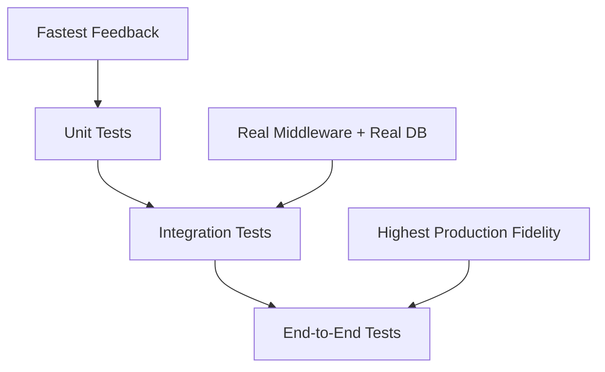
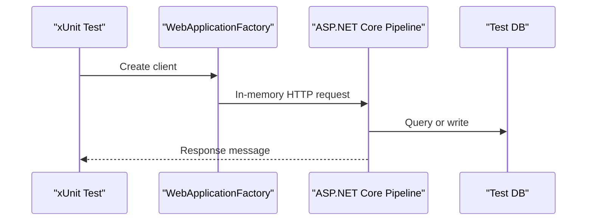
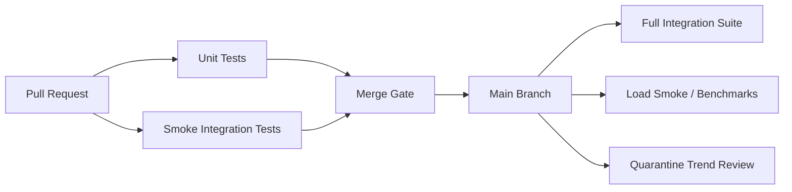

# 2. Testing in .NET — xUnit, Moq and Integration Tests

> **TL;DR:** **xUnit** is the modern default for .NET OSS, **Moq** is the common mocking library, **`WebApplicationFactory<TEntryPoint>`** is the default ASP.NET Core integration-test harness, and **Testcontainers + a real DB** is the most production-faithful way to validate persistence behavior.

**Interview weight:** P1 — deep .NET testing knowledge expected at senior level

## Core Concepts

| Priority | Focus |
| --- | --- |
| **P0** | **`[Fact]` vs `[Theory]`**, fixtures, Moq setup/verify, `WebApplicationFactory`, EF Core provider pitfalls |
| **P1** | Testcontainers, CI test categorization, strict vs loose mocks, load-test interpretation |
| **P2** | Snapshot testing, approval workflows, NSubstitute as an alternative |



- **Unit tests** — isolate a small behavior; use mocks at process boundaries; fastest feedback.
- **Integration tests** — run real ASP.NET Core middleware, DI, filters, serialization, auth, and often a real database.
- **Load tests** — validate system behavior under concurrency and sustained traffic; different from functional correctness.
- **Benchmarks** — measure micro-performance of hot code paths; different from load tests.
- **Default senior stance** — minimize over-mocking, test business logic with unit tests, test infrastructure with integration tests, and validate persistence with a real DB.

## xUnit Essentials

- **`[Fact]`** — single test with no input matrix.
- **`[Theory]` + `[InlineData(...)]`** — parameterized test with compile-time constants; good for small input matrices.
- **`[Theory]` + `[MemberData(nameof(...))]`** — data from a static `IEnumerable<object[]>` property or method.
- **`[Theory]` + `[ClassData(typeof(...))]`** — data from a dedicated `IEnumerable<object[]>` class; use when test data needs reuse or setup logic.
- **`IClassFixture<T>`** — one shared fixture instance per test class; good for expensive setup reused within one class.
- **`ICollectionFixture<T>` + `[Collection("name")]`** — one shared fixture across multiple test classes; good when multiple classes must reuse the same DB/container/server.
- **Constructor** — runs before each test instance.
- **`IDisposable.Dispose`** — runs after each test instance.
- **Parallelization default** — xUnit runs test classes in parallel by default.
- **Disable parallelization** — use `[assembly: CollectionBehavior(DisableTestParallelization = true)]` when tests share mutable global state.
- **Rule of thumb** — keep tests parallel unless a shared resource forces serialization.

## Moq Deep Dive

- **`Mock<T>` behavior**
- **`MockBehavior.Strict`** — throws on unexpected calls; best when interaction contracts matter.
- **`MockBehavior.Loose`** — returns defaults for unstubbed calls; faster to write, easier to overuse.
- **Setup** — `mock.Setup(x => x.Method(It.IsAny<string>())).Returns("value")`.
- **Callbacks** — use `.Callback<string>(arg => captured = arg)` to assert transformed input, logging side effects, or outbound payloads.
- **Async** — prefer `.ReturnsAsync(value)`; `.Returns(Task.FromResult(value))` also works.
- **Verify** — `mock.Verify(x => x.Method(It.IsAny<string>()), Times.Once)`.
- **Argument matchers**
- **`It.IsAny<T>()`** — ignore argument shape.
- **`It.Is<T>(x => x > 0)`** — assert predicate logic.
- **`It.IsIn<T>(...)`** — constrain to an allowed set.
- **`HttpClient`** — cannot be mocked directly in a useful way; mock `HttpMessageHandler.SendAsync` instead.
- **`ILogger<T>`** — `Mock<ILogger<T>>` works; prefer a `VerifyLog` helper or inspect `loggerMock.Invocations` to assert `LogLevel`, rendered message, and exception.
- **Non-virtual/static limitation** — Moq uses Castle DynamicProxy, so members must be overridable; wrap static or sealed dependencies behind interfaces like `IFileSystem` or `IDateTimeProvider`.
- **Legacy workaround** — use Microsoft Fakes or shims only for legacy code you cannot refactor.
- **NSubstitute alternative** — `Substitute.For<IService>()`; cleaner syntax for many teams, especially for argument capture and received-call assertions.

## Integration Testing ASP.NET Core with `WebApplicationFactory`



- **`WebApplicationFactory<TEntryPoint>`** — spins up an in-memory test server; no real network involved.
- **Service overrides** — use `builder.ConfigureTestServices(services => { ... })` to replace external dependencies with stubs, mocks, or test implementations.
- **Auth bypass** — register `services.AddAuthentication(TestAuthHandler.SchemeName)` with a custom `AuthenticationHandler` that returns a test principal.
- **Real DB option** — point configuration to `appsettings.Testing.json` or environment variables; keep secrets out of source.
- **Best use** — validate routing, filters, middleware, JSON serialization, auth policies, DI wiring, and DB behavior in one test.
- **Not a browser test** — no real sockets, reverse proxy, TLS, or JS runtime.

## Testcontainers

- **Purpose** — spin up real Docker containers for SQL Server, Redis, RabbitMQ, or Azurite during tests.
- **Packages** — `Testcontainers.SqlServer`, `Testcontainers.Redis`, `Testcontainers.RabbitMq`, `Testcontainers.Azurite`.
- **Lifecycle**
- **Build** — `ContainerBuilder.Build()` or the package-specific builder.
- **Start** — `StartAsync()`.
- **Connect** — read the connection string from `container.GetConnectionString()`.
- **xUnit integration** — use `IAsyncLifetime` for async setup/teardown.
- **Why seniors prefer it** — validates migrations, collation, constraints, transactions, and provider-specific SQL that fake providers miss.
- **Trade-off** — slower than in-memory tests; keep scope targeted and parallel-safe.

## EF Core Testing Options

- **In-Memory Provider** — fast, but not relational; do not trust it for SQL translation or query correctness.
- **SQLite In-Memory** — much better relational signal, but still not SQL Server; some types and features differ.
- **Real DB via Testcontainers** — gold standard for repository/query tests; run in CI on PRs or at least on merge to main.
- **Practical split**
- **Unit tests** — mock repositories only when testing business logic above the DB layer.
- **Query tests** — use a real provider.
- **Migration tests** — use a real provider.

## Snapshot/Approval Testing

- **Snapshot testing** — capture actual JSON, HTML, text, or object graphs into a snapshot file; fail the test when output changes.
- **Libraries** — `Verify` and `ApprovalTests`.
- **Best for**
- **Serialization output**
- **API response shape**
- **Complex DTO/object graphs**
- **Generated text or HTML**
- **Rule** — review snapshot diffs like code diffs; do not auto-accept blindly.

## Load Testing

| Tool | Open source | Protocol | Scripting | Metrics | When to use |
| --- | --- | --- | --- | --- | --- |
| **k6** | Yes | HTTP, gRPC, WebSocket | JavaScript | Strong built-ins + cloud export | Modern API load tests; simple CI integration |
| **JMeter** | Yes | HTTP, JDBC, JMS, more | GUI + plugins | Broad ecosystem | Legacy enterprise estates; many protocols |
| **NBomber** | Yes | HTTP, gRPC, Kafka, SQL | C#/.NET native | Good reports + code-first | Best fit when the team wants .NET-native scenarios |
| **Gatling** | Yes | HTTP, WebSocket | Scala | Strong latency analysis | High-scale API tests with code-defined scenarios |
| **locust** | Yes | HTTP and custom | Python | Good live UI | Python-heavy teams |

| Metric | What it tells you |
| --- | --- |
| **Throughput (RPS)** | How much traffic the system sustains |
| **p50 latency** | Median user experience |
| **p95 latency** | Tail latency for the slowest 5% |
| **p99 latency** | Worst-case tail behavior; often where contention appears |
| **Error rate** | Whether the system is failing under load |
| **Active users** | Current concurrency or session pressure |
| **Saturation (CPU/memory/thread pool)** | Which resource is becoming the bottleneck |

- **Interpret results**
- **Knee of the curve** — the point where latency sharply inflects while throughput flattens.
- **Error-rate spike** — typical saturation indicator.
- **Thread-pool starvation** — rising latency with low CPU can indicate sync-over-async or blocked worker threads.

## Benchmarking with BenchmarkDotNet

- **`[Benchmark]`** — annotate methods to measure.
- **Runner** — call `BenchmarkRunner.Run<MyBenchmarks>()` from `Main`.
- **Reports** — mean, memory allocated, and Gen0/1/2 collections.
- **Use case** — micro-benchmarks for hot-path code such as parsing, serialization, allocations, or custom collections.
- **Do not use** — `Stopwatch` loops for serious benchmarking; they ignore warmup, JIT, GC noise, and statistical rigor.

## CI Test Strategy



- **Parallelism** — unit tests are parallel by default; integration tests may need serialization when they share a DB or static resource.
- **Categories** — use `[Trait("Category", "Unit")]` and `[Trait("Category", "Integration")]`.
- **PR checks** — run unit tests and smoke integration tests on every PR.
- **Main-branch checks** — run the full integration suite on merge.
- **Quarantine** — move flaky tests into a separate suite; do not let them silently fail forever.
- **Required checks** — unit + smoke tests on PR; full integration on main branch.
- **Trend gates** — fail builds on more than an agreed threshold of new failures or unstable tests.
- **600+ microservices heuristic**
- **Per service PR** — unit + targeted integration + contract tests.
- **Platform nightly** — broader end-to-end and shared-environment suites.
- **Central governance** — common test templates, stable tags, flaky-test SLAs, and result trending.

## Comparison

### xUnit vs NUnit vs MSTest

| Aspect | xUnit | NUnit | MSTest |
| --- | --- | --- | --- |
| **Test attribute** | `[Fact]` | `[Test]` | `[TestMethod]` |
| **Parameterized** | `[Theory]`, `[InlineData]`, `[MemberData]`, `[ClassData]` | `[TestCase]`, `[TestCaseSource]` | `[DataTestMethod]`, `[DataRow]`, dynamic data |
| **Setup/teardown** | Constructor / `IDisposable` / fixtures | `[SetUp]`, `[TearDown]`, `[OneTimeSetUp]` | `[TestInitialize]`, `[TestCleanup]`, class initialize/cleanup |
| **Parallelism default** | Parallel between classes by default | Usually opt-in via `[Parallelizable]` or config | More conservative by default; configurable |
| **Fixture/shared state** | `IClassFixture<T>`, `ICollectionFixture<T>` | Fixture attributes + setup lifecycle | Class/test context patterns |
| **.NET Core support** | Excellent | Excellent | Excellent |
| **Popularity in .NET OSS** | Highest | Strong | Lower in OSS; common in Microsoft-centric estates |

### Assertions — `xUnit` vs `FluentAssertions` vs `Shouldly`

| Aspect | xUnit built-in | FluentAssertions | Shouldly |
| --- | --- | --- | --- |
| **Style** | Static `Assert.*` methods | Extension-style fluent chain | Sentence-like helpers |
| **Readability** | Good, terse | Highest for complex objects | High for simple intent |
| **Error messages** | Adequate | Usually best-in-class | Very readable |
| **`async` support** | Good | Good | Good |
| **Collection assertions** | Solid basics | Richest API surface | Good common cases |
| **Custom assertion extensions** | Manual helper methods | Strong extensibility | Possible, less common |

### EF Core provider comparison

| Aspect | In-Memory Provider | SQLite In-Memory | Real DB via Testcontainers |
| --- | --- | --- | --- |
| **LINQ translation** | Weak signal; many queries never translate | Better, still provider-specific gaps | Real signal |
| **Transactions** | Limited fidelity | Supported better | Real behavior |
| **Constraints enforced** | No FK/relational guarantees | Some relational guarantees | Real guarantees |
| **Migration tested** | No | Partial | Yes |
| **Speed** | Fastest | Fast | Slowest |
| **Recommendation** | Use only for simple business-logic tests | Good middle ground | Default for query + migration confidence |

## Code Example

### xUnit `Theory` with `InlineData` and `MemberData`

```csharp
public class DiscountCalculatorTests
{
    public static IEnumerable<object[]> PremiumCases =>
        new[]
        {
            new object[] { true, 100m, 90m },
            new object[] { false, 100m, 100m }
        };

    [Theory]
    [InlineData(true, 200, 180)]
    [InlineData(false, 200, 200)]
    [MemberData(nameof(PremiumCases))]
    public void Applies_discount(bool isPremium, decimal amount, decimal expected)
    {
        var sut = new DiscountCalculator();
        var actual = sut.Apply(isPremium, amount);
        Assert.Equal(expected, actual);
    }
}

public sealed class DiscountCalculator
{
    public decimal Apply(bool isPremium, decimal amount) =>
        isPremium ? amount * 0.90m : amount;
}
```

### Mocking `HttpClient` via `HttpMessageHandler`

```csharp
var handler = new Mock<HttpMessageHandler>(MockBehavior.Strict);
handler.Protected()
    .Setup<Task<HttpResponseMessage>>(
        "SendAsync",
        ItExpr.IsAny<HttpRequestMessage>(),
        ItExpr.IsAny<CancellationToken>())
    .ReturnsAsync(new HttpResponseMessage(HttpStatusCode.OK)
    {
        Content = new StringContent("{\"status\":\"ok\"}")
    });

var client = new HttpClient(handler.Object) { BaseAddress = new Uri("https://test") };
var response = await client.GetAsync("/health");

Assert.Equal(HttpStatusCode.OK, response.StatusCode);
handler.Protected().Verify(
    "SendAsync",
    Times.Once(),
    ItExpr.Is<HttpRequestMessage>(r => r.Method == HttpMethod.Get),
    ItExpr.IsAny<CancellationToken>());
```

- **`ILogger<T>` verification pattern** — use a helper like `loggerMock.VerifyLog(LogLevel.Error, "timeout")`, or inspect `loggerMock.Invocations` to assert the rendered state and exception.

```csharp
var logger = new Mock<ILogger<OrderService>>();
sut.Process();
Assert.Contains(logger.Invocations, call =>
    Equals(call.Arguments[0], LogLevel.Error) &&
    call.Arguments[2]?.ToString()?.Contains("timeout") == true);
```

### `WebApplicationFactory` integration test with auth bypass

```csharp
public sealed class OrdersApiTests
{
    [Fact]
    public async Task Get_order_returns_200()
    {
        await using var factory = new WebApplicationFactory<Program>()
            .WithWebHostBuilder(b => b.ConfigureTestServices(s =>
            {
                s.AddSingleton<IClock>(new FixedClock());
                s.AddAuthentication(TestAuthHandler.SchemeName)
                 .AddScheme<AuthenticationSchemeOptions, TestAuthHandler>(TestAuthHandler.SchemeName, _ => { });
            }));
        var client = factory.CreateClient();
        client.DefaultRequestHeaders.Authorization = new AuthenticationHeaderValue(TestAuthHandler.SchemeName);
        var response = await client.GetAsync("/orders/42");
        Assert.Equal(HttpStatusCode.OK, response.StatusCode);
    }

    private sealed class FixedClock : IClock { public DateTime UtcNow => new(2026, 1, 1, 0, 0, 0, DateTimeKind.Utc); }
    private sealed class TestAuthHandler : AuthenticationHandler<AuthenticationSchemeOptions>
    {
        public const string SchemeName = "Test";
        public TestAuthHandler(IOptionsMonitor<AuthenticationSchemeOptions> o, ILoggerFactory l, UrlEncoder e) : base(o, l, e) { }
        protected override Task<AuthenticateResult> HandleAuthenticateAsync()
        {
            var principal = new ClaimsPrincipal(new ClaimsIdentity(new[] { new Claim(ClaimTypes.NameIdentifier, "42") }, SchemeName));
            return Task.FromResult(AuthenticateResult.Success(new AuthenticationTicket(principal, SchemeName)));
        }
    }
}
```

### Testcontainers SQL Server with xUnit `IAsyncLifetime`

```csharp
public sealed class SqlServerFixture : IAsyncLifetime
{
    private readonly MsSqlContainer _sql = new MsSqlBuilder().Build();
    public string ConnectionString => _sql.GetConnectionString();

    public Task InitializeAsync() => _sql.StartAsync();
    public Task DisposeAsync() => _sql.DisposeAsync().AsTask();
}

public sealed class OrdersRepositoryTests : IClassFixture<SqlServerFixture>
{
    private readonly SqlServerFixture _fixture;
    public OrdersRepositoryTests(SqlServerFixture fixture) => _fixture = fixture;

    [Fact]
    public void Uses_real_sql_server() => Assert.Contains("Server=", _fixture.ConnectionString);
}
```

## Trade-offs

| Decision | Preferred default | Choose the alternative when | Cost of the wrong choice |
| --- | --- | --- | --- |
| **`MockBehavior.Strict` vs `Loose`** | `Loose` for broad business-logic tests; `Strict` for narrow collaboration tests | You must lock down outbound calls or interaction count | Brittle tests or hidden unexpected calls |
| **`WebApplicationFactory` vs real out-of-process service** | `WebApplicationFactory` | You must validate networking, TLS, container startup, or ingress behavior | Slow tests or missing infrastructure bugs |
| **SQLite vs real SQL Server** | Real SQL Server for query and migration confidence | Fast inner-loop validation matters more than perfect fidelity | Green tests that fail in production SQL |
| **Mocks vs snapshots** | Mocks for behavior, snapshots for large output shapes | Output shape is the contract you care about | Fragile tests or unreadable asserts |
| **Parallel integration tests vs serialized** | Parallel when resources are isolated | Shared DB/schema/static state cannot be isolated cheaply | Flaky CI or unnecessarily slow pipelines |

## Common Pitfalls

- **Using EF Core In-Memory for query correctness** — it does not validate SQL translation, constraints, or provider-specific behavior.
- **Over-mocking** — tests pass while DI wiring, JSON options, filters, or auth fail in the real app.
- **Shared mutable fixture state** — parallel tests contaminate each other.
- **Ignoring cancellation and timeouts** — async code looks correct until production latency appears.
- **Mocking `HttpClient` instead of `HttpMessageHandler`** — the test shape is wrong.
- **Trying to mock non-virtual/static methods with Moq** — use wrappers or refactor seams.
- **Quarantine without ownership** — flaky tests become permanent background noise.
- **Using `Stopwatch` loops as benchmarks** — results are noisy and misleading.
- **Accepting snapshot diffs blindly** — snapshots become cargo-cult golden files.

## Interview Questions

**Q1. Q1 (P0): When do you use `[Fact]` vs `[Theory]`?**
A: Use `[Fact]` for one behavior with one input shape. Use `[Theory]` when the assertion logic is the same but inputs vary.

**Q2. Q2 (P0): `[Theory]` + `MemberData` vs `InlineData`?**
A: `InlineData` is ideal for small compile-time constants. `MemberData` is better when cases are larger, reused, or require complex objects.

**Q3. Q3 (P0): `IClassFixture<T>` vs `ICollectionFixture<T>`?**
A: `IClassFixture<T>` shares setup inside one test class. `ICollectionFixture<T>` shares the same expensive resource across multiple test classes via `[Collection("name")]`.

**Q4. Q4 (P1): `MockBehavior.Strict` vs `Loose` — when would you use each?**
A: Use `Strict` when unexpected interactions indicate a bug, especially for outbound dependencies. Use `Loose` when you care more about return values than every collaboration detail.

**Q5. Q5 (P1): Why is BenchmarkDotNet better than a `Stopwatch` loop?**
A: BenchmarkDotNet handles warmup, JIT stabilization, GC noise, multiple iterations, statistics, and memory allocation reporting. A `Stopwatch` loop usually measures test harness noise more than the code.

**Q6. Q6 (P1): `WebApplicationFactory` vs spinning up the real service in Docker?**
A: `WebApplicationFactory` is faster and ideal for validating the ASP.NET Core pipeline in-process. Dockerized out-of-process tests are slower but validate packaging, ports, TLS, and environment bootstrapping.

**Q7. Q7 (P1, Senior): How do you mock `HttpClient` in .NET?**
A: Do not mock `HttpClient` itself. Mock the protected `SendAsync` method on `HttpMessageHandler`, then construct a real `HttpClient` around that handler.

**Q8. Q8 (P1, Senior): Why can’t Moq mock non-virtual or static methods, and how do you work around that?**
A: Moq relies on Castle DynamicProxy, which creates subclasses and overrides members. Use wrapper interfaces such as `IFileSystem` or `IDateTimeProvider`, or use shims only for hard legacy seams.

**Q9. Q9 (P1, Senior): What are the pitfalls of EF Core In-Memory provider?**
A: It is not relational, skips SQL translation fidelity, and does not enforce real constraints the same way SQL Server does. A query that passes there can still fail in production.

**Q10. Q10 (P1, Senior): What are the benefits and trade-offs of Testcontainers?**
A: Benefits: real engine behavior, real migrations, better confidence, fewer prod-only surprises. Trade-offs: Docker dependency, slower startup, more CI resource usage, and the need for isolated test data.

**Q11. Q11 (P1, Senior): How would you structure a CI test pipeline for 600+ microservices?**
A: Standardize test categories and templates, run unit + targeted integration on each PR, run broader contract/end-to-end suites nightly or on merge, and track flaky tests with ownership and SLAs. Optimize for local service autonomy plus central reporting.

**Q12. Q12 (P2, Senior): When do you quarantine tests, and what governance do you put around it?**
A: Quarantine only genuinely flaky tests after root-cause triage. Keep them visible, trend them separately, assign an owner, and fail the build if quarantine size or age exceeds the agreed threshold.

## Quick Recap

- **xUnit** is the default modern .NET test framework; know `[Fact]`, `[Theory]`, fixtures, and parallelization.
- **Moq** is strongest when you understand setup, callbacks, argument matchers, and `Verify`.
- **`HttpClient`** is tested by mocking `HttpMessageHandler`, not the client itself.
- **`WebApplicationFactory`** is the fastest high-fidelity way to test the ASP.NET Core request pipeline.
- **EF Core In-Memory** is not trustworthy for query translation; prefer SQLite or a real DB.
- **Testcontainers** gives the best persistence confidence for senior-level systems.
- **Load tests** answer saturation questions; **BenchmarkDotNet** answers hot-path micro-performance questions.
