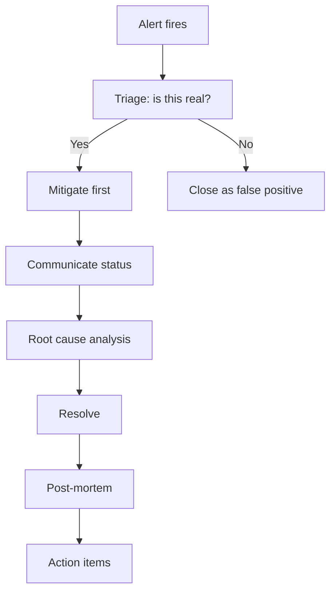

# 3. Debugging, Profiling and Production Incidents

## TL;DR

- **Takeaway** — reproduce, isolate, hypothesize, bisect, verify.
- **Production rule** — correlate logs, traces, and metrics first; mitigate user impact before chasing perfect root cause.

## Interview Weight

- **P1** — directly maps to on-call experience; walk me through a production incident is a classic senior-level question.

## Core Concepts

- **Debugging** — converting a symptom into a proven root cause.
- **Profiling** — measuring CPU, memory, allocation, lock, and I/O behavior under load.
- **Observability** — understanding system state from **logs**, **metrics**, and **traces**.
- **Mitigation** — restoring service quickly with rollback, feature flags, scaling, or traffic shifts.
- **Regression prevention** — proving the fix with metrics and adding a test so the same class of bug does not return.

## Systematic Debugging Method

1. **Reproduce**
- Get the smallest repro possible: single request, single payload, single tenant, single host if possible.
- Define **what broken looks like** with metrics: `500` rate, `p99` latency, timeout count, memory growth, queue depth.
- Capture exact inputs, environment, timestamps, and correlation IDs.
2. **Isolate**
- Narrow scope: which service, endpoint, deployment ring, node, dependency, or code path.
- Use **correlation IDs** to follow one failing request end-to-end.
- Separate app bug vs dependency issue vs infrastructure issue.
3. **Hypothesize**
- Form `2-3` specific theories, not vague guesses.
- Test the **most likely** theory first.
- Example: bad rollout, hot partition, connection leak, retry storm, thread-pool starvation.
4. **Bisect**
- Use `git bisect` to locate the exact bad commit with binary search through history.
- Useful when the issue started after a change window and reproduction is reliable.
5. **Verify**
- Fix, deploy to staging, measure the same metrics, and confirm the symptom is gone.
- Add or update a test to prevent regression.
- Close the loop with a short write-up: trigger, evidence, fix, prevention.

## Reading Stack Traces and Async Stack Traces

- **Synchronous traces** — read from **bottom** for outer caller/context, then move **up** to the exception site.
- **Async traces** — `async` state machines can mangle frame names; `.NET 6+` preserves the logical call stack better around `await`.
- **Key marker** — `--- End of stack trace from previous location ---` means the exception crossed an async boundary and was re-thrown later.
- **Preserve stack** — use `throw;` for immediate rethrow; use `ExceptionDispatchInfo.Capture(ex).Throw()` when you must rethrow later while keeping the original stack.
- **Triage habit**
- First exception type.
- First app-owned frame.
- Common wrapper exceptions: `AggregateException`, `TargetInvocationException`, `TaskCanceledException`.
- Whether the same failing frame appears across many requests or hosts.

## `git bisect`

- **Start** — `git bisect start`
- **Mark current broken state** — `git bisect bad`
- **Mark known good commit** — `git bisect good <sha>`
- **Automate** — `git bisect run ./run-test.sh` where exit `0 = good`, `1 = bad`
- **Why it matters** — finds the exact commit in `O(log n)` steps instead of linearly inspecting history.
- **Use when**
- Repro is deterministic.
- There is a bounded commit range.
- The failure is hard to reason about by inspection alone.

## Logging for Debuggability

- **Structured logs** — use named fields, not string concatenation: `logger.LogInformation("Processing {OrderId} for {UserId}", orderId, userId)`.
- **Correlation IDs**
- Propagate `X-Correlation-Id` through all service calls.
- Enrich logs through `LogContext` in Serilog or `BeginScope` in `ILogger`.
- **Log levels**
- `TRACE` — verbose path tracing.
- `DEBUG` — development diagnostics.
- `INFO` — business events and major flow milestones.
- `WARN` — recoverable issues.
- `ERROR` — unhandled or failed operations.
- `CRITICAL` — service unavailable or severe data-loss risk.
- **What to log**
- Request/response summary.
- Major state transitions.
- External dependency calls with latency and result.
- Retry count, circuit-breaker state, queue depth, throttling metadata.
- **Never log**
- PII: names, emails, cards.
- Secrets, tokens, connection strings.
- Full production request bodies unless explicitly scrubbed and justified.

## Distributed Tracing

- **Span model** — each service adds a span with timing, status, and metadata.
- **Propagation** — carry the trace ID via the W3C `traceparent` header.
- **Tooling** — Application Insights, Jaeger, Zipkin, OpenTelemetry.
- **Root-cause pattern** — open the waterfall view and look for the **deepest, widest span** to find the slow hop.
- **.NET APIs** — `Activity`, `ActivitySource`, OpenTelemetry SDK.
- **Use cases**
- Separate upstream waiting time from downstream latency.
- Prove whether retries, DNS, TLS handshake, or SQL are dominant.
- Correlate failures across `10+` microservices without grep-heavy log hunting.

## Metrics and Signals

- **RED** — best for services and APIs: request **Rate**, **Errors**, **Duration**.
- **USE** — best for resources: **Utilization**, **Saturation**, **Errors**.
- **Four golden signals** — **Latency**, **Traffic**, **Errors**, **Saturation**.
- **Use both layers**
- RED tells you user-visible service health.
- USE tells you whether the platform or dependency capacity is the bottleneck.

## Diagnosing Common .NET Production Problems

| Symptom | Likely Cause | Tool | Fix |
|---|---|---|---|
| High CPU | Tight loop, regex catastrophic backtracking, GC pressure | `dotnet-counters`, `dotnet-trace`, PerfView | Profile hot method, fix algorithm |
| High memory / leak | Objects rooted in static, event handler not unsubscribed, LOH fragmentation | `dotnet-gcdump`, `dotnet-dump`, `!dumpheap -stat` | Fix root, use `WeakReference`, pooling |
| GC pause storms | High allocation rate, LOH fragmentation, large gen2 | `dotnet-counters` (`gc-heap-size`, `gen-X-gc-count`), PerfView GC view | Reduce allocations, use `ArrayPool`, increase memory |
| Thread pool starvation | Sync-over-async (`.Result` / `.Wait()`), blocking I/O in pool thread | `dotnet-counters` (`threadpool-queue-length`), `!threadpool` in dump | `async`/`await` everywhere, `SemaphoreSlim` |
| Deadlock | Circular lock, lock + async | `dotnet-dump` + `!threads` + `!clrstack` | Fix lock ordering, use `SemaphoreSlim` |
| Socket/port exhaustion | Too many short-lived `HttpClient` instances, `TIME_WAIT` | `netstat -an \| grep TIME_WAIT`, `ss -s` | `HttpClientFactory`, increase port range |
| Connection pool exhaustion | Connections not returned, missing `Dispose`, slow queries holding connections | `sp_who2`, connection pool metrics, App Insights | Fix `using`/`Dispose`, async queries, add pool size |
| Slow SQL | Missing index, parameter sniffing, lock contention | Execution plan, `sys.dm_exec_query_stats`, Query Store | Add index, `OPTION(RECOMPILE)`, schema changes |
| Cache stampede | TTL expiry on hot key, thundering herd | Cache miss rate spike in metrics | Probabilistic early expiry, distributed lock on miss |
| Throttling `429`s | Rate limit hit on downstream such as Azure Service Bus, Cosmos, or external API | App Insights dependency failures, `Retry-After` header | Exponential backoff, circuit breaker, increase quota |
| Memory fragmentation / LOH | Large byte arrays `> 85 KB` not pooled, pinning | `dotnet-gcdump`, `!dumpheap -min 85000` | `ArrayPool<byte>`, avoid large object creation in loops |
| `TaskCanceledException` floods | Timeout too tight, slow dependency, `CancellationToken` propagated through chain | App Insights exceptions, trace | Increase timeout or circuit-break the dependency |
| Dependency timeouts | Cold start, overloaded downstream, DNS change not picked up | Distributed trace waterfall, `ping`/`curl` from service | Retry with backoff, pre-warm, fix DNS with `PooledConnectionLifetime` |
| Retry storms | Multiple services simultaneously retrying overloaded dependency | Error-rate spike pattern, same-time retries | Jitter in backoff, circuit breaker, shed load at edge |

## Diagnostic Tools Reference

- **`dotnet-counters monitor`** — real-time counters; use `--counters System.Runtime,Microsoft.AspNetCore.Hosting`.
- **`dotnet-dump collect -p <pid>`** then **`dotnet-dump analyze`** — heap and thread analysis.
- **`dotnet-gcdump collect -p <pid>`** — GC heap snapshot; open in Visual Studio or PerfView.
- **`dotnet-trace collect -p <pid>`** — CPU sampling trace; open in PerfView or SpeedScope.
- **PerfView** — collect ETW traces; analyze CPU, allocations, GC; Windows-only.
- **WinDbg / SOS**
- `!threads` — list managed threads.
- `!clrstack` — current managed call stack.
- `!dumpheap -stat` — heap grouped by type.
- `!gcroot <addr>` — find what is keeping an object alive.
- **Application Insights Profiler** — on-demand CPU trace in production with low overhead.
- **Live Metrics** — near-real-time requests, failures, and CPU in the Application Insights portal.

## Incident Management

### Severity Levels

| Level | Definition | Response time | Example |
|---|---|---|---|
| SEV1 | Service down for all users | 15 min | Checkout API returning `500` |
| SEV2 | Major feature broken or significant user impact | 30 min | `p99` latency above `5s` |
| SEV3 | Minor degradation, workaround exists | Next business day | Search occasionally timing out for one region |
| SEV4 | Cosmetic or single-user issue | Normal sprint | One-user UI formatting bug |

### On-Call Hygiene

- **Paging** — alert on symptoms such as latency and error rate, not just causes such as `CPU > X%`.
- **Escalation path** — primary on-call -> secondary -> engineering lead -> incident commander.
- **Runbooks** — step-by-step mitigation for known failure modes; link them from the alert.

### Incident Lifecycle



- **Mitigation before root cause** — rollback, feature-flag kill switch, scale out, or redirect traffic. Restore service first.
- **Rollback options** — blue-green swap, previous image tag, feature flag disable.
- **Comms** — status page update within `5 min` of SEV1; stakeholder update every `30 min`.

## Blameless Postmortems

- **Structure**
- Incident summary.
- Timeline.
- User impact.
- Root cause(s).
- Contributing factors.
- Action items.
- **5 Whys** — keep asking `why` until you hit a systemic cause, not a person-shaped answer.
- **Action items** — assign owner, due date, and category: **prevent**, **detect**, **reduce impact**.
- **Blameless** — systems failed, not people. Avoid naming and shaming.

## Error Budgets and SLO Burn Rate Alerts

- **Error budget** — `1 - SLO`; a `99.9%` SLO gives `43.8 min/month` downtime budget.
- **Burn rate** — how fast you are consuming that budget relative to plan.
- **High-burn paging** — at `36x` burn rate, use the interview shorthand `1 hr to exhaust the monthly budget` -> page immediately.
- **Freeze rule** — if the error budget is exhausted, freeze non-essential deployments until budget recovers.

## Alerting Design

- **Symptom-based, not cause-based** — alert on `users are failing`, not only `CPU > 80%`.
- **Actionable** — every alert needs a runbook and a clear next action.
- **Alert fatigue** — low-signal alerts teach on-call engineers to ignore pages; prune ruthlessly.
- **SLO burn-rate alerts** — use multi-window alerting such as `1h` and `6h` windows to reduce false positives.

## STAR-Ready Talking Points: `Walk me through a production incident you debugged`

- **Set up** — service, traffic, customer importance, SLO.
- **Detection** — alert, user report, metric anomaly, or deploy correlation.
- **Initial triage** — what you checked first and why.
- **Mitigation** — rollback, feature flag, scale, traffic shift.
- **Root cause** — exact evidence and tool used.
- **Resolution** — code fix, config fix, data fix, or infra fix.
- **Learning** — runbook, alert, architecture, test, or process improvement.
- **Delivery** — keep the story to `2-3` minutes; avoid irrelevant rabbit holes.

## Comparison

### Monitoring vs Observability

| Aspect | Monitoring | Observability |
|---|---|---|
| Goal | Detect known failure modes | Explain unknown failure modes |
| Input | Predefined dashboards and alerts | Logs, metrics, traces, ad-hoc queries |
| Best question | `Is the system broken?` | `Why is the system broken?` |
| Strength | Fast detection | Deep diagnosis |
| Limitation | Misses novel issues | Requires instrumentation discipline |

### RED vs USE

| Method | Stands for | Metrics | Best for |
|---|---|---|---|
| RED | Rate, Errors, Duration | Request rate, failure rate, latency | Services and APIs |
| USE | Utilization, Saturation, Errors | CPU, memory, queues, connection pools, disk | Resources and dependencies |

### Four Golden Signals

| Signal | What to measure | Alert threshold example |
|---|---|---|
| Latency | `p95` and `p99` response time by endpoint | `p99 > 2s` for `10 min` |
| Traffic | RPS, queue ingress, message rate | Traffic drops `50%` unexpectedly |
| Errors | `5xx`, failed dependencies, timeout rate | Error rate `> 2%` for `5 min` |
| Saturation | CPU, memory, queue depth, DB connections | Queue depth rising while throughput stalls |

### CPU vs Memory vs Allocation Profiling

| Profiling Type | What it finds | Tool | Overhead |
|---|---|---|---|
| CPU sampling | Hot methods consuming CPU | `dotnet-trace` + SpeedScope | `~1-3%` |
| CPU instrumentation | Exact call counts | PerfView, BenchmarkDotNet | `~10-50%` |
| Memory snapshot | Object counts by type, GC roots | `dotnet-gcdump`, WinDbg `!dumpheap` | Medium |
| Allocation profiling | What allocates the most | PerfView `/GCCollectOnly`, `AllocationTick` event | Low-medium |

- **Sampling** — statistically representative and low overhead.
- **Instrumentation** — exact counts but noticeably slows the app.

## Code Example

```csharp
using System.Diagnostics;

private static readonly ActivitySource Source = new("Checkout.Api");

app.Use(async (ctx, next) =>
{
    var correlationId = ctx.Request.Headers["X-Correlation-Id"].FirstOrDefault()
        ?? Guid.NewGuid().ToString("N");
    ctx.Response.Headers["X-Correlation-Id"] = correlationId;

    using var scope = logger.BeginScope(new Dictionary<string, object>
    {
        ["CorrelationId"] = correlationId
    });
    using var activity = Source.StartActivity("HTTP request");
    activity?.SetTag("http.route", ctx.Request.Path);
    activity?.SetTag("correlation.id", correlationId);

    var sw = Stopwatch.StartNew();
    try
    {
        await next();
        logger.LogInformation("Handled {Path} in {ElapsedMs} ms with {StatusCode}",
            ctx.Request.Path, sw.ElapsedMilliseconds, ctx.Response.StatusCode);
    }
    catch (Exception ex)
    {
        logger.LogError(ex, "Failed {Path} after {ElapsedMs} ms",
            ctx.Request.Path, sw.ElapsedMilliseconds);
        throw;
    }
});
```

## Trade-offs

- **More logs vs less noise**
- More fields improve diagnosis.
- More volume increases cost, cardinality, and PII risk.
- **Trace every request vs sample**
- Full tracing helps rare bugs.
- Sampling keeps cost and storage under control.
- **Retry aggressively vs protect dependencies**
- Retries hide transient faults.
- Unbounded retries create retry storms and longer incidents.
- **Rollback fast vs hotfix in place**
- Rollback is safer under pressure.
- Hotfix is justified when data migration or contract drift makes rollback risky.
- **Tight alerts vs alert fatigue**
- Sensitive alerts catch incidents early.
- Noisy alerts destroy on-call trust.

## Common Pitfalls

- **Skipping symptom definition** — start with measurable failure, not intuition.
- **Reading only averages** — `p50` can look healthy while `p99` is on fire.
- **Using `throw ex;`** — resets the stack and destroys evidence.
- **Blocking on async** — `.Result` and `.Wait()` can starve the thread pool.
- **Logging secrets or full bodies** — improves diagnosis but creates compliance and breach risk.
- **Retrying without jitter** — synchronized retries amplify downstream overload.
- **Taking dumps too late** — transient states disappear after restarts or scale events.
- **Fixing the code but not the guardrail** — no runbook, no alert, no regression test means repeat incident.

## Interview Questions

**Q1. What is the difference between monitoring and observability?**
A: Monitoring tells you whether known bad conditions are happening. Observability lets you explain unknown failures by correlating logs, metrics, and traces.

**Q2. What is RED vs USE method for metrics?**
A: Use **RED** for service health: request rate, errors, duration. Use **USE** for resource health: utilization, saturation, errors.

**Q3. What is the difference between `p50`, `p95`, and `p99` latency, and why do you care about `p99`?**
A: `p50` is median user experience, `p95` shows tail behavior for many users, and `p99` exposes the worst tail for the slowest `1%`. Incidents usually show up in the tail first, so `p99` is where SLO pain becomes visible.

**Q4. What is the first thing you do when you get paged at `2am`?**
A: Confirm whether the alert is real, assess blast radius, and look at user-visible symptoms first: error rate, latency, traffic, and recent deploys. If impact is real, mitigate before deep root-cause work.

**Q5. What is `git bisect` and when would you use it?**
A: `git bisect` does a binary search across commits to find the exact change that introduced a bug. Use it when you have a reliable repro and a bounded good-to-bad commit range.

**Q6. How do you correlate a request across `10` microservices?**
A: Propagate a correlation ID such as `X-Correlation-Id` and the W3C trace context `traceparent`. Emit both in structured logs and spans so one request can be reconstructed end-to-end.

**Q7. What is a blameless postmortem and why does it matter?**
A: It focuses on how the system allowed the failure, not on blaming individuals. That creates psychological safety and produces stronger fixes such as better automation, guardrails, and alerts.

**Q8. Why is an SLO burn-rate alert better than a static threshold alert?**
A: Burn-rate alerts map directly to error-budget consumption, so they reflect user impact and urgency better than static resource thresholds. Multi-window burn-rate alerts also reduce false positives from brief spikes.

**Q9. [Senior] How do you find a memory leak in a .NET application?**
A: First prove it is a leak, not just load-driven cache growth, by checking sustained memory after traffic normalizes. Then capture `dotnet-gcdump` or `dotnet-dump`, inspect top types with `!dumpheap -stat`, and use `!gcroot` to find why objects stay rooted.

**Q10. [Senior] Walk me through diagnosing thread pool starvation.**
A: Look for rising latency with low CPU, backed-up work, and growing `threadpool-queue-length`. Then inspect dumps or traces for `.Result`, `.Wait()`, blocking I/O, or lock contention on pool threads; fix by going async end-to-end or isolating blocking work.

**Q11. [Senior] What tools would you use to find a deadlock in production .NET?**
A: Collect a dump with `dotnet-dump`, inspect `!threads`, then walk blocked threads with `!clrstack`. I am looking for circular lock ownership, sync-over-async, or a `lock` around awaited code.

**Q12. [Senior] Walk me through a production incident you debugged.**
A: Use a STAR structure: service context and scale, how you detected it, what you checked first, how you mitigated blast radius, what evidence proved root cause, what fix shipped, and what durable improvements followed.

## Quick Recap

- **Debugging loop** — reproduce -> isolate -> hypothesize -> bisect -> verify.
- **Trace reading** — find the first app-owned frame; preserve evidence with `throw;` or `ExceptionDispatchInfo`.
- **Observability stack** — logs explain events, metrics show health, traces connect the path.
- **RED + USE** — combine service symptoms with resource saturation.
- **Tool choice** — `dotnet-counters` for live counters, `dotnet-trace` for CPU, `dotnet-gcdump` / `dotnet-dump` for memory.
- **Incident priority** — mitigate first, then root cause, then postmortem.
- **Alerting rule** — page on user pain, not on noisy infrastructure guesses.
- **Senior answer pattern** — talk in evidence, blast radius, mitigation, prevention, and trade-offs.


