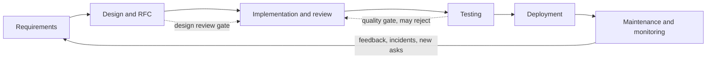

# 1. SDLC, Agile, Estimation & Delivery

> **TL;DR:** Software delivery is a system. Agile reduces feedback loops; estimation techniques reduce commitment risk; technical debt is managed debt, not avoided debt. DORA metrics measure delivery health.

**Interview weight:** P1 — leads are expected to talk fluently about process, prioritisation, and technical debt negotiation.

---

## SDLC Phases

- **Requirements** — what to build; stakeholders, acceptance criteria, non-functional requirements.
- **Design** — architecture, data model, API contracts, risk assessment.
- **Implementation** — coding, unit tests, code review.
- **Testing** — integration, E2E, performance, security testing.
- **Deployment** — release strategy, rollback plan, feature flags.
- **Maintenance** — monitoring, incidents, bug fixes, tech debt paydown.

---

## Process Comparison

| Aspect | Waterfall | Agile (Scrum) | Kanban | SAFe |
| ------ | --------- | ------------- | ------ | ---- |
| Feedback cycle | Months (end of project) | Weeks (per sprint) | Continuous | Program increment (8–12 weeks) |
| Change tolerance | Low | High | High | Medium |
| Planning horizon | Full project upfront | Sprint + quarterly | Just-in-time | PI planning |
| Best fit | Fixed-scope, regulated (construction, compliance) | Product teams, SaaS | Ops/support, continuous flow | Large-scale multi-team coordination |
| Pitfall | Late feedback → wrong product | Sprint theatre without real agility | No prioritisation discipline | Heavy ceremony overhead |

---

## Scrum Roles, Artifacts & Ceremonies

| Element | What it is | Timebox |
| ------- | ---------- | ------- |
| **Product Owner** | Owns backlog priority; voice of the customer | — |
| **Scrum Master** | Removes blockers; guards process | — |
| **Dev Team** | Self-organising; 3–9 people | — |
| **Product Backlog** | Ordered list of all work; PO owns | — |
| **Sprint Backlog** | Items committed for current sprint | — |
| **Increment** | Potentially shippable product each sprint | — |
| **Sprint Planning** | Select + plan sprint backlog | ≤ 4 h (2-week sprint) |
| **Daily Scrum** | Sync on progress, blockers | 15 min |
| **Sprint Review** | Demo to stakeholders; inspect increment | ≤ 2 h |
| **Sprint Retrospective** | Inspect process; agree improvements | ≤ 1.5 h |
| **Backlog Refinement** | Break down + estimate future items | 1–2 h/week |

---

## User Stories + INVEST + DoD / DoR

**INVEST criteria:**
- **I**ndependent — can be delivered without another story.
- **N**egotiable — scope is a conversation, not a contract.
- **V**aluable — delivers value to the user.
- **E**stimable — team can size it.
- **S**mall — fits in one sprint.
- **T**estable — clear acceptance criteria exist.

**Definition of Ready (DoR):** story has clear acceptance criteria, is INVEST-compliant, dependencies identified, sized by team.

**Definition of Done (DoD):** code reviewed, unit tests passing, integration tests passing, deployed to staging, observability added, docs updated.

---

## Estimation Techniques

| Technique | Unit | How | Best for |
| --------- | ---- | --- | -------- |
| **Story Points** | Abstract complexity | Fibonacci (1,2,3,5,8,13); relative sizing | Scrum; compares complexity, not time |
| **T-Shirt sizing** | XS/S/M/L/XL | Group consensus | Early backlog, epics |
| **Ideal Days** | Person-days | Time with no interruptions | Waterfall-adjacent; anchors to calendar |
| **#NoEstimates** | None | Track cycle time instead; forecast with statistics | High-trust, mature teams with stable process |
| **Planning Poker** | Story points | Each member votes privately; reveal together; discuss divergence | Reduces anchoring bias in group |

- **Velocity** — team's average story points per sprint. Not a productivity metric; never compare across teams; changes with team composition.
- **Cone of uncertainty** — estimate confidence is ±400% at project start; narrows as design is clarified. Never commit a single-point estimate at concept stage.
- **Reference stories** — anchor future estimates to a "3 = add a read-only endpoint with auth" baseline.

---

## Breaking Down Epics

- Slice vertically (full working increment through all layers) not horizontally (front-end layer only).
- Each slice should be independently deployable.
- Techniques: SPIDR (Spike, Paths, Interfaces, Data, Rules) — identify dimensions of variability, pick the thinnest useful cut.

---

## Technical Debt

**Quadrant (Cunningham / Fowler):**

| | Prudent | Reckless |
| ------- | ------- | -------- |
| **Deliberate** | "We know the trade-off; document it" | "No time for design" |
| **Inadvertent** | "We learned a better pattern after shipping" | "We didn't know what we were doing" |

Deliberate-prudent debt is the only acceptable kind; document the decision (ADR) and schedule paydown.

**How to quantify:**
- Cyclomatic complexity, code duplication ratio, mean time to onboard (proxy for code clarity).
- SonarQube technical debt index (hours-to-fix estimate).
- Production incident count linked to a system area.

**Negotiating with product:**
- Frame as risk and cost: "Every new feature in this module takes 3x longer than it should."
- Quantify the slowdown: "We spent 40% of last quarter's cycle time on bug fixes in this service."
- Propose a budget: "Dedicate 20% of sprint capacity to debt reduction" (boy-scout rule = leave it better than you found it).
- Dedicated capacity vs continuous improvement — dedicated sprints create clear accountability; continuous improvement (20%) keeps the team engaged without blocking features.

---

## Prioritisation Frameworks

| Framework | Formula / Method | Best for |
| --------- | ---------------- | -------- |
| **RICE** | (Reach × Impact × Confidence) / Effort | Product features with customer data |
| **MoSCoW** | Must / Should / Could / Won't | Release scoping with stakeholders |
| **WSJF** | Cost of Delay / Job Duration | SAFe; compares relative urgency |
| **Cost of Delay** | Revenue lost or cost incurred per week of delay | Executive conversations |

---

## RFC / Design Doc Process

- Write a brief RFC before starting any work estimated > 5 days or involving cross-team impact.
- RFC includes: problem statement, proposed solution, alternatives, trade-offs, risks, rollout plan.
- Review asynchronously (48 h comment window); aim for "consent" not "consensus."
- Approved RFC becomes the contract; deviations during impl trigger a revision.

---

## DORA Metrics + Flow Metrics

| Metric | What it measures |
| ------ | --------------- |
| **Deployment Frequency** | Delivery speed |
| **Lead Time for Changes** | Efficiency of the value stream |
| **Change Failure Rate** | Quality and testing effectiveness |
| **MTTR** | Recovery capability and observability |
| **Flow Efficiency** | Active work time / total cycle time (Lean) |
| **WIP** | Number of items in progress (Kanban health) |

See [03-CI-CD-and-Release-Strategies](../11-Cloud-DevOps-Azure/03-CI-CD-and-Release-Strategies.md) for DORA thresholds.

---

## Trade-offs & When to Use

- **Scrum vs Kanban** — Scrum for product teams shipping features with a defined backlog; Kanban for operations or support where work arrives continuously and predictably.
- **Story points vs cycle time** — story points require calibration and are team-specific; cycle time is objective and correlates better with delivery predictability for mature teams.
- **Dedicated debt sprints vs 20% budget** — dedicated sprints create clarity but stop feature work entirely (PM pressure); 20% budget is sustainable but can be deprioritised under pressure. Combine: 20% ongoing + a dedicated sprint per quarter for major refactoring.

---

## Common Pitfalls

- Velocity used as a productivity KPI across teams → gaming (inflate estimates) and demoralisation.
- DoD without observability: "deployed to production" is not done until monitoring is in place.
- Accepting technical debt without recording it (ADR or backlog item) → invisible debt accumulates silently.
- Sprinting on undefined stories → scope creep mid-sprint → incomplete increment → fake velocity.
- Planning poker without reference stories → wild variance, meaningless points.

---

## Interview Questions

**Q1. What is the difference between velocity and throughput, and why shouldn't you compare velocity across teams?**
A: Velocity = story points completed per sprint; throughput = items completed per time unit. Story points are relative to the team's own calibration; two teams giving the same story a different point value will have different velocities for identical work. Comparing across teams punishes teams that size conservatively and rewards inflation. Use velocity only to forecast within the same team over time.

**Q2. What is the cone of uncertainty and how does it affect estimation commitment?**
A: At project start, estimate variance is ±400%; it narrows as design is clarified, prototypes built, and risks reduced. Committing a fixed date at concept stage ignores this reality. The correct approach: commit to a range early, narrow it at key milestones (design approved, spiked, first iteration done). Never give a single-point estimate early; give a range with explicit confidence level.

**Q3. Explain the technical debt quadrant and which type is acceptable.**
A: Two axes: deliberate vs inadvertent (did you know you were taking debt?) and prudent vs reckless (was it a good trade-off?). Only deliberate-prudent is acceptable: "we know this design isn't ideal; we'll revisit after launch; here's the ADR." Reckless debt — whether deliberate or not — creates maintenance burdens and should be avoided or rapidly paid down.

**Q4. How do you negotiate paying down technical debt with a product manager who only cares about features?**
A: Translate debt into product language. "The payment system has 200% cyclomatic complexity. New features there take 3x longer than equivalent code elsewhere. Last quarter we spent 8 sprints fixing bugs there. At our current velocity, the next feature will take 6 sprints instead of 2 if we don't address it." This frames debt as a tax on feature velocity, not a developer preference. Propose a specific budget (e.g. 2 sprints now = 4 sprints saved over the next quarter) with a measurable outcome.

**Q5. What is WSJF and when is it more useful than simple priority ordering?**
A: Weighted Shortest Job First = Cost of Delay / Job Duration. It answers: "what is the relative urgency and value of this work per unit of effort?" A small high-urgency item beats a large medium-urgency one. Useful when comparing work items of very different sizes and urgency. Simple priority ("rank 1-5") ignores the effort dimension — you might do a low-value large item over a high-value tiny one.

**Q6. You're leading a team of 4 engineers with 3 weeks to a major release. Scope grows mid-sprint. What do you do?**
A: 1) Immediately surface to stakeholders — new scope means either reduced scope elsewhere, extended timeline, or more resources (pick one; no free lunch). 2) Bring PO into a backlog prioritisation session; apply MoSCoW to the combined list. 3) Identify MVP for the release date; move "Should" and "Could" items to the next sprint. 4) Document the trade-off decision. 5) Update the team's sprint backlog; don't just stack on top. Scope creep accepted silently kills quality and morale.

**Q7. How do you run an effective retrospective that leads to actual change?**
A: Use a structured format (Start/Stop/Continue or 4Ls). Time-box to 60 min. Focus on one or two high-impact items instead of listing 20. Every action item gets an owner and a due date (in next sprint). Start next retro by reviewing whether last sprint's actions were completed — this creates accountability. The Scrum Master owns facilitating; the team owns the actions. Rotate facilitation to build ownership.

**Q8. What DORA metric would you improve first if your team has high deployment frequency but 20% change failure rate?**
A: Change failure rate — high frequency with 20% CFR means 1 in 5 deploys breaks something; you're shipping problems faster than you're fixing them. Root cause: likely insufficient test coverage, missing integration tests, or weak staging environment parity with prod. Fix: add integration tests for critical paths, enforce coverage gates in CI, improve staging fidelity, add automated rollback triggers. Reducing CFR also directly improves MTTR (fewer incidents = faster recovery).

**Q9. (Senior) How do you handle ambiguous requirements on a cross-team project with 5 partner organisations?**
A: 1) Don't start coding on ambiguity — spike and clarify first. 2) Write a problem statement + assumptions document; share with all stakeholders for async comment. 3) Identify the decision owner (RACI); ambiguity often persists because no one has clearly been assigned to decide. 4) Time-box the clarification: "We'll start design in 5 business days; unresolved questions become explicit assumptions." 5) Document decisions and disseminate broadly; "no one told me" is not acceptable with 5 partner orgs. This is how the Publisher News Feed Platform ran: RFC process with a 48-hour async comment window before build started.

**Q10. (Leadership) A sprint review reveals the team shipped 40% of committed stories. How do you diagnose and fix this?**
A: Don't blame the team first. Diagnose: was this a capacity issue (unplanned leave, incidents), a scope issue (stories were larger than estimated), a quality issue (rework), or a dependency issue (blocked by another team)? Track the root cause over 2–3 sprints before concluding. Typical fixes: better story breakdown in refinement, explicit capacity planning in sprint planning (subtract interrupt time), surface blockers in daily standup rather than discovering them at review. If the team is consistently at 40%, the SLO targets or roadmap commitments need recalibration — not more pressure.

---

## Quick Recap

- Agile reduces feedback loops; Scrum = sprints + inspect + adapt; Kanban = continuous flow.
- INVEST: stories must be Independent, Negotiable, Valuable, Estimable, Small, Testable.
- Velocity forecasts sprints for the same team; never compare across teams; never use as productivity KPI.
- Cone of uncertainty: ±400% at project start; give ranges, not single-point estimates early.
- Technical debt quadrant: only deliberate-prudent is acceptable; document it, schedule paydown.
- Negotiate debt with product via cost-of-delay framing: translate complexity to feature-velocity tax.
- RICE/WSJF for data-driven prioritisation; MoSCoW for release scope conversations.
- DORA: Deployment Frequency, Lead Time, Change Failure Rate (target < 5%), MTTR (< 1 hour).
