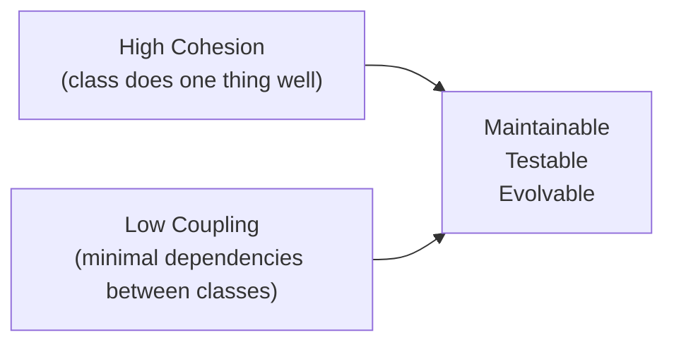

# 2. Clean Code, Refactoring & Maintainability

> **TL;DR:** Clean code is code the next engineer (or you in 6 months) can read, understand, and safely change. Naming, small functions, and no surprises are the core. Refactoring is changing structure without changing behaviour — always with a test safety net.

**Interview weight:** P1 — code quality and refactoring are probed in code reviews, machine coding rounds, and tech lead design discussions.

---

## Core Principles (Cheat Sheet)

- **Naming** — reveal intent: `GetActiveSubscriptions()` not `getData()`. Avoid abbreviations. Classes = nouns, methods = verbs.
- **Functions** — do one thing, one level of abstraction. Max ~20 lines. No side effects unless the name says so (`SaveUser`, not `GetUser` that also writes a log).
- **Arguments** — ≤ 3 preferred; >3 → introduce a parameter object. Avoid boolean flag parameters (split into two methods instead).
- **Error handling** — prefer exceptions over error codes; don't swallow exceptions; log at the boundary.
- **Comments** — explain *why*, never *what*. Code should be readable enough that comments on *what* are unnecessary. Legal comments and TODOs are acceptable; commented-out code is not.
- **DRY** — Don't Repeat Yourself; but don't abstract prematurely (wrong DRY creates coupling).
- **YAGNI** — You Ain't Gonna Need It; don't build for imagined future requirements.
- **KISS** — Keep It Simple; complexity is a liability.

---

## Code Smells Catalogue

| Smell | Description | Refactoring fix |
| ----- | ----------- | --------------- |
| **Long Method** | Method > 20–30 lines; multiple responsibilities | Extract Method |
| **Large Class** | Class > 300 lines; multiple responsibilities | Extract Class, Move Method |
| **Feature Envy** | Method uses another class's data more than its own | Move Method to the class it envies |
| **Data Clumps** | 3+ fields always passed together | Introduce Parameter Object / Value Object |
| **Primitive Obsession** | Strings/ints for domain concepts (e.g. `string emailAddress`) | Replace Primitive with Object / Value Object |
| **Shotgun Surgery** | One change requires edits in many classes | Move Method/Field to consolidate |
| **Divergent Change** | One class changed for many different reasons | Extract Class per reason |
| **Speculative Generality** | Unused abstract hooks "for future use" | Remove dead code (YAGNI) |
| **Dead Code** | Unreachable code, unused parameters | Remove |
| **Magic Numbers** | `if (status == 4)` | Replace with named constant or enum |
| **Deep Nesting** | 3+ levels of `if`/`for` nesting | Guard clauses, Extract Method |
| **Boolean Parameters** | `Send(true)` — what does `true` mean? | Split into separate methods |

---

## Refactoring Catalogue — C# Examples

### Extract Method
```csharp
// Before
void PrintOrder(Order o) {
    Console.WriteLine($"Order: {o.Id}");
    double total = o.Lines.Sum(l => l.Price * l.Qty) * (1 - o.Discount);
    Console.WriteLine($"Total: {total:C}");
}

// After
void PrintOrder(Order o) {
    Console.WriteLine($"Order: {o.Id}");
    Console.WriteLine($"Total: {CalculateTotal(o):C}");
}
double CalculateTotal(Order o) =>
    o.Lines.Sum(l => l.Price * l.Qty) * (1 - o.Discount);
```

### Guard Clauses (Replace Nested Conditionals)
```csharp
// Before
double GetDiscount(Customer c) {
    if (c != null) {
        if (c.IsActive) {
            if (c.IsPremium) return 0.20;
            else return 0.05;
        }
    }
    return 0;
}

// After
double GetDiscount(Customer c) {
    if (c is null) return 0;
    if (!c.IsActive) return 0;
    return c.IsPremium ? 0.20 : 0.05;
}
```

### Introduce Parameter Object
```csharp
// Before
void Search(string city, string category, int minPrice, int maxPrice) { ... }

// After
record SearchCriteria(string City, string Category, int MinPrice, int MaxPrice);
void Search(SearchCriteria criteria) { ... }
```

### Replace Conditional with Polymorphism
```csharp
// Before
decimal CalculatePay(Employee e) => e.Type switch {
    "hourly"   => e.HoursWorked * e.HourlyRate,
    "salaried" => e.MonthlySalary,
    _          => throw new InvalidOperationException()
};

// After
abstract class Employee { public abstract decimal CalculatePay(); }
class HourlyEmployee : Employee {
    public override decimal CalculatePay() => HoursWorked * HourlyRate;
}
class SalariedEmployee : Employee {
    public override decimal CalculatePay() => MonthlySalary;
}
```

### Replace Temp with Query
```csharp
// Before
var basePrice = qty * itemPrice;
if (basePrice > 1000) ApplyDiscount();

// After
if (BasePrice() > 1000) ApplyDiscount();
double BasePrice() => qty * itemPrice;
```

---

## Coupling and Cohesion



**Cohesion types (high → low):**
- **Functional** — all elements contribute to a single well-defined task (best).
- **Sequential** — output of one feeds input of next.
- **Communicational** — operate on the same data.
- **Logical** — grouped by category, not purpose (e.g. `Utils` class — avoid).
- **Coincidental** — random grouping (worst).

**Coupling types (loose → tight):**

| Type | Description | Example |
| ---- | ----------- | ------- |
| **Data** | Pass only data (primitives, simple structs) | Method parameters |
| **Stamp** | Pass an object but use only part of it | Pass `Order` but only use `Order.Id` |
| **Control** | Pass a flag that controls behaviour | Boolean parameter anti-pattern |
| **Common** | Share global state | Static singletons |
| **Content** | Access internals of another class | Reflection hacks, `internal` misuse |

Target: Data coupling; avoid Content/Common.

---

## Cyclomatic & Cognitive Complexity

- **Cyclomatic** — count of linearly independent paths through code (1 per decision branch). > 10 = hard to test; > 15 = refactor now.
- **Cognitive** — how hard it is to understand (nested ifs add more than flat ifs). Better proxy for readability.
- Both measured by Roslyn analyzers and SonarQube.

---

## Static Analysis in .NET

```xml
<!-- .editorconfig — enforced in CI -->
[*.cs]
dotnet_analyzer_diagnostic.category-Style.severity = warning
dotnet_analyzer_diagnostic.category-Performance.severity = warning
csharp_style_expression_bodied_methods = when_on_single_line:suggestion

<!-- treat warnings as errors in csproj -->
<TreatWarningsAsErrors>true</TreatWarningsAsErrors>
```

- **Roslyn Analyzers** — built into SDK; rules for style, performance, security.
- **StyleCop** — naming/formatting rules; good for large teams.
- **SonarQube / SonarCloud** — code quality gate in CI; tracks debt, bugs, vulnerabilities.
- Set `<TreatWarningsAsErrors>true</TreatWarningsAsErrors>` to prevent silent accumulation.

---

## Legacy Code Strategies

- **Characterisation tests** — write tests that capture current (possibly wrong) behaviour before refactoring; they document what the code does.
- **Seams** — points where you can change behaviour without editing existing code (constructor injection, virtual methods, file system abstraction).
- **Strangler Fig** — build new implementation alongside old; route traffic incrementally to new; delete old when 100% migrated. See [Publisher Portal Monorepo](../16-Behavioral-and-Leadership/01-STAR-Framework-and-Story-Bank.md) for a real example.

---

## API / Library Design

- **Principle of least surprise** — behave as callers expect from the name.
- **Design for the common case** — the easy thing should be easy; the hard thing should be possible.
- Immutable types where practical — thread safety + reasoning.
- Prefer composition over inheritance for extension.
- Seal classes that aren't designed for inheritance.
- Mark extension points `virtual`; document Liskov expectations.

---

## Documentation That Stays True

- **ADR (Architecture Decision Record)** — why a decision was made, alternatives, trade-offs; lives in the repo.
- **README** — how to run, build, test, deploy; kept close to code so it stays updated.
- **XML docs** — public API surface only; one-line summary + `<param>`/`<returns>`; don't document implementation details.
- **Diagrams as code** — Mermaid in Markdown; versioned with code; never detach into a separate tool.
- Avoid long inline comments explaining *what* — if the code needs explanation, rename or extract.

---

## Trade-offs & When to Use

- **Refactor vs rewrite** — refactor when the logic is worth preserving and tests exist; rewrite only when the architecture is fundamentally broken and the old code has no test coverage. Rewrites almost always take longer than estimated and often re-introduce bugs.
- **Extract Method vs Extract Class** — extract method when complexity is high but the class has one clear responsibility; extract class when the method group represents a distinct concept.
- **Polymorphism vs switch** — polymorphism when the type set is stable and behaviour varies significantly; switch when the type set is small or behaviour is trivial.

---

## Common Pitfalls

- Premature abstraction — creating interfaces for things that only have one implementation (YAGNI), which adds navigation overhead with no benefit.
- Refactoring without a test safety net — changing behaviour while thinking you're changing structure.
- Comments explaining *what* the code does — code should be readable enough to not need them.
- `Utils` / `Helpers` / `Manager` class names — vague names that attract unrelated code and violate cohesion.
- Inheriting from concrete classes for code reuse — creates tight coupling; prefer composition.

---

## Interview Questions

**Q1. What is the difference between cohesion and coupling, and what is the desired combination?**
A: Cohesion measures how related the elements within a module are; high cohesion = module does one thing well. Coupling measures interdependency between modules; low coupling = changes in one module minimally affect others. Goal: high cohesion + low coupling. They're complementary — a well-designed class has clear purpose (high cohesion) and communicates via clean interfaces (low coupling).

**Q2. You have a 500-line method. How do you refactor it safely?**
A: 1) Write characterisation tests that cover its observable behaviour before touching anything. 2) Identify responsibility groups within the method (comments often reveal them). 3) Extract Method on each group with a descriptive name. 4) If groups have shared state, extract a class. 5) Run tests after each extraction — never let them go red for more than a few seconds. 6) Repeat until each method is 10–20 lines with a single clear purpose.

**Q3. What is the Strangler Fig pattern and when would you use it?**
A: Gradually replace a legacy system by building new functionality alongside old, routing new traffic to the new implementation, and deleting the old code when it's fully replaced. Use when the legacy system is too risky to rewrite wholesale: the old code keeps working; the new code is proven on real traffic incrementally. Applies to microservice extraction from a monolith, new API versions, or database migration.

**Q4. What are guard clauses and how do they improve readability?**
A: Guard clauses exit early at the top of a function when preconditions are violated, eliminating the main "happy path" nesting. Instead of `if (valid) { if (user != null) { ... } }`, you write `if (!valid) return; if (user is null) throw; ...happy path...`. This reduces nesting, keeps the important logic at the left margin, and makes preconditions explicit.

**Q5. When is a boolean parameter a code smell, and what's the fix?**
A: `Send(true)` — the caller can't know what `true` means without reading the implementation. It forces the method to have two behaviours (flag-based branching), violating single responsibility. Fix: split into `SendImmediate()` and `SendQueued()`, or use an enum (`SendMode.Immediate`, `SendMode.Queued`).

**Q6. How do you decide between Extract Method and Extract Class during a refactoring?**
A: Extract Method when you can name a group of lines with a single clear verb phrase and the class still has one responsibility. Extract Class when a group of methods and fields could stand alone as a coherent concept with its own name (noun). Heuristic: if the extracted class is just "the missing parameter object" or "the missing value type," extract class; if it's a named computation, extract method.

**Q7. What is cyclomatic complexity and at what threshold should you act?**
A: Number of linearly independent paths through a method; 1 per binary decision. > 10 means testing all paths requires ≥ 10 test cases — hard to maintain. > 15 is a refactoring trigger. Measure with `dotnet-counters` or SonarQube. Fix: extract methods, introduce guard clauses, replace nested conditionals with polymorphism.

**Q8. How do you handle a team member who writes complex "clever" code that others can't read?**
A: Address in code review — cite readability and the maintenance cost: "This will be read 10x more than it was written; can we simplify?" If it recurs, discuss in 1:1 framing it as impact on team velocity, not criticism of intelligence. Set team norms explicitly: cognitive complexity thresholds in SonarQube quality gate, pair programming to align on idioms. Clever code is a liability when the author is unavailable.

**Q9. (Senior) You inherit a codebase with 60% code duplication, no tests, and multiple `static` God classes. What's your plan?**
A: 1) Freeze new feature work on the worst areas; triage risk first. 2) Identify the highest-risk God class (most PRs, most bug source). 3) Write characterisation tests using the Approval Tests pattern — capture current output as the baseline. 4) Introduce seams (dependency injection, interfaces) without changing behaviour. 5) Extract responsibilities into cohesive classes. 6) Gradually add unit tests as you extract. 7) Track complexity metrics week-over-week to show progress to stakeholders. This is a 3–6 month track, not a sprint.

**Q10. (Senior) How do you prevent the quality gate from becoming a bureaucratic bottleneck?**
A: Automate everything that can be automated: formatters run in CI (dotnet-format), Roslyn analyzers are errors not warnings, SonarQube quality gate blocks merge on new issues. What's left for humans in code review is design, correctness, and knowledge sharing — not style. The gate should be fast (< 2 min for analysis), actionable (each failure links to the rule explanation), and fixable (not impossible thresholds). If the gate is slowing teams, the fix is better tooling, not a lower bar.

---

## Quick Recap

- Clean code: reveal intent in names; functions do one thing; no boolean parameters; no side effects without naming them.
- Code smells are vocabulary for discussions: name the smell, cite the refactoring.
- Guard clauses eliminate nesting; extract method reduces complexity; replace conditional with polymorphism removes type-switch chains.
- High cohesion + low coupling = maintainable and testable code.
- Cyclomatic > 10 = hard to test; cognitive complexity > 15 = hard to read — both are SonarQube gates.
- Never refactor without a test safety net (characterisation tests for legacy code).
- Strangler Fig = safe incremental replacement of legacy systems.
- Comments should explain *why*, not *what*; code should be its own documentation.
