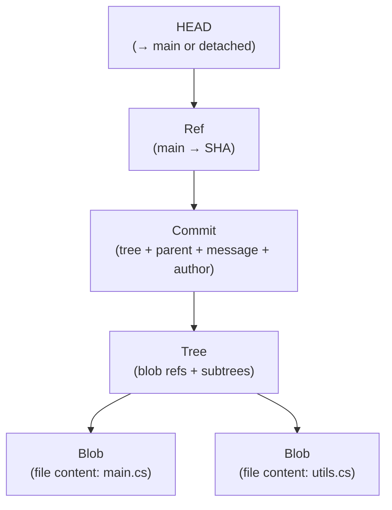
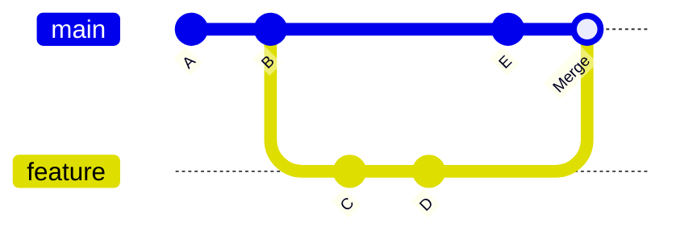
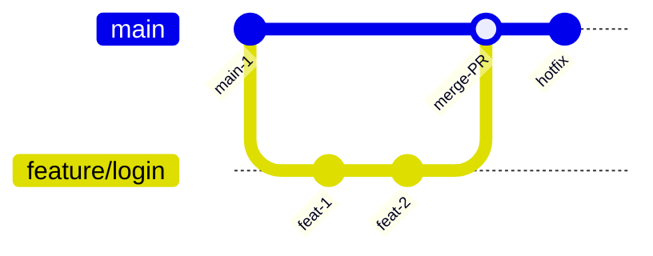

# 3. Git, Branching, Merging & Workflows

> **TL;DR:** Git stores snapshots, not diffs. Every object is content-addressed. The three trees (working dir, index, HEAD) model explains every command. Prefer merge for public branches, rebase for local cleanup.

**Interview weight:** P1 — Git internals and workflow trade-offs are frequent senior-level questions; "reset vs revert" is a classic.

---

## Git Object Model



- **Blob** — raw file content; content-addressed by SHA-1.
- **Tree** — directory listing; maps filenames to blob/tree SHAs.
- **Commit** — points to a tree + parent commit(s) + metadata.
- **Ref** — named pointer to a commit SHA (`main`, `feature/x`, tags).
- **HEAD** — pointer to current branch ref or a specific commit (detached).
- **Index / staging area** — proposed next commit; sits between working dir and commits.

---

## The Three Trees

| Tree | What it is | How commands affect it |
| ---- | ---------- | ---------------------- |
| **Working directory** | Files on disk | Edits, `git checkout -- <file>` restores |
| **Index (staging)** | Proposed next commit | `git add` stages; `git restore --staged` unstages |
| **HEAD** | Last commit on current branch | `git commit` advances HEAD; `git reset` moves HEAD |

---

## Merge vs Rebase vs Squash vs Fast-Forward



| Aspect | Merge | Rebase | Squash merge | Fast-forward |
| ------ | ----- | ------ | ------------ | ------------ |
| History shape | True history; merge commit | Linear; rewrites feature commits | Linear; single commit on base | Linear; no merge commit |
| Safety on shared branch | Safe | **Never rebase shared branches** | Safe | Safe (if no divergence) |
| Commit identity | Preserved | New SHAs created | Loses individual commits | Preserved |
| When to use | Merging feature → main (preserves context) | Cleaning up local commits before PR | Squashing a small feature to one commit | Fast-forwarding release tag |
| Bisect-friendly? | Yes | Yes | Partially (fewer commits to bisect) | Yes |

**Interactive rebase (`git rebase -i HEAD~n`):**
- `pick`, `squash`, `fixup`, `reword`, `drop` — reshape local commit history before opening a PR.
- `--autosquash` with `fixup!` commit messages auto-squashes during rebase.

---

## Cherry-Pick

```bash
git cherry-pick <sha>     # apply a specific commit to current branch
git cherry-pick A..B      # apply range (exclusive A, inclusive B)
```

- Creates a new commit with the same change but a different SHA — can cause **duplicate commits** if the cherry-picked commit is later merged through normal flow.
- Use for: hotfixes applied to multiple release branches; avoid for features (use merge/rebase instead).

---

## Reset vs Revert vs Restore vs Checkout vs Switch

| Command | What it moves | Modifies working dir? | Modifies index? | Safe on shared branches? |
| ------- | ------------- | --------------------- | --------------- | ------------------------ |
| `git reset --soft <ref>` | HEAD only | No | No | No (rewrites history) |
| `git reset --mixed <ref>` | HEAD + index | No | Yes | No |
| `git reset --hard <ref>` | HEAD + index + working dir | **Yes (destructive)** | Yes | No |
| `git revert <sha>` | Creates new commit that undoes | No | No | **Yes** — adds a commit |
| `git restore <file>` | Working dir from index | Yes | No | Yes (local only) |
| `git restore --staged <file>` | Index from HEAD | No | Yes | Yes (local only) |
| `git checkout <branch>` | HEAD + index + working dir | Yes | Yes | Yes (switches branch) |
| `git switch <branch>` | HEAD + index + working dir | Yes | Yes | Yes (explicit intent) |

**Key rule:** `revert` to undo a public commit; `reset` only on local/private commits.

---

## `git reflog` — The Undo Button

```bash
git reflog               # shows every move of HEAD in last 90 days
git reset --hard HEAD@{3}  # return to 3 moves ago
```

- Reflog entries survive `reset --hard`, branch deletion, and amends.
- Window: 90 days by default; use to recover "lost" commits.

---

## Conflict Resolution and `rerere`

```bash
git config rerere.enabled true  # enable reuse recorded resolution
```

- `rerere` (Reuse Recorded Resolution) — records conflict resolutions; re-applies them automatically next time the same conflict appears (useful during long-running rebases or repeated cherry-picks).
- Conflict workflow: `git status` → edit file → remove `<<<<`/`====`/`>>>>` markers → `git add` resolved files → `git commit` (merge) or `git rebase --continue`.

---

## `git bisect`

```bash
git bisect start
git bisect bad HEAD          # current commit is broken
git bisect good v1.2.0       # known good commit
# Git checks out midpoint; test; mark good or bad until culprit found
git bisect good/bad
git bisect reset             # return to HEAD
```

- Binary search through commit history to find the commit that introduced a regression.
- Pair with an automated test: `git bisect run dotnet test --filter "Category=Regression"`.

---

## Tags and Semantic Versioning

```bash
git tag -a v1.4.2 -m "Release 1.4.2"   # annotated tag (preferred)
git push origin v1.4.2
```

- Tags are immutable refs pointing to a commit.
- Follow semver: `MAJOR.MINOR.PATCH`; MAJOR = breaking change; MINOR = new feature; PATCH = bugfix.
- Use annotated tags (not lightweight) in CI for release marking — they carry metadata.

---

## Submodules vs Subtrees vs Monorepo

| Approach | How | Pros | Cons |
| -------- | --- | ---- | ---- |
| **Submodule** | Pointer to a commit in another repo | Hard separation, independent versioning | Complex: must `git submodule update`; easy to get out of sync |
| **Subtree** | Copy of another repo's history merged in | Simple clone; all code in one repo | History interleaved; updates require `git subtree pull` |
| **Monorepo** | All projects in one repo | Single workflow; easy cross-project refactoring; unified CI | Requires tooling (Nx, Turborepo, Bazel) for partial builds; large clone |

---

## Branching Workflows



| Workflow | Branches | Hotfix path | Best for |
| -------- | -------- | ----------- | -------- |
| **Trunk-based** | `main` + short-lived feature branches (<1 day) | Commit to main, tag, deploy | High cadence, feature-flag discipline |
| **GitHub Flow** | `main` + feature branches | PR hotfix branch → main | Web apps, SaaS, 5–30 engineers |
| **GitFlow** | `main`, `develop`, `release/*`, `hotfix/*`, `feature/*` | `hotfix/*` → `main` + `develop` | Scheduled releases, multiple versions |
| **Release branches** | `main` + `release/x.y` | Cherry-pick to release branch | Regulated, long-term support releases |

---

## PR Hygiene and Conventional Commits

```
feat(auth): add refresh token rotation

Implements RFC-47: rotate refresh tokens on each use to mitigate theft.
Adds cleanup job for expired tokens.

Closes #234
```

- **Conventional commits** format: `type(scope): summary` — enables automatic changelog and semver bumping.
- Types: `feat`, `fix`, `docs`, `refactor`, `test`, `chore`, `perf`, `ci`.
- **Small PRs** — < 400 lines changed; easier to review, faster to merge, smaller blast radius.
- **Draft PRs** — signal work-in-progress; get early design feedback without blocking reviewers.
- **Stacked PRs** — break a large feature into a chain of dependent PRs; each adds reviewable increments.

---

## Keeping Secrets Out of History

```bash
# Purge a file from all history (use filter-repo — BFG is deprecated)
pip install git-filter-repo
git filter-repo --path secrets.json --invert-paths

# After purge: force-push to remote (destructive; coordinate with team)
git push --force-with-lease origin main

# ALWAYS rotate the leaked secret after purge
```

- `git filter-repo` is the official replacement for BFG and `filter-branch`.
- After any purge: **rotate the secret immediately** — assume it was already seen.
- Prevent recurrence: pre-commit hooks (truffleHog, `detect-secrets`), GitHub Advanced Security secret scanning.

---

## Situation → Exact Git Command

| Situation | Command |
| --------- | ------- |
| Undo last commit, keep changes staged | `git reset --soft HEAD~1` |
| Undo last commit, keep changes unstaged | `git reset --mixed HEAD~1` |
| Discard all local changes (dangerous) | `git reset --hard HEAD` |
| Undo a pushed commit safely | `git revert <sha>` |
| Recover deleted branch | `git reflog` → `git checkout -b <branch> <sha>` |
| Move uncommitted changes to new branch | `git stash` → `git switch -c feature/x` → `git stash pop` |
| Find commit that broke a test | `git bisect start` → mark good/bad |
| Apply a single commit from another branch | `git cherry-pick <sha>` |
| Remove a file from last commit | `git reset HEAD~1` → delete file → `git commit` |
| Rename a remote branch | Delete old: `git push origin :old-name`; push new: `git push origin new-name` |
| List commits not yet on remote | `git log @{u}..HEAD` |
| See what changed between two branches | `git diff main...feature/x` |

---

## Trade-offs & When to Use

- **Merge vs rebase for feature branches** — merge preserves exact history (audit trail, bisect); rebase gives cleaner linear history. Team convention matters more than which is "right." Never rebase a branch others have checked out.
- **Squash merge vs merge commit** — squash is a clean single commit per feature (easy to revert); loses granular history. Merge commit is verbose but bisect-able per commit. Choose based on team's debugging preference.

---

## Common Pitfalls

- `git reset --hard` on a shared branch — destroys teammates' local histories.
- Forgetting `git push --force-with-lease` instead of `--force` — `--force-with-lease` fails if remote has new commits you haven't seen, preventing accidental overwrites.
- Long-lived feature branches → massive merge conflicts + stale code.
- `git rebase origin/main` on a branch others track → everyone else gets a detached HEAD.
- Committing secrets → even after deletion from HEAD they live in history until a full `filter-repo` + force-push + rotation.

---

## Interview Questions

**Q1. Explain the Git object model — what objects exist and how do they relate?**
A: Four object types: blob (file content), tree (directory listing mapping names to blob/tree SHAs), commit (points to a tree + parent commit + metadata), tag (annotated pointer to a commit). Everything is content-addressed by SHA-1. A commit's SHA changes if any content, tree, or parent changes — this gives immutability and integrity.

**Q2. What is the difference between `git reset --soft`, `--mixed`, and `--hard`?**
A: All three move HEAD to the target ref. Soft: index and working dir unchanged — staged changes ready to re-commit. Mixed (default): index reset to match HEAD — changes are unstaged; working dir unchanged. Hard: index and working dir both reset — **staged and unstaged changes are discarded**. Hard is destructive; only use on local-only commits or when you mean to throw away work.

**Q3. When should you use `git revert` instead of `git reset`?**
A: `revert` when the commit is on a shared/public branch — it creates a new commit that undoes the change; history is preserved and teammates aren't disrupted. `reset` only on local commits that haven't been pushed. Rule: "did anyone else pull this commit?" → if yes, revert; if no, reset.

**Q4. Explain merge vs rebase with examples of when each is appropriate.**
A: Merge creates a merge commit joining two branches; history shows exactly what happened and when. Rebase replays feature commits on top of the target branch, creating a linear history with new SHAs. Use merge when merging a feature branch into `main` (preserve context); use rebase to clean up local commits before opening a PR (linear history, no "fixed typo" commits). Never rebase a branch that others have checked out.

**Q5. What is `git reflog` and how would you use it to recover a deleted branch?**
A: Reflog records every move of HEAD for up to 90 days, even after branch deletion or `reset --hard`. To recover: `git reflog` → find the SHA of the last commit on the deleted branch → `git checkout -b recovered-branch <sha>`. This works because the commits still exist in the object store; reflog reveals their addresses.

**Q6. What is a cherry-pick and when does it create duplicate commits?**
A: `git cherry-pick <sha>` creates a new commit on the current branch with the same patch as the original but a different SHA (different parent). Duplicate commits occur when the cherry-picked commit is later merged through the original branch — now both appear in history with different SHAs but identical changes. Avoid by merging/rebasing instead of cherry-picking when possible; use cherry-pick primarily for hotfixes applied to multiple release branches.

**Q7. Explain the staging area (index) and why it exists.**
A: The index is the proposed next commit — a snapshot of what `git commit` will include. It lets you stage partial changes: you can edit 5 files but only `git add` 2 of them, committing a focused change while keeping the others for a separate commit. Commands like `git diff --staged` compare index to HEAD; `git diff` compares working dir to index. This enables atomic, intention-revealing commits.

**Q8. How do you purge a secret accidentally committed to a public repo?**
A: 1) **Rotate the secret immediately** — assume it's been seen. 2) Use `git filter-repo --path secrets.json --invert-paths` to remove the file from all history. 3) Force-push: `git push --force-with-lease origin --all`. 4) Notify all collaborators to re-clone (their local copies still have the old history). 5) Ask GitHub to clear cached views. Prevention: pre-commit hooks (`detect-secrets`), GitHub Advanced Security secret scanning as a CI gate.

**Q9. Compare GitFlow and trunk-based development for a team shipping multiple times per week.**
A: Trunk-based: everyone commits to `main` (or very short-lived branches < 1 day); feature flags control exposure; minimal merge conflicts; enables multiple deploys/day. GitFlow: `develop` + `feature/` + `release/` + `hotfix/` branches; designed for scheduled releases; double-merges (feature → develop → main) slow integration; more process overhead. For a team shipping daily+, GitFlow's merge overhead fights delivery speed. Trunk-based with feature flags is the modern choice; GitFlow is appropriate for monthly release trains or regulated environments requiring explicit release gates.

**Q10. (Senior) A junior engineer force-pushed to `main` and lost 3 commits. What do you do?**
A: 1) Calm the situation — this is recoverable. 2) Check `git reflog` on the junior's machine (or any machine that cloned `main` recently) to find the SHA of the last commit before the force-push. 3) `git push --force-with-lease origin <sha>:main` to restore main. 4) Verify with `git log`. 5) Root-cause: `main` was not protected. Enable branch protection: require PR reviews, disable force-push on `main`. 6) Debrief with the engineer — frame as a learning opportunity, not blame.

**Q11. What is `--force-with-lease` and why is it safer than `--force`?**
A: `--force` unconditionally overwrites the remote branch. `--force-with-lease` first checks if the remote has any commits not in your local view; if it does, it fails — someone else pushed since you last fetched. This prevents accidentally overwriting a teammate's commits when force-pushing a rebased branch. Always use `--force-with-lease` for any force-push.

**Q12. (Senior/Leadership) Your team uses GitFlow and is experiencing painful merge conflicts on long-lived feature branches. How do you fix this?**
A: Migrate to trunk-based development incrementally: 1) Introduce feature flags (Azure App Configuration) to decouple deployment from release. 2) Set a policy: no branch lives longer than 2 days without merging to main. 3) Break large features into small vertical slices (see SDLC file). 4) Add mandatory `main` rebase before PR merge to catch conflicts early. 5) Measure: track merge conflict frequency and time spent resolving before and after. Expected outcome: 70–80% reduction in integration pain within 2 sprints. The hardest part is cultural — engineers used to "ownership" of a long-lived branch need to learn to integrate continuously.

---

## Quick Recap

- Git objects: blob → tree → commit → ref → HEAD; all content-addressed by SHA.
- Three trees: working dir, index, HEAD; every command moves between them.
- `reset --soft/--mixed/--hard`: moves HEAD; soft keeps everything staged; hard discards everything.
- `revert` for public branches (safe); `reset` for local-only (destructive).
- `reflog` recovers any HEAD movement for 90 days — the undo button.
- Rebase rewrites SHAs; never rebase branches others have checked out.
- Cherry-pick creates duplicate commits when the source is later merged — use sparingly.
- Trunk-based + feature flags = modern default; GitFlow for monthly release trains.
- `--force-with-lease` not `--force`; protect `main` branch at the repo level.
