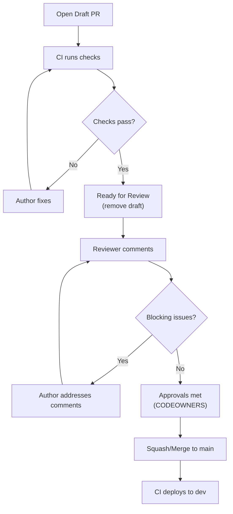

# 4. Code Review, Collaboration & Documentation

> **TL;DR:** Code review is primarily about correctness, design, and knowledge sharing — not style. Feedback should be specific, actionable, and respectful. Design docs and ADRs capture decisions; documentation types serve different audiences with different lifespans.

**Interview weight:** P1 — at senior/lead level, interviewers expect structured thinking about review culture, design doc process, and team knowledge management.

---

## Purpose of Code Review

- **Correctness** — catch logic errors, edge cases, error handling gaps.
- **Design** — verify the change fits the architecture, doesn't create coupling, is testable.
- **Knowledge sharing** — every PR is a teaching opportunity; cross-train the team.
- **Consistency** — alignment with team conventions (not style nitpicking — that's for formatters).
- **Risk reduction** — second pair of eyes on security-sensitive or backward-compatibility-breaking changes.
Code review is **not** a gating mechanism for style; automate that with formatters and analyzers.

---

## Reviewer Checklist (Priority Order)

| Priority | Area | What to check |
| -------- | ---- | ------------- |
| P0 | **Correctness** | Logic errors, off-by-one, null derefs, race conditions |
| P0 | **Security** | Injection, auth bypass, unvalidated input, exposed secrets |
| P0 | **Error handling** | Exceptions caught/propagated correctly; no silent swallows |
| P1 | **Concurrency** | Shared state access, locks, `async`/`await` misuse (`async void`) |
| P1 | **Performance** | N+1 queries, unbounded allocation, synchronous I/O on hot path |
| P1 | **Testability** | Can this be unit tested? Are there tests? Coverage of branches |
| P2 | **Readability** | Names, function size, comments (only where needed) |
| P2 | **Observability** | Logging added; metrics/traces instrumented; alert runbook updated |
| P2 | **Backward compatibility** | API contract preserved; schema migrations safe |
| P2 | **Migration safety** | DB migrations backward-compatible; dual-read/write if needed |

---

## Giving Feedback That Lands

- **Blocking vs non-blocking vs nit** — prefix comments explicitly:
  - `[blocking]` — must be resolved before merge.
  - `[suggestion]` — non-blocking; author's call.
  - `[nit]` — trivial style; ignore or fix as convenient; don't count against approval.
- **Ask questions** rather than assert: "What happens if `userId` is null here?" lands better than "This is wrong."
- **Praise visibly** — call out elegant solutions; normalises positive feedback.
- **Separate code from person** — "This method does two things" not "You wrote this badly."
- **Be specific** — cite line, cite the problem, suggest an alternative (or ask for one).

---

## Receiving Feedback

- Assume good intent — reviewer is trying to help, not attack.
- Respond to every comment (even if just "done" or "acknowledged, will address in follow-up").
- If you disagree: explain your reasoning; if still unresolved, escalate to a tech lead or async design discussion — don't merge contested changes silently.
- PRs are not a performance review — a PR with 20 comments is not a failure.

---

## Review SLAs and PR Size

- **PR size guideline:** < 400 lines of code changed (excluding generated code/migrations).
- Studies show defect detection drops above 400 lines; reviewers context-switch out.
- Review SLA: < 24 h first pass; < 4 h for re-reviews.
- Enforce via CODEOWNERS on critical paths: any change to `src/Payments/` requires a designated owner to review.

---

## Automated Checks That Remove Human Toil

| Check | Tool | Replaces human review of |
| ----- | ---- | ------------------------ |
| Formatting | `dotnet-format`, Prettier | Style nitpicks |
| Analyzer warnings | Roslyn, StyleCop | Naming, performance patterns |
| Test coverage | Coverlet + CI gate | "Did you test this?" |
| Security static analysis | SonarQube, Semgrep | Common vulnerability patterns |
| Secret scanning | GitHub Advanced Security | "Did you commit a key?" |
| Build / test gate | CI pipeline | "Does it compile/pass?" |

Everything on this list runs in CI and blocks merge automatically. Humans review what tools can't.

---

## Pair / Mob Programming vs Code Review

| Aspect | Code Review | Pair Programming | Mob Programming |
| ------ | ----------- | ---------------- | --------------- |
| Timing | Async, post-implementation | Synchronous, during implementation | Synchronous, whole team |
| Feedback loop | Hours to days | Immediate | Immediate |
| Knowledge spread | One reviewer learns | Both learn | All learn |
| Throughput | Higher (parallel work) | Lower (two people on one task) | Lowest (all on one task) |
| Best for | Most day-to-day work | Complex/risky features, onboarding | Architectural decisions, onboarding new tech |

---

## PR Lifecycle



---

## Architecture Review and RFC Process

- RFC written **before** implementation starts for changes estimated > 5 days or affecting multiple services.
- RFC template:
  - **Context** — problem being solved.
  - **Goals / Non-goals** — explicit scope boundary.
  - **Requirements** — functional + non-functional.
  - **Proposed design** — architecture, data model, API, sequence diagrams.
  - **Alternatives considered** — options evaluated with pros/cons.
  - **Trade-offs** — what the chosen approach sacrifices.
  - **Risks** — migration risk, rollback, unknown unknowns.
  - **Rollout plan** — phased steps, feature flags, monitoring.
  - **Open questions** — what still needs a decision.
- Review meeting: 30–45 min; author presents; async comments allowed for 48 h before finalisation.
- Approval = consent (no blocking objections), not unanimous enthusiasm.

---

## ADRs (Architecture Decision Records)

**Format:**

```markdown
# ADR-042: Use Redis for session caching instead of in-memory

**Date:** 2024-02-15
**Status:** Accepted
**Context:** App Service scales to 10 instances; in-memory session cache causes state loss on instance recycling.
**Decision:** Use Azure Cache for Redis as the distributed session provider.
**Consequences:** Adds Redis dependency; ~0.5 ms added latency per cache hit; eliminates sticky-session requirement.
**Alternatives considered:** SQL-backed session — too slow; sticky sessions — incompatible with zero-downtime rolling deploy.
```

- Store in `docs/adr/` in the repo; versioned with code.
- ADRs are immutable — if the decision changes, write a new ADR that supersedes the old one.
- Search by status: Proposed / Accepted / Deprecated / Superseded.

---

## Documentation Types

| Type | Audience | Lifespan | Where it lives |
| ---- | -------- | -------- | -------------- |
| **README** | New contributors; operators | Long; updated with code | Repo root / service folder |
| **Runbook** | On-call engineers | Long; updated when incidents reveal gaps | `docs/runbooks/` or wiki |
| **ADR** | Current + future architects | Permanent (immutable) | `docs/adr/` in repo |
| **API reference** | API consumers | Matches API version | OpenAPI / Swagger; auto-generated |
| **Design doc / RFC** | Reviewers, stakeholders | Until implemented or rejected | `docs/rfcs/` in repo or wiki |
| **Onboarding guide** | New team members | Long; reviewed quarterly | Wiki or `docs/onboarding/` |
| **Incident post-mortem** | Engineering + leadership | Permanent | Incident management system |

---

## Diagrams as Code

- Mermaid in Markdown — renders on GitHub, Azure DevOps wikis; version-controlled with code.
- PlantUML — more expressive (sequence, class, component); requires a server to render.
- C4 Model diagrams — use Structurizr DSL or `c4-plantuml` for architecture communication.
- Key rule: diagrams live in the same repo as the code they describe; a separate Confluence diagram goes stale.

---

## Knowledge Sharing

- **Brown bags / tech talks** — informal 30-min internal sessions; anyone can present; builds T-shaped engineers.
- **Mentoring** — pair senior engineers with juniors on meaningful work; code reviews as teaching.
- **Rotating PR review duties** — everyone reviews across the codebase, not just their own module.
- **CODEOWNERS** — defines mandatory reviewers for critical paths; also documents ownership.
- **Inner source** — treat internal repos like open source: documented contribution process, issues triaged, PRs welcomed from outside the team.

---

## Onboarding New Engineers

Good onboarding doc includes:
1. Repository layout and build instructions.
2. How to run the service locally (docker-compose or local deps).
3. Where to find ADRs and design docs.
4. Key contacts per area (CODEOWNERS as a reference).
5. First PR task: a well-scoped starter issue.
6. Who to ask when stuck (Slack channels, office hours).

---

## Working with Distributed / Cross-Org Teams

- Written RFC process compensates for lack of hallway conversations.
- Async communication norms: expected response times by priority; document decisions in writing, not just calls.
- Time zone overlap: identify a 2–3 h overlap window for synchronous decisions.
- RACI matrix for cross-team dependencies: Responsible, Accountable, Consulted, Informed.
- Demo culture: weekly or bi-weekly demos across teams; builds shared understanding and prevents surprise integrations.

---

## Trade-offs & When to Use

- **Pair programming vs code review** — pair for complex/risky changes or onboarding; async review for steady-state work. Pair programming eliminates the review queue but reduces parallelism.
- **Squash vs merge commit** — squash for a clean main history (one commit per feature, easy to revert); merge commit for preserving granular context (better bisect, audit trail per commit).
- **RFC vs just building it** — RFC when the design is reversible-but-costly or affects multiple teams; skip RFC for small, isolated changes with no cross-team impact.

---

## Common Pitfalls

- Using code review for style enforcement instead of automated tools → reviewer fatigue, inconsistent enforcement.
- No review SLA → PRs sit for days → merge conflicts, blocked teams.
- Approving without reading → rubber-stamp reviews; defeats the purpose.
- Writing an RFC but not updating it when implementation diverges → misleading historical record.
- Documentation in a separate wiki that drifts from code → stale docs are worse than no docs.
- CODEOWNERS file without actual reviews enforced → ownership in name only.

---

## Interview Questions

**Q1. What should a code reviewer focus on, and what should be automated?**
A: Reviewers focus on: correctness (logic, edge cases), security (injection, auth), design (coupling, testability), and knowledge sharing. Style, formatting, naming patterns, and obvious anti-patterns should be automated by `dotnet-format`, Roslyn analyzers, and SonarQube. If a reviewer is commenting on brace placement, the formatter is misconfigured. Automate everything you can so human reviews focus on what only humans can judge.

**Q2. How do you handle a code review where you disagree with the reviewer's comment?**
A: Respond with your reasoning clearly: "I chose X because Y; the trade-off is Z." If still unresolved, escalate to a third engineer or tech lead for a decision. Never merge a contested change over a blocking objection; never ignore a comment. Document the resolution in the PR so the decision is visible to future readers.

**Q3. What is an ADR and why should it be immutable?**
A: An Architecture Decision Record documents a significant design decision: context, decision, consequences, alternatives. It's immutable because changing history confuses future readers who need to understand why decisions were made at a specific point in time. When a decision changes, write a new ADR with status "Supersedes ADR-N." The old ADR explains the original reasoning; the new one explains what changed and why.

**Q4. When should you write an RFC before starting implementation?**
A: When the design is hard to reverse, affects multiple services, involves a security/data migration, or the team has significant uncertainty. A good threshold: estimated effort > 5 days or changes a public API contract. RFC prevents a "we built the wrong thing" discovery two weeks in, which is far more expensive than 4 hours of design discussion.

**Q5. What is the purpose of `CODEOWNERS` and how would you structure it?**
A: CODEOWNERS defines who must review changes to specific paths. It enforces ownership and routing. Structure: fine-grained entries for critical paths (`src/Payments/ @payments-team`), coarser for stable areas. Pair with branch protection rules (`require CODEOWNER review`). It also documents ownership implicitly — new engineers can look up who to ask about any part of the codebase.

**Q6. Describe your ideal PR review process for a team of 8 engineers.**
A: Small PRs (< 400 lines). CI gate before humans see it. CODEOWNERS for critical paths. 24-hour SLA for first review. Author resolves all comments before re-requesting review. Blocking/non-blocking/nit conventions in team norms doc. Squash merge to keep main history clean. Weekly: if any PR is > 3 days old, team lead pings. Monthly: review review metrics (avg time to merge, avg comments). Goal: < 24 h cycle time for 80% of PRs.

**Q7. How do you ensure documentation stays accurate over time?**
A: Keep it in the repo (not a wiki that diverges). Treat docs updates as part of Definition of Done — every PR that changes behaviour updates the relevant README, runbook, or ADR. For API docs, use OpenAPI generated from code (`[ProducesResponseType]`, Swashbuckle/NSwag) — auto-generated docs can't go stale. Diagrams as code (Mermaid in Markdown) version-controlled with the implementation. Quarterly: assign a rotation to read and validate the onboarding guide.

**Q8. What makes a design review meeting effective?**
A: Author shares the RFC doc 48 h before the meeting. Participants read async and add comments. Meeting is for resolving questions and explicit decisions, not for first reading. Time-box to 45 min. Document every decision and owner in the RFC. Close with: "approved", "approved with conditions", or "needs revision + re-review." Follow up with a summary email to all stakeholders. A bad design review meeting is one where attendees are reading the doc for the first time on the call.

**Q9. (Senior) How do you build a knowledge-sharing culture in a team where engineers hoard context?**
A: Knowledge hoarding is usually a symptom of incentives ("I'm the expert = job security") or a process failure (no time to document). Fix incentives: celebrate cross-training; include "reduced bus factor" in performance goals. Fix process: mandatory PR review rotation across modules; pair new engineers with domain experts on non-trivial tasks; make "can anyone else on call resolve this alert without paging me?" a measurable team health metric. Over time, a team's bus factor going from 1 to 3 on critical services is a visible, valuable outcome to present to leadership.

**Q10. (Senior) A post-mortem reveals that documentation for a critical service is 2 years out of date. How do you fix this systematically?**
A: 1) Immediate: assign the on-call engineer a ticket to update the runbook as their next task — post-mortems are the best forcing function for documentation accuracy. 2) Structural: add "runbook reviewed" to the DoD for any change to that service's alert/monitoring configuration. 3) Technical: if the runbook lives in a wiki, move it to the repo under `docs/runbooks/` so PRs include documentation changes. 4) Accountability: add a quarterly calendar reminder for the team lead to validate each runbook by walking through it. Documentation debt is the same as technical debt — it accumulates silently until an incident makes it visible.

**Q11. (Leadership) You inherit a team with no design docs and no ADRs. Every decision lives in people's heads. How do you introduce lightweight design documentation without it becoming bureaucratic overhead?**
A: Start small and show value. Pick the next non-trivial feature (> 5 days) and write a one-page RFC with context, decision, and trade-offs. Demo it at sprint review — explain that this is why a decision was made, not a status report. After the first three RFCs, hold a retro on the process: was it useful? Too heavy? Adjust the template. Introduce ADRs retroactively for the 3 most-asked "why did we do it this way?" questions — these have immediate practical value. The goal is: any engineer can answer "why does the system work this way?" by reading docs, not by asking a specific person.

---

## Quick Recap

- Code review order: Correctness → Security → Error handling → Concurrency → Performance → Readability.
- Use `[blocking]`, `[suggestion]`, `[nit]` prefixes; automate style; review design and correctness.
- PR SLA: < 24 h first review; PR size < 400 lines; CODEOWNERS for critical paths.
- ADRs are immutable; live in the repo; explain why, not just what.
- RFC before implementation for changes > 5 days or with cross-team impact.
- Documentation types: README (ops), ADR (architecture), runbook (on-call), API ref (consumers), onboarding guide (new engineers).
- Diagrams as code (Mermaid) in repo; auto-generated API docs (Swashbuckle); never separate wiki for code-linked docs.
- Build knowledge sharing via PR rotation, brown bags, mentoring, and measured bus-factor reduction.
