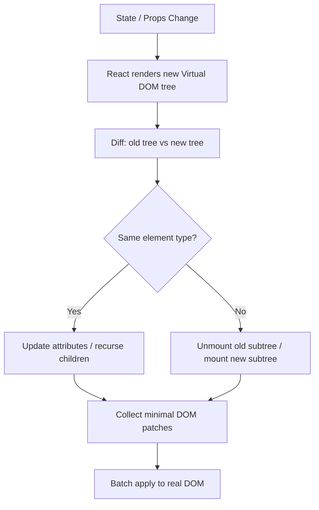

# 1. React Core and Hooks

> **TL;DR:** React is a declarative, component-based UI library. Components are functions that return JSX; React reconciles the virtual DOM diff against the real DOM. Hooks let function components manage state, side effects, and context without class boilerplate.

**Interview weight:** P2 — interviewers test breadth here; show you understand *why* things work, not just that they do.

---

## Core Concepts

- **JSX** — syntactic sugar over `React.createElement(type, props, ...children)`. Compiled by Babel/SWC. Not HTML: `className`, `htmlFor`, camelCase events.
- **Component** — pure function `(props) => JSX`. Re-renders when props or state change.
- **Props** — immutable input from parent. **State** — mutable, local, triggers re-render on change.
- **One-way data flow** — data flows down (props), events flow up (callbacks). No two-way binding by default.
- **Reconciliation** — React diffs old vs new virtual DOM tree; only patches real DOM nodes that changed.
- **Key** — hint to reconciler that an element has stable identity across renders.

---

## Function vs Class Components

| Aspect | Function Component | Class Component |
| ------ | ------------------ | --------------- |
| Syntax | `const C = (props) => <div/>` | `class C extends React.Component` |
| State | `useState` hook | `this.state` / `setState` |
| Lifecycle | `useEffect` | `componentDidMount`, `componentDidUpdate`, `componentWillUnmount` |
| Context | `useContext` | `static contextType` or `<Consumer>` |
| Error boundaries | **Cannot** (class only) | `componentDidCatch` + `getDerivedStateFromError` |
| Performance | `React.memo` | `PureComponent` |
| Preferred since | React 16.8 (2019) | Legacy; avoid for new code |

---

## Props vs State

| Aspect | Props | State |
| ------ | ----- | ----- |
| Owner | Set by parent | Owned by component itself |
| Mutability | Read-only inside component | Updated via setter (`useState`) |
| Change triggers re-render | Yes (parent re-renders and passes new props) | Yes (setter call) |
| Sharing | Pass down to children | Lift up or use context/store |

---

## Controlled vs Uncontrolled Components

| Aspect | Controlled | Uncontrolled |
| ------ | ---------- | ------------ |
| Truth | React state is the source of truth | DOM is the source of truth |
| Access | `value` + `onChange` handler | `ref.current.value` |
| Validation | Inline, on every keystroke | On submit |
| Code | More boilerplate | Less code, harder to validate |
| When to use | Forms needing live validation, derived state | Simple file inputs, quick integration |

---

## Virtual DOM and Diffing Algorithm

React maintains a lightweight in-memory tree (Virtual DOM). On state/prop change it:
1. Renders new virtual tree.
2. **Diffs** old vs new tree (O(n) heuristic, not O(n³) optimal).
3. Computes minimal patch set.
4. Applies patches to real DOM in a single batch.

**Diffing heuristics:**
- Different element types → tear down old subtree, build new.
- Same type → update attributes, recurse into children.
- **Keys** — used in lists so React maps old fiber ↔ new element by identity, not position.

### Why index-as-key is a bug
If you reorder or insert items, index keys cause React to reuse the wrong DOM node (stale input values, incorrect animations, subtle data display bugs). Use stable, unique IDs.



---

## Hooks

### `useState`

```tsx
const [count, setCount] = useState(0);
setCount(c => c + 1); // functional update — safe in async/stale closure
```

- **Batching (React 18):** multiple `setState` calls inside event handlers — and even async callbacks — are batched into one re-render automatically.
- **Stale closure trap:** referencing state inside a `useEffect` or `setTimeout` captures the value at creation time. Fix: functional update form, or add to deps array.

### `useEffect`

```tsx
useEffect(() => {
  const sub = subscribe(id);
  return () => sub.unsubscribe(); // cleanup
}, [id]); // dep array
```

- **Empty `[]`** — runs once after mount (componentDidMount equivalent).
- **No dep array** — runs after every render (almost never correct).
- **Cleanup** — returned function runs before next effect execution and on unmount.
- **Runs twice in StrictMode (dev)** — React intentionally mounts, unmounts, remounts to surface cleanup bugs. Does not happen in production.
- **Infinite loop bug:** including a value that changes *inside* the effect in the dep array → effect fires → value changes → fires again. Fix: stabilize the value (useCallback, useRef, extract outside component).
- **Effect vs event:** effects sync state with external systems; they are not event handlers. Don't put logic that should run "once in response to a user action" in effects.

### `useLayoutEffect` vs `useEffect`

| Aspect | `useLayoutEffect` | `useEffect` |
| ------ | ----------------- | ----------- |
| When fires | Synchronously after DOM mutation, before paint | Asynchronously after paint |
| Use case | Measure DOM, prevent flicker (tooltip positioning) | Data fetching, subscriptions, analytics |
| Risk | Blocks paint — can cause visible delay | Safe for most things |
| SSR | Warns on server (no DOM) | OK on server |

### `useMemo` vs `useCallback` vs `React.memo`

| API | What it memoizes | When it helps | When it's noise |
| --- | ---------------- | ------------- | --------------- |
| `useMemo` | Return value of a computation | Expensive calculation; stable object reference passed to memo'd child | Cheap calc — overhead of memo > savings |
| `useCallback` | Function reference | Stable callback passed to memo'd child or dep array | Parent re-renders rarely, or child isn't wrapped in `React.memo` |
| `React.memo` | Component render output | Pure component receiving same props (especially lists) | Component already cheap to render |

> Rule of thumb: profile first. Premature memoization adds complexity with no benefit.

### `useRef`

- **DOM ref:** `ref.current` points to a DOM element. Does not trigger re-render on change.
- **Mutable box:** store any mutable value that should survive re-renders without triggering them (e.g., interval IDs, previous value tracking).

```tsx
const inputRef = useRef<HTMLInputElement>(null);
inputRef.current?.focus();
```

### `useReducer`

- Alternative to `useState` for complex state with multiple sub-values or when next state depends on previous in non-trivial ways.
- Pattern: `(state, action) => newState`. Pairs well with Context for lightweight global state.

### `useContext`

- Reads value from nearest `<Context.Provider>` ancestor.
- Every consumer re-renders when context value changes — see splitting strategy in file 02.

### `useId`

- Generates stable, unique IDs across server and client renders (avoids SSR hydration mismatch for label/input pairing).

### `useTransition` / `useDeferredValue`

- Mark state updates as **non-urgent** so React can yield to higher-priority work (user input).
- `useTransition`: wrap the non-urgent `setState` in `startTransition`.
- `useDeferredValue`: defer re-rendering a part of the tree with a new value.
- Use for large list filtering, search-as-you-type, any update where slight visual lag is acceptable.

---

## Custom Hooks

- Extract repeated stateful logic into a `use*` function. Can call other hooks.
- Example: `useDebounce`, `useFetch`, `useLocalStorage`, `useClickOutside`.

---

## Rules of Hooks

1. Only call hooks at the **top level** (not inside loops, conditions, or nested functions).
2. Only call hooks from **React function components** or other custom hooks.

**Why:** React relies on call order to associate each hook call with its state slot. Conditional calls would shift indices and corrupt state.

---

## Error Boundaries

- Must be **class components** — no hook equivalent yet.
- Catch render errors in child subtree; render fallback UI.

```tsx
class ErrorBoundary extends React.Component {
  state = { hasError: false };
  static getDerivedStateFromError() { return { hasError: true }; }
  componentDidCatch(error: Error, info: React.ErrorInfo) { logError(error, info); }
  render() {
    return this.state.hasError ? <h2>Something went wrong.</h2> : this.props.children;
  }
}
```

---

## Other Key Concepts

- **Portals** — render children into a DOM node outside the parent component tree (`ReactDOM.createPortal`). Use for modals, tooltips, dropdowns that need to escape overflow/z-index.
- **Fragments** (`<>...</>`) — group elements without adding a DOM node.
- **Suspense** — declarative loading fallback for lazy-loaded components and async data (React 18+).

---

## React 18: Concurrent Rendering and Automatic Batching

- **Concurrent rendering** — React can interrupt, pause, and resume renders. Enables `useTransition`, `useDeferredValue`, Suspense streaming.
- **Automatic batching** — React 18 batches state updates in `setTimeout`, Promises, native event handlers (previously only React synthetic events). Fewer re-renders by default.

---

## Server Components vs Client Components (App Router — brief)

| Aspect | Server Components | Client Components |
| ------ | ----------------- | ----------------- |
| Where runs | Server only | Browser (+ hydrated on server) |
| Can use hooks | No | Yes |
| Can access DB/file system | Yes | No |
| Sent to client | HTML (no JS bundle) | JS + HTML |
| Directive | Default in App Router | `"use client"` at top |
| Use for | Data fetching, layout, static markup | Interactivity, event handlers, state |

---

## Interview Questions

**Q1. What is the Virtual DOM and why does React use it?**
A: An in-memory representation of the UI. React diffs old vs new virtual tree and applies only the changed patches to the real DOM, batching DOM mutations and avoiding repeated layout/paint cycles. The DOM is slow; JS objects are fast.

**Q2. Why can't you call hooks conditionally?**
A: React tracks hooks by call order in a linked list per fiber. Conditionally calling a hook shifts the index of subsequent hooks, corrupting state association. The linter (`eslint-plugin-react-hooks`) enforces the rules.

**Q3. What is the difference between `useEffect` and `useLayoutEffect`?**
A: `useLayoutEffect` fires synchronously after DOM mutations but before the browser paints — use it to read/write layout (measure element size, scroll position) without visible flicker. `useEffect` fires asynchronously after paint and is right for everything else (fetching, subscriptions).

**Q4. Why does `useEffect` run twice in development?**
A: React 18 StrictMode intentionally double-invokes effects (mount → unmount → remount) to surface missing cleanup functions. It's a development-only behavior designed to help catch bugs where cleanup isn't handled.

**Q5. Explain controlled vs uncontrolled components. When would you choose each?**
A: Controlled: React state drives the input `value`; you get live validation and derived state. Uncontrolled: DOM owns the value, read via `ref` on submit; less code, useful for simple forms or file inputs. React Hook Form uses uncontrolled inputs internally for performance.

**Q6. What causes stale closures in hooks and how do you fix them?**
A: A closure captures variables at creation time. If an effect or callback references `state` but doesn't list it in deps, it reads the old value. Fix: (1) add to deps array, (2) use functional update `setState(prev => ...)`, or (3) store in a `useRef` for values you need to read without re-subscribing.

**Q7. When would you use `useReducer` over `useState`?**
A: When state has multiple sub-values that change together, when next state depends on previous in complex ways, or when you want to co-locate state logic (reducer function) for testability. Also natural when state transitions mirror actions (like a state machine).

**Q8. Why is using the array index as a list key a bug?**
A: Keys tell React which fiber maps to which item across re-renders. If items are reordered or inserted, index keys cause React to reuse the wrong fiber — producing stale input values, broken animations, and incorrect conditional rendering. Use stable, unique IDs.

**Q9. Explain React 18 concurrent rendering and when you'd use `useTransition`.**
A: Concurrent mode lets React interrupt and resume renders. `useTransition` marks a state update as low-priority so React can yield to urgent updates (e.g., typing). Use it for expensive non-blocking updates: filtering a large list while keeping the input responsive.

**Q10. How do error boundaries work and why can't they be function components?**
A: Error boundaries use `getDerivedStateFromError` (static) and `componentDidCatch` — lifecycle methods that exist only on class components. There is no hook equivalent because the error-catching mechanism integrates into the fiber reconciler at the class level. Libraries like `react-error-boundary` wrap class components to give a hooks-friendly API.

**Q11. What is React Server Components? When would you use Client Components?**
A: RSC run only on the server — they can fetch data directly, have zero JS bundle weight, but cannot use hooks or browser APIs. Client Components (`"use client"`) run in the browser and handle interactivity. Rule: push as much as possible to Server Components; add `"use client"` only where you need state, effects, or event handlers.

**Q12. Compare `useMemo`, `useCallback`, and `React.memo`. What's the risk of over-using them?**
A: `useMemo` caches a computed value; `useCallback` caches a function reference; `React.memo` skips re-rendering a component if props are shallowly equal. Over-using them adds memory overhead, increases closure complexity, and can introduce bugs (stale memoized value). Profile before memoizing — React renders are often cheaper than people assume.

**Q13. (Senior) You notice a React app is slow. Walk me through your debugging process.**
A: (1) React DevTools Profiler — flame chart to find components with expensive renders or frequent unnecessary re-renders. (2) Check for missing `React.memo` on expensive pure components. (3) Check for unstable object/array/function props created inline that break memo. (4) Check for large context values causing wide re-renders. (5) Check list virtualization — are you rendering 10 K rows? (6) Bundle analysis — large chunks delaying TTI. Fix root cause, not symptoms.

**Q14. (Senior) Explain React's reconciliation heuristics and their trade-offs.**
A: React uses two heuristics: (1) different element types → full subtree replacement (O(n) instead of tree-edit distance O(n³)); (2) keys enable stable identity in lists. Trade-offs: the heuristics are wrong in edge cases (same type, different subtree intent) and keys are the developer's responsibility. The algorithm can be surprised by deep structural changes — sometimes it's better to use a `key` prop on a parent to force a fresh mount.

**Q15. (Senior) How does React Suspense and streaming SSR improve perceived performance?**
A: With streaming SSR, React sends HTML in chunks as each Suspense boundary resolves instead of waiting for the full page. The browser can start rendering and hydrating early sections while slower data fetches complete. This improves TTFB, FCP, and TTI without blocking on the slowest data source. Combined with selective hydration, React prioritizes hydrating the part the user interacted with first.

---

## Quick Recap

- JSX compiles to `React.createElement`; components are functions returning JSX.
- Virtual DOM + diffing (O(n), key-based) minimizes real DOM mutations.
- Use stable unique IDs as keys, never array index.
- `useEffect` runs after paint; `useLayoutEffect` before paint (DOM measurement).
- StrictMode double-fires effects in dev to catch missing cleanups — not a bug.
- Memoize only after profiling; stale closures are the #1 subtle bug.
- Error boundaries require class components; `useTransition` / `useDeferredValue` = concurrent features for non-urgent updates.
- RSC (Server Components) = zero JS to client, no hooks; Client Components = interactivity.
