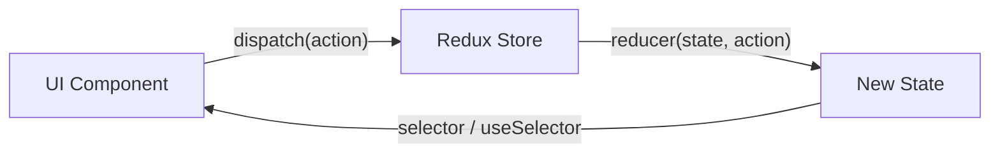

# 2. State Management, Routing and Data Fetching

> **TL;DR:** Pick the narrowest state scope that works — local state first, context for infrequent cross-tree needs, a global store for complex synchronous client state, and a server-state library (TanStack Query) for anything that lives on a server.

**Interview weight:** P2 — interviewers check whether you understand trade-offs, not whether you memorized Redux API.

---

## Core Concepts

- **Local state** — `useState`/`useReducer` inside a component. Zero cost, zero coupling.
- **Lifted state** — moved to nearest common ancestor so siblings share it. Fine until the ancestor is too far from consumers.
- **Context** — broadcast value to an arbitrary subtree. Low ceremony, but every consumer re-renders on value change.
- **Global store** — Redux/Zustand/MobX. Single source of truth for complex client-side state with derived selectors and synchronous mutations.
- **Server state** — data that lives on a server and must be fetched, cached, and synchronized. TanStack Query / RTK Query own this concern — separate it from UI state.

---

## State Scope Comparison

| Scope | API | Re-render cost | Boilerplate | When to use |
| ----- | --- | -------------- | ----------- | ----------- |
| Local | `useState` | Component only | Zero | Form fields, toggles, UI-only state |
| Lifted | `useState` in parent | Parent + all children | Zero | Sibling communication |
| Context | `createContext` + `useContext` | All consumers of that context | Low | Theme, locale, auth user, infrequently-changing global data |
| Global store | Redux Toolkit / Zustand | Subscribers of affected slice | Medium | Shopping cart, multi-step wizard, complex shared synchronous state |
| Server state | TanStack Query / RTK Query | Only components using that query | Low | Anything fetched from an API |

---

## Context API: the Re-render Problem and Fixes

- When the context `value` reference changes, **every** consumer re-renders — even if the part of the value they use didn't change.
- **Fix 1 — Split contexts:** one context for stable values (dispatch), one for changing values (state).
- **Fix 2 — Memoize the value:** `useMemo` on the context value object so reference only changes when data changes.
- **Fix 3 — Selector via `useSyncExternalStore`** or migrate to Zustand/Jotai for selector-level granularity.

```tsx
// Split context pattern
const UserStateCtx = createContext<UserState | null>(null);
const UserDispatchCtx = createContext<React.Dispatch<UserAction> | null>(null);
```

---

## Redux Toolkit

Redux Toolkit (RTK) is the official, opinionated way to write Redux. Uses **Immer** under the hood so you can write mutating-looking code safely.

### Key building blocks

- **Store** — single JS object; created with `configureStore`.
- **Slice** — combines reducer + action creators for one feature (`createSlice`).
- **Selector** — pure function `(state) => derived` — use `createSelector` (reselect) for memoized derived state.
- **`createAsyncThunk`** — generates pending/fulfilled/rejected actions around an async operation.

```tsx
// cartSlice.ts
import { createSlice, createAsyncThunk, PayloadAction } from "@reduxjs/toolkit";

export const fetchCart = createAsyncThunk("cart/fetch", async (userId: string) => {
  const res = await fetch(`/api/cart/${userId}`);
  return res.json() as Promise<CartItem[]>;
});

const cartSlice = createSlice({
  name: "cart",
  initialState: { items: [] as CartItem[], loading: false },
  reducers: {
    addItem(state, action: PayloadAction<CartItem>) {
      state.items.push(action.payload); // Immer makes this safe
    },
    removeItem(state, action: PayloadAction<string>) {
      state.items = state.items.filter(i => i.id !== action.payload);
    },
  },
  extraReducers: (builder) => {
    builder
      .addCase(fetchCart.pending, (state) => { state.loading = true; })
      .addCase(fetchCart.fulfilled, (state, action) => {
        state.items = action.payload;
        state.loading = false;
      });
  },
});

export const { addItem, removeItem } = cartSlice.actions;
export default cartSlice.reducer;
```

### Redux unidirectional data flow



---

## Global State Libraries Comparison

| Library | Model | Boilerplate | Re-render granularity | Bundle size | Best for |
| ------- | ----- | ----------- | --------------------- | ----------- | -------- |
| Redux Toolkit | Flux/reducer | Medium | Selector-level | ~13 KB | Large apps, team consistency, DevTools |
| Zustand | Imperative store | Very low | Selector-level | ~1 KB | Small-medium apps, minimal ceremony |
| Jotai | Atomic (Recoil-like) | Low | Atom-level | ~3 KB | Fine-grained subscriptions, derived atoms |
| MobX | Observable/reactive | Low-medium | Computed property level | ~16 KB | OOP style, complex derived state |
| Context | Built-in | Zero | Whole context | 0 KB | Infrequent updates, theme/auth |

---

## Server State: TanStack Query

```tsx
// query
const { data, isLoading, error } = useQuery({
  queryKey: ["user", userId],
  queryFn: () => fetchUser(userId),
  staleTime: 60_000, // consider fresh for 60 s
});

// mutation with optimistic update
const mutation = useMutation({
  mutationFn: updateUser,
  onMutate: async (newData) => {
    await queryClient.cancelQueries({ queryKey: ["user", userId] });
    const prev = queryClient.getQueryData(["user", userId]);
    queryClient.setQueryData(["user", userId], newData); // optimistic
    return { prev };
  },
  onError: (_err, _vars, ctx) => {
    queryClient.setQueryData(["user", userId], ctx?.prev); // rollback
  },
  onSettled: () => queryClient.invalidateQueries({ queryKey: ["user", userId] }),
});
```

| Feature | TanStack Query | RTK Query |
| ------- | -------------- | --------- |
| Setup | Standalone `QueryClient` | Integrates with Redux store |
| Cache key | `queryKey` array | Endpoint + arg |
| Invalidation | `invalidateQueries` | `invalidateTags` (tag-based) |
| Optimistic updates | Manual `onMutate` | `pessimisticUpdate` / `optimisticUpdate` |
| Best for | Non-Redux apps | Already using Redux Toolkit |

**Why server state libraries replace most global state:** Instead of storing fetched data in Redux (stale, manual loading flags, manual invalidation), TanStack Query handles caching, background refetch, deduplication, retries, pagination, and infinite scroll — leaving Redux for true client-side state only.

---

## Normalizing Relational Data on the Client

RTK includes `createEntityAdapter` for normalized client-side collections (store entities by ID, avoid duplication). TanStack Query intentionally doesn't normalize — simpler, good enough for most apps; normalize manually or use a normalized cache (Apollo, Relay) only when you truly have relational data accessed in multiple shapes.

---

## React Router v6

```tsx
// main.tsx
import { createBrowserRouter, RouterProvider } from "react-router-dom";

const router = createBrowserRouter([
  {
    path: "/",
    element: <RootLayout />,
    children: [
      { index: true, element: <Home /> },
      { path: "users/:id", element: <UserDetail />,
        loader: ({ params }) => fetchUser(params.id!) }, // data loader
      { path: "admin", element: <RequireAuth><Admin /></RequireAuth> },
      { path: "reports", lazy: () => import("./Reports") }, // code split
    ],
  },
]);

export default function App() { return <RouterProvider router={router} />; }
```

- **`useParams`** — read URL params.
- **`useNavigate`** — programmatic navigation.
- **`useLoaderData`** — data returned by route loader (fetched before render).
- **Protected routes** — wrapper component checks auth, redirects to `/login` if unauthenticated.
- **Lazy routes** — `lazy: () => import(...)` splits the bundle at route boundaries.

---

## Auth in SPAs: Token Storage

| Storage | XSS risk | CSRF risk | Notes |
| ------- | -------- | --------- | ----- |
| `localStorage` | **High** — any script can read | Low | Persist across tabs; exposed to XSS |
| `sessionStorage` | **High** | Low | Tab-scoped; still exposed to XSS |
| In-memory (JS variable) | Low | Low | Lost on page refresh; need silent refresh |
| **httpOnly cookie** | **Low** — JS cannot read | **High** (mitigate with `SameSite=Strict/Lax` + CSRF token) | Best practice for access tokens |

**Recommendation:** Store access token in memory; refresh token in `httpOnly SameSite=Strict` cookie. Implement silent refresh before expiry (refresh-token rotation).

### Handling 401/403 in Axios/fetch

```tsx
axios.interceptors.response.use(
  res => res,
  async (error) => {
    if (error.response?.status === 401 && !error.config._retry) {
      error.config._retry = true;
      await refreshTokens(); // silent refresh
      return axios(error.config); // retry original request
    }
    if (error.response?.status === 403) navigate("/forbidden");
    return Promise.reject(error);
  }
);
```

**CORS from the frontend:** The browser enforces Same-Origin Policy. CORS headers (`Access-Control-Allow-Origin`) are set by the **server**; the browser either allows or blocks the response. Preflight (`OPTIONS`) fires for non-simple requests. See [OWASP and Application Security](../09-Security/03-OWASP-Top-10-and-Application-Security.md) for CSRF/XSS detail.

---

## API Integration Patterns

- **Abort/cancellation:** `AbortController` passed to `fetch`; TanStack Query cancels in-flight requests automatically when query key changes.
- **Retry:** TanStack Query retries failed queries 3× with backoff by default.
- **Loading skeletons:** render placeholder UI immediately; replace with data on resolve — better UX than spinners that block layout.
- **Error boundaries + fallback UI:** wrap async data consumers; catch render errors without crashing the whole app.

---

## Forms: Controlled vs React Hook Form

| Aspect | Controlled (`useState`) | React Hook Form |
| ------ | ---------------------- | --------------- |
| Re-renders | Every keystroke | Minimal (uncontrolled under the hood) |
| Validation | Manual or with Yup | Built-in register + resolver (Zod/Yup) |
| Boilerplate | High for many fields | Low |
| When | Simple forms, ≤5 fields | Complex forms, performance matters |

```tsx
// React Hook Form + Zod
import { useForm } from "react-hook-form";
import { zodResolver } from "@hookform/resolvers/zod";
import { z } from "zod";

const schema = z.object({ email: z.string().email(), age: z.number().min(18) });
type FormData = z.infer<typeof schema>;

function SignupForm() {
  const { register, handleSubmit, formState: { errors } } = useForm<FormData>({
    resolver: zodResolver(schema),
  });
  return (
    <form onSubmit={handleSubmit(console.log)}>
      <input {...register("email")} />
      {errors.email && <p>{errors.email.message}</p>}
    </form>
  );
}
```

---

## Interview Questions

**Q1. What is the difference between Context and Redux?**
A: Context is a built-in broadcast mechanism — low ceremony but causes every consumer to re-render on any value change. Redux provides a predictable state container with selector-level subscriptions, DevTools, middleware, and a clear action/reducer pattern. Use Context for infrequent updates (theme, auth); use Redux for complex client-side state accessed by many components.

**Q2. What is server state and why does TanStack Query exist?**
A: Server state is data that lives on a server: it's async, can go stale, may be shared across sessions. Managing it in Redux means manual loading flags, manual cache invalidation, and manual retry logic. TanStack Query encapsulates all of that — caching by query key, background refetch, deduplication, retries, optimistic updates — freeing Redux for true client state.

**Q3. Where should you store a JWT access token in a SPA? Why?**
A: In-memory (JS variable) is most secure against XSS since `localStorage`/`sessionStorage` are readable by any script on the page. Combine with a refresh token in an `httpOnly SameSite=Strict` cookie (not readable by JS). Use silent refresh before the access token expires. The trade-off is losing the token on page refresh, which requires a refresh call on load.

**Q4. What is `createAsyncThunk` in Redux Toolkit?**
A: A helper that generates three action types (`pending`, `fulfilled`, `rejected`) around an async function. It dispatches `pending` when called, `fulfilled`/`rejected` when the promise resolves/rejects. Handled in `extraReducers` in a slice, keeping loading/error state co-located with the data.

**Q5. How do you prevent a large Context value from causing unnecessary re-renders?**
A: (1) Split contexts — one for stable dispatch, one for changing state. (2) Memoize the context value with `useMemo`. (3) Move to a library with selector granularity (Zustand, Jotai) if context re-renders are measurably hurting performance.

**Q6. Explain React Router loaders. How do they compare to fetching inside `useEffect`?**
A: Loaders run *before* the component renders — the router fetches data in parallel with code-splitting. When the component mounts, data is ready via `useLoaderData`. Effect-based fetching runs *after* render, causing a loading flash. Loaders also integrate with browser navigation (back/forward), error handling, and deferred data streaming.

**Q7. How do you implement a protected route in React Router v6?**
A: Create a wrapper component that reads auth context; if unauthenticated, returns `<Navigate to="/login" replace />`. Nest all protected routes under this wrapper in the route config. For production: validate the token server-side on every API call — the client-side gate is only UX, not security.

**Q8. Explain optimistic updates in TanStack Query and when they go wrong.**
A: In `onMutate`, cancel in-flight queries, snapshot the old data, and update the cache immediately. If the mutation fails (`onError`), roll back to the snapshot. Goes wrong when the server returns a different shape than optimistically assumed, or when multiple mutations race. Always `invalidateQueries` in `onSettled` to sync with server truth.

**Q9. (Senior) A user reports stale data after updating their profile. How do you debug and fix it in a TanStack Query app?**
A: (1) Check `staleTime` — if set high, TanStack Query won't background-refetch. (2) Confirm the mutation calls `invalidateQueries(["user", id])` on success. (3) Check for mismatched query keys (string vs array). (4) If using RTK Query, verify tags are correctly invalidated. Root fix: ensure mutation success path always invalidates the affected queries.

**Q10. (Senior) When would you NOT use Redux, even in a large app?**
A: If state is predominantly server state (fetch/cache/sync), TanStack Query alone is better — Redux adds ceremony with no value. If state is localized to a feature, co-located state + context is simpler. If the team is small, Zustand's minimal API reduces overhead. Redux shines when you have truly complex synchronous client state (multi-step workflows, undo/redo, offline state machines) accessed globally.

**Q11. (Senior) How does React Router v6 lazy loading interact with Suspense?**
A: Lazy routes (`lazy: () => import(...)`) return a promise that React Router resolves before rendering. Suspense boundaries in the route tree catch the loading state and render a fallback. Combined with route-level loaders, you get parallel code-splitting + data fetching — components load only what they need, when needed, without a sequential waterfall.

---

## Quick Recap

- State scope hierarchy: local → lifted → context → global store → server state library.
- Context re-renders all consumers on value change — split contexts or memoize value.
- Redux Toolkit: configureStore + createSlice + createAsyncThunk; Immer allows "mutating" syntax.
- TanStack Query: caching, deduplication, background refetch, optimistic updates — replaces most Redux usage for server data.
- JWT: access token in memory + refresh token in httpOnly cookie = best XSS/CSRF balance.
- React Router v6: loaders fetch before render, lazy routes split bundles, nested routes share layout.
- React Hook Form + Zod: uncontrolled inputs + schema validation = high performance forms.
