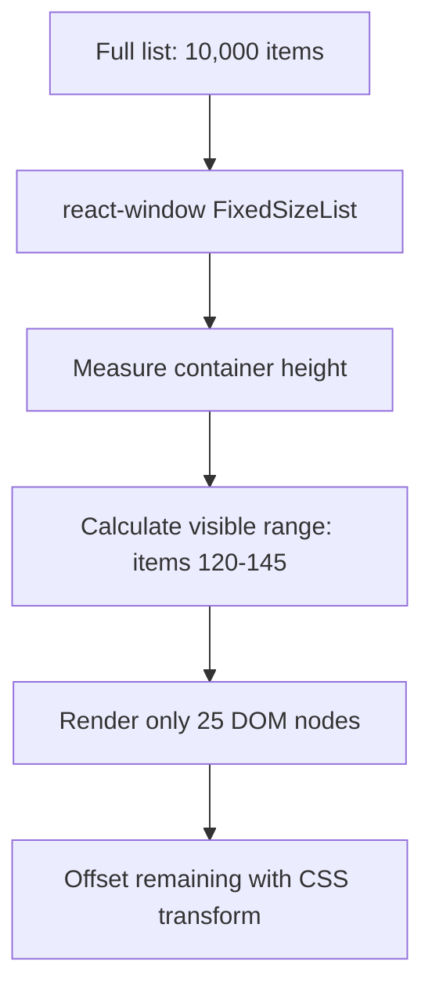
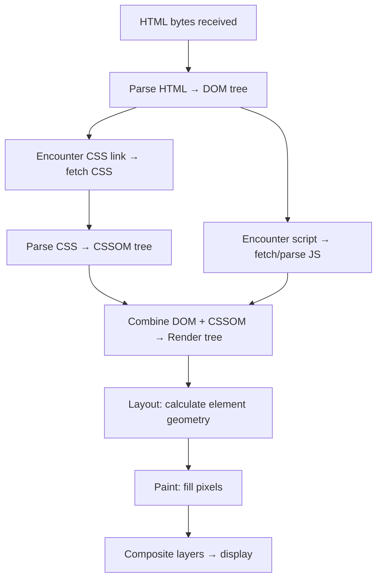

# 3. Performance, TypeScript and Web Fundamentals

> **TL;DR:** React performance is about eliminating unnecessary re-renders and JS work. TypeScript prevents whole classes of bugs. The browser's critical rendering path, event loop, and Web Vitals are universal frontend interview currency regardless of framework.

**Interview weight:** P2 — Web Vitals, event loop, and TypeScript generics come up frequently even for backend engineers.

---

## Core Concepts

- **Re-render** — React calling your component function again. Cheap if the output matches (reconciliation bails out early), expensive if it re-renders a huge subtree.
- **Commit phase** — React applying patches to the real DOM. This is what actually costs time in the browser.
- **Web Vital** — Google's user-centric performance metric used to measure real-world page experience.
- **Critical rendering path** — steps from HTML bytes to painted pixels that determine initial page load speed.

---

## What Causes Re-renders

1. Component's own `setState` / `dispatch`.
2. Parent re-renders (unless wrapped in `React.memo`).
3. Context value reference changes.
4. `useReducer` dispatch.
5. `forceUpdate` (class) or key change.

**Does NOT cause re-render:** `useRef` mutation, non-React variable changes.

---

## Memoization Strategy

- **Profile first** with React DevTools Profiler (flame chart, ranked chart).
- Wrap expensive components in `React.memo` — skip render if shallow-equal props.
- `useCallback` to stabilize callback props passed to memo'd children.
- `useMemo` to stabilize object/array props or cache expensive computations.
- Move static values and functions outside the component to avoid recreating them each render.
- Avoid anonymous inline objects/arrays/functions as props: `style={{ color: "red" }}` creates a new object every render.

---

## List Virtualization

Rendering 10 K DOM nodes is slow. Virtualization renders only visible items.



```tsx
import { FixedSizeList as List } from "react-window";

<List height={600} itemCount={items.length} itemSize={50} width="100%">
  {({ index, style }) => <Row style={style} item={items[index]} />}
</List>
```

Use `react-virtual` (TanStack Virtual) for dynamic heights.

---

## Code Splitting, Lazy, and Suspense

```tsx
const Reports = React.lazy(() => import("./Reports"));

function App() {
  return (
    <Suspense fallback={<Skeleton />}>
      <Reports />
    </Suspense>
  );
}
```

- Bundle is split at the `import()` boundary.
- React downloads the chunk only when the component is first rendered.
- Combined with React Router lazy routes for route-level splitting.

---

## Bundle Analysis and Tree Shaking

- `webpack-bundle-analyzer` or `vite-plugin-inspect` visualize bundle composition.
- **Tree shaking** — bundler eliminates dead-code exports (requires ES modules, no side-effects in package.json).
- Common culprits: importing entire lodash/moment, icon libraries (import specific icon only).

---

## Web Vitals

| Metric | Full name | Target | What it measures | Key fix |
| ------ | --------- | ------ | ---------------- | ------- |
| **LCP** | Largest Contentful Paint | ≤ 2.5 s | When largest image/text block renders | Preload hero image, fast TTFB, CDN |
| **INP** | Interaction to Next Paint | ≤ 200 ms | Responsiveness to user input | Break up long JS tasks, defer non-critical work |
| **CLS** | Cumulative Layout Shift | ≤ 0.1 | Visual stability | Reserve space for images/ads, avoid late-injected content |
| **TTFB** | Time to First Byte | ≤ 600 ms | Server response time | Edge/CDN, caching, optimize API |
| **FCP** | First Contentful Paint | ≤ 1.8 s | First text/image | Eliminate render-blocking resources |

---

## Rendering Strategies: CSR vs SSR vs SSG vs ISR vs Streaming SSR

| Strategy | When HTML is generated | SEO | TTFB | JS needed | Complexity | Use for |
| -------- | --------------------- | --- | ---- | --------- | ---------- | ------- |
| CSR | In browser | Poor | Fast (empty shell) | High | Low | Dashboards, authenticated apps |
| SSR | Per request on server | Good | Slower (wait for data) | High (hydration) | Medium | Dynamic, personalized pages |
| SSG | At build time | Excellent | Very fast (static) | Low | Low | Marketing, docs, blogs |
| ISR | At build + revalidate interval | Excellent | Very fast | Low | Medium | E-commerce, news |
| Streaming SSR | Per request, chunked | Good | Excellent (first chunk fast) | High | High | Large pages with slow data |

**Hydration mismatch** — SSR HTML and client-side render differ (e.g., Date.now() called on both). React warns in dev. Fix: ensure same data/deterministic output on server and client; use `useId` for IDs.

---

## TypeScript with React

### Typing Props, State, Events

```tsx
interface ButtonProps {
  label: string;
  onClick: (event: React.MouseEvent<HTMLButtonElement>) => void;
  children?: React.ReactNode;
  variant?: "primary" | "secondary";
}

const Button: React.FC<ButtonProps> = ({ label, onClick, variant = "primary" }) => (
  <button className={variant} onClick={onClick}>{label}</button>
);
```

### Generics in Components

```tsx
function DataList<T extends { id: string }>({ items, renderItem }: {
  items: T[];
  renderItem: (item: T) => React.ReactNode;
}) {
  return <ul>{items.map(i => <li key={i.id}>{renderItem(i)}</li>)}</ul>;
}
```

### `interface` vs `type`

| Aspect | `interface` | `type` |
| ------ | ----------- | ------ |
| Extension | `extends` | `&` intersection |
| Declaration merge | Yes — open, mergeable | No |
| Union / primitive | Cannot | Yes: `type ID = string \| number` |
| Computed properties | Limited | Yes |
| Convention | Objects/classes | Unions, primitives, utilities |

### Utility Types

| Type | What it does |
| ---- | ------------ |
| `Partial<T>` | All properties optional |
| `Required<T>` | All properties required |
| `Pick<T, K>` | Only named keys |
| `Omit<T, K>` | All except named keys |
| `Record<K, V>` | Map from key type to value type |
| `ReturnType<F>` | Infer function return type |
| `NonNullable<T>` | Remove `null` and `undefined` |
| `Readonly<T>` | All properties read-only |

### `unknown` vs `any` vs `never`

- **`any`** — opts out of type checking entirely. Avoid.
- **`unknown`** — type-safe any; must narrow before use. Prefer for external input.
- **`never`** — the bottom type; a function that never returns, an exhaustive check.

### Runtime Validation with Zod

```tsx
import { z } from "zod";
const UserSchema = z.object({ id: z.string(), name: z.string(), age: z.number().min(0) });
type User = z.infer<typeof UserSchema>;

const parsed = UserSchema.safeParse(apiResponse);
if (!parsed.success) throw new Error("Invalid API response");
const user: User = parsed.data;
```

---

## Web Fundamentals

### HTML Semantics and Accessibility

- Use semantic elements (`<nav>`, `<main>`, `<article>`, `<section>`, `<header>`, `<footer>`) — meaningful to screen readers and SEO.
- `aria-label`, `aria-describedby`, `role` — augment semantics when native elements insufficient.
- Keyboard navigation: all interactive elements focusable; logical tab order; skip-links for main content.
- WCAG 2.1 AA minimums: 4.5:1 contrast ratio for normal text, alt text on images, captions on video.

### CSS: Box Model, Flexbox vs Grid

Every element = content + padding + border + margin. `box-sizing: border-box` (universal default in modern resets) includes padding+border in width.

| Aspect | Flexbox | Grid |
| ------ | ------- | ---- |
| Dimension | 1D (row or column) | 2D (rows and columns) |
| Use for | Nav bars, card rows, centering | Page layouts, complex alignment |
| Alignment | `justify-content` / `align-items` | `grid-template`, `place-items` |
| Order | `order` property | `grid-area` placement |

### CSS-in-JS vs Modules vs Tailwind

| Approach | Scoping | Runtime cost | DX | Bundle |
| -------- | ------- | ------------ | -- | ------ |
| CSS-in-JS (Emotion/SC) | Auto | Yes (style inject) | High co-location | Larger |
| CSS Modules | Auto (class hash) | No | Good | Smaller |
| Tailwind | Utility classes (global) | No (purged) | Rapid | Small if purged |

### Critical Rendering Path



- **Render-blocking resources** — CSS and synchronous `<script>` in `<head>` block HTML parsing.
- Fix: defer/async scripts, inline critical CSS, preload key resources.

### JavaScript Event Loop, Microtasks vs Macrotasks

```
Call Stack → empty → check Microtask queue → drain fully → take one Macrotask → repeat
```

| Queue | Examples | When drains |
| ----- | -------- | ----------- |
| Microtask | `Promise.then`, `queueMicrotask`, `MutationObserver` | After every task, before next macrotask — entire queue |
| Macrotask | `setTimeout`, `setInterval`, DOM events, I/O | One per event loop tick |

```js
console.log("1");
setTimeout(() => console.log("4"), 0);
Promise.resolve().then(() => console.log("2")).then(() => console.log("3"));
// Output: 1, 2, 3, 4
```

- `setTimeout(fn, 0)` does NOT run immediately — it queues a macrotask.
- Long-running synchronous code blocks the UI (blocks paint and input handling).

### JavaScript Core Concepts

- **`var`/`let`/`const`** — `var` is function-scoped, hoisted, can redeclare; `let`/`const` block-scoped, temporal dead zone. Use `const` by default.
- **Closures** — function retaining access to its outer scope's variables after the outer function returns. Source of stale closure bugs in hooks.
- **`this`** — depends on call site; lost when passing methods as callbacks. Arrow functions capture `this` from enclosing lexical scope.
- **Prototypes** — JS inheritance chain; `Object.create`, `class` is syntactic sugar.
- **Promises vs async/await** — `async/await` is syntactic sugar over Promises. `await` yields the microtask queue; doesn't block the thread.
- **Event delegation** — attach one listener on a parent instead of many on children; check `event.target` to identify which child triggered it. Efficient for dynamic lists.

---

## Interview Questions

**Q1. What is the critical rendering path and how do you optimize it?**
A: HTML parse → DOM, CSS parse → CSSOM, combine → Render tree, Layout, Paint, Composite. Render-blocking CSS and sync scripts in `<head>` stall parsing. Optimizations: async/defer scripts, inline critical-path CSS, preload hero images, reduce render-blocking resources, use CDN for static assets.

**Q2. What is the difference between microtasks and macrotasks in the JS event loop?**
A: Microtasks (Promises, MutationObserver) drain completely after the current task before the browser can do anything else (paint, macrotask). Macrotasks (setTimeout, I/O) run one per loop tick. Long microtask chains can still block the main thread; long synchronous code definitely does.

**Q3. What is LCP and what improves it?**
A: Largest Contentful Paint — time until the largest visible image or text block renders. Target ≤ 2.5 s. Improve with: preload hero image (`<link rel="preload">`), fast server TTFB (CDN, edge), eliminate render-blocking resources, avoid lazy-loading the hero image.

**Q4. When would you use SSG vs SSR in a Next.js app?**
A: SSG for content that's the same for all users and changes infrequently (blog, docs, marketing) — blazing fast, CDN-cacheable. SSR for dynamic, personalized, or real-time content where stale data is unacceptable. ISR is a middle ground — pre-generate but revalidate on a schedule without a full rebuild.

**Q5. What is a hydration mismatch and how do you prevent it?**
A: Server renders HTML with one set of values; client renders differently on mount (e.g., `Math.random()`, `Date.now()`, window-only APIs). React warns and re-renders the client version, causing a flash. Fix: ensure deterministic rendering, guard window APIs with `useEffect`, use `useId` for element IDs.

**Q6. Explain `unknown` vs `any` in TypeScript.**
A: `any` disables type checking — any operation is allowed. `unknown` is the type-safe counterpart — you must narrow (type guard, assertion) before you can use the value. Use `unknown` for external/API data to force validation before consumption.

**Q7. How do you type a generic React component in TypeScript?**
A: Use a generic function component: `function List<T extends { id: string }>({ items }: { items: T[] })`. For arrow functions with a `.tsx` file, add a trailing comma `<T,>` to avoid JSX ambiguity. Generics let the component infer the item type from the prop at call site.

**Q8. What is CLS and what causes it?**
A: Cumulative Layout Shift — measures unexpected layout shifts during page load. Caused by images without dimensions, ads/embeds injected late, web fonts causing text reflow (FOUT). Fix: explicit `width`/`height` on media, `font-display: optional`, reserve space for ads/banners.

**Q9. Explain list virtualization and when you need it.**
A: Virtualizing a list renders only the visible rows (a window into the data) using absolute positioning and CSS transforms to fake scrollable height. Needed when rendering 100+ items where DOM node count degrades scroll performance. `react-window` / `@tanstack/react-virtual`. Not needed for typical paginated or small lists.

**Q10. What is event delegation and why is it useful?**
A: Attach one event listener to a parent element instead of one per child. The event bubbles up; inspect `event.target` to determine which child was clicked. Efficient for dynamically generated lists, avoids memory leaks from forgetting to remove per-item listeners. React's synthetic event system uses delegation internally.

**Q11. (Senior) A Next.js page has poor LCP. Walk me through a systematic optimization.**
A: (1) Measure with Lighthouse / Web Vitals real-user monitoring — identify LCP element. (2) If an image: ensure it's not lazy-loaded (`priority` prop in `next/image`), uses a CDN, has correct `srcset`, is served in WebP/AVIF. (3) If text: check for render-blocking fonts (add `font-display: swap`). (4) Improve TTFB: check server-side data fetching latency, add ISR/caching at the edge. (5) Eliminate render-blocking scripts in `<head>`.

**Q12. (Senior) How would you enforce TypeScript safety for an API response whose schema might change?**
A: Define a Zod schema that mirrors the expected contract, run `schema.safeParse(response)` at the API boundary. If parse fails, surface an error before the bad data propagates. This gives runtime validation + compile-time types (`z.infer<typeof schema>`) in one place. Pair with API contract tests or auto-generated types (OpenAPI → Zod via `openapi-zod-client`) to catch backend drift early.

**Q13. (Senior) A React app's bundle is 2 MB. What do you do?**
A: (1) Run `webpack-bundle-analyzer` — find the biggest culprits. (2) Code-split at route boundaries with React lazy. (3) Replace full library imports with specific imports (`import { debounce } from "lodash-es/debounce"`). (4) Move large libraries loaded after interaction (rich text editor, charting) behind dynamic imports triggered by user action. (5) Evaluate if a lighter alternative exists (date-fns vs moment, preact vs react in a widget context). (6) Enable tree-shaking by ensuring ES module builds.

---

## Quick Recap

- Re-renders are caused by own state, parent re-render, or context change — `React.memo` + stable props prevent wasted renders.
- Virtual DOM + list virtualization (react-window) handle large data sets.
- Web Vitals targets: LCP ≤ 2.5 s, INP ≤ 200 ms, CLS ≤ 0.1.
- CSR = fast shell, bad SEO; SSG = fastest, build-time; SSR = per-request, dynamic; ISR = hybrid.
- Microtasks drain fully before any macrotask or paint — Promise chains block paint if too long.
- TypeScript: prefer `unknown` over `any`; use Zod for runtime validation + inferred types.
- Critical path: parse HTML/CSS → render tree → layout → paint → composite; defer non-critical scripts.
- CSS: `box-sizing: border-box`; flexbox = 1D; grid = 2D; Tailwind purges unused classes.
