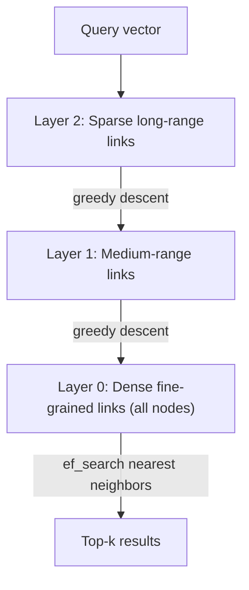
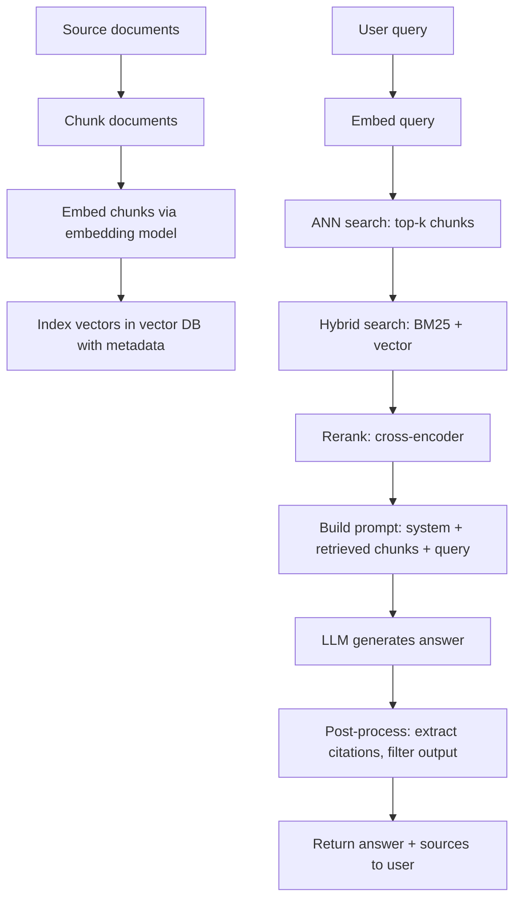

# 2. Embeddings, Vector Search and RAG

> **TL;DR:** Embeddings encode semantic meaning as dense vectors. ANN indexes find nearest neighbors in milliseconds at scale. RAG wires these together with an LLM so answers are grounded in your private data — it's the most practical production AI pattern.

**Interview weight:** P1 — you shipped embeddings-based copycat detection and Azure AI Search RAG. Speak from production experience.

---

## Core Concepts

- **Embedding** — a high-dimensional float vector where semantic similarity ≈ geometric proximity. Produced by an encoder model (e.g., `text-embedding-3-large`).
- **Dimensionality** — typical ranges: 384 (sentence-transformers/MiniLM), 768 (BERT), 1536 (`text-embedding-ada-002`), 3072 (`text-embedding-3-large`). Higher ≠ always better; diminishing returns past task need.
- **Normalization** — L2-normalize vectors to unit length so cosine similarity = dot product (faster computation).

---

## Similarity Metrics

| Metric | Formula | When to use | Notes |
| ------ | ------- | ----------- | ----- |
| **Cosine** | `(A·B) / (‖A‖ ‖B‖)` | Semantic similarity, magnitude-independent | Default for text; range −1 to 1 |
| **Dot product** | `A·B` | When vectors are normalized (= cosine) | Faster; boosted by vector magnitude (good for relevance ranking with magnitude as confidence) |
| **Euclidean** | `‖A−B‖` | Image embeddings, when absolute distance matters | Sensitive to magnitude; less common for text |

Always normalize embeddings for text search — then cosine and dot product are equivalent and dot product is cheaper.

---

## Vector Databases and ANN Indexes

For billion-scale search, exact nearest-neighbor (O(n·d)) is too slow. Approximate Nearest Neighbor (ANN) trades small recall reduction for massive speed gains.

| Index type | Recall | Query latency | Memory | Build time | Update cost | Notes |
| ---------- | ------ | ------------- | ------ | ---------- | ----------- | ----- |
| **Flat / Brute-force** | 100% | Slow at scale | Low | None | Zero | Use for < 100 K vectors or ground-truth eval |
| **IVF** | 95–99% | Fast | Medium | Medium | Re-cluster | Divide vectors into clusters; search nearest clusters |
| **HNSW** | 97–99% | Very fast | High | Medium | Easy | Hierarchical graph; best latency/recall trade-off; default choice |
| **PQ / IVF-PQ** | 90–97% | Fast | Very low | Medium | Re-index | Product quantization compresses vectors; massive memory saving |
| **DiskANN** | 95–98% | Fast (SSD) | Low (RAM) | Long | Moderate | Billion-scale on disk; Azure AI Search uses this |

### HNSW Layer Structure



---

## Vector DB Options

| DB | Hosting | Index | Hybrid search | Filtering | Notes |
| -- | ------- | ----- | ------------- | --------- | ----- |
| **Azure AI Search** | Managed Azure | DiskANN | BM25 + vector (RRF) | Full metadata + RBAC | Best for .NET/Azure stack; your production choice |
| **pgvector** | PostgreSQL extension | HNSW / IVF | Manual (+ pg_trgm) | Full SQL | Simplest if already on Postgres |
| **Pinecone** | Fully managed SaaS | Proprietary | Yes | Metadata filter | No infra; expensive at scale |
| **Qdrant** | Self-host / cloud | HNSW | Yes | Rich payload filter | Great OSS option; fast |
| **Weaviate** | Self-host / cloud | HNSW | Yes (BM25+vector) | GraphQL filter | Modular, multi-modal |
| **Redis Vector** | Redis Stack | HNSW / Flat | Manual | Hash tags | Already in-stack if using Redis |
| **Cosmos DB Vector** | Managed Azure | DiskANN | No (add AI Search) | Cosmos partition/filter | Good if data already in Cosmos |

---

## RAG End-to-End Pipeline



### Ingest Pipeline (one-time + incremental)
1. Parse document (PDF, DOCX, HTML) → text.
2. Chunk (strategy below).
3. Add contextual metadata (document title, date, section, access control tags).
4. Embed each chunk.
5. Upsert into vector DB with chunk ID, metadata, vector.

### Query Pipeline (per request)
1. Embed user query.
2. Hybrid search (BM25 keyword + vector similarity).
3. Rerank top-20 → select top-5.
4. Build prompt with retrieved chunks.
5. LLM call with grounding instructions.
6. Post-process: extract citations, safety filter, return.

---

## Chunking Strategies

| Strategy | Chunk size | Overlap | Pros | Cons |
| -------- | ---------- | ------- | ---- | ---- |
| **Fixed character** | 500–1000 chars | 50–200 chars | Simple, predictable | Splits mid-sentence, loses context |
| **Sentence/recursive** | ~2–5 sentences | 1 sentence | Semantic boundaries, coherent | Variable size; needs NLP lib |
| **Semantic** | Paragraph/topic cluster | Minimal | Coherent topics per chunk | Complex; harder to control size |
| **Parent-document (small-to-big)** | Small chunk for retrieval, large parent for context | — | High recall, full context sent to LLM | More storage; retrieval + lookup step |
| **Contextual headers** | Prepend doc title + section header to each chunk | — | Improves chunk relevance without query | Increases token count per chunk |

**Practical guidance:**
- Start with recursive sentence splitter, 512 tokens, 50-token overlap.
- If precision is low: decrease chunk size (more specific).
- If context lost: use parent-document retrieval.
- Always prepend document title + section to each chunk for metadata context.

---

## Hybrid Search and Reranking

**Pure vector search** misses exact keyword matches (product codes, names, abbreviations).
**Pure BM25** misses semantic synonyms.
**Hybrid** combines both via **Reciprocal Rank Fusion (RRF)**:

```
RRF_score(doc, k=60) = Σ 1 / (k + rank_in_each_list)
```

Azure AI Search natively supports BM25 + vector with RRF. No manual merge needed.

**Reranking (cross-encoder):** Takes query + candidate passage and scores them jointly (not independently). Far more accurate than bi-encoder but O(candidates) model calls. Use on top-20 BM25+vector results, return top-5 to LLM. Models: Cohere Rerank, MS MiniLM cross-encoder, Azure AI Search semantic ranker.

---

## Query Transformation

| Technique | How | Benefit |
| --------- | --- | ------- |
| **Query rewriting** | LLM reformulates ambiguous/short query | Better keyword coverage |
| **HyDE** (Hypothetical Document Embeddings) | Generate a hypothetical answer, embed it, search with that | Finds relevant docs even when query phrasing differs from doc phrasing |
| **Multi-query** | Generate 3–5 query variants, union results, deduplicate | Covers more of the search space |
| **Step-back prompting** | Abstract query to higher-level concept first | Finds foundational knowledge before narrow retrieval |

---

## Retrieval Evaluation Metrics

| Metric | What it measures | Formula |
| ------ | ---------------- | ------- |
| **Recall@k** | Are the relevant docs in top-k? | `relevant_found / total_relevant` |
| **MRR** | Rank of first relevant result | `1 / rank_of_first_hit` (avg over queries) |
| **nDCG@k** | Graded relevance considering rank | Normalized discounted cumulative gain |
| **Faithfulness** | Does the answer only use information from retrieved context? | LLM-judge or entailment model |
| **Answer relevance** | Is the answer relevant to the question? | LLM-judge |
| **Context precision** | Of retrieved chunks, how many are actually relevant? | `relevant_chunks / total_retrieved` |

Tools: RAGAS framework auto-computes faithfulness, answer relevance, context precision, context recall against a golden set.

---

## Security: Permission-Scoped Retrieval

**Critical:** Filter by user permissions BEFORE the LLM sees content.

```
1. User query arrives with auth token.
2. Extract user's access scopes (document IDs, department tags, clearance level).
3. Vector search with metadata filter: { "access_groups": { "$in": user_groups } }
4. Only permitted chunks reach the LLM prompt.
5. Never rely on LLM to redact forbidden content — it can be tricked.
```

Azure AI Search: use **security trimming** filter on every query. Cosmos DB Vector: partition key or OData filter on ACL field.

---

## Grounding and Citation Enforcement

```
System prompt addition:
"Answer using ONLY the provided context. 
After your answer, list each source as [Source: <document_id>].
If the context doesn't contain the answer, respond: 
'I don't have enough information to answer this.'"
```

Post-process: verify that each cited document ID exists in the retrieved set. Reject or flag responses that cite non-retrieved IDs.

---

## Freshness and Incremental Re-indexing

- **Event-driven ingest:** document creation/update event → trigger embed + upsert pipeline (Service Bus → Function → embed → upsert).
- **Soft delete then hard delete:** mark vector record inactive on doc deletion; hard delete after propagation delay.
- **GDPR / right to erasure:** store chunk-to-document mapping; on deletion request, delete all chunks with that document ID. Deletion in HNSW is cheap; in IVF requires rebuild.
- **Re-embed on model upgrade:** embedding model versions change meaning of distances. Re-embed all docs when switching embedding models.

---

## Cost and Latency Budget of a RAG Call

| Step | Typical latency | Typical cost (GPT-4o + text-embedding-3-large) |
| ---- | --------------- | ---------------------------------------------- |
| Embed query (256 tokens) | 20–50 ms | $0.00013 |
| Vector search (top-20) | 5–30 ms | $0.00002 (Azure AI Search) |
| Rerank top-20 → top-5 | 50–200 ms | $0.001 (Cohere Rerank API) |
| LLM generate (4K input, 500 output) | 800–2000 ms | $0.05 |
| **Total** | ~1–2.5 s | ~$0.05 per request |

Levers to reduce: smaller model for generation ($0.005 vs $0.05), smaller context (fewer/shorter chunks), skip rerank for simple queries, semantic cache (hit → skip LLM call entirely).

---

## Semantic Caching

Cache LLM responses keyed by embedding of the query. On new query: embed → search cache index → if cosine similarity > 0.95 with a cached query, return cached response. Cache TTL depends on data freshness requirements. Reduces LLM call cost dramatically for repeated/similar queries.

---

## Near-Duplicate / Copycat Detection with Embeddings

**Your production use case:** detecting near-duplicate or plagiarized content in a content certification pipeline.

```
1. Embed new submission → vector V_new.
2. ANN search against corpus index: top-k candidates by cosine similarity.
3. Apply threshold: similarity > T → flag as potential duplicate.
4. Human review queue for flagged items.
```

**Threshold selection:**
- T too low → false positives (similar-topic content flagged as copied).
- T too high → false negatives (paraphrased copies slip through).
- Calibrate on labeled dataset: plot precision/recall curve vs threshold; pick operating point based on business cost of FP vs FN.
- Use a tiered approach: auto-reject > 0.98, human review 0.85–0.98, auto-pass < 0.85.

**False positives:** boilerplate text, standard disclaimers, common phrases all produce high similarity. Fix: exclude boilerplate sections before embedding, or use a second-pass diff (character-level or structural) for high-similarity candidates.

---

## Common RAG Failure Modes

| Failure | Symptom | Fix |
| ------- | ------- | --- |
| Retrieved docs not relevant | LLM answers from parametric knowledge, ignores context | Improve chunking; add hybrid search; tune retrieval eval |
| Context too long | LLM ignores docs in the middle (lost-in-the-middle) | Rerank to top-3–5; use parent-doc with shorter summaries |
| Hallucinated citations | Model cites sources not in context | Post-process: verify citation IDs; use strict grounding prompt |
| Stale data | Answers reference outdated information | Incremental re-index on update events; add `last_updated` metadata filter |
| Security leak | User retrieves docs they shouldn't see | Pre-filter by access control before vector search |
| Injection via document | Retrieved doc hijacks agent behavior | Treat retrieved content as untrusted data; wrap in delimiters |
| Slow reranking | p99 > 3 s | Cap candidate list at 10; use faster cross-encoder; skip rerank for simple queries |

---

## Interview Questions

**Q1. What is an embedding and what does geometric proximity mean in practice?**
A: An embedding is a dense vector where semantically similar texts cluster near each other in the high-dimensional space. "Cosine similarity" measures the angle between vectors — close to 1 means semantically similar. This allows "find documents about tax deductions for home offices" to match a passage that never uses those exact words.

**Q2. Why is hybrid search (BM25 + vector) better than pure vector search?**
A: Vector search misses exact keyword matches (product codes, proper nouns, technical abbreviations) because the model may not have learned their embeddings well. BM25 catches exact lexical matches but misses paraphrase/synonymy. RRF fusion of both lists consistently outperforms either alone — typical 5–15% improvement in recall@k.

**Q3. Explain HNSW at a high level and what build parameters affect it.**
A: HNSW builds a hierarchical proximity graph — top layers have sparse long-range connections (coarse navigation), bottom layer is dense (fine search). At query time, start at top layer, greedily navigate to closer nodes, descend layers, collect neighbors at layer 0. Key params: `M` (connections per node — higher = better recall, more memory), `efConstruction` (quality of index build — higher = better index, slower build), `efSearch` (search quality vs speed — tuned at query time).

**Q4. How do you handle the "lost in the middle" problem in RAG?**
A: LLMs attend more strongly to the beginning and end of context. Mitigation: (1) Rerank to top-3 and place most relevant chunk first. (2) Use parent-document strategy — embed small chunks for retrieval, send the parent document for context (one coherent document > many fragmented chunks). (3) Use models fine-tuned for long-context retrieval.

**Q5. How did you approach threshold calibration for copycat detection?**
A: Built a labeled dataset of known-duplicate and non-duplicate pairs. Computed cosine similarity for all pairs. Plotted precision-recall curve across similarity thresholds. Chose operating point based on business cost: higher recall (lower threshold, more FPs) when FN (missed copycats) was more costly, higher precision (higher threshold) when FP (false accusations) was more costly. Used a tiered threshold: auto-reject, human-review, auto-pass bands.

**Q6. What is RRF and why is it used for hybrid search fusion?**
A: Reciprocal Rank Fusion combines rankings from multiple retrieval systems without needing score normalization. Each document gets score `Σ 1/(k + rank_i)` for each system. k (usually 60) dampens the impact of very high ranks. Works robustly because it only uses rank order, not raw scores — which are incomparable across BM25 and cosine similarity anyway.

**Q7. How do you handle GDPR deletion requests in a vector index?**
A: Store a mapping of document ID → chunk IDs at ingest time. On deletion request: (1) delete all chunk records by chunk ID in the vector DB, (2) delete source document from storage, (3) verify by querying the index for the document ID. HNSW supports soft deletion (mark deleted) followed by periodic compaction; Azure AI Search handles deletion via document ID tombstoning.

**Q8. (Senior) A RAG system's faithfulness score is dropping. How do you diagnose it?**
A: (1) Retrieve the queries where faithfulness failed — check if retrieved chunks are actually relevant (precision issue) or if the model is ignoring context. (2) Check for lost-in-the-middle: are relevant chunks in the middle of a long context? Reorder — most relevant first and last. (3) Check if system prompt grounding instruction is strong enough. (4) Check if temperature > 0 is enabling over-generation. (5) Consider a smaller, tighter context window: 3–5 chunks instead of 10.

**Q9. (Senior) How would you architect a multi-tenant RAG system where each tenant's documents must be invisible to others?**
A: Azure AI Search: add `tenant_id` field to every indexed document; include mandatory `$filter=tenant_id eq '{tenantId}'` on every search call (enforced server-side, not in the query string from client). Never let the user construct the filter. For Cosmos DB Vector: partition by tenant ID. Verify in integration tests that cross-tenant queries return zero results. Log every retrieval call with tenant ID for audit.

**Q10. (Senior) When does RAG fail and you should consider fine-tuning instead?**
A: RAG fails when: (1) the task requires deeply internalized domain reasoning, not just fact retrieval (e.g., specialized legal/medical analysis), (2) output format consistency can't be achieved with prompting alone, (3) the latency of retrieval + generation is unacceptable and the knowledge is stable enough to bake in, (4) the knowledge corpus is small enough to fit in fine-tuning context. Fine-tune on top of RAG for format + style; pure fine-tuning rarely replaces RAG for knowledge grounding.

---

## Quick Recap

- Embedding = semantic meaning as a vector; cosine similarity = angle between vectors.
- Normalize embeddings → cosine = dot product (cheaper).
- HNSW: best latency/recall for online ANN; DiskANN: billion-scale on SSD (Azure AI Search).
- Hybrid search (BM25 + vector + RRF) consistently beats either alone.
- Chunking: start with recursive sentence, 512 tokens, 50 overlap; tune based on eval.
- RAG pipeline: chunk → embed → index → embed query → hybrid search → rerank → prompt → LLM → cite.
- Security trimming: filter by ACL before vector search, not after.
- Copycat detection: tiered thresholds (auto-reject / human review / auto-pass) calibrated on labeled data.
- RAGAS metrics: faithfulness + answer relevance + context precision + context recall.
