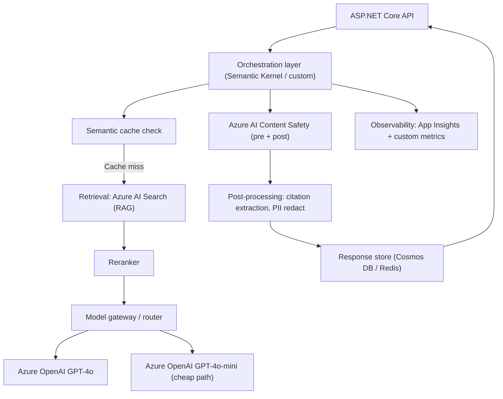

# 4. AI in Production Backends

> **TL;DR:** Shipping an LLM feature to production means solving cost control, latency, resilience, observability, safety, and evaluation — not just prompt engineering. Your AI Content Certification Platform is the case study; know it cold.

**Interview weight:** P1 — this is your differentiator. No one else interviewing for a backend role has shipped a production RAG + content moderation pipeline. Make the architecture crisp and own the trade-offs.

---

## Core Concepts

- **Model gateway** — abstraction layer between your application and the LLM API; handles auth, routing, retry, logging, quota enforcement.
- **Semantic cache** — cache LLM responses keyed by embedding similarity of the input; reduces repeated expensive calls.
- **LLMOps** — MLOps practices adapted for LLMs: prompt versioning, model swap without redeploy, eval pipelines, drift detection.
- **PTU (Provisioned Throughput Unit)** — Azure OpenAI reserved capacity; predictable latency, no throttling, higher upfront cost.

---

## Reference Architecture: LLM Feature in a .NET Backend



---

## Azure OpenAI Specifics

| Aspect | Detail |
| ------ | ------ |
| **Deployments** | You deploy a model to a named deployment; your code references deployment name, not model name |
| **PTU** | Reserved capacity unit; predictable sub-100ms TTFT; ~3–5× cost vs pay-as-you-go but no throttling |
| **Pay-as-you-go** | Per-token billing; subject to TPM/RPM quota; use for variable/low-volume workloads |
| **Quotas** | TPM (tokens per minute) and RPM (requests per minute) per deployment region |
| **Regional availability** | Not all models in all regions; have a fallback region in your gateway |
| **Content filters** | Built-in classifier (hate/violence/sexual/self-harm); configurable severity thresholds; can block at input or output |
| **Private networking** | Deploy to VNet with Private Endpoint; no public internet; required for compliance workloads |
| **Managed Identity auth** | Use `DefaultAzureCredential` — no API keys in config or secrets; preferred for production |

```csharp
// Managed Identity auth with Azure OpenAI
var credential = new DefaultAzureCredential();
var client = new AzureOpenAIClient(
    new Uri(config["AzureOpenAI:Endpoint"]!),
    credential);
```

---

## Model Gateway / Router Pattern

A thin service in front of all LLM calls that provides:
- **Multi-model fallback:** primary model (GPT-4o) → fallback (GPT-4o-mini or different region) on 429/503.
- **Cost routing:** classify query complexity; route simple queries to GPT-4o-mini, complex to GPT-4o.
- **Canary a new model:** send 5% of traffic to new deployment; compare quality before full rollout.
- **Centralized logging and rate limiting.**

---

## Rate Limits and Cost Control

### Per-Request Token Budgeting

| Item | Tokens (example) | Notes |
| ---- | ----------------- | ----- |
| System prompt | 800 | Compress instructions; version-controlled |
| Retrieved context (5 chunks) | 3,000 | Top-5 reranked, ~600 tokens each |
| Conversation history | 1,500 | Summarize beyond last 5 turns |
| User message | 200 | |
| `max_tokens` (output) | 500 | Reserve; billing is actual output |
| **Total context** | ~6,000 | Well within 128 K; optimize for cost |

### Cost Math Example (1,000 requests/day)

| Component | Volume | Unit cost | Daily cost |
| --------- | ------ | --------- | ---------- |
| Input tokens (6K × 1K req) | 6M tokens | $0.005/1K | $30 |
| Output tokens (500 × 1K req) | 500K tokens | $0.015/1K | $7.50 |
| Embeddings (query) | 250K tokens | $0.0001/1K | $0.025 |
| AI Search | 1K queries | $0.001/query | $1 |
| **Total** | — | — | **~$38.50/day** |

**Cost levers:**
- Route 60% of queries to GPT-4o-mini → 10× cheaper for those.
- Semantic cache with 30% hit rate → cut LLM calls by 30%.
- Compress retrieved context by 40% (LLMLingua) → significant input token savings.
- Per-tenant daily token quota → abuse protection.

---

## Latency Optimization

| Technique | Saves | Notes |
| --------- | ----- | ----- |
| **Streaming (SSE)** | TTFB perceived: ~1 s → 200 ms | Stream tokens as they generate; `response.GetStreamingChatMessageContentsAsync` in SK |
| **Parallel retrieval** | ~200 ms | Run vector search + BM25 in parallel |
| **Smaller model for sub-tasks** | ~800 ms | Use mini model for intent classification, full model for generation |
| **Prompt compression** | ~20% input cost, ~50ms faster | LLMLingua or manual summarization |
| **Semantic cache** | Full LLM call: ~1–2 s | Cache hit → ~30 ms round trip |
| **Connection reuse** | ~50 ms/req | `HttpClient` singleton with `SocketsHttpHandler` and pooling |
| **Skip rerank for simple queries** | ~100–200 ms | Route to fast ANN-only path when query is simple keyword lookup |
| **p99 targets** | < 2 s end-to-end | Streaming to browser masks generation latency |

---

## Resilience with Polly

```csharp
// Polly-style resilience for Azure OpenAI calls
var pipeline = new ResiliencePipelineBuilder<HttpResponseMessage>()
    .AddRetry(new RetryStrategyOptions<HttpResponseMessage>
    {
        MaxRetryAttempts = 3,
        BackoffType = DelayBackoffType.Exponential,
        UseJitter = true,
        Delay = TimeSpan.FromSeconds(1),
        ShouldHandle = new PredicateBuilder<HttpResponseMessage>()
            .HandleResult(r => r.StatusCode == HttpStatusCode.TooManyRequests)
            .HandleResult(r => r.StatusCode == HttpStatusCode.ServiceUnavailable),
        OnRetry = (args) =>
        {
            // Honor Retry-After header on 429
            if (args.Outcome.Result?.Headers.RetryAfter?.Delta is { } retryAfter)
                args.Arguments.RetryDelay = retryAfter;
            return ValueTask.CompletedTask;
        }
    })
    .AddCircuitBreaker(new CircuitBreakerStrategyOptions<HttpResponseMessage>
    {
        FailureRatio = 0.5,
        SamplingDuration = TimeSpan.FromSeconds(30),
        MinimumThroughput = 10,
        BreakDuration = TimeSpan.FromSeconds(60)
    })
    .AddTimeout(TimeSpan.FromSeconds(30))
    .Build();
```

**Graceful degradation:** when circuit breaker is open, return a non-AI fallback response ("Our AI features are temporarily unavailable; here are the standard results…") rather than a 500.

---

## Observability for AI

**What to log per request:**

| Field | Why |
| ----- | --- |
| `trace_id` / `correlation_id` | Tie prompt + response to the originating HTTP request |
| `session_id` | Group multi-turn conversation |
| `model` + `deployment` | Attribution; detect if silent model upgrade changed behavior |
| `prompt_version` | Track which prompt produced which output |
| `input_tokens`, `output_tokens` | Cost attribution per user/tenant |
| `latency_ms` (TTFB, total) | P50/P95/P99 alerting |
| `tool_calls` (name, args, result) | Agentic call chain debugging |
| `safety_filter_result` | How often content is filtered |
| `user_feedback` (thumbs up/down) | Online quality signal |
| `redacted_prompt` | PII-scrubbed version for debugging |

**Dashboards to build:**
- Cost by tenant/feature/model over time.
- Token usage vs budget alerts.
- Latency P50/P95/P99 per endpoint.
- Safety filter trigger rate (sudden spike = jailbreak attack).
- Quality score trend (from LLM-as-judge sampling).
- Cache hit rate.

**Drift detection:** run LLM-as-judge on a sample of live traffic daily; alert if quality score drops > 10% from baseline — catches silent model degradation or prompt regression.

---

## Evaluation and Quality Gates

| Level | What | Tool | Gate |
| ----- | ---- | ---- | ---- |
| **Offline golden set** | Known Q&A pairs with reference answers | RAGAS / custom | Block deploy if accuracy drops > 5% |
| **LLM-as-judge** | Rubric scoring (1–5) on helpfulness, groundedness, safety | GPT-4o judge | Alert on average score < 4.0 |
| **Regression suite in CI** | Run golden set on every PR | pytest / NUnit | PR merge gate |
| **A/B / shadow mode** | Route 5% to new model/prompt | Feature flag | Measure 1 week before full rollout |
| **Human review sampling** | Manual audit of 50–100 random responses/week | Internal tool | Calibrate LLM-judge bias |

### What Each Metric Catches

| Metric | What it catches |
| ------ | --------------- |
| Faithfulness | Hallucinations beyond retrieved context |
| Answer relevance | Off-topic or unhelpful answers |
| Context precision | Poor retrieval (wrong chunks fetched) |
| Safety score | Harmful content slipping through filters |
| Latency P99 | Slow LLM calls (prompt too long, model overloaded) |
| Token usage per query | Prompt bloat, context inefficiency |

---

## Safety

**Defense in depth — never rely on a single layer:**

1. **Input filtering (pre-LLM):** Azure AI Content Safety classify input; reject or redact before the model sees it.
2. **System prompt instructions:** explicit safety constraints in system prompt (but don't rely on these alone).
3. **Output filtering (post-LLM):** classify output; block harmful categories; PII redaction before returning to client.
4. **Jailbreak detection:** classify for jailbreak patterns (role-playing, hypotheticals to bypass safety). Fine-tuned classifiers outperform rules.
5. **Abuse / rate limits:** per-user per-endpoint rate limits; flag unusual usage patterns (high volume, unusual hours).
6. **Audit trail:** immutable log of all AI interactions with user identity; required for compliance investigations.

---

## Data Privacy and Residency

| Concern | What to do |
| ------- | ---------- |
| What leaves your tenant | Azure OpenAI processes data in your configured region; your prompts/responses not used for training by default (Azure terms) |
| PII in prompts | Detect and redact with Presidio / Microsoft Recognizer before sending to LLM |
| Response retention | Define clear retention policy; auto-purge logs after 30/90 days per compliance requirement |
| Opt-out | Provide mechanism to delete user's conversation history and associated logs |
| Cross-region data flow | Keep prompt + response data in same region as the deployment (GDPR) |

---

## Model and Prompt Versioning

- **Prompt as code** — prompts in version-controlled files (`.prompty`, Handlebars templates, YAML configs), not hardcoded strings.
- **Prompt version tag** — include `prompt_version: "v2.3"` in every request log.
- **Model deployment pinning** — reference specific deployment name (e.g., `gpt-4o-2024-08-06`) not generic `gpt-4o`; model updates are controlled, not automatic.
- **Rollback** — flip a feature flag to previous prompt version; no redeploy required.
- **Canary** — deploy new prompt to 5% of traffic; monitor quality + safety metrics for 24 h before full rollout.

---

## Non-Determinism in Testing

LLMs are non-deterministic even at temperature=0 (tiny floating-point differences across hardware). Strategies:
- **Mock the LLM** in unit/integration tests — return fixed responses, test orchestration logic.
- **Semantic assertions** — don't assert exact string equality; assert semantic similarity > 0.95 or use LLM-as-judge to verify "answer contains mention of X."
- **Golden set eval** — test on the golden set; accept statistical pass rate (e.g., 95%+) not 100%.
- **Pin for regression** — pin seed + temperature=0 for regression tests to maximize reproducibility; accept occasional flap as known risk.

---

## MLOps vs LLMOps

| Aspect | MLOps | LLMOps |
| ------ | ----- | ------ |
| Artifact | Trained model binary | Prompt + model version + retrieval config |
| Training | Retraining pipeline (weeks) | Prompt update (minutes) |
| Evaluation | Accuracy on test set | Faithfulness, relevance, safety (rubric) |
| Deployment unit | Model container / endpoint | Prompt + deployment config + feature flag |
| Monitoring | Feature drift, prediction drift | Quality score drift, token usage, safety filter rate |
| Rollback | Redeploy previous model | Flip feature flag to previous prompt version |

---

## Build vs Buy vs Fine-Tune

| Option | When to choose | Cost | Risk |
| ------ | -------------- | ---- | ---- |
| **Prompt + RAG (buy API)** | Default first choice; most features | Low (API cost) | Vendor dependency |
| **Azure OpenAI hosted** | Data residency, compliance, Managed Identity | Medium | Smaller model selection |
| **Fine-tune** | Consistent style/format; stable knowledge; 500+ labeled examples | High (training) | Overfitting; expensive to update |
| **Self-hosted OSS model** | Full data control; cost at very high scale; air-gapped | High (infra) | Ops burden; model quality gap vs frontier |
| **Fine-tune + RAG** | Domain jargon + fresh knowledge | High | Complexity |

---

## Prototype to Production Checklist

- [ ] Prompt versioned and in source control
- [ ] Model deployment pinned (not floating alias)
- [ ] Managed Identity auth (no API keys in config)
- [ ] Token budgets set per request (`max_tokens`, context truncation)
- [ ] Azure AI Content Safety pre- and post-LLM
- [ ] PII detection/redaction before sending to model
- [ ] Rate limiting per user/tenant
- [ ] Resilience: retry with `Retry-After` + circuit breaker + timeout
- [ ] Graceful degradation (non-AI fallback path)
- [ ] Streaming response to client (UX)
- [ ] Semantic cache with appropriate TTL
- [ ] Observability: prompt/response logs with trace ID (PII-scrubbed)
- [ ] Golden set eval passing (> 95% accuracy gate)
- [ ] Regression eval in CI pipeline
- [ ] A/B or shadow mode before full rollout
- [ ] Incident runbook for LLM outage
- [ ] Data residency confirmed (same-region processing)
- [ ] Retention policy + deletion mechanism for GDPR

---

## Interview Questions

**Q1. How do you authenticate to Azure OpenAI in production?**
A: Managed Identity (`DefaultAzureCredential`) — no API key in config or KeyVault. The compute identity (App Service, AKS pod identity) is granted `Cognitive Services OpenAI User` role on the Azure OpenAI resource. Zero key rotation risk, full audit via Entra ID logs.

**Q2. What is the difference between PTU and pay-as-you-go in Azure OpenAI?**
A: PTU = provisioned capacity (reserved tokens/minute); predictable latency, no throttling, flat hourly cost regardless of usage — good for high-volume, SLO-bound workloads. Pay-as-you-go = per-token billing; subject to TPM/RPM quota limits; good for variable or low-volume workloads. Hybrid: use PTU for baseline load, pay-as-you-go for bursts.

**Q3. How do you control Azure OpenAI costs in a multi-tenant SaaS?**
A: (1) Per-tenant token quota enforced at the gateway. (2) `max_tokens` on every request. (3) Compress context (fewer/shorter chunks). (4) Route simple queries to mini model (~10× cheaper). (5) Semantic cache — repeated queries skip the LLM. (6) Cost attribution log per tenant — identify heavy users and enforce limits. (7) Alert on > 2× expected daily cost.

**Q4. How do you handle Azure OpenAI 429 errors in production?**
A: Honor the `Retry-After` header — back off exactly as long as the service instructs. Use exponential backoff with jitter for general retries. Circuit breaker opens after 50%+ failure rate in a 30-second window — fail fast and return cached/degraded response rather than queuing retries. Have a fallback region in the model gateway.

**Q5. How do you stream LLM responses to the browser?**
A: On the backend, call the OpenAI SDK streaming endpoint (`GetStreamingChatMessageContentsAsync` in Semantic Kernel). Write each token chunk to the HTTP response as Server-Sent Events (SSE). On the frontend, read the SSE stream and append tokens incrementally. This drops perceived TTFB from ~2 s to ~200 ms even though total generation time is the same.

**Q6. What is LLM-as-judge and what are its limitations?**
A: Use a capable model (GPT-4o) to evaluate another model's output against a rubric. Scales cheaply vs human review. Limitations: (1) bias toward own style — GPT-4o judge prefers GPT-4o-style answers; (2) can be fooled by fluent-sounding wrong answers; (3) rubric quality determines judge quality; (4) doesn't catch subtle factual errors without reference context. Mitigate: use judges from different model families; calibrate against human labels; use positional rotation to avoid position bias.

**Q7. How do you handle non-determinism in LLM integration tests?**
A: (1) Mock the LLM SDK — return fixed responses; test orchestration, tool routing, retry logic independently of the model. (2) For E2E tests against real model: use semantic assertions (similarity > threshold) not exact string match; use LLM-as-judge for quality pass/fail; accept a 95% pass rate over 100% determinism. (3) Pin temperature=0 + seed for maximum reproducibility in regression tests.

**Q8. Describe your AI Content Certification Platform architecture.**
A: Event-driven 4-stage pipeline: (1) Content submitted → Service Bus message. (2) Rule engine stage: deterministic checks (format, size, known-bad patterns). (3) AI moderation stage: Azure OpenAI classifies content against policy categories using structured output (function calling). (4) Embeddings-based copycat detection: embed submission → ANN search against certified corpus; flag similarity > 0.92 for human review. (5) Results written to Cosmos DB; idempotent processing via message deduplication key; DLQ + retry for transient failures. Impact: automated 80%+ of manual review volume; false positive rate < 2%.

**Q9. (Senior) How do you detect and respond to quality degradation in a live LLM feature?**
A: (1) Daily LLM-as-judge sampling of 100 random responses; track quality score trend. (2) Alert if 7-day rolling average drops > 10% from baseline. (3) Check if prompt or model changed (version logs). (4) Check if input distribution shifted (new content types triggering edge cases). (5) Run golden set eval immediately to quantify regression. (6) If model-side: roll back to previous deployment or freeze. (7) If prompt-side: roll back prompt version via feature flag. (8) Root-cause in 24 h; post-incident review.

**Q10. (Senior) How would you architect an LLM feature to serve 100K requests/day within a $200/day budget?**
A: $200/day budget, 100K requests → $0.002/request. (1) Route 70% of simple queries (intent classification, one-hop lookup) to GPT-4o-mini ($0.0015 input + $0.0006 output = ~$0.001/request). (2) Route 30% complex queries to GPT-4o (~$0.005/request). (3) Semantic cache with 20% hit rate → skip LLM for 20 K requests/day. (4) Compress context from 8K to 4K tokens via chunk summarization. (5) Math: (56K × $0.001) + (24K × $0.005) = $56 + $120 = $176/day — within budget with headroom. Monitor daily and enforce per-tenant quota.

**Q11. (Senior) What would you add to your AI Content Certification Platform to take it from prototype to production?**
A: (1) Prompt versioning + CI regression gate (run golden set on every PR). (2) LLM-as-judge sampling pipeline for daily quality monitoring. (3) Structured security review: adversarial inputs, prompt injection attempts via submitted content. (4) PII redaction before sending to Azure OpenAI. (5) Private networking (Private Endpoint for Azure OpenAI + AI Search). (6) Per-tenant token quotas and abuse rate limits. (7) Drift detection alerting. (8) Full audit log (compliance requirement for content decisions). (9) Human review dashboard with feedback loop that feeds back into golden set. (10) Canary deploy for prompt changes.

---

## Quick Recap

- Managed Identity auth — no API keys; `DefaultAzureCredential` + RBAC role on AOAI resource.
- PTU for predictable high-volume; PAYG for variable; hybrid for both.
- Cost levers: model routing (mini vs full), semantic cache, context compression, per-tenant quotas.
- Resilience: retry + `Retry-After` + circuit breaker + graceful degradation to non-AI path.
- Observability: log prompt+response (PII-scrubbed) + tokens + latency + tool calls + quality score.
- Evaluation: golden set in CI + LLM-as-judge daily sampling + A/B before rollout.
- Safety: input filter → system prompt → output filter → jailbreak detection → audit trail.
- LLMOps differs from MLOps: artifact = prompt, rollback = feature flag, evaluation = rubric-based.
- Checklist: version prompts, pin models, set budgets, add resilience, add observability — then evaluate, then ship.
