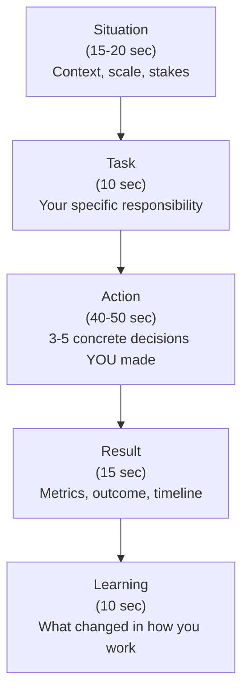

# 1. STAR Framework and Story Bank

> **TL;DR:** Ten fully drafted, metric-backed STAR stories drawn from real Xbox/Microsoft experience, mapped to every common question theme. Pick the right story in under 5 seconds; speak it in under 90 seconds.

**Interview weight:** P0 — behavioral rounds at Technical Lead level are pass/fail gates. A thin or metric-free answer fails regardless of technical depth.

---

## Core Concepts

- **STAR** — Situation, Task, Action, Result. The universal structure for behavioral answers.
- **STAR-L** — adds a Learning clause; mandatory for failure, conflict, and mistake questions.
- **"I" not "we"** — interviewers score *your* judgment and decisions, not the team's output.
- **Numbers anchor credibility** — latency, users, revenue, services count. "Improved performance" without a number signals vagueness.
- **Short version** — every story needs a 2-line summary for when an interviewer cuts you off or asks a rapid-fire follow-up.

---

## STAR-L Flowchart

---

## Time Budget Table

| Part | Target spoken time | What to include | Common mistake |
|------|--------------------|-----------------|----------------|
| Situation | 15–20 sec | Team size, system scale, stakes | Over-explaining org history |
| Task | 10 sec | Your ownership, not the team's | Saying "we were asked to" |
| Action | 40–50 sec | 3–5 decisions YOU made, sequenced | Using "we" throughout; no trade-offs |
| Result | 15 sec | Numbers, timeline, qualitative outcome | Missing metrics; forgetting the timeline |
| Learning | 10 sec | One concrete behavioral change | Skipping it; sounding defensive |
| **Total** | **90–105 sec** | | Rambling context (2+ min) |

---

## Common Mistakes

- **No metrics** — "performance improved" is not a result; "p99 latency dropped from 600 ms to 150 ms" is.
- **"We" instead of "I"** — describe what *you* decided, argued for, built, or unblocked; teammates can be mentioned as context.
- **Rambling context** — situation plus task should take under 30 seconds; most of the story is the Action.
- **No reflection** — failing to include a Learning on failure/conflict questions reads as low self-awareness.
- **Generic closing** — "the team was happy" does not land. Quantify adoption, retention, SLA, revenue.

---

## Story-to-Question Coverage Matrix

| Story | Conflict | Failure | Leadership | Ambiguity | Influence | Prioritization | Technical depth | Mentoring | Delivery under pressure | Disagreement with manager |
|-------|----------|---------|------------|-----------|-----------|----------------|-----------------|-----------|------------------------|--------------------------|
| S1 — News Feed Platform | | | ✓ | ✓ | ✓ | ✓ | ✓ | ✓ | ✓ | |
| S2 — Cosmos DB migration | | | ✓ | | ✓ | ✓ | ✓ | | ✓ | |
| S3 — Dev Productivity Platform | | | ✓ | ✓ | ✓ | ✓ | | ✓ | | |
| S4 — Managed Identity migration | | | ✓ | | ✓ | | ✓ | | | ✓ |
| S5 — CVE remediation at scale | | | ✓ | ✓ | ✓ | ✓ | ✓ | | ✓ | |
| S6 — Live-site incident | | | ✓ | ✓ | | ✓ | ✓ | | ✓ | |
| S7 — Mentoring and hiring | | | ✓ | | | | | ✓ | | |
| S8 — Technical disagreement | ✓ | | | | ✓ | | ✓ | | | |
| S9 — Sales Campaign ambiguity | | | ✓ | ✓ | ✓ | ✓ | ✓ | | ✓ | ✓ |
| S10 — Failure and lessons | | ✓ | | | | | | | | |

---

## Full Story Bank

---

### S1 — Leading the Publisher News Feed Platform End to End

**Question types it answers:** leadership, delivery under pressure, influence, technical depth, prioritization, ambiguity, mentoring

**Short version:** I led four engineers and coordinated five partner orgs to replace 20+ legacy content systems with a single event-driven platform serving 7M+ Xbox players at 5K RPS with a 99.99% SLO. The result was a unified feed live across all major Xbox surfaces with zero-downtime launch.

---

**Situation:** Xbox Publisher News Feed was fragmented across 20+ legacy content systems — game blogs, patch notes, event announcements — each owned by a different partner org. Players saw stale or inconsistent content depending on which surface they used. The platform needed to unify this for 7M+ concurrent players, hit 5K requests per second, and meet a 99.99% SLO commitment.

**Task:** I was the Technical Lead. I owned the architecture decisions, the coordination with five external partner orgs, and the delivery accountability for a team of four engineers.

**Action:**
1. I ran an architecture spike to evaluate a polling model versus an event-driven approach. I quantified that polling at our scale would generate roughly 300M redundant reads per day; I presented that calculation to the partner PMs and used it to lock in an event-driven design with Azure Service Bus.
2. I designed the data contract and partition strategy for Cosmos DB upfront, knowing that changing a partition key post-launch is a zero-downtime cutover problem. I ran a design review with the five partner teams and got their sign-off on the schema before any code was written.
3. I introduced Redis as a read-path cache in front of Cosmos to absorb the 5K RPS read load without saturating RU/s quotas. I wrote the cache invalidation logic myself first, then had a junior engineer extend it, which gave me a mentoring opportunity while keeping velocity high.
4. I built an idempotency layer for content ingestion so that duplicate events from partner systems did not produce duplicate feed entries. This removed a class of bug that had burned us in a prior service.
5. I tracked the launch readiness across five partner orgs through a shared ADO dashboard I created, which made blockers visible in the weekly sync instead of surfacing in Slack the day before a deadline.

**Result:** The platform launched on schedule with 15 REST APIs, 7M+ player reach, 5K RPS peak load handled, and 99.99% SLO sustained over the first six months. It replaced all 20+ legacy systems. Partner PMs cited the shared dashboard as the reason they had confidence in the timeline.

**Learning:** Coordination cost across five orgs is the dominant risk on multi-team projects, not the code. I now front-load alignment on data contracts and make blockers visible in shared tooling, not in email threads.

**Likely follow-up questions:**
- *How did you handle a partner org that was late?* — I escalated early using data: I showed the dependency chart and named the specific API that was blocking our integration test milestone. We negotiated a reduced initial payload that they could deliver on time, and I built a fallback empty-state rendering so we could launch without them if needed.
- *How did you ensure 99.99% SLO?* — We defined error budget, instrumented with App Insights, set alerts at 99.95% to give us a response window, designed circuit breakers for each upstream partner feed, and tested failure injection in staging.
- *What was the hardest technical decision?* — Partition key strategy for Cosmos. We had to choose between partitioning by publisher ID (hot partition risk for major publishers) versus by content type (even distribution but cross-partition queries for per-publisher feeds). I chose a composite key with a hash prefix to spread write load while keeping reads for a single publisher mostly within a logical partition.

---

### S2 — The Cosmos DB Migration Performance Win

**Question types it answers:** technical depth, delivery under pressure, leadership, prioritization, influence

**Short version:** I led a Cosmos DB partition-key redesign that cut p99 read latency from 600 ms to 150 ms, reduced gateway load by 87%, and was executed as a live zero-downtime cutover.

---

**Situation:** Our Publisher News Feed Cosmos DB collection was partitioned by content category, which had seemed reasonable at design time. Under real traffic, a handful of high-volume categories became hot partitions. p99 read latency was 600 ms against a target of under 200 ms, and our API gateway was absorbing cross-partition fan-out that added load spikes on every aggregated query.

**Task:** I owned the investigation, the redesign proposal, and the migration execution while the platform remained live to 7M+ players.

**Action:**
1. I instrumented Cosmos query metrics in App Insights and plotted partition heat maps for two weeks. The top three partitions accounted for 71% of all RU consumption — the data made the argument for a redesign impossible to dismiss.
2. I proposed a composite partition key using a hashed publisher prefix combined with content type, which would distribute writes evenly while still supporting efficient point reads. I ran a read-simulation with production-shaped query patterns against a shadow collection to validate the p99 estimate before proposing the cutover.
3. For zero-downtime migration I implemented a dual-write strategy: the service wrote to both old and new collections; reads served from old until we validated the new collection for 48 hours; then we flipped the read path with a feature flag, with a kill switch to revert in under five minutes.
4. I added a Redis cache layer on the new collection's hot read paths so that even the worst-case cold-read scenario stayed under 200 ms.
5. I documented the full migration runbook — pre-checks, the feature-flag flip sequence, monitoring dashboards to watch, and the rollback procedure — so that any on-call engineer could execute or revert without escalating to me.

**Result:** p99 latency: 600 ms → 150 ms (4x improvement). Gateway fan-out load: −87%. No player-visible downtime. Migration completed in a single weekend. The runbook was reused by another team doing a similar migration three months later.

**Learning:** Production traffic patterns diverge from design assumptions faster than expected. I now require a partition heat-map analysis at the six-month mark for any new Cosmos collection, not just at incident time.

**Likely follow-up questions:**
- *What if the feature flag flip had caused issues?* — Rollback was a single configuration change that redirected all reads back to the old collection, which was still receiving dual writes. RTO was under five minutes.
- *How did you model the new partition key distribution?* — I sampled six months of content IDs, applied the proposed hash function offline, and plotted the resulting partition sizes. Largest projected partition was 8 GB against the 20 GB hard limit, which gave us comfortable headroom.
- *Why Redis on top, not just a better partition key?* — The partition redesign handled write distribution and cross-partition query cost. Redis handled the sub-millisecond read SLA for the top 10% of content IDs that are read hundreds of times per second — Cosmos at any consistency level can't match that.

---

### S3 — Building the Internal Developer Productivity Platform

**Question types it answers:** leadership, influence, prioritization, technical depth, mentoring, ambiguity

**Short version:** I built and drove adoption of a 20+ tool internal platform used by 130+ developers across 10+ services, growing from a personal side project to the org's standard tooling.

---

**Situation:** Engineers across the Xbox publisher services org spent significant time on repetitive tasks: environment setup, service bootstrapping, RBAC provisioning, and pipeline configuration. There was no standard tooling; each team had its own scripts. Onboarding a new engineer took multiple days.

**Task:** I defined the platform vision, designed the RBAC and JIT access model, built the initial toolset, and drove adoption without any top-down mandate.

**Action:**
1. I started by surveying 20 engineers on their top three time-wasting tasks. The top answers — environment setup, pipeline creation, and access provisioning — shaped my initial roadmap and gave me adoption leverage because I was solving their actual problems.
2. I designed the RBAC model to use JIT access with time-limited tokens backed by Managed Identity, which let me pitch the platform to security as a risk-reduction tool, not just a convenience tool. That dual audience — developers and security — unlocked the budget conversation.
3. I built the first five tools myself, documented them with a self-serve guide, and ran a demo for two adjacent teams. I made adoption frictionless: the tools were wrappers over existing CLI workflows, not replacements.
4. I identified two enthusiastic early adopters in other teams and coached them to contribute tools. They became internal champions. Adoption spread team-by-team through peer recommendation, not announcement emails.
5. I set a quality bar: every tool needed a README, an integration test, and a usage telemetry hook so I could see which tools were actually used versus abandoned.

**Result:** 20+ tools, 130+ developers across 10+ services using the platform daily. New engineer onboarding time reduced from multiple days to under half a day for service-related setup. Platform adopted org-wide without a mandate; teams opted in based on peer recommendation.

**Learning:** Platform adoption is a product problem, not a documentation problem. Solving a small number of real pain points for visible early adopters is more effective than launching broadly with comprehensive docs.

**Likely follow-up questions:**
- *How did you prioritize which tools to build first?* — I ranked candidate tools by (# of engineers affected × hours saved per week) and built the top five. I explicitly deferred tools that only one team needed.
- *How did you handle teams that refused to adopt?* — I did not force it. I made the existing users' work visibly easier. Holdout teams eventually asked to join when they saw their peers spending less time on setup.
- *What was the RBAC design?* — Roles mapped to service-level responsibilities. JIT access was granted for a maximum of 8 hours via a CLI command that called an Azure AD group assignment API, logged the grant, and auto-revoked via a scheduled function. No persistent elevated access.

---

### S4 — Security Leadership: Managed Identity Migration and Terraform Module

**Question types it answers:** leadership, technical depth, influence, disagreement with manager

**Short version:** I identified the shared-key authentication risk on our Redis cache, designed a Managed Identity migration, packaged it as a reusable Terraform module, and drove adoption across our service portfolio without a security incident.

---

**Situation:** Our Azure Redis Cache instances were authenticating using shared access keys stored in Key Vault but rotated infrequently. A key leak would give an attacker full read/write access to session and feed cache data for 7M+ players. Managed Identity had been on the backlog for two years with no owner.

**Task:** I volunteered to own the migration. My goal was zero-disruption migration for our running services and a reusable module so other teams would not have to re-solve the problem.

**Action:**
1. I audited all 14 services consuming the Redis instances to understand connection patterns. Five services used persistent connections with the key baked into the connection string at startup — those needed a rolling restart during cutover.
2. I built the Managed Identity assignment as a Terraform module that provisioned the identity, assigned the Redis access role, and output the connection string template. The module had a feature flag to run in dual-mode — Managed Identity primary, key fallback — so a team could migrate without a big-bang cutover.
3. I tested the rollout on my own service first, hit an issue with the Azure SDK version on one older service, and patched the SDK version into the module's documentation before other teams tried.
4. I presented the migration plan to the security team, framed as "removes a P1 compliance risk and reduces key-rotation operational burden." They co-sponsored the effort, which gave me organizational leverage to get calendar time from other teams.
5. For teams that were slow to migrate, I offered to do the first PR with them pair-programming, which removed the activation energy barrier.

**Result:** All 14 services migrated. Shared-key authentication fully removed. Key rotation operational burden eliminated. The Terraform module was adopted by three additional teams outside my org. Zero service disruptions during migration.

**Learning:** Framing a security improvement in terms of operational burden reduction — not just risk — is what gets engineering time on the calendar. Risk arguments alone rarely win against feature backlogs.

**Likely follow-up questions:**
- *What if a service team refused to migrate?* — I escalated to my manager with a named risk. Shared keys are a compliance item; if a team declined to migrate I wanted it documented as a known risk so it didn't become my team's problem at audit time.
- *Why Terraform and not ARM/Bicep?* — Our org standardized on Terraform two years earlier. Using the org standard meant teams could integrate the module into existing pipelines without learning new tooling.

---

### S5 — CVE Remediation and CI/CD Unblocking at Scale

**Question types it answers:** delivery under pressure, prioritization, leadership, technical depth, influence, ambiguity

**Short version:** I led a coordinated CVE remediation effort across 600+ microservices, prioritized by blast radius and severity, and unblocked CI/CD pipelines for teams without disrupting ongoing feature development.

---

**Situation:** A batch of high-severity CVEs hit shared NuGet packages used across our microservices estate. Affected pipelines started failing CVE gates, blocking deployments for dozens of teams simultaneously. I was the on-call tech lead for the platform when the wave hit.

**Task:** I owned the remediation coordination: triage, prioritization, fix strategy, and communication to 20+ service teams.

**Action:**
1. I wrote a query against our ADO artifact inventory to enumerate every service consuming the affected package versions. 600+ services — but only 47 had the packages on direct references (the rest via transitive dependencies), so I narrowed the critical fix list to 47.
2. I tiered the 47 by blast radius: services with public-facing endpoints or handling PII got P0 treatment; internal tooling services got P1. That gave me a working order that satisfied the security team's audit requirement.
3. For P0 services I submitted PRs directly where I had access or paired with the owning team to get them merged within 24 hours. I pre-wrote the PR description template so teams could merge with minimal review friction.
4. For transitive dependencies I worked with the package owner to release a pinned meta-package that enforced the safe version, then raised a PR to each service's global.json or Directory.Build.props. One PR, one review, fixed.
5. I sent a daily status update to all stakeholders — a simple table: total affected, P0 fixed, P1 fixed, open blockers — which prevented the 40-person channel from becoming a status-query noise storm.

**Result:** All 47 P0 services remediated and unblocked within 48 hours. Full P1 remediations complete within two weeks. Zero production incidents attributable to the CVE during the window. Daily status update format was adopted as the standard for future security-wave coordination.

**Learning:** At scale, triage and communication tooling matters more than raw coding speed. Writing a single query to enumerate affected services saved roughly 8 hours of manual audit and prevented mistriaging.

**Likely follow-up questions:**
- *How did you prioritize when everything felt like P0?* — I used two axes: severity of the CVE (CVSS score, whether it was exploitable remotely) and the service's exposure (internet-facing, handles PII, in the critical path). The intersection defined true P0.
- *What if a team's pipeline was blocked and they needed to ship?* — I gave them a temporary exception with a named expiry date, documented in the tracking item. Not ideal, but blocking a launch is a worse outcome than a one-week grace period with written accountability.

---

### S6 — Live-Site Incident: On-Call Ownership

**Question types it answers:** delivery under pressure, technical depth, leadership, ambiguity, prioritization

**Short version:** During an on-call shift, I owned a live-site incident where idempotency failures in a Service Bus consumer were producing duplicate feed entries for players. I mitigated in under 40 minutes and drove the root-cause fix to prevent recurrence.

---

**Situation:** During a peak weekend gaming session, our Publisher News Feed started showing duplicate content entries for some titles. Player complaints hit the support queue within 15 minutes. I was on-call.

**Task:** Mitigate player impact as fast as possible, then own the root-cause investigation and prevention.

**Action:**
1. I opened App Insights and immediately filtered on `exceptions` for the news feed consumer over the last 30 minutes. I saw a spike in `MessageLockLostException` — the consumer was taking longer than the lock timeout to process a message, releasing it, and processing it again, producing duplicates.
2. Mitigation first: I deployed a configuration change that extended the Service Bus message lock timeout from 60 seconds to 5 minutes. This stopped new duplicates within one deployment cycle (about 8 minutes).
3. I then deployed a script to deduplicate the Cosmos DB entries that had already been doubled, using the idempotency key I had fortunately included in the schema. This cleaned the existing bad data within 15 minutes.
4. While the immediate fire was out, I traced why processing had slowed down. A batch image-resizing call to an internal CDN was now synchronous and had a P99 of 90 seconds — well above the 60-second lock. It had been made synchronous in a commit three days prior.
5. I reverted the synchronous call to async (fire-and-forget with a fallback), added a processing-time metric with an alert threshold at 45 seconds (75% of the lock timeout), and wrote a post-mortem documenting the causal chain.

**Result:** Mitigation: 38 minutes from alert to no new duplicates. Data cleanup: 53 minutes total. Root cause fixed in the same on-call shift. Post-mortem shared across the org. Alert threshold adopted as a standard for all Service Bus consumers in our services.

**Learning:** Lock-timeout sizing should be validated any time processing logic changes, not just at initial service design. I added a checklist item to our PR template for Service Bus consumers.

**Likely follow-up questions:**
- *What if you hadn't included the idempotency key?* — We would have had to write a heuristic deduplication query using content ID and timestamp, which would have missed near-simultaneous entries and left the data in a partially-clean state. That 15-minute cleanup would have taken hours or days.
- *How did you communicate during the incident?* — I posted updates in the incident channel every 15 minutes: "Investigating — Service Bus lock timeout suspected", then "Mitigation deployed — monitoring", then "All-clear — cleanup running". Stakeholders did not need to ask for status.

---

### S7 — Mentoring an Engineer and Xbox Hiring

**Question types it answers:** mentoring, leadership

**Short version:** I structured growth plans for junior engineers on my team, used SBI feedback consistently, and served as an Xbox hiring interviewer, including designing structured interview rubrics that reduced panel-to-panel variance.

---

**Situation:** When I became Technical Lead, I inherited a team that included one junior engineer who was strong on execution but avoidant of ambiguous problems, and two mid-level engineers who needed direction on scoping their work to system-level thinking. Separately, I volunteered as an Xbox interviewer and found significant inconsistency in how different panelists scored candidates.

**Task:** Develop the junior engineer's autonomy on ambiguous problems; coach the mid-levels toward lead-level thinking; and as an interviewer, improve the hiring signal quality.

**Action (mentoring):**
1. I set up a weekly 30-minute 1:1 with a standard three-question format: what went well, what was hard, what do you need from me. This gave me consistent signal and gave each engineer a safe channel.
2. For the junior engineer, I gave them ownership of one end-to-end feature per sprint — not a task, a feature with a defined acceptance criterion. I stayed available as a reviewer but did not write the design. After three sprints their design docs required fewer major revision rounds.
3. I used SBI feedback — Situation, Behavior, Impact — rather than vague "good job" or "needs improvement." For example: "In the design review on Tuesday [S], you pre-answered every question before the reviewer finished speaking [B] — it made the reviewers feel unheard and two of them stopped engaging [I]. In the next review, try waiting for the full question."

**Action (hiring):**
4. I wrote a structured interview rubric with five scored dimensions — problem decomposition, correctness, edge cases, communication, and leadership signal — and calibrated it with three other interviewers before using it. Interviewer agreement on borderline candidates went from roughly 50% to over 80%.
5. I held debrief sessions post-interview where I shared my dimension scores before hearing others', to reduce anchoring bias. I also pushed back on "culture fit" rejections that could not be mapped to a specific behavioral observation.

**Result:** The junior engineer received a "Exceeds Expectations" in the next performance cycle and was given an independent project. Both mid-levels were promoted within 18 months. As an interviewer I contributed to 12 successful Xbox hires over two years. The rubric I wrote was adopted by two other interview loops.

**Learning:** Feedback that names the situation and the impact lands far better than abstract praise or criticism. Engineers can act on specific behavioral observations; they cannot act on "be more proactive."

**Likely follow-up questions:**
- *How did you handle a performance issue?* — I used the 1:1 channel to name the pattern early, wrote it in a brief note so the engineer and I had a shared record, and set a clear 60-day milestone. I also checked whether the issue was a skill gap (fixable with coaching) or a motivation or role-fit gap (different conversation).
- *What do you look for when hiring?* — First-principles reasoning over pattern-matching. I give a problem with constraints and listen to how they navigate trade-offs, not whether they produce the "right" answer. I also look for intellectual honesty — whether they acknowledge what they don't know.

---

### S8 — Conflict or Technical Disagreement with a Partner Org

**Question types it answers:** conflict, influence, technical depth

**Short version:** I disagreed with a partner org's proposed shared-database integration pattern, made the case with measured failure scenarios, and we converged on an event-driven contract that protected both team's SLOs.

---

**Situation:** A partner org building a content validation service proposed integrating with our Publisher News Feed by writing directly to our Cosmos DB collection — effectively a shared-database pattern. Their rationale was speed: no new API surface to build or version. I believed this would couple our SLOs together and undermine our partition key design.

**Task:** Block the shared-database integration without destroying the relationship or the timeline.

**Action:**
1. I did not say "no" in the first meeting. I said "let me model the failure scenarios and come back in two days." This framing changed the conversation from opinion versus opinion to data versus data.
2. I modeled three failure cases in a short written doc: (a) their bulk writes saturating our partition's RU budget during content processing spikes, (b) a schema change on their side silently breaking our read queries, (c) their service's deployment rollback leaving our collection in a partially-written state with no owner for cleanup. Each scenario had an estimated MTTR.
3. I proposed an alternative: they publish to an Azure Service Bus topic; we consume asynchronously and write to our own collection. This gave them the decoupling they actually needed (fire-and-forget from their side) and preserved our partition isolation.
4. I presented both options side by side in a comparison table during the architecture review: direct DB write versus event-driven, scored on coupling, deployment independence, schema evolution, and failure blast radius.
5. The partner team's architect agreed after seeing the failure models. Their PM was initially concerned about a two-week delay to build the Service Bus publisher. I offered to write the publisher adapter for them (a two-day task for me), which resolved the timeline objection.

**Result:** Integration shipped via Service Bus. Both teams maintained independent SLOs. Over the following year, neither team's deployment cycle affected the other. The architecture review format — side-by-side options table with failure scenarios — became a template I reused on three other cross-org decisions.

**Learning:** Technical disagreements are won with pre-computed failure scenarios, not with arguments about best practices. People change their minds on data; they entrench against opinions.

**Likely follow-up questions:**
- *What if the partner team's management had escalated over your head?* — I would have wanted my manager to have context before that call, so I briefed them after the first meeting. The failure scenario doc was already written; I would have presented the same analysis at the escalation level.
- *Was there ever a disagreement you lost?* — Yes. I pushed for event sourcing on the Sales Campaign platform; the team voted for a simpler CRUD + audit log approach. I disagreed but committed. In retrospect the simpler approach was probably right given the team size and timeline.

---

### S9 — Handling Ambiguous Requirements on the Sales Campaign Platform

**Question types it answers:** ambiguity, leadership, delivery under pressure, prioritization, technical depth, disagreement with manager

**Short version:** Requirements for the Sales Campaign Authoring Platform changed mid-build when finance added complex discount stacking rules that hadn't been scoped. I renegotiated scope, modeled the discount logic as a composable rule engine, and delivered the system tied to $5M quarterly revenue impact.

---

**Situation:** I was building the Sales Campaign Authoring Platform — the internal tool for creating Xbox game offers and discounts. Two months into development, the finance team introduced stacking rules: multiple discounts could apply simultaneously but with priority ordering, caps, and mutual-exclusion constraints. The original design had flat discount records with no composition model. The launch date was fixed.

**Task:** Absorb the new requirements without blowing the timeline, redesign the discount model mid-flight, and keep the team's delivery velocity stable.

**Action:**
1. I spent two days writing a formal requirements document for the stacking rules in collaboration with finance — I interviewed three finance analysts to extract the actual business rules rather than accepting the vague "discounts should stack correctly" handoff. This surfaced eight distinct rule types.
2. I modeled the discount logic as a composable rule engine: each rule was a C# class implementing a common interface, rules were ordered by a priority field, and a pipeline executed them in sequence with short-circuit logic for mutual exclusions. This was implementable in roughly three weeks.
3. I brought the revised design to my manager and PM with a timeline impact analysis: full stacking rules = three additional weeks; a reduced "priority ordering only, no mutual exclusions" MVP = zero additional weeks. I presented both options with the business risk of each.
4. PM and finance agreed to the MVP scope for the initial launch, with stacking rules as a fast-follow in the next sprint. I wrote the interface design so that adding new rule types required no changes to the core pipeline.
5. I communicated the scope decision to the team the same day, updated the sprint board, and closed the ambiguity formally so engineers were not spending time on undefined edge cases.

**Result:** Platform launched on the fixed date. Initial release covered priority-based discount ordering. Full stacking rules shipped three weeks later. The platform tied to $5M quarterly revenue impact as measured by the campaigns run through it. The rule engine design was later extended to cover regional pricing rules without any core changes.

**Learning:** When requirements change mid-flight, the most valuable thing I can do is write them down precisely before reacting. Vague requirements produce vague solutions. Two days of requirements elicitation saved three weeks of rework.

**Likely follow-up questions:**
- *How did you keep the team's morale stable during the scope change?* — I was transparent about what changed and why, made the scope reduction decision quickly (within 48 hours), and gave engineers a clear and stable backlog to work from. Uncertainty is morale-corrosive; resolution — even imperfect resolution — restores focus.
- *How do you measure $5M revenue impact?* — Finance tracked the total value of campaigns authored through the tool in Q1 post-launch. It was not revenue I generated directly; it was the revenue enabled by the discounting and offer flows that ran through the platform.

---

### S10 — A Failure and What Changed Afterwards

**Question types it answers:** failure, leadership

**Short version:** I shipped a Cosmos DB schema change to production without a migration script, causing a silent data-read regression that took 12 hours to detect. I fixed the data, introduced schema migration gates in our CI pipeline, and have not repeated the mistake.

---

**Situation:** Twelve months into the Publisher News Feed Platform, I added a new required field to the Cosmos document model to support feed sorting. I added the field to the C# model and the write path, deployed to production, and moved on. I had not written a migration script for existing documents, which did not have the field.

**Task:** I was the one who shipped this change. I owned the fix.

**Action:**
1. The regression surfaced 12 hours later: feed sort order for older content was random because the new sort field was null on 40% of documents. The on-call engineer flagged it; I immediately recognized the cause and took ownership without being asked.
2. I wrote and ran a Cosmos bulk-update script to backfill the sort field with a default value on all existing documents. I tested it on a 10,000-document staging sample first, then ran it in batches of 50,000 with progress logging.
3. The backfill took four hours. During that time, I deployed a defensive read-path change that treated null on the sort field as lowest-priority rather than crashing or producing random order, which improved the player experience during the window.
4. In the post-mortem, I identified the root cause as no enforcement: our CI pipeline had no gate requiring schema changes to include a migration script. I added a linting rule that flagged any Cosmos model change without an accompanying `Migrations/` entry.
5. I presented the post-mortem to the team with a blameless framing: the process gap was shared, the mistake was mine, and the fix to the process protected everyone.

**Result:** Data fully restored within 16 hours of deployment. No permanent data loss. Schema migration gate added to CI; zero recurrences in 18 months since. Post-mortem format adopted by two other teams in the org.

**Learning:** Required fields in document databases need migration scripts as a first-class deliverable, not an afterthought. I added this as a checklist item in our definition of done for any database model change. Owning a mistake publicly and fixing the process, not just the data, is what builds team trust.

**Likely follow-up questions:**
- *What would you do differently?* — Add the migration script requirement to the design doc template so it's caught at review time, not at deployment. The CI gate is a safety net, not a substitute for design-time awareness.
- *How did the team react?* — I was direct about the fact that I had missed the migration script. Engineers respect honesty over deflection. The constructive response was the process improvement; that's what made it a team-strengthening moment rather than a blame event.

---

## Interview Questions

**Q1. Tell me about a time you led a complex project with many stakeholders.**
A: I'll use S1 — Publisher News Feed. [Speak S1 story at 90 seconds.]

**Q2. Tell me about a time you had to influence without authority.**
A: S3 or S8 depending on angle — Dev Productivity Platform adoption (no mandate, peer persuasion) or the cross-org Service Bus negotiation.

**Q3. Tell me about a failure.**
A: S10 — Cosmos schema regression. Key beats: owned it immediately, fixed data, fixed the process, blameless framing.

**Q4. Tell me about a time you drove a significant performance improvement.**
A: S2 — Cosmos DB migration. 600→150ms p99, -87% gateway load, zero-downtime.

**Q5. Tell me about a time you resolved a conflict with a peer or partner team.**
A: S8 — shared-database disagreement. Resolved with failure scenario modeling, not opinion.

**Q6. Tell me about a time you dealt with ambiguity.**
A: S9 — Sales Campaign stacking rules mid-flight. Requirements elicitation, MVP scope negotiation.

**Q7. Tell me about a time you mentored someone.**
A: S7 — junior engineer growth plan, SBI feedback, feature ownership cadence.

**Q8. Tell me about a time you worked under significant time pressure.**
A: S5 (CVE remediation, 48-hour window) or S6 (live-site incident, 38-minute mitigation).

**Q9. Tell me about a time you pushed back on something.**
A: S8 — pushed back on shared-database pattern. Or S4 — pushed for Managed Identity migration against a backlog-deprioritized item.

**Q10. What's an example of a decision you made with incomplete information?**
A: S9 — discount stacking rules. Renegotiated scope before all rules were fully specified, building an extensible interface that could absorb unknowns.

---

## Quick Recap

- STAR-L structure: Situation (15s), Task (10s), Action (50s), Result (15s), Learning (10s). Total ≤ 105 seconds.
- Every result needs at least one number. Every failure story needs a learning.
- Use "I" for decisions and "we" only for team-executed work.
- Coverage matrix: reach for S2 (performance), S5/S6 (pressure), S8 (conflict), S10 (failure), S7 (mentoring).
- Prepare the 2-line short version of every story — interviewers often interrupt.
- Learning clause is the bar-raiser differentiator; skip it and the answer reads as defensive.
- Metrics to memorize cold: 7M players, 5K RPS, 99.99% SLO, p99 600→150ms, -87% gateway load, 130+ devs, 20+ tools, 600+ microservices, $5M quarterly revenue, 20+ legacy systems replaced.
