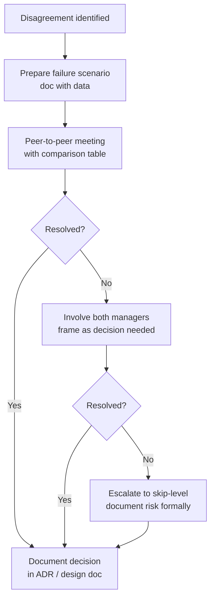

# 2. Leadership, Mentoring, Conflict and Influence

> **TL;DR:** What actually changes when you become a Technical Lead, and how to handle the scenarios interviewers probe: delegation, conflict, mentoring, hiring, org adoption, and managing up.

**Interview weight:** P0 — every Technical Lead interview has 4-8 leadership scenario questions. Thin answers here end candidacies regardless of technical depth.

---

## Core Concepts

- **Technical Lead** — sets technical direction, raises the bar on quality, removes blockers for others; not the person who writes the most code.
- **Leading without authority** — influence through data, early alignment, and visible wins; not through title.
- **Delegation** — choosing the right task for the right person; not offloading everything and not micromanaging.
- **Disagree and commit** — make your case with data, then fully support the chosen path once the decision is made.

---

## Senior IC vs Technical Lead: What Changes

| Aspect | Senior IC | Technical Lead |
|--------|-----------|----------------|
| Scope | Own component or service | Own system and team output |
| Success metric | My features shipped, my code quality | Team velocity, unblocked engineers, system reliability |
| How you spend time | ~70% coding, ~30% review/design | ~30–40% coding, ~60% design/review/coordination |
| Failure mode | Code is wrong or late | Team is blocked and you didn't notice; bad architectural decision propagates |
| Relationship with ambiguity | Ask for clarity | Create clarity for others |
| Code review | Reviewer | Sets the bar; trains reviewers |
| Stakeholder comm | PM updates on your tasks | Represent the whole team's status and risks |
| Hiring | Occasionally on panel | Owns bar-raising; writes rubrics |

---

## Leading Without Authority: Influence Tactics

- **Data over opinion** — pre-compute failure scenarios, latency models, cost estimates before the meeting.
- **Solve their problem too** — align proposals to the other team's success metrics, not just yours.
- **Early alignment** — share a design doc 48 hours before a review; avoid ambushes.
- **Visible wins** — ship a small thing that proves the approach works before asking for broad adoption.
- **Champions** — identify one enthusiastic adopter per adjacent team; let them carry the message internally.
- **Named escalation path** — if agreement is blocked, name the decision owner and timeline. Don't let ambiguity persist.

---

## Delegation Decision Table

| Task type | Delegate? | To whom | Your role |
|-----------|-----------|---------|-----------|
| Well-scoped feature, clear requirements | Yes | Mid-level or senior IC | Reviewer and unblocked |
| Ambiguous feature, unclear requirements | No (initially) | Write the requirements, then delegate | Design owner, then reviewer |
| Critical path, on-call, production fire | No | You or most senior on-call | Owner; loop in team for learning |
| New technology evaluation | Yes, with constraints | Engineer who expressed interest | Set evaluation criteria; review outcome |
| Cross-team negotiation | Rarely | Only if engineer has context and stakes are low | You own high-stakes cross-org decisions |
| Performance review writing | Never | N/A | You own this entirely |
| Boilerplate, low-stakes tooling | Yes | Junior engineer; good growth opportunity | Light review |

---

## Setting Technical Direction and Getting Buy-In

1. **Write the design doc first.** Verbal proposals evaporate; written proposals get reviewed and remembered.
2. **Include alternatives with explicit rejection reasons.** Reviewers trust a doc more when they see you considered other options.
3. **Pre-align with skeptics before the review meeting.** Surprises in design reviews produce resistance, not decisions.
4. **Use a comparison table for competing approaches** — forces concrete criteria, prevents abstract debate.
5. **Make the non-goals explicit.** "We are not solving X in this proposal" prevents scope creep and grounds the discussion.
6. **Get written sign-off on the chosen approach.** A Slack "LGTM" is not sign-off; a PR comment on the ADR is.

---

## Running Design Reviews

- Send the doc 48 hours in advance with a stated review focus ("I need input on the partition key strategy and the rollout plan").
- Start the meeting with a 2-minute summary, not a read-through.
- Assign a note-taker for open questions.
- Timebox: 30 minutes for the design, 15 minutes for open questions.
- End with explicit next actions and owners, documented in the doc's "Open Questions" section.
- Don't defend the design; synthesize feedback into decisions.

---

## Code Quality and Bar-Raising

- **PR template** — required fields: test plan, rollback plan, observability change, migration script (if schema changes). PRs missing these fields are not mergeable.
- **Review for the right things** — correctness and design in the first pass; style nits only as comments, never as blockers.
- **Pair on hard problems early** — a 30-minute pairing session catches design issues cheaper than a 10-round review cycle.
- **Linting gates in CI** — subjective debates belong in the style guide, not in code review. If a rule matters, automate it.
- **Post-mortems as learning artifacts** — blameless, published, linked from the service runbook.

---

## Mentoring and Growth

### 1:1 Structure
Use a consistent three-question format every week:
1. What went well?
2. What was hard or blocked?
3. What do you need from me?

Reserve one 1:1 per month for career growth: current level expectations, gaps, 90-day goals.

### Feedback Models

**SBI — Situation, Behavior, Impact:**
> "In the design review on Tuesday [S], you interrupted the architect before they finished the question [B]. Two reviewers stopped engaging for the rest of the session [I]. In the next review, wait for the full question before responding."

**Radical Candor principle:**
- Care personally + challenge directly. Neither "ruinous empathy" (kind but vague) nor "obnoxious aggression" (blunt but dismissive) serves growth.

### Growth Plans
- Set one 60-day behavioral goal + one 60-day technical goal per engineer.
- Make the goal observable: "Deliver one ambiguous feature end-to-end without asking me to write the requirements" is observable. "Be more independent" is not.
- Check in every two weeks against the goal; adjust before the deadline, not after.

### Handling an Underperformer
1. Name the pattern early — first instance in 1:1 with a written note.
2. Distinguish skill gap (coachable) from motivation/fit gap (different conversation with manager).
3. 60-day written improvement plan with named milestones and support offered.
4. If no improvement: escalate to manager with full documented record. Do not surprise HR.
5. Never let the situation drift — it harms the underperformer, the team, and your credibility.

### Retaining a Strong Performer
- Give them the hard, visible problems first.
- Sponsor them publicly — attribute their wins to them, not to the team.
- Create ownership, not just tasks: they own the design, the quality, and the communication for a component.
- Discuss their growth trajectory explicitly; don't assume they know you're advocating for them.

---

## Conflict Resolution

### Disagree and Commit
- Make your case once, with data and failure scenarios.
- If overruled: document your position in the decision record, then fully support the chosen path.
- Do not relitigate in execution; do not do passive-aggressive half-support.
- If the decision proves wrong: revisit with new data, not "I told you so."

### Escalation Path
- Attempt resolution peer-to-peer first (with data).
- If unresolved after two attempts: involve both managers, framed as "we need a decision owner, not a mediator."
- If unresolved at manager level: document the risk and let the skip-level decide.
- Never let a technical disagreement become a people conflict.

### Conflict Resolution Flowchart

### Conflict Types and Approaches

| Conflict type | Approach | What not to do |
|---------------|----------|----------------|
| Technical approach disagreement | Model failure scenarios; comparison table; let data decide | Argue from authority or seniority |
| Priority disagreement with PM | Map your priority to business impact; give the PM the language to defend it | Accept without raising the risk |
| Cross-org integration design conflict | Offer to solve their problem too; write the PR for them | Block with "no" and no alternative |
| Disagreement with your manager | State your position once with data; document it; commit | Relitigate in execution; sulk |
| Underperformer peer affecting your team | Name it to your manager early, with examples | Absorb the work silently; let it fester |

---

## Managing Up and Pushing Back on Deadlines

- **State the risk, not just the objection.** "That timeline is unrealistic" is an opinion. "Shipping on that date with incomplete retry logic puts 99.99% SLO at risk during the holiday traffic spike" is a risk.
- **Offer a tiered option.** MVP scope by the deadline + full feature two weeks later. Give leadership a choice, not a refusal.
- **Document the decision.** If the deadline is imposed over your objection, write the risk in an email so there's a record if it goes wrong. Do not be passive-aggressive; be professional.
- **Give early signals.** Never surprise a manager the day before a deadline. Signal scope risk at the earliest point you see it.

---

## Prioritization Under Constraints

- **Cut scope, not quality.** Cutting corners on correctness creates on-call debt. Cutting features is recoverable.
- **Negotiate non-goals.** Make explicit what you are not building in the sprint; get PM sign-off. Unscoped work re-enters the sprint as interrupts.
- **Protect the critical path.** Identify the three tasks that block everything else; nothing pre-empts those.
- **Use a priority matrix.** Impact × urgency; anything low-impact/low-urgency gets deferred without guilt.

---

## On-Call, Burnout, and Team Health

- **Sustainable rotation.** No engineer should be on-call solo more than once per 3-4 weeks.
- **Runbooks reduce cognitive load.** Every on-call incident should be answerable by a runbook, not by memory.
- **Post-mortems, not blame.** Ask "what in the system made this failure possible?" before asking "who made this mistake?"
- **Watch for burnout signals:** declining review quality, missed standups, short answers in 1:1. Address early.
- **Recovery after a hard incident:** give the on-call engineer a day of no-meeting time; acknowledge the effort publicly.

---

## Hiring and Interviewing

### Bar-Raising Principles
- Define the bar before the interview, not during debrief.
- Every interviewer scores independently before the debrief call; no anchoring on the first opinion shared.
- "Not a hire" requires a specific behavioral observation, not a vibe.
- Probing for first-principles thinking over memorized answers; the former scales to unknown problems, the latter doesn't.

### Structured Interview Design
- Define five scored dimensions per round: problem decomposition, correctness, edge cases, communication, leadership signal (for senior+).
- Use the same problem across candidates in the same position window.
- Require written post-interview notes within one hour while memory is fresh.
- Debrief within 24 hours; delay causes anchoring on the loudest voice.

### Avoiding Bias
- Separate "culture add" from "culture fit" — the former is a valid screen; the latter is a bias magnet.
- Push back on "I just didn't feel confident in them" without behavioral evidence.
- Include at least one underrepresented reviewer on senior panels when possible.

---

## Incident Leadership and Blameless Culture

- In an active incident: **mitigate first, root-cause second.** A 30-minute workaround buys time for proper analysis.
- Assign one Incident Commander — the person coordinating, not necessarily the person debugging.
- Communicate status every 15 minutes in the incident channel. Silence breeds escalation.
- Post-mortem structure: timeline, contributing factors, mitigations applied, action items, lessons. No "who" in the contributing factors section.
- Action items from post-mortems must be tracked in ADO with owners and due dates. Untracked action items disappear.

---

## Driving Org-Wide Platform Adoption: Playbook

| Phase | Actions | Success signal |
|-------|---------|----------------|
| Pilot | One team, you embedded, high-touch support | Team ships with the platform; public testimonial |
| Champions | Identify 1 enthusiastic user per adjacent team; give them early access and docs | Champions present to their own teams |
| Documentation | Self-serve guide: quickstart in under 15 minutes, FAQ, runbook | New user ships without asking you |
| Self-serve | Remove need for you to be involved in onboarding | Adoption grows without your time |
| Metrics | Publish usage dashboard publicly | Teams use it as social proof; laggards see the trend |

---

## Cross-Org Stakeholder Management: 5 Partner Orgs

- **Shared ADO board** for cross-org dependencies — not Slack; makes blockers visible on a cadence instead of in real-time fire drills.
- **Weekly sync with a fixed agenda:** risk items, blockers, and next-milestone status. Cap at 30 minutes.
- **Named DRI per integration point.** Every API, every data contract, every SLA has a named owner from each org.
- **Document the decisions.** Design reviews with partner teams produce ADRs that both teams sign off on. Verbal agreements disappear.
- **Anticipate misalignment.** If a partner org's sprint plan doesn't include your integration work, their PM doesn't know it's blocking you. Escalate early, not at the deadline.

---

## Culture Contributions

- 6-year Culture Champion at Xbox: organized team events, facilitated retrospectives, advocated for blameless post-mortems.
- Ran structured interview calibration sessions to reduce panel-to-panel variance.
- Wrote and maintained the team's engineering principles document (updated annually with the team's input).
- Pushed for blameless post-mortem culture explicitly — wrote the template, ran the first three, then handed it off.

---

## Interview Questions

**Q1. What's the difference between a senior engineer and a tech lead?**
A: A senior engineer is accountable for their code being correct and shipped. A tech lead is accountable for the team's output and the system's direction. In practice that means I spend more time on design reviews, cross-org coordination, and unblocking engineers than on writing code myself. I measure my success by whether the team is moving well and the architecture is heading in the right direction — not by my personal commit count.

**Q2. How do you lead engineers who are more experienced than you in some areas?**
A: I try to be explicit about it. If an engineer has deeper expertise in a specific area, I delegate the design in that area to them and act as a reviewer and decision facilitator, not an override. I've found that engineers respect a lead who knows what they don't know and routes decisions to the right person more than one who pretends to know everything. My job is to set the overall direction and quality bar, not to be the smartest person in every technical sub-domain.

**Q3. Tell me about a time you had to push back on a deadline from a PM or manager.**
A: On the Sales Campaign Authoring Platform, finance added stacking discount rules two months into development. The launch date was fixed. I analyzed the scope, built a tiered proposal — MVP scope by launch date, full rules three weeks later — and presented both options with the business risk of each. PM chose the MVP path. The platform shipped on time, full rules followed three weeks later, tied to $5M quarterly revenue impact. Key: I gave leadership a choice, not a refusal.

**Q4. How do you give feedback to an engineer who is underperforming?**
A: I use SBI — Situation, Behavior, Impact. I name the specific observable behavior in a specific situation, and the concrete impact it had. I give this feedback in 1:1, not in public. I write a brief note afterward so we have a shared record. If the pattern continues, I escalate to a 60-day written improvement plan with named milestones. The goal is clarity, not surprise. Engineers can act on specific observations; they can't act on "you need to improve."

**Q5. How do you handle a strong engineer who wants to do things their way?**
A: I start by being curious about their approach rather than correcting it. Sometimes "their way" is better. If I disagree after understanding it, I model the failure scenario or the trade-off in writing and have a direct conversation. If they still want to proceed, I ask them to prototype it and define a checkpoint where we evaluate together. Strong engineers respond to data and genuine engagement. Overriding a strong engineer without engaging their reasoning is how you lose them.

**Q6. How do you drive adoption of a platform or standard across an org?**
A: I follow a pilot-to-champions-to-self-serve playbook. Start with one team where I'm embedded, high-touch, and make them successful. Then identify one enthusiastic user in each adjacent team and give them early access. Those champions carry the message internally better than I can. Build self-serve documentation next — if adoption requires me to be present, it won't scale. Finally, publish usage metrics publicly; social proof is underrated as a change mechanism.

**Q7. Tell me about a time you changed a team's engineering culture.**
A: On my team I introduced blameless post-mortems. The first time a significant incident happened, I ran the post-mortem myself, wrote the timeline and contributing factors without naming individuals, and published it to the team. I then ran the second and third ones with the team facilitated. After three cycles engineers were running them themselves and asking for the format. The key was modeling it before mandating it.

**Q8. How do you balance technical depth with leadership breadth?**
A: I protect roughly 20-30% of my time for hands-on technical work — usually the hardest or most ambiguous problem on the current backlog. This keeps my technical judgment current and earns credibility with engineers who can see I haven't drifted purely into meeting management. For the rest, I invest in design reviews, unblocking, and cross-org coordination. The split isn't fixed; during a critical incident I'm fully in the technical space. During a planning cycle I'm mostly in the coordination space.

**Q9. How do you handle a conflict with a peer team's technical lead?**
A: I prepare before the meeting — model the failure scenarios, build a comparison table, anticipate their objections. Then I go in with "let me model the failure scenarios and come back in two days" rather than "no." Peer leads respond to data. I also try to frame the alternative as solving their problem too, not just avoiding my risk. If we still can't agree after two attempts I involve our respective managers, framed as "we need a decision owner." I never let it become a personal conflict.

**Q10. How do you decide what to delegate and what to keep yourself?**
A: I delegate well-scoped work with clear requirements to engineers at the right level. I keep ambiguous, critical-path, and cross-org decision work myself until the requirements are clear enough to delegate. I also keep performance review writing, high-stakes technical decisions, and production incident leadership myself — those aren't delegatable. The heuristic I use: if the cost of a mistake is reversible and the engineer will learn from the work, delegate. If the cost of a mistake is hard to reverse or the stakes are org-visible, keep it.

**Q11. How do you retain a high-performing engineer?**
A: Give them the hard, visible problems. Attribute their wins publicly. Give them ownership of a system or component, not just tasks. Discuss their career trajectory explicitly and advocate for them in reviews. High performers leave when they feel like they're executing someone else's plan. I try to make their work feel like their own initiative with my support, not my work that they're helping with.

**Q12. What does a good design review look like?**
A: Doc sent 48 hours in advance with a stated review focus. The author opens with a 2-minute summary — not a read-through. Reviewers engage with the hardest questions first: alternatives considered, failure modes, rollback plan. A note-taker captures open questions. The meeting ends with explicit decisions and owners, documented in the doc. Author updates the doc and sends a "final" version within 24 hours. I've found that pre-aligning with skeptics before the meeting is the single highest-value step — surprises in reviews produce resistance, not decisions.

**Q13. How do you handle an engineer who is consistently late on commitments?**
A: First I look for the cause. Is the work under-scoped (planning problem)? Is the engineer struggling technically (skill gap)? Is there interrupt load from on-call or cross-team asks (environment problem)? The intervention is different in each case. If it's a pattern across causes, I have a direct 1:1 conversation using SBI and set a 30-day observable target. I don't let it drift past one sprint without naming it.

**Q14. How do you communicate risk to leadership?**
A: I quantify the risk where possible. "The retry logic isn't complete" is vague. "We're missing retry logic on the Service Bus consumer; during a downstream outage we'll lose roughly 5% of content ingestion events per hour until someone notices, estimated time-to-detect based on our alert thresholds is 4 hours" is actionable. I also bring a mitigation option alongside the risk — leadership responds better to "here's the risk and here's what I need to fix it" than to raw problem statements.

**Q15. Tell me about your approach to technical hiring.**
A: I build structured rubrics with five scored dimensions before the interview. I calibrate with co-interviewers on the first two candidates to align on what a "strong hire" looks like for each dimension. During debrief, everyone shares scores independently before discussion to reduce anchoring. I push back on "culture fit" rejections without behavioral evidence. I look for first-principles reasoning over pattern-matching — candidates who can reason from constraints to solutions on novel problems will handle the problems we don't know are coming.

---

## Quick Recap

- Tech lead success = team unblocked + architecture direction sound; not personal commit count.
- Lead without authority via data, early alignment, visible wins, and peer champions.
- Delegate scoped work; keep ambiguous/critical-path/cross-org decisions until requirements are clear.
- SBI feedback: Situation + Behavior + Impact. Observable, specific, actionable.
- Conflict resolution: failure scenarios → peer meeting with comparison table → joint manager decision. Never let it drift.
- Platform adoption: pilot → champions → docs → self-serve → public metrics.
- On-call health: sustainable rotation, runbooks, blameless post-mortems, recovery time after hard incidents.
- Hiring: rubric before the interview, independent scoring, behavioral evidence required for rejection.
