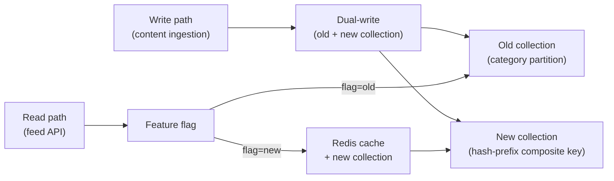

# 3. Communication, Design Docs and Stakeholders

> **TL;DR:** How to explain hard technical decisions to any audience, write design docs that get decisions made, and run architecture reviews — all illustrated from real project experience.

**Interview weight:** P0 — interviewers at Technical Lead level ask communication and design-doc questions in nearly every behavioral round, and some companies run a dedicated "collaboration and communication" round.

---

## Core Concepts

- **BLUF** — Bottom Line Up Front. Lead with the conclusion; provide supporting detail below. The opposite of how engineers are trained to think (context first, conclusion last).
- **Pyramid principle** — main point at the top, supporting arguments below, evidence at the bottom. Applies to docs, emails, and verbal updates.
- **Tailored depth** — same information lands differently depending on whether the audience is an executive, a PM, a peer engineer, or a junior. Adjust vocabulary, detail level, and framing per audience.
- **Design doc purpose** — get a decision made, not demonstrate technical thoroughness.

---

## Explaining Technical Trade-offs to Non-Technical Stakeholders

### The Core Technique
1. **Name the business consequence**, not the technical mechanism.
2. **Use a physical or everyday analogy** for the mechanism.
3. **Quantify the trade-off** in terms the audience cares about (time, money, risk, user experience).
4. **Present a recommendation**, not a menu of equally-valid options.

### Worked Example 1: Explaining Eventual Consistency

**To an engineer:** "Cosmos DB with session consistency gives you monotonic reads within a session but allows stale reads across sessions for up to a few hundred milliseconds."

**To a PM:** "When a publisher updates a game announcement, some players might see the old version for up to a second before all servers pick up the change. In practice this is invisible because players aren't simultaneously reading the same item from different devices. If we needed every player to see the update instantly we'd need stronger consistency, which would triple our database cost and increase read latency from 10 ms to 60 ms."

**To an executive:** "Our news feed is designed to be fast and cheap. The trade-off is that in rare cases a player might see an update a second late. We chose this because the cost of instant-everywhere consistency was three times higher and the user impact was invisible in testing. We can change this if the business requires real-time guarantees."

### Worked Example 2: Explaining Technical Debt

**To a PM:** "Our content ingestion service has three places where we manually handle retry logic differently. When something breaks at 2 AM, the on-call engineer has to know which retry path they're in before they can fix it. That adds roughly 30 minutes to our average incident resolution time. Standardizing to one retry pattern is a three-day effort that will reduce that 30-minute overhead permanently."

**To an executive:** "We have some older code that makes our on-call harder than it needs to be. Fixing it is a three-day investment with a clear payoff: faster incident resolution and lower on-call burden for the team. I'm scheduling it for next sprint."

### Worked Example 3: Explaining Why a Migration Takes a Quarter

**To a PM:** "We're re-partitioning the Cosmos DB collection to fix the latency. The migration itself is a weekend; the quarter is for the safety work around it: dual-write mode to allow rollback, staging validation, runbook writing, monitoring, and the partner API updates that depend on the schema. Cutting those safety steps means a higher chance of a live-site incident during the busiest gaming season."

**To an executive:** "The Cosmos migration is a quarter because we're doing it without any player-visible downtime or risk to our 99.99% SLO. The technical change is fast; the careful change management takes time. Given that this platform serves 7 million players, the slower approach is the right one."

---

## Audience Depth Table

| Audience | Vocabulary | Detail level | What they care about | How to open |
|----------|------------|-------------|----------------------|-------------|
| Executive | Business outcomes, risk, cost | 2–3 sentences; no jargon | Revenue, risk, timeline | "Here's the decision I'm recommending and why" |
| PM / Program Manager | Features, timelines, user impact | 1 paragraph; named trade-offs | Scope, dates, quality | "Here's the impact on the roadmap and what we're trading off" |
| Peer engineer (different domain) | System-level concepts, no domain jargon | Technical depth; alternatives | Correctness, coupling, failure modes | "Here's the design and the hardest decision we made" |
| Junior engineer | Concrete examples, no assumed context | Step-by-step; explain rationale | What to do next; why | "Here's what we're doing and why we made these choices" |

---

## BLUF Structure

Write emails, status updates, and design doc summaries in this order:

```
[1 sentence: what you need or what changed]
[1–2 sentences: why it matters now]
[bullet list: key facts or supporting detail]
[call to action or next step]
```

BAD: "Over the past two weeks we've been investigating the Cosmos DB performance issues. The root cause turned out to be partition hot spots. We've modeled several alternatives. The one that makes the most sense is a composite partition key. I'm planning to implement this next sprint."

GOOD: "I'm recommending a Cosmos DB partition redesign to fix the 600ms p99 latency issue — needs PM sign-off by Friday to make next sprint.  Root cause: hot partitions on top-3 content categories consuming 71% of RU budget. Proposed fix: composite partition key with hash prefix. Estimated outcome: p99 ≤150 ms, -87% gateway load, zero downtime if we use dual-write. Full design in the linked doc."

---

## Design Doc Template

```markdown
## [System / Feature Name] — Design Document

**Author:** [Name]  **Date:** [Date]  **Status:** Draft / In Review / Approved  
**Reviewers:** [Names and teams]

### Context
One paragraph: what exists today, what is broken or missing, and why this matters now.

### Goals
- [Outcome 1: measurable]
- [Outcome 2: measurable]

### Non-Goals
- [Explicit out-of-scope item 1]
- [Explicit out-of-scope item 2]

### Requirements
| Requirement | Type | Priority |
|-------------|------|----------|
| p99 read latency ≤ 200 ms | Non-functional | P0 |
| Zero player-visible downtime during migration | Non-functional | P0 |
| Schema supports sort field on all documents | Functional | P0 |

### Constraints
- Budget: [RU/s, cost envelope]
- Timeline: [sprint or date constraint]
- Team: [available engineers and skills]
- Compatibility: [existing APIs or clients that must not break]

### Proposed Design
[2–4 paragraphs or mermaid diagram. Describe the solution, the data model, the key components, and the flow.]

### Alternatives Considered

| Alternative | Why rejected |
|-------------|-------------|
| [Alt 1] | [Concrete reason: cost, complexity, failure mode] |
| [Alt 2] | [Concrete reason] |

### Trade-offs
- **[Trade-off 1]:** [What we gain / what we give up]
- **[Trade-off 2]:** [...]

### Risks and Mitigations
| Risk | Likelihood | Impact | Mitigation |
|------|-----------|--------|-----------|
| [Risk 1] | Medium | High | [Mitigation] |

### Rollout Plan
1. Deploy to staging; run read-simulation for 48 hours.
2. Enable dual-write to new and old collections.
3. Validate new collection for 48 hours under production traffic.
4. Flip read path via feature flag.
5. Monitor for 72 hours; kill switch available for 5-minute rollback.
6. Remove old collection after 2-week hold period.

### Success Metrics
- p99 read latency ≤ 200 ms sustained for 2 weeks post-cutover.
- Gateway RU consumption reduced by ≥ 70%.
- Zero support tickets attributable to migration.

### Open Questions
| Question | Owner | Due |
|----------|-------|-----|
| [Question 1] | [Name] | [Date] |
```

---

## Worked Design Doc Example: Cosmos DB Partition Redesign



**Context:** Publisher News Feed Cosmos collection partitioned by content category. Top 3 categories = 71% of RU consumption. p99 latency = 600 ms vs 200 ms target.

**Goal:** Reduce p99 ≤ 150 ms; reduce gateway load by ≥ 70%; zero-downtime.

**Non-goals:** Changing the REST API contract; migrating other collections.

**Proposed design:** Composite partition key = `hash(publisherId) + contentType`. Dual-write migration with feature-flag read-path flip. Redis cache on new collection's hot paths.

**Alternatives considered:**

| Alternative | Why rejected |
|-------------|-------------|
| Increase RU/s on current collection | Treats the symptom; cost scales linearly; hot-partition reads still slow |
| Partition by publisherId only | Hot partition risk for major publishers (top 5 publishers = 60% of content) |
| Read replica with eventual consistency | Adds infra complexity; doesn't fix write-path hot-partition cost |

**Result of this design:** p99: 600 ms → 150 ms. Gateway load: −87%. Migration completed in one weekend with no player-visible downtime.

---

## Architecture Decision Records (ADRs)

- **Format:** Title, Date, Status (Proposed/Accepted/Deprecated), Context, Decision, Consequences.
- **When to write one:** Any decision that is hard to reverse or will surprise a future reader of the codebase.
- **Where to store:** `/docs/adr/` in the repo. Linked from the relevant service README.
- **What not to record:** Reversible decisions, obvious choices with no real alternatives.

**Minimal ADR template:**
```markdown
# ADR-001: Composite partition key for Publisher News Feed Cosmos collection

**Date:** 2024-03-15  
**Status:** Accepted

**Context:** Category-based partition key producing hot partitions at scale.

**Decision:** Use composite key `{hash(publisherId)}-{contentType}`.

**Consequences:** Even write distribution. Cross-publisher aggregate queries require fan-out (acceptable — this query pattern is not in the critical path).
```

---

## Running an Architecture Review Meeting and Handling Objections

**Before the meeting:**
- Send the design doc 48 hours in advance.
- State the specific decision you need made: "I need a decision on the partition key strategy and the rollout plan."
- Pre-align with the strongest skeptic — one coffee conversation prevents a 45-minute derailment.

**During the meeting:**
- Open with a 2-minute summary, not a read-through of the doc.
- Use the Alternatives Considered table as your first screen — it shows you've already thought about the common objections.
- When an objection comes: "That's a good point — let me show you the failure scenario I modeled for that case" is more effective than "I already considered that."
- Don't defend; synthesize. "So the concern is X — if we addressed X by doing Y, would that satisfy the concern?"

**Handling specific objections:**

| Objection type | Response strategy |
|----------------|------------------|
| "This is too complex" | Point to the non-goals that keep scope bounded; offer to prototype one component |
| "What about [alternative]?" | Show the alternatives table; if it's new, say "good catch, let me model it before we finalize" |
| "I'm not comfortable with the risk" | Pull up the Risks table; name the specific mitigation; offer a kill switch |
| "This will slow down my team" | Quantify the coordination cost; offer to write the integration adapter for them |
| "We tried something similar before" | Ask for specifics; either incorporate the lesson or explain what's different this time |

---

## Written vs Verbal Communication

| Situation | Prefer written | Prefer verbal |
|-----------|----------------|--------------|
| Major technical decision | Yes — creates a record; enables async review | Complement with a short call for contentious decisions |
| Incident mitigation | Verbal (Slack channel) + written status every 15 min | — |
| Feedback to an engineer | Verbal first; follow up with written summary | — |
| Status update to stakeholders | Written (email or ADO comment) | Only if stakeholder explicitly requests a call |
| Negotiating requirements | Verbal to build rapport; written to confirm | — |
| Design review objection | Written pre-work; verbal discussion; written outcome | — |

---

## Status Updates and Escalation During Incidents

**Incident update cadence:**
- Every 15 minutes while active: status (investigating/mitigating/resolved), what we know, what we're doing, ETA if known.
- Never say "working on it" without a next state or action.
- Escalate proactively: "This will not be resolved by the SLO window; here's the mitigation and the estimated full resolution time."

**Template:**
```
[STATUS: INVESTIGATING | MITIGATING | RESOLVED] — [Time]
Impact: [what users see]
Root cause hypothesis: [current best guess]
Action taken: [what was deployed/changed]
Next action: [what happens next and when]
ETA to resolution: [time or "unknown — will update in 15 min"]
```

---

## Saying "I Don't Know" Well

- Never bluff. Senior interviewers know when you're reconstructing an answer you don't have.
- The correct structure: "I don't know the exact answer to that, but here's how I'd reason about it / find the answer: ..."
- Demonstrate the thought process: "I know Cosmos DB partition size limits are 20 GB — I'd need to look up whether that includes index storage or excludes it."
- This is more impressive than a confident wrong answer.

---

## Whiteboard / Virtual Interview Communication Technique

1. **Clarify before designing.** Ask 2-3 scoping questions before drawing anything: scale, latency requirements, read/write ratio, must-haves vs nice-to-haves.
2. **Signpost.** "I'm going to start with the write path, then come back to reads." Don't leave the interviewer guessing where you are.
3. **Think out loud.** State trade-offs as you encounter them: "I could use Cosmos here, or Redis — let me reason through the access pattern before deciding."
4. **Check in.** "Does this level of detail work for you, or should I go deeper on the caching layer?"
5. **Name what you're deferring.** "I'm going to skip error handling in the diagram for now and come back to it — want to make sure the happy path is right first."

---

## Clarifying Questions (Requirements Negotiation)

- Ask before designing; assumptions made in silence become wrong designs.
- Five essential questions for any system design: Scale (RPS, users, data volume)? Latency SLA? Write vs read ratio? Consistency requirement? Must-haves for MVP?
- For behavioral: "Is the focus of the question more on the technical decision or the stakeholder communication?" gives you permission to go to the right depth.

---

## Remote / Async Communication

- **Default to over-communication in async.** A Slack message that requires a reply is a synchronous interrupt. Write it fully enough that the reply is optional.
- **Use threads, not new messages**, for continued discussion — preserves context.
- **Decisions made async must be recorded.** A design decision made in a Slack thread is unrecoverable six months later. Move it to the design doc or ADR.
- **Time-zone-aware scheduling.** Give colleagues in other time zones the first slot, not the last.

---

## Interview Questions

**Q1. Tell me about a time you had to explain a complex technical trade-off to a non-technical stakeholder.**
A: When we decided to use eventual consistency on the Publisher News Feed, our PM was worried players would see stale data. I explained it like this: "When a publisher posts a patch note, it takes up to a second for every server to pick up the change. In practice, players aren't simultaneously reading the same post from different devices. The trade-off is this: strong consistency costs three times more and adds 50ms of latency per read. Eventual consistency is invisible to users 99.9% of the time." PM was satisfied; we shipped with eventual consistency. The key was quantifying "invisible" rather than just asserting it.

**Q2. How do you write a design doc that actually gets decisions made?**
A: A few principles I've learned. First, lead with the context and the specific decision needed — not the technical background. Second, always include an alternatives table with explicit rejection reasons; reviewers trust a doc more when they see you considered other options. Third, make the non-goals explicit — they prevent scope creep in the review meeting. Fourth, end with open questions with named owners and due dates. If a doc doesn't produce decisions and owners, it was a document, not a design doc.

**Q3. How do you handle it when a design review gets derailed?**
A: The most effective prevention is pre-aligning with the strongest skeptic before the meeting — one 20-minute coffee conversation prevents a 45-minute derailment. In the meeting itself, when a contentious objection comes up I say "let me capture that in the open questions and we can address it offline" if it's a rabbit hole, or "let me show you the failure scenario I modeled for that case" if it's something I've already thought through. I try to end every meeting with at least one explicit decision, even a partial one.

**Q4. How do you communicate technical risk to leadership?**
A: I quantify the risk in business terms. Not "the retry logic is incomplete" but "during a downstream outage we'll lose roughly 5% of ingestion events per hour; based on our alert thresholds, estimated time-to-detect is 4 hours, meaning up to 20% of events could be lost before we intervene." I pair it with a mitigation option and a cost estimate: "fixing this is a two-day effort before launch." Leadership responds to risks with price tags. They can make a decision. They can't make a decision on vague concern.

**Q5. Tell me about a time your written communication prevented a problem.**
A: During the CVE remediation across 600+ microservices, I sent a daily status update table — total affected, P0 fixed, P1 fixed, open blockers — to the stakeholder channel. This prevented the 40-person channel from becoming a continuous status-query noise storm and made blockers visible before they became emergencies. Two teams proactively unblocked themselves after seeing their service listed as a P0 open item. The format was adopted for the next security wave.

**Q6. How do you adapt your communication style for different audiences?**
A: I think about what success looks like for the person I'm talking to. An executive wants to know the risk and the recommendation — not the technical mechanism. A PM wants to know the scope and timeline impact. A peer engineer wants to know the failure modes and alternatives. A junior wants to know the rationale behind the decision. I try to open every conversation at the level they care about and only go deeper if they ask.

**Q7. What makes a good ADR?**
A: It captures the decision, the context that made it hard, and the consequences — including what it forecloses. A good ADR is written at the moment of decision, when the tradeoffs are fresh. It should be readable six months later by someone who wasn't there and give them a clear answer to "why did we do it this way?" It should be short: a page is enough. It's not a design doc; it's a decision record.

**Q8. How do you handle a stakeholder who keeps changing requirements mid-project?**
A: I try to trace the change to the underlying business need. Often a changing requirement is a proxy for an unstated constraint or fear. I interview the stakeholder to understand the actual need, then write it down formally and get sign-off before changing any code. The Sales Campaign stacking rules is a good example: "discounts should stack correctly" was the stated requirement; the actual business rules were eight distinct constraints I extracted through a two-day requirements session. The formal doc prevented further mid-flight changes because stakeholders had already signed off on a specific scope.

**Q9. Tell me about a time you had to say "I don't know" and how you handled it.**
A: In an architecture review, a senior engineer asked me for the exact RU/s cost of a cross-partition query at our scale. I didn't have the number. I said "I don't have that exact figure — I modeled the partition heat map but didn't convert it to per-query RU cost. Let me run the benchmark on the shadow collection and bring back the number tomorrow." I came back the next day with the measurement. That's more useful than a number I made up. The lesson: "I'll measure and come back" is a stronger answer than a confident approximation.

**Q10. How do you approach technical writing for async audiences?**
A: I write every doc assuming the reader has 5 minutes and no context. BLUF at the top: the conclusion and the ask in the first sentence. Supporting detail in bullets below. Alternatives and trade-offs after that. Open questions at the bottom. I treat every async message as potentially the only information the reader will have before making a decision. Over-engineering a Slack message is cheap; under-engineering it costs a meeting.

**Q11. How do you handle pushback on your design in a review?**
A: I separate the objection type. If it's a legitimate alternative I hadn't considered, I capture it and model it before defending my position. If it's a concern I've already addressed in the doc, I point to the relevant section rather than re-explaining verbally — that's usually a signal the reviewer didn't fully read it. If it's a stylistic preference (not a correctness issue), I acknowledge it and move on; those debates don't belong in design reviews. The goal of the review is a decision, not consensus on every detail.

**Q12. What's your approach to status reporting during a project?**
A: Weekly written status with four fields: progress (what shipped), risks (what could slip and why), blockers (what I need), and next milestone. I send it proactively on a fixed cadence — I don't wait to be asked. I use a consistent format so stakeholders build the habit of reading it. Surprises in status updates are failures of communication, not of work. If something is slipping I say so at the earliest moment I see it, with the revised estimate and the options.

---

## Quick Recap

- BLUF structure: conclusion first, supporting detail below, call to action last. Never bury the lede.
- Audience table: executive (business risk), PM (scope/date), peer (failure modes), junior (rationale).
- Design doc purpose = get a decision made. Include: goals, non-goals, alternatives rejected, risks, rollout, success metrics.
- ADR = hard-to-reverse decisions with context + consequences. One page. Written at decision time.
- Whiteboard technique: clarify → signpost → think out loud → check in → name deferrals.
- Incident comms: every 15 minutes, fixed template, always name next action and ETA.
- "I don't know, here's how I'd find out" beats a confident wrong answer every time.
- Pre-align with the strongest skeptic before any design review meeting.
